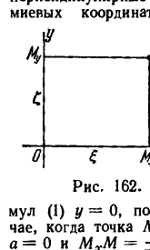

## 4. Внутренняя геометрия поверхности и задача Бельтрами

---
**стр. 536**
---

$F$ будет равно нулю в том и только в том случае, когда сеть координатных линий
$$u = \text{const},$$
$$v = \text{const}$$
ортогональна. В самом деле, очевидно, направления координатных линий характеризуются дифференциалами $dv$, $du = 0$ и $dv = 0$, $du$, причем в первом случае $dv$, а во втором $du$ являются произвольными переменными. Отсюда и из (II), обозначая через $\varphi$ угол между линиями $u = \text{const}$, $v = \text{const}$, имеем:
$$\cos \varphi = \frac{F}{\sqrt{EG}}.$$
Таким образом, если $\varphi = \frac{\pi}{2}$, то $F = 0$, и обратно.

Исчезновение члена с произведением $d\xi d\eta$ в форме (2) означает, следовательно, ортогональность координатной сети $\xi = \text{const}$, $\eta = \text{const}$.

Дадим геометрическое описание координат $\xi$, $\eta$. Рассмотрим взаимно перпендикулярные оси $Ox$, $Oy$, которые служат для определения бельтрамиевых координат $x$, $y$ (рис. 162).

Пусть $M(x, y)$ — произвольная точка плоскости; опустим из $M$ перпендикуляр на $Ox$ и обозначим его основание через $M_x$. Сравнивая первую из формул (1) $x = \text{th}\,\frac{\xi}{R}$ с первой из формул (4) § 218, видим, что они тождественны. Следовательно, $\xi = OM_x$. Отсюда заключаем, что уравнение $\xi = c$ (где $c$ — постоянная) определяет прямую, перпендикулярную к оси $Ox$. Из формулы (2) находим, что для этой линии $ds^2 = d\eta^2$, или $ds = \pm d\eta$. Интегрирование последнего соотношения дает $M_x M = \pm\eta + a$ ($a = \text{const}$). Полагая во второй из формул (1) $y = 0$, получим соответственно $\eta = 0$. Это означает, что в том случае, когда точка $M$ лежит на оси $Ox$, должно быть $\eta = 0$. Таким образом, $a = 0$ и $M_x M = \pm\eta$. Заметим, наконец, что в силу второй из формул (1) $\eta > 0$, если $y > 0$, и $\eta < 0$, если $y < 0$. Следовательно, число $\eta$ выражает отрезок $M_x M$ с учетом знака по обычному правилу. Числа $(\xi, \eta)$ называются *первыми координатами* точки $M$; числа $(\xi, \zeta)$, с помощью которых в § 218 выражены бельтрамиевы координаты $(x, y)$ (см. также рис. 162), носят название *вторых координат* точки $M$.

В геометрии Лобачевского всегда $\eta \neq \zeta$.

Теперь легко понять, что координатные линии $\xi = \text{const}$ суть прямые, перпендикулярные к оси $Ox$, а координатные линии $\eta = \text{const}$ — ортогональные к ним эквидистанты.

**4. Внутренняя геометрия поверхности и задача Бельтрами**

§ 225. Внутренней геометрией какой-нибудь поверхности называют совокупность таких ее свойств, которые могут быть выявлены при помощи измерений, производимых на самой этой поверхности.

Очевидно, евклидова планиметрия является частным случаем внутренней геометрии, понимаемой в указанном смысле.

Результаты, полученные нами в предыдущих разделах, естественно, выдвигают вопрос: нельзя ли и планиметрию Лобачевского с известной точки зрения рассматривать как внутреннюю геометрию некоторой поверхности пространства Евклида?

---
**стр. 537**
---

Этот вопрос, поставленный в работе Бельтрами «Опыт истолкования неевклидовой геометрии» (1868), будет служить предметом нашего внимания на протяжении ближайших параграфов.

Мы начнем с некоторых простейших фактов дифференциальной геометрии. Хотя большинство из них (если не все) общеизвестно, тем не менее нам представляется целесообразным поступить таким образом, с целью сделать ясной нашу терминологию и тем самым оградить читателя от возможных недоразумений при знакомстве с дальнейшим материалом.

Прежде всего условимся точно, что мы будем понимать под словом «поверхность».

Мы ограничимся простейшим случаем поверхности без самопересечений, которую можно определить как некоторое множество точек пространства (сейчас мы предполагаем пространство евклидовым).

Пусть в евклидовом пространстве дано точечное множество $S$. Если $M_0$ — любая точка множества $S$, то мы будем называть окрестностью точки $M_0$ в множестве $S$ подмножество $U(M_0)$ этого множества, которое является пересечением $S$ с какой-нибудь окрестностью точки $M_0$ в евклидовом пространстве. Дальнейшее определение заключается в требовании наличия окрестностей $U(M)$ точек $M$, обладающих определенными свойствами.

Чтобы описать эти свойства, рассмотрим систему декартовых ортогональных координат с началом $O$ и осями $Ox$, $Oy$, $Oz$ и, отдельно, плоскость с системой декартовых координат $u$, $v$ (мы будем называть её $u,v$-плоскостью).

Множество $S$ будем называть поверхностью, если для каждой точки $M_0$ его существует окрестность $U(M_0)$, в которой все точки имеют координаты, представляемые уравнениями

$$\left.
\begin{aligned}
x &= x(u, v), \\
y &= y(u, v), \\
z &= z(u, v),
\end{aligned}
\right\} \quad (\alpha)$$

причем

1) $x(u, v)$, $y(u, v)$, $z(u, v)$ являются функциями, определенными и однозначными в некоторой области $D$ плоскости $u, v$.

2) Каждой паре чисел $u, v$ из области $D$ уравнения $(\alpha)$ относят точку с координатами $x, y, z$, принадлежащую окрестности $U(M_0)$; разным парам чисел $u, v$ уравнения $(\alpha)$ относят разные точки (т. е. уравнениями $(\alpha)$ устанавливается взаимно однозначное соответствие между точками области $D$ и точками окрестности $U(M_0)$).

3) Функции $x(u, v)$, $y(u, v)$, $z(u, v)$ в области $D$ непрерывны, обладают непрерывными частными производными первого порядка, и ранг матрицы

$$\begin{Vmatrix}
\frac{\partial x}{\partial u} & \frac{\partial y}{\partial u} & \frac{\partial z}{\partial u} \\[6pt]
\frac{\partial x}{\partial v} & \frac{\partial y}{\partial v} & \frac{\partial z}{\partial v}
\end{Vmatrix} \quad (*)$$

равен двум. Смысл последнего условия мы разъясним чуть позже.

Без потери общности будем считать, ради наглядности, что область $D$ является односвязной областью плоскости $(u, v)$. Вместе с тем соответствующая ей окрестность $U(M_0)$ произвольной точки $M_0$ будет односвязной областью на поверхности $S$.

Иногда окрестности, о которых шла речь, называют координатными. Мы не будем осложнять наше изложение этим прилагательным, но в дальнейшем, говоря об окрестностях точек поверхности, будем иметь в виду окрестности именно такого вида.

---
**стр. 538**
---

В некоторых случаях вся поверхность является окрестностью любой своей точки (например — плоскость или параболоид). В общем случае поверхность представляет собой собрание конечной или бесконечной системы областей описанного вида. Таким образом, определяя поверхность, мы допускаем, что множество ее точек может иметь в целом весьма сложное строение, но вблизи каждой точки его структура должна быть в определенных отношениях канонизирована.

Чтобы сделать понятие поверхности более удобным для использования, целесообразно прибавить к ее определению еще условие связности. Это условие можно высказать, например, в следующей форме.

Пусть $U$ и $V$ — какие-нибудь окрестности двух точек поверхности. Мы будем говорить, что эти две окрестности соединяются цепочкой окрестностей, если на поверхности существуют такие точки и такие их окрестности $U_1, U_2, \dots, U_n$, что $U_1$ имеет общую часть с $U$, $U_n$ имеет общую часть с $V$ и окрестности $U_k, U_{k+1}$ имеют общую часть при любом $k = 1, 2, \dots, n - 1$. Поверхность мы назовем связной, если на ней любые две окрестности можно соединить цепочкой окрестностей.

Рассмотрим какую-нибудь область $U$ поверхности $S$, представленную уравнениями вида $(\alpha)$. Каждая точка $M$ области $U$ определяется при помощи уравнений $(\alpha)$ заданием двух чисел $u$ и $v$. Поэтому числа $u, v$ мы будем называть координатами точки $M$ на поверхности и употреблять обычное в аналитической геометрии обозначение: $M(u, v)$. Этим координатам часто дают наименование внутренних.

Исходя из координат $u, v$, можно ввести в области $U$ бесконечно много других внутренних координатных систем. Чтобы это сделать, следует лишь составить какие-нибудь уравнения:

$$\bar{u} = \bar{u}(u, v),$$
$$\bar{v} = \bar{v}(u, v),$$

которые для каждой пары чисел $u, v$ позволяют определить новую пару чисел $\bar{u}, \bar{v}$, причем правые части этих уравнений должны быть подчинены точно тем же ограничениям, которые высказаны в § 224 для уравнений $(*)$.

Мы определяли поверхность с помощью трех уравнений $(\alpha)$. Их можно заменить одним векторным уравнением

$$\mathbf{r} = \mathbf{r}(u, v), \quad (\beta)$$

в левой части которого записан радиус-вектор $\mathbf{r}$ точки $M$ поверхности (т. е. вектор $\vec{OM}$), а в правой — векторная функция с составляющими $x(u, v), y(u, v), z(u, v)$.

Если пользоваться уравнением $(\beta)$, то легко уяснить геометрический смысл условий 3 в приведенном выше определении поверхности. Именно, требуются, во-первых, существование и непрерывность векторов

$$\mathbf{r}_u = \frac{\partial \mathbf{r}}{\partial u} \quad \text{и} \quad \mathbf{r}_v = \frac{\partial \mathbf{r}}{\partial v}$$

и, во-вторых, выполнение неравенства $[\mathbf{r}_u \mathbf{r}_v] \neq 0$, так как составляющими этого векторного произведения являются определители матрицы $(*)$. Последнее неравенство означает, что векторы $\mathbf{r}_u$ и $\mathbf{r}_v$ не коллинеарны; тогда они определяют касательную к поверхности плоскость.

Рассмотрим теперь уравнения вида

$$u = u(t),$$
$$v = v(t);$$

---
**стр. 539**
---

они определяют на поверхности линию (траекторию точки $M(u, v)$ при переменном $t$). Направление этой линии в пространстве дается вектором

$$\frac{d\mathbf{r}}{dt} = \mathbf{r}_u \frac{du}{dt} + \mathbf{r}_v \frac{dv}{dt}.$$

Очевидно, направление линии будет определено, если дано отношение дифференциалов $du : dv$. Поэтому $du : dv$ мы будем называть *параметром направления*.

Введем обычные в дифференциальной геометрии обозначения:

$$\mathbf{r}_u^2 = E, \quad \mathbf{r}_u \mathbf{r}_v = F, \quad \mathbf{r}_v^2 = G.$$

Тогда мы можем найти квадрат дифференциала дуги линии на поверхности, полагая

$$ds^2 = d\mathbf{r}^2 = (\mathbf{r}_u du + \mathbf{r}_v dv)^2 = E\, du^2 + 2F\, du\, dv + G\, dv^2.$$

Кроме того, если $du : dv$ и $\delta u : \delta v$ — параметры двух направлений, которым соответствуют касательные к поверхности векторы $d\mathbf{r}$ и $\delta \mathbf{r}$, то угол $\varphi$ между этими направлениями определяется равенством

$$\cos \varphi = \frac{d\mathbf{r}\,\delta \mathbf{r}}{\sqrt{d\mathbf{r}^2}\sqrt{\delta \mathbf{r}^2}} = \frac{(\mathbf{r}_u du + \mathbf{r}_v dv)(\mathbf{r}_u \delta u + \mathbf{r}_v \delta v)}{ds\,\delta s} =$$
$$= \frac{E\, du\,\delta u + F(du\,\delta v + dv\,\delta u) + G\, dv\,\delta v}{\sqrt{E\, du^2 + 2F\, du\, dv + G\, dv^2}\sqrt{E\,\delta u^2 + 2F\,\delta u\,\delta v + G\,\delta v^2}}.$$

Наконец, как известно из элементарного анализа, если область $U$ поверхности соответствует области $D$ плоскости $u, v$, то площадь области $U$ вычисляется по формуле

$$\sigma = \iint\limits_{(D)} \sqrt{EG - F^2}\, du\, dv.$$

Итак, мы имеем три основных соотношения:

$$ds^2 = E\, du^2 + 2F\, du\, dv + G\, dv^2, \qquad \text{(I)}$$

$$\cos \varphi = \frac{E\, du\,\delta u + F(du\,\delta v + dv\,\delta u) + G\, dv\,\delta v}{\sqrt{E\, du^2 + 2F\, du\, dv + G\, dv^2}\sqrt{E\,\delta u^2 + 2F\,\delta u\,\delta v + G\,\delta v^2}}, \qquad \text{(II)}$$

$$\sigma = \iint\limits_{(D)} \sqrt{EG - F^2}\, du\, dv, \qquad \text{(III)}$$

которые в координатной системе $u, v$ с помощью функций $E(u, v)$, $F(u, v)$, $G(u, v)$ выражают дифференциал дуги, угол между двумя линиями и площадь области. Из этих формул видно, что измерения длин, углов и площадей на поверхности вполне определяются коэффициентами квадратичной формы

$$ds^2 = E\, du^2 + 2F\, du\, dv + G\, dv^2. \qquad \text{(I)}$$

Поэтому говорят, что форма (I) определяет *метрику* поверхности и называют эту форму *метрической*.

Понятно, что с изменением координатной системы меняются коэффициенты метрической формы и одновременно меняются дифференциалы координат, отвечающие какому-нибудь смещению точки по линии, расположенной на поверхности. При этом, если $E, F, G$ — коэффициенты метрической формы в одной системе внутренних координат, $\bar{E}, \bar{F}, \bar{G}$ — коэффициенты в другой системе, а $du, dv$ и $d\bar{u}, d\bar{v}$ — дифференциалы старых и новых

---
**стр. 540**
---

координат, определяемые одним и тем же элементом линии, то

$$E\, du^2 + 2F\, du\, dv + G\, dv^2 \equiv \bar{E}\, d\bar{u}^2 + 2\bar{F}\, d\bar{u}\, d\bar{v} + \bar{G}\, d\bar{v}^2,$$

так как левая и правая части выражают одну и ту же величину $ds^2$.

Зная формулы преобразования координат и $E, F, G$, легко вычислить $\bar{E}, \bar{F}, \bar{G}$. Заметим, что зависимость между $E, F, G$ и $\bar{E}, \bar{F}, \bar{G}$ получается формально алгебраическими выкладками. Поэтому вычисление $\bar{E}, \bar{F}, \bar{G}$ по данным $E, F, G$ можно производить, пользуясь формулами (5) § 221, где мы решали с алгебраической точки зрения точно такой же вопрос, как и сейчас.

Если коэффициенты двух форм связаны соотношениями (5) § 221, то мы будем говорить, что эти две формы переводятся друг в друга преобразованием координат. Такие формы называются *эквивалентными*.

В соответствии с этим определением можно сказать, что метрика каждой поверхности в различных внутренних координатах определяется различными метрическими формами, но все эти формы эквивалентны между собой.

§ 226. Рассмотрим какую-нибудь область $U$ на поверхности $S$ и область $U'$ на поверхности $S'$. Предположим, что между точками области $U$ и точками области $U'$ установлено взаимно однозначное и в обе стороны непрерывное соответствие. Тогда мы будем иметь также соответствие между линиями области $U$ и линиями области $U'$; именно: каждой линии $L$ области $U$ соответствует в области $U'$ линия $L'$, состоящая из точек, соответствующих точкам линии $L$. Точно так же каждой области $V$, лежащей внутри $U$, отвечает на $U'$ область $V'$, состоящая из точек, соответствующих точкам $V$. Фигуру $A'$ (например, линию) из области $U'$, соответствующую фигуре $A$ из области $U$, мы будем называть *образом фигуры $A$*.

Если каждая гладкая дуга $l$ в области $U$ имеет своим образом на $U'$ гладкую дугу $l'$ такой же длины, что и $l$, то соответствие называется *изометричным* или просто *изометрией*. Области $U$ и $U'$, между которыми возможно установить изометричное соответствие, называются *изометричными* друг другу.

Чтобы получить аналитический признак изометричности областей, представим себе, что в области $U$ введены какие-нибудь внутренние координаты $u, v$. В области $U'$ мы введем систему внутренних координат, особым образом связанную с системой $u, v$ области $U$. Именно, с каждой точкой $M'$ на $U'$ мы будем сопоставлять в качестве ее координат два числа, равные координатам в системе $(u, v)$ на $U$ той точки $M$ этой области $U$, которая соответствует точке $M'$. Короче говоря, координатная система в области $U'$ вводится так, что соответствующие точки в $U$ и $U'$ имеют численно равные координаты.

Пусть $E\, du^2 + 2F\, du\, dv + G\, dv^2$ и $E'\, du^2 + 2F'\, du\, dv + G'\, dv^2$ — метрические формы областей $U$ и $U'$ в данных координатах. Рассмотрим соответствующие элементы двух линий на $U$ и $U'$. Они характеризуются одними и теми же дифференциалами $du, dv$. По условию изометрии мы должны иметь:

$$E\, du^2 + 2F\, du\, dv + G\, dv^2 = E'\, du^2 + 2F'\, du\, dv + G'\, dv^2. \qquad (*)$$

Так как выбор пары соответствующих элементов двух линий областей $U$ и $U'$ ничем не ограничен, то в равенстве $(*)$ $du$ и $dv$ являются совершенно произвольными величинами. Поэтому из $(*)$ получаем:

$$E = E', \quad F = F', \quad G = G'.$$

Таким образом, области $U$ и $U'$ в данных координатах $(u, v)$ имеют одинаковые метрические формы. Обратное предложение: если две поверхности имеют одинаковые метрические формы, то они изометричны, — является очевидным.

(Заметим, что в произвольных координатах метрические формы изометричных поверхностей могут не совпадать, но будут эквивалентными.)

---
**стр. 541**
---

Из формул (I)—(III) § 225 следует, что в случае изометрии наряду с равенством длин соответствующих дуг оказываются также равными величины углов между соответствующими направлениями и площади соответствующих областей.

Поэтому все те свойства поверхности, которые могут быть выявлены при помощи производимых на ней измерений, для изометричных поверхностей оказываются одинаковыми. Это дает повод говорить, что изометричные поверхности имеют общую внутреннюю геометрию. Внутренняя геометрия, общая для совокупности изометричных между собой поверхностей, определяется одной метрической формой.

Чтобы наглядно показать, как построить бесконечно много разных поверхностей с общей внутренней геометрией, мы попросим читателя представить себе, что поверхность физически реализована из гибкого, но нерастяжимого материала. Будем деформировать эту поверхность так, чтобы не возникало складок или разрывов. Получаемые таким путем поверхности вследствие нерастяжимости их материала будут изометричны между собой и, следовательно, будут обладать общей внутренней геометрией.

Например, придавая листу бумаги цилиндрическую форму, мы наглядно докажем, что кусок плоскости и некоторая часть цилиндра имеют одинаковую внутреннюю геометрию. Если же мы попытаемся наложить лист бумаги на сферу или на седло (гиперболический параболоид), то в первом случае образуются складки, во втором — разрывы. Это обстоятельство наглядно выражает тот факт, что внутренняя геометрия каждого куска сферы или седла существенно отлична от геометрии в любой части плоскости.

Непрерывную деформацию поверхности, при которой сохраняется ее внутренняя геометрия, называют *изгибанием*.

Обратимся к материалу § 224. Мы определили там метрическую форму плоскости Лобачевского и вывели формулы (I)—(III), с помощью которых выражаются длины линий, величины углов и площади областей. Структура этих формул совершенно тождественна со структурой формул (I)—(III) § 225. Естественно поэтому возникает вопрос, существует ли в евклидовом пространстве поверхность, метрическая форма которой эквивалентна метрической форме плоскости Лобачевского. Можно ожидать, что внутренняя геометрия такой поверхности совпадает с планиметрией Лобачевского, т. е. включает в систему своих предложений все аксиомы планиметрии Лобачевского.

Если точно формулировать поставленный вопрос в терминах изометрии, то сейчас же можно усмотреть, что он приводит к двум различным задачам:

1) Найти поверхность, для каждой точки которой существует окрестность, изометричная некоторой области плоскости Лобачевского.

Относительно такой поверхности нельзя еще сказать, что ее геометрия в целом тождественна геометрии плоскости Лобачевского.

(Так, например, каждая точка круглого цилиндра имеет окрестность, которую можно развернуть и наложить на некоторую часть евклидовой плоскости. Однако геометрия круглого цилиндра в целом существенно отлична от геометрии плоскости.)

Мы будем говорить, что на поверхности, удовлетворяющей условиям проблемы, осуществляется геометрия Лобачевского «в малом».

2) Найти поверхность, допускающую изометричное отображение на всю плоскость Лобачевского.

Внутренняя геометрия такой поверхности должна представлять собой реализацию неевклидовой планиметрии внутри пространства Евклида. Из положительного решения второй задачи непосредственно следовала бы логическая непротиворечивость двумерной неевклидовой системы. Именно такую цель преследовал Бельтрами, которому, как указывалось выше, принадлежит постановка этих задач. Но Бельтрами решил только первую из них. Что касается второй, то, как выяснилось впоследствии, она решения не имеет.
