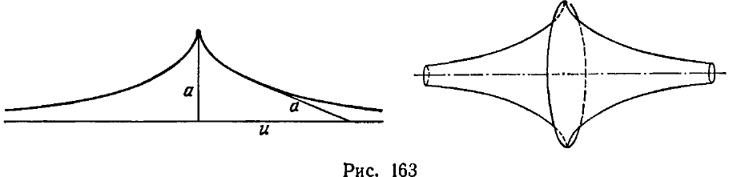
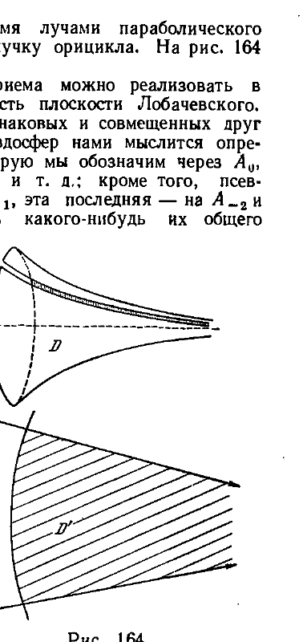

## 5. Геометрия на поверхности постоянной кривизны

---
**стр. 542**
---

Именно, Д. Гильбертом доказано, что в евклидовом пространстве не существует поверхности с требуемым свойством *).

Результаты Бельтрами, имеющие самостоятельный геометрический интерес, независимо от доказательства непротиворечивости геометрии Лобачевского, мы изложим с достаточной подробностью.

**5. Геометрия на поверхности постоянной кривизны**

**§ 227.** Наша цель — найти, если это возможно, в евклидовом пространстве поверхность, для каждой точки которой существует окрестность, изометричная некоторой области плоскости Лобачевского.

Предположим, что такая поверхность существует; обозначим ее через $S$. Постараемся изучить свойства, которыми должна обладать поверхность $S$. Это в дальнейшем поможет обнаружить существование такой поверхности.

Пусть $M_1$ и $M_2$ — две произвольные точки поверхности $S$. По условию, для каждой из них существует на $S$ окрестность, изометричная некоторой части плоскости Лобачевского. Обозначим такие окрестности точек $M_1$ и $M_2$, соответственно через $U_1$ и $U_2$. Пусть $U_1$ изометрично отображается на область $U'_1$ плоскости Лобачевского, а точка $M_1$ при этом пусть отображается в точку $M'_1$ внутри $U'_1$; аналогично, обозначим через $U'_2$ область, получаемую изометричным отображением на плоскость Лобачевского окрестности $U_2$, и через $M'_2$ — точку, соответствующую в этом отображении точке $M_2$.

На плоскости Лобачевского внутри области $U'_1$ имеется другая область $\overline{U}'_1$, покрывающая точку $M'_1$ и имеющая настолько малые размеры, что при конгруэнтном ее перемещении, совмещающем точку $M'_1$ с $M'_2$, она покроет часть $\overline{U}'_2$ плоскости, целиком лежащую внутри $U'_2$. Кроме того, при перемещении области $\overline{U}'_1$ в новое положение $\overline{U}'_2$ любое направление при точке $M'_1$ можно совместить с любым направлением при точке $M'_2$ (это свойство совокупности движений мы назвали в § 45 транзитивностью относительно линейных элементов). Обозначим теперь через $\overline{U}_1$ и $\overline{U}_2$ области на поверхности $S$, которые при изометричных отображениях $U_1$ и $U_2$ на $U'_1$ и $U'_2$ соответствуют областям $\overline{U}'_1$ и $\overline{U}'_2$ плоскости Лобачевского.

Вследствие изометрии областей $\overline{U}'_1$ и $\overline{U}'_2$ должны быть изометричны друг другу также и области $\overline{U}_1$ и $\overline{U}_2$. Таким образом, какова бы ни была точка $M_1$ поверхности $S$, всегда существует окрестность этой точки, которую можно изометрично отобразить на некоторую часть поверхности $S$ так, что точка $M_1$ отобразилась при этом в любую другую, наперед назначенную точку $M_2$ этой же поверхности. Кроме того, из приведенных рассуждений следует, что при этом любое направление на поверхности $S$, исходящее из точки $M_1$, может быть отображено на любое направление, исходящее их точки $M_2$. <!-- вероятная опечатка оригинала: «из» напечатано как «их» -->

Если мы согласимся изометричные области поверхности $S$ называть конгруэнтными с точки зрения ее внутренней геометрии и будем употреблять терминологию, введенную в § 45, то полученный результат можно сформулировать следующим образом: *поверхность $S$ допускает совокупность движений, транзитивную относительно линейных элементов.*

*) Д. Г и л ь б е р т, Основания геометрии, Добавление V, Гостехиздат, 1948. Следует заметить, что в этой теореме Гильберта речь идет о поверхностях, текущий радиус-вектор которых удовлетворяет условию трехкратной непрерывной дифференцируемости по внутренним координатам ($u$, $v$).

---
**стр. 543**
---

Нужно только иметь в виду два обстоятельства:

1) Изометричные области поверхности $S$ как образы объемлющего евклидова пространства, вообще говоря, не являются конгруэнтными.

В данном случае речь идет о движениях в смысле внутренней геометрии поверхности, но отнюдь не о движениях в смысле евклидовой геометрии пространства.

2) Поверхность $S$ в ц  е  л  о  м может не обладать способностью перемещаться по себе самой столь свободно, чтобы совокупность этих движений была транзитивной относительно линейных элементов, даже если их рассматривать с точки зрения внутренней геометрии.

В данном случае речь идет не о движениях всей поверхности по себе, а о движениях по ней достаточно малых ее кусков.

При этих оговорках можно все же усмотреть большую аналогию между поверхностью $S$, внутренняя геометрия которой «в малом» есть геометрия Лобачевского, и поверхностями, на которых осуществляется элементарная геометрия в том смысле, как мы определяли это понятие в § 45.

Чтобы наглядно представить себе движение в смысле внутренней геометрии, вообразим кусок гибкой, н е р а с т я ж и м о й пленки, который плотно приложен к поверхности. Перемещение этого куска по поверхности изображает движение в смысле внутренней геометрии, если перемещаемый кусок в каждом новом положении плотно примыкает к поверхности. Интересующая нас поверхность $S$ должна быть искривленной таким образом, чтобы кусок из гибкой нерастяжимой пленки, приложенный к любому ее месту, можно было, не отрывая, свободно перемещать по ней и вращать вокруг любой ее точки, причем, однако, величина куска, допускающего такие перемещения, может зависеть от того, из какой в какую точку мы его перемещаем.

Ограничим класс рассматриваемых поверхностей дополнительным требованием «гладкости третьего порядка». Это означает, что правые части уравнений $(\alpha)$ § 225 предполагаются трижды непрерывно дифференцируемыми функциями. В таком случае к рассматриваемым поверхностям становится применимой классическая теория поверхностей.

Принимая во внимание теорему Гаусса об инвариантности полной кривизны при изометричных отображениях *), мы можем на основании изложенного заключить: *поверхность $S$ необходимо имеет одинаковую полную кривизну во всех своих точках.*

Такая поверхность называется поверхностью постоянной кривизны.

Докажем теорему: *каждая поверхность постоянной кривизны допускает совокупность движений, понимаемых в смысле внутренней геометрии, транзитивную относительно линейных элементов.*

Сначала проведем некоторые подготовительные вычисления. Пусть $S$ — какая угодно поверхность постоянной кривизны. Возьмем на этой поверхности произвольную точку $M_0$ и проведем через нее какую-нибудь геодезическую линию $\Gamma$. Отложим на $\Gamma$ от точки $M_0$ дугу длины $u$ и через конец ее проведем перпендикулярно к $\Gamma$ геодезическую длины $v$. Конец последней обозначим через $M$. В некоторой окрестности $U(M_0)$ точки $M_0$ величины $u, v$ можно рассматривать как координаты точки $M$. Именно, $u, v$ будут полугеодезическими координатами в окрестности $U(M_0)$. Метрическая форма в системе $u, v$ имеет вид $ds^2 = E\,du^2 + dv^2$.

*) Полной кривизной поверхности в данной точке называется произведение ее главных кривизн в этой точке: $K = \frac{1}{R_1 R_2}$. Доказательство теоремы Гаусса, как и другие сведения из теории поверхностей, которые используются в этом параграфе, читатель может найти в книге: П. К. Р а ш е в с к и й, Дифференциальная геометрия.

---
**стр. 544**
---

Условимся называть линию $\Gamma$ ($v = 0$) базисной геодезической линией координатной системы $u, v$, точку $M_0$ ($u = 0, v = 0$) — начальной точкой или просто началом.

Так как координата $u$ равна длине дуги линии $\Gamma$, то при $v = 0$ должно быть $ds^2 = du^2$. Сравнивая это равенство с соотношением $ds^2 = E\,du^2$, которое получается из метрической формы при $v = 0$, находим:

$$E(u, 0) \equiv 1.$$

Заметим дальше, что, поскольку $\Gamma$ — геодезическая, вдоль $\Gamma$ должна быть равной нулю геодезическая кривизна: $\frac{1}{\rho_g} = 0$. Воспользуемся известной в теории поверхностей формулой

$$\frac{1}{\rho_g} = \sqrt{EG - F^2} \begin{Bmatrix} 2 \\ 11 \end{Bmatrix},$$

выражающей геодезическую кривизну координатной линии $v = \text{const}$. Так как $\frac{1}{\rho_g} = 0$, то при $v = 0$

$$\begin{Bmatrix} 2 \\ 11 \end{Bmatrix} = \frac{-FE_u + 2EF_u - EE_v}{2(EG - F^2)} = 0.$$

Но в полугеодезической системе $F(u, v) = 0$; таким образом, из последнего равенства имеем:

$$E_v(u, 0) = 0.$$

Теперь мы определим функцию $E(u, v)$, исходя из того, что поверхность с метрической формой

$$ds^2 = E\,du^2 + dv^2$$

имеет постоянную полную кривизну.

Известно, что в полугеодезических координатах полная кривизна $K$ поверхности определяется равенством

$$K = -\frac{1}{\sqrt{E}} \frac{\partial^2 \sqrt{E}}{\partial v^2}.$$

Нам придется, следовательно, интегрировать дифференциальное уравнение

$$\frac{\partial^2 \sqrt{E}}{\partial v^2} + K\sqrt{E} = 0 \qquad (\alpha)$$

в предположении $K = \text{const}$, при начальных условиях

$$E(u, 0) = 1, \quad E_v(u, 0) = 0. \qquad (\beta)$$

Рассмотрим три случая:

1. $K = 0$. Из уравнения $(\alpha)$ находим:

$$\sqrt{E} = \varphi(u)v + \psi(u).$$

В силу начальных условий $(\beta)$ имеем: $\psi(u) = 1$ и $\varphi(u) \equiv 0$. Таким образом, метрическая форма имеет вид:

$$ds^2 = du^2 + dv^2. \qquad (A)$$

---
**стр. 545**
---

2. $K > 0$. Интегрируя уравнение $(\alpha)$ как линейное уравнение второго порядка, получим общее решение

$$\sqrt{E} = \varphi(u) \cos (\sqrt{K} v) + \psi(u) \sin (\sqrt{K} v).$$

Чтобы удовлетворить начальным условиям $(\beta)$, следует выбрать произвольные функции интегрирования $\varphi(u) \equiv 1$ и $\psi(u) \equiv 0$. Таким образом, метрическая форма имеет вид:

$$ds^2 = \cos^2 (\sqrt{K} v) du^2 + dv^2. \qquad (Б)$$

3. $K < 0$. В этом случае общее решение уравнения $(\alpha)$ будет:

$$\sqrt{E} = \varphi(u) e^{\sqrt{-K} v} + \psi(u) e^{-\sqrt{-K} v}.$$

В силу начальных условий

$$\sqrt{E}(u, 0) = \varphi(u) + \psi(u) \equiv 1,$$

$$(\sqrt{E}(u, 0))_v = (\varphi(u) - \psi(u)) \sqrt{-K} = 0.$$

Отсюда

$$\varphi(u) \equiv \psi(u) \equiv \frac{1}{2}$$

и

$$\sqrt{E} = \frac{e^{\sqrt{-K} v} + e^{-\sqrt{-K} v}}{2} = \operatorname{ch}(\sqrt{-K} v).$$

Метрическая форма имеет вид:

$$ds^2 = \operatorname{ch}^2 (\sqrt{-K} v) du^2 + dv^2. \qquad (В)$$

Мы видим, таким образом, что *в полугеодезических координатах с геодезической базисной линией метрическая форма поверхности постоянной кривизны $K$ определяется единственно лишь численным значением $K$*.

Возьмем теперь две произвольные точки $M_1$ и $M_2$ поверхности $S$ и каждую из них примем за начало полугеодезической системы координат. Направления базисных геодезических при этом могут быть выбраны вполне произвольно. Обозначим через $U_1$ область существования полугеодезической системы с начальной точкой $M_1$ и через $U_2$ — область существования полугеодезической системы с начальной точкой $M_2$.

Если положительное число $\varepsilon$ достаточно мало, то при $-\varepsilon < u < +\varepsilon$, $-\varepsilon < v < +\varepsilon$ точка с координатами $(u, v)$ первой системы принадлежит $U_1$, а точка с координатами $(u, v)$ второй системы принадлежит $U_2$.

Пусть $Q_1$ и $Q_2$ — области, определяемые соответственно в первой и второй системе координат неравенствами $-\varepsilon < u < +\varepsilon$, $-\varepsilon < v < +\varepsilon$ ($Q_1$ и $Q_2$ имеют форму, сходную с квадратом). Из только что проведенных выкладок следует, что метрическая форма области $Q_1$ в координатах первой системы совпадает с метрической формой области $Q_2$ в координатах второй системы. Поэтому, если мы установим соответствие между точками этих областей по равенству координат, то это соответствие будет изометричным. Таким образом, области $Q_1$ и $Q_2$ с точки зрения внутренней геометрии поверхности $S$ конгруэнтны. Из произвола выбора базисных геодезических в координатных системах, употребляемых в этом рассуждении, следует, что совокупность конгруэнтных перемещений на поверхности $S$ транзитивна относительно линейных элементов. Теорема доказана.

---
**стр. 546**
---

Проведенное нами исследование метрической формы поверхности постоянной кривизны позволяет высказать еще следующую теорему:

*Каковы бы ни были две поверхности одной и той же постоянной кривизны, каждая достаточно малая часть любой из них может быть изометрически отображена на некоторую часть другой поверхности.*

*Две поверхности одинаковой постоянной кривизны имеют в малых частях одинаковую внутреннюю геометрию.*

Заметим, что две поверхности, имеющие различные постоянные кривизны, не могут быть изометричными друг другу. В самом деле, если бы в каких-то координатах эти поверхности имели одинаковые метрические формы, то, вычисляя полные кривизны этих поверхностей, мы должны были бы получить одинаковые константы.

**§ 228.** На основании всего изложенного мы приходим к такому заключению: при исследовании в малом внутренней геометрии поверхностей заданной постоянной кривизны достаточно изучить какой-нибудь один представитель этого класса.

Рассмотрим три случая возможных значений полной кривизны $K = \text{const}$: $K = 0$, $K > 0$ и $K < 0$.

1) Простейшей поверхностью постоянной нулевой кривизны является плоскость. Внутренняя геометрия плоскости есть планиметрия Евклида. Она определяется метрической формой

$$ds^2 = du^2 + dv^2. \qquad (*)$$

Так как метрическая форма любой поверхности постоянной нулевой кривизны может быть приведена к виду $(*)$, то каждая достаточно малая часть такой поверхности может быть изометрически отображена, или, как говорят, развернута на плоскость. Ввиду этого поверхности нулевой кривизны называют *развертывающимися*. Вместе с тем развертывающиеся поверхности можно себе представить наглядно как поверхности, полученные в процессе изгибания плоскости или некоторой части плоскости, или как поверхности, составленные из деформированных плоских частей.

Например, параболический цилиндр получается изгибанием всей плоскости. Его внутренняя геометрия в целом тождественна планиметрии Евклида.

Круглый цилиндр получается изгибанием плоской полосы. При этом еще должно быть произведено попарное соединение точек, лежащих на краях этой полосы. В малых частях круглый цилиндр имеет внутреннюю геометрию Евклида, однако его геометрия в целом существенно отлична от геометрии евклидовой плоскости.

То же самое можно сказать и относительно конуса, на примере которого удобно продемонстрировать движение в смысле внутренней геометрии и уяснить смысл ограничений в теоремах, относящихся к этому понятию.

Обозначим через $D$ часть круглого конуса, которая однократно накрывается плоским кружком с центром в точке $M$ (читатель может представить себе конус в виде деревянной модели, а кружок сделанным из бумаги). Каждая другая часть конуса, которая может быть накрыта тем же кружком, изометрична $D$. Таким образом, движения кружка по конусу являются движениями в смысле внутренней геометрии. Нетождественность движений в смысле внутренней геометрии конуса с движениями в пространстве наглядно выражается деформацией кружка при движении его по конусу.

Перемещая кружок, мы можем центр его, первоначально помещенный в точке $M$, совместить с любой точкой $M'$ конуса. Однако, если точка $M'$ дана близко к вершине конуса, то размеры кружка придется соответственно ограничить. Во всяком случае, если расстояние точки $M'$ от вершины меньше радиуса кружка, то при совмещении центра с $M'$ кружок не уместится на конусе; кроме того, следует принять во внимание, что часть конуса, близкую

---
**стр. 547**
---

к вершине, кружок может обернуть несколько раз (поэтому в теоремах о движении на поверхности речь идет о перемещении достаточно малой ее части).

2) Простейшей поверхностью постоянной положительной кривизны $K > 0$ является сфера, радиус которой $R = \frac{1}{\sqrt{K}}$.

Поместим центр сферы в начало декартовой ортогональной системы координат пространства и введем на сфере внутренние координаты $u, v$, равные географическим координатам (т. е. долготе и широте), помноженным на $R$. В пространстве каждая точка сферы будет определена уравнениями

$$x = R \cos \frac{u}{R} \cos \frac{v}{R},$$

$$y = R \sin \frac{u}{R} \cos \frac{v}{R},$$

$$z = R \sin \frac{v}{R}.$$

Тогда в любой части сферы, не содержащей верхнего и нижнего полюса, для которых $v = \pm \frac{1}{2} \pi R$, будет:

$$ds^2 = dx^2 + dy^2 + dz^2 = \cos^2 \frac{v}{R} du^2 + dv^2.$$

Полагая здесь $R = \frac{1}{\sqrt{K}}$, мы получим:

$$ds^2 = \cos^2 (\sqrt{K} v) du^2 + dv^2,$$

что в точности совпадает с найденным в предыдущем параграфе выражением (Б).

Таким образом, система $u, v$ является полугеодезической системой, базисной линией которой служит экватор в плоскости $z = 0$.

Изгибая некоторую часть сферы, мы можем получить бесконечное множество других поверхностей с постоянной положительной кривизной.

3) Одной из простейших поверхностей постоянной отрицательной кривизны $K < 0$ является *псевдосфера*.

Описание этой поверхности мы сейчас и дадим.

Рассмотрим плоскую линию, известную под названием *трактрисы*, характеризуемую следующим свойством: отрезок ее касательной от точки прикосновения до точки пересечения с некоторой определенной прямой есть постоянная величина.

Чтобы не тратить время на длинные выкладки, мы попросим читателя, рассматривая рис. 163а, где изображена *трактриса*, уяснить себе некоторые ее особенности без доказательств.

На рис. 163а длина постоянного отрезка касательной обозначена буквой $a$, прямая, по которой скользит конец этого отрезка, — буквой $u$. Прежде всего, очевидно, что трактриса имеет точку возврата, расположенную на расстоянии $a$ от прямой $u$; это есть наиболее удаленная от $u$ точка трактрисы. Из точки возврата идут две симметричные друг другу ветви, каждая из которых неограниченно приближается к прямой $u$. Эта прямая, таким образом, является асимптотой трактрисы. Легко понять также, что в неособых точках трактриса имеет выпуклость, обращенную к асимптоте. Поверхность, образованная вращением трактрисы вокруг асимптоты, называется *псевдосферой* (рис. 163б).

<!-- рисунки 163а и 163б на стр. 547 не вырезаны в этом прогоне -->

---
**стр. 548**
---

Псевдосфера имеет две части, состоящие из регулярных точек; каждая из этих частей при удалении в бесконечность стягивается к оси вращения. Эти части соединены друг с другом вдоль ребра возврата. В соответствии с нашим определением поверхности (см. § 225), мы должны считать ребро возврата не принадлежащим поверхности. В дальнейшем, говоря о псевдосфере, мы будем иметь в виду одну из двух ее регулярных частей. Теперь мы докажем, что псевдосфера имеет во всех точках постоянную отрицательную кривизну. Для этого достаточно доказать, что кривизна псевдосферы постоянна (и отрицательна) вдоль какого-нибудь ее меридиана.

Выберем декартову ортогональную систему $(x, y, z)$ так, чтобы ось $x$ совместилась с осью вращения псевдосферы, а плоскость $x = 0$ содержала ребро возврата. Рассмотрим меридиан псевдосферы, расположенный в первой четверти плоскости $(x, y)$; пусть будет $y = f(x)$ его уравнение. При каждом $x > 0$ мы будем иметь $a > y > 0$; кроме того, так как при возрастании $x$ точка трактрисы приближается к оси $x$, то $y' < 0$, а так как выпуклость трактрисы обращена к оси $x$, то $y'' > 0$.

Обозначим через $M$ произвольную точку меридиана $y = f(x)$ и построим в этой точке внешнюю нормаль псевдосферы. Приняв во внимание, что главные направления поверхности вращения суть направления ее меридиана и широты, вычислим главные кривизны псевдосферы в точке $M$.

Нормаль псевдосферы направлена в сторону вогнутости кривой $y = f(x)$, поэтому главная кривизна $\frac{1}{R_1}$, соответствующая направлению меридиана, положительна и точно равна кривизне этого меридиана, т. е.

$$\frac{1}{R_1} = \frac{y''}{(1 + y'^2)^{3/2}}.$$

Кривизна широты есть $\frac{1}{y}$; следовательно, вторая главная кривизна $\frac{1}{R_2}$ может быть определена формулой

$$\frac{1}{R_2} = \frac{\cos \varphi}{y},$$

где $\varphi$ — угол между нормалью и отрезком $y$. Очевидно, этот угол равен углу наклона касательной к оси $x$, следовательно, $\operatorname{tg} \varphi = y'$ и $\cos \varphi = -\frac{1}{\sqrt{1 + y'^2}}$.

Отсюда

$$\frac{1}{R_2} = -\frac{1}{y\sqrt{1 + y'^2}}.$$

---
**стр. 549**
---

Полную кривизну $K = \frac{1}{R_1 R_2}$ в точках меридиана $y = f(x)$ мы можем теперь выразить формулой

$$K = -\frac{y''}{y(1 + y'^2)^2}. \quad (1)$$

Построим в точке $M(x, y)$ касательную к кривой $y = f(x)$ и обозначим через $(X, 0)$ координаты точки пересечения этой касательной с осью $x$. Из уравнения

$$Y - y = y'(X - x)$$

при $Y = 0$ находим:

$$X - x = -\frac{y}{y'}.$$

По определению трактрисы

$$X - x = -a \cos \varphi \quad (a = \text{const}).$$

Таким образом, мы имеем равенство

$$\frac{y}{y'} = a \cos \varphi.$$

Заменяя в нем $\cos \varphi$ выражением $\cos \varphi = -\frac{1}{\sqrt{1 + y'^2}}$, получим дифференциальное уравнение трактрисы:

$$\frac{y\sqrt{1 + y'^2}}{y'} = -a. \quad (2)$$

Отсюда

$$y'^2(a^2 - y^2) = y^2,$$
$$y''(a^2 - y^2) = y(1 + y'^2).$$

Из последних двух соотношений находим:

$$y'' = \frac{y'^2(1 + y'^2)}{y},$$

откуда в силу (1)

$$K = -\frac{y'^2}{y^2(1 + y'^2)}.$$

Вследствие уравнения (2) имеем, наконец:

$$K = -\frac{1}{a^2}.$$

Тем самым доказано, что псевдосфера имеет во всех точках одинаковую отрицательную кривизну $-\frac{1}{a^2}$, где $a$ — параметр трактрисы, вращением которой образована данная псевдосфера. Очевидно, существует псевдосфера с любой, наперед заданной отрицательной кривизной. Чтобы построить меридиан псевдосферы с данной кривизной, нужно лишь проинтегрировать уравнение (2) при данном значении параметра $a$. На основании предыдущего мы можем утверждать, что в окрестности любой точки псевдосферы

---
**стр. 550**
---

метрическая форма в полугеодезических координатах (с базисной геодезической) имеет вид

$$ds^2 = \operatorname{ch}^2 (\sqrt{-K} v) du^2 + dv^2$$

(§ 227 формула (C)).

Изгибая некоторый кусок псевдосферы, можно получить бесконечное множество других поверхностей постоянной отрицательной кривизны.

Итак, каково бы ни было $K$ ($-\infty < K < +\infty$), в пространстве Евклида существует поверхность постоянной кривизны $K$.

Что касается решения проблемы Бельтрами, то мы приходим теперь к следующему заключению: если в евклидовом пространстве существуют поверхности, на которых в малом осуществляется геометрия Лобачевского, то одной из таких поверхностей будет либо сфера, либо плоскость, либо псевдосфера.

Заметим, что построение полугеодезических координат поверхности производится точно так же, как построение первых координат в плоскости Лобачевского (см. § 224). Поэтому в полугеодезических координатах метрическая форма поверхности с внутренней геометрией Лобачевского должна совпасть с метрической формой плоскости Лобачевского, выраженной в первых координатах. В конце § 224 мы нашли выражение метрической формы плоскости Лобачевского в первых координатах $\xi, \eta$:

$$ds^2 = \operatorname{ch}^2 \frac{\eta}{R} d\xi^2 + d\eta^2. \quad (**)$$

Нам остается сопоставить это выражение с метрическими формами сферы, плоскости и псевдосферы, которые, как нам известно, в полугеодезических координатах имеют соответственно вид:

$$ds^2 = \cos^2 (\sqrt{K} v) du^2 + dv^2,$$
$$ds^2 = du^2 + dv^2,$$
$$ds^2 = \operatorname{ch}^2 (\sqrt{-K} v) du^2 + dv^2.$$

Мы видим, что (**) совпадает именно с последней из этих трех форм (при $\frac{1}{R} = \sqrt{-K}$).

Отсюда следует теорема Бельтрами:

*В окрестности каждой точки псевдосферы имеет место геометрия Лобачевского.*

Разрежем псевдосферу вдоль какого-нибудь ее меридиана; мы получим односвязную область $D$, ограниченную ребром возврата и краями разреза. Пусть $D'$ — область плоскости Лобачевского, изометричная области $D$. Постараемся описать область $D'^*)$ в терминах геометрии Лобачевского. Так как меридианы являются геодезическими псевдосферы, то при изометричном отображении $D$ на $D'$ меридианы отобразятся на некоторую систему прямых. Это будет система прямых, параллельных друг другу в смысле Лобачевского. Последнее вытекает из асимптотического сближения меридианов, а следовательно, и их отображений. Отображениями широт, очевидно, будут ортогональные траектории указанной системы параллельных прямых, т. е. орициклы (вернее, дуги орициклов).

---
*) Следовало бы доказать существование области $D'$, но на этом мы останавливаться не будем.

---
**стр. 551**
---

Таким образом, область $D'$ ограничена двумя лучами параболического пучка (см. § 39) и дугою ортогонального к этому пучку орицикла. На рис. 164 эта область помечена штриховкой.

С помощью некоторого искусственного приема можно реализовать в евклидовом пространстве и более обширную часть плоскости Лобачевского. Для этого вообразим себе счетное множество одинаковых и совмещенных друг с другом псевдосфер. В расположении этих псевдосфер нами мыслится определенный порядок, именно: на псевдосферу, которую мы обозначим через $A_0$, наложена псевдосфера $A_1$, на нее псевдосфера $A_2$ и т. д.; кроме того, псевдосфера $A_0$ сама наложена на псевдосферу $A_{-1}$, эта последняя — на $A_{-2}$ и т. д. Теперь разрежем все псевдосферы вдоль какого-нибудь их общего меридиана. Наблюдателю, который со стороны оси смотрит на разрез, один край разреза каждой псевдосферы представляется левым, другой — правым. Соединим левый край каждой псевдосферы $A_n$ с правым краем псевдосферы $A_{n+1}$. Тогда получится поверхность $\Sigma$, которую можно воображать в виде бесконечной ленты, плотно навитой на псевдосферический шаблон. Поверхность $\Sigma$, очевидно, изометрична части плоскости Лобачевского, расположенной со стороны вогнутости некоторого орицикла.

Иначе можно сказать: часть плоскости Лобачевского, лежащая со стороны вогнутости орицикла, может быть реализована в евклидовом пространстве в виде бесконечной обертки (или, как говорят, накрывающей поверхности) псевдосферы.

Как мы уже отмечали раньше, Гильбертом доказано, что в евклидовом пространстве нет поверхности, изометричной всей плоскости Лобачевского. Таким образом, попытка Бельтрами реализовать неевклидову планиметрию в виде внутренней геометрии некоторой поверхности не могла увенчаться успехом.

Несмотря на это, исследования Бельтрами имеют большое принципиальное значение.

Во-первых, даже частичная реализация неевклидовой планиметрии в евклидовом пространстве изменила скептическое отношение геометров к работам Лобачевского и убедила их в том, что геометрия Лобачевского не содержит внутренних противоречий.

Во-вторых, благодаря Бельтрами евклидова планиметрия, планиметрия Лобачевского и геометрия на сфере оказались объединенными в общей дифференциально-геометрической схеме. Именно, выяснилось, что все эти геометрические системы осуществляются на поверхностях постоянной кривизны $K$ и соответствуют случаям $K = 0$, $K < 0$ и $K > 0$.

После всего изложенного становится понятным аналитический источник тесной зависимости, которая существует между геометрией Лобачевского и сферической геометрией.

В самом деле, метрическая форма сферы

$$ds^2 = \cos^2 (\sqrt{K} v) du^2 + dv^2 \quad (*)$$

и метрическая форма псевдосферы

$$ds^2 = \operatorname{ch}^2 (\sqrt{-K} v) du^2 + dv^2 \quad (**)$$
