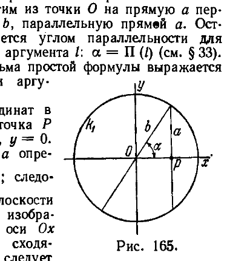
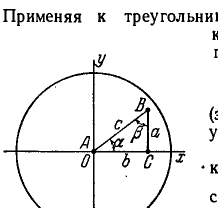
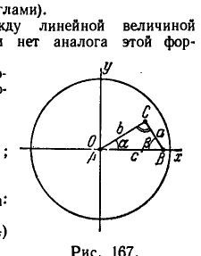
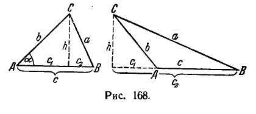

## 6. Вывод основных метрических соотношений в геометрии Лобачевского

---
**стр. 552**
---

различны в вещественной области. Но если допускать мнимые значения для величины $\sqrt{K}$ или $\sqrt{-K}$, то, как известно,

$$\cos (\sqrt{K} v) = \operatorname{ch} (\sqrt{-K} v).$$

Таким образом, при замене $\sqrt{K}$ на $\sqrt{-K}$ формы (*) и (**) переходят друг в друга.

**6. Вывод основных метрических соотношений в геометрии Лобачевского**

**§ 229.** В настоящем разделе мы сообщим ряд метрических предложений геометрии Лобачевского, которые остались в стороне от основной линии нашего изложения.

Мы не встретим больше никаких принципиальных трудностей. После того как установлены главнейшие метрические формулы геометрии Лобачевского (§§ 216—222), все другие задачи метрического характера, возникающие в этой геометрии, легко решаются применением полученных формул.

В основу наших вычислений мы положим некоторую систему бельтрамиевых координат $(x, y)$. Как известно (см. § 216), бельтрамиевы координаты произвольной точки плоскости Лобачевского связаны соотношением

$$x^2 + y^2 < 1. \quad (*)$$

Рассмотрим евклидову плоскость $\Sigma$ с декартовой прямоугольной системой координат $(x, y)$. Соотношение $(*)$ определяет на $\Sigma$ внутреннюю область единичного круга $k_1$. Сопоставим с произвольной точкой плоскости Лобачевского, бельтрамиевы координаты которой суть $x, y$, точку плоскости $\Sigma$ (лежащую внутри круга $k_1$), декартовы координаты которой суть те же числа $x, y$. Тем самым мы установим некоторое специальное отображение всей плоскости Лобачевского на внутренность круга $k_1$; при этом отображении образами прямых Лобачевского будут хорды круга $k_1$ (конечно, с исключенными концами).

Введем внутри круга $k_1$ искусственную метрику. Именно, расстоянием между двумя внутренними точками круга $k_1$ назовем число, равное расстоянию между их прообразами на плоскости Лобачевского, величиною угла между двумя хордами $a$ и $b$ условимся считать число, равное величине угла между прямыми Лобачевского, которые служат прообразами хорд $a$ и $b$; аналогично определим площади областей. Практически это означает, что вычисление основных геометрических величин мы должны вести в декартовых координатах по формулам геометрии Лобачевского, выражающим соответствующие величины в бельтрамиевых координатах.

Мы получаем таким путем некоторую реализацию плоскости Лобачевского внутри евклидова круга $k_1$. Этой реализацией мы и будем оперировать в дальнейшем.

Существенно заметить, что наши выводы будут иметь общий характер, т. е. не будут связаны с особенностями выбранной реализации. Это ясно, так как соотношение $(*)$ и основные метрические формулы геометрии Лобачевского выведены нами, исходя из аксиом геометрии Лобачевского, вне зависимости от того, на каких объектах эти аксиомы считаются реализованными $^*)$.

---
$^*)$ Мы не можем, однако, утверждать, что нами доказана полнота системы аксиом двумерной геометрии Лобачевского (понятие полноты системы аксиом изложено в § 75). Для этого следовало бы вывести основные метрические фор-

---
**стр. 553**
---

мулы геометрии Лобачевского без привлечения пространственных аксиом. Такой вывод дан Г. Либманом, но проводится с помощью довольно продолжительных рассуждений (см. приложение VII в книге: Н. И. Лобачевский, Геометрические исследования по теории параллельных линий, изд. АН СССР, 1943. Более простой вывод найден недавно А. В. Погореловым и изложен в книге: Основания геометрии, «Наука», 1968).

**§ 230. В ы р а ж е н и е  ф у н к ц и и  Π(l) ч е р е з  э л е м е н т а р н о - т р а н с ц е н д е н т н ы е  ф у н к ц и и.**

Пусть на плоскости Лобачевского даны прямая $a$ и точка $O$ на расстоянии $l > 0$ от этой прямой. Опустим из точки $O$ на прямую $a$ перпендикуляр $OP$ и проведем через $O$ прямую $b$, параллельную прямой $a$. Острый угол $\alpha$ между прямыми $b$ и $OP$ называется углом параллельности для отрезка $OP = l$ и представляет собой функцию аргумента $l$: $\alpha = \Pi(l)$ (см. § 33). Мы покажем сейчас, что $\Pi(l)$ с помощью весьма простой формулы выражается через элементарно-трансцендентные функции аргумента $l$.

Расположим начало бельтрамиевых координат в точке $O$, ось $Ox$ направим по отрезку $OP$; точка $P$ будет иметь бельтрамиевы координаты $x = x_1, y = 0$. На основании изложенного в § 218 прямая $a$ определяется уравнением

$$x = \operatorname{th} \frac{l}{R} = x_1 (= \text{const});$$

следовательно, при изображении объектов плоскости Лобачевского внутри круга $k_1$ прямая $a$ изобразится в виде хорды, перпендикулярной к оси $Ox$

(рис. 165), прямая $b$ изобразится хордой, сходящейся с хордой $a$ на границе круга $k_1$ (это следует из определения параллельности прямых в геометрии Лобачевского). Как было показано в § 221, формула, определяющая угол между двумя направлениями при некоторой точке, переходит в евклидову формулу (II), § 215, если $M$ находится на оси $Ox$. Отсюда заключаем, что евклидов угол между хордами $a$ и $OP$ равен $\alpha$.

Мы имеем евклидово тригонометрическое соотношение $x_1 = \cos \alpha$; вместе с этим имеем зависимость $x_1 = \operatorname{th} \frac{l}{R}$ (см. формулу (4) § 218). Из последних двух соотношений получаем:

$$\cos \alpha = \operatorname{th} \frac{l}{R}.$$

Из тригонометрических преобразований, $\operatorname{tg} \frac{\alpha}{2} = e^{-\frac{l}{R}}$. Принимая во внимание определение функции $\Pi(l)$, отсюда получаем формулу Лобачевского:

$$\Pi(l) = 2 \operatorname{arctg} e^{-\frac{l}{R}}.$$

**§ 231. Тригонометрия Лобачевского.**

Мы установим сейчас соотношения между сторонами и углами неевклидова треугольника. Рассмотрим прежде всего прямоугольный треугольник $ABC$ с катетами $CB = a$, $CA = b$, с гипотенузой $AB = c$ и с острыми углами $\angle CAB = \alpha$, $\angle CBA = \beta$. Поместим начало бельтрамиевых координат в точку $A$, ось абсцисс направим по катету $AC$ (рис. 166). Обозначим через $x_1, y_1$ координаты точки $C$, через $x_2, y_2$ — координаты точки $B$. Мы имеем $x_1 = \operatorname{th} \frac{b}{R}$,

---
**стр. 554**
---

$y_1 = 0$, $x_2 = x$; координату $y_2$ постараемся определить из формулы (3) § 217. Полагая в этой формуле $\rho(B, C) = a$, найдем:

$$a = \frac{R}{2} \ln \frac{1 - x_1^2 + y_2 \sqrt{1 - x_1^2}}{1 - x_1^2 - y_2 \sqrt{1 - x_1^2}} = \frac{R}{2} \ln \frac{1 + y_2 \operatorname{ch} \frac{b}{R}}{1 - y_2 \operatorname{ch} \frac{b}{R}}.$$

Отсюда

$$y_2 = \frac{\operatorname{th} \frac{a}{R}}{\operatorname{ch} \frac{b}{R}}.$$

Применяя к треугольнику $ABC$, как к объекту евклидовой геометрии, евклидово соотношение $y_2 = x_1 \operatorname{tg} \alpha$, получаем формулу геометрии Лобачевского:

$$\operatorname{th} \frac{a}{R} = \operatorname{sh} \frac{b}{R} \operatorname{tg} \alpha, \qquad (1)$$

(зависимость между двумя катетами и одним острым углом).

Заметим теперь, что евклидова длина $c_e$ отрезка $AB$ выражается через длину $c$ этого отрезка в смысле геометрии Лобачевского формулой $c_e = \operatorname{th} \frac{c}{R}$ (для доказательства достаточно направить ось абсцисс из точки $A$ по отрезку $AB$ и применить первую из формул (1) § 218). Приняв это во внимание, мы сразу получаем из евклидовой формулы $b_e = c_e \cos \alpha$ следующую формулу геометрии Лобачевского:

$$\operatorname{th} \frac{b}{R} = \operatorname{th} \frac{c}{R} \cos \alpha \qquad (2)$$

(зависимость между гипотенузой, катетом и прилежащим острым углом).

Расположим теперь оси координат относительно треугольника $ABC$ так, как показано на рис. 167. Выразим угол $\beta$ при помощи формулы (3) § 221. Прежде всего подставим в выражения (7) § 220 для коэффициентов $E, F, G$ координаты точки $B$: $x = \operatorname{th} \frac{c}{R}$, $y = 0$; формула (3) § 221 примет вид:

$$\cos \beta = \frac{dx \, \delta x + \left(1 - \operatorname{th}^2 \frac{c}{R}\right) dy \, \delta y}{\sqrt{dx^2 + \left(1 - \operatorname{th}^2 \frac{c}{R}\right) dy^2} \sqrt{\delta x^2 + \left(1 - \operatorname{th}^2 \frac{c}{R}\right) \delta y^2}}.$$

Считая, что $dx$, $dy$ соответствуют смещению по оси $Ox$ ($dy = 0$), $\delta x$, $\delta y$ соответствуют смещению по прямой $BC$ $\left(\frac{\delta y}{\delta x} = -\operatorname{tg} \beta_e$, где $\beta_e$ — евклидова величина угла $ABC\right)$, и подставляя

$$1 - \operatorname{th}^2 \frac{c}{R} = \frac{1}{\operatorname{ch}^2 \frac{c}{R}},$$

---
**стр. 555**
---

мы получим из предыдущего равенства:

$$\cos \beta = \frac{1}{\sqrt{1 + \frac{\operatorname{tg}^2 \beta_e}{\operatorname{ch}^2 \frac{c}{R}}}}.$$

Сравнивая последнее соотношение с известной формулой $\cos \beta = \frac{1}{\sqrt{1 + \operatorname{tg}^2 \beta}}$, находим:

$$\operatorname{ch} \frac{c}{R} \cdot \operatorname{tg} \beta = \operatorname{tg} \beta_e \qquad (*)$$

Заметим, что в центре круга $k_1$ евклидовы углы совпадают с углами в смысле Лобачевского; поэтому $\alpha_e = \alpha$ и $\operatorname{tg} \beta_e = \operatorname{ctg} \alpha_e = \operatorname{ctg} \alpha$. Отсюда и из формулы (*) получаем новое соотношение тригонометрии Лобачевского:

$$\operatorname{ch} \frac{c}{R} \cdot \operatorname{tg} \beta = \operatorname{ctg} \alpha \qquad (3)$$

(зависимость между гипотенузой и двумя острыми углами).

Формула (3) устанавливает зависимость между линейной величиной и угловыми величинами. В евклидовой геометрии нет аналога этой формуле, так как в ней имеет место подобие фигур. Вернемся к расположению треугольника, показанному на рис. 166. Мы имеем евклидово соотношение

$$c_e^2 = x_1^2 + y_2^2, \quad \text{где} \quad c_e = \operatorname{th} \frac{c}{R}, \quad x_1 = \operatorname{th} \frac{b}{R}, \quad y_2 = \frac{\operatorname{th} \frac{a}{R}}{\operatorname{ch} \frac{b}{R}};$$

после несложных выкладок получаем отсюда:

$$\operatorname{ch} \frac{c}{R} = \operatorname{ch} \frac{a}{R} \cdot \operatorname{ch} \frac{b}{R} \qquad (4)$$

(зависимость между гипотенузой и двумя катетами).

Укажем еще две формулы, вывод которых легко проведет сам читатель:

$$\operatorname{sh} \frac{a}{R} = \operatorname{sh} \frac{c}{R} \sin \alpha \qquad (5)$$

(зависимость между гипотенузой, катетом и противолежащим острым углом) и

$$\operatorname{ch} \frac{a}{R} \sin \beta = \cos \alpha \qquad (6)$$

(зависимость между катетом и двумя острыми углами).

**§ 232.** Пусть теперь $ABC$ — произвольный треугольник плоскости Лобачевского. Проводя в нем высоту $h$ (как показано на рис. 168) и применяя

---
**стр. 556**
---

формулу (4), получаем:

$$\operatorname{ch} \frac{h}{R} = \frac{\operatorname{ch} \frac{b}{R}}{\operatorname{ch} \frac{c_1}{R}} = \frac{\operatorname{ch} \frac{a}{R}}{\operatorname{ch} \frac{c_2}{R}}$$

(отрезки $c_1$ и $c_2$ показаны на рис. 168). Отсюда

$$\operatorname{ch} \frac{a}{R} = \frac{\operatorname{ch} \frac{b}{R}}{\operatorname{ch} \frac{c_1}{R}} \operatorname{ch} \frac{c_2}{R} = \frac{\operatorname{ch} \frac{b}{R}}{\operatorname{ch} \frac{c_1}{R}} \operatorname{ch} \left(\frac{c}{R} \mp \frac{c_1}{R}\right) = \operatorname{ch} \frac{b}{R} \left(\operatorname{ch} \frac{c}{R} \mp \operatorname{sh} \frac{c}{R} \cdot \operatorname{th} \frac{c_1}{R}\right);$$

но вследствие формулы (2) имеем:

$$\operatorname{th} \frac{c_1}{R} = \pm \operatorname{th} \frac{b}{R} \cos \alpha.$$

Из последних двух соотношений вытекает формула

$$\operatorname{ch} \frac{a}{R} = \operatorname{ch} \frac{b}{R} \operatorname{ch} \frac{c}{R} - \operatorname{sh} \frac{b}{R} \cdot \operatorname{sh} \frac{c}{R} \cos \alpha. \qquad \text{(A)}$$

**§ 233.** Формулы (1)—(6), как и формула (A), уже были установлены ранее в § 61. Однако в § 61 эти формулы были доказаны нами только для специальной модели геометрии Лобачевского. Здесь мы доказали формулы (1) — (6), (A), исходя из аксиом геометрии Лобачевского, не делая каких-либо предположений относительно природы геометрических элементов. Тем самым мы доказали формулы (1)—(6), (A) для любой модели геометрии Лобачевского.

В § 62 мы сопоставили формулу (A) с основной формулой сферической тригонометрии:

$$\cos \frac{a}{R} = \cos \frac{b}{R} \cos \frac{c}{R} + \sin \frac{b}{R} \sin \frac{c}{R} \cos \alpha. \qquad \text{(Б)}$$

Формула (Б) переходит в формулу (A) путем замены $R$ на $Ri$ ($i = \sqrt{-1}$). Это означает, что тригонометрию Лобачевского можно рассматривать как тригонометрию на сфере мнимого радиуса. Такая зависимость между формулами Лобачевского и формулами сферической тригонометрии исчерпывающим образом объясняется с дифференциально-геометрической точки зрения. Дело в том, что геометрия Лобачевского является геометрией постоянной отрицательной кривизны $K = -\frac{1}{R^2}$, геометрия на сфере есть геометрия постоянной положительной кривизны $K = \frac{1}{R^2}$. При замене $R$ на $Ri$ метрическая форма сферы переходит в метрическую форму плоскости Лобачевского. Вместе с тем и все метрические соотношения сферической геометрии переходят в соответствующие соотношения геометрии Лобачевского.
