## 2. Параболические пространственные формы

---
**стр. 564**
---

Многообразия постоянной кривизны по многим своим свойствам достойны первоочередного внимания. Достаточно указать, что они, и только они, среди всех двумерных дифференциально-геометрических многообразий допускают свободное движение по себе своих достаточно малых частей. Если две изометричные области многообразия называть *конгруэнтными*, то более точно высказанное утверждение можно формулировать так:

Многообразия постоянной кривизны, и только они, допускают такие *конгруэнтные* перемещения своих достаточно малых частей (т. е. такие изометричные отображения их друг на друга), что совокупность этих перемещений транзитивна относительно линейных элементов. Чтобы убедиться в этом, читателю нужно вернуться к § 227, где доказано точно такое же утверждение для поверхностей. Так как рассуждения в § 227 велись исключительно в области понятий внутренней геометрии поверхности, то они непосредственно применимы к абстрактным метризованным многообразиям.

Кроме того, на основании полученных в § 227 результатов мы можем утверждать, что каждое многообразие постоянной кривизны $K$ в малых частях обладает в случае $K = 0$ геометрией Евклида, в случае $K < 0$ — геометрией Лобачевского и в случае $K > 0$ — геометрией на сфере.

Таким образом, абстрактные многообразия постоянной кривизны, как и поверхности, при изучении их в малом распадаются лишь на три класса.

Но, изучая эти многообразия «в целом», мы обнаружим такое богатство различий в их природе, какое никак нельзя было бы себе представить, оставаясь в рамках элементарной теории поверхностей.

**2. Параболические пространственные формы**

**§ 239.** Каждое полное дифференциально-геометрическое многообразие постоянной кривизны называется *пространственной формой геометрии данной постоянной кривизны* (условие полноты высказано в § 237). Условимся две пространственные формы геометрии данной кривизны считать *эквивалентными*, если они имеют одинаковый топологический тип, т. е. если они допускают взаимно однозначное и в обе стороны непрерывное отображение друг на друга. С наглядной точки зрения это означает, что мы допускаем деформации пространственной формы, исключающие «разрывы» и «склеивания».

При таком условии получается естественное распределение всех пространственных форм в легко обозримое множество классов эквивалентных между собой форм; каждый класс характеризуется указанием какого-нибудь одного представителя.

Не имея в виду давать полной топологической классификации двумерных многообразий, мы укажем только, что все двумерные многообразия разделяются на *открытые* и *замкнутые*. Многообразие называется *замкнутым*, если из любого бесконечного множества его точек можно выбрать сходящуюся последовательность (т. е. если для этого многообразия справедлив принцип Больцано — Вейерштрасса).

Многообразие, не являющееся замкнутым, называется *открытым*.

Примеры замкнутых многообразий: сфера, тор. Примеры открытых многообразий: плоскость, любая область на плоскости, любая область на сфере, не покрывающая всей сферы.

В дальнейшем геометрию постоянной кривизны $K$ мы будем называть *параболической*, если $K = 0$, *эллиптической*, если $K > 0$, и *гиперболической*, если $K < 0$.

**§ 240.** Среди параболических пространственных форм в первую очередь должна быть указана евклидова плоскость (как примеры эквивалентных ей

---
**стр. 565**
---

форм можно назвать параболический цилиндр, связную часть гиперболического цилиндра, орисферу пространства Лобачевского и т. д.).

Кроме евклидовой плоскости (и эквивалентных ей форм) существуют еще четыре пространственные формы параболической геометрии; их топологические представители суть: обыкновенный цилиндр, односторонний цилиндр, тор и односторонний тор. Рассмотрим их в указанном порядке.

Разделим плоскость системой параллельных прямых $\{a\}$ на одинаковые полосы (рис. 169) и зададим в плоскости какое-нибудь направление, например перпендикулярное к прямым $\{a\}$ (задание направления самих прямых $\{a\}$ исключается). Возьмем в какой-нибудь полосе произвольную точку $M$. Передвигая выбранную полосу в заданном направлении, мы можем наложить ее на любую другую полосу; точка $M$ при этом займет некоторое новое положение, в котором мы снова обозначим ее буквой $M$.

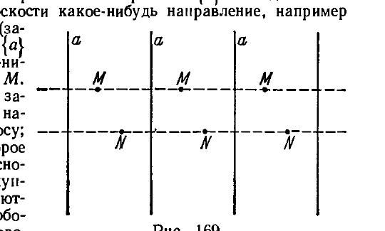

Совокупность всех точек, которые получаются таким путем из точки $M$, мы обозначим символом $\{M\}$. Каждую совокупность точек $\{M\}$ мы условимся рассматривать как элемент («точку») нового множества $R$. В множество $R$ мы введем метрику: если $x = \{M\}$ и $y = \{N\}$ — две точки из $R$, то в качестве расстояния $\rho(x, y)$ мы назначим минимум евклидовых расстояний между точками совокупности $\{M\}$ и точками совокупности $\{N\}$. По определению $\rho(x, y) = \rho(y, x)$. Убедимся, что $\rho(x, y)$ удовлетворяет всем аксиомам метрического пространства (см. § 235).

1) Если совокупности $\{M\}$ и $\{N\}$ тождественны, то минимальное евклидово расстояние точек $\{M\}$ от точек $\{N\}$ равно нулю, следовательно, при $x = y$ имеем $\rho(x, y) = 0$.

2) Если совокупности $\{M\}$ и $\{N\}$ различны, то минимальное евклидово расстояние точек $\{M\}$ от точек $\{N\}$ больше нуля; вследствие этого и по определению функции $\rho(x, y)$ при $x \not\equiv y$ имеем $\rho(x, y) = \rho(y, x) > 0$.

3) Пусть $x = \{M\}$, $y = \{N\}$ и $z = \{P\}$ — три произвольные точки пространства $R$. Обозначим через $N_1$ какую-нибудь точку из $\{N\}$; в совокупностях $\{M\}$ и $\{P\}$ существуют соответственно такие точки $M_1$ и $P_1$, что $\rho(x, y) = M_1 N_1$ и $\rho(y, z) = N_1 P_1$, где $M_1 N_1$ и $N_1 P_1$ — евклидовы расстояния. Для евклидовых расстояний мы имеем: $M_1 N_1 + N_1 P_1 \geqslant M_1 P_1$; но $M_1 P_1 \geqslant \rho(x, z)$, следовательно, $\rho(x, y) + \rho(y, z) \geqslant \rho(x, z)$.

Тем самым установлено, что $R$ является метрическим пространством.

Функция $\rho(x, y)$ определена так, что достаточно малая $\varepsilon$-окрестность произвольной точки $x = \{M\}$ пространства $R$ изометрична $\varepsilon$-окрестности точки $M$ евклидовой плоскости; отсюда следует, что $R$ есть двумерное многообразие нулевой кривизны.

Наконец, вследствие полноты евклидовой плоскости многообразие $R$ также является полным. Таким образом, $R$ есть некоторая параболическая пространственная форма.

Чтобы внести в наши рассмотрения большую наглядность, представим себе, что плоскость как бесконечная лента навернута на круглый цилиндр, так, что каждая полоса обертывает цилиндр точно один раз. При этом все точки любой совокупности $\{M\}$ совпадают с одной точкой на цилиндре. Тем самым наглядно устанавливается, что круглый цилиндр есть пространственная форма параболической геометрии, эквивалентная ранее рассмотренному многообразию $R$.

---
**стр. 566**
---

Мы придем к тому же результату, если попросту условимся отождествлять все точки каждой совокупности $\{M\}$, в частности, точки, лежащие «друг против друга» на разных границах одной какой-нибудь полосы. Ясно, что попарное соединение точек, лежащих на разных границах полосы (как показано на рис. 170, где соединяемые точки обозначены одной буквой), дает «трубку».

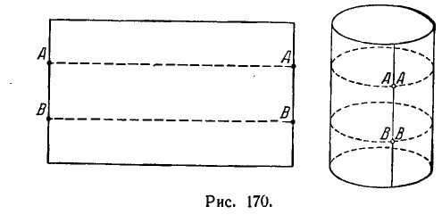

Итак, мы обнаружили класс пространственных форм геометрии нулевой кривизны, топологический тип которых представляется круглым цилиндром.

Вернемся снова к плоскости, разделенной параллельными прямыми $\{a\}$ на одинаковые полосы; зададим еще одну прямую $b$, перпендикулярную к прямым $\{a\}$ (рис. 171). Пусть $M$ — произвольная точка, взятая в какой-нибудь полосе. Передвинем выбранную полосу вдоль прямой $b$ так, чтобы она совместилась с соседней полосой; точка $M$ при этом займет новое положение. Отразим зеркально полученную точку относительно прямой $b$ и обозначим ее образ снова буквой $M$. Продолжая этот процесс, мы получим бесконечную совокупность точек $\{M\}$.

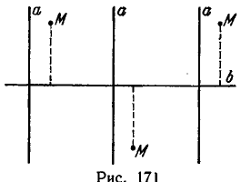

Каждую совокупность точек $\{M\}$ мы условимся считать элементом нового метрического пространства $R$; расстояние $\rho(x, y)$ между двумя точками $x = \{M\}$ и $y = \{N\}$ пространства $R$, как и в предыдущем случае, примем равным минимуму евклидовых расстояний между точками совокупности $\{M\}$ и точками совокупности $\{N\}$. Легко понять, что $R$ представляет собой пространственную форму геометрии нулевой кривизны.

Мы получим эту же пространственную форму, если, ограничиваясь одной полосой, будем отождествлять ее граничные точки, попадающие в одну совокупность $\{M\}$ (схема отождествления точек показана на рис. 172, где отождествляемые точки обозначены одинаковыми буквами). Получаемое таким путем многообразие называется *односторонним цилиндром*.

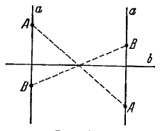

Рассмотрим теперь вместо бесконечной полосы плоскости множество точек, лежащих внутри некоторого прямоугольника $ABCD$ и на его сторонах $AB$ и $CD$ с исключением самих точек $A, B, C, D$ (таким образом, полностью

---
**стр. 567**
---

исключены отрезки $AD$ и $BC$). Легко доказать, что такое множество топологически эквивалентно бесконечной полосе плоскости, ограниченной двумя параллельными прямыми (т. е. допускает отображение на эту полосу — взаимно однозначное и в обе стороны непрерывное). Отождествим теперь попарно точки отрезков $AB$ и $CD$, расположенные симметрично относительно центра прямоугольника (при этом точка $A$ соединится с $C$, точка $B$ с $D$; на рис. 173 стрелками показаны направления отрезков $AB$ и $CD$, которые после соединения этих отрезков должны совпасть). Так мы получим многообразие с евклидовой метрикой, топологически эквивалентное одностороннему цилиндру (однако оно не является пространственной формой, так как не удовлетворяет условию полноты); его называют листом Мёбиуса.

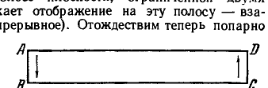

Описанное выше соединение противоположных сторон прямоугольника можно осуществить реально при помощи бумажной полоски и тем самым построить модель листа Мёбиуса (рис. 174). Пользуясь этой моделью, легко убедиться, что изображаемая ею поверхность является *односторонней*: ее нельзя покрасить в две краски так, чтобы краски сходились только на краю. Модель листа Мёбиуса делает до некоторой степени наглядным наше представление об одностороннем цилиндре, а также оправдывает его название.

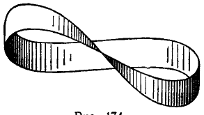

*Итак, мы получили третий класс параболических пространственных форм, представленных односторонним цилиндром и топологически эквивалентных листу Мёбиуса.*

Рассмотрим теперь на плоскости две системы параллельных прямых $\{a\}$ и $\{b\}$, которые разбивают ее на равные прямоугольники (рис. 175). Возьмем в каком-нибудь из них произвольную точку $M$. Перемещая выбранный прямоугольник по направлениям прямых $\{a\}$ и $\{b\}$, мы можем совместить его с любым другим прямоугольником; точка $M$ при этом будет занимать бесконечное множество новых положений, в каждом из которых мы снова обозначим ее буквой $M$. Так получается бесконечная совокупность точек $\{M\}$; условимся ее рассматривать как элемент нового множества $R$. В полной аналогии с предыдущим мы вводим в множество $R$ метрику: если $x = \{M\}$ и $y = \{N\}$ — две точки $R$, то $\rho(x, y)$ есть минимум евклидовых расстояний между точками совокупности $\{M\}$ и точками совокупности $\{N\}$. Получаемое таким путем метрическое пространство оказывается полным многообразием нулевой кривизны, т. е. пространственной формой параболической геометрии.

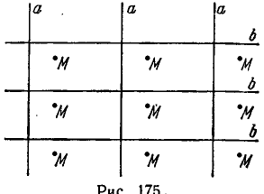

Наглядное представление этой формы дает прямоугольник с попарно отождествленными точками его противоположных сторон (рис. 176, где стрелками указаны направления сторон, которые при отождествлении этих сторон должны совпасть; так как все вершины прямоугольника соединяются в одну точку, то они помечены одинаковыми буквами). Заметим теперь, что при

---
**стр. 568**
---

отождествлении двух противоположных сторон прямоугольника получается «трубка»; последующее отождествление двух других сторон дает тор (рис. 177).

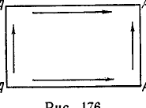

Таким образом, *топологический тип нового класса пространственных форм представляется тором* (поэтому они называются кольцевыми).

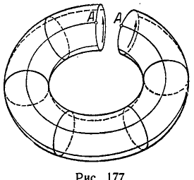

Вернемся к плоскости, разделенной на равные прямоугольники прямыми $\{a\}$ и $\{b\}$, но дополнительно проведем в каждой полосе между соседними прямыми $\{b\}$ среднюю линию (рис. 178). Пусть $M$ — произвольная точка какого-нибудь прямоугольника; передвигая выбранный прямоугольник вдоль полосы между двумя прямыми $\{a\}$ и накладывая его последовательно на все другие прямоугольники этой полосы, мы получим бесконечный ряд новых положений точки $M$; пометим все эти точки одной буквой $M$. Теперь каждый прямоугольник рассматриваемой полосы мы переместим вдоль прямых $\{b\}$ в соседнюю полосу и отмеченную в нем точку отразим зеркально относительно средней линии прямоугольника (проходящей между прямыми $\{b\}$); все полученные точки снова обозначим буквой $M$. Последний процесс будем продолжать

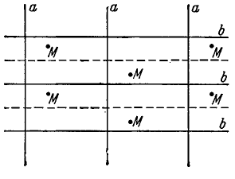

бесконечно. Получаемые таким путем совокупности точек $\{M\}$ мы условимся рассматривать как элементы нового метрического пространства $R$, метрика которого определяется точно таким же условием, как и во всех предыдущих случаях.

Мы приходим к параболической пространственной форме, которая представляется прямоугольником с попарно отождествленными точками противоположных сторон по схеме рис. 179. Это многообразие называется *односторонним тором*.

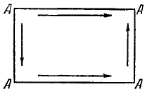

Попытаемся сделать модель одностороннего тора.

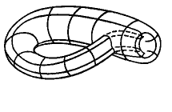
