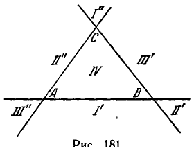

## 3. Эллиптические пространственные формы

---
**стр. 569**
---

Соединяя две горизонтальные стороны прямоугольника, изображенного на рис. 179, мы получим «трубку»; но чтобы соединить затем и вертикальные стороны прямоугольника так, как требует схема рис. 179, нам придется пропустить один конец этой трубки через стенку и соединить с другим концом изнутри (рис. 180). Односторонний тор представить в пространстве в виде поверхности без самопересечений невозможно.

*Параболические пространственные формы, представляемые односторонним тором, называются односторонне кольцевыми.*

Мы установили сейчас, что существуют многообразия нулевой кривизны, топологически эквивалентные как обыкновенному, так и одностороннему тору. Этот результат получен только благодаря тому, что мы ввели понятие абстрактного дифференциально-геометрического многообразия. Никакая регулярная поверхность евклидова пространства, имеющая топологический тип обыкновенного или одностороннего тора, не может иметь натуральную метрику всюду нулевой кривизны. Таким образом, мы не могли бы обнаружить кольцевые параболические формы, если бы оставались в рамках евклидовой теории поверхностей.

§ 241. Мы обнаружили пять классов пространственных форм параболической геометрии, топологические представители которых суть:

1) плоскость,

2) круглый цилиндр,

3) односторонний цилиндр,

4) тор,

5) односторонний тор.

Среди перечисленных многообразий имеется три открытых (первое, второе и третье) и два замкнутых (четвертое и пятое); наряду с этим мы имеем из них три двусторонних (первое, второе, четвертое) и два односторонних (третье и пятое). В топологии доказывается, что все эти многообразия топологически различны.

Кроме пяти перечисленных, никакие другие двумерные многообразия не могут нести на себе параболическую геометрию, т. е. не могут быть параболически метризованы с сохранением требования полноты. Доказательство этого утверждения коротко намечено в книге Клейна «Неевклидова геометрия», глава IX. Конечно, всякая область плоскости, цилиндра и т. д. представляет собою метризованное многообразие с геометрией нулевой кривизны, однако во всех этих случаях не удовлетворяется требование полноты. Все параболические формы, по самому своему определению, в малых частях имеют такую же геометрию, как и евклидова плоскость. Но в целом каждой пространственной форме соответствует своя геометрическая система, в которой точками являются элементы многообразия данной формы, прямыми — его геодезические линии. Взаимные отношения между точками и прямыми подчиняются всем аксиомам Гильберта только в геометрической системе первой из перечисленных пяти параболических пространственных форм. В геометрических системах остальных четырех форм имеют место совсем иные предложения, в большинстве своем отличные от евклидовых.

Например, в геометрии цилиндра, геодезическими которого являются винтовые линии и окружности, ортогональные к образующим, утверждение: через две точки проходит только одна прямая — неверно.

**3. Эллиптические пространственные формы**

§ 242. Существует два класса эллиптических пространственных форм; их представители суть 1) сфера, 2) эллиптическая плоскость.

То, что сфера есть пространственная форма эллиптической геометрии, усматривается непосредственно, так как полная кривизна сферы радиуса

---
**стр. 570**
---

$r$ во всех ее точках равна $\frac{1}{r^2}$. Таким образом, сфера как поверхность евклидова пространства имеет натуральную метрику постоянной положительной кривизны.

Мы покажем сейчас, что существует полное дифференциально-геометрическое многообразие постоянной положительной кривизны, которое сфере топологически неэквивалентно.

Пусть в евклидовом пространстве дана сфера $S$ радиуса $r$. Рассмотрим множество $R$, элементами которого являются пары диаметрально противоположных точек сферы $S$. В множестве $R$ мы введем метрику; именно, если $x = \{M_1, M_2\}$ и $y = \{N_1, N_2\}$ — два элемента множества $R$ (здесь $M_1, M_2$ и $N_1, N_2$ — две пары диаметрально противоположных точек сферы $S$), то в качестве расстояния $\rho(x, y)$ мы назначим минимум расстояний по сфере $S$ между точками пары $\{M_1, M_2\}$ и точками пары $\{N_1, N_2\}$.

Легко убедиться, что множество $R$ удовлетворяет аксиомам 1—3 § 235 (ср. § 240) и является метрическим пространством. Кроме того, для каждой точки $x$ множества $R$ существует $\varepsilon$-окрестность, изометричная $\varepsilon$-окрестности на сфере $S$. Следовательно, $R$ есть многообразие постоянной положительной кривизны; его полнота вытекает из полноты сферы $S$.

Таким образом, $R$ представляет собой пространственную форму геометрии положительной кривизны. Эту форму (как и все эквивалентные ей) называют *эллиптической плоскостью*.

Сфера, как известно, обладает тем свойством, что всякая простая замкнутая кривая на ней разделяет ее на две части. В эллиптической плоскости $R$ это свойство не выполняется. Действительно, рассмотрим на сфере $S$ какую-нибудь большую окружность и обозначим через $L$ множество, элементами которого являются пары диаметрально противоположных точек этой окружности. Множество $L$ представляет собой в $R$ простую замкнутую кривую, которая, однако, не разделяет $R$ на две части: любые две точки $R$, не принадлежащие $L$, можно соединить непрерывной кривой, не пересекающей $L$. Отсюда и следует, что сфера и эллиптическая плоскость топологически различны.

Таким образом, мы имеем две различные пространственные формы геометрии положительной кривизны, обе замкнутые. Других эллиптических пространственных форм не существует (доказательство опускаем).

§ 243. Здесь мы опишем два новых представления эллиптической плоскости.

1) Обозначим через $T$ множество, элементами которого являются все прямые, проходящие через центр сферы $S$ (т. е. связку прямых, концентричную с $S$). В множестве $T$ мы введем метрику, полагая $\rho(x, y) = \alpha r$, где $\alpha$ — наименьший угол между прямыми $x$ и $y$, $r$ — радиус сферы $S$. Сопоставление каждой прямой $x$ связки $T$ с парой точек пересечения $x$ со сферой $S$ дает изометрическое отображение $T$ на $R$. Следовательно, $T$ есть новое представление эллиптической плоскости.

---
**стр. 571**
---

2) Дополним евклидово пространство бесконечно удаленными точками так, как это делается в проективной геометрии (см. § 80). В евклидовом пространстве выберем произвольную плоскость $\alpha$ и будем рассматривать ее как проективную плоскость, т. е. с учетом бесконечно удаленных точек. На плоскости $\alpha$ мы введем метрику.

С этой целью возьмем какую-нибудь связку прямых $T$, центр которой не лежит в плоскости $\alpha$. Сопоставим с каждой прямой $u$ связки $T$ точку плоскости $\alpha$, лежащую на прямой $u$. Сопоставление будет взаимно однозначным (здесь существенно, что плоскость $\alpha$ дополнена бесконечно удаленными точками; благодаря этому прямым связки $T$, пересекающим плоскость $\alpha$, соответствуют ее бесконечно удаленные точки). В качестве расстояния между двумя точками $x, y$ плоскости $\alpha$ назначим число, равное расстоянию между теми элементами связки $T$, которые соответствуют точкам $x, y$ (метрика связки $T$ определена выше). Ясно, что при определении расстояний на плоскости $\alpha$ соответствие между точками плоскости $\alpha$ и прямыми связки $T$ является изометрическим. Следовательно, метризованная указанным способом проективная плоскость есть пространственная форма, эквивалентная $T$. Мы получаем новое представление эллиптической плоскости в виде метризованной проективной плоскости.

§ 244. Попытаемся сделать топологическую модель проективной плоскости в виде топологически эквивалентной ей поверхности евклидова пространства.

Возьмем в евклидовой плоскости $\alpha$ три прямые, не проходящие через одну точку; они разделяют плоскость $\alpha$ на семь областей, которые мы пометим значками $I'$, $I''$, $II'$, $II''$, $III'$, $III''$, $IV$.

При добавлении к плоскости $\alpha$ бесконечно удаленных точек первоначально различные области $I'$ и $I''$ соединяются в одну связную область; ее мы обозначим римской цифрой $I$ и назовем треугольником, так как она ограничена отрезками трех прямых. Аналогично области $II'$ и $II''$ соединяются в один треугольник $II$ и области $III'$ и $III''$ — в один треугольник $III$.

Таким образом, плоскость, пополненная бесконечно удаленными точками, тремя своими прямыми разделяется на четыре треугольника $I$, $II$, $III$, $IV$. Теперь заметим, что если мы удалим из рассматриваемого множества треугольник $IV$, то оставшаяся область будет топологически эквивалентна ленте Мёбиуса. Это станет наглядно ясным, если изобразить треугольники $I$, $II$, $III$ на рис. 182. Читатель сам легко убедится, что соединение треугольников $I$, $II$, $III$ на рис. 182 не отличается от соединения треугольников, помеченных теми же цифрами на рис. 181. В частности, вершины $A$ и $B$ треугольника $II$ следует считать соединенными с соответствующими вершинами, обозначенными теми же буквами у треугольника $III$. При таком соединении треугольники $I$, $II$, $III$ образуют ленту Мёбиуса, граница которой состоит из прямолинейных звеньев $CA$, $AB$, $BC$ и точек бесконечно удаленных; при соединении с бесконечно удаленными точками получается соединение ленты Мёбиуса с контуром треугольника $IV$.

Известно, что треугольник топологически эквивалентен сфере с одной вырезанной дырой. Таким образом, соединение контура $CABC$ ленты Мёбиуса с контуром треугольника $IV$ приводит к поверхности, топологически эквивалентной той, какая получается заклеиванием лентой Мёбиуса дырки в сфере. Эта поверхность является односторонней. В трехмерном евклидовом
