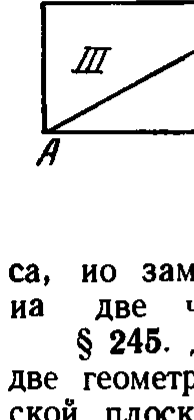
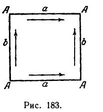
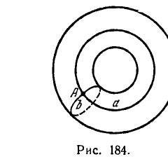
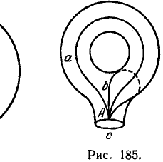
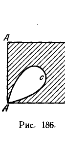
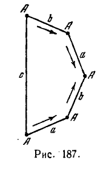
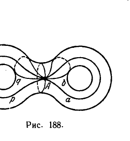
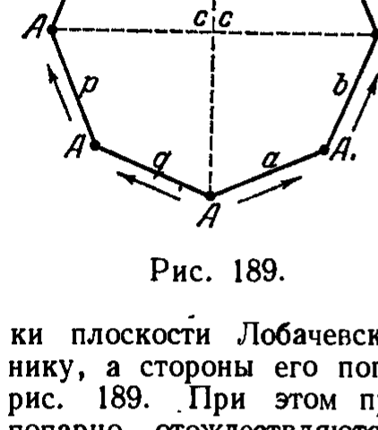
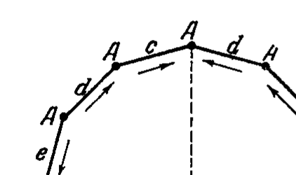

## 4. Гиперболические пространственные формы

---
**стр. 572**
---

пространстве указанную конструкцию без самопересечения поверхности осуществить невозможно. Изображение проективной плоскости в виде сферы с одним отверстием, заклеенным лентой Мёбиуса, позволяет наглядно истолковать особенности взаимного расположения проективных прямых на проективной плоскости. Отсюда, например, легко усматривается, что проективная прямая не разделяет проективную плоскость на две части.

В этом мы убедимся, если из проективной плоскости вырежем кружок, не затрагивая данную прямую $a$; оставшаяся часть проективной плоскости будет лентой Мёбиуса, содержащей прямую $a$, которую мы для наглядности вообразим совмещенной со средней линией этой ленты Мёбиуса, но замкнутый разрез ленты Мёбиуса по средней линии не разделяет ее на две части, что обнаруживает простая модель из бумаги.

§ 245. Двум эллиптическим пространственным формам соответствуют две геометрические системы: геометрия на сфере и геометрия на эллиптической плоскости. Геометрия на эллиптической плоскости представляет собой не что иное, как двумерную геометрию Римана (см. § 63—67). Соответственно этому эллиптическую плоскость называют также плоскостью Римана.

**4. Гиперболические пространственные формы**

§ 246. В отличие от эллиптической геометрии, которая имеет два класса топологически эквивалентных пространственных форм, и параболической геометрии, для которой существует пять классов, гиперболическая геометрия может быть реализована с соблюдением условия полноты на бесконечном множестве топологически различных двумерных многообразий. Даже среди замкнутых многообразий имеется бесконечно много таких, на которых можно задать метрику постоянной кривизны $K < 0$.

На основании результатов, изложенных в §§ 216—222 и 227—228, мы можем утверждать, что каждая плоскость в аксиоматически определенном пространстве Лобачевского представляет собой дифференциально-геометрическое многообразие постоянной отрицательной кривизны; это многообразие является полным, что доказывается совершенно так же, как полнота евклидовой плоскости (с использованием аксиом только абсолютной геометрии). Мы можем, следовательно, заключить, что плоскость Лобачевского есть одна из гиперболических пространственных форм. Определяемый ею класс характеризуется следующим образом: его представители суть полные дифференциально-геометрические многообразия постоянной отрицательной кривизны, топологически эквивалентные обыкновенной (евклидовой) плоскости. Все эти многообразия называются гиперболическими плоскостями.

§ 247. Считая данной некоторую гиперболическую плоскость, мы покажем, как построить бесконечное множество других гиперболических форм. Прежде всего займемся замкнутыми формами.

Мы воспользуемся одним известным в элементарной топологии методом конструирования замкнутых двумерных многообразий. Некоторое время мы будем стоять на чисто топологической точке зрения, т. е. будем допускать любые непрерывные деформации фигур, хотя бы и нарушающие их метрические свойства. Кроме того, чтобы облегчить изложение, мы будем пользоваться наглядно описательными приемами.

Вообразим квадрат, изготовленный из тонкой резиновой пленки (рис. 183). Соединяя его стороны, помеченные одной буквой $a$, так, чтобы указанные стрелками направления этих сторон совпали, мы превратим этот квадрат

---
**стр. 573**
---

в трубку. После этого, соединяя границы отверстий трубки, мы получим тор (рис. 184). Таким образом, тор можно рассматривать как квадрат, у которого попарно склеены противоположные стороны так, что направления их, помеченные на рис. 183 стрелками, совпадают, а все четыре вершины соединяются в одной точке (на рис. 183 соединяемые стороны обозначены одной буквой: все четыре вершины помечены одной буквой $A$; на рис. 184, где изображен готовый тор, обозначения соответствуют употребляемым на рис. 183).

Представим себе, что в торе сделано отверстие так, что после этого он превращается в «ручку» (рис. 185). Пусть край этого отверстия проходит

через точку $A$. Тогда на исходном квадрате край отверстия представится в виде замкнутой линии $c$, проходящей через точку $A$ (рис. 186). Разрывая линию $c$ в точке $A$ и совершая некоторую деформацию фигуры, изображенной на рис. 186, мы можем превратить ее в пятиугольник, показанный на рис. 187. Обратно, склеивая стороны этого пятиугольника, помеченные

одной буквой $a$, так, чтобы направления их, указанные стрелками, совместились, аналогично склеивая стороны, обозначенные буквой $b$, и оставляя свободной сторону $c$ в качестве границы фигуры, мы снова получим ручку.

Склеивая границы двух ручек, мы получим «крендель» (рис. 188). Вместе с тем его, очевидно, можно рассматривать как восьмиугольник, стороны которого попарно склеены по схеме, указанной на рис. 189, где соединяемые стороны обозначены одинаковыми буквами, а направления их, которые должны быть совмещены, помечены стрелками. Действительно, такой

---
**стр. 574**
---

восьмиугольник возникает из двух пятиугольников, изображающих ручки, при соединении их по свободным сторонам.

Аналогично тому, как тор — поверхность рода 1 — получается попарным соединением сторон квадрата, крендель — поверхность рода 2 — попарным соединением сторон восьмиугольника, — каждая замкнутая двусторонняя поверхность рода $p$ может быть получена путем попарного соединения сторон $4p$-угольника по определенной схеме, которую мы показываем для частного случая $p = 3$ на рис. 190, 191.

Теперь займемся построением замкнутых пространственных форм гиперболической геометрии. Докажем прежде всего, что существует форма, топологически эквивалентная поверхности рода $p = 2$ (т. е. «кренделю»).

Рассмотрим на плоскости Лобачевского некоторую точку $O$ и проведем через нее четыре прямые так, чтобы они составили правильную звезду. Откладывая на каждой из этих прямых в обе стороны от точки $O$ конгруэнтные отрезки длины $r$ и соединяя прямолинейными отрезками их концы, мы получим правильный восьмиугольник $P_8$. Исключим из рассмотрения точки плоскости Лобачевского, внешние по отношению к этому восьмиугольнику, а стороны его попарно отождествим, следуя той схеме, какая дается рис. 189. При этом предполагается, что при отождествлении двух сторон попарно отождествляются точки, делящие эти стороны в одинаковых отношениях. Обозначим через $R$ множество, элементами которого являются: 1) внутренние точки восьмиугольника $P_8$; 2) пары отождествляемых точек сторон; 3) восьмерка (отождествленных) вершин. Полагая, что все точки плоскости Лобачевского, представляющие

<!-- рисунок 191 на стр. 574 не вырезан в этом прогоне -->

некоторый элемент $x$ множества $R$, обозначены одной буквой $M$, мы будем этот элемент записывать символически в виде $x = \{M\}$. Условимся расстояние между двумя точками $P$ и $Q$ плоскости Лобачевского обозначать через $d(P, Q)$.

В множестве $R$ мы введем метрику. Именно, если $x = \{M\}$ и $y = \{N\}$ — два элемента $R$, то в качестве $\rho(x, y)$ мы назначим наименьшее из двух чисел:

$$d_1 = d(M, N),$$

$$d_2 = \min [d(M, T_1) + d(N, T_2)],$$

где $T_1$ и $T_2$ — любые две отождествляемые точки. Тем самым $R$ превращается в метрическое пространство, топологически эквивалентное «кренделю». Мы можем мыслить $R$ в виде «кренделя», на котором задана искусственная метрика, при помощи накрытия «кренделя» восьмиугольником $P_8$ (т. е. при

---
**стр. 575**
---

помощи некоторого отображения восьмиугольника $P_8$ на «крендель»). Эта метрика будет обычной метрикой Лобачевского в каждой достаточно малой окрестности любой точки «кренделя», за исключением, может быть, окрестностей той точки, в которой совмещаются все вершины восьмиугольника.

Указанная точка окажется особой точкой метризованного «кренделя», если сумма внутренних углов восьмиугольника будет отличаться от четырех прямых. Чтобы метрика, заданная нами на кренделе, была всюду регулярной, мы должны употреблять такой восьмиугольник, у которого сумма внутренних углов равна четырем прямым.

Таким образом, вопрос о возможности регулярной гиперболической метризации «кренделя» сводится к вопросу о существовании в геометрии Лобачевского правильного восьмиугольника с нужной нам суммой углов. Этот вопрос легко решается в утвердительном смысле.

В самом деле, пусть $S(r)$ — сумма внутренних углов восьмиугольника $P_8$; через $r$ здесь обозначено расстояние от вершины восьмиугольника до его центра (эта величина упоминалась при построении $P_8$). Заметим, что на плоскости Лобачевского сумма внутренних углов бесконечно уменьшающегося треугольника стремится к $\pi$. Поэтому $S(r) \to 6\pi$ при $r \to 0$ (т. е. $S(r)$ стремится к сумме внутренних углов евклидова восьмиугольника). Отсюда следует, что при достаточно малом $r = r_0$ $S(r_0) > 2\pi$. С другой стороны, если мы обозначим через $\beta(r)$ величину половины одного угла восьмиугольника $P_8$, а через $\delta(r)$ — половину стороны этого восьмиугольника, то, очевидно, $\beta(r) < \Pi(\delta(r))$, где $\Pi$ — функция Лобачевского.

Так как при $r \to \infty$ также и $\delta(r) \to \infty$ (см. лемму II § 30), а при $\delta \to \infty$ $\Pi(\delta) \to 0$, то вследствие предыдущего неравенства $\beta(r)$ при $r \to \infty$ стремится к нулю. Отсюда при $r \to \infty$ имеем $S(r) = 16\beta(r) \to 0$. Таким образом, для достаточно больших $r$ должно быть $S(r) < 2\pi$.

В силу непрерывности функции $S(r)$ существует такое $r = r_1$, что $S(r_1) = 2\pi$. Тем самым требуемое доказано.

Заметив, что на плоскости Лобачевского всякий четырехугольник имеет сумму внутренних углов, меньшую $2\pi$, легко понять, что нашим методом построить всюду определенную гиперболическую метрику на торе нельзя. Можно доказать, что тор (который есть поверхность рода $p = 1$) вообще не является топологическим представителем пространственных форм гиперболической геометрии.

Напротив, каждая двусторонняя замкнутая поверхность рода $p > 2$, как и в рассмотренном случае $p = 2$, может быть гиперболически метризована. Это сразу следует из того, что на плоскости Лобачевского существует правильный $4p$-угольник с суммой внутренних углов, равной $2\pi$.

Аналогичные соображения позволяют установить, что и каждая односторонняя замкнутая поверхность, кроме проективной плоскости и одностороннего тора, допускает гиперболическую метризацию *).

Все изложенное в этом параграфе мы резюмируем следующей теоремой.

*Различных классов замкнутых гиперболических пространственных форм бесконечно много; топологическими представителями их служат все замкнутые поверхности, кроме тех, какие представляют параболические и эллиптические пространственные формы.*

*) Односторонние замкнутые поверхности получаются из $2n$-угольников при помощи попарного отождествления их сторон по специальной схеме; в частном случае $n = 2$ мы демонстрировали эту схему в § 240 при построении одностороннего тора. Краткие, но достаточные для данного вопроса сведения по топологии замкнутых поверхностей, а также фотографии моделей некоторых замкнутых односторонних поверхностей в евклидовом пространстве (с самопересечениями, конечно) читатель найдет в книге: Д. Гильберт и С. Э. Кон-Фоссен, Наглядная геометрия, изд. 2-е, 1951.

---
**стр. 576**
---

§ 248. По поводу открытых пространственных форм гиперболической геометрии мы скажем лишь несколько слов. Таких форм также имеется бесконечное множество. Чтобы это стало ясным, достаточно показать несколько примеров.

Рассмотрим на плоскости Лобачевского бесконечную полосу $P_1$, ограниченную двумя п а р а л л е л ь н ы м и прямыми. Пусть $P_2$ — еще одна точно такая же полоса. Если идентифицировать прямые, ограничивающие полосу $P_1$, с прямыми, ограничивающими полосу $P_2$, а внутренние точки этих полос считать различными, то получится многообразие, гомеоморфное цилиндру со всюду определенной на нем гиперболической метрикой. Условие полноты при этом с очевидностью выполняется.

Иначе можно поступить еще так: взять два экземпляра полосы плоскости Лобачевского, ограниченной двумя р а с х о д я щ и м и с я прямыми, наложить их друг на друга и идентифицировать совместившиеся границы. Тогда снова получится гиперболически метризованный цилиндр.

Между прочим, полученные двумя указанными способами гиперболически метризованные многообразия имеют одинаковую внутреннюю геометрию в малом, один топологический тип и оба являются полными, но метрические их свойства в целом существенно различны (одно из них есть трубка, бесконечно <!-- вероятная опечатка оригинала: бескс- --> расширяющаяся в одну сторону и бесконечно сужающаяся в другую; второе представляет собой трубку, бесконечно расширяющуюся в обе стороны).

Если рассматривать два наложенных друг на друга «треугольника» с бесконечно простирающимися сторонами (такие фигуры на плоскости Лобачевского, очевидно, существуют) и идентифицировать точки на их границах, то получится полное гиперболически метризованное открытое многообразие нового топологического типа.

Этот прием можно варьировать без конца. Нельзя, однако, таким приемом получить, например, гиперболическую метрику на сфере; если бы мы идентифицировали точки на границе двух совмещенных кругов плоскости Лобачевского, то имели бы сферу с гиперболической метрикой, но с особой линией. В данном случае прием не дает многообразия со всюду определенной метрикой, так как плоскость Лобачевского (как и плоскость Евклида) не симметрична относительно окружности.

§ 249. Подведем итоги нашего исследования. Мы получили бесконечно много различных многообразий, несущих на себе геометрию постоянной кривизны. Все многообразия, обладающие метрикой данной постоянной кривизны, имеют общую геометрию в малом. Каждое из них допускает конгруэнтные, в смысле своей геометрии, перемещения по себе своих достаточно малых частей, и совокупность этих перемещений транзитивна относительно линейных элементов. Но метризованные многообразия разных топологических типов в целом обладают разными геометриями. Каждому из них соответствует своя система теорем, выражающих свойства принадлежащих этому многообразию объектов. Класс таких геометрий является естественным обобщением геометрий Евклида, Лобачевского и Римана.

В этом разделе мы занимались исключительно геометриями двух измерений. С неевклидовыми геометриями размерности $n \geqslant 3$ читатель может познакомиться по книгам: Ф. К л е й н, Неевклидова геометрия, П. К. Р а ш е в с к и й, Риманова геометрия и тензорный анализ, Э. К а р т а н, Геометрия римановых пространств (см. также первое издание настоящей книги).
