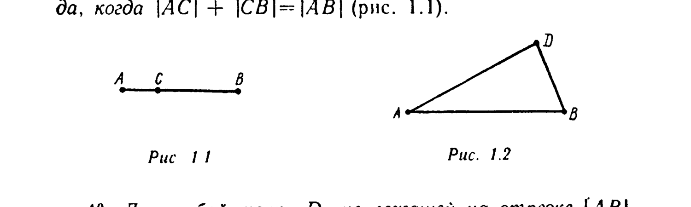
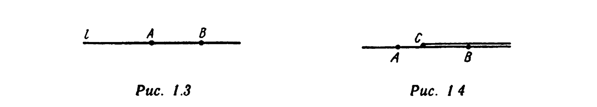
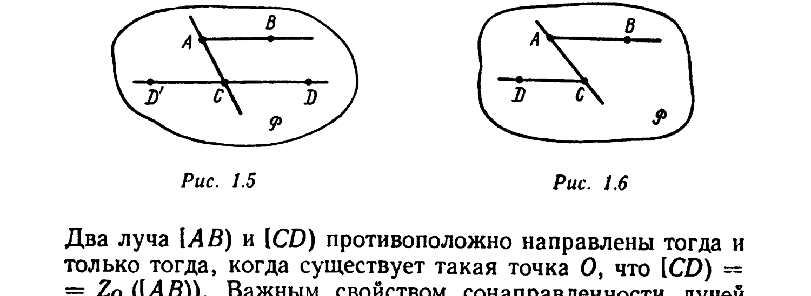
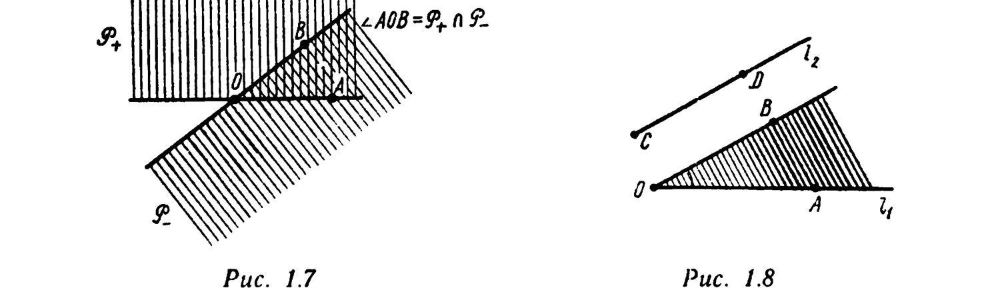

# Глава 1. Сведения из элементарной геометрии

## § 1. Некоторые необходимые определения и обозначения

---
**стр. 6**
---

*Отрезок прямой* определяется двумя равноправными точками — его концами. Отрезок с концами $A$ и $B$ обозначают $[AB]$ или $[BA]$. Если $A$ и $B$ — различные точки (обозначение: $A \neq B$), то отрезок $[AB]$ единственным образом определяет прямую $(AB)$. В этом случае, говоря об отрезке $[AB]$ как о множестве точек, считают, что это множество состоит из точек $A$ и $B$ и тех и только тех точек $C$, которые лежат на прямой $(AB)$ между точками $A$ и $B$. Если $A = B$, то отрезок $[AA]$ состоит из единственной точки $A$.

Если выбрана единица измерения, то каждому отрезку $[AB]$ можно сопоставить неотрицательное действительное число $|AB|$, которое называется его *длиной*. Условимся считать, что единица измерения длин выбрана, и, говоря о длинах отрезков, не будем указывать, в каких именно единицах они выражаются. Длина отрезка $[AB]$ называется также *расстоянием между точками $A$ и $B$*.

Приведем свойства расстояния.

1°. $|AB| = |BA|$.
2°. $|AB| > 0$, если $A \neq B$, и $|AB| = 0$, если $A = B$.
3°. Точка $C$ лежит на отрезке $[AB]$ тогда и только тогда, когда $|AC| + |CB| = |AB|$ (рис. 1.1).

4°. Для любой точки $D$, не лежащей на отрезке $[AB]$, выполняется неравенство $|AD| + |DB| > |AB|$, называемое *неравенством треугольника* (рис. 1.2).

Пусть $A \neq B$. Точка $C$ отрезка $[AB]$, отличная от его концов, называется *внутренней точкой* этого отрезка. Ее положение на отрезке $[AB]$ однозначно определяется дли-

---
**стр. 7**

---

ной отрезка $[AC]$ или отношением $\lambda = |AC| : |CB|$, которое называется *отношением, в котором точка $C$ делит отрезок $[AB]$, считая от точки $A$*. Если $\lambda = 1$, т. е. $|AC| = |CB|$, то точка $C$ называется *серединой отрезка $[AB]$*. Серединой отрезка $[AA]$ называется точка $A$. Если $O$ — фиксированная точка, то отображение $Z_O$, при котором каждой точке $A$ ставится в соответствие такая точка $B = Z_O(A)$, что $O$ — середина отрезка $[AB]$, называется *центральной симметрией относительно точки $O$*. Точка $O$ называется *центром симметрии*. Точки $A$ и $Z_O(A)$ называются *симметричными относительно точки $O$*.

Любая лежащая на прямой $l$ точка $A$ разбивает эту прямую на два *луча* $l_+$ и $l_-$ с началом в точке $A$. Эти лучи называются *дополнительными* друг к другу (обозначение: $l_+ = \bar{l}_-$, $l_- = \bar{l}_+$). Точка $A$ принадлежит каждому из лучей $l_+$ и $l_-$. Две точки $B \neq A$ и $C \neq A$ прямой $l$ принадлежат одному и тому же лучу с началом в точке $A \in l$ тогда и только тогда, когда отрезок $[BC]$ не содержит точки $A$, и принадлежат дополнительным лучам, когда точка $A$ является внутренней точкой этого отрезка. Луч с началом в точке $A$, на котором лежит точка $B \neq A$, обозначают $[AB)$ (рис. 1.3).

Два луча, лежащие на одной прямой, называются *сонаправленными*, если их пересечение есть луч, и *противоположно направленными*, если их пересечение не является лучом. Например, на рис. 1.4 лучи $[AB)$ и $[CB)$ сонаправлены, а лучи $[BA)$ и $[CB)$ противоположно направлены.

Всякая прямая $l$, лежащая в плоскости $P$, разбивает эту плоскость на две *полуплоскости* $P_+$ и $P_-$, про которые говорят, что они *определяются прямой $l$*. Прямая $l$ принадлежит каждой из этих полуплоскостей. Две точки $B \notin l$ и $C \notin l$ плоскости $P$ лежат в одной полуплоскости, определяемой прямой $l \subset P$, тогда и только тогда, когда отрезок $[BC]$ не имеет с прямой $l$ общих точек.

Два луча $[AB)$ и $[CD)$, лежащие на параллельных несовпадающих прямых, принадлежат некоторой плоскости $P$. Лучи $[AB)$ и $[CD)$ называются *сонаправленными* (обозначение: $[AB) \uparrow\uparrow [CD)$), если они лежат в одной полу-

---
**стр. 8**

---

плоскости, определяемой прямой $(AC) \subset P$ (рис. 1.5), и *противоположно направленными* (обозначение: $[AB) \uparrow\downarrow [CD)$), если они лежат в разных полуплоскостях (рис. 1.6). Очевидно, что если $[AB) \uparrow\uparrow [CD)$, то $[\overline{AB}) \uparrow\downarrow [CD)$.

Два луча $[AB)$ и $[CD)$ противоположно направлены тогда и только тогда, когда существует такая точка $O$, что $[CD) = Z_O([AB))$. Важным свойством сонаправленности лучей является транзитивность этого отношения: *два луча, порознь сонаправленные третьему, сонаправлены друг другу*.

Пусть $P$ — некоторая плоскость, $O, A, B$ — три ее различные точки, не лежащие на одной прямой. Точка $B$ расположена в одной из двух полуплоскостей, на которые прямая $(OA)$ разбивает плоскость $P$. Обозначим эту полуплоскость $P_+$. Аналогично, точка $A$ расположена в некоторой полуплоскости $P_-$, определяемой в плоскости $P$ прямой $(OB)$. *Выпуклым углом $\angle AOB$ между лучами $[OA)$ и $[OB)$ называется пересечение множеств $P_+$ и $P_-$* (рис. 1.7). Величина выпуклого угла $\angle AOB$ называется *углом между лучами $[OA)$ и $[OB)$* (обозначение: $A\hat{O}B$). Эта величина может выражаться как в градусах, так и в радианах. При этом в радианной мере $0 < A\hat{O}B < \pi$, а в градусной мере $0° < A\hat{O}B < 180°$.

Пусть лучи $l_1 = [OA)$ и $l_2 = [CD)$ не лежат

---
**стр. 9**

---

на параллельных прямых. Из точки $O$ выходит единственный луч $[OB)$, сонаправленный лучу $l_2$. *Углом между лучами $l_1$ и $l_2$ называется угол $A\hat{O}B$* (рис. 1.8).

По определению угол между сонаправленными лучами равен $0°$, угол между противоположно направленными лучами — $180°$.
