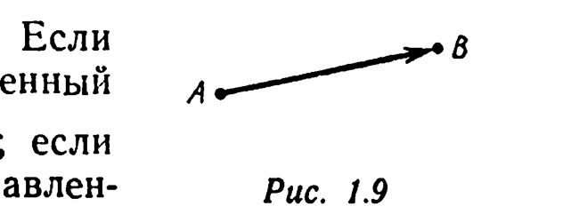
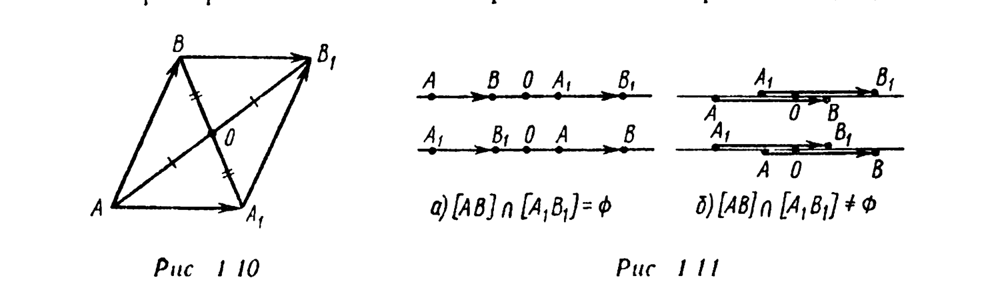

# Глава 1. Сведения из элементарной геометрии

## § 3. Направленный отрезок. Параллельный перенос

*Направленным отрезком $\overrightarrow{AB}$ называется упорядоченная пара точек $A$ и $B$.* Точка $A$ называется *началом* направленного отрезка $\overrightarrow{AB}$, точка $B$ — его *концом*. На рисунках направленный отрезок изображают стрелкой, идущей из его начала в его конец (рис. 1.9). Направленный отрезок $\overrightarrow{BA}$ называется *противоположным* направленному отрезку $\overrightarrow{AB}$ (обозначение: $-\overrightarrow{AB}$). Если точки $A$ и $B$ различны, то направленный отрезок $\overrightarrow{AB}$ называется *ненулевым*; если точки $A$ и $B$ совпадают, то направлен-

---
**стр. 10**

---

ный отрезок $\overrightarrow{AB}$, точнее $\overrightarrow{AA}$, называется *нулевым* (обозначение: $\vec\theta_A$). *Длиной $|\overrightarrow{AB}|$ направленного отрезка $\overrightarrow{AB}$ называется величина* $|AB|$.

Направленный отрезок $\overrightarrow{AB}$ называется *параллельным прямой $l$ (плоскости $P$)*, если либо он нулевой, либо прямая $(AB)$ параллельна $l$ (плоскости $P$). Ненулевой направленный отрезок $\overrightarrow{AB}$ называется *перпендикулярным прямой $l$ (плоскости $P$)*, если прямая $(AB)$ перпендикулярна $l$ (плоскости $P$). Направленные отрезки $\overrightarrow{A_1B_1}, \ldots, \overrightarrow{A_nB_n}$ называются *коллинеарными*, если существует прямая $l$, которой параллелен каждый из этих отрезков. Для обозначения параллельности (коллинеарности) используют символ $\|$, а для обозначения перпендикулярности — символ $\perp$. Направленные отрезки $\overrightarrow{A_1B_1}, \ldots, \overrightarrow{A_nB_n}$ называются *компланарными*, если существует плоскость $P$, которой параллелен каждый из этих отрезков. Если направленные отрезки коллинеарны, то они компланарны. Если направленные отрезки $\overrightarrow{AB}$ и $\overrightarrow{CD}$ перпендикулярны одной плоскости $P$, то они коллинеарны: $\overrightarrow{AB} \| \overrightarrow{CD}$.

Два направленных отрезка $\overrightarrow{AB}$ и $\overrightarrow{CD}$ называются *сонаправленными* (обозначение: $\overrightarrow{AB} \uparrow\uparrow \overrightarrow{CD}$), если либо один из них нулевой, либо $[AB) \uparrow\uparrow [CD)$, т. е. если $\overrightarrow{AB}$ и $\overrightarrow{CD}$ коллинеарны и лучи $[AB)$ и $[CD)$ сонаправлены. Два направленных отрезка $\overrightarrow{AB}$ и $\overrightarrow{CD}$ называются *противоположно направленными* (обозначение: $\overrightarrow{AB} \uparrow\downarrow \overrightarrow{CD}$), если либо один из них нулевой, либо $[AB) \uparrow\downarrow [CD)$.

Направленные отрезки $\overrightarrow{AB}$ и $\overrightarrow{A_1B_1}$ называются *равными*, если середины отрезков $[A_1B]$ и $[AB_1]$ совпадают (обозначение: $\overrightarrow{AB} = \overrightarrow{A_1B_1}$). Из данного определения следует, что
$$\overrightarrow{AB} = \overrightarrow{A_1B_1} \iff \overrightarrow{BB_1} = \overrightarrow{AA_1}. \quad (1.1)$$
Очевидно, что $\overrightarrow{AB} = \overrightarrow{A_1B_1}$ тогда и только тогда, когда $-\overrightarrow{AB} = -\overrightarrow{A_1B_1}$. Используя понятие центральной симметрии, можно сказать, что $\overrightarrow{AB} = \overrightarrow{A_1B_1}$ тогда и только тогда, когда существует такая точка $O$ (общая середина отрезков $[A_1B]$ и $[AB_1]$), что $A_1 = Z_O(B)$, $B_1 = Z_O(A)$ (рис. 1.10 и 1.11).

---
**стр. 11**

---

Из свойств параллелограмма следует, что направленные отрезки $\overrightarrow{AB}$ и $\overrightarrow{A_1B_1}$, не лежащие на одной прямой, равны тогда и только тогда, когда четырехугольник $ABB_1A_1$ — параллелограмм (рис. 1.10). Для равных направленных отрезков $\overrightarrow{AB}$ и $\overrightarrow{A_1B_1}$, лежащих на одной прямой, возможно одно из четырех расположений, изображенных на рис. 1.11, а, б.

Итак, равенство $\overrightarrow{AB} = \overrightarrow{A_1B_1}$ имеет место тогда и только тогда, когда: а) направленные отрезки $\overrightarrow{AB}$ и $\overrightarrow{A_1B_1}$ коллинеарны; б) $\overrightarrow{AB} \uparrow\uparrow \overrightarrow{A_1B_1}$; в) $|\overrightarrow{AB}| = |\overrightarrow{A_1B_1}|$.

Как следует из определения, нулевой направленный отрезок равен любому другому нулевому направленному отрезку и только нулевому. Всякий направленный отрезок равен самому себе. Если $\overrightarrow{AB} = \overrightarrow{CD}$, то $\overrightarrow{CD} = \overrightarrow{AB}$. Из транзитивности отношений параллельности прямых, сонаправленности лучей, равенства действительных чисел следует, что если $\overrightarrow{AB} = \overrightarrow{CD}$, $\overrightarrow{CD} = \overrightarrow{EF}$, то $\overrightarrow{AB} = \overrightarrow{EF}$. Таким образом, отношение равенства направленных отрезков обладает свойством транзитивности. Это отношение является *отношением эквивалентности*. Оно разбивает множество направленных отрезков на классы эквивалентности. Каждый класс эквивалентности характеризуется тем, что ему принадлежат все попарно равные направленные отрезки и только они.

Для любого направленного отрезка $\overrightarrow{AB}$ и любой точки $C$ существует одна и только одна точка $D$ такая, что $\overrightarrow{AB} = \overrightarrow{CD}$ (точка $D$ симметрична точке $A$ относительно середины отрезка $[BC]$). Тот факт, что найдена точка $D$ такая, что $\overrightarrow{AB} = \overrightarrow{CD}$, выражают следующей фразой: от точки $C$ *отложен* направленный отрезок $\overrightarrow{CD}$, равный $\overrightarrow{AB}$. Точку $D$ называют образом точки $C$ при *параллельном переносе на направленный отрезок $\overrightarrow{AB}$* (обозначение: $D = T_{\overrightarrow{AB}}(C)$).

Свойства параллельного переноса приведены в Дополнении.
