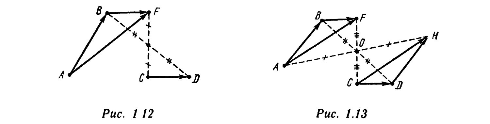
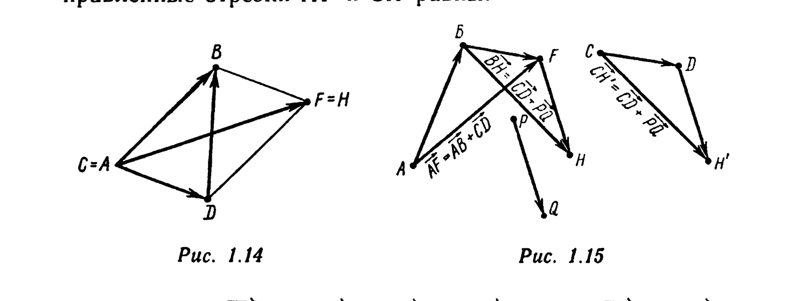
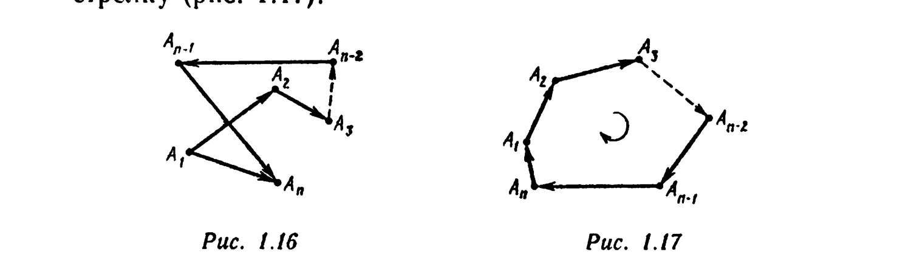

# Глава 1. Сведения из элементарной геометрии

## § 4. Сложение направленных отрезков. Композиция параллельных переносов

*Суммой $\overrightarrow{AB} + \overrightarrow{CD}$ направленных отрезков $\overrightarrow{AB}$ и $\overrightarrow{CD}$ называется направленный отрезок $\overrightarrow{AF}$, где $F = T_{\overrightarrow{CD}}(B)$* (рис. 1.12). Операция нахождения суммы называется *сложением* направленных отрезков. Сформулируем законы сложения направленных отрезков в виде следующих утверждений.

I. $\overrightarrow{AB} + \vec\theta_C = \overrightarrow{AB}$; $\overrightarrow{AB} + \overrightarrow{BA} = \overrightarrow{AB} + (-\overrightarrow{AB}) = \vec\theta_A = \vec\theta_C$.

II. Если $\overrightarrow{C_1D_1} = \overrightarrow{CD}$, то $\overrightarrow{AB} + \overrightarrow{C_1D_1} = \overrightarrow{AB} + \overrightarrow{CD}$.

III. *Коммутативность сложения.* Для любых направленных отрезков $\overrightarrow{AB}$ и $\overrightarrow{CD}$ выполнено равенство $\overrightarrow{AB} + \overrightarrow{CD} = \overrightarrow{CD} + \overrightarrow{AB}$.

⊳ Пусть $F$ и $H$ — такие точки, что $\overrightarrow{BF} = \overrightarrow{CD}$, $\overrightarrow{DH} = \overrightarrow{AB}$ (рис. 1.13). Это означает, что середины отрезков $[BD]$ и $[CF]$ совпадают. Также совпадают середины отрезков $[BD]$ и $[AH]$. Следовательно, совпадают и середины отрезков $[CF]$ и $[AH]$, т. е. $\overrightarrow{AF} = \overrightarrow{CH}$. Но, по определению, $\overrightarrow{AF}$ есть $\overrightarrow{AB} + \overrightarrow{CD}$, а $\overrightarrow{CH}$ является суммой $\overrightarrow{CD} + \overrightarrow{AB}$. ∎

Если точки $A$ и $C$ совпадают, то совпадают и точки $F$ и $H$ (направленные отрезки $\overrightarrow{AF}$ и $\overrightarrow{CH}$ равны, у них общее начало, а значит, и общий конец). Если точки $A = C$, $B$, $F = H$, $D$ не лежат на одной прямой, то четырехугольник $ABFD$ — параллелограмм. Таким образом, справедливо *правило параллелограмма* (рис. 1.14): сумма двух неколлинеарных направленных отрезков $\overrightarrow{AB}$ и $\overrightarrow{AD}$, имеющих общее начало $A$, есть направленный отрезок $\overrightarrow{AF}$,

---
**стр. 13**

---

где $[AF]$ — диагональ параллелограмма $ABFD$, построенного на отрезках $[AB]$ и $[AD]$ как на сторонах.

*Замечание.* Если $A \neq C$, то в соответствии с определением суммы направленные отрезки $\overrightarrow{AF} = \overrightarrow{AB} + \overrightarrow{CD}$ и $\overrightarrow{CH} = \overrightarrow{CD} + \overrightarrow{AB}$ имеют разные начала (соответственно $A$ и $C$). Отрезки $[AF]$ и $[CH]$ различны, тем не менее направленные отрезки $\overrightarrow{AF}$ и $\overrightarrow{CH}$ равны.

IV. Если $\overrightarrow{AB} = \overrightarrow{A_1B_1}$, $\overrightarrow{CD} = \overrightarrow{C_1D_1}$, то $\overrightarrow{AB} + \overrightarrow{CD} = \overrightarrow{A_1B_1} + \overrightarrow{C_1D_1}$.

V. *Ассоциативность сложения.* Для любых направленных отрезков $\overrightarrow{AB}, \overrightarrow{CD}, \overrightarrow{PQ}$ выполняется равенство
$$(\overrightarrow{AB} + \overrightarrow{CD}) + \overrightarrow{PQ} = \overrightarrow{AB} + (\overrightarrow{CD} + \overrightarrow{PQ}). \quad (1.2)$$

⊳ Пусть $F = T_{\overrightarrow{CD}}(B)$, $H = T_{\overrightarrow{PQ}}(F)$ (рис. 1.15). По определению суммы, $\overrightarrow{AF} = \overrightarrow{AB} + \overrightarrow{CD}$, $\overrightarrow{AH} = \overrightarrow{AF} + \overrightarrow{PQ} = (\overrightarrow{AB} + \overrightarrow{CD}) + \overrightarrow{PQ}$. На основании утверждения IV $\overrightarrow{BH} = \overrightarrow{CD} + \overrightarrow{PQ}$. Тогда, по определению суммы, $\overrightarrow{AH} = \overrightarrow{AB} + \overrightarrow{BH} = \overrightarrow{AB} + (\overrightarrow{CD} + \overrightarrow{PQ})$. Учитывая транзитивность равенства направленных отрезков, получаем отсюда равенство (1.2). ∎

*Замечание.* Из утверждения V по индукции получаем, что результат сложения нескольких направленных отрезков не зависит от того, как в рассматриваемой сумме расставлены скобки. Поэтому сумму направленных отрезков $\overrightarrow{A_1B_1}, \overrightarrow{A_2B_2}, \ldots, \overrightarrow{A_nB_n}$ обозначают так:
$$\overrightarrow{A_1B_1} + \overrightarrow{A_2B_2} + \ldots + \overrightarrow{A_nB_n}.$$

---
**стр. 14**

---

В силу утверждения III в этой сумме не важен и порядок слагаемых.

Пусть $A_1, A_2, \ldots, A_n$ — конечный набор точек. Ломаную линию с последовательными вершинами в этих точках называют *путем*, идущим из точки $A_1$ в точку $A_n$. Для всякого пути справедливо *правило замыкающей* (рис. 1.16):
$$\overrightarrow{A_1A_2} + \overrightarrow{A_2A_3} + \ldots + \overrightarrow{A_{n-1}A_n} = \overrightarrow{A_1A_n}.$$

Замкнутая ломаная линия $A_1A_2\ldots A_nA_1$ называется *циклом*. Справедливо следующее *правило цикла*:
$$\overrightarrow{A_1A_2} + \overrightarrow{A_2A_3} + \ldots + \overrightarrow{A_{n-1}A_n} + \overrightarrow{A_nA_1} = \vec\theta_{A_1}. \quad (1.3)$$

Для того чтобы указать, что к циклу $A_1A_2\ldots A_nA_1$ применяется правило цикла, на рисунке внутри цикла изображают стрелку (рис. 1.17).

Используя свойства 6° и 8° параллельного переноса (см. Дополнение), правило цикла можно записать на языке преобразований следующим образом: преобразование $T_{\overrightarrow{A_nA_1}} \circ T_{\overrightarrow{A_{n-1}A_n}} \circ \ldots \circ T_{\overrightarrow{A_2A_3}} \circ T_{\overrightarrow{A_1A_2}}$ является тождественным преобразованием.

*Разностью $\overrightarrow{AB} - \overrightarrow{CD}$ направленных отрезков $\overrightarrow{AB}$ и $\overrightarrow{CD}$ называется направленный отрезок $\overrightarrow{AB} + (-\overrightarrow{CD}) = \overrightarrow{AB} + \overrightarrow{DC}$.* Операция нахождения разности называется *вычитанием*. Вычитание — операция, обратная по отношению к сложению в следующем смысле. Если направленные отрезки $\overrightarrow{AB}, \overrightarrow{CD}, \overrightarrow{MN}$ таковы, что $\overrightarrow{MN} + \overrightarrow{CD} = \overrightarrow{AB}$, то $\overrightarrow{MN} = \overrightarrow{AB} - \overrightarrow{CD}$. Иначе говоря, направленный отрезок можно переносить из одной части равенства в другую с противоположным знаком.

---
**стр. 15**

---

⊳ Действительно, если $\overrightarrow{AB} = \overrightarrow{MN} + \overrightarrow{CD}$, то, прибавляя к обеим частям этого равенства направленный отрезок $\overrightarrow{DC} = -\overrightarrow{CD}$, получаем $\overrightarrow{AB} - \overrightarrow{CD} = \overrightarrow{MN} + \overrightarrow{CD} + \overrightarrow{DC} = \overrightarrow{MN} + \overrightarrow{CC} = \overrightarrow{MN} + \vec\theta_C = \overrightarrow{MN}$. ∎

Если $ABFD$ — параллелограмм (см. рис. 1.14), то направленный отрезок $\overrightarrow{DB}$, где $|DB|$ — диагональ параллелограмма, равен разности $\overrightarrow{AB} - \overrightarrow{AD}$. Справедливо *правило раскрытия скобок*
$$(\overrightarrow{A_1B_1} - \overrightarrow{C_1D_1}) + \ldots + (\overrightarrow{A_nB_n} - \overrightarrow{C_nD_n}) = (\overrightarrow{A_1B_1} + \ldots + \overrightarrow{A_nB_n}) - (\overrightarrow{C_1D_1} + \ldots + \overrightarrow{C_nD_n}).$$
