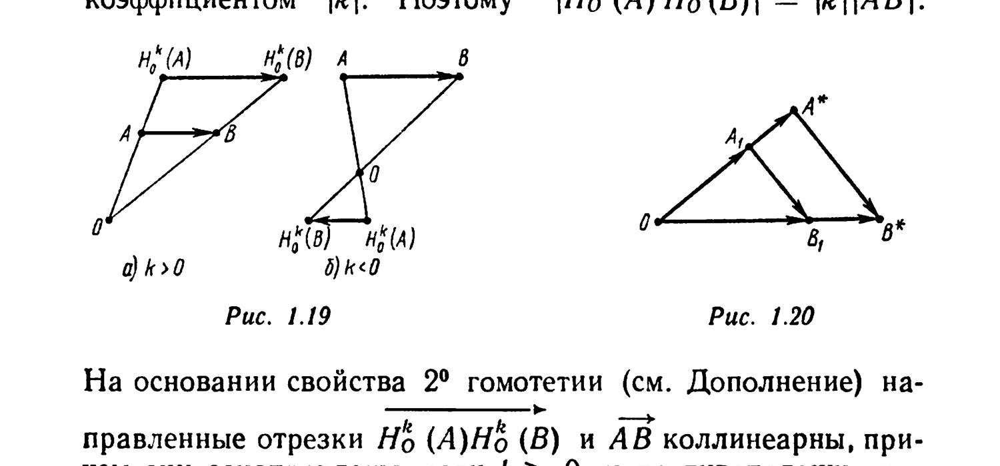

# Глава 1. Сведения из элементарной геометрии

## § 5. Умножение направленного отрезка на число

*Произведением $0 \cdot \overrightarrow{AB}$ направленного отрезка $\overrightarrow{AB}$ на число 0 называется нулевой направленный отрезок $\vec\theta_A$.* Если $k \neq 0$, то *произведением $k\overrightarrow{AB}$ направленного отрезка $\overrightarrow{AB}$ на

число $k$ называется направленный отрезок $\overrightarrow{AC}$, где $C = H_A^k(B)$* (рис. 1.18, а, б, в). Операция нахождения произведения $k\overrightarrow{AB}$ называется *умножением направленного отрезка $\overrightarrow{AB}$ на число $k$*.

Таким образом, направленный отрезок $\overrightarrow{AC}$ равен $k\overrightarrow{AB}$ тогда и только тогда, когда:

а) направленные отрезки $\overrightarrow{AC}$ и $\overrightarrow{AB}$ коллинеарны;
б) $|\overrightarrow{AC}| = |k||\overrightarrow{AB}|$;
в) $\overrightarrow{AC} \uparrow\uparrow \overrightarrow{AB}$, если $k \geqslant 0$, и $\overrightarrow{AC} \uparrow\downarrow \overrightarrow{AB}$, если $k < 0$.

Сформулируем законы умножения в виде следующих утверждений:

I. $1 \cdot \overrightarrow{AB} = \overrightarrow{AB}$; $(-1) \cdot \overrightarrow{AB} = -\overrightarrow{AB}$.

---
**стр. 16**

---

II. Если $\overrightarrow{AB} = \overrightarrow{CD}$, то $k\overrightarrow{AB} = k\overrightarrow{CD}$.

III. Для любых действительных чисел $k_1$ и $k_2$ выполняется равенство $k_1(k_2\overrightarrow{AB}) = k_2(k_1\overrightarrow{AB}) = (k_1k_2)\overrightarrow{AB}$.

IV. Если $O$ — произвольная точка, $k \neq 0$, то (рис. 1.19, а, б) $\overrightarrow{H_O^k(A)H_O^k(B)} = k\overrightarrow{AB}$.

⊳ Гомотетия $H_O^k$ является преобразованием подобия с коэффициентом $|k|$. Поэтому $|\overrightarrow{H_O^k(A)H_O^k(B)}| = |k||\overrightarrow{AB}|$.

На основании свойства 2° гомотетии (см. Дополнение) направленные отрезки $\overrightarrow{H_O^k(A)H_O^k(B)}$ и $\overrightarrow{AB}$ коллинеарны, причем они сонаправлены, если $k > 0$, и противоположно направлены, если $k < 0$. Таким образом, $\overrightarrow{H_O^k(A)H_O^k(B)} = k\overrightarrow{AB}$. ∎

V. Для любых направленных отрезков $\overrightarrow{AB}$ и $\overrightarrow{CD}$ и любого действительного числа $k$ справедливо равенство $k(\overrightarrow{AB} + \overrightarrow{CD}) = k\overrightarrow{AB} + k\overrightarrow{CD}$.

⊳ При $k=0$ утверждение очевидно. Пусть $k \neq 0$. Рассмотрим произвольную точку $O$ и обозначим $A_1 = T_{\overrightarrow{AB}}(O)$, $B_1 = T_{\overrightarrow{CD}}(A_1)$, $A^* = H_O^k(A_1)$, $B^* = H_O^k(B_1)$ (рис. 1.20). По правилу замыкающей, $\overrightarrow{OB_1} = \overrightarrow{OA_1} + \overrightarrow{A_1B_1}$, $\overrightarrow{OB^*} = \overrightarrow{OA^*} + \overrightarrow{A^*B^*}$. Из равенств $\overrightarrow{OA_1} = \overrightarrow{AB}$, $\overrightarrow{A_1B_1} = \overrightarrow{CD}$ следует, что $k\overrightarrow{OA_1} = k\overrightarrow{AB}$, $k\overrightarrow{A_1B_1} = k\overrightarrow{CD}$ (утверждение II) и что $\overrightarrow{OA_1} + \overrightarrow{A_1B_1} = \overrightarrow{AB} + \overrightarrow{CD}$ (утверждение IV из §4). По опре-

---
**стр. 17**

---

делению гомотетии, $\overrightarrow{OA^*} = k\overrightarrow{OA_1}$, $\overrightarrow{OB^*} = k\overrightarrow{OB_1}$. Наконец, в силу утверждения IV $\overrightarrow{A^*B^*} = k\overrightarrow{A_1B_1}$. Следовательно, $\overrightarrow{OB^*} = k\overrightarrow{OB_1} = k(\overrightarrow{OA_1} + \overrightarrow{A_1B_1}) = k(\overrightarrow{AB} + \overrightarrow{CD})$, $\overrightarrow{OB^*} = \overrightarrow{OA^*} + \overrightarrow{A^*B^*} = k\overrightarrow{OA_1} + k\overrightarrow{A_1B_1} = k\overrightarrow{AB} + k\overrightarrow{CD}$, и поэтому $k(\overrightarrow{AB} + \overrightarrow{CD}) = k\overrightarrow{AB} + k\overrightarrow{CD}$. ∎

VI. Для любого направленного отрезка $\overrightarrow{AB}$ и любых действительных чисел $k_1$ и $k_2$ справедливо равенство $(k_1 + k_2)\overrightarrow{AB} = k_1\overrightarrow{AB} + k_2\overrightarrow{AB}$.

⊳ Это утверждение легко проверить, подсчитывая длины направленных отрезков, стоящих в левой и правой частях равенства, учитывая при этом их направление. ∎

Законы умножения, сформулированные в утверждениях V и VI, называются *законами дистрибутивности*.
