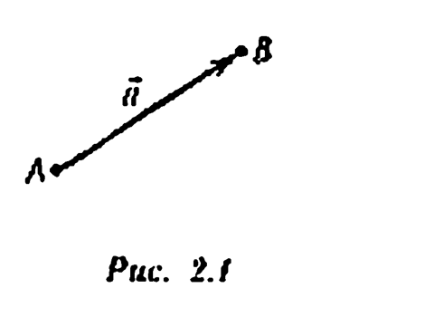
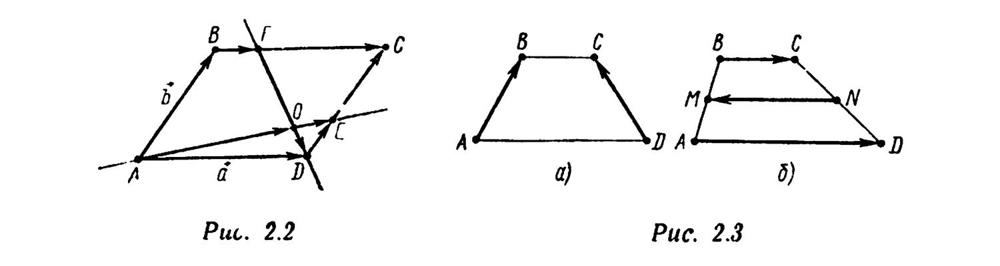
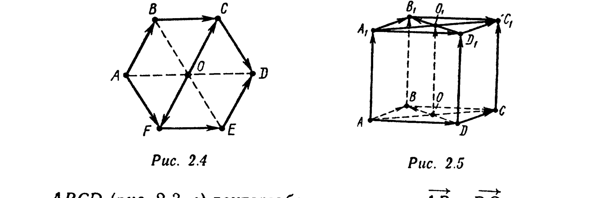
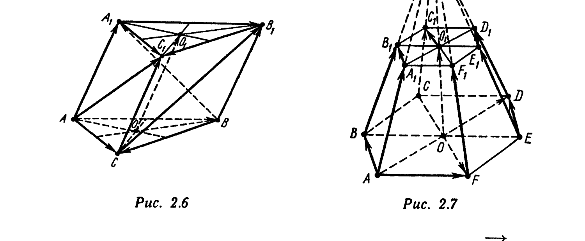

# Глава 2. Векторы. Линейные операции над векторами

## § 1. Основные определения

*Вектором в пространстве (на плоскости) называется множество всех равных между собой направленных отрезков, начала и концы которых принадлежат пространству (плоскости).* Векторы обычно обозначают строчными буквами $\vec a, \vec b, \vec c, \ldots$. Если точки $A$ и $B$ и вектор $\vec a$ таковы, что $\overrightarrow{AB} \in \vec a$, то вектор $\vec a$ обозначают так же, как направленный отрезок $\overrightarrow{AB}$, т. е. пишут $\vec a = \overrightarrow{AB}$ или $\overrightarrow{AB} = \vec a$. В этом случае про направленный отрезок $\overrightarrow{AB}$ говорят, что он изображает вектор $\vec a$, и около стрелки, изображающей направленный отрезок $\overrightarrow{AB}$, пишут $\vec a$ (рис. 2.1).

Равные направленные отрезки (и только они) изображают один и тот же вектор. Если направленный отрезок $\overrightarrow{A'B'}$, так же как и $\overrightarrow{AB}$, изображает вектор $\vec a$, то запись
$$\overrightarrow{A'B'} = \overrightarrow{AB} \quad (2.1)$$

---
**стр. 18**

---

в соответствии со сделанными определениями имеет двоякий смысл: если левая и правая части (2.1) понимаются как направленные отрезки, то эта запись означает их равенство (см. § 3 гл. 1); если же обе части понимаются как векторы, то соотношение (2.1) означает совпадение этих векторов, т. е. равенство их как множеств.

Если вектор $\vec a$ изображается направленным отрезком $\overrightarrow{AB}$, то вектор, изображаемый направленным отрезком $\overrightarrow{BA} = -\overrightarrow{AB}$, называется вектором, *противоположным* вектору $\vec a$ (обозначение: $-\vec a$). *Нулевым* вектором $\vec 0$ называется вектор, изображаемый нулевыми направленными отрезками. Очевидно, что $\vec 0 = -\vec 0$. *Длиной* $|\vec a|$ вектора $\vec a$ называется длина изображающего его направленного отрезка. В частности, $|\vec 0| = 0$. Векторы $\vec a_1 = \overrightarrow{A_1B_1}$, $\vec a_2 = \overrightarrow{A_2B_2}, \ldots, \vec a_n = \overrightarrow{A_nB_n}$ называются *коллинеарными* (*компланарными*), если коллинеарны (компланарны) изображающие их направленные отрезки $\overrightarrow{A_1B_1}, \overrightarrow{A_2B_2}, \ldots, \overrightarrow{A_nB_n}$. Коллинеарность векторов $\vec a$ и $\vec b$ обозначают так: $\vec a \| \vec b$. Если векторы $\vec a$ и $\vec b$ не коллинеарны, то пишут $\vec a \nparallel \vec b$. В соответствии с этим определением нулевой вектор $\vec 0$ коллинеарен любому вектору и компланарен любым двум векторам.

Вектор $\vec a = \overrightarrow{AB}$ называется *параллельным прямой $l$ (плоскости $P$)*, если изображающий его направленный отрезок $\overrightarrow{AB}$ параллелен $l$ (плоскости $P$). На основании свойства транзитивности параллельности прямых (на плоскости и в пространстве) это определение корректно, т. е. не зависит от выбора направленного отрезка, изображающего вектор $\vec a$. Ненулевой вектор $\vec a = \overrightarrow{AB}$ называется *перпендикулярным прямой $l$ (плоскости $P$)*, если изображающий его (ненулевой) направленный отрезок $\overrightarrow{AB}$ перпендикулярен $l$ (плоскости $P$). Это определение корректно, так как если направленный отрезок $\overrightarrow{CD}$, равный направленному отрезку $\overrightarrow{AB}$, изображает вектор $\vec a$, то $(CD) \| (AB)$ и поэтому $(CD) \perp l$ (соответственно $(CD) \perp P$), т. е. направленный отрезок $\overrightarrow{CD}$ перпендикулярен $l$ (плоскости $P$). Если векторы $\vec a$ и $\vec b$ перпендикулярны плоскости $P$, то они коллинеарны. Всякий ненулевой вектор $\vec a$, перпендикулярный плоскости $P$, назы-

---
**стр. 19**

---

вается *нормальным вектором плоскости $P$*. Векторы $\vec a$ и $\vec b$ называются *сонаправленными* (обозначение: $\vec a \uparrow\uparrow \vec b$), если сонаправлены изображающие их направленные отрезки $\overrightarrow{AB} = \vec a$ и $\overrightarrow{CD} = \vec b$, и *противоположно направленными* (обозначение: $\vec a \uparrow\downarrow \vec b$), если $\overrightarrow{AB} \uparrow\downarrow \overrightarrow{CD}$.

**Признак равенства векторов.** Векторы $\vec a$ и $\vec b$ равны (совпадают как множества) тогда и только тогда, когда: а) $\vec a \uparrow\uparrow \vec b$; б) $|\vec a| = |\vec b|$.

Примеры равных, коллинеарных, компланарных векторов, изображаемых направленными отрезками в геометрических телах, приведены на рис. 2.2—2.7. В параллелограмме $ABCD$ (рис. 2.2) равны векторы противоположных сторон: $\overrightarrow{AB} = \overrightarrow{DC}$, $\overrightarrow{BC} = \overrightarrow{AD}$. В равнобедренной трапеции

$ABCD$ (рис. 2.3, а) векторы боковых сторон $\overrightarrow{AB}$ и $\overrightarrow{DC}$ не равны (не коллинеарны), хотя и имеют одинаковые длины: $|\overrightarrow{AB}| = |\overrightarrow{DC}|$. Векторы оснований $\overrightarrow{BC}$ и $\overrightarrow{AD}$ трапеции $ABCD$ (рис. 2.3, б) и вектор средней линии $\overrightarrow{NM}$ коллинеарны. По определению трапеции эти векторы также не равны друг другу (имеют разные длины). Векторы $\overrightarrow{BC}$ и $\overrightarrow{AD}$ сонаправлены и противоположно направлены вектору $\overrightarrow{NM}$. В пра-

---
**стр. 20**

---

вильном шестиугольнике $ABCDEF$ (рис. 2.4) векторы сторон $\overrightarrow{AB}$ и $\overrightarrow{ED}$, а также вектор $\overrightarrow{OC}$, где $O$ — центр шестиугольника, равны, а $\overrightarrow{OF} = -\overrightarrow{AB}$. Аналогично, $\overrightarrow{BC} = \overrightarrow{FE}$, $\overrightarrow{CD} = \overrightarrow{AF}$. В кубе $ABCDA_1B_1C_1D_1$ (рис. 2.5) векторы боковых ребер $\overrightarrow{AA_1}$, $\overrightarrow{BB_1}$, $\overrightarrow{CC_1}$, $\overrightarrow{DD_1}$ попарно равны и равны вектору $\overrightarrow{OO_1}$, где $O$ и $O_1$ — центры граней $ABCD$ и $A_1B_1C_1D_1$

соответственно. Равны также векторы диагоналей: $\overrightarrow{A_1C_1} = \overrightarrow{AC}$. Векторы $\overrightarrow{A_1B_1}$, $\overrightarrow{B_1C_1}$, $\overrightarrow{D_1C_1}$, $\overrightarrow{A_1D_1}$, $\overrightarrow{A_1C_1}$, $\overrightarrow{D_1B_1}$, $\overrightarrow{AB}$, $\overrightarrow{BC}$, $\overrightarrow{DC}$, $\overrightarrow{AD}$, $\overrightarrow{AC}$, $\overrightarrow{DB}$ компланарны (параллельны плоскости $(ABCD)$). В треугольной призме $ABCA_1B_1C_1$ (рис. 2.6) векторы боковых ребер $\overrightarrow{AA_1}$, $\overrightarrow{BB_1}$, $\overrightarrow{CC_1}$ равны вектору $\overrightarrow{OO_1}$, где $O$ и $O_1$ — центроиды (точки пересечения медиан) граней $ABC$ и $A_1B_1C_1$ соответственно. Равны также векторы соответственных сторон верхнего и нижнего оснований: $\overrightarrow{AC} = \overrightarrow{A_1C_1}$, $\overrightarrow{BC} = \overrightarrow{B_1C_1}$, $\overrightarrow{AB} = \overrightarrow{A_1B_1}$. Векторы $\overrightarrow{A_1B_1}$, $\overrightarrow{B_1C_1}$, $\overrightarrow{A_1C_1}$, $\overrightarrow{AB}$, $\overrightarrow{BC}$, $\overrightarrow{AC}$ компланарны (параллельны плоскости $(ABC)$). В правильной шестиугольной усеченной пирамиде $ABCDEFA_1B_1C_1D_1E_1F_1$ (рис. 2.7), в которой $|A_1B_1| : |AB| = 1:2$, векторы $\overrightarrow{AB}$, $\overrightarrow{ED}$, $\overrightarrow{F_1C_1}$ равны. Векторы $\overrightarrow{A_1B_1}$ и $\overrightarrow{CF}$ коллинеарны и противоположно направлены. Векторы $\overrightarrow{AB}$, $\overrightarrow{A_1B_1}$, $\overrightarrow{DE}$, $\overrightarrow{D_1E_1}$, $\overrightarrow{CF}$, $\overrightarrow{C_1F_1}$, $\overrightarrow{CC_1}$, $\overrightarrow{FF_1}$, $\overrightarrow{OO_1}$ ($O$ и $O_1$ — центры оснований пирамиды) компланарны (параллельны плос-

---
**стр. 21**

---

кости $(CC_1F_1F)$). Векторы боковых ребер $\overrightarrow{BB_1}$ и $\overrightarrow{AA_1}$ не коллинеарны, хотя равны по длине. Векторы $\overrightarrow{BB_1}$, $\overrightarrow{CC_1}$, $\overrightarrow{DD_1}$ не компланарны.

Пусть $\vec a$ — некоторый вектор, $\overrightarrow{AB}$ — направленный отрезок, изображающий этот вектор. Если $\overrightarrow{CD}$ — произвольный направленный отрезок, также изображающий вектор $\vec a$, то по определению вектора $\vec a$ имеем $\overrightarrow{CD} = \overrightarrow{AB}$, т. е. $D = T_{\overrightarrow{AB}}(C)$. Следовательно, $\vec a$ есть множество всех направленных отрезков $\overrightarrow{CD}$, начала $C$ которых являются прообразами, а концы $D$ — образами точек пространства (плоскости) при параллельном переносе $T_{\overrightarrow{AB}}$. Поэтому про вектор $\vec a = \overrightarrow{AB}$ говорят, что он является параллельным переносом на направленный отрезок $\overrightarrow{AB}$, а параллельный перенос $T_{\overrightarrow{AB}}$ для краткости обозначают так же, как и вектор $\vec a$. В этом случае $\vec a$ понимают как преобразование пространства (плоскости). Пусть $\vec a = \overrightarrow{AB}$ — некоторый вектор, $M$ — заданная точка. Если вместо направленного отрезка $\overrightarrow{AB}$, изображающего вектор $\vec a$, для изображения вектора $\vec a$ используют направленный отрезок $\overrightarrow{MN} = \overrightarrow{AB}$ с началом в точке $M$, то говорят, что вектор $\vec a$ *откладывается* от точки $M$. Точку $M$ называют *началом* вектора $\vec a$, точку $N$ — его *концом*.

Все операции над направленными отрезками, в которых эти отрезки могут быть заменены на любые им равные с сохранением результата операции, а также свойства этих операций переносятся и на векторы.
