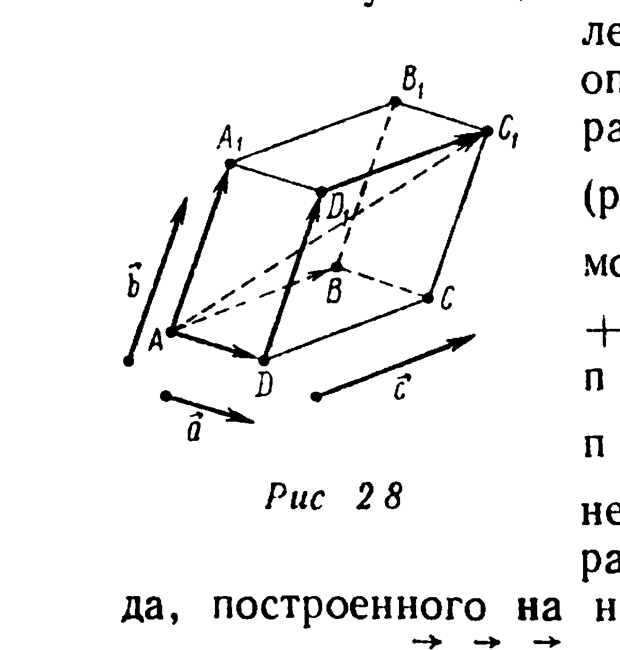
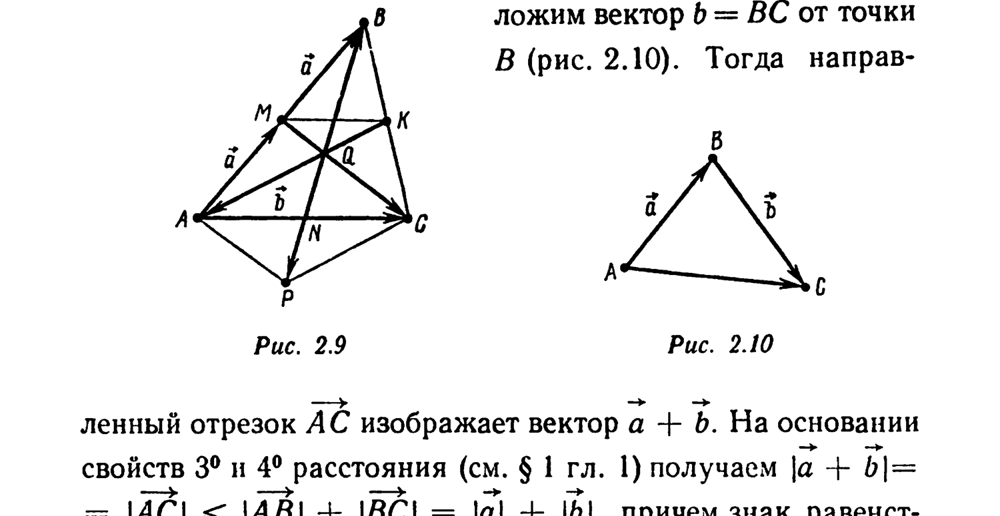
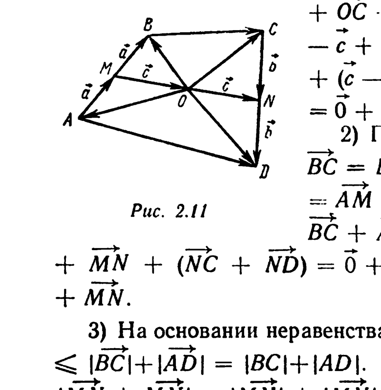

# Глава 2. Векторы. Линейные операции над векторами

## § 2. Сумма векторов. Разность векторов

Если $\vec a = \overrightarrow{AB}$ — вектор, изображаемый направленным отрезком $\overrightarrow{AB}$, $\vec b = \overrightarrow{CD}$ — вектор, изображаемый направленным отрезком $\overrightarrow{CD}$, то вектор, изображаемый направленным отрезком $\overrightarrow{AB} + \overrightarrow{CD}$, называется *суммой* векторов $\vec a$ и $\vec b$ (обозначение: $\vec a + \vec b$). Из утверждения IV § 4 гл. 1 следует, что данное определение суммы векторов не зависит от выбора направленных отрезков, изображающих эти векторы.

---
**стр. 22**

---

Приведем законы сложения векторов.

I. $\vec a + \vec b = \vec b + \vec a$ (*коммутативность сложения*).

II. $(\vec a + \vec b) + \vec c = \vec a + (\vec b + \vec c)$ (*ассоциативность сложения*).

III. $\vec a + \vec 0 = \vec a$.

IV. $\vec a + (-\vec a) = \vec 0$.

Эти законы вытекают из утверждений III, V, I § 4 гл. 1. В силу ассоциативности сложения сумму трех (и более) векторов можно записывать, опуская скобки. Например, для параллелепипеда $ABCDA_1B_1C_1D_1$ (рис. 2.8) вектор $\overrightarrow{AC_1}$ является суммой $\overrightarrow{AD} + \overrightarrow{DD_1} + \overrightarrow{D_1C_1} = \overrightarrow{AD} + \overrightarrow{AA_1} + \overrightarrow{AB}$. Этот факт называется *правилом параллелепипеда*: вектор $\vec a + \vec b + \vec c$ суммы трех некомпланарных векторов $\vec a, \vec b, \vec c$ изображается диагональю параллелепипеда, построенного на направленных отрезках, изображающих векторы $\vec a, \vec b, \vec c$ и имеющих общее начало (кратко: построенного на векторах $\vec a, \vec b, \vec c$).

*Разностью* $\vec a - \vec b$ векторов $\vec a$ и $\vec b$ называется вектор $\vec a + (-\vec b)$. Если векторы $\vec a$ и $\vec b$ изображаются соответственно направленными отрезками $\overrightarrow{AB}$ и $\overrightarrow{CD}$, то их разность $\vec a - \vec b$ изображается направленным отрезком $\overrightarrow{AB} - \overrightarrow{CD}$ (см. § 4 гл. 1). Если $\vec a + \vec b = \vec c$, то $\vec a = \vec c - \vec b$. Это свойство следует из свойства разности направленных отрезков. Покажем, как можно это свойство вывести из законов сложения векторов. Прибавляя к обеим частям равенства $\vec c = \vec a + \vec b$ вектор $-\vec b$, получаем $\vec c - \vec b = \vec c + (-\vec b) = (\vec a + \vec b) + (-\vec b) = \vec a + (\vec b + (-\vec b)) = \vec a + \vec 0 = \vec a$. Таким образом, слагаемые в векторных равенствах можно переносить из одной части равенства в другую, изменяя их знаки на противоположные.

---
**стр. 23**

---

**Пример 1.** Докажите правило раскрытия скобок:
$$(\vec a_1 - \vec b_1) + (\vec a_2 - \vec b_2) + \ldots + (\vec a_n - \vec b_n) = (\vec a_1 + \vec a_2 + \ldots + \vec a_n) - (\vec b_1 + \vec b_2 + \ldots + \vec b_n).$$

△ По определению разности векторов, $(\vec a_1 - \vec b_1) + (\vec a_2 - \vec b_2) + \ldots + (\vec a_n - \vec b_n) = (\vec a_1 + (-\vec b_1)) + (\vec a_2 + (-\vec b_2)) + \ldots + (\vec a_n + (-\vec b_n))$. Обозначая последнее выражение через $\vec x$ и опуская часть скобок (в соответствии с договоренностью, основанной на законе ассоциативности сложения), получаем $\vec x = \vec a_1 + (-\vec b_1) + \vec a_2 + (-\vec b_2) + \ldots + \vec a_n + (-\vec b_n)$. Применяя несколько раз закон коммутативности сложения, имеем $\vec x = (\vec a_1 + \vec a_2 + \ldots + \vec a_n) + (-\vec b_1) + (-\vec b_2) + \ldots + (-\vec b_n)$.

Если теперь к $\vec x$ прибавить сумму $(\vec b_1 + \vec b_2 + \ldots + \vec b_n)$, использовать свойства ассоциативности и коммутативности сложения и учесть $n$ раз IV и III законы сложения векторов, то получим
$$\vec x + (\vec b_1 + \vec b_2 + \ldots + \vec b_n) = (\vec a_1 + \vec a_2 + \ldots + \vec a_n) + (-\vec b_1) + (-\vec b_2) + \ldots + (-\vec b_n) + \vec b_1 + \vec b_2 + \ldots + \vec b_n =$$
$$= (\vec a_1 + \vec a_2 + \ldots + \vec a_n) + (\vec b_1 + (-\vec b_1)) + (\vec b_2 + (-\vec b_2)) + \ldots + (\vec b_n + (-\vec b_n)) = (\vec a_1 + \vec a_2 + \ldots + \vec a_n) + \vec 0 + \vec 0 + \ldots + \vec 0 = \vec a_1 + \vec a_2 + \ldots + \vec a_n.$$

По правилу переноса слагаемых из одной части векторного равенства в другую имеем $\vec x = (\vec a_1 + \vec a_2 + \ldots + \vec a_n) - (\vec b_1 + \vec b_2 + \ldots + \vec b_n)$. ▲

**Пример 2.** Пусть $O$ — центр правильного шестиугольника $ABCDEF$ (см. рис. 2.4). Найдите сумму векторов $\overrightarrow{OA} + \overrightarrow{OB} + \overrightarrow{OC} + \overrightarrow{OD} + \overrightarrow{OE} + \overrightarrow{OF}$.

△ Диагонали правильного шестиугольника, пересекающиеся в точке $O$, делятся этой точкой пополам. Лучи $[OA)$ и $[OD)$ противоположно направлены. Поэтому $\overrightarrow{OA} =$

---
**стр. 24**

---

$= -\overrightarrow{OD}$. Аналогично, $\overrightarrow{OB} = -\overrightarrow{OE}$, $\overrightarrow{OC} = -\overrightarrow{OF}$. Отсюда $\overrightarrow{OA} + \overrightarrow{OD} = \vec 0$, $\overrightarrow{OB} + \overrightarrow{OE} = \vec 0$, $\overrightarrow{OC} + \overrightarrow{OF} = \vec 0$ и, значит, $\overrightarrow{OA} + \overrightarrow{OB} + \overrightarrow{OC} + \overrightarrow{OD} + \overrightarrow{OE} + \overrightarrow{OF} = (\overrightarrow{OA} + \overrightarrow{OD}) + (\overrightarrow{OB} + \overrightarrow{OE}) + (\overrightarrow{OC} + \overrightarrow{OF}) = \vec 0 + \vec 0 + \vec 0 = \vec 0$. ▲

В правильном шестиугольнике $ABCDEF$ выполнено также равенство $\overrightarrow{AD} + \overrightarrow{EB} + \overrightarrow{CF} = \vec 0$. Действительно, так как $ODEF$ — параллелограмм, то $\overrightarrow{OE} = \overrightarrow{OD} + \overrightarrow{OF}$ и, следовательно, $\overrightarrow{AD} + \overrightarrow{EB} + \overrightarrow{CF} = (\overrightarrow{AO} + \overrightarrow{OD}) - (\overrightarrow{BO} + \overrightarrow{OE}) + (\overrightarrow{CO} + \overrightarrow{OF}) = \overrightarrow{OD} + \overrightarrow{OD} - (\overrightarrow{OE} + \overrightarrow{OE}) + \overrightarrow{OF} + \overrightarrow{OF} = (\overrightarrow{OD} + \overrightarrow{OF}) + (\overrightarrow{OD} + \overrightarrow{OF}) - (\overrightarrow{OE} + \overrightarrow{OE}) = \overrightarrow{OE} + \overrightarrow{OE} - (\overrightarrow{OE} + \overrightarrow{OE}) = (\overrightarrow{OE} - \overrightarrow{OE}) + (\overrightarrow{OE} - \overrightarrow{OE}) = \vec 0 + \vec 0 = \vec 0$.

**Пример 3.** Докажите, что: в треугольнике $ABC$ медианы $[AK]$, $[CM]$ и $[BN]$ пересекаются в одной точке; если $Q$ — точка пересечения медиан треугольника $ABC$, то $\overrightarrow{QA} + \overrightarrow{QB} + \overrightarrow{QC} = \vec 0$.

△ Пусть $Q$ — общая точка отрезков $[AK]$ и $[CM]$ (рис. 2.9). На основании свойства средней линии треугольника имеем $(MK) \| (AC)$. Значит, треугольники $QMK$ и $QCA$ подобны (по трем углам), поэтому $|QC|:|MQ| = |QA|:|KQ| = |AC|:|MK| = 2$.

Таким образом, если на медиане $[AK]$ взять точку $Q$, делящую отрезок $[AK]$ в отношении 2:1, считая от вершины $A$, то точка $Q$ будет лежать на медиане $[CM]$, причем $|CQ|:|QM| = 2:1$. Проводя аналогичные рассуждения относительно медиан $[AK]$ и $[BN]$, видим, что точка $Q$ лежит на медиане $[BN]$ и делит ее в отношении $|BQ|:|QN| = 2:1$. Отсюда следует, что медианы треугольника $ABC$ пересекаются в одной точке $Q$, а для точки $P$, симметричной точке $Q$ относительно точки $N$ (рис. 2.9), выполнено равенство $\overrightarrow{QB} = -\overrightarrow{QP}$. Поскольку $P = Z_N(Q)$, $A = Z_N(C)$, четырехугольник $AQCP$ — параллелограмм, так что $\overrightarrow{QA} + \overrightarrow{QC} = \overrightarrow{QP}$. Окончательно получаем $\overrightarrow{QA} + \overrightarrow{QB} + \overrightarrow{QC} = \overrightarrow{QP} + \overrightarrow{QB} = \overrightarrow{QP} + (-\overrightarrow{QP}) = \vec 0$. ▲

**Пример 4.** Докажите, что для любых векторов $\vec a$ и $\vec b$ справедливы неравенства треугольника:
$$|\vec a + \vec b| \leqslant |\vec a| + |\vec b|, \quad |\vec a - \vec b| \geqslant |\vec a| - |\vec b|. \quad (2.2)$$

---
**стр. 25**

---

Проверьте, что: равенство $|\vec a + \vec b| = |\vec a| + |\vec b|$ имеет место тогда и только тогда, когда $\vec a \uparrow\uparrow \vec b$; равенство $|\vec a - \vec b| = |\vec a| - |\vec b|$ имеет место тогда и только тогда, когда $\vec a \uparrow\uparrow \vec b$ и $|\vec a| \geqslant |\vec b|$.

△ Если один из векторов $\vec a$ или $\vec b$ нулевой, то эти неравенства очевидны. Пусть $\vec a$ и $\vec b$ — ненулевые векторы и пусть направленный отрезок $\overrightarrow{AB}$ изображает вектор $\vec a$. Отложим вектор $\vec b = \overrightarrow{BC}$ от точки $B$ (рис. 2.10). Тогда направленный отрезок $\overrightarrow{AC}$ изображает вектор $\vec a + \vec b$.

На основании свойств 3° и 4° расстояния (см. § 1 гл. 1) получаем $|\vec a + \vec b| = |\overrightarrow{AC}| \leqslant |\overrightarrow{AB}| + |\overrightarrow{BC}| = |\vec a| + |\vec b|$, причем знак равенства имеет место тогда и только тогда, когда $B \in [AC]$, т. е. когда векторы $\vec a$ и $\vec b$ сонаправлены. Заменяя в последнем неравенстве вектор $\vec a$ на вектор $\vec a - \vec b$, получаем $|\vec a| = |(\vec a - \vec b) + \vec b| \leqslant |\vec a - \vec b| + |\vec b|$. Следовательно, $|\vec a - \vec b| \geqslant |\vec a| - |\vec b|$. Равенство $|\vec a - \vec b| = |\vec a| - |\vec b|$, как доказано выше, имеет место тогда и только тогда, когда векторы $\vec a - \vec b$ и $\vec b$ сонаправлены, т. е. сонаправлены векторы $\vec b$ и $\vec a = (\vec a - \vec b) + \vec b$ и $|\vec a| = |\vec a - \vec b| + |\vec b| \geqslant |\vec b|$. ▲

**Пример 5.** Пусть $A$, $B$, $C$, $D$ — некоторые точки пространства или плоскости, $M$ — середина $[AB]$, $N$ — середина $[CD]$, $O$ — середина $[MN]$. Докажите, что: 1) $\overrightarrow{OA} + \overrightarrow{OB} + \overrightarrow{OC} + \overrightarrow{OD} = \vec 0$; 2) $\overrightarrow{MN} + \overrightarrow{MN} = \overrightarrow{BC} + \overrightarrow{AD}$; 3) $|MN| \leqslant \dfrac{1}{2}(|BC| + |AD|)$.

---
**стр. 26**

---

△ 1) Направленные отрезки $\overrightarrow{AM} = \overrightarrow{MB}$ изображают один и тот же вектор, который обозначим $\vec a$. Аналогично, положим $\overrightarrow{CN} = \overrightarrow{ND} = \vec b$, $\overrightarrow{MO} = \overrightarrow{ON} = \vec c$ (рис. 2.11). Тогда $\overrightarrow{OA} = \overrightarrow{OM} + \overrightarrow{MA} = (-\vec c) + (-\vec a)$, $\overrightarrow{OB} = \vec a - \vec c$, $\overrightarrow{OC} = \vec c - \vec b$, $\overrightarrow{OD} = \vec b + \vec c$. Поэтому (см. пример 1) $\overrightarrow{OA} + \overrightarrow{OB} + \overrightarrow{OC} + \overrightarrow{OD} = (-\vec c) + (-\vec a) + \vec a - \vec c + \vec c - \vec b + \vec b + \vec c = (\vec a - \vec a) + (\vec c - \vec c) + (\vec b - \vec b) + (\vec c - \vec c) = \vec 0 + \vec 0 + \vec 0 + \vec 0 = \vec 0$.

2) По правилу замыкающей, $\overrightarrow{BC} = \overrightarrow{BM} + \overrightarrow{MN} + \overrightarrow{NC}$, $\overrightarrow{AD} = \overrightarrow{AM} + \overrightarrow{MN} + \overrightarrow{ND}$. Отсюда $\overrightarrow{BC} + \overrightarrow{AD} = (\overrightarrow{BM} + \overrightarrow{AM}) + \overrightarrow{MN} + \overrightarrow{MN} + (\overrightarrow{NC} + \overrightarrow{ND}) = \vec 0 + \overrightarrow{MN} + \overrightarrow{MN} + \vec 0 = \overrightarrow{MN} + \overrightarrow{MN}$.

3) На основании неравенства треугольника $|\overrightarrow{BC} + \overrightarrow{AD}| \leqslant |\overrightarrow{BC}| + |\overrightarrow{AD}| = |BC| + |AD|$. Так как $\overrightarrow{MN} \uparrow\uparrow \overrightarrow{MN}$, то $|\overrightarrow{MN} + \overrightarrow{MN}| = |\overrightarrow{MN}| + |\overrightarrow{MN}| = 2|MN|$ (см. пример 4). Окончательно имеем $2|MN| = |\overrightarrow{MN} + \overrightarrow{MN}| = |\overrightarrow{BC} + \overrightarrow{AD}| \leqslant |BC| + |AD|$. ▲

**Пример 6.** Докажите, что для любого вектора $\vec a$ имеет место равенство $-(-\vec a) = \vec a$.

△ Пусть $\vec x = -(-\vec a)$. Тогда на основании законов IV и I сложения векторов $\vec x + (-\vec a) = \vec 0$. Прибавляя к обеим частям этого равенства вектор $\vec a$, получаем $\vec a = \vec 0 + \vec a = \vec x + (-\vec a) + \vec a = \vec x + (\vec a + (-\vec a)) = \vec x + \vec 0 = \vec x$. ▲
