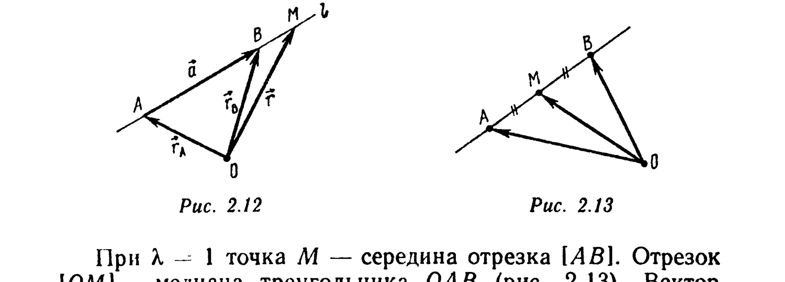
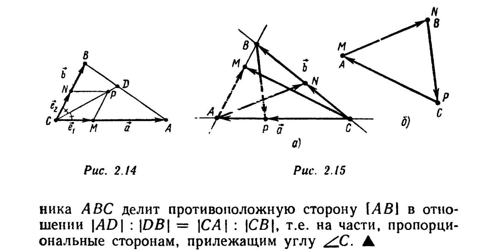

# Глава 2. Векторы. Линейные операции над векторами

## § 3. Умножение вектора на число. Признак коллинеарности векторов

Если $\vec a$ — вектор, изображаемый направленным отрезком $\overrightarrow{AB}$, $k$ — действительное число, то *произведением $k\vec a$ вектора $\vec a$ на число $k$* называется вектор, изображаемый направлен-

---
**стр. 27**

---

ным отрезком $k\overrightarrow{AB}$. Произведение $k\vec a$ обозначают также $\vec a k$. Для краткости, если $k \neq 0$, произведение $\dfrac{1}{k}\vec a$ записывают в виде $\vec a/k$.

Приведем законы умножения вектора на число.

I. $1 \cdot \vec a = \vec a$, $0 \cdot \vec a = \vec 0$, $k\vec 0 = \vec 0$, $(-1)\vec a = -\vec a$.

II. $|k\vec a| = |k||\vec a|$.

III. $k\vec a \uparrow\uparrow \vec a$, если $k \geqslant 0$; $k\vec a \uparrow\downarrow \vec a$, если $k \leqslant 0$.

Если $k$ и $m$ — действительные числа, $\vec a$ и $\vec b$ — векторы, то:

IV. $k(m\vec a) = (km)\vec a$ (*ассоциативность умножения на число*).

V. $(k+m)\vec a = k\vec a + m\vec a$,

VI. $k(\vec a + \vec b) = k\vec a + k\vec b$

— (*дистрибутивность умножения на число*).

Эти законы непосредственно следуют из свойств умножения направленного отрезка на число (см. § 5 гл. 1).

**Пример 1.** Докажите равенство $-\vec a = (-1)\vec a$, используя остальные законы умножения вектора на число.

△ Действительно, $\vec 0 = 0\cdot\vec a = (1+(-1))\vec a$. Поэтому $-\vec a = (-\vec a) + \vec 0 = (-\vec a) + (1+(-1))\vec a = (-\vec a) + 1\cdot\vec a + (-1)\vec a = ((-\vec a) + \vec a) + (-1)\vec a = \vec 0 + (-1)\vec a = (-1)\vec a$. ▲

**Пример 2.** Докажите, что если $m\vec a + n\vec b = k\vec a + l\vec b$, то $(m-k)\vec a + (n-l)\vec b = \vec 0$.

△ Перенося векторы из правой части равенства $m\vec a + n\vec b = k\vec a + l\vec b$ в левую, получаем $(m\vec a - k\vec a) + (n\vec b - l\vec b) = \vec 0$. На основании законов I и IV умножения вектора на число $-k\vec a = (-1)\cdot(k\vec a) = (-k)\vec a$. По закону V имеем $m\vec a - k\vec a = m\vec a + (-k\vec a) = m\vec a + (-k)\vec a = (m-k)\vec a$. Аналогично можно доказать, что $n\vec b - l\vec b = (n-l)\vec b$. Таким образом, $m\vec a + n\vec b = k\vec a + l\vec b \Leftrightarrow (m-k)\vec a + (n-l)\vec b = \vec 0$. ▲

Из законов II и III следует признак коллинеарности векторов: вектор $\vec b$ коллинеарен ненуле-

---
**стр. 28**

---

вому вектору $\vec a$ тогда и только тогда, когда существует такое число $k$, что $\vec b = k\vec a$. По коллинеарным векторам $\vec a \neq \vec 0$ и $\vec b$ число $k$ определяется однозначно: $|k| = |\vec b|/|\vec a|$, причем $k = |\vec b|/|\vec a|$, если $\vec a \uparrow\uparrow \vec b$, и $k = -|\vec b|/|\vec a|$, если $\vec a \uparrow\downarrow \vec b$.

**Пример 3.** Докажите, что для неколлинеарных векторов $\vec a$ и $\vec b$ равенство $m\vec a + n\vec b = \vec 0$ выполняется тогда и только тогда, когда $m = n = 0$.

△ Доказательство проведем методом от противного. Пусть $\vec a$ и $\vec b$ — неколлинеарные векторы такие, что $m\vec a + n\vec b = \vec 0$ и $m \neq 0$. Тогда $\vec 0 = (1/m)\vec 0 = (1/m)(m\vec a + n\vec b) = (1/m)(m\vec a) + (1/m)(n\vec b) = 1\cdot\vec a + (n/m)\vec b = \vec a - (-n/m)\vec b$, т. е. $\vec a = (-n/m)\vec b$, и в силу признака коллинеарности векторы $\vec a$ и $\vec b$ коллинеарны. Таким образом, имеет место противоречие. Аналогично доказывается, что предположение $n \neq 0$ также приводит к противоречию. ▲

В этом и последующих примерах не указывается, какие законы и в какой последовательности использованы.

**Пример 4.** Докажите, что для неколлинеарных векторов $\vec a$ и $\vec b$ равенство
$$m_1\vec a + n_1\vec b = m_2\vec a + n_2\vec b \quad (2.3)$$
эквивалентно системе равенств
$$m_1 = m_2, \quad n_1 = n_2. \quad (2.4)$$

△ Как показано в примере 2, равенство (2.3) эквивалентно равенству $(m_1-m_2)\vec a + (n_1-n_2)\vec b = \vec 0$. Векторы $\vec a$ и $\vec b$ не коллинеарны; следовательно, в соответствии с примером 3 полученное соотношение эквивалентно двум равенствам: $m_1 - m_2 = 0$ и $n_1 - n_2 = 0$. ▲

**Пример 5.** Векторы $\vec a$ и $\vec b$ не коллинеарны. При каком $x$ векторы $\vec c = (x-1)\vec a + \vec b$ и $\vec d = (2+3x)\vec a - 2\vec b$ коллинеарны?

△ Вектор $\vec c = (x-1)\vec a + \vec b$ ненулевой (если бы $\vec 0 = \vec c = (x-1)\vec a + 1\cdot\vec b$, то в силу неколлинеарности векторов $\vec a$ и $\vec b$ и результата примера 3 имели бы место равенства $x - 1 = 0$, $1 = 0$, т. е. получилось бы противоречие). Сог-

---
**стр. 29**

---

ласно признаку коллинеарности векторы $\vec d$ и $\vec c$ коллинеарны тогда и только тогда, когда существует число $y$ такое, что $\vec d = y\vec c$, т. е. $(2+3x)\vec a - 2\vec b = y(x-1)\vec a + y\vec b$. Векторы $\vec a$ и $\vec b$ не коллинеарны. Поэтому в силу результата примера 4 полученное равенство эквивалентно системе уравнений $2+3x = y(x-1)$, $-2 = y$, т. е. системе $x = 0$, $y = -2$. Следовательно, векторы $\vec c$ и $\vec d$ коллинеарны тогда и только тогда, когда $x = 0$, т. е. $\vec c = -\vec a + \vec b$, $\vec d = 2(\vec a - \vec b)$. ▲

Пусть в пространстве или на плоскости зафиксирована некоторая точка $O$, называемая *полюсом*. Тогда между точками $A$ пространства (плоскости) и направленными отрезками $\overrightarrow{OA}$ устанавливается взаимно однозначное соответствие. Вектор $\vec r_A$, изображаемый направленным отрезком $\overrightarrow{OA}$, называется *радиусом-вектором точки $A$ относительно полюса $O$*. По заданному радиусу-вектору $\vec r_A$ точка $A$ находится как конец вектора $\vec r_A$, отложенного от полюса $O$.

**Пример 6** (векторное параметрическое уравнение прямой). Пусть в пространстве или на плоскости зафиксирован полюс $O$. Пусть, далее, $l$ — прямая, проходящая через две заданные различные точки $A$ и $B$. Опишите множество радиусов-векторов всех точек прямой $l$.

△ Пусть $\vec r_A$ и $\vec r_B$ — радиусы-векторы точек $A$ и $B$ соответственно. Обозначим через $\vec a$ вектор, изображаемый направленным отрезком $\overrightarrow{AB}$, т. е. $\vec a = \vec r_B - \vec r_A$ (рис. 2.12). Через $\vec r$ обозначим радиус-вектор произвольной точки $M$ прямой $l$. Точка $M$ лежит на прямой $l$ тогда и только тогда, когда векторы $\overrightarrow{AM}$ и $\vec a$ коллинеарны. Согласно признаку коллинеарности это имеет место тогда и только тогда, когда существует число $t$ (зависящее от $M$) такое, что выполняется равенство $\overrightarrow{AM} = t\vec a$. Так как $\overrightarrow{AM} = \vec r - \vec r_A$, то вектор $\vec r$ является радиусом-вектором точки $M \in l$ тогда и только тогда, когда его можно представить в виде $\vec r = \vec r_A + t\vec a$,

---
**стр. 30**

---

где $\vec a = \vec r_B - \vec r_A$. Таким образом, множество всех радиусов-векторов точек прямой $l$ есть совокупность векторов вида
$$\vec r = \vec r_* + t\vec a, \quad (2.5)$$
где $\vec r_* = \vec r_A$, $\vec a = \vec r_B - \vec r_A$, $t$ — произвольное действительное число. Вектор $\vec a$ называется *направляющим вектором прямой $l$*, $\vec r_*$ — *радиусом-вектором начальной точки прямой $l$*, $t$ — *параметром*, а соотношение (2.5) — *векторным параметрическим уравнением прямой*. ▲

Соотношение (2.5) можно записать в виде $\vec r = (1-t)\vec r_A + t\vec r_B$ или в виде $\vec r = \tau\vec r_A + t\vec r_B$, где $t$ и $\tau$ — произвольные действительные числа, связанные соотношением $t + \tau = 1$. Система уравнений $\vec r = \tau\vec r_A + t\vec r_B$, $t + \tau = 1$ параметрически задает прямую, проходящую через точки $A$ и $B$. Числа $t = t(M)$ и $\tau = \tau(M)$ называются *барицентрическими координатами точки $M$ на ориентированной (вдоль вектора $\vec a$) прямой $(AB)$*. Установим геометрический смысл параметра $t$ в соотношении (2.5). Так как $\overrightarrow{AM} = t\vec a$, где $t = t(M)$, то $|\overrightarrow{AM}| = |t||\vec a|$, т. е. $|t| = |\overrightarrow{AM}| : |\vec a|$. Число $t$ положительное, если точка $M \neq A$ лежит на $[AB)$ или если $B \in [AM)$. Число $t$ отрицательное, если $M \neq A$ и $A \in [MB)$. $t = 0$ тогда и только тогда, когда $M$ совпадает с $A$.

**Пример 7** (задача о делении отрезка в заданном отношении). Пусть $A$ и $B$ — различные точки, заданные радиусами-векторами $\vec r_A$ и $\vec r_B$ относительно полюса $O$, $\lambda$ — положительное число. Найдите радиус-вектор $\vec r_M$ точки $M$ отрезка $[AB]$, делящей этот отрезок в отношении $\lambda$, считая от точки $A$.

△ Точка $M$ лежит на прямой $(AB)$ между точками $A$ и $B$, поэтому $\vec r_M = \vec r_A + t(\vec r_B - \vec r_A)$, где $t = |AM|/|AB| > 0$. Согласно условию, $\lambda = |AM|/|MB|$. Следовательно, $|AB| = |AM| + |MB| = |AM| + |AM|/\lambda = (\lambda+1)|AM|/\lambda$. Та-

---
**стр. 31**

---

ким образом, $t = \lambda/(\lambda+1)$ и $\vec r_M = \vec r_A + \dfrac{\lambda}{\lambda+1}(\vec r_B - \vec r_A) = \dfrac{1}{\lambda+1}\vec r_A + \dfrac{\lambda}{\lambda+1}\vec r_B$. Соотношение
$$\vec r_M = (\vec r_A + \lambda\vec r_B)/(\lambda+1) \quad (2.6)$$
называется *формулой деления отрезка в заданном отношении*. ▲

При $\lambda = 1$ точка $M$ — середина отрезка $[AB]$. Отрезок $[OM]$ — медиана треугольника $OAB$ (рис. 2.13). Вектор $\vec r_M = \overrightarrow{OM}$ равен $\vec r_A/2 + \vec r_B/2 = (\overrightarrow{OA}+\overrightarrow{OB})/2$.

**Пример 8.** Используя векторы и операции над ними, докажите, что медианы треугольника пересекаются в одной точке, которая делит каждую из медиан в отношении 2:1, считая от вершины.

△ Пусть в $\triangle ABC$ точки $K$ и $M$ — середины сторон $[BC]$ и $[AB]$ соответственно, $Q$ — точка пересечения медиан $[AK]$ и $[CM]$ (см. рис. 2.9).

Обозначая $\lambda = |CQ|/|QM|$, $\mu = |AQ|/|QK|$, докажем, что $\lambda = \mu = 2$. Пусть $\overrightarrow{AM} = \vec a$ (тогда $\overrightarrow{AB} = 2\vec a$), $\overrightarrow{AC} = \vec b$. По формуле деления отрезка $[CM]$ точкой $Q$ в отношении $\lambda$ имеем $\overrightarrow{AQ} = (\vec b + \lambda\vec a)/(\lambda+1)$. Следовательно, $\overrightarrow{AK} = \overrightarrow{AQ} + \overrightarrow{QK} = \overrightarrow{AQ} + \dfrac{\overrightarrow{AQ}}{\mu} = \dfrac{\mu+1}{\mu}\left(\dfrac{\vec b + \lambda\vec a}{\lambda+1}\right)$. Точка $K$ делит отрезок $[CB]$ в отношении 1:1, поэтому $\overrightarrow{AK} = (\overrightarrow{AC}+\overrightarrow{AB})/2 = (\vec b+2\vec a)/2$. Сравнивая полученные для вектора $\overrightarrow{AK}$ выражения, приходим к равенству $\dfrac{\mu+1}{\mu}\cdot\dfrac{\vec b+\lambda\vec a}{\lambda+1} = \dfrac{\vec b+2\vec a}{2}$. В силу неколлинеарности векторов $\vec a$ и $\vec b$ отсюда следует, что $\dfrac{\mu+1}{\mu}\cdot\dfrac{1}{\lambda+1} = \dfrac{1}{2}$, $\dfrac{\mu+1}{\mu}\cdot\dfrac{\lambda}{\lambda+1} = 1$.

---
**стр. 32**

---

Разделив одно из этих равенств на другое, получим $\lambda = 2$. Следовательно, $(\mu+1)/\mu = 3/2$, т. е. $\mu = 2$. Итак, доказано, что точка $Q$, лежащая на медиане $[CM]$ и делящая ее в отношении 2:1, лежит и на медиане $[AK]$ и делит ее в том же отношении. Аналогично можно установить, что та же самая точка $Q$ медианы $[CM]$ лежит и на медиане $[BN]$ и делит ее в отношении 2:1, считая от вершины $B$. Следовательно, все три медианы треугольника $ABC$ пересекаются в одной точке и делятся этой точкой в отношении 2:1, считая от вершины. ▲

**Пример 9.** Найдите, на какое число $k$ надо умножить ненулевой вектор $\vec a$, чтобы длина вектора $\vec b = k\vec a$ была равна единице, причем: а) вектор $\vec b$ был сонаправлен вектору $\vec a$; б) вектор $\vec b$ был противоположно направлен вектору $\vec a$.

△ а) Так как $k\vec a \uparrow\uparrow \vec a \Leftrightarrow k \geqslant 0$ (III), то $k = |k| = |\vec b|:|\vec a| = 1/|\vec a|$ (II).

б) Имеем $k\vec a \uparrow\downarrow \vec a \Leftrightarrow k \leqslant 0$. Следовательно, $-k = |k| = |\vec b|/|\vec a| = 1/|\vec a|$ и $k = -1/|\vec a|$.

Таким образом, вектор $\vec b = \vec a/|\vec a|$ сонаправлен вектору $\vec a \neq \vec 0$ и имеет единичную длину. Всякий вектор единичной длины называется *единичным* вектором. Вектор $-\vec a/|\vec a|$ — единичный вектор, противоположно направленный вектору $\vec a$. ▲

**Пример 10.** В треугольнике $ABC$ проведена биссектриса $[CD]$ внутреннего угла $\angle C$. Выразите вектор $\overrightarrow{CD}$ через векторы $\vec a = \overrightarrow{CA}$, $\vec b = \overrightarrow{CB}$ и их длины.

△ Отложим от точки $C$ единичные векторы $\overrightarrow{CM} = \vec e_1 = \vec a/|\vec a|$ и $\overrightarrow{CN} = \vec e_2 = \vec b/|\vec b|$ (точки $M$ и $N$ лежат на лучах $[CA)$ и $[CB)$ и отстоят от точки $C$ на расстоянии, равном 1). Рассмотрим построенный на направленных отрезках $\overrightarrow{CM}$ и $\overrightarrow{CN}$ как на сторонах параллелограмм $CNPM$ (рис. 2.14). Так как $|\overrightarrow{CM}| = |\overrightarrow{CN}| = 1$, то этот параллелограмм — ромб. Значит, его диагональ $[CP]$ и есть биссектриса угла $\angle C$. Векторы $\overrightarrow{CD}$ и $\overrightarrow{CP} = \vec e_1 + \vec e_2$ коллинеарны, причем $\overrightarrow{CP} \neq \vec 0$. Поэтому существует такое число $x$, что $\overrightarrow{CD} = x\overrightarrow{CP} = x\vec a/|\vec a| + x\vec b/|\vec b|$. С другой стороны, точка $D$ де-

---
**стр. 33**

---

лит отрезок $[AB]$ в некотором (пока неизвестном) отношении $\lambda = |AD| : |DB|$. Следовательно, по формуле (2.6), $\overrightarrow{CD} = (\vec a + \lambda\vec b)/(\lambda+1)$. Сравнивая полученные для вектора $\overrightarrow{CD}$ выражения и учитывая неколлинеарность векторов $\vec a$ и $\vec b$, имеем $x/|\vec a| = 1/(\lambda+1)$, $x/|\vec b| = \lambda/(\lambda+1)$. Отсюда $\lambda = |\vec a|/|\vec b|$, $\overrightarrow{CD} = (\vec a + (|\vec a|\vec b)/|\vec b|)/(|\vec a|/|\vec b|+1) = (|\vec a|\vec b + |\vec b|\vec a)/(|\vec a|+|\vec b|)$. Отметим, что равенство $\lambda = |\vec a|/|\vec b|$ означает, что биссектриса внутреннего угла $\angle C$ треуголь-

ника $ABC$ делит противоположную сторону $[AB]$ в отношении $|AD| : |DB| = |CA| : |CB|$, т. е. на части, пропорциональные сторонам, прилежащим углу $\angle C$. ▲

**Пример 11.** Дан треугольник $ABC$. На прямых $(AB)$, $(BC)$, $(CA)$ выбраны соответственно точки $M$, $N$, $P$ так, что $\overrightarrow{AM} = \alpha\overrightarrow{AB}$, $\overrightarrow{BN} = \beta\overrightarrow{BC}$, $\overrightarrow{CP} = \gamma\overrightarrow{CA}$, где $\alpha$, $\beta$ и $\gamma$ — действительные числа. При каком необходимом и достаточном условии векторы $\overrightarrow{CM}$, $\overrightarrow{AN}$ и $\overrightarrow{BP}$ образуют треугольник, т. е. $\overrightarrow{CM} + \overrightarrow{AN} + \overrightarrow{BP} = \vec 0$?

△ Пусть $\vec a = \overrightarrow{CA}$, $\vec b = \overrightarrow{CB}$ (рис. 2.15, а, б). Тогда $\overrightarrow{AB} = \vec b - \vec a$, $\overrightarrow{AM} = \alpha(\vec b - \vec a)$, $\overrightarrow{CN} = (1-\beta)\vec b$, $\overrightarrow{CP} = \gamma\vec a$. Следовательно, $\overrightarrow{CM} = \overrightarrow{CA} + \overrightarrow{AM} = (1-\alpha)\vec a + \alpha\vec b$, $\overrightarrow{AN} = \overrightarrow{AC} + \overrightarrow{CN} = -\vec a + (1-\beta)\vec b$, $\overrightarrow{BP} = \overrightarrow{BC} + \overrightarrow{CP} = -\vec b + \gamma\vec a$, поэтому $\overrightarrow{CM} + \overrightarrow{AN} + \overrightarrow{BP} = (\gamma-\alpha)\vec a + (\alpha-\beta)\vec b$. Векторы $\vec a$ и $\vec b$ не коллинеарны, поэтому $\overrightarrow{CM} + \overrightarrow{AN} + \overrightarrow{BP} = \vec 0$ тогда и только тогда, когда $\gamma - \alpha = 0$, $\alpha - \beta = 0$, т. е. когда $\alpha = \beta = \gamma$. ▲

---
**стр. 34**

---

**Пример 12.** В треугольнике $ABC$ точки $M$, $N$ и $P$ — основания биссектрис соответственно $[CM]$, $[AN]$ и $[BP]$ внутренних углов треугольника. Известно, что $\overrightarrow{CM} + \overrightarrow{AN} + \overrightarrow{BP} = \vec 0$. Докажите, что $\triangle ABC$ — правильный.

△ Пусть $\overrightarrow{AM} = \alpha\overrightarrow{AB}$, $\overrightarrow{BN} = \beta\overrightarrow{BC}$, $\overrightarrow{CP} = \gamma\overrightarrow{CA}$. Тогда, как доказано в примере 10, $\alpha = |AC|/(|AC|+|BC|)$, $\beta = |AB|/(|AB|+|AC|)$, $\gamma = |BC|/(|BC|+|AB|)$. В примере 11 показано, что из равенства $\overrightarrow{CM}+\overrightarrow{AN}+\overrightarrow{BP}=\vec 0$ следуют равенства $\alpha = \beta = \gamma$, т. е. равенства $|BC|:|AC| = 1/\alpha - 1 = |AC|/|AB| = 1/\beta - 1 = |AB|/|BC| = 1/\gamma - 1$. Из этих равенств получаем $|AC|^2 = |AB||BC|$, $|AB|^2 = |AC||BC|$. Разделив первое соотношение почлен-

---
**стр. 35**

---

но на второе, имеем: $|AC|^3 = |AB|^3$, т. е. $|AC| = |AB|$. Следовательно, $|AC|^2 = |AC||BC|$, т. е. и $|AC| = |BC|$. ▲

**Пример 13.** На сторонах $[BC]$ и $[CD]$ параллелограмма $ABCD$ взяты точки $F$ и $E$ так, что $|BF|:|FC| = \mu$, $|DE|:|EC| = \lambda$, где $\lambda$ и $\mu$ — заданные положительные числа (см. рис. 2.2). Прямые $(FD)$ и $(AE)$ пересекаются в точке $O$. Найдите отношение $|FO| : |OD|$.

△ Обозначим $\vec a = \overrightarrow{AD} = \overrightarrow{BC}$, $\vec b = \overrightarrow{AB} = \overrightarrow{DC}$. Из равенств $\vec a = \overrightarrow{BC} = \overrightarrow{BF} + \overrightarrow{FC} = \overrightarrow{BF} + \dfrac{1}{\mu}\overrightarrow{BF} = \dfrac{\mu+1}{\mu}\overrightarrow{BF}$ находим, что $\overrightarrow{BF} = \mu\vec a/(\mu+1)$. Аналогично имеем, $\overrightarrow{DE} = \lambda\vec b/(\lambda+1)$. Следовательно, $\overrightarrow{AE} = \overrightarrow{AD} + \overrightarrow{DE} = \vec a + \lambda\vec b/(\lambda+1)$, $\overrightarrow{FD} = -\overrightarrow{BF} - \overrightarrow{AB} + \overrightarrow{AD} = -\mu\vec a:(\mu+1) - \vec b + \vec a = \vec a/(\mu+1) - \vec b$. Рассмотрим цикл $AODA$. По правилу цикла,
$$\overrightarrow{AO} + \overrightarrow{OD} + \overrightarrow{DA} = \vec 0. \quad (2.7)$$

Векторы $\overrightarrow{AO}$ и $\overrightarrow{OD}$ неизвестны. Однако они коллинеарны векторам $\overrightarrow{AE}$ и $\overrightarrow{FD}$ соответственно, поэтому существуют (неизвестные) такие числа $x$ и $y$, что $\overrightarrow{AO} = x\overrightarrow{AE} = x\vec a + \lambda x\vec b/(\lambda+1)$, $\overrightarrow{OD} = y\overrightarrow{FD} = y\vec a/(\mu+1) - y\vec b$. Подставляя полученные выражения в равенство (2.7), имеем
$$\left(x\vec a + \dfrac{\lambda x\vec b}{\lambda+1}\right) + \left(\dfrac{y\vec a}{\mu+1} - y\vec b\right) - \vec a = \vec 0 \Leftrightarrow$$
$$\Leftrightarrow \left(x + \dfrac{y}{\mu+1} - 1\right)\vec a + \left(\dfrac{\lambda x}{\lambda+1} - y\right)\vec b = \vec 0.$$

Так как векторы $\vec a$ и $\vec b$ не коллинеарны, то получаем систему уравнений $x + y/(\mu+1) = 1$, $\lambda x/(\lambda+1) = y$, решая которую находим
$$y = \dfrac{\lambda(1+\mu)}{\lambda+(1+\lambda)(1+\mu)}, \quad x = \dfrac{(1+\lambda)(1+\mu)}{\lambda+(1+\lambda)(1+\mu)}.$$

Следовательно,
$$|FO|:|OD| = (|FD|-|OD|):|OD| = \dfrac{|FD|}{|OD|} - 1 = \dfrac{1-y}{y} = \dfrac{1+\lambda+\mu}{\lambda(1+\mu)}. \quad ▲$$

Отметим, что в этом примере получено также и выражение для отношения $|AO|:|OE| = x:(1-x) = \dfrac{(1+\lambda)(1+\mu)}{\lambda}$.
