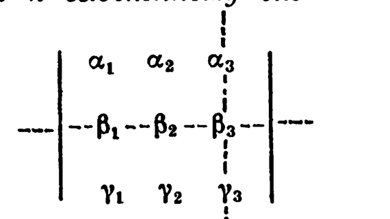

# Глава 2. Векторы. Линейные операции над векторами

## § 4. Матрицы, определители, системы линейных уравнений

Таблица $A = \begin{pmatrix}\alpha_1 & \alpha_2\\ \beta_1 & \beta_2\end{pmatrix}$ называется *матрицей второго порядка*. Элементы $\alpha_1$ и $\alpha_2$ образуют первую *строку* матрицы, $\beta_1$ и $\beta_2$ — вторую строку, $\alpha_1$ и $\beta_1$ — первый *столбец*, $\alpha_2$ и $\beta_2$ — второй столбец этой матрицы. Таблица
$$B = \begin{pmatrix}\alpha_1 & \alpha_2 & \alpha_3\\ \beta_1 & \beta_2 & \beta_3\\ \gamma_1 & \gamma_2 & \gamma_3\end{pmatrix} \quad (2.8)$$
называется *матрицей третьего порядка*. Элементы $\alpha_1$, $\alpha_2$, $\alpha_3$ образуют ее первую *строку*, $\alpha_1$, $\beta_1$, $\gamma_1$ — ее первый *столбец* и т. д.

Будем рассматривать только матрицы, у которых либо все строки (столбцы) состоят из чисел, либо одна строка (столбец) состоит из векторов, а остальные строки (столбцы) состоят из чисел. Для таких матриц можно ввести понятие детерминанта (определителя) матрицы. *Детерминантом* матрицы $A = \begin{pmatrix}\alpha_1 & \alpha_2\\ \beta_1 & \beta_2\end{pmatrix}$ называется выражение $\alpha_1\beta_2 - \alpha_2\beta_1$, которое обозначается
$$\det A, \ \det\begin{pmatrix}\alpha_1 & \alpha_2\\ \beta_1 & \beta_2\end{pmatrix} \ \text{или} \ \begin{vmatrix}\alpha_1 & \alpha_2\\ \beta_1 & \beta_2\end{vmatrix}$$

---
**стр. 36**

---

и называется также *определителем второго порядка*. Например,
$$\begin{vmatrix}1 & 2\\ 3 & 4\end{vmatrix} = 1\cdot4 - 2\cdot3 = -2; \quad \begin{vmatrix}\vec a & -2\\ \vec b & 1\end{vmatrix} = \vec a \cdot 1 - (-2)\vec b = \vec a + 2\vec b.$$

Детерминантом матрицы $B$ третьего порядка (см. (2.8)) называется выражение
$$\alpha_1\begin{vmatrix}\beta_2 & \beta_3\\ \gamma_2 & \gamma_3\end{vmatrix} - \alpha_2\begin{vmatrix}\beta_1 & \beta_3\\ \gamma_1 & \gamma_3\end{vmatrix} + \alpha_3\begin{vmatrix}\beta_1 & \beta_2\\ \gamma_1 & \gamma_2\end{vmatrix} =$$
$$= \alpha_1(\beta_2\gamma_3 - \beta_3\gamma_2) - \alpha_2(\beta_1\gamma_3 - \beta_3\gamma_1) + \alpha_3(\beta_1\gamma_2 - \beta_2\gamma_1),$$
обозначается
$$\det B, \ \det\begin{pmatrix}\alpha_1 & \alpha_2 & \alpha_3\\ \beta_1 & \beta_2 & \beta_3\\ \gamma_1 & \gamma_2 & \gamma_3\end{pmatrix} \ \text{или} \ \begin{vmatrix}\alpha_1 & \alpha_2 & \alpha_3\\ \beta_1 & \beta_2 & \beta_3\\ \gamma_1 & \gamma_2 & \gamma_3\end{vmatrix}$$
и называется также *определителем третьего порядка*. Например,
$$\begin{vmatrix}1 & -1 & 1\\ 2 & -1 & -3\\ -3 & 4 & -2\end{vmatrix} = 1\cdot\begin{vmatrix}-1 & -3\\ 4 & -2\end{vmatrix} - (-1)\begin{vmatrix}2 & -3\\ -3 & -2\end{vmatrix} +$$
$$+ 1\cdot\begin{vmatrix}2 & -1\\ -3 & 4\end{vmatrix} = ((-1)(-2)-(-3)\cdot4) +$$
$$+ (2\cdot(-2)-(-3)\cdot(-3)) + (2\cdot4-(-1)\cdot(-3)) =$$
$$= 2 + 12 - 4 - 9 + 8 - 3 = 6;$$
$$\begin{vmatrix}2 & 1 & -1\\ \vec a & \vec b & \vec c\\ -3 & 1 & 4\end{vmatrix} = 2\cdot\begin{vmatrix}\vec b & \vec c\\ 1 & 4\end{vmatrix} - 1\cdot\begin{vmatrix}\vec a & \vec c\\ -3 & 4\end{vmatrix} +$$
$$+ (-1)\begin{vmatrix}\vec a & \vec b\\ -3 & 1\end{vmatrix} = 2(4\vec b - \vec c) - (4\vec a + 3\vec c) - (\vec a + 3\vec b) =$$
$$= -5\vec a + 5\vec b - 5\vec c.$$

Если все элементы одной строки (столбца) матрицы (определителя) умножаются на одно и то же число $\lambda$, то говорят, что на число $\lambda$ умножается строка (столбец) матрицы (определителя). *Транспонированием* матрицы называется опера-

---
**стр. 37**

---

ция, состоящая в замене строк матрицы столбцами, а столбцов — строками с теми же номерами. Матрицу, транспонированную к матрице $B$, обозначают $B^\text{т}$. Если, например, $B$ определяется формулой (2.8), то $B^\text{т} = \begin{pmatrix}\alpha_1 & \beta_1 & \gamma_1\\ \alpha_2 & \beta_2 & \gamma_2\\ \alpha_3 & \beta_3 & \gamma_3\end{pmatrix}$. Если

$A = \begin{pmatrix}\alpha_1 & \alpha_2\\ \beta_1 & \beta_2\end{pmatrix}$ и $A' = \begin{pmatrix}\alpha_1' & \alpha_2'\\ \beta_1' & \beta_2'\end{pmatrix}$ — матрицы второго порядка, одна из которых числовая (целиком составлена из чисел), то *произведением $AA'$* называется матрица
$$AA' = \begin{pmatrix}\alpha_1\alpha_1' + \alpha_2\beta_1' & \alpha_1\alpha_2' + \alpha_2\beta_2'\\ \beta_1\alpha_1' + \beta_2\beta_1' & \beta_1\alpha_2' + \beta_2\beta_2'\end{pmatrix}.$$

*Произведением $BB'$ матриц $B$ и $B'$ третьего порядка*
$$B = \begin{pmatrix}\alpha_1 & \alpha_2 & \alpha_3\\ \beta_1 & \beta_2 & \beta_3\\ \gamma_1 & \gamma_2 & \gamma_3\end{pmatrix}, \quad B' = \begin{pmatrix}\alpha_1' & \alpha_2' & \alpha_3'\\ \beta_1' & \beta_2' & \beta_3'\\ \gamma_1' & \gamma_2' & \gamma_3'\end{pmatrix}$$
при условии, что одна из них числовая, называется матрица
$$BB' = \begin{pmatrix}
\alpha_1\alpha_1'+\alpha_2\beta_1'+\alpha_3\gamma_1' & \alpha_1\alpha_2'+\alpha_2\beta_2'+\alpha_3\gamma_2' & \alpha_1\alpha_3'+\alpha_2\beta_3'+\alpha_3\gamma_3'\\
\beta_1\alpha_1'+\beta_2\beta_1'+\beta_3\gamma_1' & \beta_1\alpha_2'+\beta_2\beta_2'+\beta_3\gamma_2' & \beta_1\alpha_3'+\beta_2\beta_3'+\beta_3\gamma_3'\\
\gamma_1\alpha_1'+\gamma_2\beta_1'+\gamma_3\gamma_1' & \gamma_1\alpha_2'+\gamma_2\beta_2'+\gamma_3\gamma_2' & \gamma_1\alpha_3'+\gamma_2\beta_3'+\gamma_3\gamma_3'
\end{pmatrix}. \quad (2.9)$$

Например, если $A = \begin{pmatrix}0 & 1\\ 2 & 1\end{pmatrix}$, $A' = \begin{pmatrix}1 & 0\\ 1 & 1\end{pmatrix}$, то
$$AA' = \begin{pmatrix}0\cdot1+1\cdot1 & 0\cdot0+1\cdot1\\ 2\cdot1+1\cdot1 & 2\cdot0+1\cdot1\end{pmatrix} = \begin{pmatrix}1 & 1\\ 3 & 1\end{pmatrix}.$$
$$A'A = \begin{pmatrix}1\cdot0+0\cdot2 & 1\cdot1+0\cdot1\\ 1\cdot0+1\cdot2 & 1\cdot1+1\cdot1\end{pmatrix} = \begin{pmatrix}0 & 1\\ 2 & 2\end{pmatrix}.$$

*Единичной матрицей $E$* называется числовая матрица, у которой все диагональные элементы равны единице, а недиагональные — нулю. Единичная матрица второго порядка имеет вид $\begin{pmatrix}1 & 0\\ 0 & 1\end{pmatrix}$, третьего порядка — вид $\begin{pmatrix}1 & 0 & 0\\ 0 & 1 & 0\\ 0 & 0 & 1\end{pmatrix}$. Если $S$ и

---
**стр. 38**

---

$E$ — матрицы одного порядка, $E$ — единичная матрица, то $SE = ES = S$. Числовые матрицы одного порядка $X$ и $Y$ называют *обратными* друг к другу и обозначают $Y = X^{-1}$, $X = Y^{-1}$, если $XY = YX = E$.

Приведем свойства определителей.

$1^\circ$. $\det S = \det S^\text{т}$.

□ Если $S = \begin{pmatrix}\alpha_1 & \alpha_2\\ \beta_1 & \beta_2\end{pmatrix}$, то
$$\det S = \alpha_1\beta_2 - \alpha_2\beta_1; \quad S^\text{т} = \begin{pmatrix}\alpha_1 & \beta_1\\ \alpha_2 & \beta_2\end{pmatrix},$$
$$\det S^\text{т} = \alpha_1\beta_2 - \beta_1\alpha_2 = \det S.$$

Если $S = \begin{pmatrix}\alpha_1 & \alpha_2 & \alpha_3\\ \beta_1 & \beta_2 & \beta_3\\ \gamma_1 & \gamma_2 & \gamma_3\end{pmatrix}$, то

$S^\text{т} = \begin{pmatrix}\alpha_1 & \beta_1 & \gamma_1\\ \alpha_2 & \beta_2 & \gamma_2\\ \alpha_3 & \beta_3 & \gamma_3\end{pmatrix}$ и $\det S = \alpha_1\begin{vmatrix}\beta_2 & \beta_3\\ \gamma_2 & \gamma_3\end{vmatrix} - \alpha_2\begin{vmatrix}\beta_1 & \beta_3\\ \gamma_1 & \gamma_3\end{vmatrix} +$
$$+ \alpha_3\begin{vmatrix}\beta_1 & \beta_2\\ \gamma_1 & \gamma_2\end{vmatrix} = \alpha_1\begin{vmatrix}\beta_2 & \gamma_2\\ \beta_3 & \gamma_3\end{vmatrix} - \alpha_2\beta_1\gamma_3 + \alpha_2\beta_3\gamma_1 + \alpha_3\beta_1\gamma_2 -$$
$$- \alpha_3\beta_2\gamma_1 = \alpha_1\begin{vmatrix}\beta_2 & \gamma_2\\ \beta_3 & \gamma_3\end{vmatrix} - \beta_1\begin{vmatrix}\alpha_2 & \gamma_2\\ \alpha_3 & \gamma_3\end{vmatrix} + \gamma_1\begin{vmatrix}\alpha_2 & \beta_2\\ \alpha_3 & \beta_3\end{vmatrix} = \det S^\text{т}. \ ■$$

$2^\circ$. *Если две строки определителя поменять местами, то знак определителя изменится.*

□ Если $S = \begin{pmatrix}\alpha_1 & \alpha_2\\ \beta_1 & \beta_2\end{pmatrix}$, $S' = \begin{pmatrix}\beta_1 & \beta_2\\ \alpha_1 & \alpha_2\end{pmatrix}$, то
$$\det S = \alpha_1\beta_2 - \alpha_2\beta_1, \quad \det S' = \beta_1\alpha_2 - \beta_2\alpha_1 =$$
$$= -(\alpha_1\beta_2 - \alpha_2\beta_1) = -\det S.$$

Если $S = \begin{pmatrix}\alpha_1 & \alpha_2 & \alpha_3\\ \beta_1 & \beta_2 & \beta_3\\ \gamma_1 & \gamma_2 & \gamma_3\end{pmatrix}$, $S' = \begin{pmatrix}\beta_1 & \beta_2 & \beta_3\\ \alpha_1 & \alpha_2 & \alpha_3\\ \gamma_1 & \gamma_2 & \gamma_3\end{pmatrix}$, то

$$\det S' = \beta_1(\alpha_2\gamma_3 - \alpha_3\gamma_2) - \beta_2(\alpha_1\gamma_3 - \alpha_3\gamma_1) +$$
$$+ \beta_3(\alpha_1\gamma_2 - \alpha_2\gamma_1) = -\alpha_1(\beta_2\gamma_3 - \beta_3\gamma_2) + \alpha_2(\beta_1\gamma_3 -$$
$$- \beta_3\gamma_1) - \alpha_3(\beta_1\gamma_2 - \beta_2\gamma_1) = -\det S.$$

---
**стр. 39**

---

Аналогично можно проверить, что
$$\begin{vmatrix}\alpha_1 & \alpha_2 & \alpha_3\\ \beta_1 & \beta_2 & \beta_3\\ \gamma_1 & \gamma_2 & \gamma_3\end{vmatrix} = -\begin{vmatrix}\alpha_1 & \alpha_2 & \alpha_3\\ \gamma_1 & \gamma_2 & \gamma_3\\ \beta_1 & \beta_2 & \beta_3\end{vmatrix} = -\begin{vmatrix}\gamma_1 & \gamma_2 & \gamma_3\\ \beta_1 & \beta_2 & \beta_3\\ \alpha_1 & \alpha_2 & \alpha_3\end{vmatrix}. \ ■$$

$3^\circ$. *Если две строки определителя одинаковы, то определитель равен нулю (нулевому вектору).*

□ Действительно, если две одинаковые строки поменять местами, то определитель не изменится. С другой стороны, согласно свойству $2^\circ$ определитель изменит знак. Но единственное число (вектор), которое (который) не изменяется при изменении знака, — это нуль (нулевой вектор). ■

$4^\circ$. *Если два столбца определителя поменять местами, то определитель изменит знак. Определитель с двумя одинаковыми столбцами равен нулю (нулевому вектору).*

□ Это свойство следует из свойств $1^\circ$–$3^\circ$. ■

$5^\circ$. *Для произвольных чисел $\lambda$ и $\mu$ справедливо равенство*
$$\begin{vmatrix}\lambda\alpha_1+\mu\alpha_1' & \lambda\alpha_2+\mu\alpha_2' & \lambda\alpha_3+\mu\alpha_3'\\ \beta_1 & \beta_2 & \beta_3\\ \gamma_1 & \gamma_2 & \gamma_3\end{vmatrix} =$$
$$= \lambda\begin{vmatrix}\alpha_1 & \alpha_2 & \alpha_3\\ \beta_1 & \beta_2 & \beta_3\\ \gamma_1 & \gamma_2 & \gamma_3\end{vmatrix} + \mu\begin{vmatrix}\alpha_1' & \alpha_2' & \alpha_3'\\ \beta_1 & \beta_2 & \beta_3\\ \gamma_1 & \gamma_2 & \gamma_3\end{vmatrix},$$
*если все три определителя имеют смысл, т. е. если одновременно все $\alpha_1$ и $\alpha_1'$, $\alpha_2$ и $\alpha_2'$, $\alpha_3$ и $\alpha_3'$ — или числа, или векторы.*

□ Определитель, стоящий в левой части равенства, равен
$$(\lambda\alpha_1+\mu\alpha_1')\begin{vmatrix}\beta_2 & \beta_3\\ \gamma_2 & \gamma_3\end{vmatrix} - (\lambda\alpha_2+\mu\alpha_2')\begin{vmatrix}\beta_1 & \beta_3\\ \gamma_1 & \gamma_3\end{vmatrix} +$$
$$+ (\lambda\alpha_3+\mu\alpha_3')\begin{vmatrix}\beta_1 & \beta_2\\ \gamma_1 & \gamma_2\end{vmatrix} = \lambda\left(\alpha_1\begin{vmatrix}\beta_2 & \beta_3\\ \gamma_2 & \gamma_3\end{vmatrix} -\right.$$
$$- \left.\alpha_2\begin{vmatrix}\beta_1 & \beta_3\\ \gamma_1 & \gamma_3\end{vmatrix} + \alpha_3\begin{vmatrix}\beta_1 & \beta_2\\ \gamma_1 & \gamma_2\end{vmatrix}\right) + \mu\left(\alpha_1'\begin{vmatrix}\beta_2 & \beta_3\\ \gamma_2 & \gamma_3\end{vmatrix} - \alpha_2'\begin{vmatrix}\beta_1 & \beta_3\\ \gamma_1 & \gamma_3\end{vmatrix} +\right.$$
$$+ \left.\alpha_3'\begin{vmatrix}\beta_1 & \beta_2\\ \gamma_1 & \gamma_2\end{vmatrix}\right) = \lambda\begin{vmatrix}\alpha_1 & \alpha_2 & \alpha_3\\ \beta_1 & \beta_2 & \beta_3\\ \gamma_1 & \gamma_2 & \gamma_3\end{vmatrix} + \mu\begin{vmatrix}\alpha_1' & \alpha_2' & \alpha_3'\\ \beta_1 & \beta_2 & \beta_3\\ \gamma_1 & \gamma_2 & \gamma_3\end{vmatrix}. \ ■$$

---
**стр. 40**

---

Аналогично, для определителя второго порядка имеем
$$\begin{vmatrix}\lambda\alpha_1+\mu\alpha_1' & \lambda\alpha_2+\mu\alpha_2'\\ \beta_1 & \beta_2\end{vmatrix} = \lambda\begin{vmatrix}\alpha_1 & \alpha_2\\ \beta_1 & \beta_2\end{vmatrix} + \mu\begin{vmatrix}\alpha_1' & \alpha_2'\\ \beta_1 & \beta_2\end{vmatrix}.$$

Свойство $5^\circ$ называется *свойством линейности определителя по первой строке*. С помощью свойства $2^\circ$ можно легко проверить линейность определителя по любой строке. При $\mu = 0$ из свойства $5^\circ$ следует, что при умножении строки определителя на число сам определитель умножается на это число:
$$\begin{vmatrix}\lambda\alpha_1 & \lambda\alpha_2 & \lambda\alpha_3\\ \beta_1 & \beta_2 & \beta_3\\ \gamma_1 & \gamma_2 & \gamma_3\end{vmatrix} = \lambda\begin{vmatrix}\alpha_1 & \alpha_2 & \alpha_3\\ \beta_1 & \beta_2 & \beta_3\\ \gamma_1 & \gamma_2 & \gamma_3\end{vmatrix}, \quad \begin{vmatrix}\alpha_1 & \alpha_2 & \alpha_3\\ \lambda\beta_1 & \lambda\beta_2 & \lambda\beta_3\\ \gamma_1 & \gamma_2 & \gamma_3\end{vmatrix} =$$
$$= \lambda\begin{vmatrix}\alpha_1 & \alpha_2 & \alpha_3\\ \beta_1 & \beta_2 & \beta_3\\ \gamma_1 & \gamma_2 & \gamma_3\end{vmatrix}, \quad \begin{vmatrix}\alpha_1 & \alpha_2 & \alpha_3\\ \beta_1 & \beta_2 & \beta_3\\ \lambda\gamma_1 & \lambda\gamma_2 & \lambda\gamma_3\end{vmatrix} = \lambda\begin{vmatrix}\alpha_1 & \alpha_2 & \alpha_3\\ \beta_1 & \beta_2 & \beta_3\\ \gamma_1 & \gamma_2 & \gamma_3\end{vmatrix}.$$

$6^\circ$. *Для любой числовой матрицы $S = \begin{pmatrix}\alpha_1 & \alpha_2 & \alpha_3\\ \beta_1 & \beta_2 & \beta_3\\ \gamma_1 & \gamma_2 & \gamma_3\end{pmatrix}$ и любых чисел $\lambda$ и $\mu$ выполняются следующие равенства:*
$$\begin{vmatrix}\alpha_1+\lambda\beta_1+\mu\gamma_1 & \alpha_2+\lambda\beta_2+\mu\gamma_2 & \alpha_3+\lambda\beta_3+\mu\gamma_3\\ \beta_1 & \beta_2 & \beta_3\\ \gamma_1 & \gamma_2 & \gamma_3\end{vmatrix} =$$
$$= \begin{vmatrix}\alpha_1 & \alpha_2 & \alpha_3\\ \beta_1 & \beta_2 & \beta_3\\ \gamma_1 & \gamma_2 & \gamma_3\end{vmatrix} = \begin{vmatrix}\alpha_1 & \alpha_2 & \alpha_3\\ \beta_1+\lambda\alpha_1+\mu\gamma_1 & \beta_2+\lambda\alpha_2+\mu\gamma_2 & \beta_3+\lambda\alpha_3+\mu\gamma_3\\ \gamma_1 & \gamma_2 & \gamma_3\end{vmatrix} =$$
$$= \begin{vmatrix}\alpha_1 & \alpha_2 & \alpha_3\\ \beta_1 & \beta_2 & \beta_3\\ \gamma_1+\lambda\alpha_1+\mu\beta_1 & \gamma_2+\lambda\alpha_2+\mu\beta_2 & \gamma_3+\lambda\alpha_3+\mu\beta_3\end{vmatrix}. \quad (2.10)$$

□ Согласно свойству $5^\circ$, первый из определителей равен сумме
$$\begin{vmatrix}\alpha_1 & \alpha_2 & \alpha_3\\ \beta_1 & \beta_2 & \beta_3\\ \gamma_1 & \gamma_2 & \gamma_3\end{vmatrix} + \lambda\begin{vmatrix}\beta_1 & \beta_2 & \beta_3\\ \beta_1 & \beta_2 & \beta_3\\ \gamma_1 & \gamma_2 & \gamma_3\end{vmatrix} + \mu\begin{vmatrix}\gamma_1 & \gamma_2 & \gamma_3\\ \beta_1 & \beta_2 & \beta_3\\ \gamma_1 & \gamma_2 & \gamma_3\end{vmatrix},$$

---
**стр. 41**

---

в которой второе и третье слагаемые равны нулю на основании свойства $3^\circ$. Тем самым первое из равенств (2.10) доказано. Остальные равенства следуют из первого равенства согласно свойству $2^\circ$. Про первый (третий, четвертый) определитель в (2.10) говорят, что он получен из $\det S$ прибавлением к первой (второй, третьей) строке линейной комбинации остальных строк. Свойство $6^\circ$ означает, что при прибавлении к какой-либо строке определителя числовой матрицы линейной комбинации остальных строк определитель не изменяется. ■

Равенство, аналогичное (2.10), справедливо и для определителей числовых матриц второго порядка:
$$\begin{vmatrix}\alpha_1+\lambda\beta_1 & \alpha_2+\lambda\beta_2\\ \beta_1 & \beta_2\end{vmatrix} = \begin{vmatrix}\alpha_1 & \alpha_2\\ \beta_1 & \beta_2\end{vmatrix} = \begin{vmatrix}\alpha_1 & \alpha_2\\ \beta_1+\lambda\alpha_1 & \beta_2+\lambda\alpha_2\end{vmatrix}.$$

$7^\circ$. *Определитель обладает свойством линейности по любому из своих столбцов. При умножении столбца определителя на число сам определитель умножается на это число. Если к столбцу определителя прибавить линейную комбинацию других столбцов, то определитель не изменится.*

□ В силу свойства $1^\circ$ это свойство следует из свойств $5^\circ$ и $6^\circ$. ■

$8^\circ$. *Если $S$ и $S'$ — матрицы одинакового порядка, одна из которых числовая, то $\det(SS') = \det S \det S'$.*

□ Пусть $S = \begin{pmatrix}\alpha_1 & \alpha_2\\ \beta_1 & \beta_2\end{pmatrix}$, $S' = \begin{pmatrix}\alpha_1' & \alpha_2'\\ \beta_1' & \beta_2'\end{pmatrix}$ — матрицы второго порядка. Тогда $\det(SS') = (\alpha_1\alpha_1'+\alpha_2\beta_1')(\beta_1\alpha_2'+\beta_2\beta_2') - (\alpha_1\alpha_2'+\alpha_2\beta_2')\times$
$$\times(\beta_1\alpha_1'+\beta_2\beta_1') = \alpha_1(\alpha_1'\beta_1\alpha_2'+\alpha_1'\beta_2\beta_2'-\alpha_2'\beta_1\alpha_1'-\alpha_2'\beta_2\beta_1') -$$
$$- \alpha_2(\beta_2'\beta_1\alpha_1'+\beta_2'\beta_2\beta_1'-\beta_1'\beta_1\alpha_2'-\beta_1'\beta_2\beta_2') = \alpha_1\beta_2(\alpha_1'\beta_2'-\alpha_2'\beta_1') -$$
$$- \alpha_2\beta_1(\alpha_1'\beta_2'-\alpha_2'\beta_1') = (\alpha_1\beta_2-\alpha_2\beta_1)(\alpha_1'\beta_2'-\alpha_2'\beta_1') = \det S \det S'.$$
Пусть теперь
$$S = \begin{pmatrix}\alpha_1 & \alpha_2 & \alpha_3\\ \beta_1 & \beta_2 & \beta_3\\ \gamma_1 & \gamma_2 & \gamma_3\end{pmatrix}, \quad S' = \begin{pmatrix}\alpha_1' & \alpha_2' & \alpha_3'\\ \beta_1' & \beta_2' & \beta_3'\\ \gamma_1' & \gamma_2' & \gamma_3'\end{pmatrix}$$
и для определенности $S$ — числовая матрица. По формуле (2.9) и согласно свойству $5^\circ$, $\det(SS') = \alpha_1 a + \alpha_2 b + \alpha_3 c$, где
$$a = \begin{vmatrix}\alpha_1' & \alpha_2' & \alpha_3'\\ \beta_1\alpha_1'+\beta_2\beta_1'+\beta_3\gamma_1' & \beta_1\alpha_2'+\beta_2\beta_2'+\beta_3\gamma_2' & \beta_1\alpha_3'+\beta_2\beta_3'+\beta_3\gamma_3'\\ \gamma_1\alpha_1'+\gamma_2\beta_1'+\gamma_3\gamma_1' & \gamma_1\alpha_2'+\gamma_2\beta_2'+\gamma_3\gamma_2' & \gamma_1\alpha_3'+\gamma_2\beta_3'+\gamma_3\gamma_3'\end{vmatrix}.$$

---
**стр. 42**

---

Определители $b$ и $c$ получают в результате замены в определителе $a$ первой строки соответственно строками $\beta_1', \beta_2', \beta_3'$ и $\gamma_1', \gamma_2', \gamma_3'$. Прибавляя в определителе $a$ ко второй (третьей) строке первую строку, умноженную на $-\beta_1$ (соответственно на $-\gamma_1$), используя определение определителя третьего порядка и уже доказанное свойство $8^\circ$ для определителей второго порядка, получаем
$$a = \begin{vmatrix}\alpha_1' & \alpha_2' & \alpha_3'\\ \beta_2\beta_1'+\beta_3\gamma_1' & \beta_2\beta_2'+\beta_3\gamma_2' & \beta_2\beta_3'+\beta_3\gamma_3'\\ \gamma_2\beta_1'+\gamma_3\gamma_1' & \gamma_2\beta_2'+\gamma_3\gamma_2' & \gamma_2\beta_3'+\gamma_3\gamma_3'\end{vmatrix} =$$
$$= \alpha_1'\begin{vmatrix}\beta_2 & \beta_3\\ \gamma_2 & \gamma_3\end{vmatrix}\begin{vmatrix}\beta_2' & \beta_3'\\ \gamma_2' & \gamma_3'\end{vmatrix} - \alpha_2'\begin{vmatrix}\beta_2 & \beta_3\\ \gamma_2 & \gamma_3\end{vmatrix}\begin{vmatrix}\beta_1' & \beta_3'\\ \gamma_1' & \gamma_3'\end{vmatrix} +$$
$$+ \alpha_3'\begin{vmatrix}\beta_2 & \beta_3\\ \gamma_2 & \gamma_3\end{vmatrix}\begin{vmatrix}\beta_1' & \beta_2'\\ \gamma_1' & \gamma_2'\end{vmatrix} = \begin{vmatrix}\beta_2 & \beta_3\\ \gamma_2 & \gamma_3\end{vmatrix}\det S'.$$

Аналогично можно проверить, что $b = -\begin{vmatrix}\beta_1 & \beta_3\\ \gamma_1 & \gamma_3\end{vmatrix}\det S'$, $c = \begin{vmatrix}\beta_1 & \beta_2\\ \gamma_1 & \gamma_2\end{vmatrix}\det S'$, поэтому
$$\det(SS') = \left(\alpha_1\begin{vmatrix}\beta_2 & \beta_3\\ \gamma_2 & \gamma_3\end{vmatrix} - \alpha_2\begin{vmatrix}\beta_1 & \beta_3\\ \gamma_1 & \gamma_3\end{vmatrix} + \alpha_3\begin{vmatrix}\beta_1 & \beta_2\\ \gamma_1 & \gamma_2\end{vmatrix}\right)\det S' =$$
$$= \det S \det S'. \ ■$$

**Пример 1.** Используя свойство $6^\circ$, вычислите определитель
$$\Delta = \begin{vmatrix}1 & 4 & 7\\ 2 & 5 & 8\\ 3 & 6 & 10\end{vmatrix}.$$

△ Вычтем из второй строки первую, умноженную на 2: $\Delta = \begin{vmatrix}1 & 4 & 7\\ 0 & -3 & -6\\ 3 & 6 & 10\end{vmatrix}$. Вычтем из третьей строки первую, умноженную на 3:
$$\Delta = \begin{vmatrix}1 & 4 & 7\\ 0 & -3 & -6\\ 0 & -6 & -11\end{vmatrix} = 1\cdot\begin{vmatrix}-3 & -6\\ -6 & -11\end{vmatrix} -$$
$$- 4\cdot\begin{vmatrix}0 & -6\\ 0 & -11\end{vmatrix} + 7\cdot\begin{vmatrix}0 & -3\\ 0 & -6\end{vmatrix} = 1\cdot(-3)-4\cdot0+7\cdot0 = -3. \ ▲$$

---
**стр. 43**

---

Отметим, что, используя свойство $1^\circ$, последние вычисления можно упростить:
$$\Delta = \begin{vmatrix}1 & 4 & 7\\ 0 & -3 & -6\\ 0 & -6 & -11\end{vmatrix} = \begin{vmatrix}1 & 0 & 0\\ 4 & -3 & -6\\ 7 & -6 & -11\end{vmatrix} =$$
$$= 1\cdot\begin{vmatrix}-3 & -6\\ -6 & -11\end{vmatrix} = (-3)\cdot(-11)-(-6)\cdot(-6) = -3.$$

**Пример 2.** Докажите, что если все элементы строки (столбца) определителя равны нулю (нулевому вектору), то определитель равен нулю (нулевому вектору).

△ Если указанную строку (столбец) умножить на нуль, то определитель, очевидно, не изменится. С другой стороны, согласно свойствам $5^\circ$ и $7^\circ$, определитель умножится на нуль, т. е. станет равным нулю (нулевому вектору). ▲

Если $\alpha_1$, $\alpha_2$, $\alpha_3$, $\beta_1$, $\beta_2$, $\beta_3$ — действительные числа, то имеет место тождество, связанное с тремя определителями:
$$(\alpha_1^2+\alpha_2^2+\alpha_3^2)(\beta_1^2+\beta_2^2+\beta_3^2) - (\alpha_1\beta_1+\alpha_2\beta_2+\alpha_3\beta_3)^2 =$$
$$= \left(\begin{vmatrix}\alpha_2 & \alpha_3\\ \beta_2 & \beta_3\end{vmatrix}\right)^2 + \left(\begin{vmatrix}\alpha_1 & \alpha_3\\ \beta_1 & \beta_3\end{vmatrix}\right)^2 + \left(\begin{vmatrix}\alpha_1 & \alpha_2\\ \beta_1 & \beta_2\end{vmatrix}\right)^2. \quad (2.11)$$

□ Правая часть тождества (2.11) равна $(\alpha_2\beta_3-\alpha_3\beta_2)^2 + (\alpha_1\beta_3-\alpha_3\beta_1)^2 + (\alpha_1\beta_2-\alpha_2\beta_1)^2 = \alpha_2^2\beta_3^2+\alpha_3^2\beta_2^2+\alpha_1^2\beta_3^2+\alpha_3^2\beta_1^2+ \alpha_1^2\beta_2^2+\alpha_2^2\beta_1^2 - 2(\alpha_2\beta_3\alpha_3\beta_2+\alpha_1\beta_3\alpha_3\beta_1+\alpha_1\beta_2\alpha_2\beta_1)$. Левая её часть равна $\alpha_1^2\beta_1^2+\alpha_2^2\beta_1^2+\alpha_3^2\beta_1^2+\alpha_1^2\beta_2^2+\alpha_2^2\beta_2^2+\alpha_3^2\beta_2^2+\alpha_1^2\beta_3^2+\alpha_2^2\beta_3^2+\alpha_3^2\beta_3^2 - (\alpha_1^2\beta_1^2+\alpha_2^2\beta_2^2+\alpha_3^2\beta_3^2+2\alpha_1\beta_1\alpha_2\beta_2+2\alpha_1\beta_1\alpha_3\beta_3+2\alpha_2\beta_2\alpha_3\beta_3) = \alpha_2^2\beta_3^2+\alpha_3^2\beta_2^2+\alpha_1^2\beta_3^2+\alpha_3^2\beta_1^2+\alpha_1^2\beta_2^2+\alpha_2^2\beta_1^2 - 2(\alpha_2\beta_3\alpha_3\beta_2+\alpha_1\beta_3\alpha_3\beta_1+\alpha_1\beta_2\alpha_2\beta_1)$, т. е. равна правой. ■

Имеет место лемма о трех определителях: равенства
$$\begin{vmatrix}\alpha_2 & \alpha_3\\ \beta_2 & \beta_3\end{vmatrix} = \begin{vmatrix}\alpha_1 & \alpha_3\\ \beta_1 & \beta_3\end{vmatrix} = \begin{vmatrix}\alpha_1 & \alpha_2\\ \beta_1 & \beta_2\end{vmatrix} = 0 \quad (2.12)$$
выполняются тогда и только тогда, когда существуют числа $\lambda$ и $\mu$, не равные нулю одновременно, такие, что
$$\lambda\alpha_1+\mu\beta_1 = 0, \quad \lambda\alpha_2+\mu\beta_2 = 0, \quad \lambda\alpha_3+\mu\beta_3 = 0. \quad (2.13)$$
При этом если $\alpha_1^2+\alpha_2^2+\alpha_3^2 > 0$, то $\mu \neq 0$; если $\beta_1^2+\beta_2^2+\beta_3^2 > 0$, то $\lambda \neq 0$.

□ Пусть выполняются соотношения (2.13) и пусть для определенности $\lambda \neq 0$. Тогда $\alpha_1 = -\nu\beta_1$, $\alpha_2 = -\nu\beta_2$, $\alpha_3 = -\nu\beta_3$,

---
**стр. 44**

---

где $\nu = \mu/\lambda$, и поэтому $\begin{vmatrix}\alpha_2 & \alpha_3\\ \beta_2 & \beta_3\end{vmatrix} = \alpha_2\beta_3-\alpha_3\beta_2 = -\nu\beta_2\beta_3+\nu\beta_3\beta_2 =$
$$= 0.$$ Аналогично можно проверить, что $\begin{vmatrix}\alpha_1 & \alpha_3\\ \beta_1 & \beta_3\end{vmatrix} = \begin{vmatrix}\alpha_1 & \alpha_2\\ \beta_1 & \beta_2\end{vmatrix} = 0.$

Обратно: если выполняются соотношения (2.12), то в силу тождества (2.11) $AB - C^2 = 0$, где $A = \alpha_1^2+\alpha_2^2+\alpha_3^2$, $B = \beta_1^2+\beta_2^2+\beta_3^2$, $C = \alpha_1\beta_1+\alpha_2\beta_2+\alpha_3\beta_3$. Возможны следующие случаи:

а) $\alpha_1=\alpha_2=\alpha_3=0$. Тогда соотношения (2.13) выполняются при $\lambda=1$, $\mu=0$.

б) $\alpha_1^2+\alpha_2^2+\alpha_3^2 > 0$. Рассмотрим квадратный трехчлен $p(t) = (t\alpha_1-\beta_1)^2+(t\alpha_2-\beta_2)^2+(t\alpha_3-\beta_3)^2 = t^2(\alpha_1^2+\alpha_2^2+\alpha_3^2) - 2t(\alpha_1\beta_1+\alpha_2\beta_2+\alpha_3\beta_3)+(\beta_1^2+\beta_2^2+\beta_3^2) = At^2-2Ct+B = A(t-C/A)^2+B-C^2/A = A(t-C/A)^2$. При $t=C/A$ трёхчлен $p(t)$ обращается в нуль, поэтому $C\alpha_1/A-\beta_1 = C\alpha_2/A-\beta_2 = C\alpha_3/A-\beta_3 = 0$, т. е. соотношения (2.13) выполняются при $\lambda = C/A$, $\mu=-1$. ■

Свойства алгебраических дополнений. Если в определителе выделить какой-нибудь элемент и вычеркнуть строку и столбец определителя, содержащие этот элемент, то оставшийся определитель называется *минором*, *дополнительным к выделенному элементу*. Дополнительный минор, умноженный на $(-1)$ в степени, равной сумме номеров вычеркнутых строки и столбца, называется *алгебраическим дополнением к выделенному элементу*. Например, в определителе

алгебраическое дополнение к элементу $\beta_3$ есть $(-1)^{2+3}\times\begin{vmatrix}\alpha_1 & \alpha_2\\ \gamma_1 & \gamma_2\end{vmatrix}$, поскольку элемент $\beta_3$ расположен во второй строке и в третьем столбце.

Пусть
$$S = \begin{pmatrix}\alpha_1 & \alpha_2 & \alpha_3\\ \beta_1 & \beta_2 & \beta_3\\ \gamma_1 & \gamma_2 & \gamma_3\end{pmatrix} \quad (2.14)$$
— произвольная числовая матрица; $A_1, A_2, A_3, B_1, B_2, B_3, C_1, C_2, C_3$ — алгебраические дополнения соответственно к элементам $\alpha_1,\alpha_2,\alpha_3,\beta_1,\beta_2,\beta_3,\gamma_1,\gamma_2,\gamma_3$ в определите-

---
**стр. 45**

---

ле $\det S$. Рассмотрим матрицу
$$S' = \begin{pmatrix}A_1 & B_1 & C_1\\ A_2 & B_2 & C_2\\ A_3 & B_3 & C_3\end{pmatrix}, \quad (2.15)$$
получающуюся из $S$ следующим образом: в матрице $S$ каждый элемент заменяется его алгебраическим дополнением, а получившаяся матрица затем транспонируется. Докажем, что
$$SS' = S'S = \begin{pmatrix}\Delta & 0 & 0\\ 0 & \Delta & 0\\ 0 & 0 & \Delta\end{pmatrix}, \quad \text{где } \Delta = \det S.$$

По определению произведения матриц для этого необходимо и достаточно проверить выполнение следующих равенств:
$$\alpha_1A_1+\alpha_2A_2+\alpha_3A_3=\Delta, \quad \beta_1A_1+\beta_2A_2+\beta_3A_3=0,$$
$$\gamma_1A_1+\gamma_2A_2+\gamma_3A_3=0; \quad (2.16)$$
$$\alpha_1B_1+\alpha_2B_2+\alpha_3B_3=0, \quad \beta_1B_1+\beta_2B_2+\beta_3B_3=\Delta,$$
$$\gamma_1B_1+\gamma_2B_2+\gamma_3B_3=0; \quad (2.17)$$
$$\alpha_1C_1+\alpha_2C_2+\alpha_3C_3=0, \quad \beta_1C_1+\beta_2C_2+\beta_3C_3=0,$$
$$\gamma_1C_1+\gamma_2C_2+\gamma_3C_3=\Delta; \quad (2.18)$$
$$\alpha_1A_1+\beta_1B_1+\gamma_1C_1=\Delta, \quad \alpha_2A_1+\beta_2B_1+\gamma_2C_1=0,$$
$$\alpha_3A_1+\beta_3B_1+\gamma_3C_1=0; \quad (2.19)$$
$$\alpha_1A_2+\beta_1B_2+\gamma_1C_2=0, \quad \alpha_2A_2+\beta_2B_2+\gamma_2C_2=\Delta,$$
$$\alpha_3A_2+\beta_3B_2+\gamma_3C_2=0; \quad (2.20)$$
$$\alpha_1A_3+\beta_1B_3+\gamma_1C_3=0, \quad \alpha_2A_3+\beta_2B_3+\gamma_2C_3=0,$$
$$\alpha_3A_3+\beta_3B_3+\gamma_3C_3=\Delta. \quad (2.21)$$

□ Равенства (2.16)–(2.21) доказываются одинаково. Проверим, например, первые два из равенств (2.16):
$$\alpha_1A_1+\alpha_2A_2+\alpha_3A_3 = \alpha_1\begin{vmatrix}\beta_2 & \beta_3\\ \gamma_2 & \gamma_3\end{vmatrix} - \alpha_2\begin{vmatrix}\beta_1 & \beta_3\\ \gamma_1 & \gamma_3\end{vmatrix} +$$
$$+ \alpha_3\begin{vmatrix}\beta_1 & \beta_2\\ \gamma_1 & \gamma_2\end{vmatrix} = \begin{vmatrix}\alpha_1 & \alpha_2 & \alpha_3\\ \beta_1 & \beta_2 & \beta_3\\ \gamma_1 & \gamma_2 & \gamma_3\end{vmatrix} = \Delta;$$
$$\beta_1A_1+\beta_2A_2+\beta_3A_3 = \begin{vmatrix}\beta_1 & \beta_2 & \beta_3\\ \beta_1 & \beta_2 & \beta_3\\ \gamma_1 & \gamma_2 & \gamma_3\end{vmatrix} = 0. \ ■$$

---
**стр. 46**

---

Из доказанного утверждения следует, что для всякой числовой матрицы $S$ вида (2.14), определитель которой $\Delta = \det S$ не равен нулю, существует обратная к ней матрица $S^{-1}$, причем
$$S^{-1} = \begin{pmatrix}A_1/\Delta & B_1/\Delta & C_1/\Delta\\ A_2/\Delta & B_2/\Delta & C_2/\Delta\\ A_3/\Delta & B_3/\Delta & C_3/\Delta\end{pmatrix} \quad \text{и} \quad \det S^{-1} = 1/\Delta.$$

Если $S = \begin{pmatrix}\alpha_1 & \alpha_2\\ \beta_1 & \beta_2\end{pmatrix}$ — матрица второго порядка, причем $\Delta = \det S = \alpha_1\beta_2-\alpha_2\beta_1 \neq 0$, то обратная матрица $S^{-1}$ определяется формулой
$$S^{-1} = \begin{pmatrix}\beta_2/\Delta & -\alpha_2/\Delta\\ -\beta_1/\Delta & \alpha_1/\Delta\end{pmatrix}, \quad \det S^{-1} = 1/\Delta.$$

**Системы линейных уравнений.** Рассмотрим систему линейных уравнений
$$\alpha_1x+\alpha_2y+\alpha_3z=m, \quad \beta_1x+\beta_2y+\beta_3z=n, \quad \gamma_1x+$$
$$+\gamma_2y+\gamma_3z=p, \quad (2.22)$$
где $\alpha_1,\alpha_2,\alpha_3,\beta_1,\beta_2,\beta_3,\gamma_1,\gamma_2,\gamma_3$ — заданные числа; $m$, $n$ и $p$ либо заданные числа, либо векторы; $x$, $y$, $z$ — переменные (числовые, если $m$, $n$, $p$ — числа, и векторные, если $m$, $n$, $p$ — векторы). Матрица $S = \begin{pmatrix}\alpha_1 & \alpha_2 & \alpha_3\\ \beta_1 & \beta_2 & \beta_3\\ \gamma_1 & \gamma_2 & \gamma_3\end{pmatrix}$ называется *матрицей системы* (2.22). Обозначим через $S'$ матрицу из алгебраических дополнений [см. (2.14), (2.15)] к элементам матрицы $S$. Положим $\Delta = \det S$.

Пусть $(x;y;z)$ — решение системы (2.22). Сложив первое из уравнений этой системы, умноженное на $A_1$, со вторым уравнением, умноженным на $B_1$, и с третьим уравнением, умноженным на $C_1$, получим в силу (2.19)
$$x\Delta = mA_1+nB_1+pC_1 = \begin{vmatrix}m & \alpha_2 & \alpha_3\\ n & \beta_2 & \beta_3\\ p & \gamma_2 & \gamma_3\end{vmatrix} = \Delta_x \quad (2.23)$$
(последнее из равенств (2.23) является определением $\Delta_x$).

Умножая первое уравнение системы (2.22) на $A_2$, второе — на $B_2$, третье — на $C_2$ и складывая получившиеся уравнения, на основании (2.20) получим
$$y\Delta = mA_2+nB_2+pC_2 = \begin{vmatrix}\alpha_1 & m & \alpha_3\\ \beta_1 & n & \beta_3\\ \gamma_1 & p & \gamma_3\end{vmatrix} = \Delta_y. \quad (2.24)$$

---
**стр. 47**

---

Аналогично имеем
$$z\Delta = mA_3+nB_3+pC_3 = \begin{vmatrix}\alpha_1 & \alpha_2 & m\\ \beta_1 & \beta_2 & n\\ \gamma_1 & \gamma_2 & p\end{vmatrix} = \Delta_z. \quad (2.25)$$

**Теорема 1 (правило Крамера).** *Если определитель $\Delta$ матрицы $S$ системы уравнений (2.22) не равен нулю, то эта система имеет единственное решение $(x;y;z)$, определяемое следующими формулами:*
$$x = \Delta_x/\Delta, \quad y = \Delta_y/\Delta, \quad z = \Delta_z/\Delta. \quad (2.26)$$

□ Единственность решения следует из того, что, как показано выше, всякое решение $(x;y;z)$ системы (2.22) удовлетворяет равенствам (2.23)–(2.25) и поэтому имеет вид (2.26). Остается проверить, что формулы (2.26) действительно определяют решение системы (2.22). Подставляя выражения (2.26) в левую часть первого уравнения системы (2.22), в силу равенств (2.16)–(2.18) имеем
$$\alpha_1(\Delta_x/\Delta)+\alpha_2(\Delta_y/\Delta)+\alpha_3(\Delta_z/\Delta) = (1/\Delta)(\alpha_1mA_1+$$
$$+\alpha_1nB_1+\alpha_1pC_1+\alpha_2mA_2+\alpha_2nB_2+\alpha_2pC_2+\alpha_3mA_3+$$
$$+\alpha_3nB_3+\alpha_3pC_3) = \frac{1}{\Delta}\{(\alpha_1A_1+\alpha_2A_2+\alpha_3A_3)m+$$
$$+(\alpha_1B_1+\alpha_2B_2+\alpha_3B_3)n+(\alpha_1C_1+\alpha_2C_2+\alpha_3C_3)p\} = m.$$
Таким образом, $x$, $y$ и $z$, определяемые формулами (2.26), удовлетворяют первому из уравнений системы (2.22). Аналогично можно проверить, что $x$, $y$ и $z$ удовлетворяют также второму и третьему уравнениям (выполните эту проверку в качестве упражнения). ■

Доказанная теорема означает, что если $m$, $n$, $p$ выражаются через $x$, $y$, $z$ с помощью элементов матрицы $S$ (2.14) по формулам (2.22), то $x$, $y$, $z$ выражаются через $m$, $n$, $p$ с помощью элементов матрицы $S'$ (2.15) по формулам (2.26) [см. (2.23)–(2.25)].

Система уравнений (2.22) называется *однородной*, если $m=n=p=0$. Если $\Delta \neq 0$, то однородная система (2.22) имеет единственное решение $x=y=z=0$, которое называется *тривиальным*. Любое решение $(x;y;z)$ однородной системы, для которого $x^2+y^2+z^2 > 0$, называется *нетривиальным*.

---
**стр. 48**

---

**Теорема 2 (о существовании нетривиального решения у однородной системы уравнений). Система линейных уравнений**
$$\alpha_1x+\alpha_2y+\alpha_3z=0, \quad \beta_1x+\beta_2y+\beta_3z=0, \quad \gamma_1x+$$
$$+\gamma_2y+\gamma_3z=0 \quad (2.27)$$
*имеет нетривиальное решение тогда и только тогда, когда $\Delta = 0$.*

□ Если нетривиальное решение системы (2.27) существует, то $\Delta = 0$; в противном случае система (2.27) имела бы единственное решение — тривиальное (правило Крамера).

Обратно: пусть $\Delta = 0$. Тогда если $A_1,A_2,A_3,B_1,B_2,B_3,C_1,C_2,C_3$ — алгебраические дополнения соответственно к элементам $\alpha_1,\alpha_2,\alpha_3,\beta_1,\beta_2,\beta_3,\gamma_1,\gamma_2,\gamma_3$ матрицы $S$ системы (2.27), то в силу равенств (2.16)–(2.18) наборы $(A_1;A_2;A_3)$, $(B_1;B_2;B_3)$, $(C_1;C_2;C_3)$ — решения системы (2.27). Если хотя бы одно из этих решений нетривиально, то теорема доказана.

Рассмотрим случай $A_1=A_2=A_3=B_1=B_2=B_3=C_1=C_2=C_3=0$. Если все элементы матрицы $S$ равны нулю, то система (2.27) имеет нетривиальное решение (ей удовлетворяют любые числа $x$, $y$, $z$). Если же не все элементы матрицы $S$ равны нулю, то, поменяв (если это необходимо) уравнения системы (2.27) местами, можно без ограничения общности считать, что $\alpha_1^2+\alpha_2^2+\alpha_3^2 > 0$. Так как
$$B_1 = -\begin{vmatrix}\alpha_2 & \alpha_3\\ \gamma_2 & \gamma_3\end{vmatrix} = 0, \quad B_2 = \begin{vmatrix}\alpha_1 & \alpha_3\\ \gamma_1 & \gamma_3\end{vmatrix} = 0, \quad B_3 = -\begin{vmatrix}\alpha_1 & \alpha_2\\ \gamma_1 & \gamma_2\end{vmatrix} = 0,$$
то по лемме о трех определителях существует такое число $\nu \neq 0$, что $\gamma_1=\nu\alpha_1$, $\gamma_2=\nu\alpha_2$, $\gamma_3=\nu\alpha_3$, т. е. третье уравнение системы получается из первого умножением обеих его частей на число $\nu$ и, следовательно, является следствием первого уравнения. Аналогично, из равенств $C_1=C_2=C_3=0$ следует, что второе из уравнений системы (2.27) является следствием первого. Значит, в рассматриваемом случае система (2.27) эквивалентна своему первому уравнению (точнее, тому из своих уравнений, у которого не все коэффициенты равны нулю). Осталось проверить, что уравнение $\alpha_1x+\alpha_2y+\alpha_3z=0$ имеет нетривиальное решение. А это очевидно: если $\alpha_1=0$, то $(1;0;0)$ — решение данного уравнения; если же $\alpha_1 \neq 0$, то решением данного уравнения является $(\alpha_2/\alpha_1; -1; 0)$. ■
