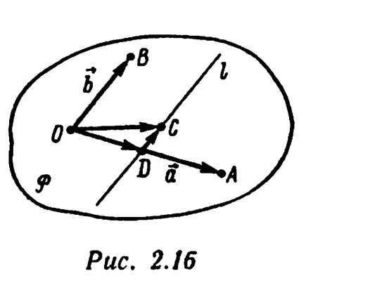
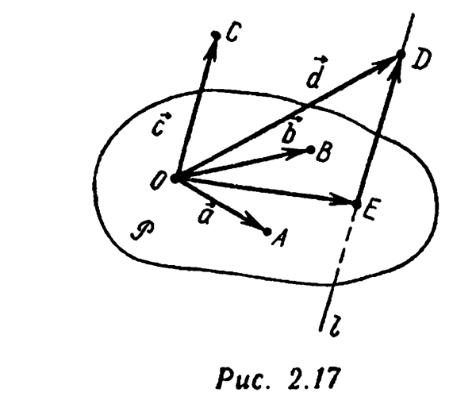
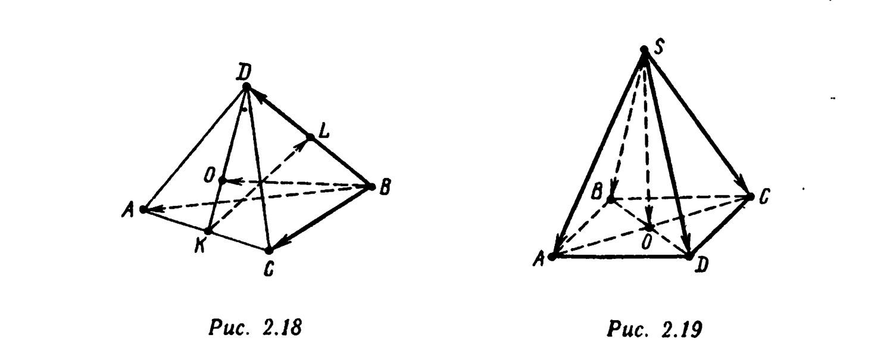
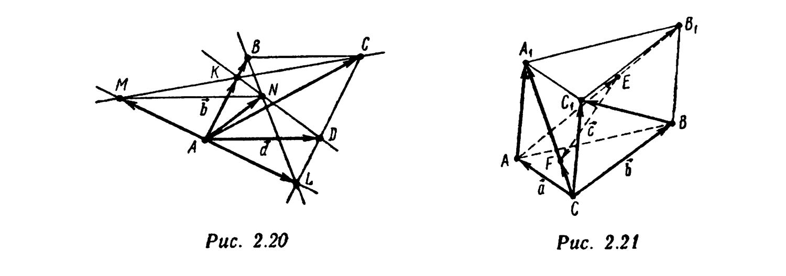
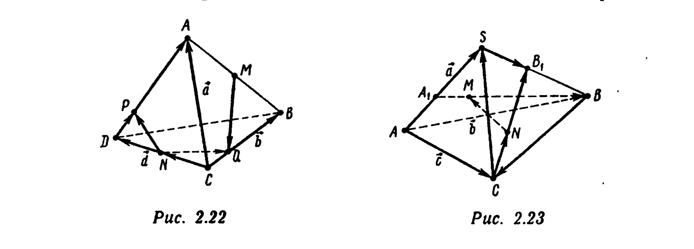

# Глава 2. Векторы. Линейные операции над векторами

## § 5. Признак компланарности векторов. Базис в плоскости и в пространстве. Разложение вектора по базису

---
**стр. 49**
---

Пусть $\vec a$ и $\vec b$ — неколлинеарные векторы. Отложим их от одной точки: $\overrightarrow{OA} = \vec a$, $\overrightarrow{OB} = \vec b$ (рис. 2.16). Обозначим через $P$ плоскость, определяемую точками $O$, $A$, $B$. Любой вектор $\vec c$, компланарный векторам $\vec a$ и $\vec b$, по определению параллелен плоскости $P$. Если построить вектор $\overrightarrow{OC} = \vec c$, то точка $C$ будет принадлежать плоскости $P$. Проведем через точку $C$ прямую $l$ параллельно прямой $(OB)$. Поскольку $\vec a$ и $\vec b$ не коллинеарны, прямые $l$ и $(OA)$ пересекутся в некоторой точке $D$. Векторы $\overrightarrow{OD}$ и $\overrightarrow{OA}$ коллинеарны, причем $\overrightarrow{OA} \neq \vec 0$. Согласно признаку коллинеарности векторов найдется такое действительное число $x$, что $\overrightarrow{OD} = x\overrightarrow{OA}$. Аналогично, найдется такое число $y$, что $\overrightarrow{DC} = y\overrightarrow{OB}$. Поэтому $\overrightarrow{OC} = \overrightarrow{OD} + \overrightarrow{DC} = x\overrightarrow{OA} + y\overrightarrow{OB}$, т. е.
$$\vec c = x\vec a + y\vec b. \quad (2.28)$$

Упорядоченная пара неколлинеарных векторов $\vec a \| P$ и $\vec b \| P$ называется *базисом в плоскости $P$* (обозначение: $\{\vec a, \vec b\}$). Всякий вектор $\vec c$, компланарный векторам $\vec a$ и $\vec b$, образующим базис, можно представить в виде (2.28). Числа $x$ и $y$ называются *координатами вектора $\vec c$ в базисе $\{\vec a, \vec b\}$*, а само равенство (2.28) — *разложением вектора $\vec c$ по базису $\{\vec a, \vec b\}$*. Тот факт, что числа $x$ и $y$ являются координатами вектора $\vec c$ в базисе $\{\vec a, \vec b\}$, записывается так: $\vec c = (x;y)$.

**Пример 1.** Докажите, что разложение вектора $\vec c$ по базису $\{\vec a, \vec b\}$ единственно.

□ Пусть $\vec c = x'\vec a + y'\vec b$ — некоторое разложение вектора $\vec c$ по базису $\{\vec a, \vec b\}$, отличное от (2.28). Тогда в силу неколлинеарности векторов $\vec a$ и $\vec b$ имеем (см. пример 4 § 3 этой главы) $x=x'$, $y=y'$. Получено противоречие. ■

---
**стр. 50**

---

**Пример 2 (признак компланарности).** Пусть $\vec a$, $\vec b$, $\vec c$ — три вектора пространства, связанные соотношением (2.28), где $x$ и $y$ — некоторые действительные числа. Докажите, что векторы $\vec a$, $\vec b$, $\vec c$ компланарны.

□ Если векторы $\vec a$ и $\vec b$ коллинеарны, т. е. параллельны некоторой прямой $l$, то этой прямой параллельны векторы $x\vec a$, $y\vec b$, а также и вектор $\vec c$, являющийся суммой $x\vec a$ и $y\vec b$. Значит, векторы $\vec a$, $\vec b$ и $\vec c$ параллельны любой плоскости, содержащей прямую $l$.

Если векторы $\vec a$ и $\vec b$ не коллинеарны, то отложим их от некоторой точки $O$ (рис. 2.16): $\vec a = \overrightarrow{OA}$, $\vec b = \overrightarrow{OB}$. Обозначим через $P$ плоскость $(OAB)$. Возьмем на прямой $(OA)$ точку $D$ так, чтобы $\overrightarrow{OD} = x\overrightarrow{OA}$. Отложим от точки $D$ направленный отрезок $\overrightarrow{DC} = y\overrightarrow{OB}$, который, будучи параллелен прямой $(OB)$, параллелен и плоскости $P$. Его начало $D$ лежит в плоскости $P$, значит, и конец $C$ также расположен в плоскости $P$. Таким образом, начало и конец направленного отрезка $\overrightarrow{OC} = \overrightarrow{OD} + \overrightarrow{DC} = x\overrightarrow{OA} + y\overrightarrow{OB}$ лежат в плоскости $P$. Это означает, что изображаемый им вектор $x\vec a + y\vec b$, т. е. вектор $\vec c$, параллелен плоскости $P$, а следовательно, компланарен векторам $\vec a$ и $\vec b$. ■

**Пример 3.** Векторы $\vec a$, $\vec b$ и $\vec c$ не компланарны. Докажите, что
$$x\vec a + y\vec b + z\vec c = \vec 0 \Leftrightarrow x = y = z = 0. \quad (2.29)$$

□ Если хотя бы одно из чисел в равенстве $x\vec a+y\vec b+z\vec c=\vec 0$, например $z$, не равно нулю, то это равенство эквивалентно равенству $\vec c = x'\vec a+y'\vec b$, где $x'=-x/z$, $y'=-y/z$. По признаку компланарности (см. пример 2) вектор $\vec c$ компланарен векторам $\vec a$ и $\vec b$, т. е. получено противоречие. Следовательно, $x=y=z=0$. Обратно: если $x=y=z=0$, то равенство $x\vec a+y\vec b+z\vec c=\vec 0$ очевидно. ■

**Пример 4.** Векторы $\vec a$, $\vec b$ и $\vec c$ не компланарны. Докажите, что равенство
$$m_1\vec a+n_1\vec b+k_1\vec c = m_2\vec a+n_2\vec b+k_2\vec c \quad (2.30)$$

---
**стр. 51**

---

эквивалентно системе равенств
$$m_1=m_2, \quad n_1=n_2, \quad k_1=k_2. \quad (2.31)$$

□ Для доказательства достаточно переписать (2.30) в виде $(m_1-m_2)\vec a+(n_1-n_2)\vec b+(k_1-k_2)\vec c=\vec 0$ и воспользоваться результатом примера 3. ■

**Пример 5.** Докажите, что если векторы $\vec a \neq \vec 0$ и $\vec b$ коллинеарны, то векторы $\vec a$, $\vec b$ и $\vec c$ ($\vec c$ — любой вектор) компланарны.

□ Если векторы $\vec a$ и $\vec c$ коллинеарны, то все три вектора $\vec a$, $\vec b$, $\vec c$ параллельны одной и той же прямой, тем более одной и той же содержащей эту прямую плоскости. Если векторы $\vec a$ и $\vec c$ не коллинеарны, то они образуют базис в некоторой плоскости $P$. Векторы $\vec a \neq \vec 0$ и $\vec b$ коллинеарны, поэтому найдется такое число $k$, что $\vec b = k\vec a = k\vec a + 0\cdot\vec c$. Согласно признаку компланарности (см. пример 2), векторы $\vec a$, $\vec b$, $\vec c$ компланарны (параллельны плоскости $P$). ■

**Пример 6.** Докажите, что если векторы $\vec a$, $\vec b$, $\vec c$ не компланарны, то: а) ни один из них не является нулевым; б) векторы $\vec a$ и $\vec b$ не коллинеарны.

△ а) Если бы, например, $\vec a = \vec 0$, то имело бы место равенство $1\cdot\vec a+0\cdot\vec b+0\cdot\vec c=\vec 0$, что противоречит (2.29).

б) Если бы векторы $\vec a$ и $\vec b$ были коллинеарны и $\vec a \neq \vec 0$, то некомпланарность векторов $\vec a$, $\vec b$, $\vec c$ противоречила бы результату примера 5. Если бы $\vec a=\vec 0$, имело бы место противоречие с доказанной частью а) утверждения этого примера. ▲

**Пример 7.** В правильной усеченной шестиугольной пирамиде $ABCDEFA_1B_1C_1D_1E_1F_1$ (см. рис. 2.7) точки $O$ и $O_1$ — центры оснований соответственно $ABCDEF$ и $A_1B_1C_1D_1E_1F_1$. Разложите: а) вектор $\overrightarrow{AD}$ по базису $\{\overrightarrow{AB}, \overrightarrow{AF}\}$; б) вектор $\overrightarrow{OO_1}$ по базису $\{\overrightarrow{EE_1}, \overrightarrow{BB_1}\}$.

△ а) $\overrightarrow{AD} = 2\overrightarrow{AO} = 2(\overrightarrow{AB}+\overrightarrow{AF}) = 2\overrightarrow{AB}+2\overrightarrow{AF}$.

б) Точки $O$ и $O_1$ — середины отрезков $[BE]$ и $[B_1E_1]$. Поэтому (см. пример 5 § 2 этой главы) $2\overrightarrow{OO_1} = \overrightarrow{EE_1}+\overrightarrow{BB_1}$, т. е. $\overrightarrow{OO_1} = (1/2)\overrightarrow{EE_1}+(1/2)\overrightarrow{BB_1}$. ▲

---
**стр. 52**

---

**Пример 8.** В параллелограмме $ABCD$ $\vec a = \overrightarrow{AB}$, $\vec b = \overrightarrow{AD}$, $\vec c = \overrightarrow{AC}$, $E$ — середина стороны $[CD]$. Разложите вектор $\overrightarrow{BE}$ по базису $\{\vec a, \vec c\}$. Представьте тремя способами вектор $\overrightarrow{BE}$ в виде
$$\overrightarrow{BE} = x\vec a+y\vec b+z\vec c. \quad (2.32)$$

△ Имеем $\overrightarrow{BE} = \overrightarrow{BC}+\overrightarrow{CE} = \vec b - \dfrac12\vec a$, $\vec c = \vec a+\vec b$. Поэтому $\overrightarrow{BE} = (\vec c-\vec a)-(1/2)\vec a = -\dfrac32\vec a+\vec c$. Таким образом, вектор $\overrightarrow{BE}$ уже представлен двумя способами в виде (2.32): $\overrightarrow{BE}=(-1/2)\vec a+1\cdot\vec b+0\cdot\vec c$, $\overrightarrow{BE}=(-3/2)\vec a+0\cdot\vec b+1\cdot\vec c$. Если $t$ — произвольное действительное число, то $t(\vec a+\vec b-\vec c)=\vec 0$. Следовательно, $\overrightarrow{BE}=\overrightarrow{BE}+\vec 0=(-1/2)\vec a+\vec b+t(\vec a+\vec b-\vec c)=(t-1/2)\vec a+(1+t)\vec b-t\vec c$. При $t=0$ получаем первое представление, при $t=-1$ — второе. Взяв $t=1$, получаем третье представление: $\overrightarrow{BE}=(1/2)\vec a+2\vec b-\vec c$. ▲

Пусть $\vec a_1, \vec a_2, \ldots, \vec a_n$ — некоторые векторы, $\alpha_1,\alpha_2,\ldots,\alpha_n$ — действительные числа. Вектор $\alpha_1\vec a_1+\alpha_2\vec a_2+\ldots+\alpha_n\vec a_n$ называется *линейной комбинацией векторов $\vec a_1,\vec a_2,\ldots,\vec a_n$* (с коэффициентами $\alpha_1,\alpha_2,\ldots,\alpha_n$). Если $\alpha_1=\alpha_2=\ldots=\alpha_n=0$, то комбинация называется *тривиальной*, в противном случае — *нетривиальной*. Представление вектора $\vec a$ в виде линейной комбинации векторов $\vec a_1,\vec a_2,\ldots,\vec a_n$ называется *разложением вектора $\vec a$ по векторам $\vec a_1,\vec a_2,\ldots,\vec a_n$*. Как следует из результата примера 8, разложение четвертого вектора по трем компланарным векторам в общем случае не единственно. В примере 2 показано, что никакой из трех некомпланарных векторов нельзя разложить по двум остальным. Векторы $\vec a_1,\vec a_2,\ldots,\vec a_n$ называются *линейно независимыми*, если
$$\alpha_1\vec a_1+\alpha_2\vec a_2+\ldots+\alpha_n\vec a_n=\vec 0 \Leftrightarrow$$
$$\Leftrightarrow \alpha_1=\alpha_2=\ldots=\alpha_n=0. \quad (2.33)$$

---
**стр. 53**

---

Результаты примера 3 из § 3 и примера 3 этого параграфа позволяют сделать вывод, что неколлинеарные векторы $\vec a$ и $\vec b$ линейно независимы, некомпланарные векторы $\vec a$, $\vec b$ и $\vec c$ также линейно независимы. Векторы $\vec a_1,\vec a_2,\ldots,\vec a_n$ называются *линейно зависимыми*, если они не являются линейно независимыми, т. е. существуют числа $\alpha_1,\alpha_2,\ldots,\alpha_n$ такие, что
$$\alpha_1\vec a_1+\alpha_2\vec a_2+\ldots+\alpha_n\vec a_n=\vec 0,$$
$$\alpha_1^2+\alpha_2^2+\ldots+\alpha_n^2>0. \quad (2.34)$$

**Пример 9.** Докажите, что: а) два вектора $\vec a$ и $\vec b$ линейно зависимы тогда и только тогда, когда они коллинеарны; б) три вектора $\vec a$, $\vec b$ и $\vec c$ линейно зависимы тогда и только тогда, когда они компланарны.

□ Достаточно проверить, что коллинеарные (компланарные) векторы линейно зависимы. а) Пусть $\vec a \| \vec b$. Если $\vec a = \vec 0$, то $1\cdot\vec 0+0\cdot\vec b=\vec 0$ и коллинеарность $\vec 0$ и $\vec b$ влечет линейную зависимость $\vec 0$ и $\vec b$. Если $\vec a \neq \vec 0$ и $\vec b$ коллинеарны, то согласно признаку коллинеарности существует такое число $k$, что $\vec b=k\vec a$, т. е. $1\cdot\vec b+(-k)\vec a=\vec 0$, $1^2+(-k)^2>0$, и линейная зависимость $\vec a$ и $\vec b$ очевидна.

б) Пусть векторы $\vec a$, $\vec b$ и $\vec c$ компланарны. Если векторы $\vec a$ и $\vec b$ коллинеарны, то, по доказанному, $\alpha\vec a+\beta\vec b=\vec 0$ при некоторых таких $\alpha$ и $\beta$, что $\alpha^2+\beta^2>0$. Но тогда $\alpha\vec a+\beta\vec b+0\cdot\vec c=\vec 0$, причем $\alpha^2+\beta^2+0^2>0$, т. е. $\vec a$, $\vec b$ и $\vec c$ линейно зависимы. Пусть теперь компланарные векторы $\vec a$, $\vec b$ и $\vec c$ таковы, что $\vec a$ и $\vec b$ не коллинеарны. Тогда [см. формулу (2.28)] при некоторых $x$ и $y$ выполняется равенство $(-1)\vec c+x\vec a+y\vec b=\vec 0$, причем $(-1)^2+x^2+y^2>0$, т. е. $\vec a$, $\vec b$ и $\vec c$ линейно зависимы. ■

*Базисом в пространстве* называется упорядоченная тройка некомпланарных векторов. Базис, образованный векторами $\vec a$, $\vec b$ и $\vec c$, обозначается $\{\vec a, \vec b, \vec c\}$.

**Пример 10 (разложение по базису в пространстве).** Пусть $\{\vec a, \vec b, \vec c\}$ — базис, $\vec d$ — произвольный вектор пространства. Докажите, что вектор $\vec d$

---
**стр. 54**

---

можно, и притом единственным образом, разложить по векторам $\vec a$, $\vec b$, $\vec c$.

□ Отложим векторы $\vec a$, $\vec b$, $\vec c$ и $\vec d$ от некоторой точки $O$: $\vec a=\overrightarrow{OA}$, $\vec b=\overrightarrow{OB}$, $\vec c=\overrightarrow{OC}$, $\vec d=\overrightarrow{OD}$. Векторы $\vec a$ и $\vec b$ не коллинеарны (см. пример 6). Обозначим через $P$ плоскость $(OAB)$. Проведем через точку $D$ прямую $l$ параллельно $(OC)$ (вектор $\vec c=\overrightarrow{OC}\neq\vec 0$ (см. пример 6), поэтому $O\neq C$ и прямая $l$ определена однозначно). Вектор $\vec c=\overrightarrow{OC}$ не параллелен плоскости $P$, поэтому прямая $l$ пересечет плоскость $P$ в некоторой точке $E$ (рис. 2.17). Векторы $\overrightarrow{ED}$ и $\overrightarrow{OC}\neq\vec 0$ коллинеарны. Согласно признаку коллинеарности, существует такое действительное число $z$, что $\overrightarrow{ED}=z\overrightarrow{OC}=z\vec c$. Направленные отрезки $\overrightarrow{OE}$, $\overrightarrow{OA}$ и $\overrightarrow{OB}$ компланарны, причем $\{\vec a,\vec b\}$ — базис в содержащей их плоскости $P$. Следовательно, вектор $\overrightarrow{OE}$ раскладывается по базису $\{\vec a,\vec b\}$: $\overrightarrow{OE}=x\vec a+y\vec b$. Окончательно имеем $\vec d=\overrightarrow{OD}=\overrightarrow{OE}+\overrightarrow{ED}=x\vec a+y\vec b+z\vec c$. Единственность разложения вектора $\vec d$ по базису $\{\vec a,\vec b,\vec c\}$ доказана в примере 4: если также $\vec d=x'\vec a+y'\vec b+z'\vec c$, то из некомпланарности векторов $\vec a$, $\vec b$, $\vec c$ следует $x=x'$, $y=y'$, $z=z'$. ■

Коэффициенты разложения вектора $\vec d$ по базису $\{\vec a,\vec b,\vec c\}$ называются *координатами вектора $\vec d$ в базисе $\{\vec a,\vec b,\vec c\}$*. Тот факт, что числа $x$, $y$, $z$ являются координатами вектора $\vec d$ в базисе, записывается так: $\vec d=(x;y;z)$.

Приведем свойства координат вектора. Пусть $\{\vec a,\vec b,\vec c\}$ — базис, $\vec d=(x;y;z)$ и $\vec e=(x';y';z')$ — произвольные векторы, $\lambda$ — действительное число. Тогда:

$1^\circ$. $\vec d=\vec e \Leftrightarrow x=x'$, $y=y'$, $z=z'$, т. е. *два вектора равны тогда и только тогда, когда равны их одноименные координаты*.

---
**стр. 55**

---

$2^\circ$. $\vec d+\vec e = (x+x'; y+y'; z+z')$, т. е. *координаты суммы двух векторов равны суммам соответствующих координат этих векторов*.

$3^\circ$. $\lambda\vec d = (\lambda x; \lambda y; \lambda z)$, т. е. *при умножении вектора на число его координаты умножаются на это число*.

□ Свойство $1^\circ$ доказано в примере 4. Свойства $2^\circ$ и $3^\circ$ являются частными случаями следующего свойства линейности координат: *для любых чисел $\alpha$ и $\beta$*
$$\alpha\vec d+\beta\vec e = (\alpha x+\beta x'; \alpha y+\beta y'; \alpha z+\beta z').$$

Действительно, $\alpha\vec d+\beta\vec e = \alpha(x\vec a+y\vec b+z\vec c)+\beta(x'\vec a+y'\vec b+z'\vec c) = (\alpha x+\beta x')\vec a+(\alpha y+\beta y')\vec b+(\alpha z+\beta z')\vec c = (\alpha x+\beta x'; \alpha y+\beta y'; \alpha z+\beta z')$. ■

Аналогичными свойствами обладают координаты векторов на плоскости. Если $\{\vec a,\vec b\}$ — базис в плоскости $P$, $\vec d=(x;y)$ и $\vec e=(x';y')$ — произвольные векторы, параллельные плоскости $P$, $\alpha$ и $\beta$ — действительные числа, то:

$1^\circ$ $\vec d=\vec e \Leftrightarrow x=x'$, $y=y'$;

$2^\circ$ $\alpha\vec d+\beta\vec e = (\alpha x+\beta x'; \alpha y+\beta y')$.

**Пример 11.** Дана треугольная призма $ABCA_1B_1C_1$ (см. рис. 2.6). Разложите вектор $\overrightarrow{AA_1}$ по базису $\{\overrightarrow{AC_1}, \overrightarrow{CB_1}, \overrightarrow{BA_1}\}$.

△ Имеем $\overrightarrow{AA_1}=\overrightarrow{AB}+\overrightarrow{BA_1}$, $\overrightarrow{BB_1}=\overrightarrow{BC}+\overrightarrow{CB_1}$, $\overrightarrow{CC_1}=\overrightarrow{CA}+\overrightarrow{AC_1}$. Складывая эти равенства, получаем $\overrightarrow{AA_1}+\overrightarrow{BB_1}+\overrightarrow{CC_1} = (\overrightarrow{AB}+\overrightarrow{BC}+\overrightarrow{CA})+\overrightarrow{BA_1}+\overrightarrow{CB_1}+\overrightarrow{AC_1}$. Так как $\overrightarrow{AB}+\overrightarrow{BC}+\overrightarrow{CA}=\vec 0$ (цикл $ABCA$), а $\overrightarrow{AA_1}=\overrightarrow{BB_1}=\overrightarrow{CC_1}$, то $\overrightarrow{AA_1}=(1/3)\overrightarrow{AC_1}+(1/3)\overrightarrow{CB_1}+(1/3)\overrightarrow{BA_1}$. ▲

**Пример 12.** В тетраэдре $ABCD$ точки $K$ и $L$ — соответственно середины ребер $[AC]$ и $[BD]$, $O$ — точка пересечения медиан грани $ACD$ (рис. 2.18). Разложите: а) вектор $\overrightarrow{BO}$ по базису $\{\overrightarrow{BA},\overrightarrow{BC},\overrightarrow{BD}\}$; б) вектор $\overrightarrow{KL}$ по каждому из базисов $\{\overrightarrow{AC},\overrightarrow{AB},\overrightarrow{AD}\}$, $\{\overrightarrow{BO},\overrightarrow{OD},\overrightarrow{AC}\}$ и $\{\overrightarrow{DA},\overrightarrow{BC},\overrightarrow{BO}\}$.

△ а) Складывая равенства $\overrightarrow{BO}+\overrightarrow{OA}=\overrightarrow{BA}$, $\overrightarrow{BO}+\overrightarrow{OC}=\overrightarrow{BC}$, $\overrightarrow{BO}+\overrightarrow{OD}=\overrightarrow{BD}$, получаем $3\overrightarrow{BO}+(\overrightarrow{OA}+\overrightarrow{OC}+\overrightarrow{OD})=\overrightarrow{BA}+\overrightarrow{BC}+\overrightarrow{BD}$. На основании резуль-

---
**стр. 56**

---

тата примера 3 § 2 этой главы $\overrightarrow{OA}+\overrightarrow{OC}+\overrightarrow{OD}=\vec 0$, т. е. $\overrightarrow{BO} = (1/3)\overrightarrow{BA}+(1/3)\overrightarrow{BC}+(1/3)\overrightarrow{BD}$.

б) В данном случае $\overrightarrow{AL}$ — вектор медианы треугольника $ADB$. Поэтому $\overrightarrow{AL}=(1/2)(\overrightarrow{AD}+\overrightarrow{AB})$. Следовательно, $\overrightarrow{KL}=\overrightarrow{AL}-\overrightarrow{AK}=(1/2)(\overrightarrow{AD}+\overrightarrow{AB})-(1/2)\overrightarrow{AC}=-(1/2)\overrightarrow{AC}+(1/2)\overrightarrow{AB}+(1/2)\overrightarrow{AD}$. Приведем еще один способ разложения $\overrightarrow{KL}$ по базису $\{\overrightarrow{AC},\overrightarrow{AB},\overrightarrow{AD}\}$. На основании формулы для средней линии пространственного

четырехугольника (см. пример 5 § 2 этой главы) имеем $\overrightarrow{KL}=(1/2)(\overrightarrow{AD}+\overrightarrow{CB})$, а так как $\overrightarrow{CB}=\overrightarrow{AB}-\overrightarrow{AC}$, то $\overrightarrow{KL}=-(1/2)\overrightarrow{AC}+(1/2)\overrightarrow{AB}+(1/2)\overrightarrow{AD}$. Вектор $\overrightarrow{KL}$ является вектором медианы треугольника $KDB$. Значит, $\overrightarrow{KL}=(1/2)(\overrightarrow{KD}+\overrightarrow{KB})$. Согласно свойству точки пересечения медиан, $\overrightarrow{KO}=(1/2)\overrightarrow{OD}$, $\overrightarrow{KD}=(3/2)\overrightarrow{OD}$. Следовательно, $\overrightarrow{KL}=(1/2)(\overrightarrow{KD}+\overrightarrow{KB})=(1/2)((3/2)\overrightarrow{OD}+(\overrightarrow{KO}+\overrightarrow{OB}))=(1/2)(2\overrightarrow{OD}+\overrightarrow{OB})=-(1/2)\overrightarrow{BO}+\overrightarrow{OD}+0\cdot\overrightarrow{AC}$. Наконец, как отмечалось выше, $\overrightarrow{KL}=(1/2)(\overrightarrow{AD}+\overrightarrow{CB})=-(1/2)\overrightarrow{DA}-(1/2)\overrightarrow{BC}+0\cdot\overrightarrow{BO}$. ▲

**Пример 13.** В правильной четырехугольной пирамиде $SABCD$ точка $O$ — центр основания $ABCD$. Разложите вектор $\overrightarrow{SO}$ несколькими различными способами по векторам $\overrightarrow{SA}, \overrightarrow{SB}, \overrightarrow{SC}, \overrightarrow{SD}$.

---
**стр. 57**

---

△ Имеем $\overrightarrow{SO}=(1/2)(\overrightarrow{SA}+\overrightarrow{SC})$, $\overrightarrow{SO}=(1/2)(\overrightarrow{SB}+\overrightarrow{SD})$ (рис. 2.19). Складывая эти два различных разложения, получаем третье: $\overrightarrow{SO}=(1/4)(\overrightarrow{SA}+\overrightarrow{SB}+\overrightarrow{SC}+\overrightarrow{SD})$. ▲

**Пример 14.** Укажите несколько разложений вектора $\overrightarrow{KL}$ (см. пример 12) по векторам $\overrightarrow{OB}, \overrightarrow{DB}, \overrightarrow{CB}, \overrightarrow{AB}$.

△ Так как $\overrightarrow{KL}=(1/2)\overrightarrow{AD}+(1/2)\overrightarrow{CB}$, $\overrightarrow{AD}=\overrightarrow{AB}-\overrightarrow{DB}$, то $\overrightarrow{KL}=(1/2)(\overrightarrow{AB}-\overrightarrow{DB}+\overrightarrow{CB})=0\cdot\overrightarrow{OB}-(1/2)\overrightarrow{DB}+(1/2)\overrightarrow{CB}+(1/2)\overrightarrow{AB}$. Далее имеем, $\overrightarrow{KL}=(1/2)\overrightarrow{OB}+\overrightarrow{OD}$ (см. пример 12). Поскольку $\overrightarrow{OD}=\overrightarrow{OB}-\overrightarrow{DB}$, получаем второе разложение: $\overrightarrow{KL}=\dfrac32\overrightarrow{OB}-\overrightarrow{DB}+0\cdot\overrightarrow{CB}+0\cdot\overrightarrow{AB}$. Если теперь воспользоваться полученным в примере 12 равенством $-\overrightarrow{OB}+(1/3)\overrightarrow{DB}+(1/3)\overrightarrow{CB}+(1/3)\overrightarrow{AB}=\vec 0$, то при любом $t\in R$ получим: $\overrightarrow{KL}=(3/2)\overrightarrow{OB}+t(-\overrightarrow{OB}+(1/3)\overrightarrow{DB}+(1/3)\overrightarrow{CB}+(1/3)\overrightarrow{AB})-\overrightarrow{DB}=(3/2-t)\overrightarrow{OB}+((1/3)t-1)\overrightarrow{DB}+(1/3)t\overrightarrow{CB}+(1/3)t\overrightarrow{AB}$. При $t=3/2$ ($t=0$) получаем первое (второе) разложение. ▲

**Пример 15\*.** На стороне $[AB]$ параллелограмма $ABCD$ расположена точка $K$, на продолжении стороны $[CD]$ за точку $D$ — точка $L$. Прямые $(KD)$ и $(BL)$ пересекаются в точке $N$, а прямые $(LA)$ и $(CK)$ — в точке $M$. Докажите, что отрезок $[MN]$ параллелен стороне $[AD]$.

△ Обозначим $\vec b=\overrightarrow{AB}$, $\vec d=\overrightarrow{AD}$ (рис. 2.20). Векторы $\overrightarrow{AK}$ и $\overrightarrow{AB}\neq\vec 0$ коллинеарны, поэтому существует определяемое положением точки $K\in[AB]$ такое число $\lambda\in[0,1]$, что $\overrightarrow{AK}=\lambda\overrightarrow{AB}=\lambda\vec b$. Аналогично, в силу коллинеарности векторов $\overrightarrow{CL}$ и $\overrightarrow{CD}$ существует определяемое положением точки $L\in(CD)$ такое число $\mu>1$, что $\overrightarrow{CL}=\mu\overrightarrow{CD}=-\mu\vec b$. Точка $N$ лежит на прямой $(KD)$. Поэтому (см. пример 6 § 3 этой главы) существует (пока что неизвестное) такое число $\tau$, что $\overrightarrow{AN}=(1-\tau)\overrightarrow{AK}+\tau\overrightarrow{AD}=(\lambda-\lambda\tau)\vec b+\tau\vec d$. Точка $N$ лежит также и на прямой $(BL)$. Значит, существует (также неизвестное) такое число $\xi$, что $\overrightarrow{AN}=(1-\xi)\overrightarrow{AB}+\xi\overrightarrow{AL}=(1-\xi)\vec b+\xi(\vec b+\vec d-\mu\vec b)=\xi\vec d+(1-\xi\mu)\vec b$. Получены два разложения вектора $\overrightarrow{AN}$ по базису $\{\vec b,\vec d\}$. Из единственности разложения вектора по базису получаем $\lambda-\lambda\tau=1-\xi\mu$, $\tau=\xi$.

---
**стр. 58**

---

Следовательно, $\tau=\xi=(1-\lambda)/(\mu-\lambda)$ и $\overrightarrow{AN}=(\lambda(\mu-1)\vec b+(1-\lambda)\vec d)/(\mu-\lambda)$. Вектор $\overrightarrow{AM}$ находим из аналогичных соображений. Так как $M\in(AL)$, то найдется такое число $t$, что $\overrightarrow{AM}=-t\overrightarrow{AL}=-t(\overrightarrow{AB}+\overrightarrow{BC}+\overrightarrow{CL})=-t((1-\mu)\vec b+\vec d)$. Имеем $M\in(KC)$, поэтому $\overrightarrow{AM}=(1-\theta)\overrightarrow{AK}+\theta\overrightarrow{AC}=(1-\theta)\lambda\vec b+\theta(\vec b+\vec d)=(\lambda+\theta-\lambda\theta)\vec b+\theta\vec d$ при некотором $\theta\in R$. Сравнивая два получившихся разложения вектора $\overrightarrow{AM}$ по базису $\{\vec b,\vec d\}$, приходим к системе уравнений $-t+t\mu=\lambda+\theta-\lambda\theta$, $-t=\theta$, из которой находим $t=-\theta=\lambda/(\mu-\lambda)$. Таким образом, $\overrightarrow{AM}=-(\lambda(1-\mu)\vec b+\lambda\vec d)/(\mu-\lambda)$, $\overrightarrow{MN}=\overrightarrow{AN}-\overrightarrow{AM}=\vec d/(\mu-\lambda)$, т. е. $\overrightarrow{MN}\|\vec d$. Следовательно, $(MN)\|(AD)$. ▲

**Пример 16.** На диагоналях $[AB_1]$ и $[CA_1]$ боковых граней треугольной призмы $ABCA_1B_1C_1$ расположены соответственно точки $E$ и $F$ так, что $(EF)\|(BC_1)$. Найдите отношение $|EF|:|BC_1|$.

△ Векторы $\vec a=\overrightarrow{CA}$, $\vec b=\overrightarrow{CB}$, $\vec c=\overrightarrow{CC_1}$ не компланарны. Разложим все векторы по базису $\{\vec a,\vec b,\vec c\}$. Имеем: $\overrightarrow{AB_1}=\overrightarrow{AC}+\overrightarrow{CB}+\overrightarrow{BB_1}=-\vec a+\vec b+\vec c$, $\overrightarrow{CA_1}=\overrightarrow{CA}+\overrightarrow{AA_1}=\vec a+\vec c$, $\overrightarrow{BC_1}=\overrightarrow{BC}+\overrightarrow{CC_1}=-\vec b+\vec c$. Поскольку векторы $\overrightarrow{AE}$ и $\overrightarrow{AB_1}$ коллинеарны, существует (неизвестное) такое число $\mu$, что $\overrightarrow{AE}=\mu\overrightarrow{AB_1}=\mu(-\vec a+\vec b+\vec c)$. Аналогично, существует такое $\nu$, что $\overrightarrow{CF}=\nu\overrightarrow{CA_1}=\nu(\vec a+\vec c)$. По условию, $(EF)\|(BC_1)$. Значит, существует такое число $\lambda$, что $\overrightarrow{EF}=\lambda\overrightarrow{BC_1}=\lambda(-\vec b+\vec c)$. Рассмотрим цикл $CAEFC$ (рис. 2.21). По правилу цикла, $\vec 0=\overrightarrow{CA}+\overrightarrow{AE}+\overrightarrow{EF}+\overrightarrow{FC}=\vec a+\mu(-\vec a+\vec b+\vec c)+\lambda(-\vec b+\vec c)-\nu(\vec a+\vec c) = (1-\mu-\nu)\vec a+(\mu-\lambda)\vec b+(\mu+\lambda-\nu)\vec c$. Векторы $\vec a$, $\vec b$, $\vec c$ не компла-

---
**стр. 59**

---

нарны. Поэтому [см. (2.29)] $1-\mu-\nu=0$, $\mu-\lambda=0$, $\mu+\lambda-\nu=0$. Эта система имеет единственное решение: $\lambda=\mu=1/3$, $\nu=2/3$. Следовательно, $|EF|:|BC_1|=|\lambda|=1/3$. ▲

Анализ приведенного решения показывает, что при решении задачи векторным методом чертеж необходим только для уяснения всей совокупности данных задачи и как инструмент, помогающий переформулировать задачу на язык векторной алгебры. При этом если некоторые условия задачи уже переведены с геометрического языка на аналитический без помощи рисунка, то нет необходимости геометрически идеально изображать эти условия на чертеже. Так, на рис. 2.21 прямые $(EF)$ и $(BC_1)$ изображены не параллельными. Это не повлияло на решение, поскольку факт коллинеарности векторов $\overrightarrow{EF}$ и $\overrightarrow{BC_1}$ был правильно записан аналитически. После того как решение задачи найдено, можно без труда построить правильный чертеж, поскольку в процессе решения получено не только значение отношения $|EF|:|BC_1|$, но и положение точек $F$ и $E$ на соответствующих отрезках: $|CF|=(2/3)|CA_1|$, $|AE|=(1/3)|AB_1|$.

**Пример 17.** Точки $M$, $N$, $Q$ лежат соответственно на ребрах $[AB]$, $[CD]$, $[BC]$ тетраэдра $ABCD$. Плоскость $(MNQ)$ пересекает прямую $(AD)$ в точке $P$. Известно, что $|DN|=|CN|$, $|AM|=|BM|$, $|CQ|:|CB|=n$. Найдите отношение $|DP|:|DA|$.

△ Выберем базис $\{\vec a,\vec b,\vec d\}$: $\vec a=\overrightarrow{CA}$, $\vec b=\overrightarrow{CB}$, $\vec d=\overrightarrow{CD}$ (рис. 2.22). Разложим векторы по базису. Имеем: $\overrightarrow{CN}=(1/2)\vec d$, $\overrightarrow{NQ}=\overrightarrow{NC}+\overrightarrow{CQ}=-(1/2)\vec d+n\vec b$, $\overrightarrow{AC}=-\vec a$, $\overrightarrow{MQ}=\overrightarrow{MB}+\overrightarrow{BQ}=(1/2)\overrightarrow{AB}+(1-n)\overrightarrow{BC}=(1/2)(\vec b-\vec a)-(1-n)\vec b=-(1/2)\vec a+(n-1/2)\vec b$. Поскольку точка $P$ лежит на прямой $(AD)$, существует такое число $\lambda$, что $\overrightarrow{DP}=\lambda\overrightarrow{DA}=\lambda(\vec a-\vec d)$, $\overrightarrow{PA}=\overrightarrow{DA}-\overrightarrow{DP}=(1-\lambda)(\vec a-\vec d)$. Точка $P$ лежит также в плоскости $(MNQ)$; следовательно, векторы $\overrightarrow{NP}$, $\overrightarrow{NQ}$, $\overrightarrow{MQ}$ компланарны. Векторы $\overrightarrow{NQ}$ и $\overrightarrow{MQ}$ не коллинеарны. Они образуют базис в плоскости $(MNQ)$. Вектор $\overrightarrow{NP}$ раскладывается по этому базису с неизвестными коэффициентами $\mu$ и $\nu$: $\overrightarrow{NP}=\mu\overrightarrow{NQ}+\nu\overrightarrow{MQ}=\mu(-(1/2)\vec d+n\vec b)+\nu(-(1/2)\vec a+(n-1/2)\vec b) = -(\nu/2)\vec a+(n(\mu+\nu)-\nu/2)\vec b-(\mu/2)\vec d$. Теперь можно воспользоваться правилом цикла. Из цикла $CNPAC$ имеем $\vec 0=\overrightarrow{CN}+\overrightarrow{NP}+\overrightarrow{PA}+\overrightarrow{AC} = -(1/2)\vec d-(\nu/2)\vec a+(n(\mu+\nu)-\nu/2)\vec b-(\mu/2)\vec d+(1-\lambda)\vec a-(1-\lambda)\vec d-\vec a$. Векторы $\vec a$, $\vec b$, $\vec d$ не компла-

---
**стр. 60**

---

нарны. Следовательно, $-\nu/2+(1-\lambda)-1=0$, $n(\mu+\nu)-\nu/2=0$, $1/2-\mu/2-(1-\lambda)=0$. Таким образом, $\nu=-2\lambda$, $\mu=\nu/(2n)-\nu=2\lambda-\lambda/n$, $1/2-\lambda+\lambda/(2n)-1+\lambda=0$, т. е. $\lambda=n$. Окончательно получаем $|DP|:|DA|=|\lambda|=n$. ▲

**Пример 18.** На ребрах $[SA]$ и $[SB]$ тетраэдра $SABC$ выбраны соответственно точки $A_1$ и $B_1$ так, что $|SA_1|:|SA|=n$, $|SB_1|:|SB|=m$. Точки $M$ и $N$ лежат на отрезках $[A_1B]$ и $[CB_1]$ соответственно, причем $|CN|:|CB_1|=p$, а сам отрезок $[MN]$ параллелен плоскости $(ASC)$. Найдите отношение $|BM|:|BA_1|$.

△ Векторы $\vec a=\overrightarrow{AS}$, $\vec b=\overrightarrow{AB}$, $\vec c=\overrightarrow{AC}$ (рис. 2.23) образуют базис. В этом базисе $\overrightarrow{CB_1}=\overrightarrow{CS}+m\overrightarrow{SB}=m\overrightarrow{CB}+(1-m)\overrightarrow{CS}=m(\vec b-\vec c)+(1-m)(\vec a-\vec c)=(1-m)\vec a+m\vec b-\vec c$ [ср. с (2.5)]. Поэтому $\overrightarrow{CN}=p\overrightarrow{CB_1}=p(1-m)\vec a+pm\vec b-p\vec c$. Вектор $\overrightarrow{NM}$ параллелен плоскости $(ASC)$ и, следовательно, раскладывается по базису $\{\vec a,\vec c\}$ в этой плоскости: $\overrightarrow{NM}=y\vec a+z\vec c$ (числа $y$ и $z$ следует определить). Далее, $\overrightarrow{BA_1}=\overrightarrow{BA}+\overrightarrow{AA_1}=-\vec b+(1-n)\vec a$.

Векторы $\overrightarrow{MB}$ и $\overrightarrow{BA_1}$ противоположно направлены, поэтому существует такое число $x<0$, что $\overrightarrow{MB}=x\overrightarrow{BA_1}=-x\vec b+x(1-n)\vec a$. Наконец, $\overrightarrow{BC}=\vec c-\vec b$. Воспользуемся правилом цикла $CNMBC$: $\vec 0=\overrightarrow{CN}+\overrightarrow{NM}+\overrightarrow{MB}+\overrightarrow{BC}=p(1-m)\vec a+pm\vec b-p\vec c+y\vec a+z\vec c-x\vec b+x(1-n)\vec a+\vec c-\vec b$. Приводя подобные члены, получаем $(p(1-m)+y+x(1-n))\vec a+(pm-x-1)\vec b+$

---
**стр. 61**

---

$+(-p+z+1)\vec c=\vec 0$, что эквивалентно системе уравнений $p(1-m)+y+x(1-n)=0$, $pm-x-1=0$, $-p+z+1=0$. Из второго уравнения находим $x=pm-1$. Следовательно, $|BM|:|BA_1|=|x|=|pm-1|=1-pm$. ▲

**Пример 19 (условие коллинеарности векторов).** Пусть $\{\vec e_1,\vec e_2,\vec e_3\}$ — базис в пространстве. Найдите, при каком необходимом и достаточном условии векторы $\vec a=a_x\vec e_1+a_y\vec e_2+a_z\vec e_3$ и $\vec b=b_x\vec e_1+b_y\vec e_2+b_z\vec e_3$ коллинеарны.

△ Два вектора $\vec a$ и $\vec b$ коллинеарны тогда и только тогда (см. пример 9), когда они линейно зависимы, т. е. когда существуют числа $\lambda$ и $\mu$, не равные нулю одновременно, такие, что $\lambda\vec a+\mu\vec b=\vec 0$. Согласно свойству линейности координат, это равенство эквивалентно системе соотношений $\lambda a_x+\mu b_x=0$, $\lambda a_y+\mu b_y=0$, $\lambda a_z+\mu b_z=0$, которые означают пропорциональность одноименных координат векторов $\vec a$ и $\vec b$. По лемме о трех определителях [см. (2.12)–(2.13)], указанная система соотношений имеет место тогда и только тогда, когда
$$\begin{vmatrix}a_x & a_y\\ b_x & b_y\end{vmatrix} = -\begin{vmatrix}a_x & a_z\\ b_x & b_z\end{vmatrix} = \begin{vmatrix}a_y & a_z\\ b_y & b_z\end{vmatrix} = 0. \ ▲ \quad (2.35)$$

**Пример 20 (условие компланарности векторов).** Пусть $\{\vec e_1,\vec e_2,\vec e_3\}$ — базис в пространстве. Докажите, что векторы $\vec a=(a_x;a_y;a_z)$, $\vec b=(b_x;b_y;b_z)$, $\vec c=(c_x;c_y;c_z)$ компланарны тогда и только тогда, когда
$$\begin{vmatrix}a_x & a_y & a_z\\ b_x & b_y & b_z\\ c_x & c_y & c_z\end{vmatrix} = 0. \quad (2.36)$$

△ Векторы $\vec a=a_x\vec e_1+a_y\vec e_2+a_z\vec e_3$, $\vec b=b_x\vec e_1+b_y\vec e_2+b_z\vec e_3$, $\vec c=c_x\vec e_1+c_y\vec e_2+c_z\vec e_3$ компланарны тогда и только тогда (см. пример 9), когда они линейно зависимы, т. е. существуют числа $x$, $y$, $z$, не равные нулю одновременно, такие, что $x\vec a+y\vec b+z\vec c=\vec 0$, т. е.
$$(a_xx+b_xy+c_xz)\vec e_1+(a_yx+b_yy+c_yz)\vec e_2+(a_zx+b_zy+c_zz)\vec e_3=\vec 0.$$

---
**стр. 62**

---

Так как $\{\vec e_1,\vec e_2,\vec e_3\}$ — базис, то $(x;y;z)$ — нетривиальное решение системы уравнений
$$a_xx+b_xy+c_xz=0, \quad a_yx+b_yy+c_yz=0, \quad a_zx+$$
$$+b_zy+c_zz=0. \quad (2.37)$$
По теореме о нетривиальном решении однородной системы уравнений (см. теорему 2 § 4 этой главы), система (2.37) имеет нетривиальное решение тогда и только тогда, когда выполнено равенство (2.36). ▲
