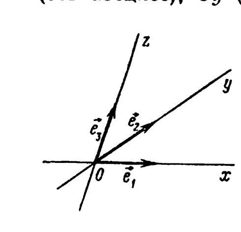
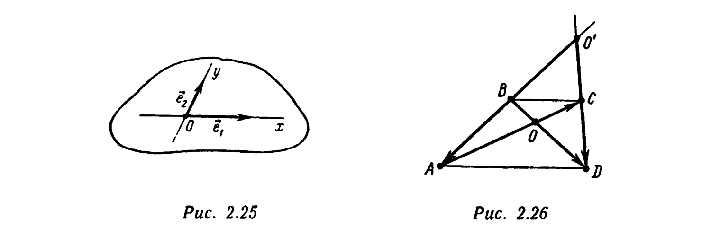
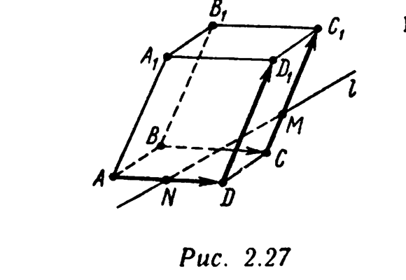
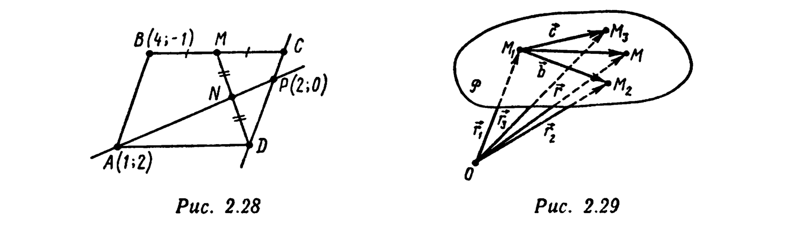
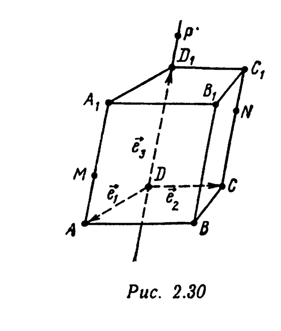

# Глава 2. Векторы. Линейные операции над векторами

## § 6. Система координат. Координаты точки в системе координат. Формулы перехода от одной системы координат к другой

Если в пространстве зафиксированы полюс $O$ и базис $\{\vec e_1, \vec e_2, \vec e_3\}$, то говорят, что в пространстве задана *(декартова) система координат* $\{O, \vec e_1, \vec e_2, \vec e_3\}$. Точка $O$ называется *началом координат*, прямые, проходящие через начало координат и параллельные соответственно векторам $\vec e_1$, $\vec e_2$, $\vec e_3$, называются *осями координат* и обозначаются $Ox$ (ось абсцисс), $Oy$ (ось ординат), $Oz$ (ось аппликат). Плоскость, определяемая координатными осями $Ox$ и $Oy$, называется *координатной плоскостью $Oxy$*. Аналогично определяются координатные плоскости $Oyz$ и $Oxz$ (рис. 2.24). Если $M$ — произвольная точка пространства, то ее *координатами $(x;y;z)$ в системе координат* $\{O, \vec e_1, \vec e_2, \vec e_3\}$ называются коэффициенты разложения радиуса-вектора $\overrightarrow{OM}$ точки $M$ по базису $\{\vec e_1, \vec e_2, \vec e_3\}$: $\overrightarrow{OM} = x\vec e_1+y\vec e_2+z\vec e_3$.

Если ясно, о какой системе координат идет речь, то говорят просто о координатах точки $M$. Тот факт, что точка $M$ имеет координаты $(x;y;z)$, записывают так: $M(x;y;z)$. Поскольку каждый вектор $\overrightarrow{OM}$ может быть разложен по базису $\{\vec e_1, \vec e_2, \vec e_3\}$, в заданной системе координат $\{O, \vec e_1, \vec e_2, \vec e_3\}$ каждая точка $M$ имеет координаты. На основании свойства $1^\circ$ координат вектора точка $M$ полностью определяется своими координатами: точки $M(x;y;z)$ и $M_1(x_1;y_1;z_1)$

---
**стр. 63**

---

совпадают тогда и только тогда, когда выполняются равенства $x=x_1$, $y=y_1$, $z=z_1$. Если точки $A(x_1;y_1;z_1)$ и $B(x_2;y_2;z_2)$ заданы своими координатами в системе координат $\{O, \vec e_1, \vec e_2, \vec e_3\}$, то в базисе $\{\vec e_1, \vec e_2, \vec e_3\}$ имеем $\overrightarrow{OA}=(x_1;y_1;z_1)$, $\overrightarrow{OB}=(x_2;y_2;z_2)$. Согласно свойству линейности координат вектора, $\overrightarrow{AB}=\overrightarrow{OB}-\overrightarrow{OA}=(x_2-x_1;y_2-y_1;z_2-z_1)$, т. е. *координаты вектора $\overrightarrow{AB}$ в базисе $\{\vec e_1, \vec e_2, \vec e_3\}$ находятся как разности соответствующих координат конца $B$ и начала $A$ этого вектора в системе координат* $\{O, \vec e_1, \vec e_2, \vec e_3\}$, *где $O$ — произвольная точка пространства*.

**Пример 1.** В условиях примера 12 § 5 этой главы найдите: а) координаты точки $O$ в системе координат $\{B, \overrightarrow{BA}, \overrightarrow{BC}, \overrightarrow{BD}\}$; б) координаты точки $L$ в системе координат $\{A, \overrightarrow{BO}, \overrightarrow{OD}, \overrightarrow{AC}\}$.

△ а) Так как $\overrightarrow{BO}=(1/3)\overrightarrow{BA}+(1/3)\overrightarrow{BC}+(1/3)\overrightarrow{BD}$, то $O(1/3;1/3;1/3)$.

б) Имеем: $\overrightarrow{AK}=(1/2)\overrightarrow{AC}$, $\overrightarrow{KD}=(3/2)\overrightarrow{OD}$, $\overrightarrow{DL}=-(1/2)\overrightarrow{BD}=-(1/2)(\overrightarrow{BO}+\overrightarrow{OD})$. Следовательно, $\overrightarrow{AL}=\overrightarrow{AK}+\overrightarrow{KD}+\overrightarrow{DL}=(1/2)\overrightarrow{AC}+(3/2)\overrightarrow{OD}-(1/2)\overrightarrow{BO}-(1/2)\overrightarrow{OD}=-(1/2)\overrightarrow{BO}+\overrightarrow{OD}+(1/2)\overrightarrow{AC}$, т. е. $L(-1/2;1;1/2)$. ▲

**Пример 2.** Дана треугольная призма $ABCA_1B_1C_1$. Найдите координаты точки $A_1$ в системе координат $\{B_1, \overrightarrow{AC_1}, \overrightarrow{CB_1}, \overrightarrow{BA_1}\}$.

△ Имеем $\overrightarrow{B_1A_1}=\overrightarrow{B_1B}+\overrightarrow{BA_1}=-\overrightarrow{AA_1}+\overrightarrow{BA_1}$. В примере 11 § 5 этой главы доказано, что $\overrightarrow{AA_1}=(1/3)\overrightarrow{AC_1}+(1/3)\overrightarrow{CB_1}+(1/3)\overrightarrow{BA_1}$. Следовательно, $\overrightarrow{B_1A_1}=-(1/3)\overrightarrow{AC_1}-(1/3)\overrightarrow{CB_1}-(1/3)\overrightarrow{BA_1}+\overrightarrow{BA_1}=-(1/3)\overrightarrow{AC_1}-(1/3)\overrightarrow{CB_1}+(2/3)\overrightarrow{BA_1}$ и, значит, $A_1(-1/3;-1/3;2/3)$. ▲

**Пример 3.** В системе координат $\{O, \vec e_1, \vec e_2, \vec e_3\}$ заданы три вершины параллелограмма $ABCD$: $A(0;1;-1)$, $B(1;0;2)$, $C(2;3;0)$. Найдите координаты точки $D$.

△ Пусть $D(x_D;y_D;z_D)$. Поскольку в базисе $\{\vec e_1, \vec e_2, \vec e_3\}$ $\overrightarrow{BC}=(1;3;-2)$, $\overrightarrow{AD}=(x_D;y_D-1;z_D+1)$, а век-

---
**стр. 64**

---

торы $\overrightarrow{BC}$ и $\overrightarrow{AD}$ противоположных сторон параллелограмма равны, $1=x_D$, $3=y_D-1$, $-2=z_D+1$. Отсюда $x_D=1$, $y_D=4$, $z_D=-3$. ▲

**Пример 4.** В системе координат $\{O, \vec e_1, \vec e_2, \vec e_3\}$ $A(1;0;-2)$, $B(-3;4;2)$, $C(0;1;3)$, $D(2;-1;1)$. Проверьте, что точки $A$, $B$, $C$, $D$ лежат в одной плоскости. Докажите, что векторы $\overrightarrow{AB}$ и $\overrightarrow{CD}$ коллинеарны и противоположно направлены, а векторы $\overrightarrow{BC}$ и $\overrightarrow{AD}$ не коллинеарны.

△ В базисе $\{\vec e_1, \vec e_2, \vec e_3\}$: $\overrightarrow{AB}=(-4;4;4)$, $\overrightarrow{AC}=(-1;1;5)$, $\overrightarrow{AD}=(1;-1;3)$. Точки $A$, $B$, $C$, $D$ лежат в одной плоскости тогда и только тогда, когда векторы $\overrightarrow{AB}$, $\overrightarrow{AC}$, $\overrightarrow{AD}$ компланарны. По условию компланарности достаточно проверить, что определитель $\Delta = \begin{vmatrix}-4 & 4 & 4\\ -1 & 1 & 5\\ 1 & -1 & 3\end{vmatrix}$ [ср. с (2.36)] равен нулю. Имеем
$$\Delta = (-4)\begin{vmatrix}1 & 5\\ -1 & 3\end{vmatrix} - 4\begin{vmatrix}-1 & 5\\ 1 & 3\end{vmatrix} + 4\begin{vmatrix}-1 & 1\\ 1 & -1\end{vmatrix} =$$
$$= (-4)\cdot 8 - 4\cdot(-8) + 4\cdot 0 = 0.$$

Следовательно, точки $A$, $B$, $C$, $D$ лежат в одной плоскости. Далее, $\overrightarrow{CD}=(2;-2;-2)$, $\overrightarrow{AB}=(-4;4;4)$. Согласно свойству линейности координат вектора, $\overrightarrow{AB}=-2\overrightarrow{CD}$, т. е. $\overrightarrow{AB}\|\overrightarrow{CD}$ и $\overrightarrow{AB}\uparrow\downarrow\overrightarrow{CD}$ (третий закон умножения вектора на число). Наконец, $\overrightarrow{BC}=(3;-3;1)$, $\overrightarrow{AD}=(1;-1;3)$. Так как $\begin{vmatrix}3 & -3\\ 1 & -1\end{vmatrix}=0$, $-\begin{vmatrix}3 & 1\\ 1 & 3\end{vmatrix}\neq 0$, $\begin{vmatrix}-3 & 1\\ -1 & 3\end{vmatrix}\neq 0$, то в соответствии с условием коллинеарности векторов (см. пример 19 § 5 этой главы) векторы $\overrightarrow{BC}$ и $\overrightarrow{AD}$ не коллинеарны. ▲

**Пример 5.** В некоторой системе координат $\{O, \vec e_1, \vec e_2, \vec e_3\}$ $A(x_A;y_A;z_A)$, $B(x_B;y_B;z_B)$, $C(x_C;y_C;z_C)$. Найдите координаты точки пересечения медиан треугольника $ABC$.

△ Если $K$ — середина $[BC]$, то $\overrightarrow{AK}=(1/2)(\overrightarrow{AB}+\overrightarrow{AC})=(1/2)((-\overrightarrow{OA}+\overrightarrow{OB})+(-\overrightarrow{OA}+\overrightarrow{OC}))=-\overrightarrow{OA}+(1/2)(\overrightarrow{OB}+\overrightarrow{OC})$. Если $N(x_N;y_N;z_N)$ — точка пересечения медиан $\triangle ABC$, то $\overrightarrow{AN}=(2/3)\overrightarrow{AK}=-(2/3)\overrightarrow{OA}+(1/3)(\overrightarrow{OB}+

---
**стр. 65**

---

$+\overrightarrow{OC})$. Подставляя в это равенство разложения радиусов-векторов $\overrightarrow{ON}$, $\overrightarrow{OA}$, $\overrightarrow{OB}$, $\overrightarrow{OC}$ по базису $\{\vec e_1, \vec e_2, \vec e_3\}$, получаем $x_N\vec e_1+y_N\vec e_2+z_N\vec e_3=(1/3)((x_A\vec e_1+y_A\vec e_2+z_A\vec e_3)+(x_B\vec e_1+y_B\vec e_2+z_B\vec e_3)+(x_C\vec e_1+y_C\vec e_2+z_C\vec e_3))=(1/3)(x_A+x_B+x_C)\vec e_1+(1/3)(y_A+y_B+y_C)\vec e_2+(1/3)(z_A+z_B+z_C)\vec e_3$. В силу единственности разложения по базису отсюда имеем:
$$x_N = (1/3)(x_A+x_B+x_C), \quad y_N = (1/3)(y_A+y_B+y_C),$$
$$z_N = (1/3)(z_A+z_B+z_C), \quad (2.38)$$
т. е. *координаты точки пересечения медиан (центра тяжести) треугольника являются средними арифметическими соответствующих координат его вершин*.

Пусть в пространстве зафиксирована система координат $\{O, \vec e_1, \vec e_2, \vec e_3\}$, которую назовем «старой». Пусть также с помощью этой «старой» системы координат задана еще одна система координат $\{O', \vec e_1', \vec e_2', \vec e_3'\}$, которую назовем «новой», т. е. заданы разложения
$$\vec e_1' = a_{11}\vec e_1+a_{12}\vec e_2+a_{13}\vec e_3, \quad \vec e_2' = a_{21}\vec e_1+a_{22}\vec e_2+a_{23}\vec e_3,$$
$$\vec e_3' = a_{31}\vec e_1+a_{32}\vec e_2+a_{33}\vec e_3 \quad (2.39)$$
векторов «нового» базиса по «старому» базису и заданы координаты $(\alpha;\beta;\gamma)$ точки $O'$ (начала «новой» системы координат) в «старой» системе координат:
$$\overrightarrow{OO'} = \alpha\vec e_1+\beta\vec e_2+\gamma\vec e_3. \quad (2.40)$$

Рассмотрим произвольную точку $M$. Она имеет координаты $(x;y;z)$ в «старой» системе координат и координаты $(x';y';z')$ в «новой» системе координат:
$$\overrightarrow{OM} = x\vec e_1+y\vec e_2+z\vec e_3, \quad \overrightarrow{O'M} = x'\vec e_1'+y'\vec e_2'+z'\vec e_3'. \quad (2.41)$$

Формулы, выражающие «старые» координаты $(x;y;z)$ точки $M$ через «новые» координаты $(x';y';z')$ этой точки, называются *формулами перехода от «старой» системы координат к «новой»*. Выведем эти формулы:

---
**стр. 66**

---

□ Из очевидного равенства $\overrightarrow{OM}=\overrightarrow{OO'}+\overrightarrow{O'M}$ после подстановки в него соотношений (2.39)–(2.41) имеем
$$x\vec e_1+y\vec e_2+z\vec e_3 = \alpha\vec e_1+\beta\vec e_2+\gamma\vec e_3+x'(a_{11}\vec e_1+a_{12}\vec e_2+a_{13}\vec e_3)+y'(a_{21}\vec e_1+a_{22}\vec e_2+a_{23}\vec e_3)+z'(a_{31}\vec e_1+a_{32}\vec e_2+a_{33}\vec e_3) =$$
$$= (a_{11}x'+a_{21}y'+a_{31}z'+\alpha)\vec e_1+(a_{12}x'+a_{22}y'+a_{32}z'+\beta)\vec e_2+(a_{13}x'+a_{23}y'+a_{33}z'+\gamma)\vec e_3.$$

Таким образом, получены два разложения вектора $\overrightarrow{OM}$ по базису $\{\vec e_1, \vec e_2, \vec e_3\}$. В силу единственности разложения вектора по базису в пространстве соответствующие коэффициенты этих разложений должны совпадать:
$$x = a_{11}x'+a_{21}y'+a_{31}z'+\alpha,$$
$$y = a_{12}x'+a_{22}y'+a_{32}z'+\beta, \quad ■ \quad (2.42)$$
$$z = a_{13}x'+a_{23}y'+a_{33}z'+\gamma.$$

Это искомые формулы перехода от «старой» системы координат к «новой». Отметим, что в формулах (2.42) коэффициенты при $x'$ суть координаты вектора $\vec e_1'$ в «старом» базисе [ср. с (2.39)], а коэффициенты при $y'$ (при $z'$) — координаты вектора $\vec e_2'$ (вектора $\vec e_3'$) в «старом» базисе. Последние слагаемые в формулах перехода (2.42) — это «старые» координаты «нового» начала координат $O'$.

Матрица
$$S = \begin{pmatrix}a_{11} & a_{21} & a_{31}\\ a_{12} & a_{22} & a_{32}\\ a_{13} & a_{23} & a_{33}\end{pmatrix},$$

составленная из коэффициентов при $x'$, $y'$, $z'$ в формулах (2.42), называется *матрицей перехода от «старой» системы координат к «новой»* или *матрицей перехода от «старого» базиса к «новому»*.

Приведем свойства матрицы перехода $S$.

$1^\circ$. $\det S \neq 0$.

---
**стр. 67**

---

□ Векторы $\vec e_1'$, $\vec e_2'$, $\vec e_3'$ [см. (2.39)] не компланарны. По условию компланарности (см. пример 20 § 5 этой главы), определитель
$$\Delta = \begin{vmatrix}a_{11} & a_{12} & a_{13}\\ a_{21} & a_{22} & a_{23}\\ a_{31} & a_{32} & a_{33}\end{vmatrix}$$
отличен от нуля. Но этот определитель есть $\det S^T$. Так как $\det S^T = \det S$ (свойство $1^\circ$ определителей), то $\det S = \Delta \neq 0$. ■

$2^\circ$. *Если одноименные векторы «старого» и «нового» базисов совпадают, то $S$ — единичная матрица, $\det S = 1$.* В этом случае переход от «старой» системы координат к «новой» называется *переносом начала координат*. Формулы этого перехода:
$$x = x'+\alpha, \quad y = y'+\beta, \quad z = z'+\gamma.$$

$3^\circ$. *Матрица перехода $S'$ от «нового» базиса к «старому» является обратной матрицей к матрице $S$*:
$$S' = S^{-1}, \quad \det S' = \frac{1}{\det S}.$$

□ Решая по правилу Крамера систему уравнений
$$a_{11}x'+a_{21}y'+a_{31}z' = x-\alpha, \quad a_{12}x'+a_{22}y'+a_{32}z' = y-\beta, \quad a_{13}x'+a_{23}y'+a_{33}z' = z-\gamma$$
относительно $x'$, $y'$, $z'$, получаем [см. формулы (2.23)–(2.25) и теорему 1 § 4 этой главы]:
$$x' = b_{11}(x-\alpha)+b_{21}(y-\beta)+b_{31}(z-\gamma) = b_{11}x+b_{21}y+b_{31}z+\alpha',$$
$$y' = b_{12}(x-\alpha)+b_{22}(y-\beta)+b_{32}(z-\gamma) = b_{12}x+b_{22}y+b_{32}z+\beta', \quad (2.43)$$
$$z' = b_{13}(x-\alpha)+b_{23}(y-\beta)+b_{33}(z-\gamma) = b_{13}x+b_{23}y+b_{33}z+\gamma',$$
где $B = \begin{pmatrix}b_{11} & b_{21} & b_{31}\\ b_{12} & b_{22} & b_{32}\\ b_{13} & b_{23} & b_{33}\end{pmatrix}$ — матрица, обратная к матрице $S$.

---
**стр. 68**

---

Согласно свойству обратной матрицы, $\det B = \dfrac{1}{\det S}$. Так как матрица $B$ составлена (по столбцам) из коэффициентов при $x$, $y$, $z$ соответственно в формулах, выражающих «новые» координаты точки через ее «старые» координаты [см. (2.43)], то $B=S'$ — матрица перехода от «новой» системы координат к «старой», или, что то же, от «нового» базиса к «старому». ■

$4^\circ$. *Пусть фиксированы три системы координат:*
$$\text{(I)}\ \{O, \vec e_1, \vec e_2, \vec e_3\}, \quad \text{(II)}\ \{O', \vec e_1', \vec e_2', \vec e_3'\}, \quad \text{(III)}\ \{O'', \vec e_1'', \vec e_2'', \vec e_3''\}$$
*и пусть*
$$S = \begin{pmatrix}a_{11} & a_{21} & a_{31}\\ a_{12} & a_{22} & a_{32}\\ a_{13} & a_{23} & a_{33}\end{pmatrix}, \quad S_1 = \begin{pmatrix}a_{11}' & a_{21}' & a_{31}'\\ a_{12}' & a_{22}' & a_{32}'\\ a_{13}' & a_{23}' & a_{33}'\end{pmatrix}, \quad S_2 = \begin{pmatrix}a_{11}'' & a_{21}'' & a_{31}''\\ a_{12}'' & a_{22}'' & a_{32}''\\ a_{13}'' & a_{23}'' & a_{33}''\end{pmatrix}$$
*— соответственно матрицы перехода от системы координат (I) к системе координат (II), от системы координат (II) к системе координат (III), от системы координат (I) к системе координат (III). Тогда $S_2=SS_1$, $\det S_2=\det S\det S_1$.*

□ В соответствии с формулами (2.39), (2.42) имеем:
$$\vec e_1'' = a_{11}'\vec e_1'+a_{12}'\vec e_2'+a_{13}'\vec e_3', \qquad \vec e_1' = a_{11}\vec e_1+a_{12}\vec e_2+a_{13}\vec e_3,$$
$$\vec e_2'' = a_{21}'\vec e_1'+a_{22}'\vec e_2'+a_{23}'\vec e_3', \qquad \vec e_2' = a_{21}\vec e_1+a_{22}\vec e_2+a_{23}\vec e_3,$$
$$\vec e_3'' = a_{31}'\vec e_1'+a_{32}'\vec e_2'+a_{33}'\vec e_3', \qquad \vec e_3' = a_{31}\vec e_1+a_{32}\vec e_2+a_{33}\vec e_3.$$

Следовательно, $\vec e_1'' = a_{11}'(a_{11}\vec e_1+a_{12}\vec e_2+a_{13}\vec e_3)+a_{12}'(a_{21}\vec e_1+a_{22}\vec e_2+a_{23}\vec e_3)+a_{13}'(a_{31}\vec e_1+a_{32}\vec e_2+a_{33}\vec e_3) = (a_{11}a_{11}'+a_{21}a_{12}'+a_{31}a_{13}')\vec e_1+(a_{12}a_{11}'+a_{22}a_{12}'+a_{32}a_{13}')\vec e_2+(a_{13}a_{11}'+a_{23}a_{12}'+a_{33}a_{13}')\vec e_3.$

Аналогично получаем $\vec e_2'' = (a_{11}a_{21}'+a_{21}a_{22}'+a_{31}a_{23}')\vec e_1+(a_{12}a_{21}'+a_{22}a_{22}'+a_{32}a_{23}')\vec e_2+(a_{13}a_{21}'+a_{23}a_{22}'+a_{33}a_{23}')\vec e_3,$
$$\vec e_3'' = (a_{11}a_{31}'+a_{21}a_{32}'+a_{31}a_{33}')\vec e_1+(a_{12}a_{31}'+a_{22}a_{32}'+$$

---
**стр. 69**

---

$+a_{32}a_{33}')\vec e_2+(a_{13}a_{31}'+a_{23}a_{32}'+a_{33}a_{33}')\vec e_3.$

Таким образом,
$$S_2 = \begin{pmatrix}
a_{11}a_{11}'+a_{21}a_{12}'+a_{31}a_{13}' & a_{11}a_{21}'+a_{21}a_{22}'+a_{31}a_{23}' & a_{11}a_{31}'+a_{21}a_{32}'+a_{31}a_{33}'\\
a_{12}a_{11}'+a_{22}a_{12}'+a_{32}a_{13}' & a_{12}a_{21}'+a_{22}a_{22}'+a_{32}a_{23}' & a_{12}a_{31}'+a_{22}a_{32}'+a_{32}a_{33}'\\
a_{13}a_{11}'+a_{23}a_{12}'+a_{33}a_{13}' & a_{13}a_{21}'+a_{23}a_{22}'+a_{33}a_{23}' & a_{13}a_{31}'+a_{23}a_{32}'+a_{33}a_{33}'
\end{pmatrix} =$$
$$= \begin{pmatrix}a_{11} & a_{21} & a_{31}\\ a_{12} & a_{22} & a_{32}\\ a_{13} & a_{23} & a_{33}\end{pmatrix}\begin{pmatrix}a_{11}' & a_{21}' & a_{31}'\\ a_{12}' & a_{22}' & a_{32}'\\ a_{13}' & a_{23}' & a_{33}'\end{pmatrix} = SS_1, \quad \det S_2 = \det S \det S_1. \ ■$$

**Пример 6.** В пространстве задана некоторая система координат $\{O, \vec e_1, \vec e_2, \vec e_3\}$. Точки $A(1;0;0)$, $B(0;2;0)$, $C(-1;2;0)$, $D(0;0;2)$ — вершины тетраэдра $ABCD$, точки $K$ и $L$ — соответственно середины ребер $[AC]$ и $[DB]$. Найдите матрицу перехода $S_2$ от системы координат $\{A, \overrightarrow{AB}, \overrightarrow{AC}, \overrightarrow{AD}\}$ к системе координат $\{B, \overrightarrow{AC}, \overrightarrow{KL}, \overrightarrow{DB}\}$. Напишите формулы перехода от первой системы координат ко второй.

△ В примере 12 § 5 этой главы найдено, что $\overrightarrow{AC}=0\cdot\overrightarrow{AB}+1\cdot\overrightarrow{AC}+0\cdot\overrightarrow{AD}$, $\overrightarrow{KL}=(1/2)(\overrightarrow{AD}+\overrightarrow{CB})=(1/2)\overrightarrow{AB}-(1/2)\overrightarrow{AC}+(1/2)\overrightarrow{AD}$, $\overrightarrow{DB}=1\cdot\overrightarrow{AB}+0\times\overrightarrow{AC}-1\cdot\overrightarrow{AD}$, $\overrightarrow{AB}=1\cdot\overrightarrow{AB}+0\cdot\overrightarrow{AC}+0\cdot\overrightarrow{AD}$. Следовательно,
$$x = 0\cdot x'+(1/2)y'+z'+1, \quad y = x'-(1/2)y'+0\cdot z'+0, \quad z = 0\cdot x'+(1/2)y'-z'+0$$
— формулы перехода от системы координат $\{A, \overrightarrow{AB}, \overrightarrow{AC}, \overrightarrow{AD}\}$ к системе координат $\{B, \overrightarrow{AC}, \overrightarrow{KL}, \overrightarrow{DB}\}$, $S_2 = \begin{pmatrix}0 & 1/2 & 1\\ 1 & -1/2 & 0\\ 0 & 1/2 & -1\end{pmatrix}$ — матрица перехода.

Используя свойство $4^\circ$ матрицы перехода, матрицу $S_2$ можно найти и другим способом. Именно: по определению координат точки, $\overrightarrow{OA}=\vec e_1$, $\overrightarrow{OB}=2\vec e_2$, $\overrightarrow{OC}=-\vec e_1+2\vec e_2$, $\overrightarrow{OD}=2\vec e_3$; $\overrightarrow{AB}=-\vec e_1+2\vec e_2$, $\overrightarrow{AC}=-2\vec e_1+2\vec e_2$, $\overrightarrow{AD}=-\vec e_1+2\vec e_3$, отсюда $\vec e_1=\overrightarrow{AB}-\overrightarrow{AC}$, $\vec e_2=\overrightarrow{AB}-\overrightarrow{AC}/2$,

---
**стр. 70**

---

$\vec e_3=\overrightarrow{AB}/2-\overrightarrow{AC}/2+\overrightarrow{AD}/2$. Следовательно, матрица перехода от базиса $\{\overrightarrow{AB}, \overrightarrow{AC}, \overrightarrow{AD}\}$ к базису $\{\vec e_1, \vec e_2, \vec e_3\}$ равна
$$S = \begin{pmatrix}1 & 1 & 1/2\\ -1 & -1/2 & -1/2\\ 0 & 0 & 1/2\end{pmatrix}.$$

Так как $\overrightarrow{OK}=\dfrac12(\overrightarrow{OA}+\overrightarrow{OC})=\vec e_2$, $\overrightarrow{OL}=\dfrac12(\overrightarrow{OB}+\overrightarrow{OD})=\vec e_2+\vec e_3$, $\overrightarrow{KL}=\overrightarrow{OL}-\overrightarrow{OK}$, то $\overrightarrow{AC}=-2\vec e_1+2\vec e_2$, $\overrightarrow{KL}=\vec e_3$, $\overrightarrow{DB}=\overrightarrow{OB}-\overrightarrow{OD}=2\vec e_2-2\vec e_3$. Таким образом, матрица перехода $S_1$ от базиса $\{\vec e_1, \vec e_2, \vec e_3\}$ к базису $\{\overrightarrow{AC}, \overrightarrow{KL}, \overrightarrow{DB}\}$ есть
$$S_1 = \begin{pmatrix}-2 & 0 & 0\\ 2 & 0 & 2\\ 0 & 1 & -2\end{pmatrix}.$$

Согласно свойству $4^\circ$,
$$S_2 = S\cdot S_1 = \begin{pmatrix}1 & 1 & 1/2\\ -1 & -1/2 & -1/2\\ 0 & 0 & 1/2\end{pmatrix}\begin{pmatrix}-2 & 0 & 0\\ 2 & 0 & 2\\ 0 & 1 & -2\end{pmatrix} =$$
$$= \begin{pmatrix}
1\cdot(-2)+1\cdot 2+\frac12\cdot 0 & 1\cdot 0+1\cdot 0+\frac12\cdot 1 & 1\cdot 0+1\cdot 2+\frac12\cdot(-2)\\[4pt]
(-1)(-2)+\left(-\frac12\right)2+\left(-\frac12\right)0 & (-1)\cdot 0+\left(-\frac12\right)\cdot 0+\left(-\frac12\right)\cdot 1 & (-1)\cdot 0+\left(-\frac12\right)2+\left(-\frac12\right)(-2)\\[4pt]
0\cdot(-2)+0\cdot 2+\frac12\cdot 0 & 0\cdot 0+0\cdot 0+\frac12\cdot 1 & 0\cdot 0+0\cdot 2+\frac12\cdot(-2)
\end{pmatrix} =$$

---
**стр. 71**

---

$$= \begin{pmatrix}0 & 1/2 & 1\\ 1 & -1/2 & 0\\ 0 & 1/2 & -1\end{pmatrix}. \ ▲$$

*Системой координат* $\{O, \vec e_1, \vec e_2\}$ *на плоскости $P$* называется совокупность полюса $O$ (фиксированной точки $O$ плоскости $P$) и базиса $\{\vec e_1, \vec e_2\}$ в плоскости $P$ (рис. 2.25). *Координатами $(x;y)$ точки $M\in P$ в системе координат* $\{O, \vec e_1, \vec e_2\}$ называются коэффициенты разложения радиуса-вектора $\overrightarrow{OM}$ точки $M$ по базису $\{\vec e_1, \vec e_2\}$: $\overrightarrow{OM}=x\vec e_1+y\vec e_2$. Тот факт, что $(x;y)$ — координаты точки $M$, записывается в виде $M(x;y)$. Если на плоскости $P$ заданы две системы координат: «старая» $\{O, \vec e_1, \vec e_2\}$ и «новая» $\{O', \vec e_1', \vec e_2'\}$, причем «новая» система координат задана с помощью «старой» соотношениями
$$\vec e_1' = a_{11}\vec e_1+a_{12}\vec e_2, \quad \vec e_2' = a_{21}\vec e_1+a_{22}\vec e_2, \quad \overrightarrow{OO'} = \alpha\vec e_1+\beta\vec e_2, \quad (2.44)$$

то для произвольной точки $M\in P$ связь между ее координатами $(x;y)$ в «старой» системе координат и ее координатами $(x';y')$ в «новой» системе координат определяется *формулами перехода*:
$$x = a_{11}x'+a_{21}y'+\alpha, \quad y = a_{12}x'+a_{22}y'+\beta. \quad (2.45)$$

Матрица $S = \begin{pmatrix}a_{11} & a_{21}\\ a_{12} & a_{22}\end{pmatrix}$, составленная (по столбцам) из коэффициентов при $x'$ и $y'$ в соотношениях (2.45), называется *матрицей перехода от «старой» системы координат («старого» базиса) на плоскости к «новой» системе координат («новому» базису)*. Столбцы матрицы $S$ составлены из координат векторов $\vec e_1'$ и $\vec e_2'$ в «старом» базисе $\{\vec e_1, \vec e_2\}$ [ср. с (2.44)]. Для матрицы $S$ перехода от «старой» системы координат на

---
**стр. 72**

---

плоскости к «новой» выполняются свойства $1^\circ$–$4^\circ$, в которых вместо матриц третьего порядка стоят соответствующие матрицы второго порядка.

**Пример 7.** В трапеции $ABCD$ ($(AD)\|(BC)$) отношение длин оснований $|AD|:|BC|$ равно 2, $O$ — точка пересечения диагоналей $[AC]$ и $[BD]$, $O'$ — точка пересечения продолжений боковых сторон $[AB]$ и $[CD]$. Запишите формулы перехода от системы координат $\{O, \overrightarrow{BA}, \overrightarrow{CD}\}$ к системе координат $\{O', \overrightarrow{OC}, \overrightarrow{OD}\}$.

△ $[BC]$ — средняя линия треугольника $O'AD$ (рис. 2.26), $[AC]$ и $[DB]$ — его медианы. Поэтому $\overrightarrow{O'A}=2\overrightarrow{BA}$, $\overrightarrow{O'D}=2\overrightarrow{CD}$, $\overrightarrow{OC}=(1/3)\overrightarrow{AC}=(1/3)((1/2)(\overrightarrow{AO'}+\overrightarrow{AD}))=(1/6)(\overrightarrow{AO'}+(\overrightarrow{AO'}+\overrightarrow{O'D}))=(1/3)\overrightarrow{AO'}+(1/6)\overrightarrow{O'D}=-(2/3)\overrightarrow{BA}+(1/3)\overrightarrow{CD}$, $\overrightarrow{OD}=\overrightarrow{OC}+\overrightarrow{CD}=-(2/3)\overrightarrow{BA}+(4/3)\overrightarrow{CD}$, $\overrightarrow{OO'}=\overrightarrow{OC}+\overrightarrow{CO'}=\overrightarrow{OC}-\overrightarrow{CD}=-(2/3)\overrightarrow{BA}-(2/3)\overrightarrow{CD}$. Следовательно, формулы перехода от системы координат $\{O, \overrightarrow{BA}, \overrightarrow{CD}\}$ к системе координат $\{O', \overrightarrow{OC}, \overrightarrow{OD}\}$ имеют вид
$$x = -(2/3)x'-(2/3)y'-2/3,$$
$$y = (1/3)x'+(4/3)y'-2/3. \ ▲$$

**Пример 8.** На плоскости задана некоторая система координат $\{O, \vec e_1, \vec e_2\}$. Точки $A(1;1)$, $B(0;-3)$, $C(2;2)$ — вершины треугольника $ABC$. Найдите координаты точки $N$ пересечения медиан $\triangle ABC$. Запишите формулы перехода

---
**стр. 73**

---

от системы координат $\{N, \overrightarrow{NO}, \overrightarrow{AC}\}$ к системе координат $\{O, \overrightarrow{AB}, \overrightarrow{BC}\}$.

△ Координаты $(x_N;y_N)$ точки $N$ находим по формуле (2.38): $x_N=(1/3)(1+0+2)=1$, $y_N=(1/3)(1-3+2)=0$, — считая, что плоскость треугольника $ABC$ совпадает с координатной плоскостью $Oxy$ некоторой пространственной системы координат, т. е. что $z_A=z_B=z_C=z_N=0$.

Найдем формулы перехода от системы координат $\{N, \overrightarrow{NO}, \overrightarrow{AC}\}$ на плоскости $(ABC)$ к системе координат $\{O, \overrightarrow{AB}, \overrightarrow{BC}\}$. Пусть точка $M$ имеет координаты $(x^*;y^*)$ в системе координат $\{N, \overrightarrow{NO}, \overrightarrow{AC}\}$ и координаты $(x';y')$ в системе координат $\{O, \overrightarrow{AB}, \overrightarrow{BC}\}$, т. е. $\overrightarrow{NM}=x^*\overrightarrow{NO}+y^*\overrightarrow{AC}$, $\overrightarrow{OM}=x'\overrightarrow{AB}+y'\overrightarrow{BC}$. Воспользовавшись соотношением $\overrightarrow{NM}=\overrightarrow{NO}+\overrightarrow{OM}$, применяемым при выводе формул перехода, и разложив все векторы по базису $\{\vec e_1, \vec e_2\}$, получим
$$x^*(-\overrightarrow{ON})+y^*(\overrightarrow{OC}-\overrightarrow{OA}) = -\overrightarrow{ON}+x'(\overrightarrow{OB}-\overrightarrow{OA})+y'(\overrightarrow{OC}-\overrightarrow{OB}), \text{ или}$$
$$x^*(-\vec e_1)+y^*((2\vec e_1+2\vec e_2)-(\vec e_1+\vec e_2))+\vec e_1-$$
$$-x'(-3\vec e_2-(\vec e_1+\vec e_2))-y'((2\vec e_1+2\vec e_2)+3\vec e_2) = \vec 0.$$

Используя линейную независимость векторов $\vec e_1$ и $\vec e_2$, получаем систему уравнений $-x^*+y^*+1+x'-2y'=0$, $y^*+4x'-5y'=0$, решая которую относительно $x^*$ и $y^*$, найдем
$$x^* = -3x'+3y'+1, \quad y^* = -4x'+5y'. \ ▲$$

**Пример 9 (координатные уравнения прямой).** Пусть в пространстве заданы система координат $\{O, \vec e_1, \vec e_2, \vec e_3\}$ и две различные точки $A(x_A;y_A;z_A)$ и $B(x_B;y_B;z_B)$. Напишите систему уравнений, определяющую прямую $(AB)$, т. е. такую систему уравнений, которой удовлетворяют координаты $(x;y;z)$ произвольной точки $M(x;y;z)$ прямой $(AB)$ и только они.

△ Воспользуемся векторным параметрическим уравнением прямой $l=(AB)$ [см. пример 6 § 3 этой главы и формулу (2.5)]. Точка $M(x;y;z)$ лежит на прямой $l$ тогда

---
**стр. 74**

---

и только тогда, когда существует такое число $t$, что $\overrightarrow{OM}=\overrightarrow{OA}+t\vec a$, где $\vec a=\overrightarrow{AB}=(x_B-x_A;y_B-y_A;z_B-z_A)$. Поскольку векторное равенство эквивалентно трем координатным, получаем, что $M\in l$ тогда и только тогда, когда
$$x=x_A+ta_x, \quad y=y_A+ta_y, \quad z=z_A+ta_z \quad (a_x=x_B-x_A, a_y=y_B-y_A, a_z=z_B-z_A) \quad (2.46)$$
при некотором $t\in R$. Точки $A$ и $B$ различны, поэтому хотя бы одна из координат $(a_x;a_y;a_z)$ направляющего вектора $\vec a=\overrightarrow{AB}$ прямой $l$ отлична от нуля. Пусть, например, $a_x\neq 0$. Тогда, выразив $t$ из первого уравнения системы (2.46): $t=(x-x_A)/a_x$ — и подставив найденное значение $t$ во второе и третье уравнения, получим систему двух уравнений относительно $x$, $y$ и $z$, определяющую прямую $l$ в пространстве:
$$y-y_A = \frac{x-x_A}{a_x}a_y, \quad z-z_A = \frac{x-x_A}{a_x}a_z, \text{ или}$$
$$a_x(y-y_A) = a_y(x-x_A), \quad a_x(z-z_A) = a_z(x-x_A). \quad (2.47)$$

Обычно систему (2.47) записывают в симметричной форме
$$\frac{x-x_A}{a_x} = \frac{y-y_A}{a_y} = \frac{z-z_A}{a_z}, \quad (2.48)$$

подразумевая при этом, что если знаменатель одной из дробей равен нулю, то [см. (2.47)] равен нулю и числитель этой дроби. Например, если $a_y=0$, а $a_z\neq 0$, то систему уравнений (2.48) надо понимать так:
$$y=y_A, \quad a_x(z-z_A) = a_z(x-x_A).$$

Если $a_y=y_B-y_A=0$ и $a_z=z_B-z_A=0$, то система уравнений (2.48) принимает вид $y=y_A$, $z=z_A$, т. е. определяет прямую $l=(AB)$, параллельную оси абсцисс и проходящую через точку $A(x_A;y_A;z_A)$. Параметрические уравнения (2.46) этой прямой имеют вид $x=x_A+a_xt$, $y=y_A$, $z=z_A$, $t\in R$ ($a_x\neq 0$).

Так как $a_x=x_B-x_A$, $a_y=y_B-y_A$, $a_z=z_B-z_A$, то система уравнений (2.48), определяющих прямую $l=(AB)$, которая проходит через две заданные точки $A(x_A;y_A;z_A)$ и $B(x_B;y_B;z_B)$, может быть записана также в виде
$$\frac{x-x_A}{x_B-x_A} = \frac{y-y_A}{y_B-y_A} = \frac{z-z_A}{z_B-z_A}. \quad (2.49)$$

---
**стр. 75**

---

Уравнения системы (2.48), (2.49) называются *каноническими уравнениями прямой $l$ в пространстве*. ▲

**Пример 10.** В некоторой системе координат прямая $l$ задана уравнениями $\dfrac{x-1}{-2}=\dfrac{y+3}{1}=\dfrac{z-5}{0}$. Укажите координаты каких-либо двух точек этой прямой.

△ Перепишем уравнения прямой $l$ в параметрическом виде [ср. с (2.48) и (2.46)]:
$$x=1-2t, \quad y=-3+t, \quad z=5+0\cdot t.$$

При $t=0$ получаем координаты одной точки прямой $l$: $A(1;-3;5)$, при $t=1$ — второй точки: $B(-1;-2;5)$. Координаты точек $A$ и $B$ можно найти и так: координаты точки $A(x_A;y_A;z_A)$ отнимаются от переменных $x$, $y$, $z$ в канонических уравнениях (2.48), поэтому по заданным уравнениям прямой $l$ находим $x_A=1$, $y_A=-3$, $z_A=5$; координаты точки $B(x_B;y_B;z_B)$ находим из условия равенства направляющего вектора $\vec a=(a_x;a_y;a_z)$, $a_x=-2$, $a_y=1$, $a_z=0$ прямой $l=(AB)$ вектору $\overrightarrow{AB}$ [ср. с (2.48) и (2.49)]: $x_B-x_A=-2$, $y_B-y_A=1$, $z_B-z_A=0$, т. е. $x_B=x_A-2=-1$, $y_B=-2$, $z_B=5$. ▲

**Пример 11.** В некоторой системе координат прямые $l_1$ и $l_2$ заданы каноническими уравнениями
$$l_1: \frac{x-1}{2}=\frac{y-2}{1}=\frac{z-3}{1}, \quad l_2: \frac{x}{1}=\frac{y-3}{1}=\frac{z}{2}.$$

Выясните, пересекаются ли эти прямые.

△ Прямые $l_1$ и $l_2$ пересекаются тогда и только тогда, когда существует точка $M$, координаты $(x^*;y^*;z^*)$ которой удовлетворяют как уравнениям прямой $l_1$, так и уравнениям прямой $l_2$, т. е. системе следующих четырех уравнений:
$$x^*-1=2(y^*-2), \quad z^*-3=y^*-2, \quad x^*=y^*-3,$$
$$z^*=2(y^*-3). \quad (2.50)$$

Если эта система имеет решение, то оно находится из первых трех уравнений и автоматически должно удовлетворить четвертому уравнению. Из первых трех уравнений находим: $x^*=-3$, $y^*=0$, $z^*=1$. Подставляя найденные значения в четвертое уравнение, получаем $1=2\cdot(0-3)$. Имеет место противоречие. Система уравнений (2.50) решений не имеет, т. е. $l_1$ и $l_2$ не пересекаются. ▲

**Пример 12 (задача о делении отрезка в заданном отношении).** Пусть в простран-

---
**стр. 76**

---

стве заданы система координат $\{O, \vec e_1, \vec e_2, \vec e_3\}$ и две различные точки $A(x_A;y_A;z_A)$ и $B(x_B;y_B;z_B)$. Точка $M$ лежит на отрезке $[AB]$ и делит его в отношении $\lambda=|AM|:|MB|$. Определите координаты точки $M$.

△ По формуле (2.6) имеем $\overrightarrow{OM}=\dfrac{1}{\lambda+1}(\overrightarrow{OA}+\lambda\overrightarrow{OB})$. Подставляя в это равенство разложения векторов по базису $\{\vec e_1, \vec e_2, \vec e_3\}$, получаем на основании свойства линейности координат и свойства $1^\circ$ координат векторов:
$$x_M = \frac{x_A+\lambda x_B}{\lambda+1}, \quad y_M = \frac{y_A+\lambda y_B}{\lambda+1}, \quad z_M = \frac{z_A+\lambda z_B}{\lambda+1}. \ ▲ \quad (2.51)$$

**Пример 13.** В параллелепипеде $ABCDA_1B_1C_1D_1$ имеем: $A(1;1;1)$, $B(2;-1;0)$, $C(1;1;2)$, $D_1(3;3;2)$, точка $N$ — середина $[AD]$, точка $M$ делит отрезок $[CC_1]$ в отношении $|C_1M|:|MC|=2$. Напишите канонические уравнения прямой $l=(MN)$ в той системе координат, в которой заданы координаты точек $A$, $B$, $C$, $D_1$.

△ Пусть $(x_D;y_D;z_D)$ — координаты точки $D$ (рис. 2.27). Вектор $\overrightarrow{AD}$ имеет координаты $(x_D-1;y_D-1;z_D-1)$. Координаты вектора $\overrightarrow{BC}$ таковы: $(1-2;1-(-1);2-0)=(-1;2;2)$. Векторы $\overrightarrow{AD}$ и $\overrightarrow{BC}$ равны, поэтому равны и их одноименные координаты: $x_D-1=-1$, $y_D-1=2$, $z_D-1=2$, т. е. $x_D=0$, $y_D=3$, $z_D=3$. Точка $N$ — середина отрезка $[AD]$ (делит его в отношении $1:1$). Следовательно, $x_N=(x_A+x_D)/2=1/2$, $y_N=(y_A+y_D)/2=2$, $z_N=2$. Пусть $(\alpha;\beta;\gamma)$ — координаты точки $C_1$. Из равенства векторов $\overrightarrow{CC_1}$ и $\overrightarrow{DD_1}$ получаем: $\alpha-1=3-0$, $\beta-1=3-3$, $\gamma-2=2-3$, т. е. $\alpha=4$, $\beta=1$, $\gamma=1$. По формулам (2.51) деления отрезка в заданном отношении имеем: $x_M=(\alpha+2x_C)/3=(4+2\cdot 1)/3=2$, $y_M=(\beta+2y_C)/3=(1+2\cdot 1)/3=1$, $z_M=(\gamma+2z_C)/3=5/3$. Следовательно, канонические уравнения прямой $(MN)$ имеют вид
$$\frac{x-1/2}{2-1/2} = \frac{y-2}{1-2} = \frac{z-2}{5/3-2}, \quad \text{или} \quad \frac{x-1/2}{3/2} = \frac{y-2}{-1} = \frac{z-2}{-1/3}. \ ▲$$

---
**стр. 77**

---

Если $l: \dfrac{x-\alpha}{a_x}=\dfrac{y-\beta}{a_y}=\dfrac{z-\gamma}{a_z}$ и $L: \dfrac{x-\lambda}{b_x}=\dfrac{y-\mu}{b_y}=\dfrac{z-\nu}{b_z}$ — две прямые, заданные каноническими уравнениями в некоторой системе координат в пространстве, то $\vec a=(a_x;a_y;a_z)$ и $\vec b=(b_x;b_y;b_z)$ — направляющие векторы этих прямых. Прямые $l$ и $L$ параллельны тогда и только тогда, когда коллинеарны их направляющие векторы $\vec a$ и $\vec b$. По условию коллинеарности это имеет место тогда и только тогда, когда
$$\begin{vmatrix}a_x & a_y\\ b_x & b_y\end{vmatrix} = \begin{vmatrix}a_x & a_z\\ b_x & b_z\end{vmatrix} = \begin{vmatrix}a_y & a_z\\ b_y & b_z\end{vmatrix} = 0.$$

Пусть $P$ — некоторая плоскость, $\{O, \vec e_1, \vec e_2\}$ — система координат на плоскости $P$, $A(x_A;y_A)\in P$ и $B(x_B;y_B)\in P$ — две различные точки. Параметрические уравнения прямой $l=(AB)$ имеют вид
$$x = x_A+ta_x,$$
$$y = y_A+ta_y \quad (a_x=x_B-x_A, a_y=y_B-y_A), \quad t\in R. \quad (2.52)$$

*Каноническое уравнение прямой $l=(AB)$ на плоскости $P$*:
$$\frac{x-x_A}{x_B-x_A} = \frac{y-y_A}{y_B-y_A}, \quad \text{или} \quad (2.53)$$
$$\frac{x-x_A}{a_x} = \frac{y-y_A}{a_y}. \quad (2.54)$$

Уравнение (2.54) равносильно уравнению
$$A^*x+B^*y+C^* = 0, \quad (A^*)^2+(B^*)^2 > 0, \quad (2.55)$$
где
$$A^* = y_B-y_A, \quad B^* = x_A-x_B, \quad C^* = y_Ax_B-x_Ay_B. \quad (2.56)$$

Согласно уравнению (2.55), направляющий вектор $\vec a=(a_x;a_y)$ прямой $l$ на плоскости $P$ находится по правилу $a_x=-B^*$, $a_y=A^*$.

---
**стр. 78**

---

Формулы деления отрезка в заданном отношении в плоском случае имеют вид
$$M\in[AB], \quad \lambda=|AM|:|MB| \Leftrightarrow x_M = \frac{x_A+\lambda x_B}{\lambda+1}, \quad y_M = \frac{y_A+\lambda y_B}{\lambda+1}. \quad (2.57)$$

**Пример 14.** Найдите две точки $A$ и $B$, если известно, что точка $C(-5;4)$ делит отрезок $[AB]$ в отношении $3:4$, а точка $D(6;-5)$ — в отношении $2:3$.

△ Пусть $A(x_A;y_A)$, $B(x_B;y_B)$. Тогда по формулам (2.57) имеем:
$$-5 = \frac{x_A+(3/4)x_B}{3/4+1}, \quad 4 = \frac{y_A+(3/4)y_B}{3/4+1}, \quad 6 = \frac{x_A+(2/3)x_B}{2/3+1}, \quad -5 = \frac{y_A+(2/3)y_B}{2/3+1}.$$

Решая полученную систему уравнений относительно $x_A$, $x_B$, $y_A$, $y_B$, найдем: $x_A=160$, $x_B=-225$, $y_A=-131$, $y_B=184$; $A(160;-131)$, $B(-225;184)$. ▲

**Пример 15.** Напишите уравнение медианы $(AM)$ треугольника $ABC$: $A(-5;4)$, $B(3;1)$, $C(2;-5)$.

△ Середина $M$ отрезка $[BC]$ имеет координаты $x_M=(x_B+x_C)/2=5/2$, $y_M=(y_B+y_C)/2=-2$. По формуле (2.53) уравнение $(AM)$ имеет вид
$$\frac{x-(-5)}{5/2-(-5)} = \frac{y-4}{-2-4} \Leftrightarrow \frac{x+5}{15/2} = \frac{y-4}{-6} \Leftrightarrow 4x+5y=0. \ ▲$$

**Пример 16.** Напишите уравнение прямой $l$, проходящей через точку $M(7;4)$ и параллельной прямой $L$, уравнение которой $3x-2y+4=0$.

△ Направляющий вектор $\vec a=(a_x;a_y)$ прямой $L$ есть $\vec a=(2;3)$. Так как $l\|L$, то $\vec a$ является и направляющим вектором $l$. По формуле (2.54) уравнение $l$ таково:
$$\frac{x-7}{2} = \frac{y-4}{3} \Leftrightarrow 3x-2y-13=0. \ ▲$$

**Пример 17.** Найдите координаты вершин $A(x_A;y_A)$, $B(x_B;y_B)$, $D(x_D;y_D)$ параллелограмма $ABCD$, если $C(3;-1)$, $(AB): x+y-3=0$, $(AD): y=2$.

△ Точка $A$ является общей точкой прямых $(AB)$ и $(AD)$. Поэтому ее координаты $(x_A;y_A)$ удовлетворяют системе уравнений $x_A+y_A-3=0$, $y_A=2$, решая кото-

---
**стр. 79**

---

рую, находим $x_A=1$, $y_A=2$. Направляющий вектор $\vec a$ прямой $(AB)$ равен $\vec a=(-1;1)$. Он является и направляющим вектором $(CD)$. Следовательно, уравнение $(CD)$ имеет вид
$$\frac{x-3}{-1} = \frac{y+1}{1} \Leftrightarrow x+y-2=0.$$

Можно аналогично найти, что $y=-1$ — уравнение прямой $(BC)$.

Координаты точек $B(x_B;y_B)$ и $D(x_D;y_D)$ удовлетворяют системам уравнений
$$\begin{cases}x_B+y_B-3=0,\\ y_B=-1,\end{cases} \qquad \begin{cases}y_D=2,\\ x_D+y_D-2=0.\end{cases}$$

Решая эти системы, находим: $x_B=4$, $y_B=-1$, $x_D=0$, $y_D=2$. ▲

**Пример 18.** В параллелограмме $ABCD$ (рис. 2.28) точка $M$ — середина стороны $[BC]$, точка $N$ — середина отрезка $[MD]$, $P$ — точка пересечения прямых $(AN)$ и $(CD)$. Найдите координаты точек $C$ и $D$, если $A(1;2)$, $B(4;-1)$, $P(2;0)$. Найдите также отношение, в котором точка $P$ делит отрезок $[CD]$.

△ Пусть $D(\alpha;\beta)$. Из равенства $\overrightarrow{AB}=\overrightarrow{DC}$ следует, что координаты точки $C(x_C;y_C)$ соответственно равны $x_C=\alpha+(x_B-x_A)=\alpha+3$, $y_C=\beta+(y_B-y_A)=\beta-3$. Точка $M(x_M;y_M)$ — середина $[BC]$, поэтому $x_M=(x_B+x_C)/2=(\alpha+7)/2$, $y_M=(y_B+y_C)/2=(\beta-4)/2$. Точка $N(x_N;y_N)$ — середина $[MD]$, поэтому $x_N=(x_M+x_D)/2=(3\alpha+7)/4$, $y_N=(y_M+y_D)/2=(3\beta-4)/4$. Уравнение прямой $(AP)$ имеет вид
$$\frac{x-1}{2-1} = \frac{y-2}{0-2} \Leftrightarrow 2x+y-4=0.$$

Точка $N\in(AP)$. Значит, координаты точки $N$ удовлетворяют уравнению $2\dfrac{3\alpha+7}{4}+\dfrac{3\beta-4}{4}-4=0$, или $2\alpha+\beta-2=0$. По условию, точка $P(2;0)$ лежит на прямой $(DC)$, уравнение которой $\dfrac{x-\alpha}{(\alpha+3)-\alpha}=\dfrac{y-\beta}{(\beta-3)-\beta}$. Следовательно, $\dfrac{2-\alpha}{3}=\dfrac{0-\beta}{-3}$, или $\alpha+\beta-2=0$. Решая систему уравнений $2\alpha+\beta-2=0$, $\alpha+\beta-2=0$, найдем $\alpha=0$, $\beta=2$. Окончательно имеем $D(0;2)$,

---
**стр. 80**

---

$C(3;-1)$. Отношение $\lambda=|CP|:|PD|$, в котором точка $P$ делит отрезок $[CD]$, определяется из соотношения
$$x_P = \frac{x_C+\lambda x_D}{\lambda+1} \Leftrightarrow 2(\lambda+1) = 3+\lambda\cdot 0, \text{ т. е.}$$
$$\lambda = 1/2. \ ▲$$

**Пример 19 (векторное параметрическое уравнение плоскости).** Пусть в пространстве зафиксирован полюс $O$ и заданы три точки $M_1$, $M_2$, $M_3$, не лежащие на одной прямой. Опишите множество радиусов-векторов всех точек плоскости $P=(M_1M_2M_3)$.

△ Пусть $\vec r_1=\overrightarrow{OM_1}$, $\vec r_2=\overrightarrow{OM_2}$, $\vec r_3=\overrightarrow{OM_3}$ — радиусы-векторы соответственно точек $M_1$, $M_2$, $M_3$ (рис. 2.29), $\vec b=\vec r_2-\vec r_1$, $\vec c=\vec r_3-\vec r_1$. Векторы $\vec b$ и $\vec c$ образуют базис в плоскости $P$. Через $\vec r$ обозначим радиус-вектор произвольной точки $M\in P$. Точка $M$ лежит в плоскости $P$ тогда и только тогда, когда вектор $\overrightarrow{M_1M}=\vec r-\vec r_1$ раскладывается по векторам $\vec b$ и $\vec c$ [см. формулу (2.28) и признак компланарности векторов (см. пример 2 § 5 этой главы)], т. е. существуют такие числа $t$ и $\tau$ (зависящие от $M$), что $\overrightarrow{M_1M}=t\vec b+\tau\vec c$, или
$$\vec r-\vec r_1 = t(\vec r_2-\vec r_1)+\tau(\vec r_3-\vec r_1). \quad (2.58)$$
Соотношение
$$\vec r = \vec r_1+t\vec b+\tau\vec c, \quad t\in R, \quad \tau\in R \quad (2.59)$$
называется *векторным параметрическим уравнением плоскости $P$, проходящей через точку $M_1(\vec r_1)$ и параллельной векторам $\vec b$ и $\vec c$*. Правая часть соотношения (2.59) при про-

---
**стр. 81**

---

извольных действительных $t$ и $\tau$ определяет совокупность радиусов-векторов всех точек плоскости $P$ и только их. ▲

Соотношение (2.59) можно переписать в виде
$$\vec r = \theta\vec r_1+t\vec r_2+\tau\vec r_3, \quad \theta+t+\tau = 1. \quad (2.60)$$

Если точки $M_1(x_1;y_1;z_1)$, $M_2(x_2;y_2;z_2)$, $M_3(x_3;y_3;z_3)$ заданы своими координатами в системе координат $\{O, \vec e_1, \vec e_2, \vec e_3\}$, началом которой является полюс $O$, то векторное параметрическое уравнение плоскости $P=(M_1M_2M_3)$ эквивалентно системе
$$\begin{cases}x = x_1+t(x_2-x_1)+\tau(x_3-x_1),\\ y = y_1+t(y_2-y_1)+\tau(y_3-y_1),\\ z = z_1+t(z_2-z_1)+\tau(z_3-z_1)\end{cases} \quad (2.61)$$
трех скалярных уравнений относительно координат $(x;y;z)$ точки $M\in P$ и чисел $t$ и $\tau$, зависящих от $M$. Уравнения системы (2.61) — параметрические уравнения плоскости $P$.

**Пример 20 (координатное уравнение плоскости).** Пусть в пространстве задана система координат $\{O, \vec e_1, \vec e_2, \vec e_3\}$. Докажите, что уравнение любой плоскости $P$, проходящей через точку $M_1(x_1;y_1;z_1)$, имеет вид
$$A(x-x_1)+B(y-y_1)+C(z-z_1) = 0, \quad A^2+B^2+C^2 > 0. \quad (2.62)$$

△ Зафиксируем на плоскости $P$ еще две точки $M_2(x_2;y_2;z_2)$ и $M_3(x_3;y_3;z_3)$ так, чтобы $M_1$, $M_2$ и $M_3$ не лежали на одной прямой. Положим $\overrightarrow{M_1M_2}=\vec b=(b_x;b_y;b_z)$, $b_x=x_2-x_1$, $b_y=y_2-y_1$, $b_z=z_2-z_1$; $\overrightarrow{M_1M_3}=\vec c=(c_x;c_y;c_z)$, $c_x=x_3-x_1$, $c_y=y_3-y_1$, $c_z=z_3-z_1$. Точка $M(x;y;z)$ лежит в плоскости $P$ тогда и только тогда, когда векторы $\overrightarrow{M_1M}$, $\vec b$, $\vec c$ компланарны. По условию компланарности, это имеет место тогда и только тогда, когда координаты точки $M$ удовлетворяют уравнению
$$\begin{vmatrix}x-x_1 & y-y_1 & z-z_1\\ b_x & b_y & b_z\\ c_x & c_y & c_z\end{vmatrix} = 0, \quad (2.63)$$
или $A(x-x_1)+B(y-y_1)+C(z-z_1)=0$, где
$$A = \begin{vmatrix}b_y & b_z\\ c_y & c_z\end{vmatrix}, \quad B = -\begin{vmatrix}b_x & b_z\\ c_x & c_z\end{vmatrix}, \quad C = \begin{vmatrix}b_x & b_y\\ c_x & c_y\end{vmatrix}.$$

---
**стр. 82**

---

Неравенство $A^2+B^2+C^2>0$ следует (см. пример 19 § 5 этой главы) из неколлинеарности векторов $\vec b$ и $\vec c$. ▲

Уравнение (2.63) называется *координатным уравнением плоскости, проходящей через точку $M_1(x_1;y_1;z_1)$ и параллельной векторам* $\vec b=(b_x;b_y;b_z)$ и $\vec c=(c_x;c_y;c_z)$. Его можно записать также в виде
$$\begin{vmatrix}x-x_1 & y-y_1 & z-z_1\\ x_2-x_1 & y_2-y_1 & z_2-z_1\\ x_3-x_1 & y_3-y_1 & z_3-z_1\end{vmatrix} = 0. \quad (2.64)$$

Уравнение (2.64) называется уравнением плоскости $P=(M_1M_2M_3)$, проходящей через три данные точки. Уравнение (2.62) можно записать также в виде
$$Ax+By+Cz+D=0, \quad A^2+B^2+C^2>0, \quad (2.65)$$
где $D=-Ax_1-By_1-Cz_1$.

**Пример 21.** Напишите уравнение плоскости, проходящей через точки $M_1(2;3;1)$, $M_2(3;1;4)$, $M_3(2;1;5)$.

△ По формуле (2.64) уравнение искомой плоскости имеет вид
$$\begin{vmatrix}x-2 & y-3 & z-1\\ 3-2 & 1-3 & 4-1\\ 2-2 & 1-3 & 5-1\end{vmatrix} = 0 \Leftrightarrow \begin{vmatrix}x-2 & y-3 & z-1\\ 1 & -2 & 3\\ 0 & -2 & 4\end{vmatrix} =$$
$$= 0 \Leftrightarrow x+2y+z-9=0. \ ▲$$

**Пример 22.** Напишите уравнение плоскости, проходящей через точку $M_1(3;7;2)$ и параллельной прямым $l: \dfrac{x-1}{4}=\dfrac{y+2}{1}=\dfrac{z-4}{2}$ и $L: \dfrac{x-3}{5}=\dfrac{y-2}{3}=\dfrac{z+1}{1}$.

△ Плоскость, параллельная прямым $l$ и $L$, параллельна направляющим векторам $\vec b=(4;1;2)$ и $\vec c=(5;3;1)$ этих прямых. По формуле (2.63) уравнение искомой плоскости таково
$$\begin{vmatrix}x-3 & y-7 & z-2\\ 4 & 1 & 2\\ 5 & 3 & 1\end{vmatrix} = 0 \Leftrightarrow 5x-6y-7z+41=0. \ ▲$$

**Пример 23.** Напишите уравнение плоскости $P$, проходящей через точку $M_1(1;0;-1)$ и содержащей прямую $l: \dfrac{x}{2}=\dfrac{y+1}{3}=\dfrac{z-2}{1}$.

---
**стр. 83**

---

△ Точка $M_2(0;-1;2)$ прямой $l$ лежит в плоскости $P$. Следовательно, плоскость $P$ параллельна вектору $\vec b=\overrightarrow{M_1M_2}$ и вектору $\vec c=(2;3;1)$ — направляющему вектору прямой $l$. По формуле (2.63) уравнение $P$ имеет вид
$$\begin{vmatrix}x-1 & y-0 & z-(-1)\\ 0-1 & -1-0 & 2-(-1)\\ 2 & 3 & 1\end{vmatrix} = 0 \Leftrightarrow 10x-7y+z-9=0. \ ▲$$

**Пример 24\* (условие параллельности двух плоскостей).** Докажите, что плоскости $P_1: A_1x+B_1y+C_1z+D_1=0$, $A_1^2+B_1^2+C_1^2>0$ и $P_2: A_2x+B_2y+C_2z+D_2=0$, $A_2^2+B_2^2+C_2^2>0$ параллельны тогда и только тогда, когда векторы $\vec N_1=(A_1;B_1;C_1)\neq\vec 0$ и $\vec N_2=(A_2;B_2;C_2)\neq\vec 0$ коллинеарны, т. е. существует такое число $\lambda\neq 0$, что
$$A_2=\lambda A_1, \quad B_2=\lambda B_1, \quad C_2=\lambda C_1. \quad (2.66)$$

△ Пусть плоскости $P_1$ и $P_2$ таковы, что для коэффициентов их уравнений выполнено равенство (2.66) при некотором $\lambda\neq 0$. Тогда уравнение $P_2$ имеет вид $\lambda A_1x+\lambda B_1y+\lambda C_1z+D_2=0$, или $A_1x+B_1y+C_1z+D_2/\lambda=0$. Если $D_1=D_2/\lambda$, то уравнения плоскостей $P_1$ и $P_2$ совпадают, т. е. совпадают и плоскости $P_1$ и $P_2$; если же $D_1\neq D_2/\lambda$, то система уравнений $A_1x+B_1y+C_1z+D_1=0$, $A_1x+B_1y+C_1z+D_2/\lambda=0$ для нахождения координат общих точек плоскостей $P_1$ и $P_2$ несовместна, т. е. $P_1\cap P_2=\varnothing$. В обоих случаях плоскости $P_1$ и $P_2$ параллельны.

Итак, изменяя константу $D_1$ в уравнении плоскости $P_1$, можно получить уравнения плоскостей, параллельных $P_1$. Проверим, что таким образом можно получить уравнения всех плоскостей, параллельных $P_1$. Если плоскость $P^*$ параллельна $P_1$, то $P^*$ может быть получена из $P_1$ параллельным переносом на некоторый вектор $\vec a=(a_x;a_y;a_z)$. Поэтому если $P^*\|P_1$, то точка $M^*(x;y;z)$ принадлежит плоскости $P^*$ тогда и только тогда, когда точка $M_1(x-a_x;y-a_y;z-a_z)$ ($\overrightarrow{M_1M^*}=\vec a$, $M^*=T_{\overrightarrow{M_1M^*}}(M_1)$) принадлежит плоскости $P_1$, т. е. $A_1x+B_1y+C_1z+D^*=0$, $D^*=D_1-A_1a_x-B_1a_y-C_1a_z$. Итак, одно из уравнений плоскости $P^*$ получено из уравнения плоскости $P_1$ изменением константы $D_1$ на $D^*$.

Пусть теперь заданные в примере 24 плоскости $P_1$ и $P_2$ параллельны. Тогда в соответствии с изложенным выше плоскости $P_1^*: A_1x+B_1y+C_1z+1=0$ и $P_2^*: A_2x+B_2y+C_2z=0$ также параллельны ($P_1^*\|P_1\|P_2\|P_2^*$) и не совпадают (точка с координатами $(0;0;0)$ лежит в плоскости $P_2^*$ и не лежит в плоскости $P_1^*$). Следовательно, плоскости $P_1^*$ и $P_2^*$ не имеют общих точек и, значит, система уравнений $A_1x+B_1y+C_1z=-1$, $A_2x+B_2y+C_2z=0$

---
**стр. 84**

---

не имеет решений. Тем более не имеет решений каждая из следующих систем уравнений:
$$\text{(I)}\ \begin{cases}A_1x+B_1y+C_1z=-1,\\ A_2x+B_2y+C_2z=0,\\ 0\cdot x+0\cdot y+1\cdot z=0;\end{cases} \qquad \text{(II)}\ \begin{cases}A_1x+B_1y+C_1z=-1,\\ A_2x+B_2y+C_2z=0,\\ 0\cdot x+1\cdot y+0\cdot z=0;\end{cases}$$
$$\text{(III)}\ \begin{cases}A_1x+B_1y+C_1z=-1,\\ A_2x+B_2y+C_2z=0,\\ 1\cdot x+0\cdot y+0\cdot z=0.\end{cases}$$

В соответствии с правилом Крамера (см. § 4 этой главы) определитель матрицы каждой из этих систем ($\Delta_I$, $\Delta_{II}$, $\Delta_{III}$) равен нулю. Таким образом,
$$\Delta_I = \begin{vmatrix}A_1 & B_1 & C_1\\ A_2 & B_2 & C_2\\ 0 & 0 & 1\end{vmatrix} = \begin{vmatrix}A_1 & B_1\\ A_2 & B_2\end{vmatrix} = 0, \quad \Delta_{II} = \begin{vmatrix}A_1 & B_1 & C_1\\ A_2 & B_2 & C_2\\ 0 & 1 & 0\end{vmatrix} =$$
$$= -\begin{vmatrix}A_1 & C_1\\ A_2 & C_2\end{vmatrix} = 0, \quad \Delta_{III} = \begin{vmatrix}A_1 & B_1 & C_1\\ A_2 & B_2 & C_2\\ 1 & 0 & 0\end{vmatrix} = \begin{vmatrix}B_1 & C_1\\ B_2 & C_2\end{vmatrix} = 0.$$

В соответствии с условием коллинеарности (см. пример 19 § 5 этой главы) векторы $\vec N_1\neq\vec 0$ и $\vec N_2\neq\vec 0$ коллинеарны, т. е. $\vec N_2=\lambda\vec N_1$ при некотором $\lambda\neq 0$. Расписав это равенство по координатам, получаем (2.66). ▲

**Пример 25\*.** Пусть $Ax+By+Cz+D=0$, $A^2+B^2+C^2>0$ — уравнение плоскости $P$. Докажите, что существуют неколлинеарные векторы $\vec b=(b_x;b_y;b_z)$ и $\vec c=(c_x;c_y;c_z)$ такие, что
$$A = \begin{vmatrix}b_y & b_z\\ c_y & c_z\end{vmatrix}, \quad B = -\begin{vmatrix}b_x & b_z\\ c_x & c_z\end{vmatrix}, \quad C = \begin{vmatrix}b_x & b_y\\ c_x & c_y\end{vmatrix}. \quad (2.67)$$

Докажите также, что векторы $\vec b$ и $\vec c$ параллельны плоскости $P$.

△ Пусть $M_1(x_1;y_1;z_1)$ — произвольная точка плоскости $P$. Тогда $Ax_1+By_1+Cz_1+D=0$. Вектор $\vec a=(a_x;a_y;a_z)$ параллелен плоскости $P$ тогда и только тогда, когда точка $M_2(x_1+a_x;y_1+a_y;z_1+a_z)$ лежит в плоскости $P$, т. е.
$$A(x_1+a_x)+B(y_1+a_y)+C(z_1+a_z)+D = 0,$$
$$\text{или} \quad Aa_x+Ba_y+Ca_z = 0. \quad (2.68)$$

Условие (2.68) является необходимым и достаточным условием параллельности вектора $\vec a=(a_x;a_y;a_z)$ плоскости $P: Ax+By+Cz+D=0$.

Зафиксируем два произвольных неколлинеарных вектора $\vec b'=(b_x';b_y';b_z')$ и $\vec c'=(c_x';c_y';c_z')$, параллельных $P$. Тогда на основа-

---
**стр. 85**

---

нии (2.63) одно из уравнений плоскости $P$ запишется в виде $A'x+B'y+C'z+D'=0$, где
$$A' = \begin{vmatrix}b_y' & b_z'\\ c_y' & c_z'\end{vmatrix}, \quad -B' = \begin{vmatrix}b_x' & b_z'\\ c_x' & c_z'\end{vmatrix}, \quad C' = \begin{vmatrix}b_x' & b_y'\\ c_x' & c_y'\end{vmatrix},$$
$$D' = -A'x_1-B'y_1-C'z_1.$$

Плоскость $P$ параллельна самой себе. Учитывая результаты примера 24, найдем такое число $\lambda$, что
$$A = \lambda A' = \lambda\begin{vmatrix}b_y' & b_z'\\ c_y' & c_z'\end{vmatrix} = \begin{vmatrix}\lambda b_y' & \lambda b_z'\\ c_y' & c_z'\end{vmatrix}, \quad B = -\begin{vmatrix}\lambda b_x' & \lambda b_z'\\ c_x' & c_z'\end{vmatrix},$$
$$C = \begin{vmatrix}\lambda b_x' & \lambda b_y'\\ c_x' & c_y'\end{vmatrix}.$$

Это означает, что в качестве искомых можно взять векторы $\vec b=\lambda\vec b'$ и $\vec c=\vec c'$.

Пусть теперь векторы $\vec b$ и $\vec c$ удовлетворяют (2.67). Тогда
$$Ab_x+Bb_y+Cb_z = b_x\begin{vmatrix}b_y & b_z\\ c_y & c_z\end{vmatrix} - b_y\begin{vmatrix}b_x & b_z\\ c_x & c_z\end{vmatrix} +$$
$$+ b_z\begin{vmatrix}b_x & b_y\\ c_x & c_y\end{vmatrix} = \begin{vmatrix}b_x & b_y & b_z\\ b_x & b_y & b_z\\ c_x & c_y & c_z\end{vmatrix} = 0,$$
$$Ac_x+Bc_y+Cc_z = c_x\begin{vmatrix}b_y & b_z\\ c_y & c_z\end{vmatrix} - c_y\begin{vmatrix}b_x & b_z\\ c_x & c_z\end{vmatrix} + c_z\begin{vmatrix}b_x & b_y\\ c_x & c_y\end{vmatrix} =$$
$$= \begin{vmatrix}c_x & c_y & c_z\\ b_x & b_y & b_z\\ c_x & c_y & c_z\end{vmatrix} = 0.$$

В соответствии с условием (2.68) каждый из векторов $\vec b$ и $\vec c$ параллелен плоскости $P$. ▲

**Пример 26.** В основании призмы $ABCDA_1B_1C_1D_1$ лежит трапеция $ABCD$ ($(AB)\|(CD)$), $|CD|:|AB|=\lambda<1$. Плоскость, проходящая через точку $B$, пересекает ребра $[AA_1]$, $[CC_1]$ и прямую $(DD_1)$ соответственно в точках $M$, $N$ и $P$, причем $|AM|:|AA_1|=m$, $|CN|:|CC_1|=n$. Найдите отношение $|DP|:|DD_1|$.

△ Положим $\vec e_1=\overrightarrow{DA}$, $\vec e_2=\overrightarrow{DC}$, $\vec e_3=\overrightarrow{DD_1}$ (рис. 2.30). В системе координат $\{D, \vec e_1, \vec e_2, \vec e_3\}$ вершины призмы имеют координаты $A(1;0;0)$, $B(x_B;y_B;0)$, $C(0;1;0)$, $D(0;0;0)$, $A_1(1;0;1)$, $B_1(x_B;y_B;1)$, $C_1(0;1;1)$, $D_1(0;0;1)$. Вычислим координаты точки $B(x_B;y_B;0)$ (эта точка лежит в пло-

---
**стр. 86**

---

скости $(DAC)$, поэтому ее третья координата равна нулю). По условию, $\overrightarrow{DC}=\lambda\overrightarrow{AB}$, или $\vec e_2=\lambda((x_B-1)\vec e_1+y_B\vec e_2+0\cdot\vec e_3)$. Отсюда находим: $\lambda(x_B-1)=0$, $\lambda y_B=1$, т. е. $x_B=1$, $y_B=1/\lambda$. Далее, по условию, $\overrightarrow{AM}=(x_M-1;y_M;z_M)=m\overrightarrow{AA_1}$; $\overrightarrow{AA_1}=(0;0;1)$. Следовательно, $x_M-1=m\cdot 0=0$, $y_M=m\cdot 0=0$, $z_M=m\cdot 1=m$, т. е. $M(1;0;m)$. Аналогично, $N(0;1;n)$. Уравнение плоскости $(BMN)$ имеет вид [ср. с (2.64)]

$$\begin{vmatrix}x-1 & y-1/\lambda & z-0\\ 1-1 & 0-1/\lambda & m-0\\ 0-1 & 1-1/\lambda & n-0\end{vmatrix} =$$
$$= 0 \Leftrightarrow \frac{m-n-\lambda m}{\lambda}(x-1) -$$
$$-m\left(y-\frac{1}{\lambda}\right)-\frac{z}{\lambda} = 0.$$

Точка $P(0;0;z_P)$ лежит на оси аппликат, поэтому первые две ее координаты — нули. Из условия $P\in(BMN)$ получаем
$$\frac{m-n-\lambda m}{\lambda}(0-1) - m\left(0-\frac{1}{\lambda}\right) - \frac{z_P}{\lambda} = 0, \text{ т. е.}$$
$$z_P = n+\lambda m.$$

Окончательно имеем
$$|DP|:|DD_1| = |z_P\vec e_3|:|\vec e_3| = |z_P| = n+\lambda m. \ ▲$$

**Пример 27\*.** Внутри тетраэдра $ABCD$ взята точка $K$. Точки $A'$, $B'$, $C'$, $D'$ — соответственно точки пересечения прямых $(AK)$, $(BK)$, $(CK)$, $(DK)$ с плоскостями граней $BCD$, $ACD$, $ABD$, $ABC$. Докажите, что
$$\frac{|A'K|}{|AA'|}+\frac{|B'K|}{|BB'|}+\frac{|C'K|}{|CC'|}+\frac{|D'K|}{|DD'|} = 1.$$

△ Выберем систему координат $\{A, \overrightarrow{AB}, \overrightarrow{AC}, \overrightarrow{AD}\}$. В этой системе координат $A(0;0;0)$, $B(1;0;0)$, $C(0;1;0)$, $D(0;0;1)$. Пусть $K(m;n;p)$. Тогда $\overrightarrow{AK}=(m;n;p)$, $\overrightarrow{BK}=(m-1;n;p)$, $\overrightarrow{CK}=(m;

---
**стр. 87**

---

$n-1;p)$, $\overrightarrow{DK}=(m;n;p-1)$. Уравнения прямых:
$$(AK): \frac{x}{m}=\frac{y}{n}=\frac{z}{p}; \quad (BK): \frac{x-1}{m-1}=\frac{y}{n}=\frac{z}{p};$$
$$(CK): \frac{x}{m}=\frac{y-1}{n-1}=\frac{z}{p}; \quad (DK): \frac{x}{m}=\frac{y}{n}=\frac{z-1}{p-1}.$$

Уравнения плоскостей:
$$(BCD): \begin{vmatrix}x-1 & y-0 & z-0\\ 0-1 & 1-0 & 0-0\\ 0-1 & 0-0 & 1-0\end{vmatrix} = 0 \Leftrightarrow x+y+z-1=0;$$
$$(ACD): \begin{vmatrix}x & y & z\\ 0 & 1 & 0\\ 0 & 0 & 1\end{vmatrix} = 0 \Leftrightarrow x=0; \quad (ABD): y=0; \quad (ABC): z=0.$$

Координаты точки $A'=(AK)\cap(BCD)$ находим из системы уравнений
$$\begin{cases}x+y+z-1=0,\\ x=mt,\\ y=nt,\\ z=pt\end{cases} \Leftrightarrow A'\left(\frac{m}{m+n+p};\frac{n}{m+n+p};\frac{p}{m+n+p}\right).$$

Координаты точки $B'$ удовлетворяют системе уравнений
$$\begin{cases}x=0,\\ x=1+(m-1)t,\\ y=nt,\\ z=pt\end{cases} \Leftrightarrow B'\left(0;\frac{n}{1-m};\frac{p}{1-m}\right).$$

Аналогично находим $C'\left(\dfrac{m}{1-n};0;\dfrac{p}{1-n}\right)$, $D'\left(\dfrac{m}{1-p};\dfrac{n}{1-p};0\right)$.

Далее имеем
$$\overrightarrow{A'A} = \left(\frac{-m}{m+n+p};\frac{-n}{m+n+p};\frac{-p}{m+n+p}\right), \quad \overrightarrow{A'K} = \left(m-\frac{m}{m+n+p};\right.$$
$$\left.n-\frac{n}{m+n+p};p-\frac{p}{m+n+p}\right) = \left(\frac{-m(1-(m+n+p))}{m+n+p};\right.$$
$$\left.\frac{-n(1-(m+n+p))}{m+n+p};\frac{-p(1-(m+n+p))}{m+n+p}\right).$$

Следовательно, $\overrightarrow{A'K}=(1-(m+n+p))\overrightarrow{A'A}$. Векторы $\overrightarrow{A'K}$ и $\overrightarrow{A'A}$ сонаправлены, поэтому $1-(m+n+p)>0$ и $\dfrac{|A'K|}{|AA'|}=1-$

---
**стр. 88**

---

$-(m+n+p)$. Аналогично можно проверить, что $|B'K|/|BB'|=m$, $|C'K|/|CC'|=n$, $|D'K|/|DD'|=p$. Таким образом,
$$\frac{|A'K|}{|AA'|}+\frac{|B'K|}{|BB'|}+\frac{|C'K|}{|CC'|}+\frac{|D'K|}{|DD'|} =$$
$$= 1-(m+n+p)+m+n+p = 1. \ ▲$$
