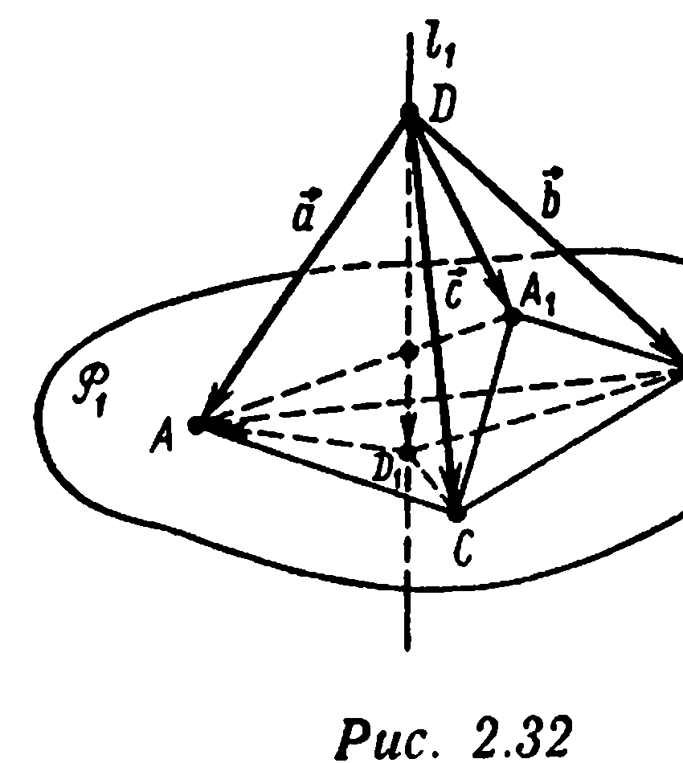
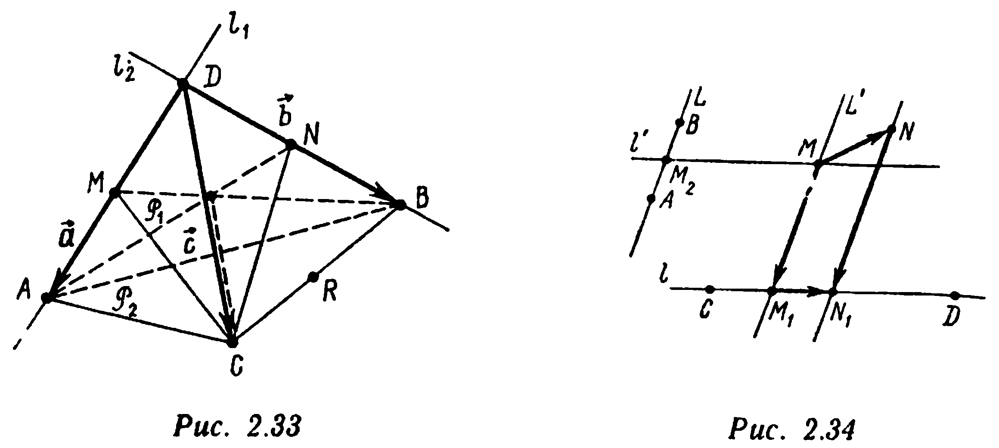

## § 7. Параллельное проецирование

---
**стр. 89**
---

$M(x_M;y_M;z_M)$, $N(x_N;y_N;z_N)$, т. е. вектор $\overrightarrow{MN}$ имеет координаты $(x_N-x_M;y_N-y_M;z_N-z_M)$ в базисе $\{\vec e_1,\vec e_2,\vec e_3\}$, то $\overrightarrow{M^*N^*}=(x_N-x_M;y_N-y_M;0)$.

Пусть $\vec d$ — некоторый вектор. Его проекция $\vec d^*=\Pi_P^l(\vec d)$ на плоскость $P$ параллельно прямой $l$ определяется следующим образом: $\vec d^*=\Pi_P^l(\overrightarrow{MN})$, где $M$ и $N$ — произвольные точки пространства такие, что направленный отрезок $\overrightarrow{MN}$ изображает вектор $\vec d$. Данное определение является *к о р р е к т н ы м*, т. е. не зависит от выбора направленного отрезка $\overrightarrow{MN}$, изображающего вектор $\vec d$.

□ Действительно, если $\vec d=\overrightarrow{KL}=\overrightarrow{MN}$, то $x_L-x_K=x_N-x_M$, $y_L-y_K=y_N-y_M$, $z_L-z_K=z_N-z_M$, а поэтому $\overrightarrow{K^*L^*}=(x_L-x_K;y_L-y_K;0)=(x_N-x_M;y_N-y_M;0)=\overrightarrow{M^*N^*}$. ■

Если в выбранном выше базисе $\vec d=(d_x;d_y;d_z)$, т. е. $\overrightarrow{MN}=(d_x;d_y;d_z)$, то в этом базисе $\vec d^*=\Pi_P^l(\vec d)=(d_x;d_y;0)$.

Операция проецирования вектора на плоскость $P$ параллельно прямой $l$ является *л и н е й н о й*: для любых векторов $\vec d$ и $\vec f$ и любых чисел $\alpha$ и $\beta$ справедливо равенство
$$\Pi_P^l(\alpha\vec d+\beta\vec f)=\alpha\Pi_P^l(\vec d)+\beta\Pi_P^l(\vec f). \quad (2.69)$$

□ Действительно, если в указанном выше базисе $\vec d=(d_x;d_y;d_z)$, $\vec f=(f_x;f_y;f_z)$, то $\alpha\vec d+\beta\vec f=(\alpha d_x+\beta f_x;\alpha d_y+\beta f_y;\alpha d_z+\beta f_z)$. Поэтому
$$\Pi_P^l(\alpha\vec d+\beta\vec f)=(\alpha d_x+\beta f_x;\alpha d_y+\beta f_y;0).$$
Кроме того, $\Pi_P^l(\vec d)=(d_x;d_y;0)$, $\alpha\Pi_P^l(\vec d)=(\alpha d_x;\alpha d_y;0)$, $\Pi_P^l(\vec f)=(f_x;f_y;0)$, $\beta\Pi_P^l(\vec f)=(\beta f_x;\beta f_y;0)$. Также имеем
$$\alpha\Pi_P^l(\vec d)+\beta\Pi_P^l(\vec f)=(\alpha d_x+\beta f_x;\alpha d_y+\beta f_y;0). \quad ■$$

**Пример 1** (*п р и з н а к п а р а л л е л ь н о с т и п р я м о й и п л о с к о с т и*). При каком необходимом и достаточном условии прямая $l:\dfrac{x-x_0}{a_x}=\dfrac{y-y_0}{a_y}=\dfrac{z-z_0}{a_z}$ ($a_x^2+a_y^2+a_z^2>0$) и плоскость $P:Ax+By+Cz+D=0$ ($A^2+B^2+C^2>0$) параллельны?

---
**стр. 90**
---

△ Прямая $l$ параллельна плоскости $P$ тогда и только тогда, когда плоскости $P$ параллелен направляющий вектор $\vec a=(a_x;a_y;a_z)$ прямой $l$: $Aa_x+Ba_y+Ca_z=0$ [см. условие (2.68)]. ▲

**Пример 2.** В пространстве заданы плоскость $P$: $Ax+By+Cz+D=0$ ($A^2+B^2+C^2>0$) и прямая $l$: $\dfrac{x-x_0}{a_x}=\dfrac{y-y_0}{a_y}=\dfrac{z-z_0}{a_z}$ ($a_x^2+a_y^2+a_z^2>0$). Напишите формулы, связывающие координаты точки $M(x_M;y_M;z_M)$ пространства с координатами ее проекции $M^*(x^*;y^*;z^*)$ на плоскость $P$ параллельно прямой $l$.

△ Вектор $\vec a=(a_x;a_y;a_z)$ — направляющий вектор прямой $l$. По определению проекции найдется число $t=t_M$, зависящее от $M$, такое, что $\overrightarrow{M^*M}=t\vec a$, или $x_M-x^*=ta_x$, $y_M-y^*=ta_y$, $z_M-z^*=ta_z$, т. е. $x^*=x_M-ta_x$, $y^*=y_M-ta_y$, $z^*=z_M-ta_z$. Координаты $(x^*;y^*;z^*)$ точки $M^*$ должны удовлетворять уравнению плоскости $P$: $A(x_M-ta_x)+B(y_M-ta_y)+C(z_M-ta_z)+D=0$. Учитывая, что $Aa_x+Ba_y+Ca_z\neq 0$ (см. пример 1), находим отсюда:
$$t_M=\frac{Ax_M+By_M+Cz_M+D}{Aa_x+Ba_y+Ca_z};$$
$$x^*=\frac{x_M(Ba_y+Ca_z)-a_x(By_M+Cz_M+D)}{Aa_x+Ba_y+Ca_z}; \quad (2.70)$$
$$y^*=\frac{y_M(Aa_x+Ca_z)-a_y(Ax_M+Cz_M+D)}{Aa_x+Ba_y+Ca_z};$$
$$z^*=\frac{z_M(Aa_x+Ba_y)-a_z(Ax_M+By_M+D)}{Aa_x+Ba_y+Ca_z}. \ ▲$$

**Пример 3.** Найдите проекцию вектора $\vec b=(1;0;-2)$ на плоскость $P$: $x-2y+z-4=0$ параллельно прямой $l$: $\dfrac{x}{2}=\dfrac{y-1}{1}=\dfrac{z+5}{1}$.

△ Воспользуемся формулами (2.70). Точка $N(0;0;4)$ лежит в плоскости $P$, поэтому $N^*=\Pi_P^l(N)=N$. Возьмем точку $M(1;0;2)$ так, чтобы $\overrightarrow{NM}=\vec b$. По формулам

---
**стр. 91**
---

$$x^*=\frac{1\cdot((-2)\cdot 1+1\cdot 1)-2\cdot((-2)\cdot 0+1\cdot 2-4)}{1\cdot 2+(-2)\cdot 1+1\cdot 1}=3,$$
$$y^*=\frac{-1\cdot(1\cdot 1+1\cdot 2-4)}{1}=1. \quad z^*=3.$$

Следовательно, $\Pi_P^l(\vec b)=\overrightarrow{N^*M^*}=(3-0;\ 1-0;\ 3-4)=(3;1;-1)$. ▲

**Пример 4*.** В тетраэдре $ABCD$ точки $D_1$, $A_1$, $B_1$, $C_1$ являются точками пересечения медиан соответственно треугольников $ABC$, $BCD$, $CDA$, $DAB$. Пусть $P_1$, $P_2$, $P_3$, $P_4$ — соответственно плоскости $(ABC)$, $(BCD)$, $(CDA)$, $(DAB)$; $l_1$, $l_2$, $l_3$, $l_4$ — прямые $(DD_1)$, $(AA_1)$, $(BB_1)$, $(CC_1)$. Вычислите для произвольного вектора $\vec d$ вектор
$$\Gamma(\vec d)=\Pi_{P_1}^{l_1}(\vec d)+\Pi_{P_2}^{l_2}(\vec d)+\Pi_{P_3}^{l_3}(\vec d)+\Pi_{P_4}^{l_4}(\vec d).$$

△ Векторы $\vec a=\overrightarrow{DA}$, $\vec b=\overrightarrow{DB}$, $\vec c=\overrightarrow{DC}$ не компланарны и образуют базис в пространстве. Вектор $\vec d$ раскладывается по этому базису: $\vec d=\alpha\vec a+\beta\vec b+\gamma\vec c$. Поэтому, используя линейность операции проецирования, получаем
$$\Gamma(\vec d)=\Gamma(\alpha\vec a+\beta\vec b+\gamma\vec c)=\Pi_{P_1}^{l_1}(\alpha\vec a+\beta\vec b+\gamma\vec c)+$$
$$+\Pi_{P_2}^{l_2}(\alpha\vec a+\beta\vec b+\gamma\vec c)+\Pi_{P_3}^{l_3}(\alpha\vec a+\beta\vec b+\gamma\vec c)+$$
$$+\Pi_{P_4}^{l_4}(\alpha\vec a+\beta\vec b+\gamma\vec c)=\{\alpha\Pi_{P_1}^{l_1}(\vec a)+\beta\Pi_{P_1}^{l_1}(\vec b)+\gamma\Pi_{P_1}^{l_1}(\vec c)\}+$$
$$+\ldots+\{\alpha\Pi_{P_4}^{l_4}(\vec a)+\beta\Pi_{P_4}^{l_4}(\vec b)+\gamma\Pi_{P_4}^{l_4}(\vec c)\}=$$
$$=\alpha\{\Pi_{P_1}^{l_1}(\vec a)+\Pi_{P_2}^{l_2}(\vec a)+\Pi_{P_3}^{l_3}(\vec a)+\Pi_{P_4}^{l_4}(\vec a)\}+$$
$$+\beta\{\Pi_{P_1}^{l_1}(\vec b)+\ldots+\Pi_{P_4}^{l_4}(\vec b)\}+\gamma\{\Pi_{P_1}^{l_1}(\vec c)+\ldots+\Pi_{P_4}^{l_4}(\vec c)\}=$$
$$=\alpha\Gamma(\vec a)+\beta\Gamma(\vec b)+\gamma\Gamma(\vec c).$$

Таким образом, для нахождения $\Gamma(\vec d)$ для любого вектора $\vec d$ достаточно знать лишь $\Gamma(\vec a)$, $\Gamma(\vec b)$ и $\Gamma(\vec c)$. Поскольку вектор $\vec a$ параллелен плоскостям $P_3$ и $P_4$ (изображающий вектор $\vec a$ направленный отрезок $\overrightarrow{DA}$ лежит в плоскостях $P_3$ и $P_4$), $\Pi_{P_3}^{l_3}(\vec a)=\Pi_{P_4}^{l_4}(\vec a)=\vec a$. В соответствии с результатом примера 12 § 5 этой главы $\overrightarrow{DD_1}=(1/3)(\vec a+\vec b+\vec c)$. Поэтому (рис. 2.32) $\Pi_{P_1}^{l_1}(\vec a)=\overrightarrow{D_1A}=-\overrightarrow{DD_1}+\overrightarrow{DA}=$

---
**стр. 92**
---

$=\vec a-(1/3)(\vec a+\vec b+\vec c)$. Согласно свойству медиан треугольника $BCD$, имеем $\Pi_{P_2}^{l_2}(\vec a)=\overrightarrow{DA_1}=(1/3)(\vec b+\vec c)$. Следовательно, $\Gamma(\vec a)=\vec a-(1/3)(\vec a+\vec b+\vec c)+(1/3)(\vec b+\vec c)+\vec a+\vec a=(8/3)\vec a$. Аналогично находим $\Gamma(\vec b)=(8/3)\vec b$, $\Gamma(\vec c)=(8/3)\vec c$. Окончательно получим $\Gamma(\vec d)=\alpha\Gamma(\vec a)+\beta\Gamma(\vec b)+\gamma\Gamma(\vec c)=\alpha(8/3)\vec a+\beta(8/3)\vec b+\gamma(8/3)\vec c=(8/3)\vec d$ для любого вектора $\vec d$. ▲

Рассмотрим в пространстве прямую $l$ и не параллельную ей плоскость $P$ (см. рис. 2.31). *Проекцией* $\Pi_l^P(M)$ точки $M$ на прямую $l$ параллельно плоскости $P$ называется такая точка $M_*\in l$, что вектор $\overrightarrow{MM_*}$ параллелен $P$. Точка $M_*$ является (единственной) точкой пересечения прямой $l$ с плоскостью, проходящей через точку $M$ и параллельной плоскости $P$. В системе координат $\{O,\vec e_1,\vec e_2,\vec e_3\}$ (см. рис. 2.31), у которой $\{\vec e_1,\vec e_2\}$ — базис в плоскости $P$, $\vec e_3\parallel l$, $O=l\cap P$, координаты точки $M_*(x_{*M};y_{*M};z_{*M})$ находятся по координатам точки $M(x_M;y_M;z_M)$ из условий $\overrightarrow{OM}=\overrightarrow{OM_*}+\overrightarrow{M_*M}$, $\overrightarrow{OM_*}\parallel\vec e_3$, $\overrightarrow{MM_*}\parallel P$. В системе координат $\{O,\vec e_1,\vec e_2,\vec e_3\}$ плоскость $P$ имеет уравнение $z=0$ (плоскость $P$ проходит через точки с координатами $(0;0;0)$, $(1;0;0)$ и $(0;1;0)$, поэтому ее уравнение
$$0=\begin{vmatrix}x-0&y-0&z-0\\ 1-0&0-0&0-0\\ 0-0&1-0&0-0\end{vmatrix}\iff 0=\begin{vmatrix}x&y&z\\ 1&0&0\\ 0&1&0\end{vmatrix}\iff z=0.$$

Вектор $\overrightarrow{MM_*}=(x_{*M}-x_M;y_{*M}-y_M;z_{*M}-z_M)$ параллелен плоскости $P$. Согласно признаку (2.68), получаем $0\cdot(x_{*M}-x_M)+0\cdot(y_{*M}-y_M)+1\cdot(z_{*M}-z_M)=0$, т. е. $z_{*M}=z_M$. Поскольку точка $M_*$ лежит на оси $Oz$, первые две ее координаты равны нулю. Таким образом, по заданным координатам $(x_M;y_M;z_M)$ точки $M$ координаты точки $M_*=\Pi_l^P(M)$ находятся так: $M_*(0;0;z_M)$.

---
**стр. 93**
---

*Проекцией* $\Pi_l^P(\overrightarrow{MN})$ направленного отрезка $\overrightarrow{MN}$ на прямую $l$ параллельно плоскости $P$ называется направленный отрезок $\overrightarrow{M_*N_*}$, где $M_*=\Pi_l^P(M)$, $N_*=\Pi_l^P(N)$. Если $M(x_M;y_M;z_M)$ и $N(x_N;y_N;z_N)$, то вектор $\overrightarrow{M_*N_*}$ имеет координаты $(0;0;z_N-z_M)$.

Пусть $\vec d$ — некоторый вектор. Проекцией $\vec d_*=\Pi_l^P(\vec d)$ вектора $\vec d$ на прямую $l$ параллельно плоскости $P$ называется вектор $\vec d_*=\Pi_l^P(\overrightarrow{MN})$, где $\overrightarrow{MN}$ — произвольный направленный отрезок, изображающий вектор $\vec d$. Это определение является *к о р р е к т н ы м* (не зависит от выбора направленного отрезка $\overrightarrow{MN}$, изображающего вектор $\vec d$). Если в данной системе координат $\vec d=(d_x;d_y;d_z)$, то $\Pi_l^P(\vec d)=(0;0;d_z)$. Поскольку $\Pi_P^l(\vec d)=(d_x;d_y;0)$, для любого вектора $\vec d$ выполнено тождество
$$\Pi_l^P(\vec d)+\Pi_P^l(\vec d)=\vec d. \quad (2.71)$$

Операция проецирования вектора на прямую $l$ параллельно плоскости $P$ обладает свойством *л и н е й н о с т и*:
$$\Pi_l^P(\alpha\vec d+\beta\vec f)=\alpha\Pi_l^P(\vec d)+\beta\Pi_l^P(\vec f) \quad (2.72)$$
для любых векторов $\vec d$ и $\vec f$ и любых чисел $\alpha$ и $\beta$.

**Пример 5.** В некоторой системе координат заданы плоскость $P:Ax+By+Cz+D=0$, $A^2+B^2+C^2>0$ и точка $M_0(x_0;y_0;z_0)$. Напишите уравнение плоскости $P^*$, параллельной плоскости $P$ и проходящей через точку $M_0$.

△ Уравнение всякой плоскости $P^*$, параллельной $P$, имеет вид
$$Ax+By+Cz+D^*=0.$$
Константа $D^*$ находится из условия принадлежности точки $M_0(x_0;y_0;z_0)$ искомой плоскости $P^*$: $Ax_0+By_0+Cz_0+D^*=0$, или $D^*=-Ax_0-By_0-Cz_0$. Окончательно $P^*:A(x-x_0)+B(y-y_0)+C(z-z_0)=0$. ▲

**Пример 6.** В некоторой системе координат заданы прямая $l:\dfrac{x-1}{1}=\dfrac{y}{2}=\dfrac{z+1}{-1}$ и плоскость $P:2x+y+z+2=0$. Найдите координаты проекции $M_*(x_*;y_*;z_*)$ точки $M(1;2;3)$ на прямую $l$ параллельно плоскости $P$.

△ Уравнение плоскости, проходящей через точку $M$ и параллельной плоскости $P$, имеет вид $2\cdot(x-1)+$

---
**стр. 94**
---

$+1\cdot(y-2)+1\cdot(z-3)=0\Leftrightarrow 2x+y+z-7=0$ (см. пример 5). Точка $M_*(x_*;y_*;z_*)=\Pi_l^P(M)$ является точкой пересечения этой плоскости и прямой $l$, поэтому ее координаты находятся из системы уравнений
$$2x_*+y_*+z_*-7=0,$$
$$x_*-1=(1/2)y_*, \quad z_*+1=-(1/2)y_* \Leftrightarrow x_*=3,$$
$$y_*=4, \quad z_*=-3. \ ▲$$

**Пример 7*.** В тетраэдре $ABCD$ точки $M$, $N$, $Q$, $K$, $L$, $R$ — соответственно середины ребер $[AD]$, $[BD]$, $[CD]$, $[AC]$, $[AB]$, $[BC]$. Пусть $P_1$, $P_2$, $P_3$, $P_4$, $P_5$, $P_6$ — соответственно плоскости $(CMB)$, $(ANC)$, $(AQB)$, $(DKB)$, $(DLC)$, $(DRA)$, а $l_1$, $l_2$, $l_3$, $l_4$, $l_5$, $l_6$ — прямые $(AD)$, $(BD)$, $(CD)$, $(AC)$, $(AB)$, $(BC)$. Вычислите для произвольного вектора $\vec d$ вектор
$$\Gamma(\vec d)=\Pi_{l_1}^{P_1}(\vec d)+\Pi_{l_2}^{P_2}(\vec d)+\Pi_{l_3}^{P_3}(\vec d)+\Pi_{l_4}^{P_4}(\vec d)+$$
$$+\Pi_{l_5}^{P_5}(\vec d)+\Pi_{l_6}^{P_6}(\vec d).$$

△ Векторы $\vec a=\overrightarrow{DA}$, $\vec b=\overrightarrow{DB}$, $\vec c=\overrightarrow{DC}$ образуют базис в пространстве. Вектор $\vec d$ раскладывается по этому базису: $\vec d=\alpha\vec a+\beta\vec b+\gamma\vec c$. Используя линейность операции проецирования, имеем
$$\Gamma(\vec d)=\Gamma(\alpha\vec a+\beta\vec b+\gamma\vec c)=\sum_{j=1}^{6}\Pi_{l_j}^{P_j}(\alpha\vec a+\beta\vec b+\gamma\vec c)=$$
$$=\sum_{j=1}^{6}(\alpha\Pi_{l_j}^{P_j}(\vec a)+\beta\Pi_{l_j}^{P_j}(\vec b)+\gamma\Pi_{l_j}^{P_j}(\vec c))=\alpha\sum_{j=1}^{6}\Pi_{l_j}^{P_j}(\vec a)+$$
$$+\beta\sum_{j=1}^{6}\Pi_{l_j}^{P_j}(\vec b)+\gamma\sum_{j=1}^{6}\Pi_{l_j}^{P_j}(\vec c)=\alpha\Gamma(\vec a)+\beta\Gamma(\vec b)+\gamma\Gamma(\vec c)$$
(ср. с примером 4). Найдем $\Gamma(\vec a)$. Так как $\Pi_{l_1}^{P_1}(A)=A$, $\Pi_{l_1}^{P_1}(D)=D$, то $\Pi_{l_1}^{P_1}(\vec a)=\vec a$ (рис. 2.33). Так как $\Pi_{l_2}^{P_2}(A)=N$, $\Pi_{l_2}^{P_2}(D)=D$, то $\Pi_{l_2}^{P_2}(\vec a)=\overrightarrow{DN}=(1/2)\vec b$. Аналогично имеем $\Pi_{l_3}^{P_3}(\vec a)=(1/2)\vec c$, $\Pi_{l_4}^{P_4}(\vec a)=(\vec a-\vec c)/2$, $\Pi_{l_5}^{P_5}(\vec a)=(\vec a-\vec b)/2$. Так как $\Pi_{l_6}^{P_6}(A)=\Pi_{l_6}^{P_6}(D)=R$, то $\Pi_{l_6}^{P_6}(\vec a)=\overrightarrow{RR}=\vec 0$. Следовательно,
$$\Gamma(\vec a)=\vec a+(1/2)\vec b+(1/2)\vec c+(1/2)(\vec a-\vec c)+(1/2)(\vec a-\vec b)+\vec 0=$$

---
**стр. 95**
---

$= 2\vec{a}$. Аналогично, $\Gamma(\vec{b}) = 2\vec{b}$, $\Gamma(\vec{c}) = 2\vec{c}$. Таким образом, для любого вектора $\vec{d}$

$$\Gamma(\vec{d}) = \alpha\Gamma(\vec{a}) + \beta\Gamma(\vec{b}) + \gamma\Gamma(\vec{c}) = \alpha 2\vec{a} + \beta 2\vec{b} + \gamma 2\vec{c} = 2\vec{d}. \blacktriangle$$

Рассмотрим в плоскости $P$ две непараллельные прямые $l$ и $L$ (рис. 2.34). Проекцией $\Pi_l^L(M)$ точки $M \in P$ на прямую $l$ параллельно прямой $L$ называется такая точка $M_1 \in l$,

что вектор $\vec{MM_1}$ параллелен $L$. Точка $M_1$ является (единственной) точкой пересечения прямой $l$ с прямой, проходящей через точку $M$ и параллельной прямой $L$. Пусть $M$ и $N$ — точки плоскости $P$. Проекцией $\Pi_l^L(\vec{MN})$ направленного отрезка $\vec{MN}$ на прямую $l$ параллельно прямой $L$ называется направленный отрезок $\vec{M_1N_1}$, где $M_1 = \Pi_l^L(M)$, $N_1 = \Pi_l^L(N)$. Пусть $\vec{d}$ — некоторый вектор, параллельный плоскости $P$. Его проекцией $\Pi_l^L(\vec{d})$ на прямую $l$ параллельно прямой $L$ называется вектор $\vec{d}^* = \Pi_l^L(\vec{MN})$, где $\vec{MN}$ — направленный отрезок, изображающий вектор $\vec{d}$, начало $M$ и конец $N$ которого лежат в плоскости $P$. Определение проекции вектора на прямую параллельно другой прямой в плоскости к о р р е к т н о (не зависит от выбора направленного отрезка, изображающего вектор). Операция проецирования вектора на прямую $l$ параллельно прямой $L$ в плоскости $P$ является л и н е й н о й:

$$\Pi_l^L(\alpha\vec{d} + \beta\vec{f}) = \alpha\Pi_l^L(\vec{d}) + \beta\Pi_l^L(\vec{f})$$

---
**стр. 96**
---

для любых векторов $\vec{d}\|P$ и $\vec{f}\|P$ и любых чисел $\alpha$ и $\beta$. Справедливо тождество

$$\vec{d} = \Pi_l^L(\vec{d}) + \Pi_L^l(\vec{d}).$$

**Пример 8.** Проверьте, что прямые $l: \frac{x-2}{1} = \frac{y+2}{-3} = \frac{z-3}{1}$ и $L: \frac{x}{1} = \frac{y-2}{-1} = \frac{z+1}{3}$ лежат в одной плоскости и не параллельны. Найдите проекцию точки $M(0; -4; -7)$ на прямую $l$ параллельно прямой $L$.

△ Прямые $l$ и $L$ не параллельны, поскольку их направляющие векторы $\vec{b} = (1; -3; 1)$ и $\vec{c} = (1; -1; 3)$ не коллинеарны:

$$\begin{vmatrix} -3 & 1 \\ -1 & 3 \end{vmatrix} \neq 0, \quad -\begin{vmatrix} 1 & 1 \\ 1 & 3 \end{vmatrix} \neq 0, \quad \begin{vmatrix} 1 & -3 \\ 1 & -1 \end{vmatrix} \neq 0.$$

Проверим, что эти прямые пересекаются (и, следовательно, лежат в одной плоскости). Для этого убедимся в том, что система уравнений $x - 2 = (y + 2)/(-3)$, $z - 3 = (y + 2)/-3$, $x = -y + 2$, $z = -3(y - 2) - 1$ имеет решение. Из первых трех уравнений находим: $x = 1$, $y = 1$, $z = 2$. Подставляя найденные $x$, $y$, $z$ в четвертое уравнение, получаем, что $2 = -3(1 - 2) - 1$, т. е. это уравнение также удовлетворяется. Таким образом, прямые $l$ и $L$ пересекаются в точке $N(1; 1; 2)$.

Найдем $\Pi_l^L(M)$. Для этого через точку $M(0; -4; -7)$ проведем прямую, параллельную $L$. Уравнения этой прямой $\frac{x-0}{1} = \frac{y+4}{-1} = \frac{z+7}{3}$. Точка $\Pi_l^L(M)$ лежит на данной прямой и на прямой $l$, поэтому ее координаты находятся из следующей системы уравнений: $x = -y - 4$, $z + 7 = -3(y + 4)$, $x - 2 = -(y + 2)/3$, $z - 3 = -(y + 2)/3$. Из первых трех уравнений находим: $x = 4$, $y = -8$, $z = 5$. Четвертому уравнению найденные $x$, $y$, $z$ также удовлетворяют. Следовательно, $\Pi_l^L(M)$ имеет координаты $(4; -8; 5)$. ▲

**Пример 9.** На плоскости заданы четыре точки: $A(1; 2)$, $B(2; 5)$, $C(1; -1)$, $D(3; -7)$. Пусть $L = (AB)$, $l = (CD)$. Найдите такую точку $M$, что точка $M_1 = \Pi_l^L(M)$ делит $[CD]$ в отношении $1 : 3$, считая от точки $C$, а точка $M_2 = \Pi_L^l(M)$ является серединой $[AB]$.

△ По формулам деления отрезка в заданном отношении точка $M_1$ имеет координаты $x_1 = \frac{x_C + (1/3)x_D}{1 + 1/3} = \frac{3}{2}$, $y_1 =$
