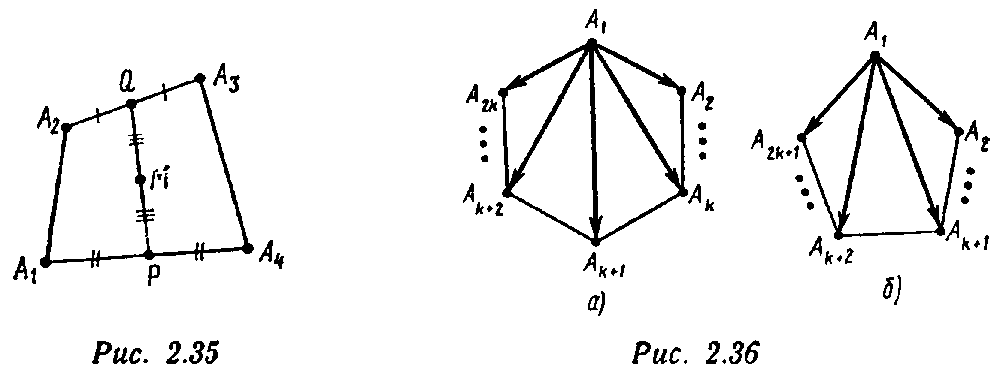
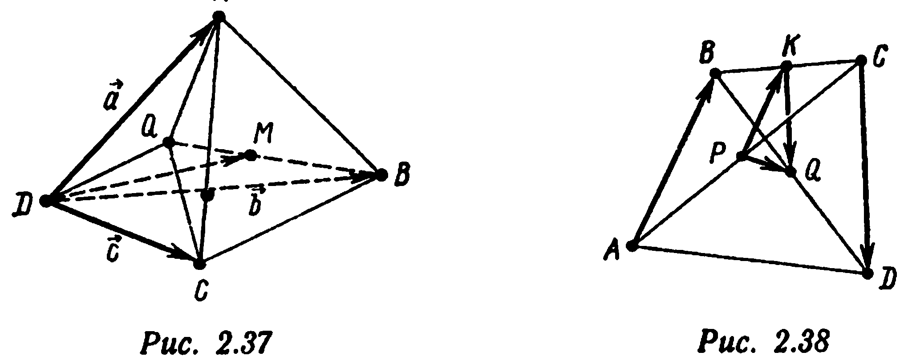
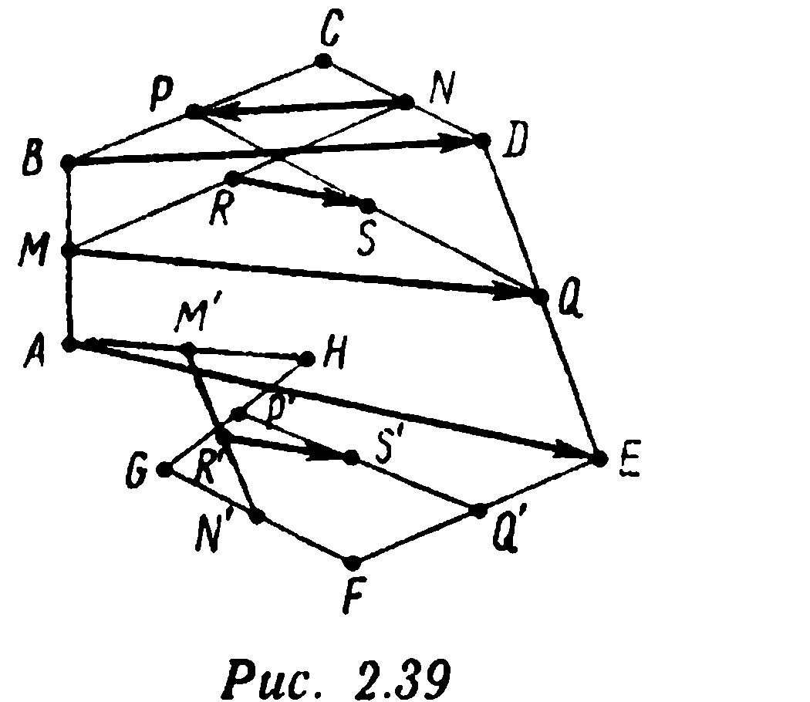
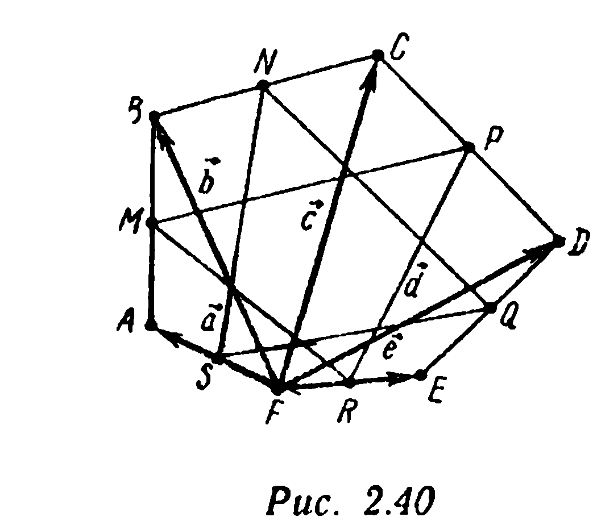
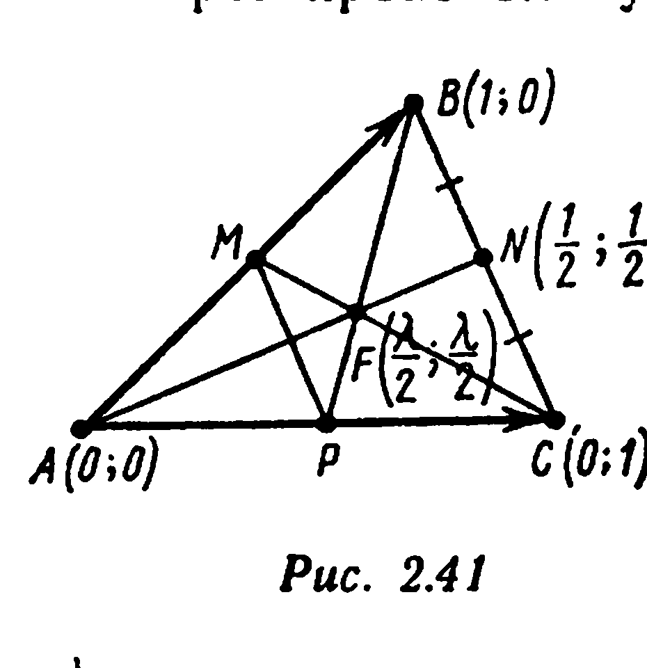
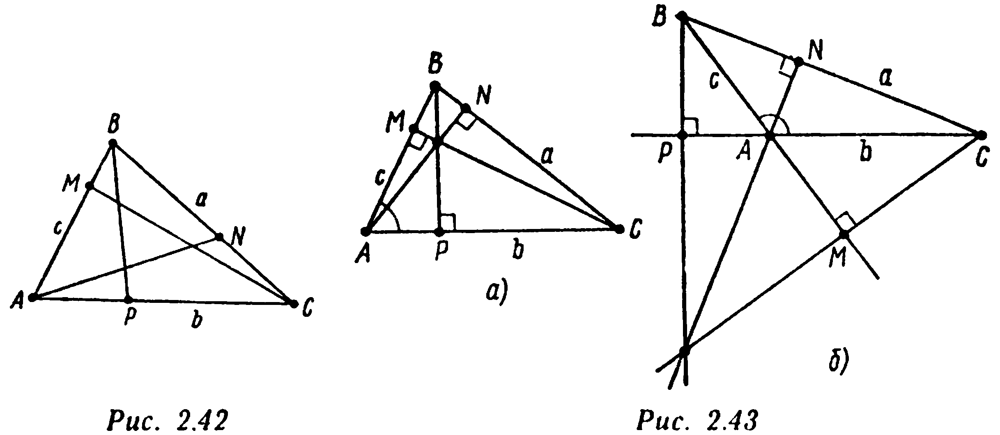
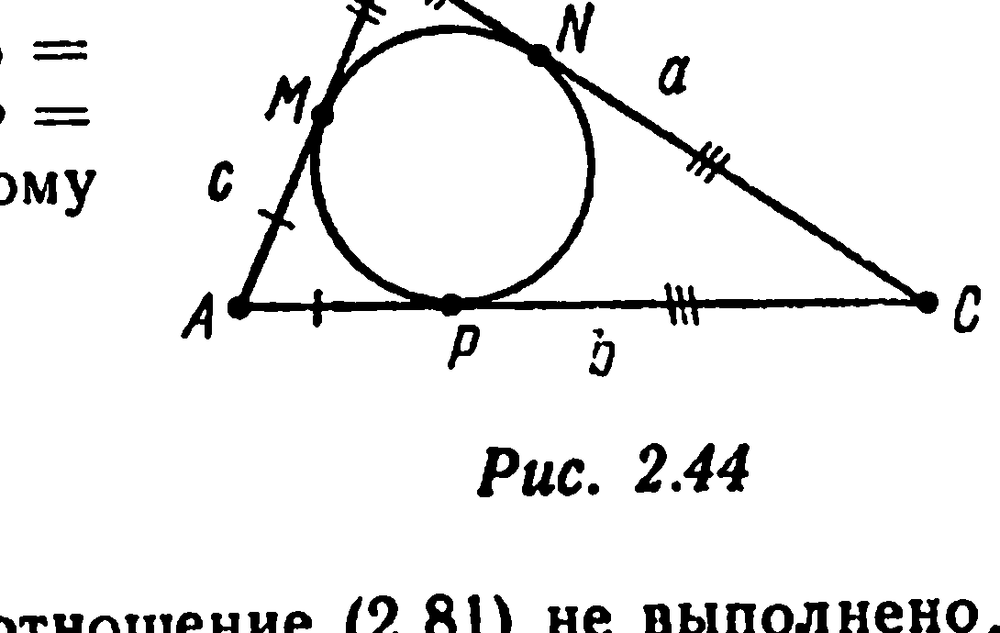
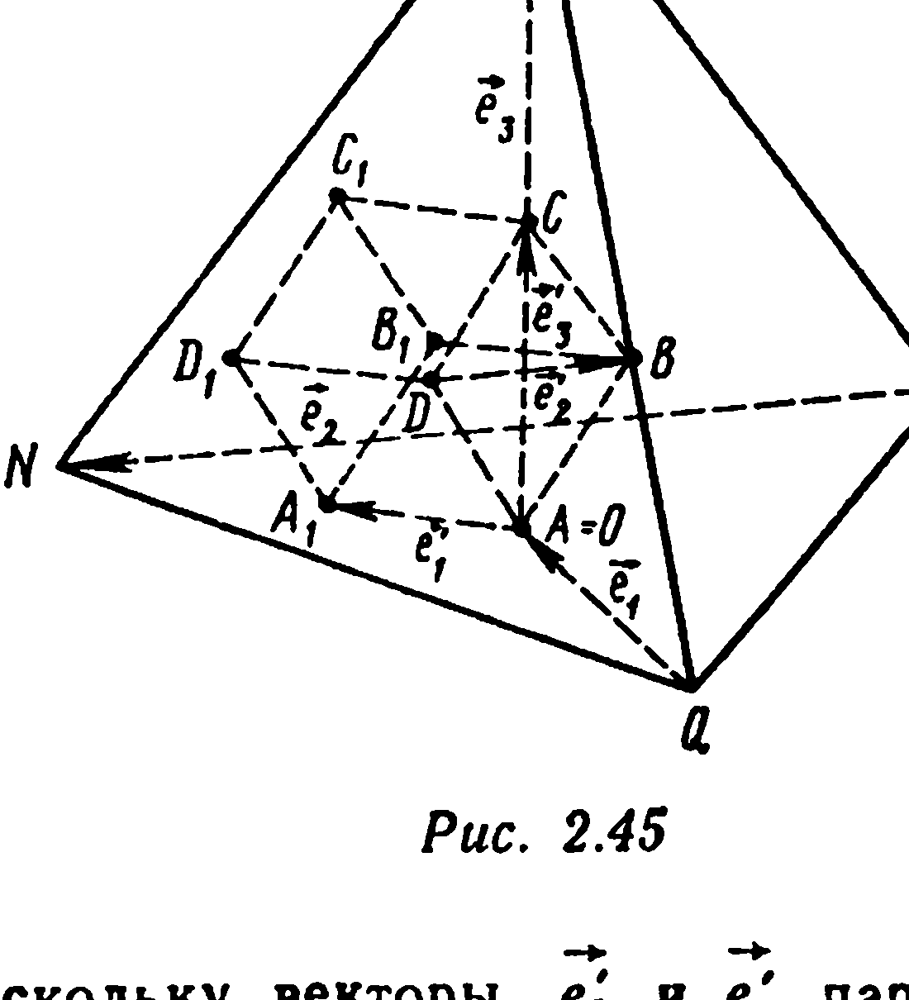
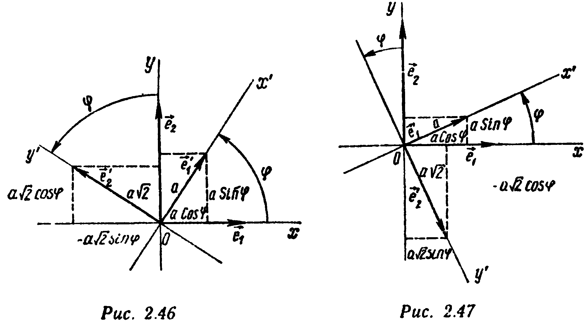

## § 8. Некоторые примеры

---
**стр. 97**
---

$= \frac{(-1) + (1/3)(-7)}{1 + 1/3} = -\frac{5}{2}$, точка $M_2$ — координаты $x_2 = 3/2$, $y_2 = 7/2$. Обозначим $l' = (MM_2)$, $L' = (MM_1)$ (рис. 2.34). По определению проекции, $l' \parallel l$, $L' \parallel L$. Следовательно, $\vec{AB} = (1; 3)$ — направляющий вектор прямой $L'$, проходящей через точку $M_1(3/2; -5/2)$. Поэтому уравнение $L'$:

$$\frac{x - 3/2}{1} = \frac{y + 5/2}{3} \Leftrightarrow 3x - y - 7 = 0.$$

Направляющим вектором прямой $l'$ является вектор $\vec{CD} = (2; -6)$, $M_2 \in l'$. Следовательно, уравнение $l'$:

$$\frac{x - 3/2}{2} = \frac{y - 7/2}{-6} \Leftrightarrow 3x + y - 8 = 0.$$

Решая систему уравнений $3x - y - 7 = 0$, $3x + y - 8 = 0$, находим координаты точки $M$: $x = \frac{5}{2}$, $y = \frac{1}{2}$, являющейся точкой пересечения прямых $l'$ и $L'$. ▲

**§ 8. Некоторые примеры**

**Пример 1.** Дан треугольник $ABC$. Укажите такую точку $M$, что $\vec{MA} + \vec{MB} - 3\vec{MC} = \vec{AB}$.

△ Так как $\vec{MA} = -\vec{AM}$, $\vec{MB} = \vec{AB} - \vec{AM}$, $\vec{MC} = \vec{AC} - \vec{AM}$, то $(-\vec{AM}) + (\vec{AB} - \vec{AM}) - 3(\vec{AC} - \vec{AM}) = \vec{AB}$, или $\vec{AM} = 3\vec{AC}$, т. е. точка $M$ лежит на продолжении стороны $[AC]$ за точку $C$, причем $|AM| = 3|AC|$. ▲

**Пример 2.** Докажите, что для любого конечного набора точек $A_1, A_2, \dots, A_n$ (в пространстве или на плоскости) найдется, и притом единственная, точка $M$ такая, что $\vec{MA_1} + \vec{MA_2} + \dots + \vec{MA_n} = \vec{0}$. Укажите положение точки $M$ в следующих частных случаях: 1) $A_1A_2A_3$ — треугольник; 2) $A_1A_2A_3A_4$ — пространственный или плоский четырехугольник; 3) $A_1A_2\dots A_n$ — правильный (плоский) $n$-угольник.

△ Зафиксируем некоторый полюс $O$. Для любой точки $M$ выполнены равенства $\vec{MA_1} + \vec{MA_2} + \dots + \vec{MA_n} = (\vec{OA_1} - \vec{OM}) + (\vec{OA_2} - \vec{OM}) + \dots + (\vec{OA_n} - \vec{OM}) = (\vec{OA_1} + \vec{OA_2} + \dots + \vec{OA_n}) - n\vec{OM}$. Отсюда следует, что $M$ — искомая точка тогда и только тогда, когда

$$\vec{OM} = (1/n)(\vec{OA_1} + \vec{OA_2} + \dots + \vec{OA_n}), \quad (2.73)$$

---
**стр. 98**
---

т. е. точка $M$ является концом вектора $\frac{1}{n}(\vec{OA_1} + \vec{OA_2} + \dots + \vec{OA_n})$, отложенного от точки $O$. Следовательно, искомая точка $M$ всегда существует и единственна.

1) Треугольник $A_1A_2A_3$. В этом случае $\vec{OM} = (1/3) \times (\vec{OA_1} + \vec{OA_2} + \vec{OA_3})$. Возьмем в качестве полюса $O$ точку $A_1$. Тогда $\vec{A_1M} = (1/3)(\vec{A_1A_1} + \vec{A_1A_2} + \vec{A_1A_3}) = \frac{2}{3} \cdot \frac{\vec{A_1A_2} + \vec{A_1A_3}}{2}$. Следовательно, точка $M$ лежит на медиане треугольника $A_1A_2A_3$, проведенной из вершины $A_1$, и делит ее в отношении $2 : 1$. Аналогично, $M$ лежит на медианах, проведенных из вершин $A_2$ и $A_3$. Таким образом,

*медианы любого треугольника пересекаются в одной точке («центре тяжести» треугольника) такой, что сумма векторов, идущих из этой точки в вершины треугольника, равна $\vec{0}$. Эта точка делит каждую из медиан в отношении $2 : 1$.*

$$\vec{OM} = (1/3)(\vec{OA_1} + \vec{OA_2} + \vec{OA_3}).$$

2) Четырехугольник $A_1A_2A_3A_4$. В этом случае $\vec{OM} = (1/4)(\vec{OA_1} + \vec{OA_2} + \vec{OA_3} + \vec{OA_4})$. Пусть $P$ и $Q$ — соответственно середины сторон $[A_1A_4]$ и $[A_2A_3]$ (рис. 2.35). Зафиксируем в качестве полюса точку $A_1$. Имеем

$$\vec{A_1M} = \frac{1}{4}(\vec{A_1A_2} + \vec{A_1A_3} + \vec{A_1A_4}) = \frac{1}{4}(\vec{A_1A_2} + (\vec{A_1A_4} + \vec{A_4A_3}) + \vec{A_1A_4}) =$$
$$= \frac{1}{2}\vec{A_1A_4} + \frac{1}{2}\left(\frac{\vec{A_1A_2} + \vec{A_4A_3}}{2}\right) = \vec{A_1P} + \frac{1}{2}\vec{PQ}$$

[мы воспользовались тем, что (см. пример 5 § 2 этой главы) $\vec{PQ} = \frac{\vec{A_1A_2} + \vec{A_4A_3}}{2}$].

Таким образом, точка $M$ лежит на отрезке, соединяющем середины отрезков $[A_2A_3]$ и $[A_1A_4]$, и делит его пополам.

---
**стр. 99**
---

Следствие. В тетраэдре отрезки, соединяющие середины скрещивающихся ребер, имеют общую точку $M$, являющуюся серединой каждого из таких отрезков. Сумма векторов, идущих из точки $M$ в вершины тетраэдра, равна $\vec{0}$.

3) Правильный $n$-угольник $A_1A_2\dots A_n$. В этом случае $\vec{OM} = \frac{1}{n}(\vec{OA_1} + \vec{OA_2} + \dots + \vec{OA_n})$. Выберем в качестве полюса $O$ точку $A_1$. Если $n = 2k$ — четное, то векторы $\vec{A_1A_2} + \vec{A_1A_{2k}}$, $\dots$, $\vec{A_1A_3} + \vec{A_1A_{2k-1}}$, $\dots$, $\vec{A_1A_k} + \vec{A_1A_{k+2}}$,

$\vec{A_1A_{k+1}}$ направлены по биссектрисе $\angle A_2A_1A_{2k}$ (рис. 2.36, а). Если $n = 2k + 1$ — нечетное, то по биссектрисе $\angle A_2A_1A_{2k+1}$ направлены векторы $\vec{A_1A_2} + \vec{A_1A_{2k+1}}$, $\vec{A_1A_3} + \vec{A_1A_{2k}}$, $\dots$, $\vec{A_1A_{k+1}} + \vec{A_1A_{k+2}}$ (рис. 2.36, б). В обоих случаях то же направление (т. е. направление биссектрисы $\angle A_2A_1A_n$) имеет и вектор $\vec{A_1M} = (1/n)((\vec{A_1A_2} + \vec{A_1A_n}) + (\vec{A_1A_3} + \vec{A_1A_{n-1}}) + \dots)$. Следовательно, точка $M$ лежит на биссектрисе $\angle A_2A_1A_n$. Если в качестве полюса зафиксировать точку $A_2$, то получим, что $M$ лежит и на биссектрисе угла $\angle A_1A_2A_3$. Можно сделать вывод: $M$ — центр правильного $n$-угольника $A_1A_2\dots A_n$. Таким образом, сумма векторов, идущих из центра правильного $n$-угольника в его вершины, равна $\vec{0}$. ▲

**Пример 3.** Докажите, что в тетраэдре отрезки, соединяющие вершины с центрами тяжести противолежащих граней, имеют общую точку и делятся ею в отношении $3 : 1$, считая от вершины.

△ Пусть $A$, $B$, $C$, $D$ — вершины тетраэдра. Пусть $\vec{a} = \vec{DA}$, $\vec{b} = \vec{DB}$, $\vec{c} = \vec{DC}$, $Q$ — центр тяжести грани $ACD$, $M$ — точка, лежащая на отрезке $[QB]$ и делящая его в отношении $3 : 1$, считая от вершины $B$ (рис. 2.37). По формуле

---
**стр. 100**
---

из примера 2, $\vec{BQ} = (1/3)(\vec{BA} + \vec{BD} + \vec{BC}) = (1/3)((\vec{a} - \vec{b}) + (-\vec{b}) + (\vec{c} - \vec{b})) = (\vec{a} + \vec{c})/3 - \vec{b}$. Следовательно,

$$\vec{BM} = \frac{3}{4}\left(\frac{\vec{a} + \vec{c}}{3} - \vec{b}\right) = \frac{\vec{a} + \vec{c}}{4} - \frac{3}{4}\vec{b}, \quad \vec{DM} = \vec{DB} +$$
$$+ \vec{BM} = \vec{b} + \left(\frac{\vec{a} + \vec{c}}{4} - \frac{3}{4}\vec{b}\right) = \frac{\vec{a} + \vec{b} + \vec{c}}{4} =$$
$$= \frac{1}{4}(\vec{DD} + \vec{DA} + \vec{DB} + \vec{DC}),$$

т. е. точка $M$ — точка (см. пример 2), для которой выполнено условие

$$\vec{MA} + \vec{MB} + \vec{MC} + \vec{MD} = \vec{0}. \quad (2.74)$$

Таким образом, точка $M$ из примера 2 (п. 2), построенная для тетраэдра $ABCD$, лежит на отрезке, соединяющем вершину $B$ с центром тяжести $Q$ противоположной грани, и делит отрезок $[QB]$ в отношении $3 : 1$, считая от вершины.

Проведя аналогичные рассуждения для вершины $C$ ($D$ или $A$), приходим к выводу, что та же точка $M$, определяемая условием (2.74), лежит на отрезке, соединяющем $C$ ($D$ или $A$) с центром тяжести противолежащей грани, и делит этот отрезок в отношении $3 : 1$. ▲

**Пример 4.** В пространстве зафиксированы четыре различные точки: $A$, $B$, $C$ и $D$. Точки $P$ и $Q$ — соответственно середины отрезков $[AC]$ и $[BD]$. Докажите, что $\vec{PQ} = (1/2)(\vec{AB} + \vec{CD})$.

---
**стр. 101**
---

△ Пусть $K$ — середина $[BC]$ (рис. 2.38). Тогда $|PK|$ — средняя линия $\triangle ABC$, и поэтому $\overrightarrow{PK} = (1/2)\overrightarrow{AB}$. Аналогично, $\overrightarrow{KQ} = (1/2)\overrightarrow{CD}$. Следовательно, $\overrightarrow{PQ} = \overrightarrow{PK} + \overrightarrow{KQ} =$
$= (1/2)(\overrightarrow{AB} + \overrightarrow{CD})$. ▲

**Пример 5.** Пусть $A$, $B$, $C$, $D$, $E$, $F$, $G$, $H$ — произвольные точки в пространстве или на плоскости, $M$, $N$, $P$, $Q$, $M'$, $N'$, $P'$, $Q'$, $R$, $S$, $R'$, $S'$ — соответственно середины отрезков $[AB]$, $[CD]$, $[BC]$, $[DE]$, $[AH]$, $[GF]$, $[HG]$, $[FE]$, $[MN]$, $[PQ]$, $[M'N']$, $[P'Q']$ (рис. 2.39). Докажите, что $\overrightarrow{RS} = \overrightarrow{R'S'}$.

△ В соответствии с формулой для средней линии пространственного четырехугольника (см. пример 5 § 2 этой главы) имеем: $\overrightarrow{RS} = (1/2)(\overrightarrow{NP} + \overrightarrow{MQ})$, $\overrightarrow{NP} = (1/2)\overrightarrow{DB}$, $\overrightarrow{MQ} = (1/2)(\overrightarrow{BD} + \overrightarrow{AE})$. Поэтому $\overrightarrow{RS} = (1/2)((1/2)\overrightarrow{DB} + (1/2)\overrightarrow{BD} + (1/2)\overrightarrow{AE}) = (1/4)\overrightarrow{AE}$. Аналогично,

$$\overrightarrow{R'S'} = (1/2)(\overrightarrow{N'P'} + \overrightarrow{M'Q'}) = (1/2)((1/2)\overrightarrow{FH} + (1/2)(\overrightarrow{HF} + \overrightarrow{AE})) = \frac{1}{4}\overrightarrow{AE}. \ ▲$$

**Пример 6.** В произвольном выпуклом шестиугольнике $ABCDEF$ соединены через одну середины сторон. Докажите, что точки пересечения медиан двух образовавшихся треугольников совпадают.

△ Пусть $S$, $M$, $N$, $P$, $Q$, $R$ — середины соответственно сторон $[FA]$, $[AB]$, $[BC]$, $[CD]$, $[DE]$, $[EF]$. Обозначим $\vec{a} = \overrightarrow{FA}$, $\vec{b} = \overrightarrow{FB}$, $\vec{c} = \overrightarrow{FC}$, $\vec{d} = \overrightarrow{FD}$, $\vec{e} = \overrightarrow{FE}$ (рис. 2.40). Возьмем в качестве полюса вершину $F$ шестиугольника и вычислим радиусы-векторы относительно полюса $F$ точек

---
**стр. 102**
---

$K$ и $L$, являющихся центрами тяжести соответственно треугольников $MPR$ и $SNQ$. Имеем: $\overrightarrow{FM} = (1/2)(\vec{a} + \vec{b})$, $\overrightarrow{FP} = (1/2)(\vec{c} + \vec{d})$, $\overrightarrow{FR} = (1/2)\vec{e}$, $\overrightarrow{FS} = (1/2)\vec{a}$, $\overrightarrow{FN} = (1/2)(\vec{b} + \vec{c})$, $\overrightarrow{FQ} = (1/2)(\vec{d} + \vec{e})$. По формуле из примера 2 имеем:

$$\overrightarrow{FK} = \frac{1}{3}(\overrightarrow{FM} + \overrightarrow{FP} + \overrightarrow{FR}) = \frac{1}{3}\left(\frac{1}{2}(\vec{a} + \vec{b}) + \frac{1}{2}(\vec{c} + \vec{d}) + \frac{1}{2}\vec{e}\right) = \frac{1}{6}(\vec{a} + \vec{b} + \vec{c} + \vec{d} + \vec{e}),$$

$$\overrightarrow{FL} = \frac{1}{3}(\overrightarrow{FS} + \overrightarrow{FN} + \overrightarrow{FQ}) = \frac{1}{3}\left(\frac{1}{2}\vec{a} + \frac{1}{2}(\vec{b} + \vec{c}) + \frac{1}{2}(\vec{d} + \vec{e})\right) = \frac{1}{6}(\vec{a} + \vec{b} + \vec{c} + \vec{d} + \vec{e}),$$

т. е. $\overrightarrow{FL} = \overrightarrow{FK}$. ▲

**Пример 7.** Дан треугольник $ABC$, $[AN]$ — его медиана. Через произвольную точку $F$ отрезка $[AN]$ проведены прямые $(CF)$ и $(BF)$ до пересечения со сторонами $[AB]$ и $[AC]$ соответственно в точках $M$ и $P$. Докажите, что $CPMB$ — трапеция, если $F \neq A$ и $F \neq N$.

△ Введем систему координат $\{A, \overrightarrow{AB}, \overrightarrow{AC}\}$ (рис. 2.41). В этой системе координат $A(0; 0)$, $B(1; 0)$, $C(0; 1)$, $N(1/2; 1/2)$, $\overrightarrow{AN} = (1/2; 1/2)$. Точка $F$ лежит на отрезке $[AN]$, причем $F \neq A$, $F \neq N$. Следовательно, $\overrightarrow{AF} = \lambda\overrightarrow{AN}$ при некотором $\lambda \in (0, 1)$ и $F(\lambda/2; \lambda/2)$. Уравнения прямых:

$$(BF): \frac{x - 1}{\lambda/2 - 1} = \frac{y - 0}{\lambda/2 - 0} \Leftrightarrow \lambda x - (\lambda - 2)y - \lambda = 0;$$

$$(CM): \frac{x - 0}{\lambda/2 - 0} = \frac{y - 1}{\lambda/2 - 1} \Leftrightarrow (\lambda - 2)x - \lambda y + \lambda = 0;$$

$$(AC): x = 0; \quad (AB): y = 0.$$

Координаты точки $P = (BF) \cap (AC)$ находим из системы уравнений $\lambda x - (\lambda - 2)y - \lambda = 0$, $x = 0 \Leftrightarrow x = 0$, $y = \frac{\lambda}{2 - \lambda}$, т. е. $P(0; \frac{\lambda}{2 - \lambda})$. Аналогично, $M(\frac{\lambda}{2 - \lambda}; 0)$ и,

---
**стр. 103**
---

значит, $\overrightarrow{MP} = \left(-\frac{\lambda}{2 - \lambda}; \frac{\lambda}{2 - \lambda}\right)$. Так как $\overrightarrow{BC} = (-1; 1)$, то $\overrightarrow{MP} = \frac{\lambda}{2 - \lambda}\overrightarrow{BC}$, т. е. $(MP) \parallel (BC)$, $|MP| \neq |BC|$ и $CPMB$ — трапеция. ▲

**Пример 8*.** Найдите необходимые и достаточные условия того, чтобы три прямые $l_i$: $A_i x + B_i y + C_i = 0$, $A_i^2 + B_i^2 > 0$, $i = 1, 2, 3$ на плоскости имели общую точку.

□ Три прямые $l_1$, $l_2$, $l_3$ имеют общую точку тогда и только тогда, когда существуют числа $x_0$, $y_0$ (координаты этой точки) такие, что

$$C_1 = -x_0 A_1 - y_0 B_1, \quad C_2 = -x_0 A_2 - y_0 B_2, \quad C_3 =$$
$$= -x_0 A_3 - y_0 B_3. \quad (2.75)$$

Если, зафиксировав некоторый базис в пространстве, ввести векторы $\vec{a} = (A_1; A_2; A_3)$, $\vec{b} = (B_1; B_2; B_3)$, $\vec{c} = (C_1; C_2; C_3)$, то для этих трех векторов условие (2.75) означает, что вектор $\vec{c}$ может быть разложен по векторам $\vec{a}$ и $\vec{b}$. Следовательно, если прямые $l_1$, $l_2$, $l_3$ имеют общую точку, то векторы $\vec{a}$, $\vec{b}$, $\vec{c}$ компланарны:

$$\Delta = \begin{vmatrix} A_1 & A_2 & A_3 \\ B_1 & B_2 & B_3 \\ C_1 & C_2 & C_3 \end{vmatrix} = \begin{vmatrix} A_1 & B_1 & C_1 \\ A_2 & B_2 & C_2 \\ A_3 & B_3 & C_3 \end{vmatrix} = 0. \quad (2.76)$$

Условие (2.76) является необходимым условием существования общей точки у прямых $l_1$, $l_2$, $l_3$. Выясним достаточность этого условия. Если векторы $\vec{a} = (A_1; A_2; A_3)$ и $\vec{b} = (B_1; B_2; B_3)$ не коллинеарны, то из условия (2.76) вытекает, что векторы $\vec{a}$, $\vec{b}$, $\vec{c}$ компланарны: вектор $\vec{c}$ параллелен плоскости, в которой $\vec{a}$ и $\vec{b}$ образуют базис. На основании формулы (2.38) выполнено и условие (2.75) при некоторых $x_0$ и $y_0$. Если же векторы $\vec{a}$ и $\vec{b}$ коллинеарны, то либо $\vec{b} \neq \vec{0}$, $\vec{a} = \lambda\vec{b}$: $A_1 = \lambda B_1$, $A_2 = \lambda B_2$, $A_3 = \lambda B_3$ и условие (2.75) принимает вид $C_1 = -(\lambda x_0 + y_0)B_1$, $C_2 = -(\lambda x_0 + y_0)B_2$, $C_3 = -(\lambda x_0 + y_0)B_3$, т. е. $\vec{c} = -(\lambda x_0 + y_0)\vec{b}$, либо $\vec{a} \neq \vec{0}$, $\vec{b} = \mu\vec{a}$: $B_i = \mu A_i$, $i = 1, 2, 3$, а условие (2.75) превращается в условие $\vec{c} = -(x_0 + \mu y_0)\vec{a}$. Таким образом, необходимое и достаточное условие наличия общей точки у трех прямых $l_i: A_i x + B_i y + C_i = 0$, $A_i^2 + B_i^2 > 0$, $i = 1, 2, 3$, следующее:

$$\Delta = 0 \text{ и либо } \vec{a} \nparallel \vec{b}, \text{ либо } \vec{a} \parallel \vec{b} \parallel \vec{c}. \quad (2.77)$$

Если $\Delta = 0$, $\vec{a} \nparallel \vec{b}$, то $l_1$, $l_2$, $l_3$ имеют единственную общую точку [вектор $\vec{c}$ единственным образом (с коэффициентами $-x_0$, $-y_0$) раскладывается по базису $\{\vec{a}, \vec{b}\}$]. Если же $\Delta = 0$, а $\vec{a}$, $\vec{b}$ и $\vec{c}$ коллинеарны, то разложение (2.75) не единственно (если $\vec{b} \neq \vec{0}$, $\vec{a} = \lambda\vec{b}$, $\vec{c} = \lambda'\vec{b}$, то соотношения (2.75) выполнены при произволь-

---
**стр. 104**
---

ных $x_0$ и $y_0$, связанных соотношением $\lambda x_0 + y_0 = -\lambda'$; если же $\vec{a} \neq \vec{0}$, $\vec{b} = \mu\vec{a}$, $\vec{c} = \mu'\vec{a}$, то равенства (2.75) имеют место при произвольных $x_0$ и $y_0$ таких, что $x_0 + \mu y_0 = -\mu'$). Окончательно, если $\Delta = 0$, $\vec{a} \nparallel \vec{b}$, то прямые $l_1$, $l_2$, $l_3$ имеют единственную общую точку. Если $\Delta = 0$, $\vec{a} \parallel \vec{b} \parallel \vec{c}$, то все три прямые совпадают. ■

**Пример 9*.** На сторонах (или продолжениях сторон) треугольника $ABC$ выбраны точки $M \in (AB)$, $N \in (BC)$, $P \in (CA)$ так, что $\overrightarrow{AM} = \alpha\overrightarrow{AB}$, $\overrightarrow{BN} = \beta\overrightarrow{BC}$, $\overrightarrow{CP} = \gamma\overrightarrow{CA}$. Докажите, что равенство

$$(1 - \alpha)(1 - \beta)(1 - \gamma) = \alpha\beta\gamma \quad (2.78)$$

является необходимым и достаточным условием того, чтобы прямые $(AN)$, $(BP)$ и $(CM)$ либо пересекались в одной точке, либо были попарно параллельны.

△ Введем систему координат $\{A, \overrightarrow{AC}, \overrightarrow{AB}\}$. В этой системе координат $A(0; 0)$, $B(0; 1)$, $C(1; 0)$, $M(0; \alpha)$, $N(\beta; 1 - \beta)$, $P(1 - \gamma; 0)$. Уравнения прямых:

$$(AN): \frac{x - 0}{\beta - 0} = \frac{y - 0}{(1 - \beta) - 0} \Leftrightarrow (1 - \beta)x - \beta y = 0;$$

$$(BP): \frac{x - 0}{(1 - \gamma) - 0} = \frac{y - 1}{0 - 1} \Leftrightarrow x + (1 - \gamma)y - (1 - \gamma) = 0;$$

$$(CM): \frac{x - 1}{0 - 1} = \frac{y - 0}{\alpha - 0} \Leftrightarrow \alpha x + y - \alpha = 0.$$

Необходимое условие пересечения этих трех прямых в одной точке [ср. с (2.76)]

$$\Delta = \begin{vmatrix} 1 - \beta & -\beta & 0 \\ 1 & 1 - \gamma & -(1 - \gamma) \\ \alpha & 1 & -\alpha \end{vmatrix} = 0 \Leftrightarrow 0 = (1 - \beta) \times$$

$$\times \begin{vmatrix} 1 - \gamma & -(1 - \gamma) \\ 1 & -\alpha \end{vmatrix} - (-\beta) \begin{vmatrix} 1 & -(1 - \gamma) \\ \alpha & -\alpha \end{vmatrix} =$$

$$= (1 - \beta)(1 - \gamma)(1 - \alpha) - \alpha\beta\gamma$$

[ср. с (2.78)]. Если $(AN) \parallel (BP)$, то направляющие векторы $\vec{n} = (\beta; 1 - \beta)$ и $\vec{p} = (1 - \gamma; -1)$ этих прямых коллинеарны. Согласно условию коллинеарности,

---
**стр. 105**
---

$$(AN) \parallel (BP) \Leftrightarrow \begin{vmatrix} \beta & 1 - \beta \\ 1 - \gamma & -1 \end{vmatrix} = 0 \Leftrightarrow \beta = -(1 - \beta)(1 - \gamma). \quad (2.79)$$

[если $\vec{e}$ — произвольный вектор, не параллельный плоскости $(ABC)$, то в базисе $\{\overrightarrow{AC}, \overrightarrow{AB}, \vec{e}\}$ $\vec{n} = (\beta; 1 - \beta; 0)$, $\vec{p} = (1 - \gamma; -1; 0)$ и соотношение (2.79) легко получается из критерия (2.35)]. Аналогично, если $(BP) \parallel (CM)$, то $\vec{p} \parallel \vec{m}$, $\vec{p} = (1 - \gamma; -1)$, $\vec{m} = (-1; \alpha)$, т. е.

$$(BP) \parallel (CM) \Leftrightarrow \begin{vmatrix} 1 - \gamma & -1 \\ -1 & \alpha \end{vmatrix} = 0 \Leftrightarrow \alpha\gamma = -(1 - \alpha). \quad (2.80)$$

Если теперь прямые $(AN)$, $(BP)$ и $(CM)$ попарно параллельны, то из соотношений (2.79) и (2.80) получаем $\beta\alpha\gamma = (1 - \beta)(1 - \gamma)(1 - \alpha)$, т. е. (2.78) является необходимым условием выполнения соотношений $(AN) \parallel (BP) \parallel (CM)$.

Покажем достаточность условия (2.78). Если это условие выполнено, а трехмерные векторы $\vec{a} = (1 - \beta; 1; \alpha)$ и $\vec{b} = (-\beta; 1 - \gamma; 1)$ не коллинеарны, то в силу результатов, полученных в примере 8, прямые $(AN)$, $(BP)$, $(CM)$ имеют, и притом единственную, общую точку.

Пусть теперь выполнено соотношение (2.78), а векторы $\vec{a}$ и $\vec{b}$ коллинеарны:

$$\begin{vmatrix} 1 - \beta & 1 \\ -\beta & 1 - \gamma \end{vmatrix} = \begin{vmatrix} 1 - \beta & \alpha \\ -\beta & 1 \end{vmatrix} = \begin{vmatrix} 1 & \alpha \\ 1 - \gamma & 1 \end{vmatrix} = 0,$$

т. е. $1 = \gamma(1 - \beta)$, $1 = \beta(1 - \alpha)$, $1 = \alpha(1 - \gamma)$, или

$$\alpha \neq 0, \quad \alpha \neq 1, \quad \beta = 1/(1 - \alpha), \quad \gamma = -(1 - \alpha)/\alpha. \quad (2.81)$$

Подставив значения $\beta$ и $\gamma$ в коэффициенты уравнений прямых, приходим к выводу, что уравнения прямых $(AN)$, $(BP)$, $(CM)$ таковы: $(AN): \alpha x + y = 0$; $(BP): \alpha x + y = 1$; $(CM): \alpha x + y = \alpha$. Любые два из этих уравнений несовместны, т. е. $(AN)$, $(BP)$ и $(CM)$ попарно параллельны. ▲

Если указанные в примере 9 прямые пересекаются в одной точке, то, каков бы ни был полюс $O$, радиус-вектор $\vec{r}$ этой точки относительно полюса $O$ выражается через радиусы-векторы $\vec{r}_A = \overrightarrow{OA}$, $\vec{r}_B = \overrightarrow{OB}$, $\vec{r}_C = \overrightarrow{OC}$ по формуле

$$\vec{r} = \frac{\gamma(1 - \alpha)}{1 - \alpha(1 - \gamma)} \vec{r}_A + \frac{\alpha(1 - \beta)}{1 - \beta(1 - \alpha)} \vec{r}_B + \frac{\beta(1 - \gamma)}{1 - \gamma(1 - \beta)} \vec{r}_C. \quad (2.82)$$

---
**стр. 106**
---

**Пример 10.** Выведите формулу (2.82).

△ Пусть прямые $(AN)$, $(BP)$, $(CM)$ пересекаются в одной точке $Q(x; y)$ (и, как следствие, выполнено равенство (2.78), причем [см. (2.81)] $\alpha(1 - \gamma) \neq 1$). Тогда $(x; y)$ — решение системы уравнений

$$x + (1 - \gamma)y = 1 - \gamma, \quad \alpha x + y = \alpha.$$

Имеем $x = \frac{(1 - \gamma)(1 - \alpha)}{1 - \alpha(1 - \gamma)}$, $y = \frac{\alpha\gamma}{1 - \alpha(1 - \gamma)}$. Следовательно, $\vec{r} = \overrightarrow{OQ} = \overrightarrow{OA} + \overrightarrow{AQ} = \overrightarrow{OA} + x\overrightarrow{AC} + y\overrightarrow{AB} = \vec{r}_A + x(\vec{r}_C - \vec{r}_A) + y(\vec{r}_B - \vec{r}_A) = (1 - x - y)\vec{r}_A + y\vec{r}_B + x\vec{r}_C$.

Далее,

$$1 - x - y = \frac{1 - \alpha(1 - \gamma) - (1 - \gamma)(1 - \alpha) - \alpha\gamma}{1 - \alpha(1 - \gamma)} = \frac{\gamma(1 - \alpha)}{1 - \alpha(1 - \gamma)};$$

$$x = \frac{(1 - \gamma)(1 - \alpha)}{1 - \alpha(1 - \gamma)} = \frac{(1 - \gamma)(1 - \alpha)}{\alpha\gamma + (1 - \alpha)} = \frac{(1 - \gamma)(1 - \alpha)}{(1 - \alpha)(1 - \beta)(1 - \gamma)/\beta + (1 - \alpha)} = \frac{\beta(1 - \gamma)}{1 - \gamma(1 - \beta)};$$

$$y = \frac{\alpha\gamma}{1 - \alpha(1 - \gamma)} = \frac{\alpha\gamma}{(1 - \alpha)(1 - \gamma) + \gamma} = \frac{\alpha\gamma}{\alpha\beta\gamma/(1 - \beta) + \gamma} = \frac{\alpha(1 - \beta)}{1 - \beta(1 - \alpha)}.$$

Формула (2.82) доказана. ▲

**Пример 11.** Используя результат примера 9, докажите, что в треугольнике в одной точке пересекаются: а) медианы; б) биссектрисы; в) высоты; г) прямые, проходящие через вершины треугольника и делящие его периметр пополам; д) прямые, соединяющие вершины треугольника с точками противоположных сторон, в которых этих сторон касается вписанная в треугольник окружность.

△ Пусть $|AB| = c$, $|AC| = b$, $|BC| = a$ (рис. 2.42).

а) По определению медианы, точки $M$, $N$, $P$ являются основаниями медиан $[CM]$, $[AN]$, $[BP]$ тогда и только тогда, когда $\alpha = \beta = \gamma = 1/2$. В этом случае $(1 - \alpha) = (1 - \beta) = (1 - \gamma) = 1/2$. Следовательно, $(1 - \alpha)(1 - \beta)(1 - \gamma) = 1/8 = \alpha\beta\gamma$. Условие (2.78) выполнено. Соотношения (2.81) не выполнены ($\beta(1 - \alpha) = 1/4 \neq 1$). Следовательно, медианы треугольника пересекаются в одной точке. По формуле (2.82), радиус-вектор $\vec{r}_1$ этой точки:

$$\vec{r}_1 = \frac{1/2 \cdot 1/2}{1 - 1/2 \cdot 1/2} \vec{r}_A + \frac{1/2 \cdot 1/2}{1 - 1/2 \cdot 1/2} \vec{r}_B + \frac{1/2 \cdot 1/2}{1 - 1/2 \cdot 1/2} \vec{r}_C = \frac{1}{3}(\vec{r}_A + \vec{r}_B + \vec{r}_C).$$

---
**стр. 107**
---

б) Если $[AN]$, $[BP]$, $[CM]$ — биссектрисы треугольника $ABC$, то согласно свойству биссектрисы (см. пример 10 § 3 этой главы), $\alpha=b/(a+b)$, $1-\alpha=a/(a+b)$, $\beta=c/(b+c)$, $1-\beta=b/(b+c)$, $\gamma=a/(a+c)$, $1-\gamma=c/(a+c)$. Поэтому $\alpha\beta\gamma=abc/((a+b)(b+c)(a+c))=(1-\alpha)(1-\beta)(1-\gamma)$, т. е. условие (2.78) выполнено. Соотношения (2.81) не выполнены ($\beta(1-\alpha)=ac/((a+b)(b+c))<1$). Следовательно, биссектрисы треугольника $ABC$ пересекаются в одной точке. По формуле (2.82), радиус-вектор $\vec r_2$ этой точки
$$\vec r_2=\frac{\dfrac{a}{a+c}\cdot\dfrac{a}{a+b}}{1-\dfrac{b}{a+b}\cdot\dfrac{c}{a+c}}\vec r_A+\frac{\dfrac{b}{a+b}\cdot\dfrac{b}{b+c}}{1-\dfrac{c}{b+c}\cdot\dfrac{a}{a+b}}\vec r_B+\frac{\dfrac{c}{b+c}\cdot\dfrac{c}{a+c}}{1-\dfrac{a}{a+c}\cdot\dfrac{b}{b+c}}\vec r_C=\frac{a\vec r_A+b\vec r_B+c\vec r_C}{a+b+c}.$$

в) Если $[AN]$, $[BP]$, $[CM]$ — высоты треугольника $ABC$, то $\alpha=\dfrac{|AM|}{|AB|}=\dfrac{|AC|\cos\widehat{A}}{|AB|}=\dfrac{b}{c}\cos\widehat{A}=\dfrac{\sin\widehat{B}}{\sin\widehat{C}}\cos\widehat{A}$, если $\angle A$ — острый или прямой; если же $\angle A$ — тупой, то (рис. 2.43) $\alpha=-\dfrac{|AM|}{|AB|}=-\dfrac{|AC|\cos(180^\circ-\widehat{A})}{|AB|}=\dfrac{b}{c}\cos\widehat{A}=\dfrac{\sin\widehat{B}}{\sin\widehat{C}}\cos\widehat{A}$, т. е. во всех случаях $\alpha=\dfrac{\sin\widehat{B}}{\sin\widehat{C}}\cos\widehat{A}$. Аналогично, $1-\alpha=\dfrac{a}{c}\cos\widehat{B}=$

---
**стр. 108**
---

$=\dfrac{\sin\widehat{A}}{\sin\widehat{C}}\cos\widehat{B}$, $\beta=\dfrac{c}{a}\cos\widehat{B}=\dfrac{\sin\widehat{C}}{\sin\widehat{A}}\cos\widehat{B}$, $1-\beta=\dfrac{b}{a}\cos\widehat{C}=$
$=\dfrac{\sin\widehat{B}}{\sin\widehat{A}}\cos\widehat{C}$, $\gamma=\dfrac{a}{b}\cos\widehat{C}=\dfrac{\sin\widehat{A}}{\sin\widehat{B}}\cos\widehat{C}$, $1-\gamma=\dfrac{c}{b}\cos\widehat{A}=$
$=\dfrac{\sin\widehat{C}}{\sin\widehat{B}}\cos\widehat{A}$.

Поэтому $(1-\alpha)(1-\beta)(1-\gamma)=\dfrac{a}{c}\cos\widehat{B}\dfrac{b}{a}\times$
$\times\cos\widehat{C}\dfrac{c}{b}\cos\widehat{A}=\cos\widehat{A}\cos\widehat{B}\cos\widehat{C}=\alpha\beta\gamma$ и условие (2.78) выполнено. Соотношения (2.81) не выполнены ($\beta(1-\alpha)=\cos^2\widehat{B}<1$).

Следовательно, высоты треугольника пересекаются в одной точке, называемой *ортоцентром* треугольника. Радиус-вектор $\vec r_3$ этой точки находим по формуле (2.82):
$$\vec r_3=\frac{\dfrac{\sin^2\widehat{A}\cos\widehat{B}\cos\widehat{C}}{\sin\widehat{B}\sin\widehat{C}}}{1-\dfrac{b}{c}\cos\widehat{A}\dfrac{c}{b}\cos\widehat{A}}\vec r_A+\frac{\dfrac{\sin^2\widehat{B}\cos\widehat{A}\cos\widehat{C}}{\sin\widehat{A}\sin\widehat{C}}}{1-\dfrac{c}{a}\cos\widehat{B}\dfrac{a}{c}\cos\widehat{B}}\vec r_B+$$
$$+\frac{\dfrac{\sin^2\widehat{C}\cos\widehat{B}\cos\widehat{A}}{\sin\widehat{B}\sin\widehat{A}}}{1-\dfrac{a}{b}\cos\widehat{C}\dfrac{b}{a}\cos\widehat{C}}\vec r_C=$$
$$=\operatorname{ctg}\widehat{B}\operatorname{ctg}\widehat{C}\vec r_A+\operatorname{ctg}\widehat{C}\operatorname{ctg}\widehat{A}\vec r_B+\operatorname{ctg}\widehat{A}\operatorname{ctg}\widehat{B}\vec r_C.$$

г) Если в примере 9 точки $M$, $N$, $P$ таковы, что прямые $(AN)$, $(BP)$, $(CM)$ делят (каждая) периметр треугольника $2p=a+b+c$ пополам, то $|AC|+|AM|=p$, $\alpha=\dfrac{|AM|}{|AB|}=\dfrac{p-b}{c}>0$ (точка $M$ лежит на отрезке $[AB]$). Аналогично, $1-\alpha=(p-a)/c$, $\beta=(p-c)/a$, $1-\beta=(p-b)/a$, $\gamma=(p-a)/b$, $1-\gamma=(p-c)/b$. Поэтому
$$(1-\alpha)(1-\beta)(1-\gamma)=\frac{p-a}{c}\frac{p-b}{a}\frac{p-c}{b}=\alpha\beta\gamma$$
и условие (2.78) выполнено. Соотношения (2.81) не выполнены, так как
$$\beta(1-\alpha)=\frac{p-c}{a}\frac{p-a}{c}=\frac{ac-p(a+c-p)}{ac}=1-\frac{p(p-b)}{ac}<1.$$

---
**стр. 109**
---

Следовательно, данные прямые пересекаются в одной точке. Используя тождества
$$\frac{\gamma(1-\alpha)}{1-\alpha(1-\gamma)}=\frac{(p-a)^2}{bc-(p-b)(p-c)}=\frac{(p-a)^2}{p(b+c-p)}=\frac{(p-a)^2}{p(2p-a-p)}=\frac{p-a}{p},$$
$$\frac{\alpha(1-\beta)}{1-\beta(1-\alpha)}=\frac{(p-b)^2}{ac-(p-c)(p-a)}=\frac{p-b}{p}; \quad \frac{\beta(1-\gamma)}{1-\gamma(1-\beta)}=\frac{p-c}{p},$$
находим радиус-вектор $\vec r_4$ общей точки прямых $(AN)$, $(BP)$ и $(CM)$ по формуле (2.82):
$$\vec r_4=\frac{p-a}{p}\vec r_A+\frac{p-b}{p}\vec r_B+\frac{p-c}{p}\vec r_C=3\vec r_1-2\vec r_2.$$

д) Если в примере 9 $M$, $N$, $P$ — это точки, в которых вписанная в $\triangle ABC$ окружность касается его сторон $[AB]$, $[BC]$ и $[CA]$, то согласно свойству касательных, проведенных из одной точки к окружности, имеем: $\alpha c=|AM|=|AP|=(1-\gamma)b$, $(1-\alpha)c=|BM|=|BN|=\beta a$, $(1-\beta)a=|CN|=|CP|=\gamma b$ (рис. 2.44).

Из этих соотношений находим: $\alpha=(p-a)/c$, $1-\alpha=(p-b)/c$, $\beta=(p-b)/a$, $1-\beta=(p-c)/a$, $\gamma=(p-c)/b$, $1-\gamma=(p-a)/b$. Поэтому
$$(1-\alpha)(1-\beta)(1-\gamma)=\frac{p-b}{c}\frac{p-c}{a}\frac{p-a}{b}=\alpha\beta\gamma$$
и соотношение (2.78) выполнено. Соотношение (2.81) не выполнено, так как
$$\beta(1-\alpha)=\frac{p-b}{a}\frac{p-b}{c}=1-\frac{(p-a)(p-c)+(p-a)(p-b)+(p-c)(p-b)}{ac}<1.$$

Следовательно, прямые $(AN)$, $(BP)$, $(CM)$ пересекаются в одной точке. Используя тождества
$$\frac{\gamma(1-\alpha)}{1-\alpha(1-\gamma)}=\frac{(p-b)(p-c)}{bc-(p-a)^2}=\frac{(p-b)(p-c)}{(p-a+p-c)(p-a+p-b)-(p-a)^2}=\frac{(p-b)(p-c)}{\varepsilon},$$
где $\varepsilon=(p-a)(p-c)+(p-a)(p-b)+(p-c)(p-b)$;
$$\frac{\alpha(1-\beta)}{1-\beta(1-\alpha)}=\frac{(p-a)(p-c)}{\varepsilon}; \quad \frac{\beta(1-\gamma)}{1-\gamma(1-\beta)}=\frac{(p-a)(p-b)}{\varepsilon},$$

---
**стр. 110**
---

находим радиус-вектор $\vec r_5$ общей точки указанных прямых:
$$\vec r_5=\frac{(p-b)(p-c)\vec r_A+(p-c)(p-a)\vec r_B+(p-a)(p-b)\vec r_C}{(p-a)(p-b)+(p-a)(p-c)+(p-b)(p-c)}.$$

**Пример 12*.** Докажите, что если два треугольника $ABC$ и $A_1B_1C_1$ (на плоскости или в пространстве) расположены так, что прямые, соединяющие соответственно вершины $A$ и $A_1$, $B$ и $B_1$, $C$ и $C_1$, пересекаются в одной точке $O$ и никакие две из соответственных сторон не параллельны, то три точки пересечения соответственных сторон лежат на одной прямой.

△ Пусть $O$ — полюс. Положим $\overrightarrow{OA_1}=\vec a$, $\overrightarrow{OB_1}=\vec b$, $\overrightarrow{OC_1}=\vec c$. Тогда существуют известные (так как положение точек $A$, $B$, $C$ задано) числа $p$, $q$, $r$ такие, что $\overrightarrow{OA}=-p\vec a$, $\overrightarrow{OB}=-q\vec b$, $\overrightarrow{OC}=-r\vec c$.

Обозначим через $M$ точку пересечения прямых $(A_1C_1)$ и $(AC)$ (эти прямые пересекаются, поскольку лежат в одной плоскости $(OAC)$ и не параллельны), через $N$, $Q$ — точки пересечения прямых $(A_1B_1)$ и $(AB)$, $(B_1C_1)$ и $(BC)$ соответственно, через $\vec r_1$, $\vec r_2$, $\vec r_3$ — соответственно радиусы-векторы точек $M$, $N$, $Q$. Вычислим вектор $\vec r_1=\overrightarrow{OM}$. Точка $M$ лежит на прямой $(A_1C_1)$. Поэтому существует (неизвестное) такое число $t$, что $\vec r_1=t\vec a+(1-t)\vec c$. Так как $M\in(AC)$, то $\vec r_1=\tau(-p\vec a)+(1-\tau)(-r\vec c)$ при некотором $\tau\in R$.

Таким образом, получена система уравнений: $\vec r_1=t\vec a+(1-t)\vec c$, $\vec r_1=-\tau p\vec a-(1-\tau)r\vec c$. Приравняв правые части этих равенств и воспользовавшись линейной независимостью векторов $\vec a$ и $\vec c$, получаем $t=-\tau p$, $1-t=-(1-\tau)r$. Отсюда $\tau=(1+r)/(r-p)$, $t=-p(1+r)/(r-p)$, так что
$$\vec r_1=\overrightarrow{OM}=\frac{p(1+r)}{p-r}\vec a+\frac{r(1+p)}{r-p}\vec c.$$

Аналогично,
$$\vec r_2=\overrightarrow{ON}=\frac{p(1+q)}{p-q}\vec a+\frac{q(1+p)}{q-p}\vec b,$$
$$\vec r_3=\overrightarrow{OQ}=\frac{q(1+r)}{q-r}\vec b+\frac{r(1+q)}{r-q}\vec c.$$

Для векторов $\overrightarrow{MN}$ и $\overrightarrow{MQ}$ получаем выражения
$$\overrightarrow{MN}=\vec r_2-\vec r_1=\frac{1+p}{(p-r)(p-q)}\{p(q-r)\vec a+q(r-p)\vec b+r(p-q)\vec c\},$$
$$\overrightarrow{MQ}=\vec r_3-\vec r_1=\frac{1+r}{(r-p)(q-r)}\{p(q-r)\vec a+q(r-p)\vec b+r(p-q)\vec c\}.$$

---
**стр. 111**
---

Следовательно, векторы $\overrightarrow{MQ}$ и $\overrightarrow{MN}$ коллинеарны и, значит, точки $M$, $N$, $Q$ лежат на одной прямой. ▲

**Пример 13.** Пусть $ABCD$ — произвольный четырехугольник, $K$, $L$, $M$ и $N$ — центры тяжести соответственно треугольников $ABC$, $BCD$, $CDA$ и $DAB$. Докажите, что прямые, соединяющие середины противоположных сторон четырехугольника $ABCD$, пересекаются в той же точке, что и прямые, соединяющие середины противоположных сторон четырехугольника $KLMN$.

△ Пусть $O$ — фиксированный полюс. В соответствии с результатами примера 2 для точек $Q$ и $Q'$, являющихся точками пересечения прямых, которые соединяют середины противоположных сторон соответственно в четырехугольниках $ABCD$ и $KLMN$, выполнены равенства $\overrightarrow{OQ}=(1/4)(\overrightarrow{OA}+\overrightarrow{OB}+\overrightarrow{OC}+\overrightarrow{OD})$, $\overrightarrow{OQ'}=(1/4)(\overrightarrow{OK}+\overrightarrow{OL}+\overrightarrow{OM}+\overrightarrow{ON})$. В том же примере 2 доказано, что $\overrightarrow{OK}=(1/3)(\overrightarrow{OA}+\overrightarrow{OB}+\overrightarrow{OC})$, $\overrightarrow{OL}=(1/3)(\overrightarrow{OB}+\overrightarrow{OC}+\overrightarrow{OD})$, $\overrightarrow{OM}=(1/3)(\overrightarrow{OC}+\overrightarrow{OD}+\overrightarrow{OA})$, $\overrightarrow{ON}=(1/3)(\overrightarrow{OD}+\overrightarrow{OA}+\overrightarrow{OB})$. Таким образом, $\overrightarrow{OQ'}=(1/4)(1/3)(\overrightarrow{OA}+\overrightarrow{OB}+\overrightarrow{OC}+\overrightarrow{OB}+\overrightarrow{OC}+\overrightarrow{OD}+\overrightarrow{OC}+\overrightarrow{OD}+\overrightarrow{OA}+\overrightarrow{OD}+\overrightarrow{OA}+\overrightarrow{OB})=(1/4)(\overrightarrow{OA}+\overrightarrow{OB}+\overrightarrow{OC}+\overrightarrow{OD})=\overrightarrow{OQ}$, т. е. $Q'=Q$. Заметим также, что $\overrightarrow{QK}=\overrightarrow{OK}-\overrightarrow{OQ}=(1/12)\times(\overrightarrow{OA}+\overrightarrow{OB}+\overrightarrow{OC}-3\overrightarrow{OD})=-(1/3)\overrightarrow{QD}$, $\overrightarrow{QL}=-(1/3)\overrightarrow{QA}$, $\overrightarrow{QM}=-(1/3)\overrightarrow{QB}$, $\overrightarrow{QN}=-(1/3)\overrightarrow{QC}$, т. е. $KLMN$ является образом $ABCD$ при гомотетии с центром $Q$ и коэффициентом $-1/3$. ▲

**Пример 14*.** Длина стороны основания $NPQ$ правильной треугольной пирамиды $MNPQ$ равна 2, длина высоты — 3. Вершина $A$ куба $ABCDA_1B_1C_1D_1$ находится в центре $O$ основания пирамиды, вершина $C$ — на высоте $[OM]$, а отрезок $[BC_1]$ лежит в плоскости $(MNP)$. Найдите длину ребра куба.

△ Положим $|AB|=a$ и введем две системы координат: «старую» $\{O,\vec e_1,\vec e_2,\vec e_3\}$ и «новую» $\{A,\vec e_1',\vec e_2',\vec e_3'\}$, положив $\vec e_1=\overrightarrow{QO}$, $\vec e_2=\overrightarrow{PN}$, $\vec e_3=\overrightarrow{OM}$, $\vec e_1'=\overrightarrow{AA_1}$, $\vec e_2'=\overrightarrow{DB}$, $\vec e_3'=\overrightarrow{AC}$ (рис. 2.45). «Старая» система координат связана с пирамидой, «новая» — с кубом. По условию, $C\in[OM]$ и $A=O$, поэтому векторы $\vec e_3$ и $\vec e_3'$ со-

---
**стр. 112**
---

направлены, и так как $|AC|=|AB|\sqrt{2}=a\sqrt{2}$, то (см. пример 7 § 3 этой главы) $\vec e_3'=(1/3)a\sqrt{2}\,\vec e_3$. Векторы $\vec e_1$, $\vec e_2$, $\vec e_1'$, $\vec e_2'$ компланарны: параллельны плоскости $(NPQ)$. Следовательно, $\{O,\vec e_1,\vec e_2\}$ и $\{O,\vec e_1',\vec e_2'\}$ — две системы координат на плоскости $(NPQ)$. Рассмотрим подробнее эти системы координат.

Векторы $\vec e_1$ и $\vec e_2$ параллельны соответственно прямым $(QO)$ и $(PN)$, и так как $(QO)\perp(PN)$, то, следовательно, оси $Ox$ и $Oy$ системы координат $\{O,\vec e_1,\vec e_2\}$ взаимно перпендикулярны. Аналогично, поскольку векторы $\vec e_1'$ и $\vec e_2'$ параллельны соответственно прямым $(AA_1)$ и $(DB)$, а $(AA_1)\perp(DB)$, оси $Ox'$ и $Oy'$ системы координат $\{O,\vec e_1',\vec e_2'\}$ также взаимно перпендикулярны. Итак, на плоскости $(NPQ)$ имеются две системы координат $\{O,\vec e_1,\vec e_2\}$ и $\{O,\vec e_1',\vec e_2'\}$ с общим началом $O$, оси каждой из которых взаимно перпендикулярны.

В таком случае система координат $\{O,\vec e_1',\vec e_2'\}$ может быть получена из системы координат $\{O,\vec e_1,\vec e_2\}$ либо поворотом в положительном направлении (т. е. против часовой стрелки) на некоторый угол $\varphi$ ($0^\circ\le\varphi<360^\circ$) (рис. 2.46), либо поворотом на некоторый угол $\varphi$ и последующей симметрией относительно оси $Ox'$ (рис. 2.47). Какой из двух случаев реализуется, зависит от того, как (в каком порядке) занумерованы вершины грани $ABCD$ куба. На рис. 2.45 порядок нумерации таков, что имеет место второй случай.

Найдем формулы перехода от «старой» системы координат к «новой». Пусть система координат $\{O,\vec e_1',\vec e_2'\}$ может быть получена

---
**стр. 113**
---

из системы координат $\{O,\vec e_1,\vec e_2\}$ поворотом на угол $\varphi$ (см. рис. 2.46). Тогда так как $|\vec e_1|=2/\sqrt{3}$, $|\vec e_2|=2$, $|\vec e_1'|=a$, $|\vec e_2'|=a\sqrt{2}$, то $\vec e_1'=(1/2)a\sqrt{3}\cos\varphi\,\vec e_1+(1/2)a\sin\varphi\,\vec e_2$, $\vec e_2'=-(1/2)a\sqrt{6}\sin\varphi\,\vec e_1+(1/2)a\sqrt{2}\cos\varphi\,\vec e_2$, а поскольку $\vec e_3'=(1/3)a\sqrt{2}\,\vec e_3$, заключаем, что в этом случае формулы перехода имеют вид

$$x=(1/2)a\sqrt{3}\cos\varphi\,x'-(1/2)a\sqrt{6}\sin\varphi\,y',$$
$$y=(1/2)a\sin\varphi\,x'+(1/2)a\sqrt{2}\cos\varphi\,y',$$
$$z=(1/3)a\sqrt{2}\,z'. \quad (2.83)$$

Если же система координат $\{O,\vec e_1',\vec e_2'\}$ может быть получена из системы координат $\{O,\vec e_1,\vec e_2\}$ поворотом на угол $\varphi$ и последующей симметрией относительно оси $Ox'$ (рис. 2.47), то $\vec e_1'=(1/2)a\sqrt{3}\times\cos\varphi\,\vec e_1+(1/2)a\sin\varphi\,\vec e_2$, $\vec e_2'=(1/2)a\sqrt{6}\sin\varphi\,\vec e_1-(1/2)a\sqrt{2}\times\cos\varphi\,\vec e_2$, и так как по-прежнему $\vec e_3'=(1/3)a\sqrt{2}\,\vec e_3$, то в этом случае формулы перехода имеют вид

$$x=(1/2)a\sqrt{3}\cos\varphi\,x'+(1/2)a\sqrt{6}\sin\varphi\,y',$$
$$y=(1/2)a\sin\varphi\,x'-(1/2)a\sqrt{2}\cos\varphi\,y',$$
$$z=(1/3)a\sqrt{2}\,z'. \quad (2.84)$$

В «старой» системе координат $M (0; 0; 1)$, $N (1/2; 1/2; 0)$, $P (1/2; -1/2; 0)$, поэтому на основании формулы (2.64) уравнение плоскости $(MNP)$ в «старой» системе координат имеет вид

$$\begin{vmatrix} x-0 & y-0 & z-1 \\ 1/2-0 & 1/2-0 & 0-1 \\ 1/2-0 & -1/2-0 & 0-1 \end{vmatrix}=0 \iff x\begin{vmatrix} 1/2 & -1 \\ -1/2 & -1 \end{vmatrix}-$$
$$-y\begin{vmatrix} 1/2 & -1 \\ 1/2 & -1 \end{vmatrix}+(z-1)\begin{vmatrix} 1/2 & 1/2 \\ 1/2 & -1/2 \end{vmatrix}=0 \iff 2x+z-1=0.$$

В «новой» системе координат $B (0; 1/2; 1/2)$, $C_1 (1; 0; 1)$. Если формулы перехода от «старой» системы координат к «новой» определяются равенствами (2.83), то в «старой» системе координат $B ((-(1/4)a\times\sqrt{6}\sin\varphi;(1/4)a\sqrt{2}\cos\varphi;(1/6)a\sqrt{2})$, $C_1 ((1/2)a\sqrt{3}\cos\varphi;(1/2)a\sin\varphi;(1/3)a\sqrt{2})$. Поскольку точки $B$ и $C_1$ по условию принадлежат плоскости $(MNP)$, справедливы равенства $2((-(1/4)a\times\sqrt{6}\sin\varphi)+(1/6)a\sqrt{2}-1=0$, $2((1/2)a\sqrt{3}\cos\varphi)+(1/3)a\sqrt{2}-1=0$. Отсюда находим, что $\sin\varphi=(a-$
