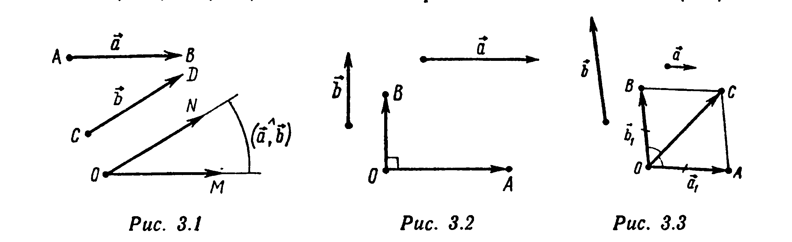
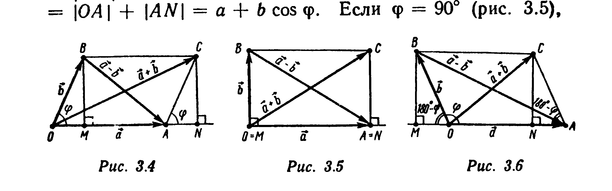

# Глава 3. Скалярное произведение векторов

## § 1. Угол между векторами. Определение скалярного произведения. Теорема косинусов

Углом между ненулевыми векторами $\vec a = \overrightarrow{AB}$ и $\vec b = \overrightarrow{CD}$ называется угол между лучами $[AB)$ и $[CD)$. Таким образом, если от одной точки $O$ отложить векторы $\overrightarrow{OM} = \vec a$ и $\overrightarrow{ON} = \vec b$ (рис. 3.1), то величина выпуклого угла $\angle MON$ есть, по определению, угол между векторами $\vec a$ и $\vec b$. Этот угол обозначается $(\vec a\widehat{,}\vec b)$. Если один из векторов $\vec a$ или $\vec b$ нулевой, то угол между $\vec a$ и $\vec b$ не определен.

Угол между векторами может принимать значения от 0 до 180°. Если ненулевые векторы сонаправлены, то угол между ними равен 0°. Угол между ненулевыми противоположно направленными векторами равен 180°. Если угол между ненулевыми векторами $\vec a$ и $\vec b$ равен 90°, то векторы $\vec a$ и $\vec b$ называют *ортогональными* и пишут $\vec a\perp\vec b$ (рис. 3.2). По определению, векторы $\vec a$ и $\vec b$ также считают ортогональными, если один из них нулевой.

---
**стр. 115**

---

**Пример 1.** Пусть $\vec a$ и $\vec b$ — ненулевые неколлинеарные векторы. Докажите, что вектор $\vec c = \vec a/|\vec a| + \vec b/|\vec b|$ образует равные углы с векторами $\vec a$ и $\vec b$.

△ Векторы $\vec a_1 = \vec a/|\vec a|$ и $\vec b_1 = \vec b/|\vec b|$ единичные: $|\vec a_1| = |\vec b_1| = 1$. Отложим их от одной точки: $\overrightarrow{OA} = \vec a_1$, $\overrightarrow{OB} = \vec b_1$ — и построим параллелограмм $OACB$ (рис. 3.3). Так как $|OA| = |OB|$, то $OACB$ — ромб. Его диагональ $(OC)$ является биссектрисой $\angle AOB$. Поэтому вектор диагонали $\vec c = \overrightarrow{OC} = \vec a_1+\vec b_1$ образует равные углы с векторами $\overrightarrow{OA} = \vec a_1$ и $\overrightarrow{OB} = \vec b_1$ и с сонаправленными им векторами $\vec a$ и $\vec b$. ▲

*Скалярным произведением* ненулевых векторов $\vec a$ и $\vec b$ называется число, равное произведению длин этих векторов на косинус угла между ними. Скалярное произведение обозначается $(\vec a, \vec b)$ или $\vec a\cdot\vec b$. Таким образом,
$$(\vec a, \vec b) = |\vec a||\vec b|\cos(\vec a\widehat{,}\vec b).$$

Если один из векторов нулевой, то скалярное произведение по определению равно нулю:
$$(\vec a, \vec 0) = (\vec 0, \vec b) = 0.$$

Если векторы $\vec a$ и $\vec b$ ненулевые, то косинус угла между ними находится по формуле
$$\cos(\vec a\widehat{,}\vec b) = \frac{(\vec a, \vec b)}{|\vec a||\vec b|}. \quad (3.1)$$

---
**стр. 116**

---

Скалярное произведение $(\vec a, \vec a)$, равное $|\vec a|^2$, называется *скалярным квадратом* вектора $\vec a$ и обозначается $(\vec a)^2$ или $\vec a^2$. Длина вектора $\vec a$ и его скалярный квадрат связаны соотношением
$$|\vec a| = \sqrt{(\vec a, \vec a)}. \quad (3.2)$$

Скалярное произведение векторов положительно, если угол между ними острый, и отрицательно, если угол между векторами тупой.

**Пример 2.** В прямоугольном треугольнике $ABC$ ($\widehat B = 90°$) $|AC| = b$, $\widehat A = \alpha$. Найдите $(\overrightarrow{CB}, \overrightarrow{CA})$.

△ Имеем: $(\overrightarrow{CB}, \overrightarrow{CA}) = \widehat C = 90° - \alpha$; $|\overrightarrow{CB}| = b\sin\alpha$, $|\overrightarrow{CA}| = b$. Поэтому
$$(\overrightarrow{CB}, \overrightarrow{CA}) = |\overrightarrow{CB}||\overrightarrow{CA}|\cos(\overrightarrow{CB}\widehat{,}\overrightarrow{CA}) = b\sin\alpha\, b\cos(90° - \alpha) = b^2\sin^2\alpha. \ ▲$$

**Пример 3.** Докажите, что скалярное произведение векторов равно нулю тогда и только тогда, когда эти векторы ортогональны.

△ Если векторы $\vec a$ и $\vec b$ ненулевые, т. е. $|\vec a|\neq 0$ и $|\vec b|\neq 0$, то
$$(\vec a, \vec b) = 0 \Leftrightarrow |\vec a||\vec b|\cos(\vec a\widehat{,}\vec b) = 0 \Leftrightarrow \cos(\vec a\widehat{,}\vec b) = 0 \Leftrightarrow \vec a\perp\vec b.$$

Если один из векторов $\vec a$ или $\vec b$ нулевой, то, по определению, они ортогональны. Также, по определению, $(\vec a, \vec b) = 0$. ▲

**Пример 4** (теорема косинусов). Докажите, что для любых векторов $\vec a$ и $\vec b$ справедливы следующие равенства:
$$(\vec a - \vec b)^2 = \vec a^2 + \vec b^2 - 2(\vec a, \vec b), \quad (3.3)$$
$$(\vec a + \vec b)^2 = \vec a^2 + \vec b^2 + 2(\vec a, \vec b). \quad (3.4)$$

□ Отложим векторы $\vec a$ и $\vec b$ от одной точки: $\overrightarrow{OA} = \vec a$,

---
**стр. 117**

---

$\overrightarrow{OB} = \vec b$.

Случай 1. Векторы $\vec a$ и $\vec b$ не коллинеарны. Рассмотрим параллелограмм $OBCA$ (рис. 3.4—3.6). Обозначим $a = |\vec a|$, $b = |\vec b|$, $\varphi = (\vec a\widehat{,}\vec b)$, $M$ и $N$ — основания перпендикуляров, опущенных на прямую $(OA)$ соответственно из точек $B$ и $C$. По теореме Пифагора, для прямоугольных треугольников $AMB$ и $ONC$
$$|AB|^2 = |AM|^2 + |MB|^2, \quad |OC|^2 = |ON|^2 + |NC|^2. \quad (3.5)$$
Если угол $\varphi$ острый (рис. 3.4), то $|AM| = |OA| - |OM| = a - b\cos\varphi$, $|MB| = |NC| = b\sin\varphi$, $|ON| = |OA| + |AN| = a + b\cos\varphi$. Если $\varphi = 90°$ (рис. 3.5),

то $|AM| = |OA| = a = a - b\cos\varphi$, $|MB| = |NC| = b = b\sin\varphi$, $|ON| = |OA| = a = a + b\cos\varphi$. Если угол $\varphi$ тупой (рис. 3.6), то $|AM| = |OA| + |OM| = a + b\cos(180° - \varphi) = a - b\cos\varphi$, $|MB| = |NC| = b\sin(180° - \varphi) = b\sin\varphi$, $|ON| = |OA| - |AN| = a + b\cos\varphi$. Таким образом, во всех случаях $|AM| = a - b\cos\varphi$, $|MB| = |NC| = b\sin\varphi$, $|ON| = a + b\cos\varphi$. Поэтому по формулам (3.5) имеем
$$(\vec a - \vec b)^2 = |AB|^2 = (a - b\cos\varphi)^2 + (b\sin\varphi)^2 = a^2 + b^2 - 2ab\cos\varphi = \vec a^2 + \vec b^2 - 2(\vec a, \vec b),$$
$$(\vec a + \vec b)^2 = |OC|^2 = (a + b\cos\varphi)^2 + (b\sin\varphi)^2 = a^2 + b^2 + 2ab\cos\varphi = \vec a^2 + \vec b^2 + 2(\vec a, \vec b).$$

Случай 2. Векторы $\vec a$ и $\vec b$ коллинеарны. Если $\vec b = \vec 0$, то соотношения (3.3) и (3.4) очевидны: $(\vec a\pm\vec 0)^2 = |\vec a|^2 = \vec a^2 + \vec 0^2 \pm 2(\vec a, \vec 0)$. Если же $\vec b\neq\vec 0$, то существует такое число $k$, что $\vec a = k\vec b$. Тогда $(\vec a\pm\vec b)^2 = |\vec a\pm\vec b|^2 = |(k\pm 1)\vec b|^2 = (|k\pm 1||\vec b|)^2 = (k\pm 1)^2|\vec b|^2 = (k^2+1\pm 2k)|\vec b|^2 =$

---
**стр. 118**

---

$= (|k||\vec b|)^2 + |\vec b|^2 \pm 2k|\vec b|^2 = \vec a^2 + \vec b^2 \pm 2k|\vec b|^2$. Если $k > 0$, то векторы $\vec a$ и $\vec b$ сонаправлены и $(\vec a, \vec b) = |\vec a||\vec b|\cos 0° = |\vec a||\vec b|\cdot 1 = |k\vec b||\vec b| = |k||\vec b||\vec b| = k|\vec b|^2$. Если $k = 0$, т. е. $\vec a = \vec 0$, то $(\vec a, \vec b) = 0 = 0\cdot|\vec b|^2 = k|\vec b|^2$. Если $k < 0$, т. е. векторы $\vec a$ и $\vec b$ противоположно направлены, то $(\vec a, \vec b) = |\vec a||\vec b|\cos 180° = |k\vec b||\vec b|\cdot(-1) = |k||\vec b||\vec b|\cdot(-1) = k|\vec b|^2$. Таким образом, во всех этих случаях $2k|\vec b|^2 = 2(\vec a, \vec b)$, так что $(\vec a\pm\vec b)^2 = \vec a^2 + \vec b^2 \pm 2(\vec a, \vec b)$. ■

**Пример 5.** Докажите, что сумма квадратов длин диагоналей параллелограмма равна сумме квадратов длин всех его сторон.

△ Если $\vec a = \overrightarrow{OA}$ и $\vec b = \overrightarrow{OB}$ — векторы сторон параллелограмма $OACB$ (рис. 3.4—3.6), то $\vec a + \vec b = \overrightarrow{OC}$ и $\vec a - \vec b = \overrightarrow{AB}$ — векторы его диагоналей. Складывая почленно равенства (3.3) и (3.4), получаем
$$(\vec a - \vec b)^2 + (\vec a + \vec b)^2 = 2\vec a^2 + 2\vec b^2. \quad (3.6)$$

Поскольку $|BC| = |OA| = |\vec a|$, $|AC| = |OB| = |\vec b|$, по формуле (3.6) получаем
$$|AB|^2 + |OC|^2 = (|OA|^2 + |BC|^2) + (|OB|^2 + |AC|^2). \ ▲$$

**Пример 6.** Дано: $|\vec a| = 11$, $|\vec b| = 23$, $|\vec a - \vec b| = 30$. Найдите $|\vec a + \vec b|$ и угол $(\vec a\widehat{,}\vec b)$.

△ По формуле (3.6),
$$|\vec a + \vec b| = \sqrt{2|\vec a|^2+2|\vec b|^2-|\vec a-\vec b|^2} = \sqrt{2\cdot 121+2\cdot 529-900} = 20.$$
По теореме косинусов [см. формулу (3.3)], $(\vec a, \vec b) = (1/2)(\vec a^2+\vec b^2-(\vec a-\vec b)^2) = -125$. Следовательно,
$$\cos(\vec a\widehat{,}\vec b) = \frac{(\vec a, \vec b)}{|\vec a||\vec b|} = -\frac{125}{253}, \text{ т. е.}$$
$$(\vec a\widehat{,}\vec b) = 180° - \arccos\frac{125}{253}. \ ▲$$

---
**стр. 119**

---

**Пример 7.** Найдите длины диагоналей ромба $OBCA$ (см. рис. 3.3), у которого длины сторон равны единице, а $\widehat{AOB} = \arcsin\dfrac{24}{25}$.

△ По теореме косинусов, $|AB|^2 = (\overrightarrow{OB}-\overrightarrow{OA})^2 = |\overrightarrow{OB}|^2+|\overrightarrow{OA}|^2-2(\overrightarrow{OB},\overrightarrow{OA}) = 2-2\cos\widehat{AOB}$. Поскольку $\angle AOB$ острый, $\cos\widehat{AOB} = \sqrt{1-\sin^2\widehat{AOB}} = \sqrt{1-(24/25)^2} = 7/25$. Поэтому $|AB| = \sqrt{2-2\cdot 7/25} = 6/5$. Аналогично, $|OC| = \sqrt{2+2\cos\widehat{AOB}} = 8/5$. ▲

**Пример 8.** Докажите, что векторы $\vec a$ и $\vec b$ ортогональны тогда и только тогда, когда $|\vec a+\vec b| = |\vec a-\vec b|$.

△ По формулам (3.3)—(3.4),
$$(1/4)(|\vec a+\vec b|^2-|\vec a-\vec b|^2) = (1/4)((\vec a^2+\vec b^2+2(\vec a,\vec b))-(\vec a^2+\vec b^2-2(\vec a,\vec b))) = (\vec a,\vec b). \quad (3.7)$$

Следовательно, равенство $|\vec a+\vec b| = |\vec a-\vec b|$ выполнено тогда и только тогда, когда $(\vec a,\vec b)=0$, т. е. когда $\vec a\perp\vec b$ (см. пример 3). ▲

**Пример 9.** Докажите, что $(\vec a+\vec b, \vec a-\vec b) = \vec a^2-\vec b^2$.

△ Пусть $\vec x=\vec a+\vec b$, $\vec y=\vec a-\vec b$, т. е. $\vec a=(1/2)(\vec x+\vec y)$, $\vec b=(1/2)(\vec x-\vec y)$. Тогда $|\vec a|=(1/2)|\vec x+\vec y|$, $|\vec b|=(1/2)|\vec x-\vec y|$ и по формуле (3.7) имеем
$$\vec a^2-\vec b^2 = (1/4)(|\vec x+\vec y|^2-|\vec x-\vec y|^2) = (\vec x,\vec y) = (\vec a+\vec b, \vec a-\vec b). \ ▲$$

**Пример 10.** В треугольнике $ABC$ $|AB|=c$, $|AC|=b$, $|BC|=a$. Найдите длину медианы $[CM]$.

△ Обозначим $m_c=|CM|$. Поскольку $\overrightarrow{CM}=(1/2)(\overrightarrow{CB}+\overrightarrow{CA})$, по формуле (3.4) находим $m_c^2=(1/4)(b^2+a^2+2(\overrightarrow{CB},\overrightarrow{CA}))$. Из равенства $c^2=|AB|^2=|\overrightarrow{CB}-\overrightarrow{CA}|^2=a^2+b^2-2(\overrightarrow{CB},\overrightarrow{CA})$ находим
$$(\overrightarrow{CB}, \overrightarrow{CA}) = (1/2)(a^2+b^2-c^2). \quad (3.8)$$
Следовательно, $m_c^2=(1/4)(b^2+a^2+a^2+b^2-c^2)$, т. е.
$$m_c^2 = (1/4)(2a^2+2b^2-c^2). \ ▲ \quad (3.9)$$

---
**стр. 120**

---

**Пример 11.** В треугольнике $ABC$ заданы длины сторон: $|AB|=c$, $|BC|=a$, $|AC|=b$. Проверьте, что
$$(\overrightarrow{AB},\overrightarrow{AC})+(\overrightarrow{BA},\overrightarrow{BC})+(\overrightarrow{CA},\overrightarrow{CB}) = (1/2)(a^2+b^2+c^2). \quad (3.10)$$

△ По формуле (3.8), $(\overrightarrow{CA},\overrightarrow{CB})=(1/2)(a^2+b^2-c^2)$. Аналогично, $(\overrightarrow{BA},\overrightarrow{BC})=(1/2)(a^2+c^2-b^2)$, $(\overrightarrow{AB},\overrightarrow{AC})=(1/2)(b^2+c^2-a^2)$. Складывая все три равенства почленно, получаем (3.10). ▲

**Пример 12.** В треугольнике $ABC$ $m_a$, $m_b$, $m_c$ — длины медиан, проведенных соответственно из вершин $A$, $B$, $C$. Докажите, что $\angle C$ тупой тогда и только тогда, когда
$$m_c^2 < \frac{m_a^2+m_b^2}{5}.$$

△ Угол $\angle C$ тупой тогда и только тогда, когда $(\overrightarrow{CB},\overrightarrow{CA})<0$, т. е. $x=a^2+b^2-c^2<0$ [в силу (3.8)]. По формуле (3.9), $4m_c^2=2a^2+2b^2-c^2$. Аналогично, $4m_b^2=2c^2+2a^2-b^2$, $4m_a^2=2b^2+2c^2-a^2$. Складывая эти равенства почленно, имеем $4(m_a^2+m_b^2+m_c^2)=3(a^2+b^2+c^2)$. Поэтому $3c^2=2(a^2+b^2+c^2)-4m_c^2$, т. е. $c^2=(4/9)(2m_a^2+2m_b^2-m_c^2)$. Аналогично, $a^2=(4/9)(2m_b^2+2m_c^2-m_a^2)$, $b^2=(4/9)(2m_c^2+2m_a^2-m_b^2)$. Отсюда $x=a^2+b^2-c^2=(4/9)(5m_c^2-m_a^2-m_b^2)$, т. е. $x<0 \Leftrightarrow 5m_c^2<m_a^2+m_b^2$. ▲

**Пример 13** (формула Герона). Выразите площадь треугольника $ABC$ через длины его сторон $a=|BC|$, $b=|AC|$, $c=|AB|$.

△ Обозначим $\vec a=\overrightarrow{CB}$, $\vec b=\overrightarrow{CA}$, $\varphi=(\vec a\widehat{,}\vec b)$, $S$ — площадь $\triangle ABC$. Известно, что $S=(1/2)ab\sin\varphi$. Поэтому $S^2=(1/4)a^2b^2(1-\cos^2\varphi)=(1/4)(a^2b^2-(\vec a,\vec b)^2)$. По формуле (3.8), $(\vec a,\vec b)=(1/2)(a^2+b^2-c^2)$. Следовательно,
$$S^2 = \frac14\left(a^2b^2-\left(\frac{a^2+b^2-c^2}{2}\right)^2\right) = \frac14\left(ab+\frac{a^2+b^2-c^2}{2}\right)\times$$
$$\times\left(ab-\frac{a^2+b^2-c^2}{2}\right) = \frac{1}{16}((a+b)^2-c^2)(c^2-(a-b)^2) =$$
$$= \frac{1}{16}(a+b+c)(a+b-c)(c+a-b)(c-a+b).$$

---
**стр. 121**

---

Обозначая $p=(1/2)(a+b+c)$, находим $a+b-c=2(p-c)$, $c+a-b=2(p-b)$, $c-a+b=2(p-a)$, так что
$$S^2 = \frac{1}{16}\cdot 2p\cdot 2(p-c)\cdot 2(p-b)\cdot 2(p-a) =$$
$$= p(p-a)(p-b)(p-c), \text{ т. е. } S=\sqrt{p(p-a)(p-b)(p-c)}. \ ▲$$
