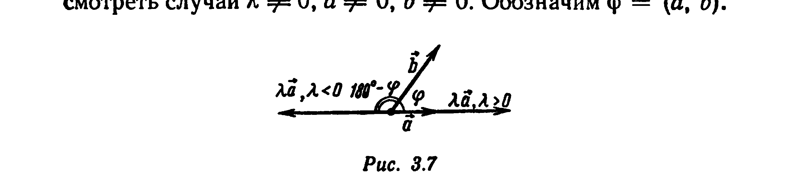
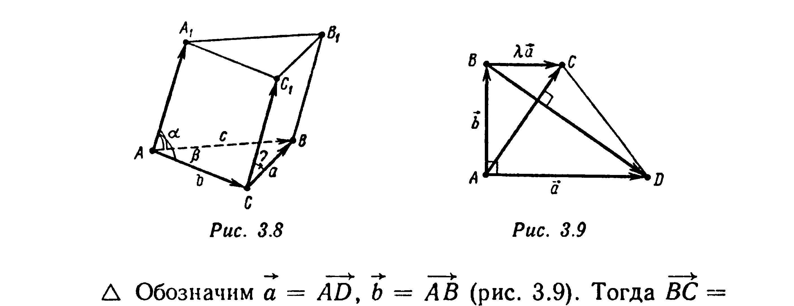
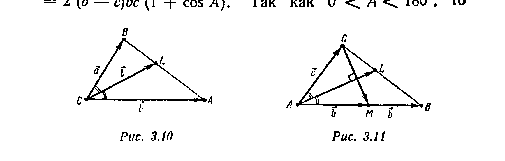
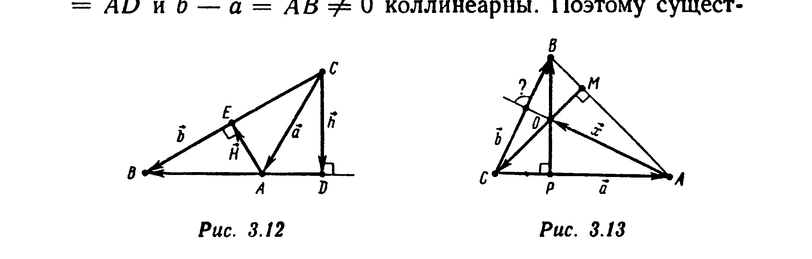
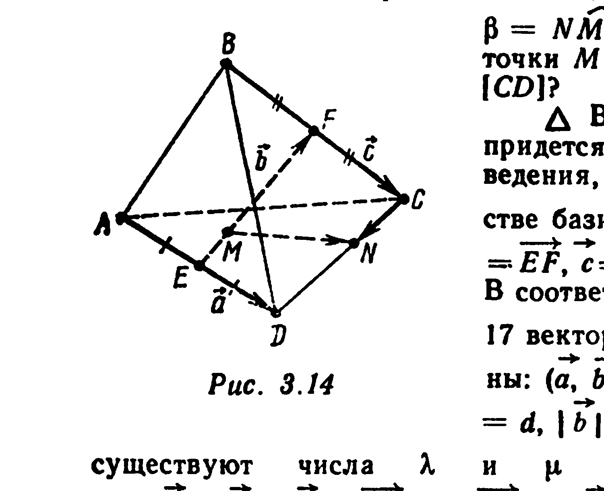
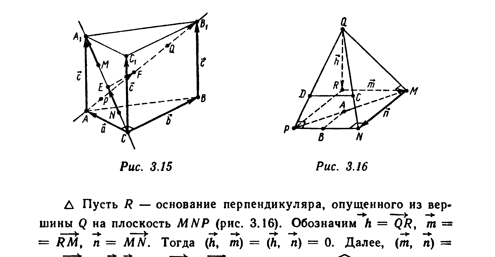
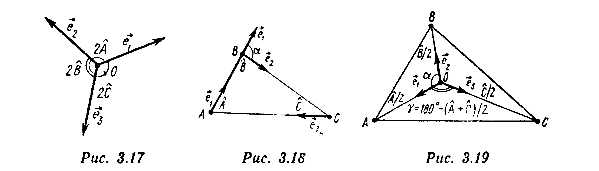
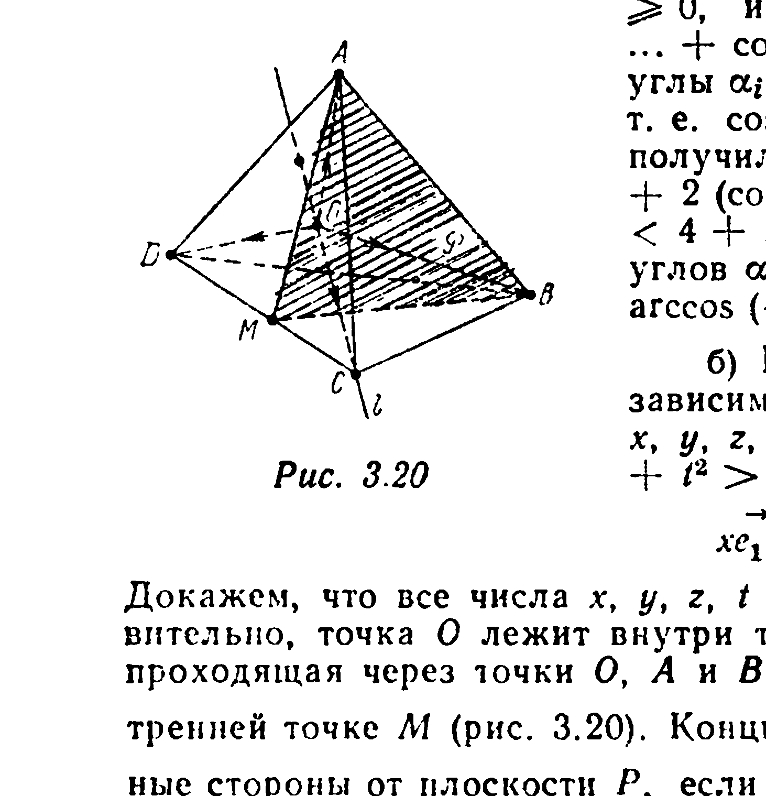

# Глава 3. Скалярное произведение векторов

## § 2. Свойства скалярного произведения

Для любых векторов $\vec a, \vec b, \vec c$ и любого числа $\lambda$ справедливы соотношения:

$1^\circ$. $(\vec a, \vec b) = (\vec b, \vec a)$ (коммутативность).

$2^\circ$. $(\lambda\vec a, \vec b) = \lambda(\vec a, \vec b)$.

$3^\circ$. $(\vec a+\vec b, \vec c) = (\vec a,\vec c)+(\vec b,\vec c)$ (дистрибутивность).

□ Свойство $1^\circ$ следует из определения скалярного произведения и того факта, что для ненулевых векторов $\vec a$ и $\vec b$ $(\vec a\widehat{,}\vec b)=(\vec b\widehat{,}\vec a)$.

Если $\vec a=\vec 0$ или $\vec b=\vec 0$, то при любом $\lambda$ свойство $2^\circ$ следует из определения скалярного произведения. Оно также справедливо при любых $\vec a$ и $\vec b$, если $\lambda=0$. Осталось рассмотреть случай $\lambda\neq 0$, $\vec a\neq\vec 0$, $\vec b\neq\vec 0$. Обозначим $\varphi=(\vec a\widehat{,}\vec b)$.

Тогда если $\lambda>0$, то $(\lambda\vec a\widehat{,}\vec b)=(\vec a\widehat{,}\vec b)$ (рис. 3.7), поэтому $(\lambda\vec a,\vec b)=|\lambda\vec a||\vec b|\cos(\lambda\vec a\widehat{,}\vec b)=\lambda|\vec a||\vec b|\cos\varphi=\lambda(\vec a,\vec b)$. Если же $\lambda<0$, то $(\lambda\vec a\widehat{,}\vec b)=180°-\varphi$ (рис. 3.7) и $(\lambda\vec a,\vec b)=|\lambda\vec a||\vec b|\cos(\lambda\vec a\widehat{,}\vec b)=|\lambda||\vec a||\vec b|\cos(180°-\varphi)=(-\lambda)\times|\vec a||\vec b|(-\cos\varphi)=\lambda(\vec a,\vec b)$. Свойство $2^\circ$ доказано.

---
**стр. 122**

---

Для доказательства свойства $3^\circ$ используем формулу
$$0=(\vec m+\vec n)^2+(\vec m-\vec n)^2-2(\vec m^2+\vec n^2) \quad (3.11)$$
[см. формулу (3.6)], в которой положим $\vec m=(\vec a+\vec b)/2+\vec c$, $\vec n=(\vec a-\vec b)/2$. Имеем $\vec m+\vec n=\vec a+\vec c$, $\vec m-\vec n=\vec b+\vec c$. По теореме косинусов,
$$(\vec m+\vec n)^2=(\vec a+\vec c)^2=\vec a^2+\vec c^2+2(\vec a,\vec c),$$
$$(\vec m-\vec n)^2=(\vec b+\vec c)^2=\vec b^2+\vec c^2+2(\vec b,\vec c),$$
$$\vec m^2=\left(\frac{\vec a+\vec b}{2}+\vec c\right)^2=\left(\frac{\vec a+\vec b}{2}\right)^2+\vec c^2+2\left(\frac{\vec a+\vec b}{2},\vec c\right).$$

Согласно свойству $2^\circ$ скалярного произведения,
$$2\left(\frac{\vec a+\vec b}{2},\vec c\right)=2\cdot\frac12(\vec a+\vec b,\vec c)=(\vec a+\vec b,\vec c).$$

Далее, $\left(\dfrac{\vec a+\vec b}{2}\right)^2=\left|\dfrac{\vec a+\vec b}{2}\right|^2=\dfrac14|\vec a+\vec b|^2=\dfrac14(\vec a^2+\vec b^2+2(\vec a,\vec b))$. Аналогично, $\vec n^2=\left(\dfrac{\vec a-\vec b}{2}\right)^2=\dfrac14(\vec a^2+\vec b^2-2(\vec a,\vec b))$ [см. формулу (3.3)].

Подставляя полученные выражения в формулу (3.11), получаем
$$0=\vec a^2+\vec c^2+2(\vec a,\vec c)+\vec b^2+\vec c^2+2(\vec b,\vec c)-$$
$$-2\left(\left(\frac14(\vec a^2+\vec b^2+2(\vec a,\vec b))+\vec c^2+(\vec a+\vec b,\vec c)\right)+\right.$$
$$\left.+\frac14(\vec a^2+\vec b^2-2(\vec a,\vec b))\right)=2((\vec a,\vec c)+(\vec b,\vec c)-$$
$$-(\vec a+\vec b,\vec c)),\ (\vec a+\vec b,\vec c)=(\vec a,\vec c)+(\vec b,\vec c). \ ■$$

**Пример 1.** Докажите, что для любых векторов $\vec a,\vec b,\vec c,\vec p$ и $\vec q$ и любых чисел $x_1,y_1,z_1,x_2,y_2,z_2$ верны следующие равенства:
$$(x_1\vec a+y_1\vec b+z_1\vec c,\vec q) = x_1(\vec a,\vec q)+y_1(\vec b,\vec q)+z_1(\vec c,\vec q), \quad (3.12)$$

---
**стр. 123**

---

$$(\vec p,x_2\vec a+y_2\vec b+z_2\vec c) = x_2(\vec p,\vec a)+y_2(\vec p,\vec b)+z_2(\vec p,\vec c), \quad (3.13)$$
$$(x_1\vec a+y_1\vec b+z_1\vec c,\, x_2\vec a+y_2\vec b+z_2\vec c) = x_1x_2\vec a^2+y_1y_2\vec b^2+$$
$$+(x_1y_2+x_2y_1)(\vec a,\vec b)+z_1z_2\vec c^2+(x_1z_2+x_2z_1)(\vec a,\vec c)+$$
$$+(y_1z_2+y_2z_1)(\vec b,\vec c) \quad (3.14)$$

[формулы (3.12), (3.13) означают, что скалярное произведение обладает свойством линейности по каждому из сомножителей, формула (3.14) — общая формула для вычисления скалярного произведения векторов, заданных своими координатами в базисе $\{\vec a,\vec b,\vec c\}$].

□ Согласно свойству $3^\circ$, $(x_1\vec a+y_1\vec b+z_1\vec c,\vec q)=(x_1\vec a+(y_1\vec b+z_1\vec c),\vec q)=(x_1\vec a,\vec q)+(y_1\vec b+z_1\vec c,\vec q)=x_1(\vec a,\vec q)+(y_1\vec b,\vec q)+(z_1\vec c,\vec q)=x_1(\vec a,\vec q)+y_1(\vec b,\vec q)+z_1(\vec c,\vec q)$ (здесь использовано свойство $2^\circ$). Равенство (3.12) доказано.

На основании свойства $1^\circ$ и формулы (3.12) $(\vec p,x_2\vec a+y_2\vec b+z_2\vec c)=(x_2\vec a+y_2\vec b+z_2\vec c,\vec p)=x_2(\vec a,\vec p)+y_2(\vec b,\vec p)+z_2(\vec c,\vec p)=x_2(\vec p,\vec a)+y_2(\vec p,\vec b)+z_2(\vec p,\vec c)$. Равенство (3.13) доказано.

Обозначая $\vec p=x_1\vec a+y_1\vec b+z_1\vec c$, $\vec q=x_2\vec a+y_2\vec b+z_2\vec c$, получим на основании формул (3.12), (3.13)
$$(\vec p,\vec q)=(x_1\vec a+y_1\vec b+z_1\vec c,\vec q)=x_1(\vec a,\vec q)+y_1(\vec b,\vec q)+$$
$$+z_1(\vec c,\vec q)=x_1(\vec a,x_2\vec a+y_2\vec b+z_2\vec c)+y_1(\vec b,x_2\vec a+$$
$$+y_2\vec b+z_2\vec c)+z_1(\vec c,x_2\vec a+y_2\vec b+z_2\vec c)=$$
$$=x_1(x_2(\vec a,\vec a)+y_2(\vec a,\vec b)+z_2(\vec a,\vec c))+$$
$$+y_1(x_2(\vec a,\vec b)+y_2(\vec b,\vec b)+z_2(\vec b,\vec c))+$$
$$+z_1(x_2(\vec a,\vec c)+y_2(\vec b,\vec c)+z_2(\vec c,\vec c))=x_1x_2\vec a^2+y_1y_2\vec b^2+$$
$$+(x_1y_2+x_2y_1)(\vec a,\vec b)+z_1z_2\vec c^2+(x_1z_2+x_2z_1)(\vec a,\vec c)+$$
$$+(y_1z_2+y_2z_1)(\vec b,\vec c).$$

---
**стр. 124**

---

Формула (3.14) доказана. ■ При $\vec c=\vec 0$ она принимает вид
$$(x_1\vec a+y_1\vec b, x_2\vec a+y_2\vec b) = x_1x_2\vec a^2+y_1y_2\vec b^2+$$
$$+(x_1y_2+x_2y_1)(\vec a,\vec b). \quad (3.15)$$

**Пример 2.** Векторы $\vec a$, $\vec b$ и $\vec c$ удовлетворяют условию $\vec a+\vec b+2\vec c=\vec 0$. Вычислите величину $\mu=(\vec a,\vec b)+(\vec b,\vec c)+(\vec c,\vec a)$, если $|\vec a|=1$, $|\vec b|=4$, $|\vec c|=2$.

△ Так как $-\vec c=\vec a+\vec b+\vec c$, то $4=\vec c^2=(-\vec c,-\vec c)=(\vec a+\vec b+\vec c,\vec a+\vec b+\vec c)=\vec a^2+\vec b^2+\vec c^2+2(\vec a,\vec b)+2(\vec b,\vec c)+2(\vec c,\vec a)=1+16+4+2\mu$. Таким образом, $\mu=-17/2$. ▲

**Пример 3.** Пусть $\vec a$ и $\vec b$ — единичные векторы. Вычислите $(3\vec a-4\vec b, 2\vec a+5\vec b)$, если $|\vec a+\vec b|=\sqrt3$.

△ $3=|\vec a+\vec b|^2=\vec a^2+\vec b^2+2(\vec a,\vec b)=1+1+2(\vec a,\vec b)$. Отсюда $(\vec a,\vec b)=1/2$. Следовательно, по формуле (3.15),
$$(3\vec a-4\vec b, 2\vec a+5\vec b) = 6\vec a^2-20\vec b^2+7(\vec a,\vec b) = 6-20+$$
$$+7/2 = -21/2. \ ▲$$

**Пример 4.** Дано: $|\vec a|=3$, $|\vec b|=2$, $(\vec a\widehat{,}\vec b)=120°$. Найдите длины векторов $\vec p=\vec a+2\vec b$ и $\vec q=2\vec a-\vec b$, их скалярное произведение и угол $\varphi$ между ними.

△ $(\vec a,\vec b)=3\cdot 2\cdot\cos 120°=-3$. По формуле (3.15),
$$|\vec p|^2=(\vec p,\vec p)=(\vec a+2\vec b,\vec a+2\vec b)=\vec a^2+4(\vec a,\vec b)+4\vec b^2=$$
$$=9+(-12)+16=13, \text{ т. е. } |\vec p|=\sqrt{13}; \quad |\vec q|^2=(\vec q,\vec q)=$$
$$=(2\vec a-\vec b, 2\vec a-\vec b)=4\vec a^2-4(\vec a,\vec b)+\vec b^2=52, \text{ т. е. } |\vec q|=$$
$$=2\sqrt{13};$$
$$(\vec p,\vec q)=(\vec a+2\vec b, 2\vec a-\vec b)=2\vec a^2+3(\vec a,\vec b)-2\vec b^2=$$
$$=18+(-9)-8=1, \quad \cos\varphi=(\vec p,\vec q)/(|\vec p||\vec q|)=$$
$$=1/(\sqrt{13}\cdot 2\sqrt{13})=1/26, \quad \varphi=\arccos(1/26). \ ▲$$

**Пример 5.** Длины ненулевых векторов $\vec a$ и $\vec b$ равны. Найдите угол $\varphi$ между этими векторами, если известно, что векторы $\vec p=\vec a+3\vec b$ и $\vec q=5\vec a+3\vec b$ ортогональны.

---
**стр. 125**

---

△ Так как $\vec p\perp\vec q$, то $0=(\vec p,\vec q)=(\vec a+3\vec b, 5\vec a+3\vec b)=5\vec a^2+18(\vec a,\vec b)+9\vec b^2=5|\vec a|^2+18|\vec a||\vec b|\cos\varphi+9|\vec b|^2$. Учитывая, что $|\vec a|=|\vec b|\neq 0$, находим отсюда $\cos\varphi=-7/9$, т. е. $\varphi=180°-\arccos(7/9)$. ▲

**Пример 6.** В треугольнике $ABC$ проведены медианы $[AD]$, $[BE]$ и $[CF]$. Вычислите величину $\lambda=(\overrightarrow{BC},\overrightarrow{AD})+(\overrightarrow{CA},\overrightarrow{BE})+(\overrightarrow{AB},\overrightarrow{CF})$.

△ Пусть $\vec a=\overrightarrow{CA}$, $\vec b=\overrightarrow{CB}$. Тогда $\overrightarrow{BC}=-\vec b$, $\overrightarrow{AD}=-\vec a+(1/2)\vec b$, $\overrightarrow{BE}=(1/2)\vec a-\vec b$, $\overrightarrow{AB}=\vec b-\vec a$, $\overrightarrow{CF}=(1/2)(\vec a+\vec b)$. Следовательно, по формуле (3.15),
$$\lambda=(-\vec b,-\vec a+(1/2)\vec b)+(\vec a,(1/2)\vec a-\vec b)+$$
$$+(\vec b-\vec a,(1/2)\vec a+(1/2)\vec b)=(\vec a,\vec b)-(1/2)\vec b^2+(1/2)\vec a^2-$$
$$-(\vec a,\vec b)-(1/2)\vec a^2+(1/2)\vec b^2=0. \ ▲$$

**Пример 7.** Докажите, что при любом расположении точек $A$, $B$, $C$, $D$ на плоскости или в пространстве имеет место равенство $\mu=0$, где $\mu=(\overrightarrow{BC},\overrightarrow{AD})+(\overrightarrow{CA},\overrightarrow{BD})+(\overrightarrow{AB},\overrightarrow{CD})$.

△ Пусть $\vec a=\overrightarrow{DA}$, $\vec b=\overrightarrow{DB}$, $\vec c=\overrightarrow{DC}$. Тогда $\overrightarrow{BC}=\vec c-\vec b$, $\overrightarrow{AD}=-\vec a$, $\overrightarrow{CA}=\vec a-\vec c$, $\overrightarrow{BD}=-\vec b$, $\overrightarrow{AB}=\vec b-\vec a$, $\overrightarrow{CD}=-\vec c$. Следовательно,
$$\mu=(\vec c-\vec b,-\vec a)+(\vec a-\vec c,-\vec b)+(\vec b-\vec a,-\vec c)=$$
$$=-(\vec a,\vec c)+(\vec a,\vec b)-(\vec a,\vec b)+(\vec b,\vec c)-(\vec b,\vec c)+(\vec a,\vec c)=0. \ ▲$$

**Пример 8.** В треугольной призме $ABCA_1B_1C_1$ $|AB|=c$, $|BC|=a$, $|CA|=b$, $\widehat{BAA_1}=\alpha$, $\widehat{CAA_1}=\beta$ (рис. 3.8). Найдите $\widehat{BCC_1}$.

$$\triangle \cos\widehat{BCC_1} = \frac{(\overrightarrow{CB},\overrightarrow{CC_1})}{|\overrightarrow{CB}||\overrightarrow{CC_1}|} = \frac{(\overrightarrow{AB}-\overrightarrow{AC},\overrightarrow{AA_1})}{|\overrightarrow{CB}||\overrightarrow{AA_1}|} =$$
$$= \frac{(\overrightarrow{AB},\overrightarrow{AA_1})-(\overrightarrow{AC},\overrightarrow{AA_1})}{|\overrightarrow{CB}||\overrightarrow{AA_1}|} = (|\overrightarrow{AB}||\overrightarrow{AA_1}|\cos\alpha -$$
$$-|\overrightarrow{AC}||\overrightarrow{AA_1}|\cos\beta)/(|\overrightarrow{CB}||\overrightarrow{AA_1}|) = (c\cos\alpha-b\cos\beta)/a.$$

---
**стр. 126**

---

В частности, если $\triangle ABC$ — правильный, то $\cos\alpha-\cos\beta=\cos\widehat{BCC_1}$. ▲

**Пример 9.** В прямоугольной трапеции $ABCD$ диагонали взаимно перпендикулярны, а отношение длин оснований $|BC|:|AD|=\lambda$. Найдите отношение длин диагоналей.

△ Обозначим $\vec a=\overrightarrow{AD}$, $\vec b=\overrightarrow{AB}$ (рис. 3.9). Тогда $\overrightarrow{BC}=\lambda\vec a$, $\overrightarrow{AC}=\vec b+\lambda\vec a$, $\overrightarrow{BD}=\vec a-\vec b$. По условию, $(\vec a,\vec b)=0$ и $(\overrightarrow{AC},\overrightarrow{BD})=0$, т. е. $0=(\vec b+\lambda\vec a,\vec a-\vec b)=\lambda\vec a^2+(1-\lambda)(\vec a,\vec b)-\vec b^2=\lambda\vec a^2-\vec b^2$. Таким образом, $\vec b^2=\lambda\vec a^2$, а искомое отношение равно
$$|AC|:|BD| = \sqrt{(\overrightarrow{AC},\overrightarrow{AC})/(\overrightarrow{BD},\overrightarrow{BD})} =$$
$$= \sqrt{\frac{(\vec b+\lambda\vec a,\vec b+\lambda\vec a)}{(\vec a-\vec b,\vec a-\vec b)}} = \sqrt{\frac{\vec b^2+2\lambda(\vec a,\vec b)+\lambda^2\vec a^2}{\vec a^2+\vec b^2-2(\vec a,\vec b)}} =$$
$$= \sqrt{\frac{\vec b^2+\lambda^2\vec a^2}{\vec a^2+\vec b^2}} = \sqrt{\frac{\lambda\vec a^2+\lambda^2\vec a^2}{\vec a^2+\lambda\vec a^2}} = \sqrt\lambda. \ ▲$$

**Пример 10.** Определите угол между диагоналями $[AC]$ и $[BD]$ выпуклого четырехугольника $ABCD$, если $|AB|^2+|CD|^2=|BC|^2+|AD|^2$.

△ Обозначим $\vec a=\overrightarrow{DA}$, $\vec b=\overrightarrow{DB}$, $\vec c=\overrightarrow{DC}$. Тогда $\overrightarrow{AB}=\vec b-\vec a$, $\overrightarrow{BC}=\vec c-\vec b$ и, по условию, $(\vec b-\vec a)^2+\vec c^2=(\vec c-\vec b)^2+\vec a^2$, т. е. $(\vec a,\vec b)=(\vec c,\vec b)$. Поэтому $(\overrightarrow{AC},\overrightarrow{BD})=(\vec c-\vec a,-\vec b)=(\vec a,\vec b)-(\vec c,\vec b)=0$. Значит, диагонали $[AC]$ и $[BD]$ перпендикулярны. ▲

---
**стр. 127**

---

**Пример 11.** Выразите вектор биссектрисы $\vec l=\overrightarrow{CL}$ треугольника $ABC$ через векторы $\vec a=\overrightarrow{CB}$ и $\vec b=\overrightarrow{CA}$ его сторон и их длины $a=|\vec a|$, $b=|\vec b|$.

△ Углы $\widehat{ACL}$ и $\widehat{LCB}$ (рис. 3.10) равны, поэтому равны их косинусы: $(\vec b,\vec l)/(|\vec b||\vec l|)=(\vec a,\vec l)/(|\vec a||\vec l|)$, т. е. $0=(a\vec b-b\vec a,\vec l)$. Точка $L$ делит отрезок $[AB]$ в некотором (неизвестном) отношении $\lambda=|AL|:|AB|$. Поэтому $\vec l=(\vec a+\lambda\vec b)/(\lambda+1)$ и, следовательно, $0=a(\vec a,\vec b)-ba^2+\lambda ab^2-\lambda b(\vec a,\vec b)$. Таким образом, $\lambda=a(ab-(\vec a,\vec b))/(b(ab-(\vec a,\vec b)))=a/b$, так как $ab-(\vec a,\vec b)=ab(1-\cos\widehat C)>0$, и
$$\vec l = \frac{\vec a+(a/b)\vec b}{1+(a/b)} = \frac{a\vec b+b\vec a}{a+b}. \ ▲$$

**Пример 12.** Выразите длину биссектрисы $[CL]$ треугольника $ABC$ через длины его сторон $a=|BC|$, $b=|AC|$, $c=|AB|$.

△ Обозначим $\vec a=\overrightarrow{CB}$, $\vec b=\overrightarrow{CA}$. Тогда $a=|\vec a|$, $b=|\vec b|$. По формуле из примера 11, $\overrightarrow{CL}=(a\vec b+b\vec a)/(a+b)$. Поэтому
$$|\overrightarrow{CL}|^2 = \frac{1}{(a+b)^2}(a\vec b+b\vec a)^2 = \frac{1}{(a+b)^2}((a\vec b)^2+(b\vec a)^2+$$
$$+2(a\vec b,b\vec a)) = \frac{1}{(a+b)^2}(2a^2b^2+2ab(\vec a,\vec b)) =$$
$$= \frac{2ab}{(a+b)^2}(ab+(\vec a,\vec b)).$$

В силу формулы (3.8) $(\vec a,\vec b)=(1/2)(a^2+b^2-c^2)$. Следовательно,
$$|\overrightarrow{CL}|^2 = \frac{2ab}{(a+b)^2}\cdot\frac{2ab+a^2+b^2-c^2}{2} = ab-\frac{abc^2}{(a+b)^2}. \ ▲$$

**Пример 13.** Докажите, что если в треугольнике $ABC$ длины двух биссектрис равны, то этот треугольник — равнобедренный.

△ Если $[CL]$ и $[AM]$ — биссектрисы углов соответственно $\angle C$ и $\angle A$, то по формуле из примера 12 имеем
$$|CL|^2 = ab-abc^2/(a+b)^2, \quad |AM|^2 = bc-bca^2/(b+c)^2.$$

---
**стр. 128**

---

Таким образом, если $|CL|=|AM|$, то $a-ac^2/(a+b)^2=c-ca^2/(b+c)^2$, или
$$a-c = \frac{ac(c(b+c)^2-a(a+b)^2)}{(a+b)^2(b+c)^2} =$$
$$= \frac{ac(c^3-a^3+2b(c^2-a^2)+b^2(c-a))}{(a+b)^2(b+c)^2}.$$

Отсюда
$$(a-c)\left(1+\frac{ac(c^2+ac+a^2+2b(c+a)+b^2)}{(a+b)^2(b+c)^2}\right)=0, \text{ т. е. } a=c. \ ▲$$

**Пример 14.** В треугольнике $ABC$ медиана $[CM]$ перпендикулярна биссектрисе $[AL]$, причем $|CM|:|AL|=n$. Найдите угол $\widehat A$.

△ Обозначим $\overrightarrow{AB}=2\vec b$, $\vec c=\overrightarrow{AC}$, $b=|\vec b|$, $c=|\vec c|$, $\widehat A=(\vec b\widehat{,}\vec c)$. Тогда $\overrightarrow{CM}=\vec b-\vec c$, $\overrightarrow{AL}=(2b\vec c+c2\vec b)/(2b+c)$ (см. пример 11). По условию, $(\overrightarrow{AL},\overrightarrow{CM})=0$, т. е. $0=(2b\vec c+2c\vec b,\vec b-\vec c)=2(cb^2-bc^2+(b-c)(\vec b,\vec c))=2(b-c)bc(1+\cos\widehat A)$. Так как $0°<\widehat A<180°$, то

$bc(1+\cos\widehat A)\neq 0$ и, значит, $b=c$. [В этом можно было убедиться и геометрически (рис. 3.11): по условию задачи, в $\triangle ACM$ биссектриса $\angle A$ является и высотой, а значит, треугольник $ACM$ равнобедренный: $|AC|=|AM|$.]

Таким образом,
$$\overrightarrow{AL}=(2/3)(\vec b+\vec c), \quad |AL|^2=(4/9)(\vec b^2+\vec c^2+2(\vec b,\vec c))=$$
$$=(4/9)(2b^2+2b^2\cos\widehat A)=(8/9)b^2(1+\cos\widehat A), \quad |CM|^2=$$
$$=(\vec b-\vec c)^2=\vec b^2+\vec c^2-2(\vec b,\vec c)=2b^2-2b^2\cos\widehat A=$$
$$=2b^2(1-\cos\widehat A).$$

---
**стр. 129**

---

Следовательно,
$$n^2 = |CM|^2:|AL|^2 = \frac{9(1-\cos\widehat A)}{4(1+\cos\widehat A)}.$$

Отсюда находим $\cos\widehat A=(9-4n^2)/(9+4n^2)$. ▲

**Пример 15.** В треугольнике $ABC$ $|AC|=1$, $|BC|=2$, $\widehat C=\arccos(3/4)$. Выразите через векторы $\vec a=\overrightarrow{CA}$ и $\vec b=\overrightarrow{CB}$ векторы высот $\overrightarrow{CD}$ и $\overrightarrow{AE}$ (рис. 3.12).

△ Обозначим $\overrightarrow{CD}=\vec h$, $\overrightarrow{AE}=\vec H$. Векторы $\vec h-\vec a=\overrightarrow{AD}$ и $\vec b-\vec a=\overrightarrow{AB}\neq\vec 0$ коллинеарны. Поэтому суще-

ствует такое число $t$, что $\vec h-\vec a=t(\vec b-\vec a)$. Найдем $t$ из условия ортогональности векторов $\overrightarrow{CD}$ и $\overrightarrow{AB}$: $0=(\overrightarrow{CD},\overrightarrow{AB})=(\vec h,\vec b-\vec a)=(\vec a+t(\vec b-\vec a),\vec b-\vec a)=(\vec a,\vec b)-\vec a^2+t(\vec b-\vec a)^2$. Отсюда
$$t = \frac{\vec a^2-(\vec a,\vec b)}{\vec a^2+\vec b^2-2(\vec a,\vec b)} = \frac{a(a-b\cos\widehat C)}{a^2+b^2-2ab\cos\widehat C} =$$
$$= \frac{1-1\cdot 2\cdot 3/4}{1+4-2\cdot 1\cdot 2\cdot 3/4} = -\frac14,$$

так как $a=|\vec a|=1$, $b=|\vec b|=2$. Следовательно, $\vec h=\vec a-(1/4)(\vec b-\vec a)=(5\vec a-\vec b)/4$. Аналогично, вектор $\vec H=\overrightarrow{AC}+\overrightarrow{CE}$ можно представить в виде $\vec H=-\vec a+\lambda\vec b$, где число $\lambda$ находится из условия $(\vec H,\vec b)=0$: $-(\vec a,\vec b)+\lambda\vec b^2=0$, т. е. $\lambda=(\vec a,\vec b)/\vec b^2=(a\cos\widehat C)/b=3/8$. Значит, $\vec H=-\vec a+(3/8)\vec b$. ▲

**Пример 16.** Докажите, что в треугольнике высоты пересекаются в одной точке.

---
**стр. 130**

---

□ Проведем в треугольнике $ABC$ (рис. 3.13) высоты $[CM]$ и $[BP]$ и обозначим через $O$ точку пересечения прямых $(CM)$ и $(BP)$. Для доказательства утверждения примера достаточно установить, что прямая $(AO)$ перпендикулярна прямой $(BC)$, т. е. что $(\overrightarrow{AO},\overrightarrow{BC})=0$. Обозначим $\vec a=\overrightarrow{CA}$, $\vec b=\overrightarrow{CB}$, $\vec x=\overrightarrow{AO}$. Тогда $\overrightarrow{AB}=\vec b-\vec a$, $\overrightarrow{OC}=-\vec x-\vec a$, $\overrightarrow{OB}=\overrightarrow{OC}+\overrightarrow{CB}=\vec b-\vec x-\vec a$. По определению высоты, $(\overrightarrow{OC},\overrightarrow{AB})=0$, т. е. $(-\vec x-\vec a,\vec b-\vec a)=0$. Отсюда $(\vec x,\vec a)-(\vec x,\vec b)=(\vec a,\vec b)-\vec a^2$. Аналогично, $(\overrightarrow{OB},\overrightarrow{CA})=0$, т. е. $(\vec b-\vec x-\vec a,\vec a)=0$. Отсюда $(\vec x,\vec a)=(\vec a,\vec b)-\vec a^2$. Таким образом, $(\vec x,\vec a)=(\vec x,\vec a)-(\vec x,\vec b)$ и, значит, $(\vec x,\vec b)=0$, т. е. $(\overrightarrow{AO},\overrightarrow{BC})=0$. ■

**Пример 17.** В правильном тетраэдре $ABCD$ точки $E$ и $F$ — середины ребер соответственно $[AD]$ и $[CB]$. Докажите, что векторы $\overrightarrow{AD}$, $\overrightarrow{FE}$ и $\overrightarrow{CB}$ попарно ортогональны, причем $|FE|=\dfrac{|AD|}{\sqrt2}$.

△ Обозначим $\vec a=\overrightarrow{DA}$, $\vec b=\overrightarrow{DB}$, $\vec c=\overrightarrow{DC}$, $a=|\vec a|=|\vec b|=|\vec c|$. Так как $(\vec a\widehat{,}\vec b)=(\vec a\widehat{,}\vec c)=(\vec b\widehat{,}\vec c)=60°$, то $(\vec a,\vec b)=(\vec a,\vec c)=(\vec b,\vec c)=(1/2)a^2$. Значит, $(\overrightarrow{AD},\overrightarrow{CB})=(-\vec a,\vec b-\vec c)=-(\vec a,\vec b)+(\vec a,\vec c)=0$, т. е. $\overrightarrow{AD}\perp\overrightarrow{CB}$. Далее, $\overrightarrow{FE}=\overrightarrow{FB}+\overrightarrow{BD}+\overrightarrow{DE}=(1/2)\overrightarrow{CB}-\overrightarrow{BD}+(1/2)\overrightarrow{DA}=(1/2)(\vec b-\vec c)-\vec b+(1/2)\vec a=(1/2)(\vec a-\vec b-\vec c)$. Поэтому
$$|FE|=(1/2)|\vec a-\vec b-\vec c|=(1/2)\sqrt{(\vec a-\vec b-\vec c,\vec a-\vec b-\vec c)}=$$
$$=(1/2)\sqrt{\vec a^2+\vec b^2+\vec c^2-2(\vec a,\vec b)-2(\vec a,\vec c)+2(\vec b,\vec c)}=$$
$$=(1/2)\sqrt{3a^2-2(\vec a,\vec b)} = \frac{a}{\sqrt2} = \frac{1}{\sqrt2}|AD|.$$

Наконец, $(\overrightarrow{FE},\overrightarrow{AD})=(1/2)(\vec a-\vec b-\vec c,-\vec a)=(1/2)(-\vec a^2+(\vec a,\vec b)+(\vec a,\vec c))=0$ и $(\overrightarrow{FE},\overrightarrow{CB})=(1/2)(\vec a-\vec b-\vec c,\vec b-\vec c)=(1/2)((\vec a,\vec b)-(\vec a,\vec c)-\vec b^2+\vec c^2)=0$, т. е. $\overrightarrow{FE}\perp\overrightarrow{AD}$ и $\overrightarrow{FE}\perp\overrightarrow{CB}$. ▲

**Пример 18.** Точки $E$ и $F$ — середины ребер $[AD]$ и $[BC]$ пирамиды $ABCD$. Докажите, что равенства $|BD|=

---
**стр. 131**

---

=|AC|$ и $|AB|=|CD|$ выполнены одновременно тогда и только тогда, когда отрезок $[EF]$ перпендикулярен как $[BC]$, так и $[AD]$.

□ Выберем в качестве базисных векторы $\vec a=\overrightarrow{ED}$, $\vec b=\overrightarrow{EF}$, $\vec c=\overrightarrow{FC}$. Тогда $\overrightarrow{BD}=\overrightarrow{BF}+\overrightarrow{FE}+\overrightarrow{ED}=\vec c-\vec b+\vec a$, $\overrightarrow{AC}=\overrightarrow{AE}+\overrightarrow{EF}+\overrightarrow{FC}=\vec a+\vec b+\vec c$. Значит, $|BD|=|AC|$ тогда и только тогда, когда $(\vec c-\vec b+\vec a)^2=(\vec a+\vec b+\vec c)^2$, или (см. пример 8 предыдущего параграфа) $(\vec b,\vec a+\vec c)=0$. Аналогично, $\overrightarrow{AB}=\vec a+\vec b-\vec c$, $\overrightarrow{CD}=-\vec c-\vec b+\vec a$, а равенство $|AB|=|CD|$ эквивалентно соотношению $(\vec b,\vec a-\vec c)=0$. Таким образом,
$$\begin{cases}|BD|=|AC|,\\|AB|=|CD|\end{cases} \Leftrightarrow \begin{cases}(\vec a,\vec b)+(\vec b,\vec c)=0,\\(\vec a,\vec b)-(\vec b,\vec c)=0\end{cases} \Leftrightarrow$$
$$\Leftrightarrow \begin{cases}(\vec a,\vec b)=0,\\(\vec b,\vec c)=0\end{cases} \Leftrightarrow \begin{cases}\vec b\perp\vec a,\\\vec b\perp\vec c.\end{cases} \ ■$$

**Пример 19.** В правильном тетраэдре $ABCD$ точки $M$ и $E$ — середины ребер $[AC]$ и $[AB]$ соответственно, $N$ — точка пересечения медиан грани $BCD$. Найдите угол между векторами $\overrightarrow{MN}$ и $\overrightarrow{DE}$.

△ Обозначим $\vec a=\overrightarrow{DA}$, $\vec b=\overrightarrow{DB}$, $\vec c=\overrightarrow{DC}$, $a=|\vec a|=|\vec b|=|\vec c|$. Тогда
$$(\vec a,\vec b)=(\vec a,\vec c)=(\vec b,\vec c)=a^2/2, \quad \overrightarrow{DE}=(1/2)(\vec a+\vec b),$$
$$\overrightarrow{DM}=(1/2)(\vec a+\vec c), \quad \overrightarrow{DN}=(2/3)(1/2)(\vec b+\vec c)=$$
$$=(1/3)(\vec b+\vec c).$$

Поэтому $\overrightarrow{MN}=\overrightarrow{DN}-\overrightarrow{DM}=-(1/6)(3\vec a-2\vec b+\vec c)$,
$$(6|\overrightarrow{MN}|)^2=(3\vec a-2\vec b+\vec c, 3\vec a-2\vec b+\vec c)=9\vec a^2+4\vec b^2+$$
$$+\vec c^2-12(\vec a,\vec b)+6(\vec a,\vec c)-4(\vec b,\vec c)=14a^2-10(\vec a,\vec b)=$$
$$=9a^2, \quad |\overrightarrow{MN}|=a/2, \quad |\overrightarrow{DE}|=(1/2)\sqrt{\vec a^2+\vec b^2+2(\vec a,\vec b)}=$$
$$=(a\sqrt3)/2. \text{ По формуле (3.14),}$$
$$(\overrightarrow{DE},\overrightarrow{MN})=-(1/12)(\vec a+\vec b, 3\vec a-2\vec b+\vec c)=$$
$$=-(1/12)(3\vec a^2+(\vec a,\vec b)+(\vec a,\vec c)-2\vec b^2+(\vec b,\vec c))=-\frac{5a^2}{24}.$$

---
**стр. 132**

---

Следовательно, если $\varphi=(\overrightarrow{DE}\widehat{,}\overrightarrow{MN})$, то
$$\cos\varphi = \frac{(\overrightarrow{DE},\overrightarrow{MN})}{|\overrightarrow{DE}||\overrightarrow{MN}|} = \frac{-5a^2/24}{(a\sqrt3/2)(a/2)} = -\frac{5}{6\sqrt3}, \text{ т. е.}$$
$$\varphi = 180°-\arccos\frac{5}{6\sqrt3}. \ ▲$$

**Пример 20\*.** Точки $E$ и $F$ — соответственно середины ребер $[AD]$ и $[BC]$ правильного тетраэдра $ABCD$. Точки $N$ и $M$ лежат соответственно на отрезках $[CD]$ и $[EF]$, причем $\alpha=\widehat{MNC}=45°$, $\beta=\widehat{NME}=60°$. В каких отношениях точки $M$ и $N$ делят отрезки $[EF]$ и $[CD]$?

△ В данной задаче многократно придется вычислять скалярные произведения, поэтому удобно взять в качестве базисных векторы $\vec a=\overrightarrow{ED}$, $\vec b=\overrightarrow{EF}$, $\vec c=\overrightarrow{FC}$ (рис. 3.14). Пусть $d=|\vec a|$. В соответствии с результатом примера 17 векторы $\vec a$, $\vec b$, $\vec c$ попарно ортогональны: $(\vec a,\vec b)=(\vec a,\vec c)=(\vec b,\vec c)=0$ и $|\vec c|=d$, $|\vec b|=d\sqrt2$. По условию задачи существуют числа $\lambda$ и $\mu$ такие, что $\overrightarrow{CN}=\lambda\overrightarrow{CD}=\lambda(\vec a-\vec b-\vec c)$, $\overrightarrow{MF}=\mu\overrightarrow{EF}=\mu\vec b$. Следовательно, $\overrightarrow{MN}=\overrightarrow{MF}+\overrightarrow{FC}+\overrightarrow{CN}=\lambda\vec a+(\mu-\lambda)\vec b+(1-\lambda)\vec c$, $|\overrightarrow{MN}|^2=(\overrightarrow{MN},\overrightarrow{MN})=\lambda^2\vec a^2+(\mu-\lambda)^2\vec b^2+(1-\lambda)^2\vec c^2+2\lambda(\mu-\lambda)(\vec a,\vec b)+2\lambda(1-\lambda)(\vec a,\vec c)+2(\mu-\lambda)(1-\lambda)(\vec b,\vec c)=\lambda^2d^2+(\mu-\lambda)^2 2d^2+(1-\lambda)^2d^2=d^2((\lambda-1)^2+2(\mu-\lambda)^2+\lambda^2)$,
$$\overrightarrow{CD}=\vec a-\vec b-\vec c, \quad |CD|=|AD|=2|\vec a|=2d.$$

Далее,
$$(\overrightarrow{MN},\overrightarrow{CD})=(\lambda\vec a+(\mu-\lambda)\vec b+(1-\lambda)\vec c,\vec a-\vec b-\vec c)=\lambda\vec a^2-$$
$$-(\mu-\lambda)\vec b^2-(1-\lambda)\vec c^2=(4\lambda-2\mu-1)d^2, \quad |\overrightarrow{EF}|=|\vec b|=$$
$$=d\sqrt2, \quad (\overrightarrow{MN},\overrightarrow{EF})=(\lambda\vec a+(\mu-\lambda)\vec b+(1-\lambda)\vec c,\vec b)=$$
$$=(\mu-\lambda)\vec b^2=2(\mu-\lambda)d^2.$$

---
**стр. 133**

---

По условию задачи имеем
$$\cos\alpha=\cos\widehat{MNC}=\cos(\overrightarrow{MN}\widehat{,}\overrightarrow{CN})=\cos(\overrightarrow{MN}\widehat{,}\overrightarrow{CD})=$$
$$=\frac{(\overrightarrow{MN},\overrightarrow{CD})}{|\overrightarrow{MN}||\overrightarrow{CD}|} = \frac{4\lambda-2\mu-1}{2\sqrt{\lambda^2+2(\mu-\lambda)^2+(\lambda-1)^2}},$$
$$\cos\beta=\cos\widehat{NME}=-\cos\widehat{NMF}=-\cos(\overrightarrow{MN}\widehat{,}\overrightarrow{EF})=-\frac{(\overrightarrow{MN},\overrightarrow{EF})}{|\overrightarrow{MN}||\overrightarrow{EF}|}=$$
$$= \frac{2(\lambda-\mu)}{\sqrt2\sqrt{\lambda^2+2(\mu-\lambda)^2+(\lambda-1)^2}}. \quad (3.16)$$

Из этих двух соотношений находим
$$\frac{\cos\alpha}{\cos\beta} = \frac{4\lambda-2\mu-1}{2\sqrt2(\lambda-\mu)}, \text{ или } \mu = \frac{\lambda(4\cos\beta-2\sqrt2\cos\alpha)-\cos\beta}{2\cos\beta-2\sqrt2\cos\alpha}$$

и, значит, $\lambda-\mu=(1-2\lambda)\cos\beta/(2\cos\beta-2\sqrt2\cos\alpha)$. Неизвестную $\lambda$ находим теперь из уравнения (3.16):
$$\cos\beta = \frac{(1-2\lambda)\cos\beta/(\cos\beta-\sqrt2\cos\alpha)}{\sqrt{2\lambda^2+(1-2\lambda)^2\cos^2\beta/(\cos\beta-\sqrt2\cos\alpha)^2+2(\lambda-1)^2}}. \quad (3.17)$$

Возводя обе части (3.17) в квадрат и сокращая на $\cos^2\beta\neq 0$, находим $4\lambda^2-4\lambda+2=(1-2\lambda)^2\sin^2\beta/(\cos\beta-\sqrt2\cos\alpha)^2$, т. е.
$$(1-2\lambda)^2 = 4\lambda^2-4\lambda+1 = \left(\frac{\sin^2\beta}{(\cos\beta-\sqrt2\cos\alpha)^2}-1\right)^{-1} =$$
$$= \frac{(\cos\beta-\sqrt2\cos\alpha)^2}{\sin^2\beta-(\cos\beta-\sqrt2\cos\alpha)^2}.$$

Как следует из (3.17), числа $1-2\lambda$ и $\cos\beta-\sqrt2\cos\alpha$ имеют одинаковый знак, поэтому $1-2\lambda=(\cos\beta-\sqrt2\cos\alpha):\sqrt{\sin^2\beta-(\cos\beta-\sqrt2\cos\alpha)^2}$. Искомые отношения таковы:
$$\frac{|CN|}{|ND|} = \frac{\lambda}{1-\lambda} = \frac{1-(1-2\lambda)}{1+(1-2\lambda)} =$$
$$= \frac{\sqrt{\sin^2\beta-(\cos\beta-\sqrt2\cos\alpha)^2}-(\cos\beta-\sqrt2\cos\alpha)}{\sqrt{\sin^2\beta-(\cos\beta-\sqrt2\cos\alpha)^2}+(\cos\beta-\sqrt2\cos\alpha)},$$
$$\frac{|FM|}{|ME|} = \frac{\mu}{1-\mu} =$$
$$= \frac{\sqrt{\sin^2\beta-(\cos\beta-\sqrt2\cos\alpha)^2}-(2\cos\beta-\sqrt2\cos\alpha)}{\sqrt{\sin^2\beta-(\cos\beta-\sqrt2\cos\alpha)^2}+(2\cos\beta-\sqrt2\cos\alpha)}.$$

---
**стр. 134**

---

В случае $\alpha=45°$, $\beta=60°$ имеем $|CN|:|ND|=3+2\sqrt2$, $|FM|:|ME|=1$. ▲

**Пример 21\*.** Длина ребра правильного тетраэдра $ABCD$ равна $2d$. Найдите радиус сферы, проходящей через вершины $A$, $D$, середину $F$ ребра $[BC]$ и центр $K$ грани $ADC$.

△ Воспользуемся базисом, введенным в предыдущем примере (рис. 3.14). Пусть $O$ — центр сферы, $\overrightarrow{OF}=x\vec a+y\vec b+z\vec c$ ($x$, $y$ и $z$ пока что неизвестны), $R$ — искомый радиус. Имеем:
$$\overrightarrow{OA}=\overrightarrow{OF}+\overrightarrow{FA}=(x-1)\vec a+(y-1)\vec b+z\vec c,$$
$$\overrightarrow{OD}=\overrightarrow{OF}+\overrightarrow{FD}=(x+1)\vec a+(y-1)\vec b+z\vec c,$$
$$\overrightarrow{CK}=(2/3)\overrightarrow{CE}=(2/3)(-\vec b-\vec c), \quad \overrightarrow{OK}=\overrightarrow{OF}+\overrightarrow{FC}+\overrightarrow{CK}=$$
$$=x\vec a+(y-2/3)\vec b+(z+1/3)\vec c.$$

По условию, $|\overrightarrow{OA}|^2=|\overrightarrow{OD}|^2=|\overrightarrow{OK}|^2=|\overrightarrow{OF}|^2=R^2$, что приводит к следующей системе уравнений:
$$(x-1)^2+2(y-1)^2+z^2=w^2, \quad (x+1)^2+2(y-1)^2+$$
$$+z^2=w^2, \quad x^2+2\left(y-\frac23\right)^2+\left(z+\frac13\right)^2=w^2,$$
$$x^2+2y^2+z^2=w^2,$$

где $w=R/d$. Вычитая из первого уравнения второе, находим $x=0$. Вычитая из первого уравнения четвертое, получаем $1-2x+2-4y=0$, т. е. $y=3/4$. Остается система: $9/8+z^2=w^2$, $1/72+(z+1/3)^2=w^2$. Вычитая из одного уравнения другое, находим $z=3/2$. Следовательно,
$$R = dw = d\sqrt{9/8+9/4} = 3\sqrt6 d/4. \ ▲$$

**Пример 22.** Основанием прямой треугольной призмы $ABCA_1B_1C_1$ является равнобедренный треугольник $ABC$: $|AC|=|BC|=a$, $\widehat C=90°$. Вершины $M$ и $N$ правильного тетраэдра $MNPQ$ лежат на прямой $(CA_1)$, а вершины $P$ и $Q$ — на прямой $(AB_1)$. Найдите: а) объем призмы; б) объем тетраэдра.

△ Обозначим $\vec a=\overrightarrow{CA}$, $\vec b=\overrightarrow{CB}$, $\vec c=\overrightarrow{CC_1}$ (рис. 3.15),

---
**стр. 135**

---

$r=|PQ|$, $h=|\vec c|$. По условию, $(\vec a,\vec b)=(\vec a,\vec c)=(\vec b,\vec c)=0$, $|\vec a|=|\vec b|=a$. Пусть $E$ и $F$ — соответственно сере-

дины отрезков $[MN]$ и $[PQ]$. В примере 17 доказано, что $|MN|=r=|PQ|$, $|FE|=r/\sqrt2$ и $0=(\overrightarrow{PQ},\overrightarrow{MN})=(\overrightarrow{EF},\overrightarrow{MN})=(\overrightarrow{EF},\overrightarrow{PQ})$ и, следовательно,
$$(\overrightarrow{AB_1},\overrightarrow{CA_1})=(\overrightarrow{EF},\overrightarrow{A_1C})=(\overrightarrow{EF},\overrightarrow{AB_1})=0. \quad (3.18)$$

а) Из условия $(\overrightarrow{AB_1},\overrightarrow{CA_1})=(-\vec a+\vec b+\vec c,\vec a+\vec c)=0$ имеем $-\vec a^2+\vec c^2=0$, т. е. $-a^2+h^2=0$. Значит, $h=a$. Объем призмы $V_{пр}$ равен
$$V_{пр} = hS_{ABC} = h\frac{a^2\sqrt3}{4} = \frac{a^3\sqrt3}{4}.$$

б) Пусть (пока неизвестные) числа $\lambda$ и $\mu$ таковы, что $\overrightarrow{CE}=\lambda\overrightarrow{CA_1}=\lambda(\vec a+\vec c)$ (коллинеарность $\overrightarrow{CE}$ и $\overrightarrow{CA_1}$), $\overrightarrow{AF}=\mu\overrightarrow{AB_1}=\mu(-\vec a+\vec b+\vec c)$ (коллинеарность $\overrightarrow{AF}$ и $\overrightarrow{AB_1}$). Тогда $\overrightarrow{EF}=\overrightarrow{EC}+\overrightarrow{CA}+\overrightarrow{AF}=(1-\lambda-\mu)\vec a+\mu\vec b+(\mu-\lambda)\vec c$. Из (3.18) имеем
$$0=(\overrightarrow{EF},\overrightarrow{CA_1})=((1-\lambda-\mu)\vec a+\mu\vec b+(\mu-\lambda)\vec c,\vec a+\vec c)=$$
$$=(1-\lambda-\mu)\vec a^2+(\mu-\lambda)\vec c^2=(1-2\lambda)a^2,$$
$$0=(\overrightarrow{EF},\overrightarrow{AB_1})=((1-\lambda-\mu)\vec a+\mu\vec b+(\mu-\lambda)\vec c,-\vec a+\vec b+\vec c)=$$
$$=(\lambda+\mu-1)\vec a^2+\mu\vec b^2+(\mu-\lambda)\vec c^2=(3\mu-1)a^2,$$

т. е. $\lambda=1/2$, $\mu=1/3$. Поэтому $\overrightarrow{EF}=(1/6)(\vec a+2\vec b-\vec c)$,
$$|\overrightarrow{EF}| = \frac16|\vec a+2\vec b-\vec c| = (1/6)\sqrt{(\vec a+2\vec b-\vec c,\vec a+2\vec b-\vec c)} =$$
$$= (1/6)\sqrt{\vec a^2+4\vec b^2+\vec c^2} = a\sqrt6/6. \text{ Следовательно, } r =$$
$$= \sqrt2|EF| = a\sqrt3/3, \text{ а объем } V_{тетр} \text{ тетраэдра равен}$$
$$V_{тетр} = (1/3)(r\sqrt{2/3})(r^2\sqrt3/4) = r^3\sqrt2/12 = a^3\sqrt6/108. \ ▲$$

**Пример 23\*.** В пирамиде $MNPQ$ углы $\angle QMN$, $\angle MNP$ и $\angle NPQ$ прямые. Вершины $A$, $B$, $C$, $D$ правильного тетраэдра расположены соответственно на ребрах $[MP]$, $[NP]$, $[NQ]$, $[PQ]$ пирами-

---
**стр. 136**

---

ды $MNPQ$. Прямые $(AB)$ и $(MN)$ параллельны. Найдите отношение объемов правильного тетраэдра и пирамиды.

△ Пусть $R$ — основание перпендикуляра, опущенного из вершины $Q$ на плоскость $MNP$ (рис. 3.16). Обозначим $\vec h=\overrightarrow{QR}$, $\vec m=\overrightarrow{RM}$, $\vec n=\overrightarrow{MN}$. Тогда $(\vec h,\vec m)=(\vec h,\vec n)=0$. Далее, $(\vec m,\vec n)=(\overrightarrow{MQ}+\vec h,\vec n)=(\overrightarrow{MQ},\overrightarrow{MN})=0$, так как $\widehat{QMN}=90°$. Следовательно, векторы $\vec h$, $\vec m$, $\vec n$ попарно ортогональны. По условию, $(\overrightarrow{PN},\overrightarrow{PQ})=0$. Так как $(\overrightarrow{PN},\vec h)=0$, то $(\overrightarrow{PN},\overrightarrow{PR})=(\overrightarrow{PN},\overrightarrow{PQ}+\vec h)=0$. Также по условию, $(\overrightarrow{PN},\vec n)=0$. Итак, в четырехугольнике $PRMN$ три угла: $\angle RMN$, $\angle MNP$, $\angle NPR$ — прямые. Значит, $PRMN$ — прямоугольник: $\overrightarrow{PN}=\overrightarrow{RM}=\vec m$, $\overrightarrow{RP}=\overrightarrow{MN}=\vec n$. Поскольку $(AB)\|(MN)$, существует такое число $x$, что $\overrightarrow{PB}=x\overrightarrow{PN}=x\vec m$, $\overrightarrow{PA}=x\overrightarrow{PM}=x(\vec m-\vec n)$ и, в частности, $\overrightarrow{AB}=x\vec n$. Точки $C$ и $D$ лежат соответственно на ребрах $[QN]$ и $[QP]$, поэтому существуют числа $y$ и $z$ такие, что $\overrightarrow{QC}=y\overrightarrow{QN}=y(\vec h+\vec m+\vec n)$, $\overrightarrow{QD}=z\overrightarrow{QP}=z(\vec h+\vec n)$. В частности, $\overrightarrow{CD}=(z-y)\vec h-y\vec m+(z-y)\vec n$. Согласно свойству скрещивающихся ребер правильного тетраэдра (см. пример 17), $(\overrightarrow{AB},\overrightarrow{CD})=0$, т. е. $(x\vec n,(z-y)\vec h-y\vec m+(z-y)\vec n)=x(z-y)|\vec n|^2=0$. Так как $|AB|=x|\vec n|\neq 0$, то $y=z$, т. е. $(CD)\|(NP)$ (рис. 3.16). Выразим векторы ребер тетраэдра $ABCD$ через векторы базиса $\{\vec h,\vec m,\vec n\}$:
$$\overrightarrow{AB}=x\vec n, \quad \overrightarrow{CD}=-y\vec m,$$
$$\overrightarrow{AC}=\overrightarrow{AP}+\overrightarrow{PQ}+\overrightarrow{QC}=(y-1)\vec h+(y-x)\vec m+(x+y-1)\vec n,$$
$$\overrightarrow{BD}=\overrightarrow{BP}+\overrightarrow{PQ}+\overrightarrow{QD}=(z-1)\vec h-x\vec m+(z-1)\vec n=$$
$$=(y-1)\vec h-x\vec m+(y-1)\vec n,$$
$$\overrightarrow{AD}=\overrightarrow{AB}+\overrightarrow{BD}=(y-1)\vec h-x\vec m+(x+y-1)\vec n,$$
$$\overrightarrow{BC}=\overrightarrow{AC}-\overrightarrow{AB}=(y-1)\vec h+(y-x)\vec m+(y-1)\vec n.$$

---
**стр. 137**

---

Поскольку $ABCD$ — правильный тетраэдр, длины всех его ребер равны. Следовательно, обозначив $h=|\vec h|$, $m=|\vec m|$, $n=|\vec n|$, $a=|\overrightarrow{AB}|$, приходим к системе уравнений
$$a^2=x^2n^2, \quad a^2=y^2m^2, \quad a^2=(y-1)^2h^2+(y-x)^2m^2+(x+y-$$
$$-1)^2n^2, \quad a^2=(y-1)^2h^2+x^2m^2+(y-1)^2n^2, \quad a^2=$$
$$=(y-1)^2h^2+x^2m^2+(x+y-1)^2n^2.$$

Вычитая из третьего уравнения пятое, получаем $(y-x)^2=x^2$, т. е. $y(y-2x)=0$. Так как $|CD|=|y\vec m|\neq 0$, то $y\neq 0$. Следовательно, $y=2x$. Вычитая из третьего уравнения четвертое, получаем $x(x+2y-2)=0$. Так как $x\neq 0$, то $0=x+2y-2=5x-2$, т. е. $x=2/5$, $y=4/5$. Теперь для $a$, $h$, $m$, $n$ имеем систему уравнений $a^2=4n^2/25$, $a^2=16m^2/25$, $a^2=h^2/25+4m^2/25+n^2/25$. Отсюда $n=(5/2)a$, $m=(5/4)a$, $h=(5/\sqrt2)a$. Имеем
$$V_{ABCD} = \frac{a^3}{6\sqrt2}, \quad V_{MNPQ} = \frac13 h\left(\frac12 mn\right) = \frac{125}{48\sqrt2}a^3,$$

поэтому искомое отношение объемов $V_{ABCD}:V_{MNPQ}=8:125$. ▲

**Пример 24.** Даны прямоугольник $ABCD$ и точка $M$. Покажите, что: а) $(\overrightarrow{MA},\overrightarrow{MC})=(\overrightarrow{MB},\overrightarrow{MD})$; б) $|MA|^2+|MC|^2=|MB|^2+|MD|^2$.

△ а) Пусть $\overrightarrow{AB}=\overrightarrow{DC}=\vec a$, $\overrightarrow{BC}=\overrightarrow{AD}=\vec b$, $\overrightarrow{AM}=\vec x$. Тогда $(\vec a,\vec b)=0$ и $(\overrightarrow{MA},\overrightarrow{MC})-(\overrightarrow{MB},\overrightarrow{MD})=(-\vec x,-\vec x+\vec a+\vec b)-(-\vec x+\vec a,-\vec x+\vec b)=\vec x^2-(\vec x,\vec a)-(\vec x,\vec b)-(\vec x^2-(\vec a,\vec x)-(\vec x,\vec b)+(\vec a,\vec b))=-(\vec a,\vec b)=0$.

б) Учитывая а), имеем $|MA|^2+|MC|^2-|MB|^2-|MD|^2=(|MA|^2-2(\overrightarrow{MA},\overrightarrow{MC})+|MC|^2)-(|MB|^2-2(\overrightarrow{MB},\overrightarrow{MD})+|MD|^2)=\overrightarrow{AC}^2-\overrightarrow{BD}^2=(\vec a+\vec b)^2-(\vec b-\vec a)^2=4(\vec a,\vec b)=0. \ ▲$

**Пример 25.** Точки $A$, $B$, $C$, $D$ пространства (плоскости) таковы, что для любой точки $M$ пространства (плоскости) $(\overrightarrow{AM},\overrightarrow{CM})\neq(\overrightarrow{BM},\overrightarrow{DM})$. Докажите, что $ABCD$ — параллелограмм.

△ Обозначим $\vec b=\overrightarrow{AB}$, $\vec c=\overrightarrow{AC}$, $\vec d=\overrightarrow{AD}$, $\vec r=\overrightarrow{AM}$.
Тогда $\overrightarrow{CM}=\vec r-\vec c$, $\overrightarrow{BM}=\vec r-\vec b$, $\overrightarrow{DM}=\vec r-\vec d$. По усло-

---
**стр. 138**

---

вию, для любого вектора $\vec r$ (пространства или плоскости) $(\vec r,\vec r-\vec c)\neq(\vec r-\vec b,\vec r-\vec d)$, т. е.
$$(\vec r,\vec d+\vec b-\vec c)\neq(\vec b,\vec d). \quad (3.19)$$

Докажем, что вектор $\vec a=\vec d+\vec b-\vec c$ равен $\vec 0$. Предположим противное: $\vec a\neq\vec 0$. Тогда вектор $\vec r=\dfrac{(\vec b,\vec d)}{|\vec a|^2}\vec a$ удовлетворяет равенству $(\vec r,\vec a)=(\vec b,\vec d)$, что противоречит (3.19). Итак, $\vec a=\vec 0$, т. е. $\overrightarrow{AB}=\vec b=\vec c-\vec d=\overrightarrow{AC}-\overrightarrow{AD}=\overrightarrow{DC}$. Следовательно, $ABCD$ — параллелограмм. Положив в (3.19) $\vec r=\vec 0$, получаем $(\vec b,\vec d)\neq 0$, т. е. $ABCD$ не является прямоугольником (ср. с примером 24). ▲

**Пример 26.** Пусть $O$ — центр правильного $n$-угольника $A_1A_2\ldots A_{n-1}A_n$, $M$ — произвольная точка. Найдите величину
$$f(M) = f(A_1,A_2,\ldots,A_n;M) = |A_1M|^2+$$
$$+|A_2M|^2+\ldots+|A_nM|^2,$$

если $|OM|=l$, $|OA_1|=R$.

△ Обозначим $\vec r=\overrightarrow{OM}$, $\vec r_i=\overrightarrow{OA_i}$, $i=1,2,\ldots,n$. Тогда $|\vec r|=l$, $|\vec r_i|=R$, $i=1,2,\ldots,n$, $|\overrightarrow{A_iM}|^2=|\overrightarrow{OM}-\overrightarrow{OA_i}|^2=\vec r^2+\vec r_i^2-2(\vec r,\vec r_i)=l^2+R^2-2(\vec r,\vec r_i)$, $i=1,2,\ldots,n$. Следовательно, $f(M)=n(l^2+R^2)-2(\vec r,\vec r_1+\vec r_2+\ldots+\vec r_n)=n(l^2+R^2)$ (сумма $\vec r_1+\vec r_2+\ldots+\vec r_n$ радиусов-векторов вершин правильного $n$-угольника относительно его центра равна $\vec 0$). ▲

**Пример 27.** Правильные $m$- и $n$-угольник расположены так, что расстояние между их центрами равно $d$. Радиусы описанных около многоугольников окружностей равны соответственно $r$ и $R$. Все вершины $m$-угольника соединены со всеми вершинами $n$-угольника отрезками. Найдите сумму квадратов длин всех таких отрезков.

△ Пусть $O$ и $O'$ — центры, а $A_i$, $i=1,2,\ldots,n$, и $B_j$, $j=1,2,\ldots,m$, — соответственно вершины $n$-угольника и $m$-угольника. На основании результата примера 26 для любого $j=1,2,\ldots,m$
$$f(B_j) = |B_jA_1|^2+|B_jA_2|^2+\ldots+|B_jA_n|^2 =$$
$$= n(|OB_j|^2+R^2).$$

---
**стр. 139**

---

Искомая сумма $\sigma$ равна
$$\sigma = f(B_1)+f(B_2)+\ldots+f(B_m) =$$
$$= mnR^2+n(|B_1O|^2+|B_2O|^2+\ldots+|B_mO|^2) =$$
$$= mnR^2+nf(B_1,B_2,\ldots,B_m;O).$$

В силу результата примера 26, примененного к правильному $m$-угольнику $B_1B_2\ldots B_{m-1}B_m$, имеем $f(B_1,B_2,\ldots,B_m;O)=m(|OO'|^2+r^2)$. Поэтому окончательно $\sigma=mn(R^2+d^2+r^2)$. ▲

**Пример 28\*.** Докажите, что если $\widehat A$, $\widehat B$, $\widehat C$ — углы треугольника $ABC$, то выполнены неравенства:

1) $\cos2\widehat A+\cos2\widehat B+\cos2\widehat C\geqslant -3/2$;

2) $\cos\widehat A+\cos\widehat B+\cos\widehat C\leqslant 3/2$;

3) $\sin(\widehat A/2)+\sin(\widehat B/2)+\sin(\widehat C/2)\leqslant 3/2$.

□ Пусть $\vec e_1,\vec e_2,\vec e_3$ — произвольные единичные векторы, $\alpha=(\vec e_1\widehat{,}\vec e_2)$, $\beta=(\vec e_2\widehat{,}\vec e_3)$, $\gamma=(\vec e_3\widehat{,}\vec e_1)$. Преобразуя очевидное неравенство $(\vec e_1+\vec e_2+\vec e_3)^2\geqslant 0$, получаем $3+2(\cos\alpha+\cos\beta+\cos\gamma)\geqslant 0$, или
$$\cos\alpha+\cos\beta+\cos\gamma \geqslant -3/2. \quad (3.20)$$

1) Если $\widehat A$, $\widehat B$, $\widehat C$ — углы треугольника, то $\widehat A>0°$, $\widehat B>0°$, $\widehat C=180°-\widehat A-\widehat B>0°$.

Без ограничения общности можно считать, что $\widehat A\leqslant\widehat B\leqslant 90°$. Возьмем векторы $\vec e_1,\vec e_2,\vec e_3$ такие, что $\vec e_2$ получается из $\vec e_1$ поворотом на угол $2\widehat A$, а $\vec e_3$ получается из $\vec e_2$ поворотом на угол $2\widehat B$ в том же направлении (рис. 3.17). Тогда $\alpha=2\widehat A$, $\beta=2\widehat B$, а $\gamma=2\widehat C$, если $2\widehat C\leqslant 180°$, и $\gamma=360°-2\widehat C$, если $\widehat C>90°$. Поэтому $\cos2\widehat A+\cos2\widehat B+\cos2\widehat C=\cos\alpha+\cos\beta+\cos\gamma\geqslant -3/2$ [см. (3.20)].

2) Пусть $ABC$ — данный треугольник. Положим $\vec e_1=\overrightarrow{AB}/|AB|$, $\vec e_2=\overrightarrow{BC}/|BC|$, $\vec e_3=\overrightarrow{CA}/|CA|$. Тогда $\alpha=180°-\widehat B$, $\beta=180°-\widehat C$, $\gamma=180°-\widehat A$ (рис. 3.18). Подставляя эти значения в неравенство (3.20), получаем $-\cos\widehat B-\cos\widehat C-\cos\widehat A\geqslant -3/2$, т. е. $\cos\widehat A+\cos\widehat B+\cos\widehat C\leqslant 3/2$.

---
**стр. 140**

---

3) Обозначим через $O$ центр вписанной в $\triangle ABC$ окружности. Положим $\vec e_1=\overrightarrow{OA}/|OA|$, $\vec e_2=\overrightarrow{OB}/|OB|$, $\vec e_3=\overrightarrow{OC}/|OC|$. Тогда (рис. 3.19) $\alpha=180°-(1/2)\widehat A-(1/2)\widehat B=90°+(1/2)\widehat C$, $\beta=90°+(1/2)\widehat A$, $\gamma=90°+(1/2)\widehat B$, $\cos\alpha=-\sin(\widehat C/2)$, $\cos\beta=-\sin(\widehat A/2)$, $\cos\gamma=-\sin(\widehat B/2)$. Поэтому из (3.20) имеем $\sin(\widehat C/2)+\sin(\widehat A/2)+\sin(\widehat B/2)\leqslant 3/2$. ■

**Пример 29\*.** Внутри тетраэдра $ABCD$ выбрана точка $O$. Обозначая $\alpha_1=\widehat{AOB}$, $\alpha_2=\widehat{AOC}$, $\alpha_3=\widehat{AOD}$, $\alpha_4=\widehat{BOC}$, $\alpha_5=\widehat{BOD}$, $\alpha_6=\widehat{COD}$, докажите, что среди углов $\alpha_i$, $i=1,2,\ldots,6$, найдется по крайней мере один: а) не больший $\arccos(-1/3)$; б) не меньший $\arccos(-1/3)$.

△ а) Пусть $\vec e_1,\vec e_2,\vec e_3,\vec e_4$ — единичные векторы, сонаправленные соответственно с $\overrightarrow{OA}$, $\overrightarrow{OB}$, $\overrightarrow{OC}$, $\overrightarrow{OD}$. Тогда $(\vec e_1+\vec e_2+\vec e_3+\vec e_4)^2\geqslant 0$, или $4+2(\cos\alpha_1+\cos\alpha_2+\ldots+\cos\alpha_6)\geqslant 0$. Поэтому если бы все углы $\alpha_i$ были больше $\arccos(-1/3)$, т. е. $\cos\alpha_i<-1/3$, $i=1,2,\ldots,6$, то получили бы противоречие $0\leqslant 4+2(\cos\alpha_1+\cos\alpha_2+\ldots+\cos\alpha_6)<4+2\cdot6\cdot(-1/3)=0$; значит, среди углов $\alpha_i$ найдется угол, не больший $\arccos(-1/3)$.

б) Векторы $\vec e_1,\vec e_2,\vec e_3,\vec e_4$ линейно зависимы. Поэтому существуют числа $x,y,z,t$ такие, что $x^2+y^2+z^2+t^2>0$ и
$$x\vec e_1+y\vec e_2+z\vec e_3+t\vec e_4=\vec 0. \quad (3.21)$$

Докажем, что все числа $x,y,z,t$ имеют одинаковый знак. Действительно, точка $O$ лежит внутри тетраэдра, поэтому плоскость $P$, проходящая через точки $O$, $A$ и $B$, пересекает ребро $[CD]$ во внутренней точке $M$ (рис. 3.20). Концы векторов $\vec e_3$ и $\vec e_4$ лежат по разные стороны от плоскости $P$, если все векторы $\vec e_1,\vec e_2,\vec e_3,\vec e_4$ считать отложенными от точки $O$. Обозначая через $l$ прямую $(OC)$, получа-

---
**стр. 141**

---

ем, что вектор $\Pi_l^P\vec e_4=\vec a$ отличен от $\vec 0$ и противоположно направлен вектору $\vec e_3$. С другой стороны, из равенства (3.21), учитывая соотношения $\Pi_l^P\vec e_2=\Pi_l^P\vec e_1=\vec 0$, после проецирования на $l$ параллельно $P$, имеем
$$z\vec e_3+t\vec a = \vec 0. \quad (3.22)$$

Числа $z$ и $t$ не равны нулю: если $z=0$ ($t=0$), то из (3.22) следует, что $t=0$ ($z=0$); следовательно [см. (3.21)], $x\vec e_1+y\vec e_2=\vec 0$, $x^2+y^2>0$, т. е. векторы $\vec e_1$ и $\vec e_2$ коллинеарны, что невозможно. Векторы $\vec e_3$ и $\vec a$ противоположно направлены. Следовательно, $z$ и $t$ имеют одинаковые знаки [см. (3.22)]. Аналогично доказывается, что $x$ и $t$ ($y$ и $t$) имеют одинаковые знаки. Таким образом, все шесть чисел $xy$, $xz$, $xt$, $yz$, $yt$, $zt$ положительны.

Если теперь предположить, что все углы $\alpha_i<\arccos(-1/3)$, т. е. $\cos\alpha_i>-1/3$, $i=1,2,\ldots,6$, то $2xy(\vec e_1,\vec e_2)=2xy\cos\alpha_1>-(2/3)xy$. Аналогично, $2xz(\vec e_1,\vec e_3)=2xz\cos\alpha_2>-(2/3)xz$, $2xt(\vec e_1,\vec e_4)>-(2/3)xt$, $2yz(\vec e_2,\vec e_3)>-(2/3)yz$, $2yt(\vec e_2,\vec e_4)>-(2/3)yt$, $2zt(\vec e_3,\vec e_4)>-(2/3)zt$.

Поэтому из формулы (3.21) находим
$$0=(x\vec e_1+y\vec e_2+z\vec e_3+t\vec e_4)^2=x^2+y^2+z^2+t^2+$$
$$+2(xy(\vec e_1,\vec e_2)+xz(\vec e_1,\vec e_3)+xt(\vec e_1,\vec e_4)+yz(\vec e_2,\vec e_3)+$$
$$+yt(\vec e_2,\vec e_4)+zt(\vec e_3,\vec e_4))>x^2+y^2+z^2+t^2-$$
$$-(2/3)(xy+xz+xt+yz+yt+zt)=(1/3)((x-y)^2+(x-z)^2+$$
$$+(x-t)^2+(y-z)^2+(y-t)^2+(z-t)^2)\geqslant 0.$$

Получено противоречие. ▲
