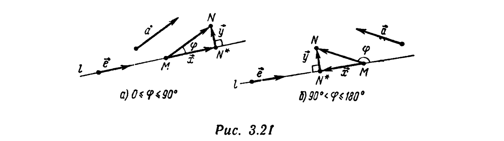
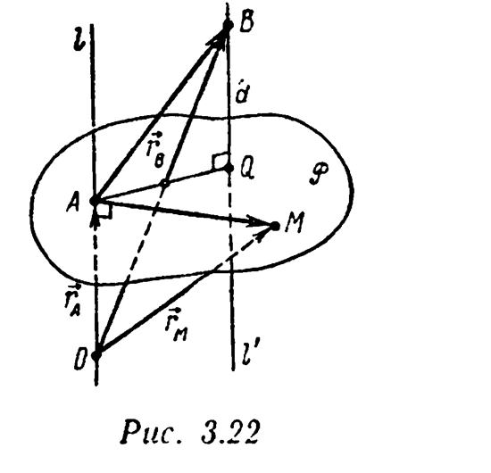
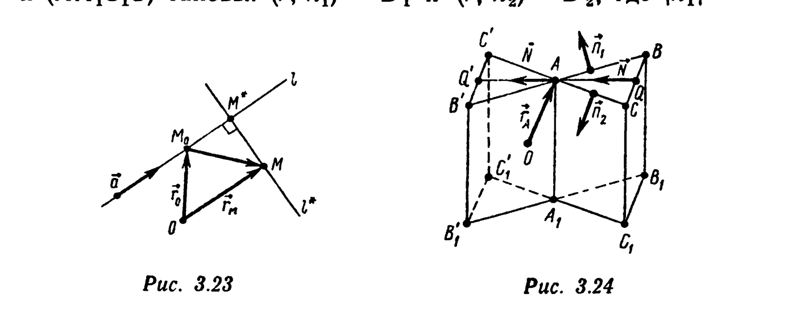

# Глава 3. Скалярное произведение векторов

## § 3. Ортогональное проецирование в пространстве. Нормальное векторное уравнение плоскости

Пусть $l$ — некоторая прямая в пространстве. *Ортогональной проекцией* $\text{Пр}_l M$ точки $M$ пространства на прямую $l$ называется точка $M^*=\Pi_l^P(M)$, где $P$ — плоскость, перпендикулярная прямой $l$. Иначе говоря, $M^*=M$, если $M\in l$, и $M^*$ — основание перпендикуляра, опущенного из точки $M$ на прямую $l$, если $M\notin l$. Пусть $\vec a$ — некоторый вектор. По определению, *ортогональной проекцией вектора* $\vec a$ *на прямую* $l$ называется вектор $\text{Пр}_l\vec a=\Pi_l^P(\vec a)$. Найдем явное выражение для $\text{Пр}_l\vec a$. Выберем на прямой $l$ точку $M$ и отложим от нее вектор $\overrightarrow{MN}=\vec a$ (рис. 3.21, а, б). Тогда

---
**стр. 142**

---

$\text{Пр}_l\vec a=\overrightarrow{MN^*}$, где $N^*=\text{Пр}_l N$. Обозначив $\vec x=\overrightarrow{MN^*}$, $\vec y=\overrightarrow{N^*N}$, получим
$$\vec a=\vec x+\vec y. \quad (3.23)$$

Пусть $\vec e$ — направляющий вектор прямой $l$. Тогда $\vec x=\lambda\vec e$. Для нахождения $\lambda$ умножим обе части равенства (3.23) скалярно на $\vec e$ и учтем, что по определению ортогональной проекции точки $N$ $(\vec y,\vec e)=0$. Имеем $(\vec a,\vec e)=\lambda(\vec e,\vec e)$, т. е.
$$\text{Пр}_l\vec a=\vec x=\lambda\vec e=\frac{(\vec a,\vec e)}{(\vec e,\vec e)}\vec e, \quad (3.24)$$
$$|\text{Пр}_l\vec a|=\left|\frac{|\vec a||\vec e|\cos\varphi}{|\vec e||\vec e|}\vec e\right|=|\vec a||\cos\varphi|=\frac{|(\vec a,\vec e)|}{|\vec e|}. \quad (3.25)$$

Пусть $P$ — некоторая плоскость в пространстве. *Ортогональной проекцией* $\text{Пр}_P M$ точки $M$ на плоскость $P$ называется точка $M^*=\Pi_P^l(M)$, где $l$ — прямая, перпендикулярная плоскости $P$. Таким образом, $M^*=M$, если

$M\in P$; $M^*$ — основание перпендикуляра, опущенного из точки $M$ на плоскость $P$, если $M\notin P$. Если $\vec n\neq\vec 0$ — вектор, перпендикулярный $P$ (т. е. направляющий вектор прямой $l$), то в силу равенства
$$\vec a=\Pi_P^l(\vec a)+\Pi_l^P(\vec a)$$
и формулы (3.24) получаем
$$\text{Пр}_P\vec a=\vec a-\frac{(\vec a,\vec n)}{(\vec n,\vec n)}\vec n, \quad (3.26)$$
где $\text{Пр}_P\vec a$ — *ортогональная проекция вектора* $\vec a$ *на плоскость* $P$, т. е. вектор $\text{Пр}_P\vec a=\overrightarrow{\text{Пр}_PM\,\text{Пр}_PN}$, $\overrightarrow{MN}=\vec a$.

---
**стр. 143**

---

**Пример 1.** Длина ребра основания $ABC$ правильной треугольной призмы $ABCA_1B_1C_1$ равна $a$. Точки $M$, $N$, $P$ и $Q$ являются соответственно серединами ребер $[AB]$, $[AC]$, $[A_1C_1]$ и $[C_1B_1]$. Длина проекции вектора $\overrightarrow{MP}$ на прямую $(NQ)$ равна $a/4$. Найдите длину высоты призмы.

△ По условию, $|\text{Пр}_{(NQ)}\overrightarrow{MP}|^2=(\overrightarrow{MP},\overrightarrow{NQ})^2/|\overrightarrow{NQ}|^2=a^2/16$ [см. формулу (3.25)]. Возьмем в качестве базисных векторы $\vec a=\overrightarrow{BA}$, $\vec b=\overrightarrow{BC}$, $\vec c=\overrightarrow{BB_1}$. Тогда $|\vec a|=|\vec b|=a$, $(\vec a,\vec b)=a^2/2$, $(\vec a,\vec c)=(\vec b,\vec c)=0$ (призма правильная). Искомая длина $h=|\vec c|$. Так как $\overrightarrow{MP}=(1/2)\vec b+\vec c$, $\overrightarrow{NQ}=-(1/2)\vec a+\vec c$, то $(\overrightarrow{MP},\overrightarrow{NQ})=-(1/4)(\vec a,\vec b)+\vec c^2=h^2-a^2/8$, $|\overrightarrow{NQ}|^2=(1/4)\vec a^2+\vec c^2=h^2+a^2/4$. Следовательно, для величины $x=h^2$ имеем уравнение
$$(\overrightarrow{MP},\overrightarrow{NQ})^2=(x-a^2/8)^2=(a^2/16)(x+a^2/4)=$$
$$=(a^2/16)|\overrightarrow{NQ}|^2,$$
или $x^2-(5/16)a^2x=0$. Так как $x\neq0$, то $h^2=(5/16)a^2$, т. е. $h=a\sqrt{5/4}$. ▲

**Пример 2 (нормальное векторное уравнение плоскости).** Пусть в пространстве фиксирован полюс $C$, выбраны число $D$ и ненулевой вектор $\vec N$. Докажите, что множество $P$ всех точек, радиусы-векторы $\vec r$ которых удовлетворяют уравнению
$$(\vec r,\vec N)=D, \quad (3.27)$$
есть плоскость. Укажите ее расположение в пространстве.

□ Рассмотрим точку $A$ с радиусом-вектором $\vec r_A=D\vec N/|\vec N|^2$ (рис. 3.22). Так как $(\vec r_A,\vec N)=D(\vec N,\vec N)/|\vec N|^2=D$, то $A\in P$. Обозначим через $l$ прямую с направляющим вектором $\vec N$, проведенную через точку $A$. Пусть $M$ — произвольная точка $P$ с радиусом-вектором $\vec r_M$. Равенство $(\vec r_M,\vec N)=D$, эквивалентное равенству $(\vec r_M-\vec r_A,\vec N)=0$, выполнено тогда и только тогда, когда $\vec r_M-\vec r_A=\overrightarrow{AM}\perp\vec N$. Таким образом, точка $M$

---
**стр. 144**

---

принадлежит множеству $P$ тогда и только тогда, когда она расположена на некоторой прямой, проходящей через точку $A$ перпендикулярно прямой $l$. Но множество $P$ всех таких прямых заполняет плоскость, проходящую через точку $A$ и перпендикулярную $l$. ■

Итак, (3.27) — уравнение некоторой плоскости $P$ в пространстве. Это уравнение называется *нормальным (векторным) уравнением плоскости* $P$. Вектор $\vec N$ называют *нормальным вектором плоскости* $P$ и говорят, что $\vec N$ *ортогонален (перпендикулярен) плоскости* $P$ (или что плоскость $P$ ортогональна вектору $\vec N$). Подчеркнем еще раз, что когда говорят, что плоскость $P$ задана уравнением (3.27), подразумевают (хотя и не оговаривают особо), что в пространстве фиксирован полюс, от которого отсчитываются радиусы-векторы $\vec r$ точек плоскости $P$, удовлетворяющие равенству (3.27).

Всякая плоскость $P$ может быть задана нормальным векторным уравнением. Для этого необходимо зафиксировать полюс $O$, некоторую точку $M_0(\vec r_0)$ плоскости $P$ и направляющий вектор $\vec N\neq\vec 0$ прямой $l$, перпендикулярной $P$. Поскольку точка $M(\vec r)$ лежит в плоскости $P$ тогда и только тогда (по свойству перпендикуляра $l$ к плоскости $P$), когда векторы $\overrightarrow{M_0M}=\vec r-\vec r_0$ и $\vec N$ — ортогональны, $M\in P$ тогда и только тогда, когда
$$(\vec r-\vec r_0,\vec N)=0. \quad (3.28)$$

Очевидно, что (3.28) переходит в (3.27), если обозначить $D=(\vec r_0,\vec N)$.

Уравнение $(\vec r,\vec n)=D$, где $|\vec n|=1$, называется *нормированным (векторным) уравнением плоскости*.

**Пример 3.** Найдите расстояние $d$ от точки $B$ с радиусом-вектором $\vec r_B$ до плоскости $P$, заданной уравнением $(\vec r,\vec N)=D$.

△ Пусть $Q$ — основание перпендикуляра $l'$, опущенного из точки $B$ на плоскость $P$ (рис. 3.22); $A$ — точка с радиусом-вектором $\vec r_A=D\vec N/|\vec N|^2$. Тогда $\vec N$ — направляющий вектор $l'$ и по формуле (3.25) имеем
$$d=|\text{Пр}_{l'}\overrightarrow{AB}|=\frac{|(\overrightarrow{AB},\vec N)|}{|\vec N|}=\frac{|(\vec r_B-\vec r_A,\vec N)|}{|\vec N|}.$$

---
**стр. 145**

---

Окончательно
$$d=\frac{|(\vec r_B,\vec N)-D|}{|\vec N|}. \ ▲ \quad (3.29)$$

**Пример 4.** Найдите ортогональную проекцию точки $B(\vec r_B)$ на плоскость $P: (\vec r,\vec N)=D$.

△ Как отмечалось в примере 3, точки $Q=\text{Пр}_P B$ и $A\left(\dfrac{D\vec N}{|\vec N|^2}\right)$ связаны соотношением
$$\overrightarrow{BQ}=\text{Пр}_{l'}\overrightarrow{BA}=\frac{(\vec r_A-\vec r_B,\vec N)}{|\vec N|^2}\vec N=\frac{D-(\vec r_B,\vec N)}{|\vec N|^2}\vec N.$$

Следовательно,
$$\vec r_Q=\vec r_B+\overrightarrow{BQ}=\vec r_B+\frac{D-(\vec r_B,\vec N)}{|\vec N|^2}\vec N. \ ▲$$

**Пример 5.** Найдите расстояние $\delta$ от точки $M$ с радиусом-вектором $\vec r_M$ до прямой $l$, параметрическое уравнение которой $\vec r=\vec r_0+\vec at$.

△ Пусть $M^*=\text{Пр}_l M$; $M_0$ — точка прямой $l$ с радиусом-вектором $\vec r_0$. Тогда (рис. 3.23) $\overrightarrow{M_0M^*}=\text{Пр}_l\overrightarrow{M_0M}=(\overrightarrow{M_0M},\vec a)\vec a/(\vec a,\vec a)$, $\overrightarrow{M^*M}=\overrightarrow{M_0M}-\overrightarrow{M_0M^*}=\vec b-(\vec a,\vec b)\vec a/(\vec a,\vec a)$, где $\vec b=\overrightarrow{M_0M}=\vec r_M-\vec r_0$.

Таким образом,
$$\delta=|\overrightarrow{M^*M}|=\left|\vec b-\frac{(\vec a,\vec b)}{(\vec a,\vec a)}\vec a\right|=$$
$$=\sqrt{\vec b^2-2\frac{(\vec a,\vec b)^2}{\vec a^2}+\frac{(\vec a,\vec b)^2}{(\vec a^2)^2}\vec a^2}=$$
$$=\frac{1}{|\vec a|}\sqrt{\vec a^2\vec b^2-(\vec a,\vec b)^2}=$$
$$=\frac{1}{|\vec a|}\sqrt{|\vec a|^2|\vec r_M-\vec r_0|^2-(\vec a,\vec r_M-\vec r_0)^2}. \ ▲$$

---
**стр. 146**

---

**Пример 6.** Напишите параметрическое векторное уравнение прямой $l^*$, являющейся проекцией (ортогональной) прямой $l: \vec r=\vec r_0+\vec at$ на плоскость $P:(\vec r,\vec N)=D$.

△ Пусть $M$ — произвольная точка прямой $l$, $\vec r_M=\vec r_0+\vec at$ — ее радиус-вектор, $Q$ — ортогональная проекция точки $M$ на плоскость $P$. По формуле, полученной в примере 4,
$$\vec r_Q=\vec r_M+\frac{D-(\vec r_M,\vec N)}{|\vec N|^2}\vec N=\left(\vec r_0+\frac{D-(\vec r_0,\vec N)}{|\vec N|^2}\vec N\right)+$$
$$+\left(\vec a-\frac{(\vec a,\vec N)}{|\vec N|^2}\vec N\right)t.$$

Когда $t$ пробегает все вещественные значения, точка $M$ пробегает всю прямую $l$, а соответствующая точка $Q$ — всю прямую $l^*$. Следовательно,
$$\vec r=\left(\vec r_0+\frac{D-(\vec r_0,\vec N)}{|\vec N|^2}\vec N\right)+\vec bt,$$
где $\vec b=\vec a-\dfrac{(\vec a,\vec N)}{|\vec N|^2}\vec N$, $t\in R$, — параметрическое уравнение прямой $l^*$. ▲

**Пример 7.** Найдите ортогональную проекцию точки $M(\vec r_M)$ на прямую $l: \vec r=\vec r_0+\vec at$.

△ Сохраняя обозначения примера 5 (рис. 3.23), имеем
$$\vec r_{M^*}=\vec r_{M_0}+\overrightarrow{M_0M^*}=\vec r_0+\frac{(\overrightarrow{M_0M},\vec a)}{|\vec a|^2}\vec a=\vec r_0+$$
$$+\frac{(\vec r_M-\vec r_0,\vec a)}{|\vec a|^2}\vec a. \ ▲$$

**Пример 8.** Напишите уравнение прямой $l^*$, проходящей через точку $M(\vec r_M)$ и пересекающей ортогонально прямую $l: \vec r=\vec r_0+\vec at$, не содержащую $M$.

---
**стр. 147**

---

△ Уравнение $l^*$ есть $\vec r=\vec r_M+\vec bt$, где $\vec b=\overrightarrow{MM^*}$, $M^*=\text{Пр}_l M$ (рис. 3.23). По формуле, приведенной в примере 7,
$$\vec b=\vec r_{M^*}-\vec r_M=-\vec r_M+\vec r_0+\frac{(\vec r_M-\vec r_0,\vec a)}{|\vec a|^2}\vec a. \ ▲$$

**Пример 9.** Длина ребра правильной треугольной призмы $ABCA_1B_1C_1$ равна $a$. Уравнения плоскостей $(AA_1B_1B)$ и $(AA_1C_1C)$ таковы: $(\vec r,\vec n_1)=D_1$ и $(\vec r,\vec n_2)=D_2$, где $|\vec n_1|=

$=|\vec n_2|=1$, $(\vec n_1,\vec n_2)=-1/2$. Напишите нормальное векторное уравнение плоскости $(BB_1C_1C)$.

△ Нормальный вектор $\vec N$ плоскости $(BB_1C_1C)$ коллинеарен биссектрисе $[AQ]$ угла $\angle BAC$ (рис. 3.24), поэтому можно взять $\vec N=\vec n_1+\vec n_2$, $|\vec N|=\sqrt{(\vec n_1+\vec n_2,\vec n_1+\vec n_2)}=\sqrt{1+2(\vec n_1,\vec n_2)+1}=1$. Следовательно, уравнение плоскости $(BB_1C_1C)$ имеет вид $(\vec r,\vec n_1+\vec n_2)=D$. Осталось найти $D$.

Расстояние $d=|AQ|=a\sqrt3/2$ от точки $A$ до плоскости $(BB_1C_1C)$ определяется формулой (3.29):
$$d=\frac{|(\vec r_A,\vec n_1+\vec n_2)-D|}{|\vec n_1+\vec n_2|}=|(\vec r_A,\vec n_1+\vec n_2)-D|.$$

Отсюда $D=(\vec r_A,\vec n_1)+(\vec r_A,\vec n_2)\pm a\sqrt3/2$. Так как точка $A$ лежит в плоскости $(AA_1B_1B)$, то $(\vec r_A,\vec n_1)=D_1$. Аналогично, $(\vec r_A,\vec n_2)=D_2$. Таким образом, задача имеет два решения: $(\vec r,\vec n_1+\vec n_2)=D_1+D_2+a\sqrt3/2$ и $(\vec r,\vec n_1+\vec n_2)=

---
**стр. 148**

---

$=D_1+D_2-a\sqrt3/2$, — соответствующие двум возможным расположениям призм $ABCA_1B_1C_1$ и $AB'C'A_1B_1'C_1'$ (рис. 3.24). ▲

**Пример 10.** Напишите уравнение прямой, пересекающей ортогонально две непараллельные прямые $l:\vec r=\vec r_0+\vec at$ и $L:\vec r=\vec r_1+\vec b\tau$.

△ Задача эквивалентна следующей: найти точки $M_0\in l$ и $M_1\in L$ такие, что вектор $\overrightarrow{M_0M_1}$ ортогонален как вектору $\vec a$, так и вектору $\vec b$. Прямая, проходящая через точку $M_0$, с направляющим вектором $\overrightarrow{M_0M_1}$ является искомой. Остается найти числа $t_0$ и $\tau_1$ такие, что векторы $\vec r_0+\vec at_0$ и $\vec r_1+\vec b\tau_1$ являются радиусами-векторами искомых точек $M_0$ и $M_1$ соответственно. Эти числа находим из условий ортогональности: $(\overrightarrow{M_0M_1},\vec a)=(\overrightarrow{M_0M_1},\vec b)=0$, или
$$(\vec r_1+\vec b\tau_1-\vec r_0-\vec at_0,\vec a)=0, \quad (\vec r_1+\vec b\tau_1-\vec r_0-\vec at_0,\vec b)=0.$$

Перепишем эту систему уравнений в виде
$$t_0\vec a^2-\tau_1(\vec a,\vec b)=\alpha, \quad t_0(\vec a,\vec b)-\tau_1\vec b^2=\beta, \quad (3.30)$$
где $\alpha=(\vec r_1-\vec r_0,\vec a)$, $\beta=(\vec r_1-\vec r_0,\vec b)$. Решение системы (3.30)
$$t_0=\frac{-\beta(\vec a,\vec b)+\alpha\vec b^2}{\vec a^2\vec b^2-(\vec a,\vec b)^2}, \quad \tau_1=\frac{\alpha(\vec a,\vec b)-\beta\vec a^2}{\vec a^2\vec b^2-(\vec a,\vec b)^2}.$$

Таким образом, уравнение искомой прямой
$$\vec r=\vec r_0+\frac{(\vec r_1-\vec r_0,\vec a)\vec b^2-(\vec r_1-\vec r_0,\vec b)(\vec a,\vec b)}{\vec a^2\vec b^2-(\vec a,\vec b)^2}\vec a+$$
$$+\left(\vec r_1-\vec r_0+\frac{(\vec r_1-\vec r_0,\vec a)(\vec a,\vec b)-(\vec r_1-\vec r_0,\vec b)\vec a^2}{\vec a^2\vec b^2-(\vec a,\vec b)^2}\vec b-\right.$$
$$\left.-\frac{(\vec r_1-\vec r_0,\vec a)\vec b^2-(\vec r_1-\vec r_0,\vec b)(\vec a,\vec b)}{\vec a^2\vec b^2-(\vec a,\vec b)^2}\vec a\right)t, \ t\in R. \ ▲$$
