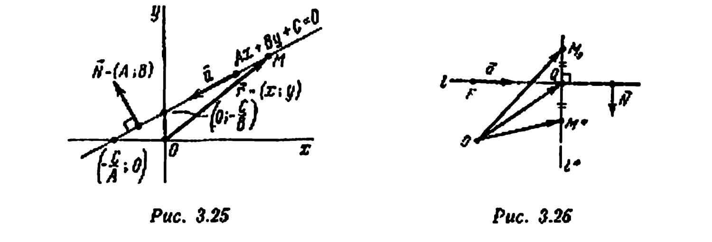
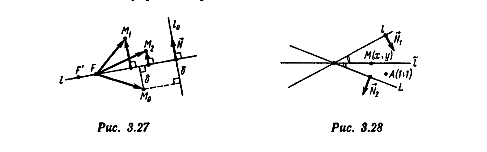
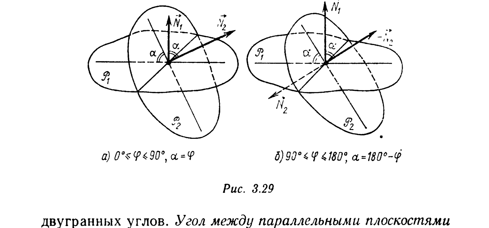
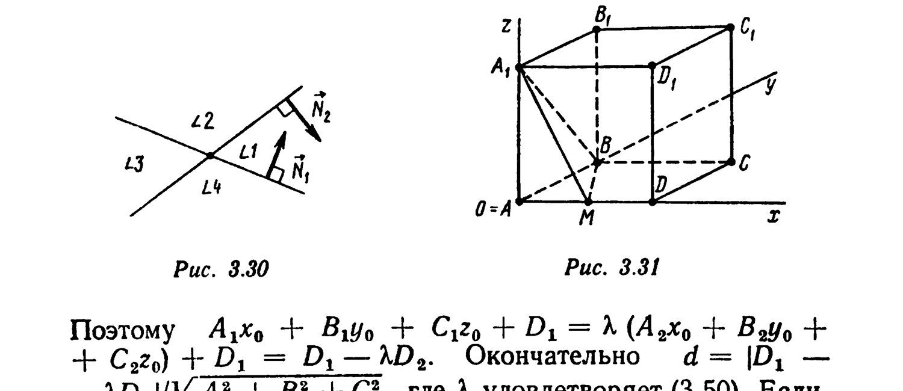
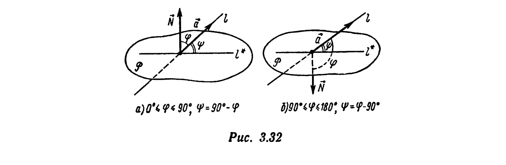
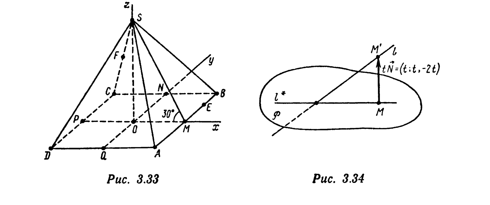
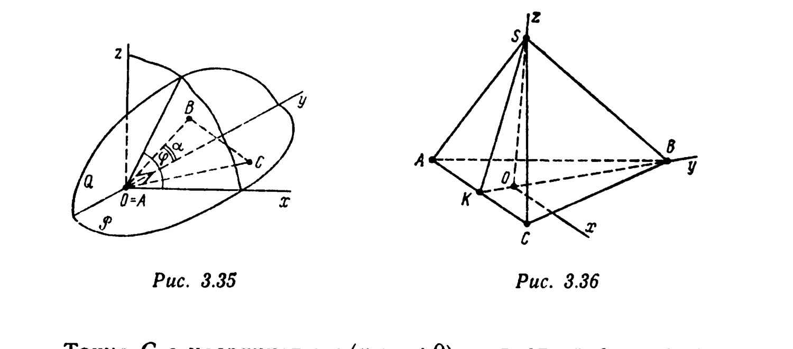
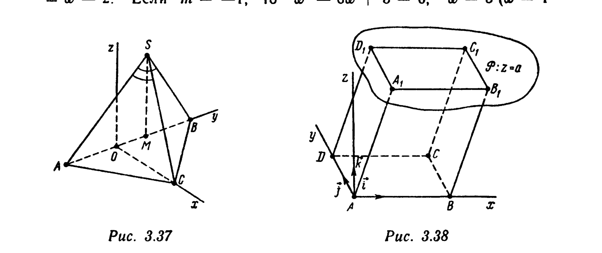
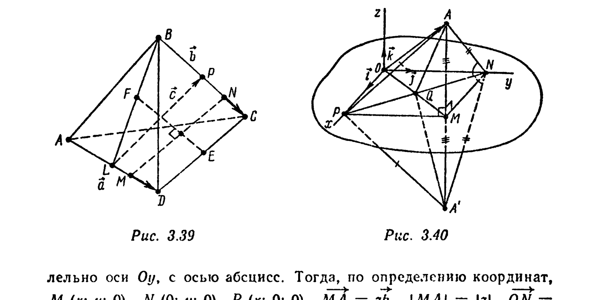

# Глава 3. Скалярное произведение векторов

## § 4. Ортонормированный базис. Прямоугольная система координат. Прямая на плоскости. Прямая и плоскость в пространстве

---
**стр. 149**
---

Три единичных попарно перпендикулярных вектора, взятых в определенном порядке, называются *ортонормированным (или прямоугольным) базисом в пространстве*. Векторы прямоугольного базиса принято обозначать $\vec i,\vec j,\vec k$. Каждый вектор $\vec a$ единственным образом представляется в виде $\vec a=x\vec i+y\vec j+z\vec k$. Числа $x,y,z$ называются *координатами вектора* $\vec a$ *в базисе* $\{\vec i,\vec j,\vec k\}$. Если $\vec a=x\vec i+y\vec j+z\vec k$, то пишут $\vec a=(x;y;z)$. Например, $\vec i=(1;0;0)$, $\vec j=(0;1;0)$, $\vec k=(0;0;1)$, $\vec 0=(0;0;0)$ и т. д. Координаты векторов в ортонормированном базисе обладают свойством линейности: для любых векторов $\vec a=(x_1;y_1;z_1)$ и $\vec b=(x_2;y_2;z_2)$ и чисел $\alpha$ и $\beta$
$$\alpha\vec a+\beta\vec b=(\alpha x_1+\beta x_2;\alpha y_1+\beta y_2;\alpha z_1+\beta z_2).$$

Из единственности разложения вектора по базису следует, что векторное равенство $\vec a=\vec b$ равносильно системе трех скалярных равенств $x_1=x_2$, $y_1=y_2$, $z_1=z_2$.

Скалярное произведение векторов $\vec a=(x_1;y_1;z_1)$ и $\vec b=(x_2;y_2;z_2)$ равно сумме произведений соответствующих координат:
$$(\vec a,\vec b)=x_1x_2+y_1y_2+z_1z_2. \quad (3.31)$$

Длина вектора $\vec a$ равна $|\vec a|=\sqrt{x_1^2+y_1^2+z_1^2}$.

□ Действительно, поскольку $(\vec i,\vec j)=(\vec i,\vec k)=(\vec j,\vec k)=0$, $|\vec i|=|\vec j|=|\vec k|=1$, по формуле (3.14), $(\vec a,\vec b)=(x_1\vec i+y_1\vec j+z_1\vec k,\,x_2\vec i+y_2\vec j+z_2\vec k)=x_1x_2\vec i^2+y_1y_2\vec j^2+z_1z_2\vec k^2+(x_1y_2+x_2y_1)(\vec i,\vec j)+(x_1z_2+x_2z_1)(\vec i,\vec k)+(y_1z_2+y_2z_1)(\vec j,\vec k)=x_1x_2+y_1y_2+z_1z_2$. Из (3.31) следует, что $(\vec a,\vec a)=x_1^2+y_1^2+z_1^2$, т. е. $|\vec a|=\sqrt{(\vec a,\vec a)}=\sqrt{x_1^2+y_1^2+z_1^2}$. ■

---
**стр. 150**

---

Всюду в этом параграфе считаем, что координаты векторов заданы в ортонормированном базисе, не оговаривая этого особо.

**Пример 1.** Найдите координаты и длину вектора $3\vec a+2\vec b$, если $\vec a=(0;-2;-3)$, $\vec b=(3;2;3)$.

△ Согласно свойству линейности координат, $3\vec a+2\vec b=(3\cdot0+2\cdot3;\,3\cdot(-2)+2\cdot2;\,3\cdot(-3)+2\cdot3)=(6;-2;-3)$. Поэтому $|3\vec a+2\vec b|=\sqrt{6^2+(-2)^2+(-3)^2}=7$. ▲

**Пример 2.** Найдите, при каких значениях $m$ векторы $\vec a=(m;-2;1)$ и $\vec b=(m;m;-3)$ ортогональны.

△ Имеем $\vec a\perp\vec b \Leftrightarrow 0=(\vec a,\vec b)=m\cdot m+(-2)\cdot m+1\cdot(-3)=m^2-2m-3 \Leftrightarrow (m=-1$ или $m=3)$. ▲

**Пример 3.** Найдите координаты единичного вектора $\vec e$, противоположно направленного вектору $\vec a=(2;-2;1)$.

△ $|\vec a|=\sqrt{2^2+(-2)^2+1^2}=3$; $\vec e=-\vec a/|\vec a|=(-2/3;2/3;-1/3)$. ▲

**Пример 4.** Найдите угол между векторами $\vec a=(1;2;2)$ и $\vec b=(-1;0;-1)$.

△ $\cos(\vec a\widehat{,}\vec b)=\dfrac{(\vec a,\vec b)}{|\vec a||\vec b|}=\dfrac{1\cdot(-1)+2\cdot0+2\cdot(-1)}{\sqrt{1^2+2^2+2^2}\sqrt{(-1)^2+0^2+(-1)^2}}=\dfrac{-3}{3\sqrt2}=-\dfrac{1}{\sqrt2}$, $(\vec a\widehat{,}\vec b)=135°$. ▲

Если $\{\vec i,\vec j,\vec k\}$ — ортонормированный базис, то система координат $\{O,\vec i,\vec j,\vec k\}$ называется *прямоугольной*. Если $A(x_1;y_1;z_1)$ и $B(x_2;y_2;z_2)$ — точки, заданные своими координатами в прямоугольной системе, то $\overrightarrow{AB}=(x_2-x_1;y_2-y_1;z_2-z_1)$, $|\overrightarrow{AB}|=|AB|=\sqrt{(x_2-x_1)^2+(y_2-y_1)^2+(z_2-z_1)^2}$.

---
**стр. 151**

---

**Пример 5.** В треугольнике с вершинами в точках $A(3;2;-3)$, $B(4;3;-3)$, $C(3;1;-4)$ найдите величину угла $\widehat A$ и длину медианы $[AN]$.

△ Так как $\widehat A$ — угол между векторами $\overrightarrow{AB}=(4-3;3-2;-3-(-3))=(1;1;0)$ и $\overrightarrow{AC}=(0;-1;-1)$, то $\cos\widehat A=(\overrightarrow{AB},\overrightarrow{AC})/(|\overrightarrow{AB}||\overrightarrow{AC}|)=(-1)/(\sqrt2\cdot\sqrt2)=-1/2$, т. е. $\widehat A=120°$. Вектор $\overrightarrow{AN}=(1/2)(\overrightarrow{AB}+\overrightarrow{AC})=(1/2;0;-1/2)$, $|AN|=\sqrt{(1/2)^2+(-1/2)^2}=1/\sqrt2$. ▲

Два единичных взаимно перпендикулярных вектора, параллельных плоскости $P$, взятые в определенном порядке, называются *ортонормированным (прямоугольным) базисом в плоскости* $P$. Векторы ортонормированного базиса принято обозначать $\vec i,\vec j$. Каждый вектор $\vec a$, параллельный плоскости $P$, единственным образом представляется в виде $\vec a=x\vec i+y\vec j$. Числа $x,y$ называют *координатами вектора* $\vec a$ *в базисе* $\{\vec i,\vec j\}$ и пишут $\vec a=(x;y)$. Если $\vec a=(x_1;y_1)$, $\vec b=(x_2;y_2)$, то для любых чисел $\alpha$ и $\beta$ $\alpha\vec a+\beta\vec b=(\alpha x_1+\beta x_2;\alpha y_1+\beta y_2)$, $(\vec a,\vec b)=x_1x_2+y_1y_2$, $|\vec a|=\sqrt{x_1^2+y_1^2}$. Равенство $\vec a=\vec b$ эквивалентно системе равенств $x_1=x_2$, $y_1=y_2$. Если $O\in P$, а $\{\vec i,\vec j\}$ — ортонормированный базис в плоскости $P$, то система координат $\{O,\vec i,\vec j\}$ на плоскости $P$ называется *прямоугольной*. Если $A(x_1;y_1)$ и $B(x_2;y_2)$ — точки плоскости $P$, заданные своими координатами в прямоугольной системе координат, то $\overrightarrow{AB}=(x_2-x_1;y_2-y_1)$, $|\overrightarrow{AB}|=|AB|=\sqrt{(x_2-x_1)^2+(y_2-y_1)^2}$.

**Пример 6.** Даны точка $A(-1;2)$ и вектор $\vec a=(3;-4)$. Найдите координаты таких точек $B$ и $C$, что $\overrightarrow{AB}=\vec a$, $\overrightarrow{AC}\perp\vec a$ и $|\overrightarrow{AC}|=|\vec a|$.

△ Пусть $B(x;y)$. Тогда $\overrightarrow{AB}=(x+1;y-2)$, и если $\vec a=\overrightarrow{AB}$, то $3=x+1$, $-4=y-2$, т. е. $x=2$, $y=-2$. Итак, точка $B$ имеет координаты $(2;-2)$. Пусть $C(\tilde x;\tilde y)$. Тогда $\overrightarrow{AC}=(\tilde x+1;\tilde y-2)$. Так как $(\overrightarrow{AC},\vec a)=3(\tilde x+1)-4(\tilde y-2)=0$, то $\tilde x=(4/3)\tilde y-11/3$. Далее, $|\overrightarrow{AC}|=

---
**стр. 152**

---

=|\vec a|$, т. е. $(\tilde x+1)^2+(\tilde y-2)^2=3^2+(-4)^2$, или $((4/3)\tilde y-8/3)^2+(\tilde y-2)^2=25$. Решая это уравнение относительно $\tilde y$, найдем $\tilde y_1=-1$, $\tilde y_2=5$. Следовательно, существуют две точки $C$, удовлетворяющие условию задачи: $C_1(-5;-1)$ и $C_2(3;5)$. ▲

**Пример 7 (нормальное уравнение прямой на плоскости).** Докажите, что в любой системе координат уравнение
$$Ax+By+C=0, \quad A^2+B^2>0 \quad (3.32)$$
определяет прямую на плоскости. Выясните геометрический смысл коэффициентов $A$ и $B$, если система координат прямоугольная.

□ Если $M_1(x_1;y_1)$ и $M_2(x_2;y_2)$ — две различные точки, заданные своими координатами в некоторой (не обязательно прямоугольной) системе координат, то в этой системе координат уравнение прямой $l=(M_1M_2)$ имеет вид [см. формулу (2.53) гл. 2] $\dfrac{x-x_1}{x_2-x_1}=\dfrac{y-y_1}{y_2-y_1}$, или $Ax+By+C=0$, где $A=y_2-y_1$, $B=-(x_2-x_1)$, $A^2+B^2>0$, $C=-Ax_1-By_1$. Вектор
$$\vec a=(-B;A)=(x_2-x_1;y_2-y_1). \quad (3.33)$$
— направляющий вектор прямой $l$, заданной уравнением (3.32).

Всякое уравнение (3.32) есть уравнение прямой на плоскости. Эта прямая проходит через точки $(0;-C/B)$ и $(-C/A;0)$, если $A\neq0$, $B\neq0$. Если $A=0$, то уравнение $By+C=0$, $B\neq0$ — уравнение прямой, проходящей через точки $(0;-C/B)$ и $(1;-C/B)$. Эта прямая параллельна оси абсцисс. Уравнение $Ax+C=0$, $A\neq0$ есть уравнение прямой, параллельной оси ординат (прямая проходит через точки $\left(-\dfrac{C}{A};0\right)$ и $\left(-\dfrac{C}{A};1\right)$).

Если $M_1(x_1;y_1)$ — точка прямой $l$ с уравнением (3.32), то $Ax_1+By_1+C=0$, т. е. $C=-Ax_1-By_1$, и уравнение (3.32) можно записать в виде
$$A(x-x_1)+B(y-y_1)=0. \quad (3.34)$$

Если система координат — прямоугольная, то вектор $\vec N=(A;B)$ удовлетворяет соотношению $(\vec N,\vec a)=A(-B)+BA=0$, т. е. $\vec N\perp\vec a$ (рис. 3.25). Вектор $\vec N$ называется

---
**стр. 153**

---

*нормальным вектором прямой* $l$, заданной уравнением (3.32). Таким образом, для прямой $l$, заданной уравнением (3.32) в прямоугольной системе координат, координаты нормального вектора $\vec N$ — это коэффициенты при переменных $x$ и $y$ в уравнении (3.32). Уравнение (3.32) можно записать также в виде
$$(\vec r,\vec N)=D, \quad (3.35)$$
где $\vec r=(x;y)$ — радиус-вектор произвольной точки $M(x;y)$ прямой $l$, $\vec N=(A;B)$ — ее нормальный вектор, $D=-C$. Уравнение (3.35), эквивалентное (3.32), если система координат прямоугольная, называется *нормальным векторным уравнением прямой на плоскости*, а соответствующее уравнение (3.32) — *нормальным (координатным) уравнением* $l$. ■

**Пример 8.** Найдите радиус-вектор $\vec x$ общей точки прямых $l: (\vec r,\vec N)=D$ и $L: \vec r=\vec r_0+\vec bt$, $t\in R$, $(\vec N,\vec b)\neq0$.

△ $(\vec x,\vec N)=D$ и $\vec x=\vec r_0+\vec bt$ при некотором $t\in R$. Подставляя $\vec x$ в первое из уравнений, найдем
$$(\vec r_0,\vec N)+t(\vec b,\vec N)=D, \text{ т. е. } t=\frac{D-(\vec r_0,\vec N)}{(\vec b,\vec N)} \text{ и}$$
$$\vec x=\vec r_0+\frac{D-(\vec r_0,\vec N)}{(\vec b,\vec N)}\vec b. \ ▲$$

*Углом между двумя пересекающимися прямыми* называется величина меньшего из углов, образованных этими прямыми. Угол между перпендикулярными прямыми равен $90°$ (все четыре угла, образованные этими прямыми, конгруэнтны). *Если прямые параллельны, то угол между ними считают равным* $0°$. *Углом между двумя скрещивающимися прямыми* называют угол между двумя пересекающимися прямыми, соответственно параллельными данным скрещивающимся прямым. Если $\vec a$ и $\vec b$ — направляющие векторы прямых, то угол $\varphi$ между этими прямыми находят по формуле
$$\cos\varphi=|(\vec a,\vec b)/(|\vec a||\vec b|)|.$$

**Пример 9.** Найдите угол $\varphi$ между прямыми $-x+2y+3=0$ и $3x-y-1=0$.

---
**стр. 154**

---

△ Направляющие векторы данных прямых $\vec a_1=(-2;-1)$ и $\vec a_2=(1;3)$ [см. формулу (3.33)]. Следовательно,
$$\cos\varphi=\left|\frac{(\vec a_1,\vec a_2)}{|\vec a_1||\vec a_2|}\right|=\left|\frac{-2-3}{\sqrt5\cdot\sqrt{10}}\right|=\frac{1}{\sqrt2}, \quad \varphi=45°. \ ▲$$

Пусть $l:(\vec r,\vec N)=D$ — прямая на плоскости, заданная нормальным векторным уравнением в прямоугольной системе координат. Так как для любой точки $F\in l$ и любого вектора $\vec b$, коллинеарного $\vec N$,
$$\text{Пр}_l\vec b=\vec b-\frac{(\vec b,\vec N)}{(\vec N,\vec N)}\vec N \quad (3.36)$$

[см. формулу (3.26)], то, взяв в качестве $\vec b$ вектор $\overrightarrow{FM}$, где $M$ — произвольная точка плоскости, получаем ортогональную проекцию $M^*$ точки $M$ на прямую $l$ (рис. 3.25):
$$\overrightarrow{FM^*}=\text{Пр}_l\overrightarrow{FM}=\overrightarrow{FM}-\frac{(\overrightarrow{FM},\vec N)}{(\vec N,\vec N)}\vec N. \quad (3.37)$$

Расстояние $\delta$ от точки $M$ до прямой $l$ равно
$$\delta=|\overrightarrow{M^*M}|=\left|\frac{(\overrightarrow{FM},\vec N)}{(\vec N,\vec N)}\vec N\right|=\frac{|(\overrightarrow{FM},\vec N)|}{|\vec N|}. \quad (3.38)$$

**Пример 10.** Найдите основание $Q$ перпендикуляра, опущенного из точки $M_0(x_0;y_0;z_0)$ на прямую $l:\dfrac{x-x_1}{a_1}=\dfrac{y-y_1}{a_2}=\dfrac{z-z_1}{a_3}$.

△ Пусть $F(x_1;y_1;z_1)$ — точка прямой $l$, $\vec a=(a_1;a_2;a_3)$ — направляющий вектор $l$ (рис. 3.26). По аналогии с формулой (3.37),
$$\overrightarrow{FQ}=\text{Пр}_l\overrightarrow{FM_0}=\frac{(\overrightarrow{FM_0},\vec a)}{(\vec a,\vec a)}\vec a,$$
откуда находятся координаты точки $Q$. ▲

---
**стр. 155**

---

**Пример 11.** Найдите основание $Q$ перпендикуляра, опущенного из точки $M_0$ на прямую $l:\vec r=\vec r_0+\vec at$.

△ $Q=\vec r_0+\overrightarrow{FQ}$, где $\overrightarrow{FQ}$ находится по формуле, приведенной в решении примера 10, $\overrightarrow{FM_0}=\vec r_{M_0}-\vec r_0$. ▲

Пусть в плоскости с прямоугольной системой координат $\{O,\vec i,\vec j\}$ задана прямая $l:(\vec r,\vec N)=D$, $F$ — некоторая точка $l$, $M$ — произвольная точка плоскости. Числа $(\overrightarrow{FM},\vec N)$ и $|\vec N|$ не зависят от выбора точки $F\in l$: если $F'$ — другая точка $l$, то $\overrightarrow{F'F}\perp\vec N$, т. е. $(\overrightarrow{F'F},\vec N)=0$, и, следовательно,
$$(\overrightarrow{F'M},\vec N)=(\overrightarrow{F'F},\vec N)+(\overrightarrow{FM},\vec N)=(\overrightarrow{FM},\vec N). \quad (3.39)$$

Если точки $M_1$ и $M_2$ не принадлежат прямой $l$, то, как следует из формулы (3.38),
$$\frac{(\overrightarrow{FM_1},\vec N)}{|\vec N|}=\pm\frac{(\overrightarrow{FM_2},\vec N)}{|\vec N|}, \quad (3.40)$$

причем знак «$+$» имеет место тогда и только тогда, когда точки $M_1$ и $M_2$ лежат по одну сторону от прямой $l$, т. е. когда векторы $\overrightarrow{FM_1}$ и $\overrightarrow{FM_2}$ образуют с вектором $\vec N$ (нормальным вектором прямой $l$) углы

---
**стр. 156**

---

одинаковый знак. В связи с этим вводится для каждой точки $M\in P$ число
$$d=d_l(M)=\frac{(\overrightarrow{FM},\vec N)}{|\vec N|}, \quad (3.41)$$
называемое *ориентированным расстоянием от точки* $M$ *до прямой* $l$. Числа $d_l(M_1)$ и $d_l(M_2)$ имеют одинаковый знак тогда и только тогда, когда точки $M_1$ и $M_2$ лежат в одной полуплоскости, определяемой прямой $l$; $d_l(M)>0$ тогда и только тогда, когда точка $M$ расположена в той же полуплоскости, что и конец вектора $\vec N$, если начало $\vec N$ поместить на прямой $l$.

**Пример 12 (расстояние от точки до прямой на плоскости).** Докажите, что число $d_l(M)$ в формуле (3.41) не зависит ни от выбора точки $F\in l$, ни от длины вектора $\vec N$. Проверьте, что $|d_l(M_0)|$ — обычное расстояние от точки $M_0$ до прямой $l$. Докажите, что если $l: Ax+By+C=0$ и $\vec N=(A;B)$, то для точки $M_0(x_0;y_0)$
$$d_l(M_0)=\frac{Ax_0+By_0+C}{\sqrt{A^2+B^2}}. \quad (3.42)$$

□ Если $F'$ — другая точка $l$, то $\overrightarrow{F'F}\perp\vec N$, т. е. $(\overrightarrow{F'F},\vec N)=0$, поэтому
$$\frac{(\overrightarrow{F'M},\vec N)}{|\vec N|}=\frac{(\overrightarrow{F'F},\vec N)+(\overrightarrow{FM},\vec N)}{|\vec N|}=\frac{(\overrightarrow{FM},\vec N)}{|\vec N|}.$$

Если $\vec N'=k\vec N$, $k>0$, то $|\vec N'|=k|\vec N|$ и $(\overrightarrow{FM},\vec N')/|\vec N'|=(\overrightarrow{FM},k\vec N)/(k|\vec N|)=(\overrightarrow{FM},\vec N)/|\vec N|$. Расстояние $\delta$ от точки $M_0$ до прямой $l$ есть (рис. 3.27) $\delta=|\text{Пр}_{l_0}\overrightarrow{FM_0}|=|(\overrightarrow{FM_0},\vec N)|/|\vec N|=|d_l(M_0)|$ [см. формулу (3.40)]. Наконец если $l: Ax+By+C=0$, $\vec N=(A;B)$ и $M_0(x_0;y_0)$, то, обозначая $(x_F;y_F)$ координаты точки $F$ и используя тот факт, что $F\in l$, т. е. $C=-(Ax_F+By_F)$, получим
$$d_l(M_0)=\frac{(\overrightarrow{FM_0},\vec N)}{|\vec N|}=\frac{(x_0-x_F)A+(y_0-y_F)B}{\sqrt{A^2+B^2}}=\frac{Ax_0+By_0+C}{\sqrt{A^2+B^2}}. \ ■$$

---
**стр. 157**

---

**Пример 13.** Найдите длину $h$ высоты, опущенной из вершины $A(4;4)$ треугольника $ABC$, если $B(-6;-1)$, $C(-2;-4)$.

△ Уравнение прямой $l=(BC): \dfrac{x+6}{-2+6}=\dfrac{y+1}{-4+1} \Leftrightarrow 3x+4y+22=0$. Поэтому
$$h=|d_l(A)|=\left|\frac{3\cdot4+4\cdot4+22}{\sqrt{3^2+4^2}}\right|=10. \ ▲$$

**Пример 14.** Напишите уравнение биссектрисы $\tilde l$ того угла, образованного прямыми $l: x+7y=0$ и $L: x-y-4=0$, внутри которого лежит точка $A(1;1)$.

△ Если $M(x;y)\in\tilde l$ и лежит внутри данного угла (рис. 3.28), то числа $d_l(M)=(x+7y)/\sqrt{50}$ и $d_l(A)=(1+7\cdot1)/\sqrt{50}>0$ имеют одинаковый знак, т. е. $d_l(M)>0$. Одинаковый знак и у чисел $d_L(M)=(x-y-4)/\sqrt2$ и $d_L(A)=(1-1-4)/\sqrt2<0$, т. е. $d_L(M)<0$. Точка $M(x;y)$ удовлетворяет определяющему свойству биссектрисы угла: ее расстояния $|d_l(M)|=d_l(M)$ и $|d_L(M)|=-d_L(M)$ до прямых $l$ и $L$ равны: $(x+7y)/(5\sqrt2)=-(x-y-4)/\sqrt2$, т. е. $6x+2y-20=0$. Итак, все точки биссектрисы удовлетворяют уравнению $3x+y-10=0$, которое, следовательно, и есть уравнение биссектрисы. ▲

**Пример 15.** Дан треугольник $ABC$: $A(4;4)$, $B(-6;-1)$, $C(-2;-4)$. Напишите уравнение биссектрисы внутреннего угла $C$.

△ Имеем $\overrightarrow{CA}=(6;8)$, $\overrightarrow{CB}=(-4;3)$, $|\overrightarrow{CA}|=\sqrt{6^2+8^2}=10$, $|\overrightarrow{CB}|=5$. По формуле из примера 11

---
**стр. 158**

---

§ 2 направляющий вектор $\overrightarrow{CL}$ биссектрисы равен
$$\frac{|\overrightarrow{CA}|\overrightarrow{CB}+|\overrightarrow{CB}|\overrightarrow{CA}}{|\overrightarrow{CA}|+|\overrightarrow{CB}|}=\frac{10\overrightarrow{CB}+5\overrightarrow{CA}}{15}=\frac{2\overrightarrow{CB}+\overrightarrow{CA}}{3}=\left(-\frac23;\frac{14}{3}\right).$$

Следовательно, ее уравнение $\dfrac{x+2}{-2/3}=\dfrac{y+4}{14/3} \Leftrightarrow 7x+y+18=0$. ▲

**Пример 16.** Зная вершину $A(3;-4)$ треугольника $ABC$ и уравнения двух его высот $(BM): 7x-2y-1=0$ и $(CN): 2x-7y-6=0$, напишите уравнение стороны $(BC)$.

△ Нормальный вектор $(7;-2)$ прямой $(BM)$ параллелен прямой $(AC)$. Поэтому ее уравнение $\dfrac{x-3}{7}=\dfrac{y+4}{-2}$, или $(AC): 2x+7y+22=0$. Координаты точки $C(x_C;y_C)=(AC)\cap(CN)$ найдем из системы уравнений $2x_C+7y_C+22=0$, $2x_C-7y_C-6=0 \Leftrightarrow x_C=-4$, $y_C=-2$. Аналогично, $(2;-7)$ — направляющий вектор $(AB)$, и уравнение этой прямой $\dfrac{x-3}{2}=\dfrac{y+4}{-7}$, или $(AB): 7x+2y-13=0$. Координаты точки $B(x_B;y_B)$ находятся из системы уравнений $7x_B+2y_B-13=0$, $7x_B-2y_B-1=0$, т. е. $x_B=1$, $y_B=3$. Следовательно, уравнение $(BC)$:
$$\frac{x-1}{4-1}=\frac{y-3}{-2-3} \Leftrightarrow x-y+2=0. \ ▲$$

**Пример 17.** Напишите уравнения и найдите длину $\delta$ перпендикуляра, опущенного из точки $M_0(-3;13;7)$ на прямую $l: \dfrac{x-1}{3}=\dfrac{y-2}{-4}=\dfrac{z-3}{1}$.

△ Пусть $Q(x_Q;y_Q;z_Q)$ — основание искомого перпендикуляра (см. рис. 3.26). Так как $Q\in l$, то $\dfrac{x_Q-1}{3}=\dfrac{z_Q-3}{1} \Leftrightarrow x_Q=3z_Q-8$, $\dfrac{y_Q-2}{-4}=\dfrac{z_Q-3}{1} \Leftrightarrow y_Q=-4z_Q+14$.

Вектор $\overrightarrow{M_0Q}=(x_Q+3;y_Q-13;z_Q-7)$ ортогонален направляющему вектору $\vec a=(3;-4;1)$ прямой $l: 0=

---
**стр. 159**

---

=(\vec a,\overrightarrow{M_0Q})=3(x_Q+3)-4(y_Q-13)+(z_Q-7)=3(3z_Q-5)-4(-4z_Q+1)+(z_Q-7)=26z_Q-26$. Отсюда $z_Q=1$, $x_Q=-5$, $y_Q=10$,
$$\delta=|M_0Q|=\sqrt{(-5+3)^2+(10-13)^2+(1-7)^2}=7.$$

Уравнения прямой $(M_0Q)$
$$\frac{x+3}{-5+3}=\frac{y-13}{10-13}=\frac{z-7}{1-7} \Leftrightarrow \frac{x+3}{2}=\frac{y-13}{3}=\frac{z-7}{6}. \ ▲$$

**Пример 18.** Найдите точку $M^*(x^*;y^*;z^*)$, симметричную точке $M_0(1;2;3)$ относительно прямой $l: \dfrac{x-8}{1}=\dfrac{y-11}{3}=\dfrac{z-4}{-1}$.

△ Векторы $\overrightarrow{M_0M^*}=(x^*-1;y^*-2;z^*-3)$ и $\vec a=(1;3;-1)$ ортогональны (ср. с примером 10, рис. 3.26): $x^*-1+3(y^*-2)-(z^*-3)=0$. Середина $Q\left(\dfrac{1+x^*}{2};\dfrac{2+y^*}{2};\dfrac{3+z^*}{2}\right)$ отрезка $[M_0M^*]$ лежит на прямой $l$:
$$\frac{(1+x^*)/2-8}{1}=\frac{(2+y^*)/2-11}{3}, \quad \frac{(1+x^*)/2-8}{1}=\frac{(3+z^*)/2-4}{-1}.$$

Решая систему трех получившихся уравнений, найдем: $x^*=9$, $y^*=2$, $z^*=11$. ▲

**Пример 19.** Напишите уравнения общего перпендикуляра к двум прямым $l: \dfrac{x-2}{1}=\dfrac{y-2}{2}=\dfrac{z+1}{-3}$ и $L: \dfrac{x}{-2}=\dfrac{y-2}{1}=\dfrac{z-4}{1}$.

△ Пусть $\vec a=(1;2;-3)$ и $\vec b=(-2;1;1)$ — направляющие векторы данных прямых, $M_1(x_1;y_1;z_1)\in l$ и $M_2(x_2;y_2;z_2)\in L$ — точки пересечения этих прямых с искомым перпендикуляром. Шесть уравнений для нахождения $x_1,y_1,z_1,x_2,y_2,z_2$ получаем из следующих условий:

$M_1\in l$, т. е. $\dfrac{x_1-2}{1}=\dfrac{y_1-2}{2}$, $\dfrac{x_1-2}{1}=\dfrac{z_1+1}{-3} \Leftrightarrow y_1=2x_1-2$, $z_1=-3x_1+5$;

---
**стр. 160**

---

$M_2\in L$, т. е. $\dfrac{x_2}{-2}=\dfrac{y_2-2}{1}$, $\dfrac{z_2-4}{1}=\dfrac{y_2-2}{1} \Leftrightarrow x_2=-2y_2+4$, $z_2=y_2+2$;

$(\overrightarrow{M_1M_2},\vec a)=0$, т. е. $x_2-x_1+2(y_2-y_1)-3(z_2-z_1)=0 \Leftrightarrow 14x_1+3y_2-17=0$;

$(\overrightarrow{M_1M_2},\vec b)=0$, т. е. $-2(x_2-x_1)+(y_2-y_1)+(z_2-z_1)=0 \Leftrightarrow x_1+2y_2-3=0$.

Отсюда $x_1=y_2=1$, $y_1=0$, $z_1=x_2=2$, $z_2=3$. Следовательно, $M_1(1;0;2)$, $M_2(2;1;3)$. Уравнения перпендикуляра $\dfrac{x-1}{2-1}=\dfrac{y-0}{1-0}=\dfrac{z-2}{3-2} \Leftrightarrow \dfrac{x-1}{1}=\dfrac{y}{1}=\dfrac{z-2}{1}$. Расстояние $|M_1M_2|$ между скрещивающимися прямыми $l$ и $L$ равно $|M_1M_2|=\sqrt{(2-1)^2+(1-0)^2+(3-2)^2}=\sqrt3$. ▲

**Пример 20.** Докажите, что прямая $\tilde l$, проходящая через точку $M_0(1;2;3)$ и пересекающая прямые $l: \dfrac{x-1}{2}=\dfrac{y-1}{-1}=\dfrac{z-1}{2}$ и $L: \dfrac{x-2}{2}=\dfrac{y-8}{-9}=\dfrac{z+3}{6}$, образует с этими прямыми равные углы.

△ Если $M_1(x_1;y_1;z_1)=l\cap\tilde l$, $M_2(x_2;y_2;z_2)=L\cap\tilde l$, то существуют такие числа $t$ и $\tau$, что $x_1=1+2t$, $y_1=1-t$, $z_1=1+2t$, $x_2=2+2\tau$, $y_2=8-9\tau$, $z_2=-3+6\tau$. Точки $M_0$, $M_1$, $M_2$ лежат на одной прямой, т. е. векторы $\overrightarrow{M_0M_1}=(x_1-1;y_1-2;z_1-3)=(2t;-t-1;2t-2)$ и $\overrightarrow{M_0M_2}=(x_2-1;y_2-2;z_2-3)=(2\tau+1;-9\tau+6;6\tau-6)$ коллинеарны. По условию коллинеарности,
$$0=\begin{vmatrix}2t & -t-1 \\ 2\tau+1 & -9\tau+6\end{vmatrix}=-16t\tau+13t+2\tau+1,$$
$$0=\begin{vmatrix}2t & 2t-2 \\ 2\tau+1 & 6\tau-6\end{vmatrix}=8t\tau-14t+4\tau+2,$$
$$0=\begin{vmatrix}-t-1 & 2t-2 \\ -9\tau+6 & 6\tau-6\end{vmatrix}=12t\tau-6t-24\tau+18.$$

---
**стр. 161**

---

Исключая $t\tau$ из первых двух уравнений, получаем $\tau=(3/2)t-1/2$. Если исключить $t\tau$ из последних двух уравнений, то получим $\tau=(t+1)/2$. Следовательно, $3t-1=t+1$, т. е. $t=1$, $\tau=(1+1)/2=1$. Таким образом, $M_1(3;0;3)$, $M_2(4;-1;3)$. Уравнения $\tilde l$
$$\frac{x-1}{4-3}=\frac{y-2}{-1-0}=\frac{z-3}{3-3} \Leftrightarrow \frac{x-1}{1}=\frac{y-2}{-1}=\frac{z-3}{0}.$$

Направляющие векторы прямых $\tilde l,l,L$ таковы: $\vec c=(1;-1;0)$, $\vec a=(2;-1;2)$, $\vec b=(2;-9;6)$. Угол $\varphi$ между прямыми $l$ и $\tilde l$ находится по формуле
$$\cos\varphi=\left|\frac{(\vec a,\vec c)}{|\vec a||\vec c|}\right|=\frac{2\cdot1+(-1)(-1)+2\cdot0}{\sqrt{2^2+(-1)^2+2^2}\sqrt{1^2+(-1)^2}}=\frac{1}{\sqrt2}, \quad \varphi=45°.$$

Угол $\psi$ между прямыми $\tilde l$ и $L$ определяется из соотношения
$$\cos\psi=\left|\frac{(\vec b,\vec c)}{|\vec b||\vec c|}\right|=\frac{2\cdot1+(-9)(-1)+6\cdot0}{\sqrt2\sqrt{2^2+(-9)^2+6^2}}=\frac{1}{\sqrt2}, \text{ т. е.}$$
$$\psi=45°=\varphi. \ ▲$$

Пусть в пространстве фиксирована прямоугольная система координат $\{O,\vec i,\vec j,\vec k\}$ и пусть $P$ — плоскость, заданная нормальным векторным уравнением
$$(\vec r,\vec N)=D, \quad (3.43)$$
где $\vec r=(x;y;z)$ — радиус-вектор произвольной точки $M(x;y;z)\in P$, $\vec N=(A;B;C)$, $A^2+B^2+C^2=|\vec N|^2>0$ — нормальный вектор плоскости $P$. Раскрывая левую часть формулы (3.43) по формуле (3.31), получаем *нормальное координатное уравнение плоскости* $P$:
$$Ax+By+Cz+D=0, \quad A^2+B^2+C^2>0. \quad (3.44)$$

Плоскость $P$, заданная нормальным уравнением в прямоугольной системе координат, перпендикулярна вектору $\vec N=(A;B;C)$, координаты которого — коэффициенты при неизвестных $x,y,z$ в уравнении (3.44) этой плоскости.

---
**стр. 162**

---

Если $A\neq0$, то $P$ пересекает ось абсцисс в точке $M_1(-D/A;0;0)$. Если $B\neq0$, то $P$ пересекает ось ординат в точке $M_2(0;-D/B;0)$. Если $C\neq0$, то $P$ пересекает ось аппликат в точке $M_3(0;0;-D/C)$.

Если $M_1(a;0;0)$, $M_2(0;b;0)$, $M_3(0;0;c)$ — три точки пересечения плоскости $P$ с осями координат, то уравнение плоскости $P$
$$\frac{x}{a}+\frac{y}{b}+\frac{z}{c}=1. \quad (3.45)$$

Уравнение (3.45) называется *уравнением плоскости в отрезках*.

Если в уравнении (3.44) $A=0$, т. е. $(\vec i,\vec N)=0$, то плоскость $P$ параллельна оси абсцисс. Она пересекает плоскость $Oyz$ по прямой, уравнения которой $x=0$, $By+Cz+D=0$. Если $B=0$ ($C=0$), то плоскость $P$ параллельна оси ординат (оси аппликат).

Как и в случае прямой на плоскости, для плоскости $P$, заданной уравнением (3.44) в прямоугольной системе координат в пространстве, вводится *ориентированное расстояние* $d_P(M_0)$ *от точки* $M_0(x_0;y_0;z_0)$ *пространства до плоскости* $P$ по формуле
$$d_P(M_0)=\frac{Ax_0+By_0+Cz_0+D}{\sqrt{A^2+B^2+C^2}}. \quad (3.46)$$

Для любых двух точек $M_1\notin P$ и $M_2\notin P$ знаки чисел $d_P(M_1)$ и $d_P(M_2)$ одинаковы тогда и только тогда, когда $M_1$ и $M_2$ лежат по одну сторону от плоскости $P$ (в одном полупространстве, определяемом этой плоскостью); $d_P(M)>0$ тогда и только тогда, когда точка $M$ лежит в том же полупространстве, что и конец вектора $\vec N=(A;B;C)$, если его начало поместить в плоскость $P$. Расстояние $d$ от точки $M_0(x_0;y_0;z_0)$ до плоскости $P$, заданной уравнением (3.44) в прямоугольной системе координат, определяется формулой
$$d=\frac{|Ax_0+By_0+Cz_0+D|}{\sqrt{A^2+B^2+C^2}}. \quad (3.47)$$

**Пример 21.** Докажите формулу (3.47).

□ Записав уравнение (3.44) в виде (3.43), где $\vec N=(A;B;C)$, и воспользовавшись обозначением $\vec r_0=(x_0;y_0;z_0)$ и формулами (3.27) и (3.29), получим

---
**стр. 163**

---

$$d=|(\vec r_0,\vec N)+D|/|\vec N|=|Ax_0+By_0+Cz_0+D|:\sqrt{A^2+B^2+C^2}. \ ■$$

**Пример 22.** Напишите нормальное координатное уравнение плоскости, проходящей через точки $M_1(1;0;-1)$, $M_2(-1;1;0)$, $M_3(0;2;1)$.

△ Пусть (3.44) — искомое уравнение. Координаты точек $M_1$, $M_2$, $M_3$ ему удовлетворяют. Поэтому $A-C+D=0$, $-A+B+D=0$, $2B+C+D=0$. Сложив почленно эти равенства, получим $3B+3D=0$, т. е. $B=-D$. Тогда $A=0$, $C=D$ и искомое уравнение (3.44) имеет вид $D(0\cdot x-1\cdot y+1\cdot z+1)=0$. Так как $2D^2=A^2+B^2+C^2>0$, то $D\neq0$. Сокращая на $D$, окончательно получаем $-y+z+1=0$. ▲

Если точка $M_0(x_0;y_0;z_0)$ лежит в плоскости $P$, заданной уравнением (3.44), то $D=-Ax_0-By_0-Cz_0$ и уравнение (3.44) можно записать в виде
$$A(x-x_0)+B(y-y_0)+C(z-z_0)=0. \quad (3.48)$$

**Пример 23.** Найдите нормальное координатное уравнение плоскости, проходящей через точку $M_0(-1;2;1)$ перпендикулярно вектору $\vec N=(2;0;-2)$.

△ Искомое уравнение имеет вид [ср. с (3.48)]
$$2(x-(-1))+0\cdot(y-2)+(-2)(z-1)=0 \Leftrightarrow x-z+2=0. \ ▲$$

**Пример 24.** Основанием треугольной пирамиды $DABC$ с вершиной $D(2;2;-\sqrt3)$ служит треугольник с вершинами в точках $A(0;0;0)$, $B(0;1;1)$, $C(1;1;0)$. Найдите длину $h$ высоты пирамиды.

△ Запишем уравнение плоскости, проходящей через три заданные точки $A$, $B$, $C$. По формуле (2.64) имеем
$$0=\begin{vmatrix}x-0 & y-0 & z-0 \\ 0-0 & 1-0 & 1-0 \\ 1-0 & 1-0 & 0-0\end{vmatrix}=\begin{vmatrix}x & y & z \\ 0 & 1 & 1 \\ 1 & 1 & 0\end{vmatrix}=$$
$$=x\begin{vmatrix}1 & 1 \\ 1 & 0\end{vmatrix}-y\begin{vmatrix}0 & 1 \\ 1 & 0\end{vmatrix}+z\begin{vmatrix}0 & 1 \\ 1 & 1\end{vmatrix}=-x+y-z.$$

Длина высоты есть расстояние от точки $D$ до этой плоскости. По формуле (3.47)

---
**стр. 164**

---

$$h=\frac{|-2+2-\sqrt3|}{\sqrt{(-1)^2+1^2+(-1)^2}}=1. \ ▲$$

Пусть плоскости $P_1$ и $P_2$ заданы нормальными координатными уравнениями
$$P_1: A_1x+B_1y+C_1z+D_1=0, \quad A_1^2+B_1^2+C_1^2>0,$$
$$P_2: A_2x+B_2y+C_2z+D_2=0, \quad A_2^2+B_2^2+C_2^2>0. \quad (3.49)$$

Плоскости $P_1$ и $P_2$ параллельны тогда и только тогда, когда коллинеарны их нормальные векторы $\vec N_1=(A_1;B_1;C_1)$ и $\vec N_2=(A_2;B_2;C_2)$, т. е. когда существует такое число $\lambda\neq0$, что
$$A_1=\lambda A_2, \quad B_1=\lambda B_2, \quad C_1=\lambda C_2. \quad (3.50)$$

Плоскости $P_1$ и $P_2$ перпендикулярны тогда и только тогда, когда ортогональны их нормальные векторы:
$$A_1A_2+B_1B_2+C_1C_2=0. \quad (3.51)$$

Пересекаясь, непараллельные плоскости $P_1$ и $P_2$ образуют две пары равных двугранных углов. *Углом* $\alpha$ *между плоскостями* $P_1$ *и* $P_2$ называется величина меньшего из этих

двугранных углов. *Угол между параллельными плоскостями по определению считают равным* $0°$. Пусть $\vec N_1$ и $\vec N_2$ — нормальные векторы плоскостей $P_1$ и $P_2$. Пусть $\varphi=(\vec N_1\widehat{,}\vec N_2)$; тогда $\alpha=\varphi$, если $0°\leqslant\varphi\leqslant90°$, и $\alpha=180°-\varphi$, если $90°\leqslant\varphi\leqslant180°$ (рис. 3.29, а, б). В обоих случаях
$$\cos\alpha=|\cos\varphi|=\frac{|(\vec N_1,\vec N_2)|}{|\vec N_1||\vec N_2|}. \quad (3.52)$$

---
**стр. 165**

---

**Пример 25.** Найдите расстояние между параллельными плоскостями $P_1$ и $P_2$, заданными уравнениями (3.49).

△ Расстояние между $P_1$ и $P_2$ есть расстояние между произвольной точкой $M_0(x_0;y_0;z_0)\in P_2$ и плоскостью $P_1$, т. е. число $d=|A_1x_0+B_1y_0+C_1z_0+D_1|/\sqrt{A_1^2+B_1^2+C_1^2}$. Плоскости $P_1$ и $P_2$ параллельны. Следовательно, существует такое число $\lambda$, что справедливы равенства (3.50).

Поэтому $A_1x_0+B_1y_0+C_1z_0+D_1=\lambda(A_2x_0+B_2y_0+C_2z_0)+D_1=D_1-\lambda D_2$. Окончательно $d=|D_1-\lambda D_2|/\sqrt{A_1^2+B_1^2+C_1^2}$, где $\lambda$ удовлетворяет (3.50). Если, например, $A_2\neq0$, то $d=\dfrac{|A_2D_1-A_1D_2|}{|A_2|\sqrt{A_1^2+B_1^2+C_1^2}}$. ▲

**Пример 26.** Найдите величину того из четырех двугранных углов, образованных плоскостями $P_1: 8x+4y+z+1=0$ и $P_2: 2x-2y+z+1=0$, в котором лежит точка $M_0(1;1;1)$.

△ Зафиксируем нормальные векторы $\vec N_1=(8;4;1)$ и $\vec N_2=(2;-2;1)$ плоскостей. Если занумеровать двугранные углы, как показано на рис. 3.30, то, поскольку
$$d_{P_1}(M_0)=\frac{8\cdot1+4\cdot1+1+1}{\sqrt{64+16+1}}>0,$$
$$d_{P_2}(M_0)=\frac{2\cdot1-2\cdot1+1+1}{\sqrt{4+4+1}}>0,$$

точка $M_0$ лежит внутри $\angle1$, величина которого по теореме об углах с соответственно перпендикулярными сторонами равна $180°-(\vec N_1\widehat{,}\vec N_2)=180°-\arccos\dfrac{(\vec N_1,\vec N_2)}{|\vec N_1||\vec N_2|}=180°-\arccos\dfrac13$. ▲

---
**стр. 166**

---

**Пример 27.** Найдите угол $\alpha$ между плоскостями $P_1: 4x+2y-2z+5=0$ и $P_2: -x+y+2z-3=0$.

△ Имеем $\vec N_1=(4;2;-2)$, $\vec N_2=(-1;1;2)$, $|\vec N_1|=2\sqrt6$, $|\vec N_2|=\sqrt6$, $(\vec N_1,\vec N_2)=-6$. По формуле (3.52), $\cos\alpha=\left|\dfrac{-6}{2\sqrt6\cdot\sqrt6}\right|=\dfrac12$, $\alpha=60°$. ▲

**Пример 28.** Найдите угол между плоскостью грани $A_1B_1C_1D_1$ и плоскостью, проходящей через вершины $A_1$, $B$ и середину $M$ ребра $[AD]$ куба $ABCDA_1B_1C_1D_1$.

△ Взяв длину ребра куба за единицу длины, рассмотрим систему координат $\{A,\overrightarrow{AD},\overrightarrow{AB},\overrightarrow{AA_1}\}$. В этой прямоугольной системе координат $A_1(0;0;1)$, $B(0;1;0)$, $M(1/2;0;0)$ (рис. 3.31). По формуле (3.45), уравнение плоскости $(A_1BM)$ $\dfrac{x}{1/2}+\dfrac{y}{1}+\dfrac{z}{1}=1$, т.е. $2x+y+z=1$. Ее нормальный вектор $\vec N_1=(2;1;1)$. Плоскость $(A_1B_1C_1D_1)$ параллельна координатной плоскости $Oxy$, ее уравнение $z=1$, нормальный вектор $\vec N_2=(0;0;1)$. По формуле (3.52),
$$\cos\alpha=\left|\frac{(\vec N_1,\vec N_2)}{|\vec N_1||\vec N_2|}\right|=\frac{1}{\sqrt6}, \text{ т. е. } \alpha=\arccos\frac{1}{\sqrt6}. \ ▲$$

*Углом между прямой* $l$ *и плоскостью* $P$ называется угол $\psi$ между $l$ и ортогональной проекцией $l^*$ прямой $l$ на плоскость $P$. Если $\vec a$ — направляющий вектор $l$, $\vec N$ — нормальный вектор $P$, $\varphi=(\vec a\widehat{,}\vec N)$, то углы $\psi$ и $\varphi$ связаны (рис. 3.32, а, б) соотношениями $\psi=90°-\varphi$, если $0°\leqslant\varphi\leqslant

---
**стр. 167**

---

\leqslant90°$, и $\psi=\varphi-90$, если $90°\leqslant\varphi\leqslant180°$. Поэтому угол $\psi$ находят по формуле
$$\sin\psi=|\cos\varphi|=\frac{|(\vec a,\vec N)|}{|\vec a||\vec N|}. \quad (3.53)$$

**Пример 29.** При каком значении $m$ угол $\psi$ между прямой $\dfrac{x-1}{2}=\dfrac{y+2}{-1}=\dfrac{z}{1}$ и плоскостью $mx+y+z+4=0$ равен $45°$?

△ По формуле (3.53), $1/\sqrt2=\sin\psi=|(\vec a,\vec N)|/(|\vec a||\vec N|)$, где $\vec a=(2;-1;1)$, $|\vec a|=\sqrt6$, $\vec N=(m;1;1)$, $|\vec N|=\sqrt{m^2+2}$, $(\vec a,\vec N)=2m$. Следовательно, $1/\sqrt2=\dfrac{|2m|}{\sqrt6\sqrt{m^2+2}} \Leftrightarrow m=\pm\sqrt6$. ▲

**Пример 30\*.** В правильной пирамиде $SABCD$ ($S$ — вершина) величина двугранного угла при основании равна $30°$. Точки $M,N,P,Q$ — середины сторон $[AB],[BC],[CD],[DA]$ соответственно. Точка $E$ лежит на ребре $[AB]$, $F\in[SC]$. Известно, что углы, образованные прямой $(EF)$ с плоскостью $(SMP)$, прямой $(EF)$ с плоскостью $(SBA)$ и прямой $(DF)$ с плоскостью $(SNQ)$, равны. Найдите величину $\alpha$ этих углов.

△ Пусть $O$ — центр квадрата $ABCD$. Возьмем за единицу длины половину длины отрезка $[AB]$ и рассмотрим прямоугольную систему координат $\{O,\overrightarrow{OM},\overrightarrow{ON},\overrightarrow{OS}/|\overrightarrow{OS}|\}$ (рис. 3.33). В этой системе координат $M(1;0;0)$, $P(-1;0;0)$, $N(0;1;0)$, $Q(0;-1;0)$, $A(1;-1;0)$, $B(1;1;0)$, $C(-1;1;0)$, $D(-1;-1;0)$, $S(0;0;h)$, $E(1;m;0)$, $F(-\lambda;\lambda;(1-\lambda)h)$, где $h=|OS|/|OM|$, $\lambda=|FS|/|SC|\in[0,1]$ ($h,\lambda,m$ неизвестны). Уравнения плоскостей:
$$P_1=(ABCD): z=0; \quad P_2=(SMP): y=0; \quad P_3=(SNQ): x=0;$$
$$P_4=(SBA): 0=\begin{vmatrix}x-0 & y-0 & z-h \\ 1-0 & 1-0 & 0-h \\ 1-0 & -1-0 & 0-h\end{vmatrix}=$$
$$=-2hx-2(z-h) \Leftrightarrow hx+z-h=0.$$

Нормальные векторы этих плоскостей: $\vec N_1=(0;0;1)$, $\vec N_2=(0;1;0)$, $\vec N_3=(1;0;0)$, $\vec N_4=(h;0;1)$. Направляющие векторы прямых таковы: $(EF): \vec a=\overrightarrow{EF}=(-\lambda-1;\lambda-m;(1-\lambda)h)$, $(DF): \vec b=\overrightarrow{DF}=(-\lambda+1;\lambda+1;(1-\lambda)h)$. По условию задачи, в соответствии с формулами (3.52)–(3.53)

$$\sqrt3/2=\cos30°=|(\vec N_1,\vec N_4)|/(|\vec N_1||\vec N_4|)=1/\sqrt{h^2+1} \Leftrightarrow h=$$
$$=1/\sqrt3;$$

---
**стр. 168**

---

$$\frac{|(\vec a,\vec N_2)|}{|\vec a||\vec N_2|}=\frac{|(\vec a,\vec N_4)|}{|\vec a||\vec N_4|}=\frac{|(\vec b,\vec N_3)|}{|\vec b||\vec N_3|} \Leftrightarrow$$

$$\Leftrightarrow \frac{|\lambda-m|}{\sqrt{(\lambda+1)^2+(\lambda-m)^2+(1-\lambda)^2h^2}}=$$

$$=\frac{|2h\lambda|}{\sqrt{h^2+1}\sqrt{(\lambda+1)^2+(\lambda-m)^2+(1-\lambda)^2h^2}}=$$

$$=\frac{|1-\lambda|}{\sqrt{(1-\lambda)^2+(\lambda+1)^2+(1-\lambda)^2h^2}} \Leftrightarrow$$

$$\Leftrightarrow \begin{cases}|\lambda-m|=\lambda, \\ \dfrac{\lambda}{\sqrt{(\lambda+1)^2+\lambda^2+(1-\lambda)^2/3}}=\dfrac{1-\lambda}{\sqrt{(\lambda+1)^2+4(1-\lambda)^2/3}}.\end{cases}$$

Следовательно, либо $\lambda-m=\lambda$, т. е. $m=0$, либо $m=2\lambda$, причем $\lambda$ в обоих случаях находится из уравнения $\lambda^2((7/3)\lambda^2-(2/3)\lambda+7/3)=(1-\lambda)^2((7/3)\lambda^2+(4/3)\lambda+4/3) \Leftrightarrow ((1-\lambda)^2-\lambda^2)((7/3)\lambda^2+(4/3)\lambda+4/3)=\lambda^2(1-2\lambda) \Leftrightarrow (1-2\lambda)((\lambda+1)^2+(1/3)(\lambda-1)^2)=0 \Leftrightarrow \lambda=1/2$. Таким образом, задача имеет два решения: $m=0$, $\lambda=1/2$, $h=1/\sqrt3$ и $m=1$, $\lambda=1/2$, $h=1/\sqrt3$. В обоих случаях
$$\sin\alpha=(1-\lambda)/\sqrt{(\lambda+1)^2+(1-\lambda)^2(h^2+1)}=\sqrt{3/31}, \text{ т. е. } \alpha=$$
$$=\arcsin\sqrt{3/31}. \ ▲$$

**Пример 31.** Напишите параметрические уравнения прямой, заданной как линия пересечения двух плоскостей $4x+y-6z-2=0$ и $y-3z+2=0$.

△ Полагая $z=4t$, где $t$ — параметр, находим из второго уравнения $y=12t-2$, а затем из первого уравнения $x=-(1/4)(y-6z-2)=1+3t$. Итак, $\dfrac{x-1}{3}=\dfrac{y+2}{12}=\dfrac{z}{4}=t$ — искомые уравнения. ▲

**Пример 32.** Найдите угол $\varphi$ между прямыми
$$l:\begin{cases}3x+y-z+1=0, \\ 3x-y+z=0\end{cases} \text{ и } L:\begin{cases}x-y+1=0, \\ 2x+2y-5z+1=0.\end{cases}$$

△ Напишем параметрические уравнения прямой $l$, взяв $z=t$ в качестве параметра. Решая систему $3x+y=t-1$, $3x-y=-t$, находим $x=-1/6$, $y=t-1/2$. Таким образом, $x=-1/6+0\cdot t$, $y=-1/2+1\cdot t$, $z=0+1\cdot t$ — искомые параметрические уравнения прямой $l$, а вектор $\vec a=(0;1;1)$ (его координаты — коэф-

---
**стр. 169**

---

фициенты при $t$ в параметрических уравнениях) — направляющий вектор прямой $l$. На прямой $L$ в качестве параметра выберем $y=5\tau$. Тогда $x=-1+5\tau$, $z=(1/5)(2x+2y+1)=-1/5+4\tau$. Вектор $\vec b=(5;5;4)$ — направляющий $L$. Таким образом, $\cos\varphi=|(\vec a,\vec b)|/(|\vec a||\vec b|)=9/(\sqrt2\sqrt{66})=3\sqrt3/(2\sqrt{11})$, $\varphi=\arccos((3/2)\sqrt{3/11})$. ▲

**Пример 33.** Составьте уравнения ортогональной проекции $l^*$ прямой $l: \dfrac{x-1}{1}=\dfrac{y+1}{-1}=\dfrac{z}{2}$ на плоскость $P: x+y-2z+4=0$.

△ Точка $M(x;y;z)$ лежит на прямой $l^*$ тогда и только тогда (рис. 3.34), когда: а) $M\in P$, т.е. $x+y-2z+4=0$; б) при некотором $t$ точка $M'(x+t;y+t;z-2t)$ лежит на прямой $l$, т. е. $\dfrac{x+t-1}{1}=\dfrac{y+t+1}{-1}=\dfrac{z-2t}{2}$. Получена система уравнений $x+y-2z+4=0$, $x+y=-2t$, $2y+z+2=0$. Выражая $x,y,z$ через $t$, получаем: $x=2-(5/2)t$, $y=-2+(1/2)t$, $z=2-t$ — искомые параметрические уравнения $l^*$. Следовательно, $\dfrac{x-2}{5}=\dfrac{y+2}{-1}=\dfrac{z-2}{2}$ — уравнения $l^*$. ▲

**Пример 34.** Найдите проекцию $Q$ точки $M_0(x_0;y_0;z_0)$ на плоскость $P: Ax+By+Cz+D=0$, $A^2+B^2+C^2>0$ и вектор $\overrightarrow{M_0Q}$. Напишите уравнения прямой $(M_0Q)$.

△ Вектор $\vec N=(A;B;C)$ перпендикулярен плоскости $P$, поэтому уравнения перпендикуляра $l=(M_0Q)$ к плоскости $P$, опущенного из точки $M_0$, имеют вид
$$x=x_0+At, y=y_0+Bt, z=z_0+Ct, \ t\in R. \quad (3.54)$$

---
**стр. 170**

---

Точка $Q(x_Q;y_Q;z_Q)$ лежит на этом перпендикуляре, поэтому существует такое число $t_Q$, что $x_Q=x_0+At_Q$, $y_Q=y_0+Bt_Q$, $z_Q=z_0+Ct_Q$. Чтобы найти $t_Q$, используем то обстоятельство, что $Q\in P$, т. е. $Ax_Q+By_Q+Cz_Q+D=0$. Из этого равенства после подстановки $x_Q,y_Q,z_Q$ находим $t_Q=-(Ax_0+By_0+Cz_0+D)/(A^2+B^2+C^2)$. Следовательно,
$$x_Q=\frac{(B^2+C^2)x_0-ABy_0-ACz_0-AD}{A^2+B^2+C^2};$$
$$y_Q=\frac{-ABx_0+(A^2+C^2)y_0-BCz_0-BD}{A^2+B^2+C^2};$$
$$z_Q=\frac{-ACx_0-BCy_0+(A^2+B^2)z_0-CD}{A^2+B^2+C^2};$$
$$\overrightarrow{M_0Q}=-\frac{Ax_0+By_0+Cz_0+D}{A^2+B^2+C^2}\vec N.$$

В силу (3.54) уравнения $(M_0Q)$ $\dfrac{x-x_0}{A}=\dfrac{y-y_0}{B}=\dfrac{z-z_0}{C}$. ▲

**Пример 35.** Найдите точку $M^*$, симметричную точке $M_0(1;2;3)$ относительно плоскости $P: 2x-3y+5z-68=0$.

△ Точка $M^*(x^*;y^*;z^*)$ лежит на перпендикуляре $l$, опущенном из точки $M_0$ на плоскость $P$. Уравнения $l$ $\dfrac{x-1}{2}=\dfrac{y-2}{-3}=\dfrac{z-3}{5}$. Следовательно, $x^*=1+2t$, $y^*=2-3t$, $z^*=3+5t$ при некотором $t$. Середина $Q\left(\dfrac{1+x^*}{2};\dfrac{2+y^*}{2};\dfrac{3+z^*}{2}\right)$ отрезка $[M_0M^*]$ лежит в плоскости $P$, т. е.
$$0=2\frac{1+x^*}{2}-3\frac{2+y^*}{2}+5\frac{3+z^*}{2}-68=19t-57.$$

Отсюда $t=3$, $x^*=7$, $y^*=-7$, $z^*=18$. ▲

**Пример 36.** В кубе $ABCDA_1B_1C_1D_1$ точка $M$ — середина ребра $[AD]$. Какой угол образует с плоскостью грани $ABCD$ линия пересечения плоскостей $(AB_1D_1)$ и $(A_1MC_1)$?

△ Взяв длину ребра куба в качестве единицы длины, рассмотрим прямоугольную систему координат $\{A_1,\overrightarrow{A_1B_1},

---
**стр. 171**

---

\overrightarrow{A_1D_1},\overrightarrow{A_1A}\}$. В этой системе координат $A_1(0;0;0)$, $B_1(1;0;0)$, $C_1(1;1;0)$, $D_1(0;1;0)$, $A(0;0;1)$, $M\left(0;\dfrac12;1\right)$. Уравнения плоскостей:
$$(AB_1D_1): \frac{x}{1}+\frac{y}{1}+\frac{z}{1}=1;$$
$$(A_1MC_1): 0=\begin{vmatrix}x-0 & y-0 & z-0 \\ 0-0 & \tfrac12-0 & 1-0 \\ 1-0 & 1-0 & 0-0\end{vmatrix}=-x+y-\frac12z;$$
$$(ABCD): z=1, \quad \vec N=(0;0;1).$$

Параметрические уравнения линии $l$ пересечения плоскостей $(AB_1D_1)$ и $(A_1MC_1)$ найдем, взяв $t=(1/4)z$ в качестве параметра. Тогда $x=1-4t-y$, $x=y-2t$. Следовательно, $1-4t-y=y-2t$, т.е. $y=1/2-t$ и $x=1/2-3t$ ($z=4t$). Таким образом, $\vec a=(-3;-1;4)$ — направляющий вектор прямой $l$. Искомый угол $\psi$ находим по формуле (3.53): $\sin\psi=|(\vec a,\vec N)|/(|\vec a||\vec N|)=4/\sqrt{26}$, $\psi=\arcsin2\sqrt{2/13}$. ▲

**Пример 37.** Вычислите длину $h=|SH|$ высоты треугольной пирамиды $SABC$, у которой все углы при вершине $S$ прямые, а длины боковых ребер $[SA],[SB],[SC]$ соответственно равны $a,b,c$.

△ Рассмотрим прямоугольную систему координат $\{S,\overrightarrow{SA}/a,\overrightarrow{SB}/b,\overrightarrow{SC}/c\}$. В этой системе координат $A(a;0;0)$, $B(0;b;0)$, $C(0;0;c)$. По формуле (3.45), уравнение плоскости $(ABC)$ $\dfrac{x}{a}+\dfrac{y}{b}+\dfrac{z}{c}-1=0$. Длина $h$ высоты есть расстояние от точки $S(0;0;0)$ до плоскости $(ABC)$. По формуле (3.47) имеем $h=|0/a+0/b+0/c-1|:\sqrt{1/a^2+1/b^2+1/c^2}$. Следовательно, $1/h^2=1/a^2+1/b^2+1/c^2$. ▲

**Пример 38.** Катеты $[AB]$ и $[AC]$ прямоугольного треугольника $ABC$ расположены соответственно в гранях $P$ и $Q$ острого двугранного угла величины $\varphi$. Прямая $(AB)$ образует с ребром двугранного угла угол $\alpha$. Найдите угол $\psi$ между этим ребром и прямой $(AC)$.

△ Рассмотрим прямоугольную систему координат с началом $O$ в точке $A$. Ось $Oy$ направим по ребру двугранного угла (рис. 3.35), ось $Ox$ расположим в грани $P$ двугранного угла. Ось $Oz$ направим так, чтобы точки полуплоско-

---
**стр. 172**

---

сти $Q$ имели положительные аппликаты. Тогда уравнение плоскости, содержащей $Q$, $-x\operatorname{tg}\varphi+z=0$.

Если $B(x_B;y_B;z_B)$, то из условия $B\in Q$ имеем $z_B=x_B\operatorname{tg}\varphi$. Угол между векторами $\overrightarrow{OB}$ и $\vec j$ равен $\alpha$: $\cos\alpha=|y_B/\sqrt{x_B^2+y_B^2+z_B^2}|$. Отсюда $y_B^2(1-\cos^2\alpha)=(x_B^2+z_B^2)\times\cos^2\alpha=x_B^2\cos^2\alpha/\cos^2\varphi$, т. е. $|y_B|=|x_B|\operatorname{ctg}\alpha/\cos\varphi$.

Точка $C$ с координатами $(x_C;y_C;0)$ удовлетворяет условию $(\overrightarrow{OB},\overrightarrow{OC})=0$, т. е. $x_Bx_C+y_By_C=0$, и, следовательно,
$$|x_C|/|y_C|=|y_B|/|x_B|=\operatorname{ctg}\alpha/\cos\varphi. \text{ Поэтому}$$
$$\cos\psi=\left|\frac{(\overrightarrow{OC},\vec j)}{|\overrightarrow{OC}||\vec j|}\right|=\frac{|y_C|}{\sqrt{x_C^2+y_C^2}}=1/\sqrt{(x_C/y_C)^2+1}=$$
$$=\frac{1}{\sqrt{(\operatorname{ctg}\alpha/\cos\varphi)^2+1}}, \quad \operatorname{tg}\psi=\frac{\operatorname{ctg}\alpha}{\cos\varphi}, \text{ т. е. } \psi=\operatorname{arctg}\frac{\operatorname{ctg}\alpha}{\cos\varphi}. \ ▲$$

**Пример 39.** В правильной треугольной пирамиде $SABC$ длина ребра основания $ABC$ равна $a$, а угол $\alpha$ между апофемой и боковой гранью равен $45°$. Найдите длину $h$ высоты пирамиды.

△ Введем прямоугольную систему координат, выбрав за ее начало $O$ центр грани $ABC$ и сонаправив ее оси $Ox,Oy,Oz$ соответственно с векторами $\overrightarrow{AC},\overrightarrow{OB},\overrightarrow{OS}$ (рис. 3.36).

---
**стр. 173**

---

Тогда $S(0;0;h)$, $A(-a/2;-a/(2\sqrt3);0)$, $B(0;a/\sqrt3;0)$, $C(a/2;-a/(2\sqrt3);0)$. Уравнение плоскости $(BSC)$:
$$0=\begin{vmatrix}x-0 & y-a/\sqrt3 & z-0 \\ 0-0 & 0-a/\sqrt3 & h-0 \\ a/2-0 & -a/(2\sqrt3)-a/\sqrt3 & 0-0\end{vmatrix}=$$
$$=a\left(\frac{h\sqrt3}{2}x-\frac{h}{2}\left(y-\frac{a}{\sqrt3}\right)+\frac{a}{2\sqrt3}z\right).$$

В качестве ее нормального вектора можно взять вектор $\vec N=(h\sqrt3/2;-h/2;a/(2\sqrt3))$, $|\vec N|=\sqrt{h^2+a^2/12}$. Вектор $\overrightarrow{SK}$ апофемы грани $ASC$ равен $(1/2)(\overrightarrow{SA}+\overrightarrow{SC})=(0;-a/(2\sqrt3);-h)$. Он является направляющим вектором $\vec a$ прямой $(SK)$, $|\vec a|=\sqrt{h^2+a^2/12}$. По формуле (3.53)
$$\frac{1}{\sqrt2}=\sin\alpha=\frac{|(\vec a,\vec N)|}{|\vec a||\vec N|}=\frac{ah\sqrt3/4}{h^2+a^2/12}.$$

Получено уравнение $h^2-h(a\sqrt6/4)+a^2/12=0$, у которого два решения: $h_1=a/\sqrt6$ и $h_2=a\sqrt6/12$. ▲

**Пример 40\*.** В основании треугольной пирамиды $SABC$ лежит правильный треугольник $ABC$. Грань $SAB$ перпендикулярна плоскости основания, $\widehat{ASB}=\widehat{ASC}=45°$. Найдите углы $\triangle SAC$.

△ Пусть $O$ — середина $[AB]$, $M$ — основание перпендикуляра, опущенного из точки $S$ на плоскость $(ABC)$ [поскольку плоскости $(ASB)$ и $(ABC)$ перпендикулярны, $M\in(AB)$]. Взяв за единицу длины длину отрезка $[OB]$, рассмотрим прямоугольную систему координат (рис. 3.37) $\left\{O,\dfrac{\overrightarrow{OC}}{\sqrt3},\overrightarrow{OB},\dfrac{\overrightarrow{MS}}{|MS|}\right\}$. В этой системе координат $A(0;-1;0)$, $B(0;1;0)$, $C(\sqrt3;0;0)$, $S(0;m;h)$, где $m$ и $h$ — неизвестные, входящие в соотношения $\overrightarrow{OM}=m\overrightarrow{OB}$, $|MS|=h|OB|$. Тогда $\overrightarrow{SA}=(0;-1-m;-h)$, $\overrightarrow{SB}=(0;1-m;-h)$, $\overrightarrow{SC}=(\sqrt3;-m;-h)$. По условию,
$$\frac{1}{\sqrt2}=\cos\widehat{ASB}=\frac{(\overrightarrow{SA},\overrightarrow{SB})}{|\overrightarrow{SA}||\overrightarrow{SB}|}=\frac{m^2-1+h^2}{\sqrt{(m+1)^2+h^2}\sqrt{(m-1)^2+h^2}},$$
$$\frac{1}{\sqrt2}=\cos\widehat{ASC}=\frac{(\overrightarrow{SA},\overrightarrow{SC})}{|\overrightarrow{SA}||\overrightarrow{SC}|}=\frac{m^2+m+h^2}{\sqrt{(m+1)^2+h^2}\sqrt{3+m^2+h^2}}.$$

---
**стр. 174**

---

Вводя неизвестную $w=m^2+h^2$, приходим к системе уравнений
$$2(w-1)^2=(w+2m+1)(w-2m+1), \quad w>1,$$
$$2(w+m)^2=(w+2m+1)(w+3), \quad w+m>0.$$

Упрощая уравнения, получаем $w^2-6w+1+4m^2=0$, $w^2-4w+2mw+2m^2-6m-3=0$. Почленно вычитая и приводя подобные члены, имеем $m^2-m(w-3)+(2-w)=0$,
$$m=(1/2)(w-3\pm\sqrt{w^2-6w+9-8+4w})=(w-3\pm(w-1))/2,$$

т. е. возможны два случая: а) $m=-1$ и б) $m=w-2$. Если $m=-1$, то $w^2-6w+5=0$, $w=5$ ($w=1$

не подходит, так как $w>1$). Итак, в случае а) $m=-1$, $w=5$, $h=\sqrt{w-m^2}=2$. В случае б) $5w^2-22w+17=0$, т. е. $w=17/5$, $m=7/5$, $h=\sqrt{w-m^2}=6/5$. Найдем углы треугольника $SAC$.

а) $\overrightarrow{AS}=(0;m+1;h)=(0;0;2)$, $\overrightarrow{AC}=(\sqrt3;1;0)$, $(\overrightarrow{AS},\overrightarrow{AC})=0$, т. е. $\widehat{SAC}=90°$. Так как $\widehat{ASC}=45°$, то и $\widehat{SCA}=45°$.

б) $\overrightarrow{AS}=(0;12/5;6/5)=\dfrac65(0;2;1)$, $\overrightarrow{AC}=(\sqrt3;1;0)$, $\cos\widehat{SAC}=$
$$=\frac{(\overrightarrow{AS},\overrightarrow{AC})}{|\overrightarrow{AS}||\overrightarrow{AC}|}=\frac{(6/5)(0\cdot\sqrt3+2\cdot1+1\cdot0)}{(6/5)\sqrt{0^2+2^2+1^2}\sqrt{3+1^2+0^2}}=\frac{1}{\sqrt5}, \text{ т. е.}$$
$$\widehat{SAC}=\arccos\frac{1}{\sqrt5}=\operatorname{arctg}2.$$

Следовательно, $\widehat{SCA}=180°-45°-\operatorname{arctg}2=\operatorname{arctg}3$. ▲

**Пример 41\*.** В основании наклонного параллелепипеда лежит прямоугольник $ABCD$; $[AA_1],[BB_1],[CC_1],[DD_1]$ — боковые ребра этого параллелепипеда. Длина стороны $[AB]$ равна длине высоты параллелепипеда. Сфера с центром в точке $O$ проходит через вершину $B$ и касается ребер $(A_1B_1)$ и $(DD_1)$ соответственно в точках $A_1$ и $D_1$. Найдите отношение объема параллелепипеда к объему сферы, если $\widehat{A_1OB}=\widehat{D_1OB}=120°$.

---
**стр. 175**

---

△ Обозначим $a=|AB|$, $b=|AD|$. Выберем прямоугольную систему координат, взяв точку $A$ за полюс и положив $\vec i=\overrightarrow{AB}/|AB|$, $\vec j=\overrightarrow{AD}/|AD|$ (рис. 3.38). Вектор $\vec k$ направим так, чтобы точки $A_1,B_1,C_1,D_1$ лежали по ту же сторону от плоскости $(ABCD)$, что и конец вектора $\vec k$, если его начало расположено в точке $A$. Поскольку длина высоты параллелепипеда равна $a$, все точки $A_1,B_1,C_1,D_1$ лежат в плоскости $z=a$. Пусть $(m;n;a)$ — координаты точки $A_1$, $(0;b;0)$ — координаты точки $D$. Тогда $D_1(m;n+b;a)$, $B(a;0;0)$. Пусть $(x;y;z)$ — координаты точки $O$, $R$ — неизвестный радиус сферы. Запишем данные задачи:
$$|OB|^2=(x-a)^2+y^2+z^2=R^2, \quad (3.55)$$
$$|OA_1|^2=(x-m)^2+(y-n)^2+(z-a)^2=R^2, \quad (3.56)$$
$$|OD_1|^2=(x-m)^2+(y-n-b)^2+(z-a)^2=R^2. \quad (3.57)$$

Сфера касается ребер $(A_1B_1)$ и $(DD_1)$ в точках $A_1$ и $D_1$, поэтому
$$0=(\overrightarrow{OA_1},\overrightarrow{A_1B_1})=(\overrightarrow{OA_1},\overrightarrow{AB})=(m-x)a, \quad (3.58)$$
$$0=(\overrightarrow{OD_1},\overrightarrow{DD_1})=(\overrightarrow{OD_1},\overrightarrow{AA_1})=(m-x)m+(n+b-y)n+$$
$$+(a-z)a. \quad (3.59)$$

Наконец,
$$-\frac12=\cos120°=\frac{(\overrightarrow{OA_1},\overrightarrow{OB})}{|\overrightarrow{OA_1}||\overrightarrow{OB}|}=\frac{(\overrightarrow{OA_1},\overrightarrow{OB})}{R^2}=$$
$$=\frac{1}{R^2}((m-x)(a-x)+(y-n)y+(z-a)z), \quad (3.60)$$
$$-\frac12=\frac{(\overrightarrow{OD_1},\overrightarrow{OB})}{|\overrightarrow{OD_1}||\overrightarrow{OB}|}=\frac{1}{R^2}((m-x)(a-x)+$$
$$+(y-n-b)y+(z-a)z). \quad (3.61)$$

Из (3.58) имеем $m=x$. Вычитая из уравнения (3.60) уравнение (3.61), найдем $y=0$. Вычитая из уравнения (3.56) уравнение (3.57), получаем $n=-b/2$. В результате система упрощается: $(x-a)^2+z^2=R^2$, $b^2/4+(z-a)^2=R^2$, $-b^2/4+a(a-z)=0$, $z(z-a)=-(1/2)R^2$. Складывая три последних уравнения, находим $2(z-a)^2=(1/2)R^2$, т. е. $z-a=\pm(1/2)R$. Тогда $b^2/4=(3/4)R^2$, $b=R\sqrt3$ и $b^2/4=a(a-z)=\mp(1/2)aR$. В этом равенстве знак минус невозможен. Следовательно, $a=b^2/(2R)=3R/2$. Таким образом,
$$\frac{V_{ABCDA_1B_1C_1D_1}}{V_{сферы}}=\frac{a^2b}{\dfrac43\pi R^3}=\frac{27\sqrt3}{16\pi}. \ ▲$$

**Пример 42.** Длина ребра правильного тетраэдра $ABCD$ равна $a$. Точка $E$ — середина $[CD]$, точка $F$ — середина высоты $[BL]$ грани $ABD$. Отрезок $[MN]$ с концами на пря-

---
**стр. 176**

---

мых $(AD)$ и $(BC)$ пересекает прямую $(EF)$ и перпендикулярен ей. Найдите длину этого отрезка.

△ Введем ортогональный базис $\overrightarrow{AD}=\vec a$, $\overrightarrow{BC}=\vec b$, $\overrightarrow{LP}=\vec c$ ($P$ — середина отрезка $[BC]$) (рис. 3.39). Тогда $(\vec a,\vec b)=(\vec a,\vec c)=(\vec b,\vec c)=0$, $|\vec a|=|\vec b|=a$, $|\vec c|=a/\sqrt2$. Используя формулу для средней линии пространственного четырехугольника, получаем $\overrightarrow{FE}=(1/2)(\overrightarrow{BC}+\overrightarrow{LD})=\vec a/4+\vec b/2$. Точки $M$ и $N$ лежат на прямых $(AD)$ и $(BC)$, поэтому существуют такие числа $x$ и $y$, что $\overrightarrow{PN}=x\vec b$, $\overrightarrow{LM}=y\vec a$, и, значит, $\overrightarrow{MN}=-\overrightarrow{LM}+\overrightarrow{LP}+\overrightarrow{PN}=-y\vec a+x\vec b+\vec c$. Из условия перпендикулярности прямых $(FE)$ и $(MN)$ получаем $0=(\overrightarrow{FE},\overrightarrow{MN})=-(1/4)y\vec a^2+(1/2)x\vec b^2=(a^2/4)(2x-y)$, т.е. $y=2x$. Прямые $(FE)$ и $(MN)$ пересекаются. Следовательно, векторы $\overrightarrow{FE}=(1/4)\vec a+(1/2)\vec b$, $\overrightarrow{MN}=-2x\vec a+x\vec b+\vec c$ и $\overrightarrow{ME}=\overrightarrow{MD}+\overrightarrow{DC}/2=(1/2-y)\vec a+(1/2)(-\vec a/2+\vec c+\vec b/2)=(1/4-2x)\vec a+(1/4)\vec b+(1/2)\vec c$ компланарны. Согласно признаку компланарности,
$$0=\begin{vmatrix}1/4 & 1/2 & 0 \\ -2x & x & 1 \\ 1/4-2x & 1/4 & 1/2\end{vmatrix}=(1/4)\begin{vmatrix}x & 1 \\ 1/4 & 1/2\end{vmatrix}-(1/2)\begin{vmatrix}-2x & 1 \\ 1/4-2x & 1/2\end{vmatrix}=$$
$$=(1-6x)/16.$$

Отсюда $x=1/6$, $\overrightarrow{MN}=(1/6)(-2\vec a+\vec b+6\vec c)$, $|\overrightarrow{MN}|=(1/6)\sqrt{4\vec a^2+\vec b^2+36\vec c^2}=a\sqrt{23}/6$. ▲

**Пример 43.** Выведите все свойства скалярного произведения, используя теорему косинусов и тот факт, что в ортонормированном базисе $\{\vec i,\vec j,\vec k\}$ длина $|\vec a|$ вектора $\vec a=(x;y;z)$ равна $\sqrt{x^2+y^2+z^2}$ (оба эти факта выводятся в классической геометрии без использования понятия скалярного произведения и его свойств).

□ Пусть $\vec a=(x_1;y_1;z_1)$, $\vec b=(x_2;y_2;z_2)$. Тогда $\vec a+\vec b=(x_1+x_2;y_1+y_2;z_1+z_2)$. По теореме косинусов, $(\vec a,\vec b)=(1/2)(|\vec a+\vec b|^2-|\vec a|^2-|\vec b|^2)=(1/2)((x_1+x_2)^2+(y_1+y_2)^2+(z_1+z_2)^2-(x_1^2+y_1^2+z_1^2)-(x_2^2+y_2^2+z_2^2))=x_1x_2+y_1y_2+z_1z_2$. Из этого выражения следует, что $(\vec a,\vec b)=(\vec b,\vec a)$. Так как $\lambda\vec a=(\lambda x_1;\lambda y_1;\lambda z_1)$, то $(\lambda\vec a,\vec b)=

---
**стр. 177**

---

=(\lambda x_1)x_2+(\lambda y_1)y_2+(\lambda z_1)z_2=\lambda(\vec a,\vec b)$. Наконец, если $\vec c=(x_1';y_1';z_1')$, то $\vec a+\vec c=(x_1+x_1';y_1+y_1';z_1+z_1')$ и
$$(\vec a+\vec c,\vec b)=(x_1+x_1')x_2+(y_1+y_1')y_2+(z_1+z_1')z_2=x_1x_2+$$
$$+y_1y_2+z_1z_2+x_1'x_2+y_1'y_2+z_1'z_2=(\vec a,\vec b)+(\vec c,\vec b). \ ■$$

**Пример 44.** Докажите, что для вектора $\vec a=(x;y;z)$, заданного своими координатами в ортонормированном базисе, $|\vec a|=\sqrt{x^2+y^2+z^2}$.

□ Рассмотрим прямоугольную систему координат $\{O,\vec i,\vec j,\vec k\}$ и точку $A$ такую, что $\overrightarrow{OA}=\vec a$, т. е. $A(x;y;z)$. Пусть $M$ — общая точка прямой, которая параллельна оси $Oz$ и проходит через точку $A$, и плоскости $Oxy$; $N$ — общая точка прямой, проведенной через точку $M$ параллельно оси $Ox$, и оси ординат (рис. 3.40); $P$ — точка пересечения прямой, проведенной через точку $M$ парал-

лельно оси $Oy$, с осью абсцисс. Тогда, по определению координат, $M(x;y;0)$, $N(0;y;0)$, $P(x;0;0)$, $\overrightarrow{MA}=z\vec k$, $|MA|=|z|$, $\overrightarrow{ON}=y\vec j$, $|ON|=|PM|=|y|$, $\overrightarrow{OP}=x\vec i$, $|OP|=|MN|=|x|$. Векторы $\vec i$ и $\vec j$ ортогональны. Поэтому либо $M=N$, либо $\widehat{ONM}=90°$. В обоих случаях, учитывая теорему Пифагора, имеем $|OM|=\sqrt{|ON|^2+|MN|^2}=\sqrt{x^2+y^2}$. Таким образом, если $A=M$, т. е. $z=0$, то утверждение доказано. Аналогично доказывается утверждение примера, если $A$ лежит в координатной плоскости $Oyz$ или в плоскости $Oxz$. Рассмотрим случай, когда $A$ не лежит ни в одной из координатных плоскостей. Тогда $PONM$ — прямоугольник. Пусть $Q$ — точка пересечения его диагоналей. Продолжим отрезок $[AM]$ за точку $M$ и отложим вектор $\overrightarrow{MA'}=\overrightarrow{AM}$. В $\triangle A'NA$ $[NM]$ — медиана. Поскольку векторы $\overrightarrow{AA'}$ и $\overrightarrow{NM}$ коллинеарны соответственно $\vec k$ и $\vec i$, а $\vec k$ и $\vec i$ ортогональны, $[NM]$ — высота $\triangle A'NA$.

---
**стр. 178**

---

Следовательно, $\triangle A'NA$ равнобедренный: $|AN|=|A'N|$. Аналогично доказывается, что $|AP|=|A'P|$. В $\triangle PAN$ и $\triangle PA'N$ стороны попарно равны: $|PA|=|PA'|$, $|AN|=|A'N|$, $|PN|=|PN|$. Следовательно, $\triangle PAN$ и $\triangle PA'N$ конгруэнтны и, в частности, $\widehat{ANQ}=\widehat{A'NQ}$. Рассмотрим теперь $\triangle ANQ$ и $\triangle A'NQ$. Имеем $|AN|=|A'N|$, $|NQ|=|NQ|$, $\widehat{ANQ}=\widehat{A'NQ}$. Значит, $\triangle ANQ$ и $\triangle A'NQ$ конгруэнтны и, в частности, $|AQ|=|A'Q|$. Таким образом, $\triangle AQA'$ — равнобедренный, а $[QM]$ — медиана, проведенная к основанию. Следовательно, она является и высотой, т. е. $\widehat{QMA}=90°$. Поэтому к $\triangle OMA$ применима теорема Пифагора: $|OA|=|\vec a|=\sqrt{|OM|^2+|MA|^2}=\sqrt{x^2+y^2+z^2}$. Утверждение доказано. ■

Основным моментом было доказательство того факта, что если прямая $(AM)$ перпендикулярна прямым $(MN)$ и $(MP)$, лежащим в плоскости $Oxy$ и не параллельным друг другу, то $(AM)$ перпендикулярна и третьей прямой $(OM)$, лежащей в плоскости $Oxy$, т. е. доказательство признака перпендикулярности прямой и плоскости без использования в доказательстве свойств скалярного произведения.
