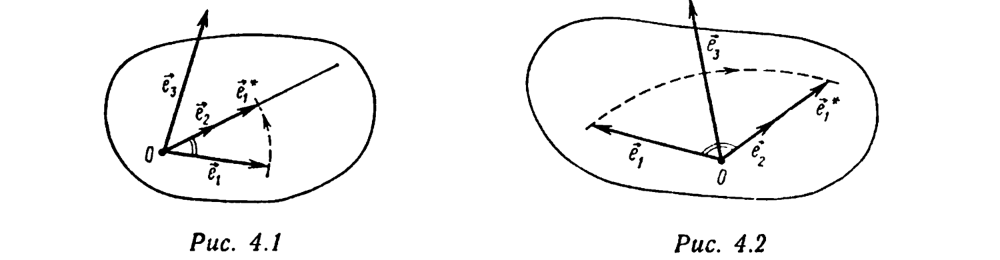

# Глава 4. Векторное и смешанное произведения

## § 1. Ориентация на плоскости и в пространстве

Пусть $\{\vec e_1, \vec e_2, \vec e_3\}$ и $\{\vec e_1', \vec e_2', \vec e_3'\}$ — два базиса в пространстве и пусть $S$ ($S'$) — матрица перехода от первого базиса ко второму (от второго — к первому, см. § 6, гл. 2). Говорят, что базис $\{\vec e_1', \vec e_2', \vec e_3'\}$ имеет *ту же ориентацию*, что и базис $\{\vec e_1, \vec e_2, \vec e_3\}$, если $\det S > 0$. При этом пишут $\{\vec e_1', \vec e_2', \vec e_3'\} \sim \{\vec e_1, \vec e_2, \vec e_3\}$. Из свойств матрицы перехода (см. § 6 гл. 2) следует, что: $1^\circ$) $\{\vec e_1, \vec e_2, \vec e_3\} \sim \{\vec e_1, \vec e_2, \vec e_3\}$ и $2^\circ$) $\{\vec e_1, \vec e_2, \vec e_3\} \sim \{\vec e_1', \vec e_2', \vec e_3'\}$, если $\{\vec e_1', \vec e_2', \vec e_3'\} \sim \{\vec e_1, \vec e_2, \vec e_3\}$. Поэтому говорят об *одинаково ориентированных* базисах $\{\vec e_1, \vec e_2, \vec e_3\}$ и $\{\vec e_1', \vec e_2', \vec e_3'\}$, если $\{\vec e_1, \vec e_2, \vec e_3\} \sim \{\vec e_1', \vec e_2', \vec e_3'\}$. Если два базиса $\{\vec e_1, \vec e_2, \vec e_3\}$ и $\{\vec e_1', \vec e_2', \vec e_3'\}$ не являются одинаково ориентированными, то говорят, что они *противоположно ориентированы*, и пишут $\{\vec e_1, \vec e_2, \vec e_3\} \approx \{\vec e_1', \vec e_2', \vec e_3'\}$. Из свойств матрицы перехода от базиса к базису вытекает также, что: $3^\circ$) если $\{\vec e_1, \vec e_2, \vec e_3\} \sim \{\vec e_1', \vec e_2', \vec e_3'\}$ и $\{\vec e_1', \vec e_2', \vec e_3'\} \sim \{\vec e_1'', \vec e_2'', \vec e_3''\}$, то $\{\vec e_1, \vec e_2, \vec e_3\} \sim \{\vec e_1'', \vec e_2'', \vec e_3''\}$. Таким образом, отношение $\sim$ является *отношением эквивалентности*

---
**стр. 179**

---

[см. свойства $1^\circ$)—$3^\circ$)] во множестве всех базисов в пространстве. Поскольку $\{\vec e_1'', \vec e_2'', \vec e_3''\} \sim \{\vec e_1', \vec e_2', \vec e_3'\}$, если $\{\vec e_1, \vec e_2, \vec e_3\} \approx \{\vec e_1', \vec e_2', \vec e_3'\}$ и $\{\vec e_1'', \vec e_2'', \vec e_3''\} \approx \{\vec e_1', \vec e_2', \vec e_3'\}$, множество базисов в пространстве разбивается отношением $\sim$ на *два* непересекающихся множества (*класса эквивалентности*) так, что всякий базис принадлежит одному и только одному классу. Два базиса, принадлежащие одному классу, одинаково ориентированы, любые два базиса, принадлежащие разным классам, противоположно ориентированы. Один из классов называется классом *правых* базисов (принадлежащие ему базисы называются *правыми* базисами, не принадлежащие — *левыми*). Обычно класс правых базисов выбирают так, что *всякий правый базис* $\{\vec e_1, \vec e_2, \vec e_3\}$ *удовлетворяет следующему требованию*: если базисные векторы отложить от одной точки и положить $\vec e_1^* = \dfrac{|\vec e_1|}{|\vec e_2|}\vec e_2$, то кратчайший поворот вектора $\vec e_1$ вокруг этой точки в плоскости векторов $\vec e_1$ и $\vec e_2$ до совмещения с вектором $\vec e_1^*$ осуществляется против часовой стрелки, если смотреть из конца вектора $\vec e_3$ (рис. 4.1, 4.2).

**Пример 1.** Пусть $\{\vec a, \vec b, \vec c\}$ — базис. Докажите, что: 1) $\{\vec a, \vec b, -\vec c\} \approx \{\vec a, \vec b, \vec c\}$; 2) $\{\vec a, \vec b, \vec c\} \sim \{\vec c, \vec a, \vec b\} \sim \{\vec b, \vec c, \vec a\} \approx \{\vec b, \vec a, \vec c\}$ и $\{\vec b, \vec a, \vec c\} \sim \{\vec c, \vec b, \vec a\} \sim \{\vec a, \vec c, \vec b\}$.

△ 1) Матрица $S$ перехода от базиса $\{\vec a, \vec b, \vec c\}$ к базису $\{\vec a, \vec b, -\vec c\}$ равна
$$S = \begin{pmatrix} 1 & 0 & 0 \\ 0 & 1 & 0 \\ 0 & 0 & -1 \end{pmatrix}, \quad \det S = 1\cdot\begin{vmatrix} 1 & 0 \\ 0 & -1 \end{vmatrix} = -1 < 0,$$
$$\{\vec a, \vec b, -\vec c\} \approx \{\vec a, \vec b, \vec c\}.$$

---
**стр. 180**

---

2) Матрицы $S_1$, $S_2$, $S_3$, $S_4$, $S_5$ перехода от базиса $\{\vec a, \vec b, \vec c\}$ соответственно к базисам $\{\vec c, \vec a, \vec b\}$, $\{\vec b, \vec c, \vec a\}$, $\{\vec b, \vec a, \vec c\}$, $\{\vec c, \vec b, \vec a\}$, $\{\vec a, \vec c, \vec b\}$ равны:

$$S_1 = \begin{pmatrix} 0 & 1 & 0 \\ 0 & 0 & 1 \\ 1 & 0 & 0 \end{pmatrix}, \quad \det S_1 = -1\cdot\begin{vmatrix} 0 & 1 \\ 1 & 0 \end{vmatrix} = 1, \quad \{\vec a, \vec b, \vec c\} \sim \{\vec c, \vec a, \vec b\};$$

$$S_2 = \begin{pmatrix} 0 & 0 & 1 \\ 1 & 0 & 0 \\ 0 & 1 & 0 \end{pmatrix}, \quad \det S_2 = 1\cdot\begin{vmatrix} 1 & 0 \\ 0 & 1 \end{vmatrix} = 1, \quad \{\vec a, \vec b, \vec c\} \sim \{\vec b, \vec c, \vec a\};$$

$$S_3 = \begin{pmatrix} 0 & 1 & 0 \\ 1 & 0 & 0 \\ 0 & 0 & 1 \end{pmatrix}, \quad \det S_3 = -1\cdot\begin{vmatrix} 1 & 0 \\ 0 & 1 \end{vmatrix} = -1,$$
$$\{\vec a, \vec b, \vec c\} \approx \{\vec b, \vec a, \vec c\};$$

$$S_4 = \begin{pmatrix} 0 & 0 & 1 \\ 0 & 1 & 0 \\ 1 & 0 & 0 \end{pmatrix}, \quad \det S_4 = 1\cdot\begin{vmatrix} 0 & 1 \\ 1 & 0 \end{vmatrix} = -1, \quad \{\vec b, \vec a, \vec c\} \sim \{\vec c, \vec b, \vec a\};$$

$$S_5 = \begin{pmatrix} 1 & 0 & 0 \\ 0 & 0 & 1 \\ 0 & 1 & 0 \end{pmatrix}, \quad \det S_5 = 1\cdot\begin{vmatrix} 0 & 1 \\ 1 & 0 \end{vmatrix} = -1,$$
$$\{\vec b, \vec a, \vec c\} \sim \{\vec a, \vec c, \vec b\}. \ ▲$$

Говорят, что на одной плоскости два базиса $\{\vec e_1, \vec e_2\}$ и $\{\vec e_1', \vec e_2'\}$ имеют *одинаковую ориентацию*, и пишут $\{\vec e_1', \vec e_2'\} \sim \{\vec e_1, \vec e_2\}$, если $\det S > 0$, или, что то же, $\det S' > 0$, где $S$ и $S'$ — матрицы перехода соответственно от базиса $\{\vec e_1, \vec e_2\}$ к базису $\{\vec e_1', \vec e_2'\}$ и от базиса $\{\vec e_1', \vec e_2'\}$ к базису $\{\vec e_1, \vec e_2\}$. Как и в случае пространства, отношение $\sim$ является *отношением эквивалентности во множестве всех базисов одной плоскости*. Данное отношение разбивает это множество на два класса: класс *правых* и класс *левых* базисов. *В правом базисе кратчайший поворот от $\vec e_1$ к $\vec e_2$ осуществляется против часовой стрелки, в левом базисе — по часовой стрелке.*

Условимся всюду в дальнейшем через $\{\vec i, \vec j, \vec k\}$ ($\{\vec i, \vec j\}$) обозначать правый ортонормированный базис в пространстве (в плоскости).

Класс правых ортонормированных базисов в плоскости (в пространстве), однозначно определенный любым своим представителем, называется положительной *ориентацией на плоскости (в пространстве)*. Если задан какой-нибудь правый базис $\{\vec i, \vec j\}$ ($\{\vec i, \vec j, \vec k\}$), то говорят, что на плоскости (в пространстве) с помощью базиса $\{\vec i, \vec j\}$ ($\{\vec i, \vec j, \vec k\}$) задана положительная ориентация. Плоскость (пространство) при этом называют *ориентированной* (*ориентированным*). Ориентацию, задаваемую левым ортонормированным базисом, называют *отрицательной*.
