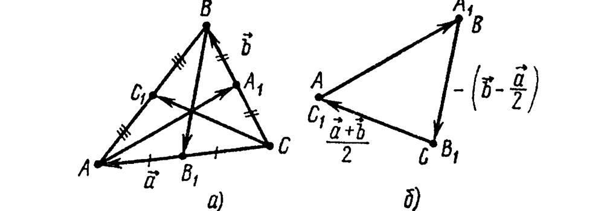
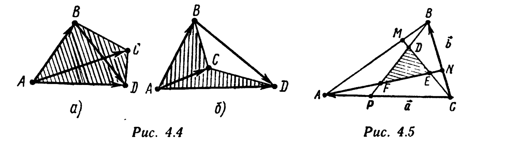
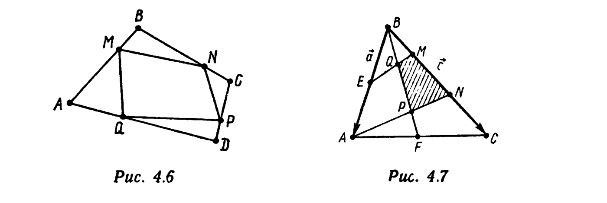
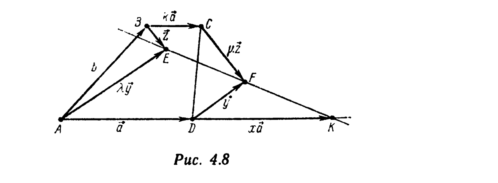

# Глава 4. Векторное и смешанное произведения

## § 2. Определение и свойства векторного произведения. Условие коллинеарности векторов. Площадь треугольника и четырехугольника

---
**стр. 181**
---

Зафиксируем правый ортонормированный базис $\{\vec i, \vec j, \vec k\}$. Пусть $\vec a = (a_x; a_y; a_z)$ и $\vec b = (b_x; b_y; b_z)$ — произвольные векторы. *Векторным произведением* $[\vec a, \vec b]$ *векторов* $\vec a$ *и* $\vec b$ (в указанном порядке) называется вектор

$$[\vec a, \vec b] = \begin{vmatrix} \vec i & \vec j & \vec k \\ a_x & a_y & a_z \\ b_x & b_y & b_z \end{vmatrix} = \vec i\begin{vmatrix} a_y & a_z \\ b_y & b_z \end{vmatrix} - \vec j\begin{vmatrix} a_x & a_z \\ b_x & b_z \end{vmatrix} + \vec k\begin{vmatrix} a_x & a_y \\ b_x & b_y \end{vmatrix} = \left( \begin{vmatrix} a_y & a_z \\ b_y & b_z \end{vmatrix}; -\begin{vmatrix} a_x & a_z \\ b_x & b_z \end{vmatrix}; \begin{vmatrix} a_x & a_y \\ b_x & b_y \end{vmatrix} \right). \quad (4.1)$$

Из свойств определителей вытекают следующие свойства векторного произведения:

$1^\circ$. $[\vec b, \vec a] = -[\vec a, \vec b]$ (антикоммутативность). $\quad (4.2)$

□ $[\vec b, \vec a] = \begin{vmatrix} \vec i & \vec j & \vec k \\ b_x & b_y & b_z \\ a_x & a_y & a_z \end{vmatrix} = -\begin{vmatrix} \vec i & \vec j & \vec k \\ a_x & a_y & a_z \\ b_x & b_y & b_z \end{vmatrix} = -[\vec a, \vec b]. \ ■$

---
**стр. 182**

---

$2^\circ$. *Для любых векторов* $\vec a' = (a_x'; a_y'; a_z')$, $\vec a'' = (a_x''; a_y''; a_z'')$, $\vec b = (b_x; b_y; b_z)$ *и любых чисел* $\alpha$ *и* $\beta$ *справедливы равенства*
$$[\alpha\vec a' + \beta\vec a'', \vec b] = \alpha[\vec a', \vec b] + \beta[\vec a'', \vec b], \quad (4.3)$$
$$[\vec b, \alpha\vec a' + \beta\vec a''] = \alpha[\vec b, \vec a'] + \beta[\vec b, \vec a''].$$

□ Согласно свойству определителей,
$$[\alpha\vec a' + \beta\vec a'', \vec b] = \begin{vmatrix} \vec i & \vec j & \vec k \\ \alpha a_x' + \beta a_x'' & \alpha a_y' + \beta a_y'' & \alpha a_z' + \beta a_z'' \\ b_x & b_y & b_z \end{vmatrix} =$$
$$= \alpha\begin{vmatrix} \vec i & \vec j & \vec k \\ a_x' & a_y' & a_z' \\ b_x & b_y & b_z \end{vmatrix} + \beta\begin{vmatrix} \vec i & \vec j & \vec k \\ a_x'' & a_y'' & a_z'' \\ b_x & b_y & b_z \end{vmatrix} = \alpha[\vec a', \vec b] + \beta[\vec a'', \vec b],$$

$$[\vec b, \alpha\vec a' + \beta\vec a''] = -[\alpha\vec a' + \beta\vec a'', \vec b] = -(\alpha[\vec a', \vec b] + \beta[\vec a'', \vec b]) =$$
$$= -(-\alpha[\vec b, \vec a'] - \beta[\vec b, \vec a'']) = \alpha[\vec b, \vec a'] + \beta[\vec b, \vec a''].$$

Здесь несколько раз использовано свойство $1^\circ$. ■

**Пример 1.** Докажите, что $[\vec a, \vec a] = \vec 0$.

△ Согласно свойству $1^\circ$, $[\vec a, \vec a] = -[\vec a, \vec a]$. Поэтому $2[\vec a, \vec a] = \vec 0$, $[\vec a, \vec a] = \vec 0$. ▲

Приведем геометрические свойства векторного произведения двух векторов.

**I.** *Вектор* $[\vec a, \vec b]$ *ортогонален как вектору* $\vec a$, *так и вектору* $\vec b$.

□ По формулам (3.31), (4.1), согласно свойству $3^\circ$ определителей имеем
$$(\vec a, [\vec a, \vec b]) = a_x\begin{vmatrix} a_y & a_z \\ b_y & b_z \end{vmatrix} - a_y\begin{vmatrix} a_x & a_z \\ b_x & b_z \end{vmatrix} + a_z\begin{vmatrix} a_x & a_y \\ b_x & b_y \end{vmatrix} = \begin{vmatrix} a_x & a_y & a_z \\ a_x & a_y & a_z \\ b_x & b_y & b_z \end{vmatrix} = 0.$$

Отсюда следует, что $(\vec b, [\vec a, \vec b]) = -(\vec b, [\vec b, \vec a]) = -0 = 0$. ■

---
**стр. 183**

---

**II.** *Длина вектора* $[\vec a, \vec b]$ *численно равна площади* $S$ *параллелограмма, построенного на векторах* $\vec a$ *и* $\vec b$, *т. е.*
$$|[\vec a, \vec b]| = |\vec a|\cdot|\vec b|\cdot\sin(\widehat{\vec a, \vec b}).$$

□ Пусть $\varphi = (\widehat{\vec a, \vec b})$. Тогда
$$S^2 = |\vec a|^2|\vec b|^2\sin^2\varphi = |\vec a|^2|\vec b|^2 - |\vec a|^2|\vec b|^2\cos^2\varphi =$$
$$= (a_x^2+a_y^2+a_z^2)(b_x^2+b_y^2+b_z^2) - (a_xb_x+a_yb_y+a_zb_z)^2.$$

В силу тождества, связанного с тремя определителями,
$$S^2 = \left(\begin{vmatrix} a_y & a_z \\ b_y & b_z \end{vmatrix}\right)^2 + \left(-\begin{vmatrix} a_x & a_z \\ b_x & b_z \end{vmatrix}\right)^2 + \left(\begin{vmatrix} a_x & a_y \\ b_x & b_y \end{vmatrix}\right)^2 = |[\vec a, \vec b]|^2. \ ■$$

**III.** Из определения векторного произведения и признака коллинеарности векторов следует, что *векторы* $\vec a$ *и* $\vec b$ *коллинеарны тогда и только тогда, когда* $[\vec a, \vec b] = \vec 0$.

**IV.** *Если векторы* $\vec a$ *и* $\vec b$ *не коллинеарны, то* $\{\vec a, \vec b, [\vec a, \vec b]\}$ *— правый базис.*

□ Достаточно доказать, что определитель матрицы перехода от базиса $\{\vec i, \vec j, \vec k\}$ к базису $\{\vec a, \vec b, [\vec a, \vec b]\}$ положителен. Пусть
$$c_x = \begin{vmatrix} a_y & a_z \\ b_y & b_z \end{vmatrix}, \quad c_y = -\begin{vmatrix} a_x & a_z \\ b_x & b_z \end{vmatrix}, \quad c_z = \begin{vmatrix} a_x & a_y \\ b_x & b_y \end{vmatrix} \text{ — координаты вектора } [\vec a, \vec b].$$

Тогда
$$\begin{vmatrix} a_x & b_x & c_x \\ a_y & b_y & c_y \\ a_z & b_z & c_z \end{vmatrix} = \begin{vmatrix} a_x & a_y & a_z \\ b_x & b_y & b_z \\ c_x & c_y & c_z \end{vmatrix} = \begin{vmatrix} c_x & c_y & c_z \\ a_x & a_y & a_z \\ b_x & b_y & b_z \end{vmatrix} = c_x\begin{vmatrix} a_y & a_z \\ b_y & b_z \end{vmatrix} - c_y\begin{vmatrix} a_x & a_z \\ b_x & b_z \end{vmatrix} + c_z\begin{vmatrix} a_x & a_y \\ b_x & b_y \end{vmatrix} = c_x^2+c_y^2+c_z^2 = |[\vec a, \vec b]|^2 > 0,$$

поскольку векторы $\vec a$ и $\vec b$ не коллинеарны. ■

Для данных векторов $\vec a$ и $\vec b$ свойствами I—IV вектор

---
**стр. 184**

---

$[\vec a, \vec b]$ определяется однозначно: если $\vec a \| \vec b$, то согласно свойству III $[\vec a, \vec b] = \vec 0$. Если же $\vec a \neq \vec b$, то на основании свойства I вектор $[\vec a, \vec b]$ перпендикулярен плоскости $P$, в которой векторы $\vec a$ и $\vec b$ образуют базис (этим однозначно с точностью до параллельности определяется прямая, которой вектор $[\vec a, \vec b]$ параллелен), длина вектора $[\vec a, \vec b]$ согласно свойству II численно равна площади параллелограмма, построенного на векторах $\vec a$ и $\vec b$, и направление вектора $[\vec a, \vec b]$ определяется с помощью свойства IV из условия, что $\{\vec a, \vec b, [\vec a, \vec b]\}$ — правый базис. Таким образом, свойства I—IV можно было бы принять за определение векторного произведения. Этому определению удовлетворил бы вектор $[\vec a, \vec b]$, определяемый формулой (4.1), и только он. Часто так и поступают: векторное произведение определяют с помощью свойств I—IV, а формулу (4.1) выводят из такого определения и затем используют в вычислениях.

**Пример 2.** Найдите $[\vec a, \vec b]$, если в базисе $\{\vec i, \vec j, \vec k\}$ $\vec a = (-1; 0; 1)$, $\vec b = (2; 1; 3)$.

△ По формуле (4.1),
$$[\vec a, \vec b] = \begin{vmatrix} \vec i & \vec j & \vec k \\ -1 & 0 & 1 \\ 2 & 1 & 3 \end{vmatrix} = \vec i\begin{vmatrix} 0 & 1 \\ 1 & 3 \end{vmatrix} - \vec j\begin{vmatrix} -1 & 1 \\ 2 & 3 \end{vmatrix} + \vec k\begin{vmatrix} -1 & 0 \\ 2 & 1 \end{vmatrix} = (-1; 5; -1). \ ▲$$

**Пример 3.** Пусть $\{\vec i', \vec j', \vec k'\}$ — произвольный правый ортонормированный базис. Докажите, что для любых векторов $\vec a = (a_x'; a_y'; a_z')$ и $\vec b = (b_x'; b_y'; b_z')$, заданных координатами в этом базисе,
$$[\vec a, \vec b] = \begin{vmatrix} \vec i' & \vec j' & \vec k' \\ a_x' & a_y' & a_z' \\ b_x' & b_y' & b_z' \end{vmatrix},$$

иначе говоря, *вид правой части формулы (4.1) не зависит от выбора правого ортонормированного базиса*.

□ Вектор $[\vec i', \vec j']$ имеет длину, равную 1 (свойство II), ортогонален как $\vec i'$, так и $\vec j'$ (свойство I), причем $\{\vec i', \vec j',

---
**стр. 185**

---

$[\vec i', \vec j']\}$ есть не что иное, как $\vec k'$, т. е. $[\vec i', \vec j'] = \vec k'$. Аналогично устанавливается, что $[\vec j', \vec k'] = \vec i'$, $[\vec k', \vec i'] = \vec j'$. Поскольку $\vec a = a_x'\vec i' + \vec a''$, где $\vec a'' = a_y'\vec j' + a_z'\vec k'$, согласно свойству $2^\circ$, $[\vec a, \vec b] = a_x'[\vec i', \vec b] + [\vec a'', \vec b] = a_x'[\vec i', \vec b] + a_y'[\vec j', \vec b] + a_z'[\vec k', \vec b]$. Далее, полагая $\vec b'' = b_y'\vec j' + b_z'\vec k'$, получим по свойству $2^\circ$ $[\vec i', \vec b] = [\vec i', b_x'\vec i'] + [\vec i', \vec b''] = b_x'[\vec i', \vec i'] + b_y'[\vec i', \vec j'] + b_z'[\vec i', \vec k'] = b_y'[\vec i', \vec j'] - b_z'[\vec k', \vec i'] = b_y'\vec k' - b_z'\vec j'$. Аналогично, $[\vec j', \vec b] = -b_x'\vec k' + b_z'\vec i'$, $[\vec k', \vec b] = b_x'\vec j' - b_y'\vec i'$. Следовательно,
$$[\vec a, \vec b] = a_x'(b_y'\vec k' - b_z'\vec j') + a_y'(-b_x'\vec k' + b_z'\vec i') + a_z'(b_x'\vec j' - b_y'\vec i') = \vec i'(a_y'b_z' - a_z'b_y') - \vec j'(a_x'b_z' - a_z'b_x') +$$
$$+ \vec k'(a_x'b_y' - a_y'b_x') = \begin{vmatrix} \vec i' & \vec j' & \vec k' \\ a_x' & a_y' & a_z' \\ b_x' & b_y' & b_z' \end{vmatrix}. \ ■$$

Пусть $P$ — фиксированная плоскость в пространстве, $\{\vec i', \vec j'\}$ — ортонормированный (не обязательно правый) базис в плоскости $P$, $\vec a = a_x\vec i' + a_y\vec j'$ и $\vec b = b_x\vec i' + b_y\vec j'$ — произвольные векторы, параллельные плоскости $P$. Положим $\vec k' = [\vec i', \vec j']$. Тогда $\{\vec i', \vec j', \vec k'\}$ — правый ортонормированный базис в пространстве (свойство IV), в этом базисе
$$\vec a = (a_x; a_y; 0), \quad \vec b = (b_x; b_y; 0), \quad [\vec a, \vec b] = \begin{vmatrix} \vec i' & \vec j' & \vec k' \\ a_x & a_y & 0 \\ b_x & b_y & 0 \end{vmatrix} = (0; 0; a_xb_y - b_xa_y).$$

Поэтому площадь $S$ параллелограмма, лежащего в плоскости $P$ и построенного на векторах $\vec a = a_x\vec i' + a_y\vec j'$ и $\vec b = b_x\vec i' + b_y\vec j'$, равна
$$S = |a_xb_y - a_yb_x|. \quad (4.4)$$

---
**стр. 186**

---

Далее в этом параграфе, если не оговорено противное, считаем, что координаты векторов заданы в правом ортонормированном базисе $\{\vec i, \vec j, \vec k\}$ (на плоскости $\{\vec i, \vec j\}$), а координаты точек — в соответствующей прямоугольной системе координат $\{O, \vec i, \vec j, \vec k\}$ (на плоскости $\{O, \vec i, \vec j\}$).

**Пример 4.** Проверьте, что векторы $\vec a = (1; 0; -1)$, $\vec b = (-1; 1; 0)$, $\vec c = (2; 0; -3)$ не компланарны. Найдите единичный вектор $\vec d$, ортогональный векторам $\vec a$ и $\vec b$, такой, что $\{\vec a, \vec b, \vec d\} \sim \{\vec a, \vec b, \vec c\}$.

△ Имеем
$$\begin{vmatrix} a_x & a_y & a_z \\ b_x & b_y & b_z \\ c_x & c_y & c_z \end{vmatrix} = \begin{vmatrix} a_x & b_x & c_x \\ a_y & b_y & c_y \\ a_z & b_z & c_z \end{vmatrix} = \begin{vmatrix} 1 & -1 & 2 \\ 0 & 1 & 0 \\ -1 & 0 & -3 \end{vmatrix} = 1\cdot\begin{vmatrix} 1 & 0 \\ 0 & -3 \end{vmatrix} - (-1)\cdot\begin{vmatrix} 0 & 0 \\ -1 & -3 \end{vmatrix} + 2\cdot\begin{vmatrix} 0 & 1 \\ -1 & 0 \end{vmatrix} = -1 < 0.$$

Следовательно, векторы $\vec a$, $\vec b$, $\vec c$ не компланарны и $\{\vec a, \vec b, \vec c\}$ — левый базис. Искомый вектор $\vec d$ ортогонален как $\vec a$, так и $\vec b$, поэтому $\vec d \| [\vec a, \vec b]$. Поскольку $|\vec d| = 1$, возможны только два случая: $\vec d_1 = [\vec a, \vec b]/|[\vec a, \vec b]|$ или $\vec d_2 = -\vec d_1 = -[\vec a, \vec b]/|[\vec a, \vec b]|$. Согласно свойству IV, базис $\{\vec a, \vec b, [\vec a, \vec b]\}$, а следовательно, и одинаково ориентированный с ним базис $\{\vec a, \vec b, \vec d_1\}$ являются правыми. Так как $\{\vec a, \vec b, -\vec d_1\} \approx \{\vec a, \vec b, \vec d_1\}$, то $\{\vec a, \vec b, \vec d_2\}$ — левый базис, т.е. $\{\vec a, \vec b, \vec d_2\} \sim \{\vec a, \vec b, \vec c\}$. Значит, искомый вектор $\vec d$ равен $\vec d_2$. Имеем
$$[\vec a, \vec b] = \begin{vmatrix} \vec i & \vec j & \vec k \\ 1 & 0 & -1 \\ -1 & 1 & 0 \end{vmatrix} = \vec i\begin{vmatrix} 0 & -1 \\ 1 & 0 \end{vmatrix} - \vec j\begin{vmatrix} 1 & -1 \\ -1 & 0 \end{vmatrix} + \vec k\begin{vmatrix} 1 & 0 \\ -1 & 1 \end{vmatrix} = (1; 1; 1), \quad |[\vec a, \vec b]| = \sqrt3.$$

Следовательно, $\vec d = (-1/\sqrt3; -1/\sqrt3; -1/\sqrt3)$. ▲

**Пример 5.** Найдите площадь параллелограмма, построенного на векторах $\vec a = (-1; 3)$ и $\vec b = (1; 2)$.

△ По формуле (4.4) $S = |(-1)\cdot2 - 3\cdot1| = 5$.▲

---
**стр. 187**

---

**Пример 6.** Вычислите площадь треугольника, вершины которого находятся в точках $A(-1; 0; -1)$, $B(0; 2; -3)$, $C(4; 4; 1)$.

△ Площадь $\triangle ABC$ равна половине площади параллелограмма, построенного на векторах $\overrightarrow{AB}$ и $\overrightarrow{AC}$:
$$S_{ABC} = \frac12|[\overrightarrow{AB}, \overrightarrow{AC}]| = \frac12\sqrt{\left(\begin{vmatrix} a_y & a_z \\ b_y & b_z \end{vmatrix}\right)^2 + \left(-\begin{vmatrix} a_x & a_z \\ b_x & b_z \end{vmatrix}\right)^2 + \left(\begin{vmatrix} a_x & a_y \\ b_x & b_y \end{vmatrix}\right)^2}, \quad (4.5)$$

где $a_x=1$, $a_y=2$, $a_z=-2$ и $b_x=5$, $b_y=4$, $b_z=2$ — соответственно координаты векторов $\vec a=\overrightarrow{AB}$ и $\vec b=\overrightarrow{AC}$. Таким образом, $S_{ABC} = (1/2)\sqrt{12^2+(-12)^2+(-6)^2} = 3\sqrt{2^2+2^2+1} = 9$. ▲

**Пример 7.** Даны векторы $\vec a$ и $\vec b$. Выразите векторы 1) $[\vec a+\vec b, \vec a-\vec b]$ и 2) $[(\vec a+\vec b)/2, \vec b-\vec a/2]$ через вектор $\vec c = [\vec a, \vec b]$.

△ Согласно свойству линейности векторного произведения имеем 1) $[\vec a+\vec b, \vec a-\vec b] = [\vec a, \vec a-\vec b]+[\vec b, \vec a-\vec b] = [\vec a, \vec a]-[\vec a, \vec b]+[\vec b, \vec a]-[\vec b, \vec b] = \vec 0-[\vec a, \vec b]-[\vec a, \vec b]-\vec 0 = -2\vec c$.

Здесь учтены свойство (4.2) и результат примера 1.

2) Аналогично, $[(\vec a+\vec b)/2, \vec b-\vec a/2] = (1/2)[\vec a, \vec b-\vec a/2]+(1/2)[\vec b, \vec b-\vec a/2] = (1/2)[\vec a, \vec b]-(1/4)[\vec a, \vec a]+(1/2)[\vec b, \vec b]-(1/4)[\vec b, \vec a] = (1/2)\vec c-(1/4)(-\vec c) = (3/4)\vec c$. ▲

**Пример 8.** Три ненулевых вектора $\vec a$, $\vec b$, $\vec c$ связаны соотношениями $\vec a=[\vec b, \vec c]$, $\vec b=[\vec c, \vec a]$, $\vec c=[\vec a, \vec b]$. Найдите длины этих векторов и углы между ними.

△ Так как $\vec a=[\vec b, \vec c]$, то $\vec a \perp \vec b$ и $\vec a \perp \vec c$. Кроме того, $\vec b=[\vec c, \vec a]$, поэтому $\vec b \perp \vec c$. Значит, все три вектора попарно

---
**стр. 188**

---

ортогональны. Далее, $|\vec a|=|\vec b||\vec c|\sin(\widehat{\vec b, \vec c})=|\vec b||\vec c|$, $|\vec b|=|\vec c||\vec a|$, $|\vec c|=|\vec a||\vec b|$. Перемножая эти соотношения, получаем $|\vec a||\vec b||\vec c|=1$. Учитывая, что $|\vec b||\vec c|=|\vec a|$, имеем $|\vec a|^2=1$, т. е. $|\vec a|=1$. Аналогично, $|\vec b|=|\vec c|=1$. Так как $\vec c=[\vec a, \vec b]$, то $\{\vec a, \vec b, \vec c\}$ — правый ортонормированный базис. ▲

**Пример 9.** Докажите, что если три вектора $\vec a$, $\vec b$, $\vec c$ попарно не коллинеарны, то условия $[\vec a, \vec b]=[\vec b, \vec c]=[\vec c, \vec a]$ и $\vec a+\vec b+\vec c=\vec 0$ эквивалентны.

□ Если $\vec a+\vec b+\vec c=\vec 0$, то, умножая это равенство векторно на $\vec a$, получаем $[\vec a, \vec a]+[\vec a, \vec b]-[\vec c, \vec a]=\vec 0$. Отсюда $[\vec a, \vec b]=[\vec c, \vec a]$. Если умножить не на $\vec a$, а на $\vec b$, то получим $[\vec a, \vec b]=[\vec b, \vec c]$.

Обратно: если $[\vec a, \vec b]=[\vec b, \vec c]$, т.е. $[\vec a+\vec c, \vec b]=\vec 0$, то согласно свойству III векторного произведения $\vec a+\vec c \| \vec b$, т.е. существует такое число $\lambda$, что $\vec a+\vec c+\lambda\vec b=\vec 0$. Выражая отсюда $\vec a=-\vec c-\lambda\vec b$ и подставляя в равенство $[\vec b, \vec c]=[\vec c, \vec a]$, получаем $[\vec b, \vec c]=\lambda[\vec b, \vec c]$, т.е. $(1-\lambda)[\vec b, \vec c]=\vec 0$. Векторы $\vec b$ и $\vec c$ не коллинеарны, т.е. $[\vec b, \vec c]\neq\vec 0$. Следовательно, $\lambda=1$ и $\vec a+\vec c+\vec b=\vec 0$. ■

**Пример 10.** Даны разложения векторов $\vec a$ и $\vec b$ по базису $\{\vec e_1, \vec e_2, \vec e_3\}$: $\vec a=a_x\vec e_1+a_y\vec e_2+a_z\vec e_3$, $\vec b=b_x\vec e_1+b_y\vec e_2+b_z\vec e_3$. Разложите вектор $[\vec a, \vec b]$ по векторам $\vec f_1=[\vec e_2, \vec e_3]$, $\vec f_2=[\vec e_3, \vec e_1]$, $\vec f_3=[\vec e_1, \vec e_2]$.

△ Согласно свойству линейности векторного произведения, $[\vec a, \vec b] = [a_x\vec e_1+a_y\vec e_2+a_z\vec e_3, \vec b] = a_x[\vec e_1, \vec b] + a_y[\vec e_2, \vec b] + a_z[\vec e_3, \vec b]$. Аналогично, $[\vec e_1, \vec b] = [\vec e_1, b_x\vec e_1 + b_y\vec e_2 + b_z\vec e_3] = b_x[\vec e_1, \vec e_1] + b_y[\vec e_1, \vec e_2] + b_z[\vec e_1, \vec e_3] = b_y\vec f_3 - b_z\vec f_2$ (здесь учтено равенство $[\vec e_1, \vec e_1]=\vec 0$). Так же проверяется, что $[\vec e_2, \vec b] = b_z\vec f_1 - b_x\vec f_3$, $[\vec e_3, \vec b] = b_x\vec f_2 - b_y\vec f_1$. Следовательно,

$$[\vec a, \vec b] = a_x(b_y\vec f_3 - b_z\vec f_2) + a_y(b_z\vec f_1 - b_x\vec f_3) + a_z(b_x\vec f_2 - b_y\vec f_1) =$$
$$= \vec f_1\begin{vmatrix} a_y & a_z \\ b_y & b_z \end{vmatrix} - \vec f_2\begin{vmatrix} a_x & a_z \\ b_x & b_z \end{vmatrix} + \vec f_3\begin{vmatrix} a_x & a_y \\ b_x & b_y \end{vmatrix} = \begin{vmatrix} \vec f_1 & \vec f_2 & \vec f_3 \\ a_x & a_y & a_z \\ b_x & b_y & b_z \end{vmatrix}. \ ▲ \quad (4.6)$$

---
**стр. 189**
---

**Пример 11.** Докажите, что площадь $S$ треугольника, векторы сторон которого равны векторам медиан треугольника $ABC$ (рис. 4.3, $a$, $б$), составляет 3/4 площади $\sigma$ треугольника $ABC$.

△ Пусть $\vec a = \overrightarrow{CA}$, $\vec b = \overrightarrow{CB}$. Тогда $\overrightarrow{CC_1} = (\vec a+\vec b)/2$, $\overrightarrow{B_1B} = \vec b-\vec a/2$, $[\overrightarrow{CC_1}, \overrightarrow{B_1B}] = [(\vec a+\vec b)/2, \vec b-\vec a/2] = (3/4)[\vec a, \vec b]$ (см. пример 7). Поэтому $S = (1/2)|[\overrightarrow{CC_1}, \overrightarrow{B_1B}]| = (3/4)(1/2)|[\vec a, \vec b]| = (3/4)\sigma$.▲

**Пример 12.** Дан треугольник $ABC$. На прямых $(AB)$, $(BC)$, $(CA)$ выбраны соответственно точки $M$, $N$, $P$ так, что $\overrightarrow{AM}=\alpha\overrightarrow{AB}$, $\overrightarrow{BN}=\alpha\overrightarrow{BC}$, $\overrightarrow{CP}=\alpha\overrightarrow{CA}$. При каком значении $\alpha$ площадь $S(\alpha)$ треугольника, векторы сторон которого суть $\overrightarrow{CM}$, $\overrightarrow{AN}$ и $\overrightarrow{BP}$, наименьшая?

△ Пусть $\vec a=\overrightarrow{CA}$, $\vec b=\overrightarrow{CB}$. На основании результата примера 11 § 3 гл. 2 векторы $\overrightarrow{CM}$, $\overrightarrow{AN}$, $\overrightarrow{BP}$ действительно образуют треугольник, причем $\overrightarrow{CM}=(1-\alpha)\vec a+\alpha\vec b$, $\overrightarrow{AN}=-\vec a+(1-\alpha)\vec b$. Поэтому

$$S(\alpha) = (1/2)|[\overrightarrow{CM}, \overrightarrow{AN}]| = (1/2)|[(1-\alpha)\vec a+\alpha\vec b, -\vec a+(1-\alpha)\vec b]| = (1/2)|-\alpha[\vec b, \vec a]+(1-\alpha)^2[\vec a, \vec b]| =$$
$$= (1/2)(1-\alpha+\alpha^2)|[\vec a, \vec b]| = (1-\alpha+\alpha^2)S_{ABC}.$$

Минимум этого выражения достигается при $\alpha=1/2$, т.е. в случае, когда $\overrightarrow{CM}$, $\overrightarrow{AN}$, $\overrightarrow{BP}$ — медианы $\triangle ABC$ (пример 11). Этот минимум равен $(3/4)S_{ABC}$. ▲

**Пример 13.** Треугольники $ABC$ и $ACD$ расположены в

---
**стр. 190**

---

одной плоскости так, что точки $B$ и $D$ лежат по разные стороны от прямой $(AC)$ (рис. 4.4, $a$, $б$). Докажите, что площадь $S$ четырехугольника $ABCD$ равна
$$S = \frac12|[\overrightarrow{AC}, \overrightarrow{BD}]|. \quad (4.7)$$

△ По условию задачи, $\{\overrightarrow{AD}, \overrightarrow{AC}\} \sim \{\overrightarrow{AC}, \overrightarrow{AB}\}$. Поэтому векторы $[\overrightarrow{AD}, \overrightarrow{AC}]$ и $[\overrightarrow{AC}, \overrightarrow{AB}]$ сонаправлены, и, следовательно, длина суммы этих векторов равна сумме их длин:

$$|[\overrightarrow{AD}, \overrightarrow{AC}]| + |[\overrightarrow{AC}, \overrightarrow{AB}]| = |[\overrightarrow{AD}, \overrightarrow{AC}] + [\overrightarrow{AC}, \overrightarrow{AB}]| = |[\overrightarrow{AD}, \overrightarrow{AC}] - [\overrightarrow{AB}, \overrightarrow{AC}]| = |[\overrightarrow{AD} - \overrightarrow{AB}, \overrightarrow{AC}]| = |[\overrightarrow{BD}, \overrightarrow{AC}]|.$$

Так как $|[\overrightarrow{AD}, \overrightarrow{AC}]| = 2S_{ADC}$, $|[\overrightarrow{AC}, \overrightarrow{AB}]| = 2S_{ABC}$, $S = S_{ADC} + S_{ABC}$, то $S = (1/2)|[\overrightarrow{BD}, \overrightarrow{AC}]| = (1/2)|[\overrightarrow{AC}, \overrightarrow{BD}]|$.▲

**Пример 14\*.** Дан треугольник $ABC$, площадь которого $S$. На прямых $(AB)$, $(BC)$, $(CA)$ выбраны точки $M$, $N$, $P$ соответственно так, что $\overrightarrow{AM}=\alpha\overrightarrow{AB}$, $\overrightarrow{BN}=\beta\overrightarrow{BC}$, $\overrightarrow{CP}=\gamma\overrightarrow{CA}$, $\alpha\beta\gamma \neq (1-\alpha)(1-\beta)(1-\gamma)$, а прямые $(CM)$, $(BP)$ и $(AN)$ попарно пересекаются: $D=(CM)\cap(BP)$, $E=(CM)\cap(AN)$, $F=(BP)\cap(AN)$. Найдите площадь $\sigma$ треугольника $DEF$.

△ Поскольку $\alpha\beta\gamma \neq (1-\alpha)(1-\beta)(1-\gamma)$, точки $D$, $E$, $F$ попарно различны (рис. 4.5) (см. пример 9 § 8 гл. 2). Если в качестве базисных взять векторы $\vec a=\overrightarrow{CA}$ и $\vec b=\overrightarrow{CB}$, то $\overrightarrow{CM}=\alpha\vec b+(1-\alpha)\vec a$, $\overrightarrow{AN}=-\vec a+(1-\beta)\vec b$, $\overrightarrow{BP}=\gamma\vec a-\vec b$. Пусть $\overrightarrow{CE}=x\overrightarrow{CM}$, $\overrightarrow{CD}=y\overrightarrow{CM}$, $\overrightarrow{BD}=z\overrightarrow{BP}$, $\overrightarrow{BF}=u\overrightarrow{BP}$, $\overrightarrow{AF}=v\overrightarrow{AN}$, $\overrightarrow{AE}=w\overrightarrow{AN}$ (числа $x$, $y$, $z$, $u$, $v$, $w$ будем искать по правилу цикла, используя единственность разложения векторов по базису $\{\vec a, \vec b\}$). Из цикла $AECA$ получаем

$$\overrightarrow{AE}-\overrightarrow{CE}+\overrightarrow{CA}=\vec 0 \Leftrightarrow w(-\vec a+(1-\beta)\vec b) - x(\alpha\vec b+(1-\alpha)\vec a) + \vec a =$$
$$= 0\cdot\vec a+0\cdot\vec b \Leftrightarrow \begin{cases} -w-x(1-\alpha)+1=0, \\ w(1-\beta)-x\alpha=0 \end{cases} \Leftrightarrow w=$$
$$= \frac{\alpha}{1-\beta+\alpha\beta}, \quad x=\frac{1-\beta}{1-\beta+\alpha\beta}$$

---
**стр. 191**

---

[здесь использовано то обстоятельство, что $1-\beta+\alpha\beta \neq 0$. Действительно, числа $x$ и $w$ существуют (прямые $(AN)$ и $(CM)$ пересекаются) и удовлетворяют соотношениям $w(1-\beta+\alpha\beta)=\alpha$, $x(1-\beta+\alpha\beta)=1-\beta$. Если бы $1-\beta+\alpha\beta=0$, то имели бы $\alpha=0$, $1-\beta=0$ и, следовательно, $\alpha\beta\gamma=0=(1-\alpha)(1-\beta)(1-\gamma)$, что противоречит условию задачи]. Аналогично находим: $y=\gamma/(1-\alpha+\alpha\gamma)$, $z=(1-\alpha)/(1-\alpha+\alpha\gamma)$, $u=\beta/(1-\gamma+\beta\gamma)$, $v=(1-\gamma)/(1-\gamma+\beta\gamma)$. Площадь

$$\sigma = \frac12|[\overrightarrow{ED}, \overrightarrow{EF}]| = \frac12|[(y-x)\overrightarrow{CM}, (v-w)\overrightarrow{AN}]| =$$
$$= \frac12|y-x||v-w||[\overrightarrow{CM}, \overrightarrow{AN}]| = \frac12|y-x||v-w| \times$$
$$\times|[\alpha\vec b+(1-\alpha)\vec a, -\vec a+(1-\beta)\vec b]| = \frac12|y-x||v-w||\alpha[\vec a, \vec b] +$$
$$+ (1-\alpha)(1-\beta)[\vec a, \vec b]| = |y-x||v-w||1-\beta+\alpha\beta|S.$$

Поскольку
$$y-x = \frac{\gamma(1-\beta+\alpha\beta)-(1-\beta)(1-\alpha+\alpha\gamma)}{(1-\beta+\alpha\beta)(1-\alpha+\alpha\gamma)} = \frac{\alpha\beta\gamma-(1-\alpha)(1-\beta)(1-\gamma)}{(1-\beta+\alpha\beta)(1-\alpha+\alpha\gamma)},$$
$$v-w = -\frac{\alpha\beta\gamma-(1-\alpha)(1-\beta)(1-\gamma)}{(1-\beta+\alpha\beta)(1-\gamma+\beta\gamma)},$$

окончательно имеем
$$\sigma = \frac{(\alpha\beta\gamma-(1-\alpha)(1-\beta)(1-\gamma))^2}{|(1-\beta+\alpha\beta)(1-\gamma+\beta\gamma)(1-\alpha+\alpha\gamma)|}S. \ ▲$$

Отметим, что если $\alpha=\beta=\gamma=k \neq 1/2$, то
$$0 < \sigma = S_{DEF} = \frac{(2k-1)^2}{k^2-k+1}S = \frac{4(k-1/2)^2}{(k-\frac12)^2+3/4}S < 4S_{ABC}.$$

**Пример 15.** На сторонах $[AB]$, $[BC]$, $[CD]$ и $[DA]$ выпуклого четырехугольника $ABCD$ площади $S$ (рис. 4.6) расположены соответственно точки $M$, $N$, $P$, $Q$ так, что $|AM|:|AB| = |BN|:|BC| = |CP|:|CD| = |DQ|:|DA| = \alpha$. Найдите площадь $\sigma(\alpha)$ четырехугольника $MNPQ$. При каком значении $\alpha$ эта площадь минимальна?

△ По формуле (4.7), $\sigma(\alpha) = (1/2)|[\overrightarrow{MP}, \overrightarrow{NQ}]|$, где
$$\overrightarrow{MP} = \overrightarrow{MA}+\overrightarrow{AD}+\overrightarrow{DP} = -\alpha\overrightarrow{AB}+\overrightarrow{AD}-(1-\alpha)\overrightarrow{CD} =$$
$$= -\alpha\overrightarrow{AB}+\alpha\overrightarrow{AD}+(1-\alpha)\overrightarrow{AD}-(1-\alpha)\overrightarrow{CD} = \alpha\overrightarrow{BD} +$$
$$+ (1-\alpha)\overrightarrow{AC}, \quad \overrightarrow{NQ} = (1-\alpha)\overrightarrow{BD}-\alpha\overrightarrow{AC}, \quad [\overrightarrow{MP}, \overrightarrow{NQ}] =$$

---
**стр. 192**

---

$$= [\alpha\overrightarrow{BD}+(1-\alpha)\overrightarrow{AC}, (1-\alpha)\overrightarrow{BD}-\alpha\overrightarrow{AC}] = (2\alpha^2 - 2\alpha+1)[\overrightarrow{AC}, \overrightarrow{BD}]. \text{ Таким образом},$$

$$\sigma(\alpha) = (1/2)(2\alpha^2-2\alpha+1)|[\overrightarrow{AC}, \overrightarrow{BD}]| = (2\alpha^2-2\alpha+1)S.$$

Минимум $\sigma(\alpha)$ достигается при $\alpha=1/2$ и равен $(1/2)S$.▲

**Пример 16\*.** Площадь треугольника $ABC$ равна $S$. Точки $E$ и $F$ — соответственно середины сторон $[AB]$ и $[AC]$. Точки $M \neq C$ и $N$ лежат на стороне $[BC]$, причем $|MN|=|NC|$ (рис. 4.7). Прямые $(EM)$ и $(AN)$ пересекают медиану $[BF]$ соответственно в точках $Q$ и $P$. Докажите, что площадь $\sigma$ четырехугольника $MNPQ$ удовлетворяет неравенствам $(1/6)S \leqslant \sigma \leqslant (1/5)S$. В каких случаях: а) $\sigma=(1/5)S$; б) $\sigma=(1/6)S$?

△ Положим $\overrightarrow{BA}=\vec a$, $\overrightarrow{BC}=\vec c$, $\overrightarrow{NC}=(1/2)x\vec c$ (по условию задачи, $0 < x \leqslant 1$). Векторы $\overrightarrow{BP}$ и $\overrightarrow{BF}=(1/2)(\vec a+\vec c)$ сонаправлены. Поэтому существует такое число $\lambda$, что $\overrightarrow{BP}=\lambda(\vec a+\vec c)$. Аналогично, существует такое число $\alpha$, что $\overrightarrow{AP}=\alpha\overrightarrow{AN}=\alpha(-\vec a+(1-x/2)\vec c)$. Из цикла $ABPA$ получаем $-\vec a+\lambda(\vec a+\vec c)-\alpha(-\vec a+(1-x/2)\vec c)=\vec 0$, т.е. $\alpha+\lambda=1$, $\lambda=\alpha(1-x/2)$. Отсюда $\lambda=(2-x)/(4-x)$. Следовательно, площадь треугольника $BPN$ есть $S_{BPN} = (1/2)|[\overrightarrow{BP}, \overrightarrow{BN}]| = (1/2)|[\lambda(\vec a+\vec c), (1-x/2)\vec c]| = (1/2)\lambda(1-x/2)|[\vec a, \vec c]| = [(2-x)^2S]/[2(4-x)]$. Аналогично, рассмотрев цикл $EBQE$, находим
$$\overrightarrow{BQ} = \frac{1-x}{3-2x}(\vec a+\vec c), \quad S_{BQM} = \frac{(1-x)^2}{3-2x}S.$$

Таким образом,
$$\frac{S_{MNPQ}}{S} = \frac{S_{BPN}-S_{BQM}}{S} = \frac{(2-x)^2}{2(4-x)} - \frac{(1-x)^2}{3-2x} = f(x).$$

Функция $f(x)$ непрерывно дифференцируема на отрезке $[0, 1]$, причем $f'(x) = 5(2-x)(2-3x)/[2(4-x)^2(3-2x)^2]$. Следовательно, $f'(x) > 0$ на промежутке $(0, \tfrac23)$, т. е. $f(x)$ монотонно возрас-

---
**стр. 193**

---

тает на этом промежутке, и $f'(x) < 0$ на промежутке $(2/3, 1)$. Поэтому $f(x)$ достигает максимума в точке $x=2/3$, $f(2/3)=1/5$. Поскольку $f(0)=f(1)=1/6$, минимум $f(x)$ на промежутке $(0, 1]$ достигается при $x=1$. Таким образом, $\sigma=(1/5)S$, если $|BM|=|MN|=|NC|$ (в этом случае $(EM)\|(AN)$); $\sigma=(1/6)S$, если $M=B$. ▲

**Пример 17.** Докажите, что площадь трапеции $ABCD$ ($(AD)\|(BC)$) равна $\dfrac{1+k}{2}|[\overrightarrow{AB}, \overrightarrow{AD}]|$, где $k=|BC|:|AD|$.

△ Пусть $\vec a=\overrightarrow{AD}$, $\vec b=\overrightarrow{AB}$. Тогда $\overrightarrow{BC}=k\overrightarrow{AD}=k\vec a$, $\overrightarrow{AC}=\overrightarrow{AB}+\overrightarrow{BC}=\vec b+k\vec a$, $\overrightarrow{BD}=\overrightarrow{AD}-\overrightarrow{AB}=\vec a-\vec b$ и
$$S_{ABCD} = \frac12|[\overrightarrow{AC}, \overrightarrow{BD}]| = \frac12|[\vec b+k\vec a, \vec a-\vec b]| =$$
$$= \frac12|[\vec b, \vec a]-k[\vec a, \vec b]| = \frac{k+1}{2}|[\vec a, \vec b]|. \ ▲$$

**Пример 18\*.** Площадь трапеции $ABCD$ равна $S$, отношение длин оснований $|AD|:|BC| = \dfrac1k = 3$. На прямой, пересекающей в точке $K$ продолжение основания $[AD]$ за точку $D$, расположен от-

резок $[EF]$ так, что $(AE)\|(DF)$, $(BE)\|(CF)$, $|AE|:|DF| = m = 2$, $|CF|:|BE| = n = 2$ (рис. 4.8). Найдите площадь $\sigma$ треугольника $EFB$.

△ Обозначим $\overrightarrow{AD}=\vec a$, $\overrightarrow{AB}=\vec b$, $\overrightarrow{DK}=x\vec a$, $x>0$, $\overrightarrow{DF}=\vec y$, $\overrightarrow{BE}=\vec z$. Тогда $\overrightarrow{AE}=\lambda\vec y$, $|\lambda|=m$, $\overrightarrow{CF}=\mu\vec z$, $|\mu|=n$, $\overrightarrow{BC}=k\vec a$. Из цикла $ABEA$ $\vec b+\vec z-\lambda\vec y=\vec 0$. Из цикла $ABCFDA$ $\vec b + (k-1)\vec a+\mu\vec z-\vec y=\vec 0$. Из этой системы находим $\vec y = [(1-\mu)\vec b+(k-1)\vec a]/(1-\lambda\mu)$. Поэтому
$$\sigma = \frac12|[\overrightarrow{DE}, \overrightarrow{DF}]| = \frac12|[\lambda\vec y-\vec a, \vec y]| = \frac12|[\vec a, \vec y]| =$$
$$= \frac{1}{2|1-\lambda\mu|}|[\vec a, (1-\mu)\vec b+(k-1)\vec a]| = \frac{|1-\mu|}{2|1-\lambda\mu|}|[\vec a, \vec b]| =$$
$$= \frac{|1-\mu|}{|1-\lambda\mu|}\frac{S}{k+1} \quad (\text{см. пример 17}).$$

---
**стр. 194**

---

Осталось использовать условие $x>0$. Векторы $\overrightarrow{KF}=\vec y-x\vec a$ и $\overrightarrow{KE}=\lambda\vec y-(1+x)\vec a$ коллинеарны, т. е. $\overrightarrow{KE}=t\overrightarrow{KF}$ при некотором $t$: $\lambda\vec y-(1+x)\vec a=t\vec y-tx\vec a$. Векторы $\vec a$ и $\vec y$ не коллинеарны. Поэтому $\lambda=t$, $1+x=tx$, т. е. $\lambda=(1+x)/x>0$. Следовательно, $\lambda=m$. Таким образом, возможны два случая: 1) $\mu=n$, тогда
$$\sigma = \frac{|1-n|}{|1-mn|}\frac{S}{k+1} = \frac14S;$$

2) $\mu=-n$, тогда
$$\sigma = \frac{1+n}{1+mn}\frac{S}{k+1} = \frac{9}{20}S. \ ▲$$

**Пример 19\*.** Докажите, что все грани тетраэдра $ABCD$ равновелики тогда и только тогда, когда они являются конгруэнтными треугольниками.

□ Воспользуемся рис. 3.14 и обозначениями примера 18 § 2 гл. 3. Тогда $\overrightarrow{BC}=2\vec c$, $\overrightarrow{AD}=2\vec a$, $\overrightarrow{BD}=\vec c-\vec b+\vec a$, $\overrightarrow{AB}=\vec a+\vec b-\vec c$, $\overrightarrow{AC}=\vec a+\vec b+\vec c$. Следовательно,

$$S_{BCD} = \frac12|[\overrightarrow{BC}, \overrightarrow{BD}]| = |[\vec c, \vec c-\vec b+\vec a]| = |[\vec c, \vec a-\vec b]|,$$
$$S_{BAD} = \frac12|[\overrightarrow{AD}, \overrightarrow{AB}]| = |[\vec a, \vec a+\vec b-\vec c]| = |[\vec a, \vec b-\vec c]|,$$
$$S_{BAC} = \frac12|[\overrightarrow{BC}, \overrightarrow{AB}]| = |[\vec c, \vec a+\vec b-\vec c]| = |[\vec c, \vec a+\vec b]|,$$
$$S_{ADC} = \frac12|[\overrightarrow{AD}, \overrightarrow{AC}]| = |[\vec a, \vec a+\vec b+\vec c]| = |[\vec a, \vec b+\vec c]|.$$

На основании тождества $|[\vec m, \vec n]|^2 = \vec m^2\vec n^2 - (\vec m, \vec n)^2$ равновеликость всех граней тетраэдра $ABCD$ эквивалентна системе уравнений

$$\vec c^2(\vec a^2+\vec b^2-2(\vec a,\vec b)) - ((\vec a,\vec c)-(\vec b,\vec c))^2 = \vec c^2(\vec a^2+\vec b^2+2(\vec a,\vec b)) -$$
$$- ((\vec a,\vec c)+(\vec b,\vec c))^2,$$
$$\vec a^2(\vec b^2+\vec c^2-2(\vec b,\vec c)) - ((\vec a,\vec b)-(\vec a,\vec c))^2 =$$
$$= \vec a^2(\vec b^2+\vec c^2+2(\vec b,\vec c)) - ((\vec a,\vec b)+(\vec a,\vec c))^2,$$
$$\vec c^2(\vec a^2+\vec b^2+2(\vec a,\vec b)) - ((\vec a,\vec c)+(\vec b,\vec c))^2 = \vec a^2(\vec b^2+\vec c^2+$$
$$+ 2(\vec b,\vec c)) - ((\vec a,\vec b)+(\vec a,\vec c))^2. \quad (4.8)$$

Из первых двух уравнений имеем

---
**стр. 195**

---

$$\vec c^2(\vec a,\vec b) = (\vec a,\vec c)(\vec b,\vec c), \quad \vec a^2(\vec b,\vec c) = (\vec a,\vec c)(\vec a,\vec b).$$

Перемножая эти соотношения, получаем $(\vec a^2\vec c^2-(\vec a,\vec c)^2)(\vec a,\vec b)(\vec b,\vec c)=0$. Поскольку $\vec a$ и $\vec c$ не коллинеарны, $|\vec a||\vec c|>|(\vec a,\vec c)|$. Следовательно, $(\vec a,\vec b)(\vec b,\vec c)=0$. Поэтому $\vec a^2(\vec b,\vec c)^2=(\vec a,\vec c)(\vec a,\vec b)(\vec b,\vec c)=0$, т. е. $(\vec b,\vec c)=0$. Тогда $\vec c^2(\vec a,\vec b)=(\vec a,\vec c)(\vec b,\vec c)=0$, т. е. $(\vec a,\vec b)=0$. Подставляя найденные скалярные произведения в уравнение (4.8), получим $\vec b^2(\vec a^2-\vec c^2)=0$, т. е. $|\vec a|=|\vec c|$. Следовательно, $|AD|=|BC|$. Вектор $\vec b=\overrightarrow{EF}$ ортогонален как $\overrightarrow{AD}=2\vec a$, так и $\overrightarrow{BC}=2\vec c$. На основании результата примера 18 § 2 гл. 3 также имеем $|AB|=|CD|$ и $|BD|=|AC|$. Итак, длины скрещивающихся ребер тетраэдра $ABCD$ попарно равны. Значит, его грани — конгруэнтные треугольники. ■
