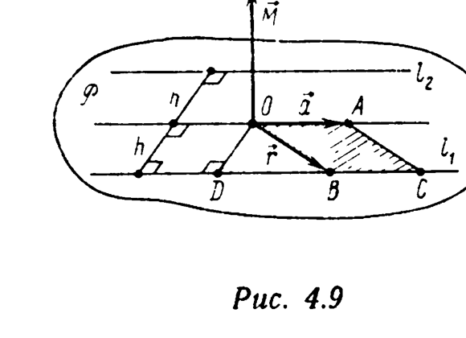
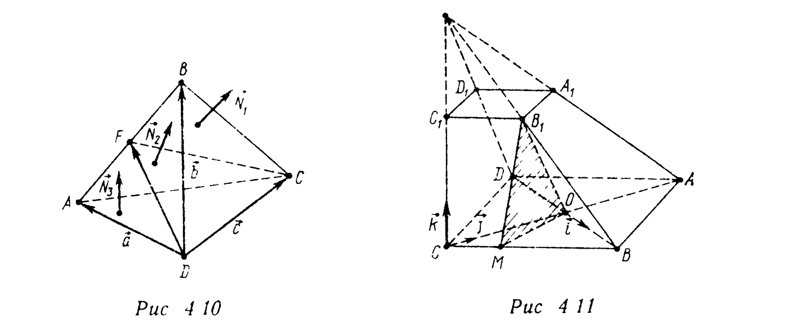

# Глава 4. Векторное и смешанное произведения

## § 3. Двойное векторное произведение. Векторное уравнение прямой в пространстве. Нормальный вектор плоскости

**Пример 1** (формула двойного векторного произведения (ДВП)). Докажите, что для любых трех векторов $\vec a$, $\vec b$ и $\vec c$ в пространстве
$$[\vec a, [\vec b, \vec c]] = \vec b(\vec a, \vec c) - \vec c(\vec a, \vec b). \quad (4.9)$$

□ Выберем правый ортонормированный базис $\{\vec i, \vec j, \vec k\}$, взяв ортонормированный базис $\{\vec i, \vec j\}$ в плоскости, параллельной векторам $\vec b$ и $\vec c$, так, чтобы вектор $\vec i$ был коллинеарен вектору $\vec b$, и положив $\vec k=[\vec i, \vec j]$. Тогда в этом базисе
$$\vec b=b\vec i=(b; 0; 0), \quad \vec c=c_x\vec i+c_y\vec j=(c_x; c_y; 0), \quad \vec a=a_x\vec i+a_y\vec j+a_z\vec k,$$

$$[\vec b, \vec c] = \begin{vmatrix} \vec i & \vec j & \vec k \\ b & 0 & 0 \\ c_x & c_y & 0 \end{vmatrix} = bc_y\vec k = (0; 0; bc_y),$$

$$[\vec a, [\vec b, \vec c]] = \begin{vmatrix} \vec i & \vec j & \vec k \\ a_x & a_y & a_z \\ 0 & 0 & bc_y \end{vmatrix} = a_ybc_y\vec i - a_xbc_y\vec j.$$

Прибавим и отнимем в правой части последнего равенства вектор $a_xbc_x\vec i$. Получим $[\vec a, [\vec b, \vec c]] = b\vec i(a_xc_x+a_yc_y+a_z\cdot0) - (c_x\vec i+c_y\vec j)(a_xb+a_y\cdot0+a_z\cdot0) = \vec b(\vec a,\vec c) - \vec c(\vec a,\vec b). \ ■$

**Пример 2.** При каком необходимом и достаточном условии справедливо равенство
$$[[\vec a, \vec b], \vec c] = [\vec a, [\vec b, \vec c]]? \quad (4.10)$$

△ По формуле (4.9), $[[\vec a, \vec b], \vec c] = -[\vec c, [\vec a, \vec b]] =$

---
**стр. 196**

---

$= \vec b(\vec a,\vec c) - \vec a(\vec b,\vec c)$, $[\vec a, [\vec b, \vec c]] = \vec b(\vec a,\vec c) - \vec c(\vec a,\vec b)$. Следовательно, равенство (4.10) выполняется тогда и только тогда, когда $\vec 0 = \vec a(\vec b,\vec c) - \vec c(\vec a,\vec b)$. Но по формуле (4.9), $\vec a(\vec b,\vec c) - \vec c(\vec a,\vec b) = [\vec b, [\vec a, \vec c]]$. Таким образом, равенство (4.10) справедливо тогда и только тогда, когда $[\vec b, [\vec a, \vec c]] = \vec 0$, т.е. когда векторы $\vec b$ и $[\vec a, \vec c]$ коллинеарны. Это возможно, если $\vec a \| \vec c$ или $\vec a \nparallel \vec c$, а вектор $\vec b$ ортогонален каждому из векторов $\vec a$ и $\vec c$. ▲

**Пример 3** (векторное уравнение прямой в пространстве). Пусть в пространстве зафиксирован полюс $O$, выбраны векторы $\vec a \neq \vec 0$ и $\vec M$, причем $(\vec M, \vec a) = 0$. Докажите, что множество $l$ всех точек пространства, радиусы-векторы $\vec r$ которых удовлетворяют уравнению
$$[\vec r, \vec a] = \vec M, \quad (4.11)$$

есть прямая. Укажите ее расположение в пространстве.

□ **Первое решение.** Выберем систему координат $\{O, \vec i, \vec j, \vec k\}$ так, что $\vec k=\vec a/a$, $a=|\vec a|\neq0$, т. е. $\vec a=(0; 0; a)$. Поскольку $(\vec M, \vec a)=0$, указанная система координат может быть выбрана так, что вектор $\vec M$ коллинеарен вектору $\vec j$, т.е. $\vec M=m\vec j=(0; m; 0)$. Если теперь $A(x; y; z)$ — произвольная точка $l$, то в силу уравнения (4.11)
$$[\vec r, \vec a] = \begin{vmatrix} \vec i & \vec j & \vec k \\ x & y & z \\ 0 & 0 & a \end{vmatrix} = ay\vec i - ax\vec j = \vec M = m\vec j.$$

Следовательно, точка $A(x; y; z) \in l$ тогда и только тогда, когда ее координаты $(x; y; z)$ удовлетворяют системе уравнений
$$y = 0, \quad x = -m/a. \quad (4.12)$$

---
**стр. 197**

---

Первое из этих уравнений — уравнение плоскости $Oxz$, второе — уравнение плоскости, параллельной плоскости $Oyz$. Значит, $l$ есть множество точек, общих для обеих плоскостей, т.е. прямая, параллельная оси $Oz$ (вектору $\vec a$). Эта прямая проходит через точку с радиусом-вектором $\vec r_0 = (-m/a; 0; 0)$. Выразим $\vec r_0$ через $\vec a$ и $\vec M$:

$$\vec r_0 = -\frac{m}{a}\vec i = -\frac ma[\vec j, \vec k] = \left[\vec k, \frac ma\vec j\right] = \left[\vec k, \frac{\vec M}{a}\right] =$$
$$= \left[\frac{\vec a}{a}, \frac{\vec M}{a}\right] = \frac{[\vec a, \vec M]}{a^2}.$$

Параметрическое уравнение прямой $l$ имеет вид
$$\vec r = \frac{[\vec a, \vec M]}{|\vec a|^2} + \vec at, \quad t\in R. \quad (4.13)$$

**Второе решение** (геометрическое). Если $\vec M=\vec 0$, то $l$ — множество всех точек пространства, радиусы-векторы $\vec r$ которых коллинеарны вектору $\vec a$ (так как $[\vec r, \vec a]=\vec 0$), т.е. $l$ — прямая, проходящая через полюс $O$, с направляющим вектором $\vec a$.

Пусть $\vec M \neq \vec 0$. Рассмотрим плоскость $P$, проходящую через полюс $O$ и перпендикулярную $\vec M$. Отложим от точки $O$ вектор $\overrightarrow{OA}=\vec a$. Так как $(\vec a, \vec M)=0$, то $A\in P$. Следовательно, $(OA)\subset P$. Пусть $B(\vec r)$ — произвольная точка из $l$. Из формулы (4.11) согласно свойству I векторного произведения имеем $(\vec r, \vec M)=0$, т.е. $B\in P$. Таким образом, $l$ — некоторое подмножество плоскости $P$. Далее, $|[\vec r, \vec a]| = |\vec M|$, т.е. площадь параллелограмма $BOAC$, построенного на векторах $\vec r$ и $\vec a$, равна $|\vec M|$ (свойство II векторного произведения), а высота параллелограмма $BOAC$, опущенная из точки $B$ на прямую $(OA)$, имеет длину $h = |\vec M|/|\vec a|$, общую для всех точек $B\in l$. Таким образом, все точки подмножества $l$ лежат в плоскости $P$ и равноудалены на расстояние $h$ от прямой $(OA)$. Множество точек $P$, удаленных на расстояние $h$ от $(OA)$, состоит из двух прямых $l_1$ и $l_2$, параллельных $(OA)$ (рис. 4.9). Для одной из этих прямых

---
**стр. 198**

---

(на рис. 4.9 это прямая $l_1$) радиусы-векторы $\vec r$ лежащих на ней точек вместе с $\vec a$ и $\vec M$ в указанном порядке образуют правый базис, для другой прямой ($l_2$) — левый. Согласно свойству IV векторного произведения, $l_2$ не содержит точек множества $l$, определяемых уравнением (4.11), а всякая точка $l_1$ принадлежит $l$ (для каждой такой точки установлены свойства I, II, IV, определяющие векторное равенство (4.11)). Таким образом, $l$ — прямая с направляющим вектором $\vec a$, проходящая через точку $D$ (основание перпендикуляра, опущенного из точки $O$ на $l_1$). Радиус-вектор $\vec r_0 = \overrightarrow{OD}$ точки $D$ легко найти следующим образом. Поскольку $\overrightarrow{OD} \perp \overrightarrow{OA}$, $\overrightarrow{OD} \perp \vec M$, а базис $\{\overrightarrow{OD}, \overrightarrow{OA}, \vec M\}$ — правый, $\overrightarrow{OD} \uparrow\uparrow [\vec a, \vec M]$, т. е. $\vec r_0 = \lambda[\vec a, \vec M]$, где $\lambda>0$. Чтобы найти $\lambda$, заметим, что $|\vec r_0| = |\overrightarrow{OD}| = h = |\vec M|/|\vec a|$, т. е. $|\vec M|/|\vec a| = |\lambda[\vec a, \vec M]| = \lambda|\vec a||\vec M|$ ($\vec a$ и $\vec M$ ортогональны). Следовательно, $\lambda=1/|\vec a|^2$, т.е. $\vec r_0=[\vec a, \vec M]/|\vec a|^2$.

**Третье решение.** Возьмем $\vec r_0=[\vec a, \vec M]/|\vec a|^2$. По формуле ДВП,
$$[\vec r_0, \vec a] = -\frac{1}{|\vec a|^2}[\vec a, [\vec a, \vec M]] = -\frac{1}{|\vec a|^2}(\vec a(\vec a, \vec M) -$$
$$- \vec M(\vec a, \vec a)) = \vec M \text{ (так как } (\vec a, \vec M)=0\text{)}.$$

Значит, $\vec r_0$ — радиус-вектор некоторой точки $D\in l$, а уравнение (4.11) в силу равенства $\vec M=[\vec r_0, \vec a]$ эквивалентно уравнению
$$[\vec r-\vec r_0, \vec a] = \vec 0. \quad (4.14)$$

Согласно свойству III векторного произведения, равенство (4.14) справедливо тогда и только тогда, когда $\vec r-\vec r_0 \| \vec a$, т. е. когда существует такое $t\in R$, что $\vec r-\vec r_0=\vec at$, т.е.
$$\vec r = \vec r_0+\vec at, \quad t\in R. \quad (4.15)$$

---
**стр. 199**

---

Таким образом, уравнение (4.11) эквивалентно векторному параметрическому уравнению (4.15), а $l$, следовательно, — прямая с параметрическим уравнением (4.15). ■

**Пример 4.** Напишите векторное (типа (4.11)) уравнение прямой $l$: $\dfrac{x+1}{-3} = \dfrac{y-3}{4} = \dfrac{z}{3}$.

△ Прямая $l$ проходит через точку с радиусом-вектором $\vec r_0=(-1; 3; 0)$ и имеет направляющий вектор $\vec a=(-3; 4; 3)$. Поскольку $\vec M=[\vec r_0, \vec a] = \begin{vmatrix} \vec i & \vec j & \vec k \\ -1 & 3 & 0 \\ -3 & 4 & 3 \end{vmatrix} = 9\vec i+3\vec j+5\vec k$, векторное уравнение $l$
$$[\vec r, -3\vec i+4\vec j+3\vec k] = 9\vec i+3\vec j+5\vec k. \ ▲$$

**Пример 5.** Найдите радиус-вектор $\vec x$ общей точки прямой $l: [\vec r, \vec a]=\vec M$, $|\vec a|\neq0$, $(\vec a, \vec M)=0$ и плоскости $P: (\vec r, \vec N)=D$, $\vec N\neq\vec0$, $(\vec N, \vec a)\neq0$.

△ Запишем уравнение $l$ в параметрическом виде (4.13). Тогда задача сводится к нахождению такого числа $t$, что вектор $\vec x=\dfrac{[\vec a, \vec M]}{|\vec a|^2}+\vec at$ удовлетворяет также и равенству $(\vec x, \vec N)=D$, т.е. $t(\vec a, \vec N)+([\vec a, \vec M], \vec N)/|\vec a|^2=D$. Отсюда
$$t = \frac{D|\vec a|^2-([\vec a, \vec M], \vec N)}{|\vec a|^2(\vec a, \vec N)},$$
$$\vec x = \frac{1}{|\vec a|^2}\left([\vec a, \vec M] + \frac{D|\vec a|^2-([\vec a, \vec M], \vec N)}{(\vec a, \vec N)}\vec a\right). \ ▲$$

**Пример 6.** Напишите нормальное уравнение плоскости $P$, заданной параметрически уравнением $\vec r=\vec r_0+\vec au+\vec bv$, $u, v\in R$.

△ Векторы $\vec a$ и $\vec b$ линейно независимы и параллельны плоскости $P$. Следовательно, в качестве нормального вектора $\vec N$ можно взять вектор
$$\vec N = [\vec a, \vec b]. \quad (4.16)$$

---
**стр. 200**

---

Вектор $\vec r_0$ является радиусом-вектором некоторой точки плоскости $P$. По формуле (3.28), нормальное уравнение $P$
$$(\vec r-\vec r_0, [\vec a, \vec b]) = 0. \ ▲$$

**Пример 7.** В тетраэдре $ABCD$ биссекторная плоскость двугранного угла с ребром $[CD]$ пересекает ребро $[AB]$ в точке $F$ (рис. 4.10). Докажите, что $|AF|:|FB| = S_{ACD}:S_{BCD}$.

△ Положим $\vec a=\overrightarrow{DA}$, $\vec b=\overrightarrow{DB}$, $\vec c=\overrightarrow{DC}$, $\vec b'=[\vec c, \vec a]$, $\vec a'=[\vec c, \vec b]$, $\varphi=(\widehat{\vec a', \vec b'})$, $|AF|=\mu|AB|$. Тогда $S_{ACD}=(1/2)|\vec b'|$, $S_{BCD}=(1/2)|\vec a'|$. По формуле (4.16), векторы $\vec N_1=\vec a'$, $\vec N_2=[\vec c, \overrightarrow{DF}]=[\vec c, \overrightarrow{DA}+\mu\overrightarrow{AB}]=[\vec c, \vec a+\mu(\vec b-\vec a)] = \mu\vec a'+(1-\mu)\vec b'$, $\vec N_3=\vec b'$ — нормальные векторы соответственно плоскостей $(BCD)$, $(FCD)$, $(ACD)$.

Поскольку плоскость $(FCD)$ — биссекторная, $(\widehat{\vec N_1, \vec N_2}) = (\widehat{\vec N_2, \vec N_3})$. Следовательно,
$$\frac{(\vec N_1, \vec N_2)}{|\vec N_1||\vec N_2|} = \frac{(\vec N_2, \vec N_3)}{|\vec N_2||\vec N_3|}, \text{ т. е. } \frac{\mu\vec a'^2+(1-\mu)(\vec a', \vec b')}{|\vec a'|} =$$
$$= \frac{(1-\mu)\vec b'^2+\mu(\vec a', \vec b')}{|\vec b'|},$$

или $(1-\cos\varphi)((1-\mu)|\vec b'|-\mu|\vec a'|)=0$. Так как $0^\circ<\varphi<180^\circ$, то
$$S_{ACD}:S_{BCD} = |\vec b'|:|\vec a'| = \frac{\mu}{1-\mu} = |AF|:|FB|. \ ▲$$

**Пример 8.** $[AA_1]$, $[BB_1]$, $[CC_1]$, $[DD_1]$ — боковые ребра

---
**стр. 201**

---

четырехугольной усеченной пирамиды $ABCDA_1B_1C_1D_1$, нижним основанием которой является ромб $ABCD$. Ребро $[CC_1]$ перпендикулярно плоскости $(ABCD)$, $|CC_1|=|A_1B_1|=2$, $|AB|=4$, $\widehat{BAD}=60^\circ$. На ребре $[BC]$ взята точка $M$ так, что $|BM|=3$, и через точки $B_1$, $M$ и центр $O$ ромба $ABCD$ проведена плоскость. Найдите угол между этой плоскостью и плоскостью грани $AA_1C_1C$.

△ Введем правый ортонормированный базис $\vec i=\overrightarrow{OB}/|\overrightarrow{OB}|$, $\vec j=\overrightarrow{OA}/|\overrightarrow{OA}|$, $\vec k=\overrightarrow{CC_1}/|\overrightarrow{CC_1}|$ (рис. 4.11). В этом базисе $\overrightarrow{OB}=(2; 0; 0)$, $\overrightarrow{CO}=(0; 2\sqrt3; 0)$, $\overrightarrow{CC_1}=(0; 0; 2)$, $\overrightarrow{CB}=(2; 2\sqrt3; 0)$, $\overrightarrow{CM}=(1/4)\overrightarrow{CB}=(1/2; \sqrt3/2; 0)$, $\overrightarrow{C_1B_1}=(1/2)\overrightarrow{CB}=(1; \sqrt3; 0)$, $\overrightarrow{MO}=\overrightarrow{CO}-\overrightarrow{CM}=(-1/2; 3\sqrt3/2; 0)$, $\overrightarrow{MB_1}=-\overrightarrow{CM}+\overrightarrow{CC_1}+\overrightarrow{C_1B_1}=(1/2; \sqrt3/2; 2)$. Нормальный вектор $\vec N_1$ плоскости $(B_1MO)$ по формуле (4.16) равен

$$\vec N_1 = [\overrightarrow{MO}, \overrightarrow{MB_1}] = \begin{vmatrix} \vec i & \vec j & \vec k \\ -1/2 & 3\sqrt3/2 & 0 \\ 1/2 & \sqrt3/2 & 2 \end{vmatrix} = (3\sqrt3; 1; -\sqrt3).$$

Нормальный вектор $\vec N_2$ плоскости $(AA_1C_1C)$, параллельной $\vec j$ и $\vec k$, равен, очевидно, $\vec i$. Поэтому для угла $\varphi$ между плоскостями $(B_1MO)$ и $(AA_1C_1C)$ получаем выражение
$$\cos\varphi = |(\vec N_1, \vec N_2)|/(|\vec N_1||\vec N_2|) =$$
$$= 3\sqrt3/\sqrt{(3\sqrt3)^2+1^2+(\sqrt3)^2} = 3\sqrt3/\sqrt{31},$$
$$\varphi = \arccos\frac{3\sqrt3}{\sqrt{31}} = \operatorname{arctg}\frac{2}{3\sqrt3}. \ ▲$$

**Пример 9.** Найдите направляющий вектор прямой $l$, являющейся линией пересечения двух плоскостей $P_1: (\vec r, \vec N_1)=D_1$ и $P_2: (\vec r, \vec N_2)=D_2$.

△ Вектор $\vec a$ (направляющий вектор прямой $l$), будучи параллелен плоскости $P_1$, ортогонален ее нормальному

---
**стр. 202**

---

вектору $\vec N_1$. Аналогично, $\vec a \perp \vec N_2$. Следовательно, в качестве $\vec a$ можно взять вектор $[\vec N_1, \vec N_2]$. ▲

**Пример 10.** Найдите угол между прямой $l$:
$$\begin{cases} 3x+5y+4z-1=0, \\ x+y-4=0 \end{cases}$$

и плоскостью $P$: $x+z+2=0$.

△ Направляющий вектор $\vec a$ прямой $l$ находим по формуле
$$\vec a = [\vec N_1, \vec N_2], \quad (4.17)$$

где $\vec N_1=(3; 5; 4)$, $\vec N_2=(1; 1; 0)$ (см. пример 9). По формуле (3.53) угол $\varphi$ между $l$ и $P$ равен $\varphi = \arcsin\dfrac{|(\vec N, \vec a)|}{|\vec N||\vec a|}$, где

$$\vec N = (1; 0; 1), \quad \vec a = \begin{vmatrix} \vec i & \vec j & \vec k \\ 3 & 5 & 4 \\ 1 & 1 & 0 \end{vmatrix} = (-4; 4; -2), \text{ т. е. } \varphi =$$
$$= \arcsin\frac{1}{\sqrt2} = 45^\circ. \ ▲$$

**Пример 11.** Найдите угол $\varphi$ между прямыми
$$l: \begin{cases} x+2y+2z=0 \\ x+y+2=0 \end{cases} \text{ и } L: \begin{cases} x-y+3z+2=0, \\ 2x-2y+z=0. \end{cases}$$

△ По формуле (4.17) направляющие векторы $\vec a$ и $\vec b$ прямых $l$ и $L$ соответственно равны $\vec a = \begin{vmatrix} \vec i & \vec j & \vec k \\ 1 & 2 & 2 \\ 1 & 1 & 0 \end{vmatrix} = (-2; 2; -1)$, $\vec b=(5; 5; 0)$. Следовательно, $\cos\varphi = |(\vec a, \vec b)|/(|\vec a||\vec b|)=0$, $\varphi=90^\circ$. ▲
