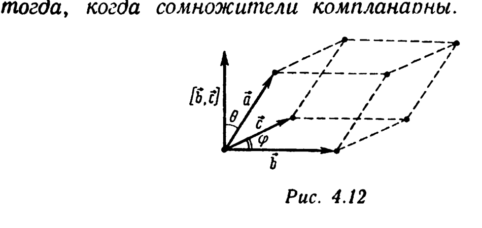
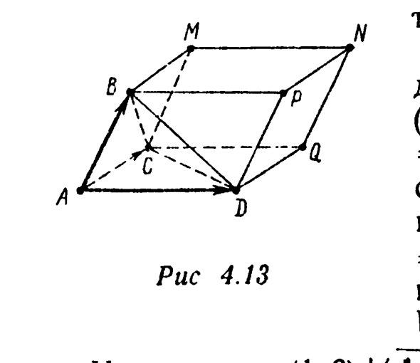
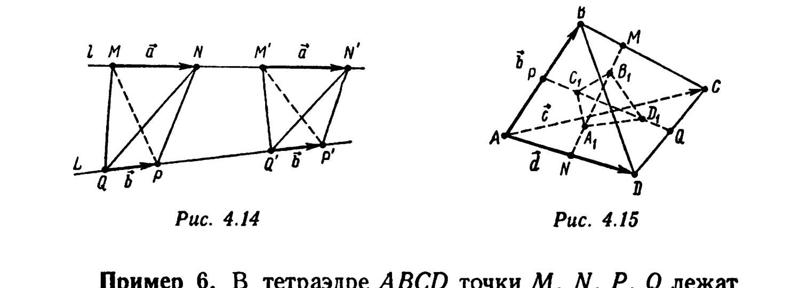
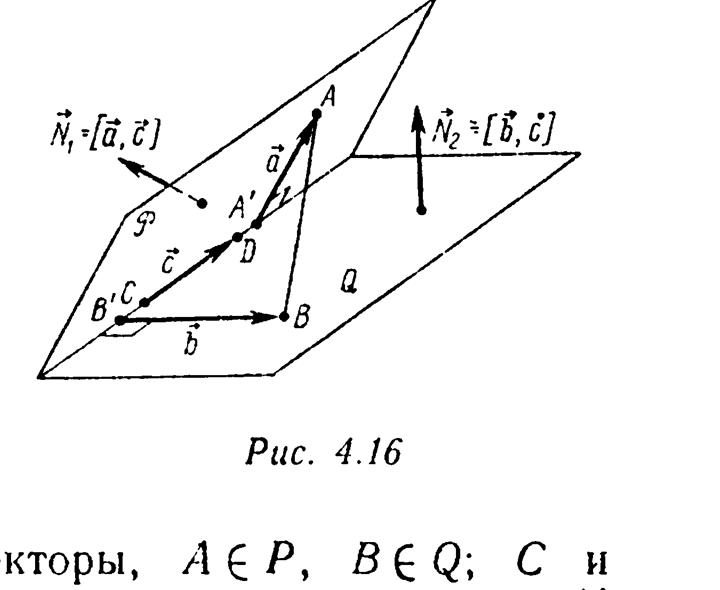
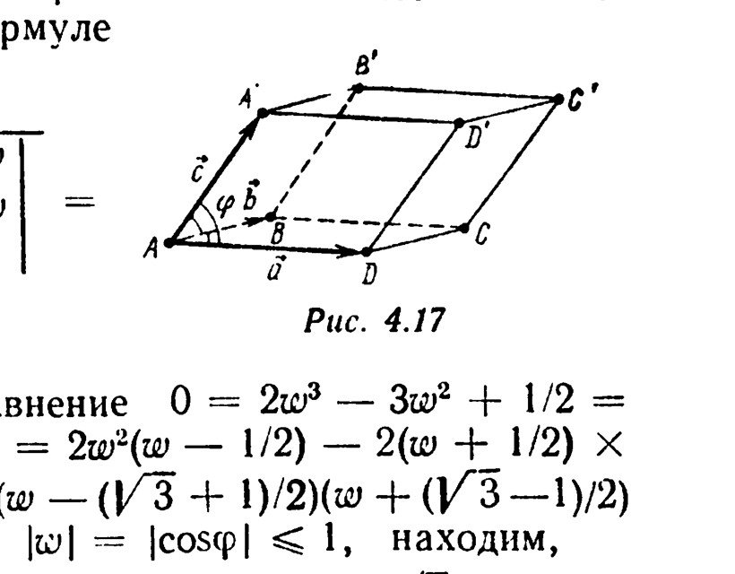
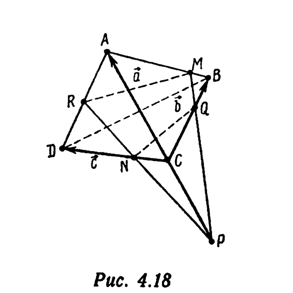
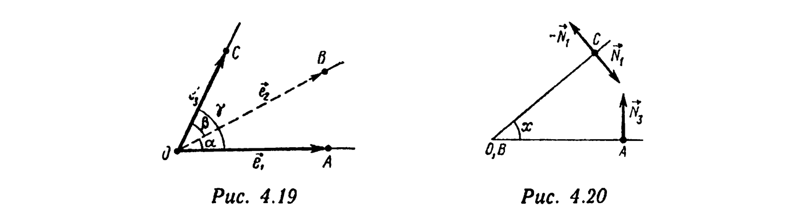

# Глава 4. Векторное и смешанное произведения

## § 4. Смешанное произведение векторов. Условие компланарности векторов. Объем тетраэдра

Число $(\vec a, [\vec b, \vec c])$ называется *смешанным произведением* (упорядоченной тройки) векторов $\vec a$, $\vec b$ и $\vec c$ (обозначение: $(\vec a, \vec b, \vec c)$).

---
**стр. 203**

---

Приведем свойства смешанного произведения векторов.

$1^\circ$. *Смешанное произведение равно нулю тогда и только тогда, когда сомножители компланарны.*

□ Если $\varphi$ — угол между векторами $\vec b$ и $\vec c$, $\theta$ — угол между векторами $\vec a$ и $[\vec b, \vec c]$ (рис. 4.12), то
$$(\vec a, [\vec b, \vec c]) = \begin{cases} 0, & \text{если } \vec a = \vec 0 \text{ или } [\vec b, \vec c] = \vec 0; \\ |\vec a||[\vec b, \vec c]|\cos\theta = |\vec a||\vec b||\vec c|\sin\varphi\cos\theta, & \text{если } \vec a \neq \vec 0 \text{ и } [\vec b, \vec c] \neq \vec 0. \end{cases} \quad (4.18)$$

Таким образом, равенство $(\vec a, \vec b, \vec c) = 0$ возможно лишь в следующих случаях:

а) $\vec a = \vec 0$. В этом случае векторы $\vec a$, $\vec b$, $\vec c$, очевидно, компланарны;

б) $[\vec b, \vec c] = \vec 0$. В этом случае векторы $\vec b$ и $\vec c$ коллинеарны, поэтому векторы $\vec a$, $\vec b$, $\vec c$ компланарны;

в) $\vec a \neq \vec 0$, $[\vec b, \vec c] \neq \vec 0$ (т. е. $\vec b \neq \vec 0$, $\vec c \neq \vec 0$, $\sin\varphi \neq 0$), $\cos\theta = 0$ [см. формулу (4.18)]. В этом случае $\vec a$ ортогонален $[\vec b, \vec c]$, т. е. $\vec a$ параллелен плоскости, в которой $\vec b$ и $\vec c$ образуют базис.

Далее, если $(\vec a, \vec b, \vec c) \neq 0$, то, по формуле (4.18), $\vec a$, $\vec b$ и $\vec c$ — ненулевые векторы, $\sin\varphi \neq 0$, т. е. $\vec b$ и $\vec c$ не коллинеарны, $\cos\theta \neq 0$, следовательно, векторы $\vec a$ и $[\vec b, \vec c]$ не ортогональны и, значит, $\vec a$ не параллелен той плоскости, в которой $\vec b$ и $\vec c$ образуют базис. Иными словами, $\vec a$, $\vec b$ и $\vec c$ не компланарны. ■

$2^\circ$. *Если в правом ортонормированном базисе $\{\vec i, \vec j, \vec k\}$ $\vec a=(a_x;a_y;a_z)$, $\vec b=(b_x;b_y;b_z)$, $\vec c=(c_x;c_y;c_z)$, то*

---
**стр. 204**

---

$$(\vec a, \vec b, \vec c) = \begin{vmatrix} a_x & a_y & a_z \\ b_x & b_y & b_z \\ c_x & c_y & c_z \end{vmatrix}. \quad (4.19)$$

□ Вектор $[\vec b, \vec c]$ по формуле (4.1) равен
$$[\vec b, \vec c] = \begin{vmatrix} \vec i & \vec j & \vec k \\ b_x & b_y & b_z \\ c_x & c_y & c_z \end{vmatrix} = \left( \begin{vmatrix} b_y & b_z \\ c_y & c_z \end{vmatrix}; -\begin{vmatrix} b_x & b_z \\ c_x & c_z \end{vmatrix}; \begin{vmatrix} b_x & b_y \\ c_x & c_y \end{vmatrix} \right).$$

Поэтому
$$(\vec a, [\vec b, \vec c]) = a_x\begin{vmatrix} b_y & b_z \\ c_y & c_z \end{vmatrix} - a_y\begin{vmatrix} b_x & b_z \\ c_x & c_z \end{vmatrix} + a_z\begin{vmatrix} b_x & b_y \\ c_x & c_y \end{vmatrix} = \begin{vmatrix} a_x & a_y & a_z \\ b_x & b_y & b_z \\ c_x & c_y & c_z \end{vmatrix} = \begin{vmatrix} a_x & b_x & c_x \\ a_y & b_y & c_y \\ a_z & b_z & c_z \end{vmatrix}. \ ■$$

Отметим, что из формулы (4.19) и критерия компланарности векторов (см. пример 20 § 5 гл. 2) свойство $1^\circ$ вытекает тривиально. Очевидным следствием (4.19) является следующее свойство.

$3^\circ$. *Базис $\{\vec a, \vec b, \vec c\}$ является правым тогда и только тогда, когда $(\vec a, \vec b, \vec c) > 0$.*

□ По формуле (4.19), $(\vec a, \vec b, \vec c) = \det S^{\mathsf T} = \det S$, где $S$ — матрица перехода от правого базиса $\{\vec i, \vec j, \vec k\}$ к базису $\{\vec a, \vec b, \vec c\}$. ■

$4^\circ$. $(\vec a, \vec b, \vec c) = (\vec b, \vec c, \vec a) = (\vec c, \vec a, \vec b) = -(\vec a, \vec c, \vec b) = -(\vec c, \vec b, \vec a) = -(\vec b, \vec a, \vec c). \quad (4.20)$

В частности, *если в смешанном произведении два сомножителя одинаковы, то оно равно нулю.*

□ Равенства (4.20) следуют из формулы (4.19) и свойства $2^\circ$ определителей (см. § 4 гл. 2). Равенство $(\vec a, \vec a, \vec c) = 0$ (и другие, в которых в смешанном произведении два сомножителя одинаковы) вытекает из равенств (4.20): при $\vec b = \vec a$ имеем
$$(\vec a, \vec a, \vec c) = -(\vec a, \vec a, \vec c), \text{ т.е. } (\vec a, \vec a, \vec c) = 0. \ ■$$

---
**стр. 205**

---

$5^\circ$. *Если $\vec a = a_x\vec e_1+a_y\vec e_2+a_z\vec e_3$, $\vec b = b_x\vec e_1+b_y\vec e_2+b_z\vec e_3$, $\vec c = c_x\vec e_1+c_y\vec e_2+c_z\vec e_3$, то*
$$(\vec a, \vec b, \vec c) = \begin{vmatrix} a_x & a_y & a_z \\ b_x & b_y & b_z \\ c_x & c_y & c_z \end{vmatrix} (\vec e_1, \vec e_2, \vec e_3). \quad (4.21)$$

□ В соответствии с формулой (4.6)
$$[\vec b, \vec c] = \begin{vmatrix} b_y & b_z \\ c_y & c_z \end{vmatrix}\vec f_1 - \begin{vmatrix} b_x & b_z \\ c_x & c_z \end{vmatrix}\vec f_2 + \begin{vmatrix} b_x & b_y \\ c_x & c_y \end{vmatrix}\vec f_3,$$

где $\vec f_1=[\vec e_2,\vec e_3]$, $\vec f_2=[\vec e_3,\vec e_1]$, $\vec f_3=[\vec e_1,\vec e_2]$. Поскольку $(\vec e_1,\vec f_1)=(\vec e_1,\vec e_2,\vec e_3)$, $(\vec e_2,\vec f_1)=(\vec e_3,\vec f_1)=0$ (вектор $\vec f_1$ ортогонален как $\vec e_2$, так и $\vec e_3$), $(\vec a,\vec f_1)=(a_x\vec e_1+a_y\vec e_2+a_z\vec e_3,\vec f_1)=a_x(\vec e_1,\vec e_2,\vec e_3)$. Аналогично $(\vec a,\vec f_2)=a_y(\vec e_1,\vec e_2,\vec e_3)$, $(\vec a,\vec f_3)=a_z(\vec e_1,\vec e_2,\vec e_3)$. Следовательно,
$$(\vec a, [\vec b,\vec c]) = (\vec e_1,\vec e_2,\vec e_3)\left(a_x\begin{vmatrix} b_y & b_z \\ c_y & c_z \end{vmatrix} - a_y\begin{vmatrix} b_x & b_z \\ c_x & c_z \end{vmatrix} + a_z\begin{vmatrix} b_x & b_y \\ c_x & c_y \end{vmatrix}\right) =$$
$$= (\vec e_1,\vec e_2,\vec e_3)\begin{vmatrix} a_x & a_y & a_z \\ b_x & b_y & b_z \\ c_x & c_y & c_z \end{vmatrix}. \ ■$$

$6^\circ$. *Объем параллелепипеда, построенного на некомпланарных векторах $\vec a$, $\vec b$ и $\vec c$, равен модулю смешанного произведения этих векторов.*

□ По формуле (4.18), $|(\vec a,\vec b,\vec c)| = |\vec a||\vec b||\vec c|\sin\varphi|\cos\theta|$, а объем параллелепипеда, построенного на векторах $\vec a$, $\vec b$ и $\vec c$, равен произведению площади основания $S=|\vec b||\vec c|\sin\varphi$ на высоту $h=|\vec a||\cos\theta|$. Таким образом, если параллелепипед построен на некомпланарных векторах $\vec a$, $\vec b$, $\vec c$ (рис. 4.12), то его объем равен $|(\vec a,\vec b,\vec c)|$. ■

$7^\circ$. *Смешанное произведение линейно по каждому из сомножителей*

---
**стр. 206**

---

$$(\lambda\vec a+\mu\vec d,\vec b,\vec c) = \lambda(\vec a,\vec b,\vec c)+\mu(\vec d,\vec b,\vec c),$$
$$(\vec a,\lambda\vec b+\mu\vec d,\vec c) = \lambda(\vec a,\vec b,\vec c)+\mu(\vec a,\vec d,\vec c), \quad (4.22)$$
$$(\vec a,\vec b,\lambda\vec c+\mu\vec d) = \lambda(\vec a,\vec b,\vec c)+\mu(\vec a,\vec b,\vec d)$$

*для любых векторов $\vec a,\vec b,\vec c,\vec d$ и чисел $\lambda$ и $\mu$.*

□ Равенства (4.22) следуют из свойств линейности скалярного и векторного произведений. ■

**Пример 1.** Вычислите объем $V$ параллелепипеда $ABCDA'B'C'D'$, зная его вершину $A(1;2;3)$ и концы выходящих из нее ребер $B(9;6;4)$, $D(3;0;4)$, $A'(5;2;6)$.

△ Имеем $V = |(\overrightarrow{AB},\overrightarrow{AD},\overrightarrow{AA'})| = \left| \begin{vmatrix} 8 & 4 & 1 \\ 2 & -2 & 1 \\ 4 & 0 & 3 \end{vmatrix} \right| = 48$. ▲

**Пример 2.** В условиях предыдущего примера найдите длину $h$ высоты параллелепипеда, опущенной на основание $ABCD$ из вершины $A'$.

△ Площадь основания $ABCD$ равна $S = |[\overrightarrow{AB},\overrightarrow{AD}]|$. $[\overrightarrow{AB},\overrightarrow{AD}] = \begin{vmatrix} \vec i & \vec j & \vec k \\ 8 & 4 & 1 \\ 2 & -2 & 1 \end{vmatrix} = (6;-6;-24)$, поэтому $S = 6\sqrt{1^2+(-1)^2+(-4)^2} = 6\sqrt{18} = 18\sqrt2$. Следовательно, $h = V/S = 4\sqrt2/3$. ▲

**Пример 3.** Докажите, что объем тетраэдра равен 1/6 модуля смешанного произведения любых трех некомпланарных векторов, образующих ребра тетраэдра.

□ Достроив тетраэдр $ABCD$ до параллелепипеда $ACQDBMNP$ (рис. 4.13), получим $V_{ABCD} = (1/3)hS_{ACD}$, где $h$ — длина высоты, опущенной из вершины $B$ на плоскость $(ACD)$, $S_{ACD} = (1/2)S_{ACQD}$ — площадь треугольника $ACD$. Таким образом, $V_{ABCD} = (1/6)hS_{ACQD} = (1/6)V_{ACQDBMNP} = (1/6)|(\overrightarrow{AB},\overrightarrow{AC},\overrightarrow{AD})|$. Кроме того, $(\overrightarrow{AB},\overrightarrow{AC},\overrightarrow{AD}) = (\overrightarrow{DB},\overrightarrow{AC},\overrightarrow{AD}) = (\overrightarrow{CB},\overrightarrow{AC},\overrightarrow{AD})$. Действительно,

---
**стр. 207**

---

$(\overrightarrow{DB},\overrightarrow{AC},\overrightarrow{AD}) = (\overrightarrow{AB}-\overrightarrow{AD},\overrightarrow{AC},\overrightarrow{AD}) = (\overrightarrow{AB},\overrightarrow{AC},\overrightarrow{AD}) - (\overrightarrow{AD},\overrightarrow{AC},\overrightarrow{AD}) = (\overrightarrow{AB},\overrightarrow{AC},\overrightarrow{AD})$ (векторы $\overrightarrow{AD},\overrightarrow{AC},\overrightarrow{AD}$ компланарны, и их смешанное произведение равно нулю). Аналогично, $(\overrightarrow{CB},\overrightarrow{AC},\overrightarrow{AD}) = (\overrightarrow{AB}-\overrightarrow{AC},\overrightarrow{AC},\overrightarrow{AD}) = (\overrightarrow{AB},\overrightarrow{AC},\overrightarrow{AD}) - (\overrightarrow{AC},\overrightarrow{AC},\overrightarrow{AD}) = (\overrightarrow{AB},\overrightarrow{AC},\overrightarrow{AD})$. ■

**Пример 4.** Даны вершины тетраэдра $A(0;0;2)$, $B(3;0;5)$, $C(1;1;0)$, $D(4;1;2)$. Найдите его объем и длину высоты, опущенной из вершины $D$.

△ Имеем $V_{ABCD} = (1/6)|(\overrightarrow{AB},\overrightarrow{AC},\overrightarrow{AD})|$, $h = |(\overrightarrow{AB},\overrightarrow{AC},\overrightarrow{AD})|/|[\overrightarrow{AB},\overrightarrow{AC}]|$. Так как $\overrightarrow{AB}=(3;0;3)$, $\overrightarrow{AC}=(1;1;-2)$, то $[\overrightarrow{AB},\overrightarrow{AC}] = \begin{vmatrix} \vec i & \vec j & \vec k \\ 3 & 0 & 3 \\ 1 & 1 & -2 \end{vmatrix} = (-3;9;3)$ и $|[\overrightarrow{AB},\overrightarrow{AC}]| = 3\sqrt{11}$. Далее, $\overrightarrow{AD}=(4;1;0)$, $(\overrightarrow{AB},\overrightarrow{AC},\overrightarrow{AD}) = (\overrightarrow{AD},[\overrightarrow{AB},\overrightarrow{AC}]) = 4\cdot(-3)+1\cdot9+0\cdot3 = -3$. Следовательно, $V_{ABCD}=1/2$, $h=1/\sqrt{11}$. ▲

**Пример 5.** Дан тетраэдр, определяемый двумя отрезками, которые принадлежат скрещивающимся прямым. Докажите, что объем тетраэдра не изменится, если сдвинуть эти отрезки, не меняя их длин, вдоль соответствующих прямых.

△ Пусть $l$ и $L$ — скрещивающиеся прямые, $M$, $N$, $M'$, $N'$ — точки прямой $l$, $P$, $Q$, $P'$, $Q'$ — точки прямой $L$ такие, что (рис. 4.14) $\overrightarrow{MN}=\overrightarrow{M'N'}=\vec a$, $\overrightarrow{QP}=\overrightarrow{Q'P'}=\vec b$. Тогда (см. пример 3) $V_{MNPQ}=(1/6)|(\vec a,\vec b,\overrightarrow{QN})|$, $V_{M'N'P'Q'}=(1/6)|(\vec a,\vec b,\overrightarrow{Q'N'})|$. Поскольку $\overrightarrow{QN}=\overrightarrow{QQ'}+\overrightarrow{Q'N'}+\overrightarrow{N'N}=\lambda\vec b+\overrightarrow{Q'N'}+\mu\vec a$ (векторы $\overrightarrow{QQ'}$ и $\overrightarrow{QP}=\vec b$ коллинеарны, поэтому найдется такое число $\lambda$, что $\overrightarrow{QQ'}=\lambda\vec b$; аналогично, $\overrightarrow{N'N}=\mu\vec a$ с некоторым коэффициентом $\mu$),
$$(\vec a,\vec b,\overrightarrow{QN}) = \lambda(\vec a,\vec b,\vec b)+(\vec a,\vec b,\overrightarrow{Q'N'})+\mu(\vec a,\vec b,\vec a).$$

---
**стр. 208**

---

Первое и третье слагаемые в правой части этого равенства равны нулю согласно свойству $4^\circ$. Следовательно, $(\vec a,\vec b,\overrightarrow{QN}) = (\vec a,\vec b,\overrightarrow{Q'N'})$ и, значит, $V_{MNPQ}=V_{M'N'P'Q'}$. ▲

**Пример 6.** В тетраэдре $ABCD$ точки $M$, $N$, $P$, $Q$ лежат соответственно на ребрах $[BC]$, $[AD]$, $[AB]$, $[CD]$, причем $|AP|=|PB|$, $|AN|=|ND|$, $|CQ|=|QD|$, $|MC|=2|BM|$. Пары точек $A_1$, $B_1$ и $C_1$, $D_1$ выбраны соответственно на отрезках $[NM]$ и $[PQ]$ так, что $|NA_1|=|A_1B_1|=|B_1M|$, $|PC_1|=|C_1D_1|=|D_1Q|$. Найдите отношение объемов тетраэдров $ABCD$ и $A_1B_1C_1D_1$.

△ Введем базис $\vec b=\overrightarrow{AB}$, $\vec c=\overrightarrow{AC}$, $\vec d=\overrightarrow{AD}$ (рис. 4.15). В этом базисе $\overrightarrow{C_1D_1}=(1/3)\overrightarrow{PQ}=(1/3)(\overrightarrow{PA}+\overrightarrow{AQ})=(1/3)(-(1/2)\vec b+(1/2)(\vec c+\vec d))=(1/6)(-\vec b+\vec c+\vec d)$, $\overrightarrow{A_1B_1}=(1/3)\overrightarrow{NM}=(1/3)(\overrightarrow{NA}+\overrightarrow{AB}+(1/3)\overrightarrow{BC})=(1/3)(-(1/2)\vec d+\vec b+(1/3)(\vec c-\vec b))=(2/9)\vec b+(1/9)\vec c-(1/6)\vec d$. Кроме того, $\overrightarrow{AC_1}=\overrightarrow{AP}+\overrightarrow{C_1D_1}=(1/3)\vec b+(1/6)\vec c+(1/6)\vec d$, $\overrightarrow{AA_1}=\overrightarrow{AN}+\overrightarrow{A_1B_1}=(2/9)\vec b+(1/9)\vec c+(1/3)\vec d$. Следовательно, $\overrightarrow{C_1A_1}=-(1/9)\vec b-(1/18)\vec c+(1/6)\vec d$. Объем тетраэдра $A_1B_1C_1D_1$ равен
$$\frac{1}{6}|(\overrightarrow{A_1B_1},\overrightarrow{C_1D_1},\overrightarrow{C_1A_1})| = \frac16 \left| \begin{vmatrix} 2/9 & 1/9 & -1/6 \\ -1/6 & 1/6 & 1/6 \\ -1/9 & -1/18 & 1/6 \end{vmatrix}(\vec b,\vec c,\vec d) \right| = \frac{1}{216}\cdot\frac16|(\vec b,\vec c,\vec d)| = \frac{V_{ABCD}}{216}. \ ▲$$

---
**стр. 209**

---

**Пример 7.** Докажите, что если $[\vec a,\vec b]+[\vec b,\vec c]+[\vec c,\vec a]=\vec 0$, то векторы $\vec a$, $\vec b$, $\vec c$ компланарны.

△ Умножая данное равенство скалярно на $\vec a$, получаем $0=(\vec a,[\vec a,\vec b])+(\vec a,[\vec b,\vec c])+(\vec a,[\vec c,\vec a])$. Так как $(\vec a,[\vec a,\vec b])=(\vec a,[\vec c,\vec a])=0$, то $(\vec a,\vec b,\vec c)=0$. Согласно свойству $1^\circ$ смешанного произведения, векторы $\vec a$, $\vec b$ и $\vec c$ компланарны. ▲

**Пример 8.** Докажите, что если векторы $[\vec a,\vec b]$, $[\vec b,\vec c]$, $[\vec c,\vec a]$ компланарны, то они коллинеарны.

△ Пусть векторы $[\vec a,\vec b]$, $[\vec b,\vec c]$, $[\vec c,\vec a]$ компланарны. Тогда они линейно зависимы, т.е. существуют числа $x$, $y$, $z$, не равные нулю одновременно ($x^2+y^2+z^2>0$), такие, что
$$x[\vec a,\vec b]+y[\vec b,\vec c]+z[\vec c,\vec a]=\vec 0.$$

Умножая это равенство скалярно последовательно на $\vec a$, $\vec b$ и $\vec c$, получаем: $y(\vec a,\vec b,\vec c)=0$, $z(\vec a,\vec b,\vec c)=0$, $x(\vec a,\vec b,\vec c)=0$. Отсюда $(x^2+y^2+z^2)(\vec a,\vec b,\vec c)^2=0$. Следовательно, $(\vec a,\vec b,\vec c)=0$. Векторы $\vec a$, $\vec b$ и $\vec c$ компланарны (параллельны одной плоскости $P$). Каждый из векторов $[\vec a,\vec b]$, $[\vec b,\vec c]$, $[\vec c,\vec a]$ (согласно свойствам I и III векторного произведения) либо нулевой, либо параллелен прямой, перпендикулярной плоскости $P$. Следовательно, эти три вектора коллинеарны. ▲

**Пример 9.** Докажите тождество
$$[[\vec a,\vec b],[\vec c,\vec d]] = \vec c(\vec a,\vec b,\vec d)-\vec d(\vec a,\vec b,\vec c). \quad (4.23)$$

△ По формуле ДВП (4.9), учитывая свойство $4^\circ$ смешанного произведения, имеем $[[\vec a,\vec b],[\vec c,\vec d]] = \vec c([\vec a,\vec b],\vec d)-\vec d([\vec a,\vec b],\vec c) = \vec c(\vec d,\vec a,\vec b)-\vec d(\vec c,\vec a,\vec b) = \vec c(\vec a,\vec b,\vec d)-\vec d(\vec a,\vec b,\vec c)$. ▲

**Пример 10.** Докажите, что
$$([\vec a,\vec b],[\vec b,\vec c],[\vec c,\vec a]) = (\vec a,\vec b,\vec c)^2. \quad (4.24)$$

□ По формуле (4.23) $[[\vec b,\vec c],[\vec c,\vec a]] = \vec c(\vec b,\vec c,\vec a)-\vec a(\vec b,\vec c,\vec c) = \vec c(\vec b,\vec c,\vec a) = (\vec a,\vec b,\vec c)\vec c$. Следовательно, $([\vec a,\vec b],[\vec b,\vec c],[\vec c,\vec a]) = ([\vec a,\vec b],(\vec a,\vec b,\vec c)\vec c) = (\vec a,\vec b,\vec c)([\vec a,\vec b],\vec c)=(\vec a,\vec b,\vec c)(\vec c,\vec a,\vec b) = (\vec a,\vec b,\vec c)^2. \ ■$

---
**стр. 210**

---

Формулы (4.24) и (4.23) позволяют получить второе решение примера 8. Именно: если векторы $[\vec a,\vec b]$, $[\vec b,\vec c]$, $[\vec c,\vec a]$ компланарны, то их смешанное произведение равно нулю. Следовательно, в силу (4.24) $(\vec a,\vec b,\vec c)=0$. Тогда по формуле (4.23) имеем $[[\vec a,\vec b],[\vec c,\vec a]] = \vec c(\vec a,\vec b,\vec a)-\vec a(\vec a,\vec b,\vec c) = -\vec a(\vec a,\vec b,\vec c) = -\vec a\cdot 0 = \vec 0$, т.е. векторы $[\vec a,\vec b]$ и $[\vec c,\vec a]$ коллинеарны. Аналогично проверяется, что и $[[\vec a,\vec b],[\vec b,\vec c]] = [[\vec b,\vec c],[\vec c,\vec a]] = \vec 0$.

**Пример 11.** Докажите тождество
$$(\vec a,\vec b,\vec c)\vec d = (\vec d,\vec b,\vec c)\vec a+(\vec a,\vec d,\vec c)\vec b+(\vec a,\vec b,\vec d)\vec c.$$

△ Рассмотрим вектор $\vec m=[[\vec a,\vec b],[\vec c,\vec d]]$. По формуле (4.23), $\vec m=\vec c(\vec a,\vec b,\vec d)-\vec d(\vec a,\vec b,\vec c)$. Вектор $\vec m$ можно записать также в виде $\vec m=-[[\vec c,\vec d],[\vec a,\vec b]]=[[\vec c,\vec d],[\vec b,\vec a]]=\vec b(\vec c,\vec d,\vec a)-\vec a(\vec c,\vec d,\vec b)$ (учтено еще раз соотношение (4.23)). Таким образом, $\vec c(\vec a,\vec b,\vec d)-\vec d(\vec a,\vec b,\vec c)=\vec m=-\vec b(\vec a,\vec d,\vec c)-\vec a(\vec d,\vec b,\vec c)$, откуда и следует доказываемое тождество. ▲

**Пример 12.** Пусть $\vec a$, $\vec b$, $\vec c$, $\vec d$ — радиусы-векторы четырех точек пространства $A$, $B$, $C$, $D$ относительно некоторого полюса $O$. Докажите, что эти четыре точки лежат в одной плоскости тогда и только тогда, когда
$$(\vec a,\vec b,\vec c)+(\vec a,\vec c,\vec d) = (\vec b,\vec c,\vec d)+(\vec b,\vec d,\vec a).$$

△ Точки $A$, $B$, $C$, $D$ лежат в одной плоскости тогда и только тогда, когда $(\overrightarrow{AB},\overrightarrow{AC},\overrightarrow{AD})=0$, т.е. $(\vec b-\vec a,\vec c-\vec a,\vec d-\vec a)=0$. Согласно свойству линейности смешанного произведения, получаем, учитывая свойство $4^\circ$, $0=(\vec b-\vec a,\vec c-\vec a,\vec d-\vec a) = (\vec b,\vec c-\vec a,\vec d-\vec a)-(\vec a,\vec c-\vec a,\vec d-\vec a) = (\vec b,\vec c,\vec d-\vec a)-(\vec b,\vec a,\vec d-\vec a)-(\vec a,\vec c,\vec d-\vec a)+(\vec a,\vec a,\vec d-\vec a) = (\vec b,\vec c,\vec d)-(\vec b,\vec c,\vec a)-(\vec b,\vec a,\vec d)+(\vec b,\vec a,\vec a)-(\vec a,\vec c,\vec d)+(\vec a,\vec c,\vec a)+(\vec a,\vec a,\vec d)-(\vec a,\vec a,\vec a) = (\vec b,\vec c,\vec d)+(\vec b,\vec d,\vec a)-((\vec a,\vec b,\vec c)+(\vec a,\vec c,\vec d))$. ▲

**Пример 13.** Даны векторы $\vec a=\overrightarrow{DA}$, $\vec b=\overrightarrow{DB}$, $\vec c=\overrightarrow{DC}$ трех ребер тетраэдра $ABCD$, выходящих из вершины $D$.

---
**стр. 211**

---

Найдите вектор $\overrightarrow{DH}$ высоты тетраэдра, опущенной из вершины $D$ на плоскость $(ABC)$.

△ Вектор $\overrightarrow{BH}$ компланарен неколлинеарным векторам $\overrightarrow{BA}=\vec a-\vec b$ и $\overrightarrow{BC}=\vec c-\vec b$. Следовательно, найдутся такие числа $\lambda$ и $\mu$, что $\overrightarrow{BH}=\lambda(\vec a-\vec b)+\mu(\vec c-\vec b)$. Вектор $\overrightarrow{DH}$ перпендикулярен плоскости $(ABC)$, т.е. коллинеарен вектору $\vec d=[\overrightarrow{BC},\overrightarrow{BA}]=[\vec c-\vec b,\vec a-\vec b]=[\vec c,\vec a]+[\vec a,\vec b]+[\vec b,\vec c]$. Следовательно, существует такое число $\nu$, что $\overrightarrow{DH}=\nu\vec d$. Из цикла $DHBD$ имеем $\overrightarrow{DH}-\overrightarrow{BH}-\overrightarrow{DB}=\vec 0$, т.е. $\nu([\vec c,\vec a]+[\vec a,\vec b]+[\vec b,\vec c]) = \lambda\vec a+(1-\lambda-\mu)\vec b+\mu\vec c$. Умножая обе части этого равенства скалярно на вектор $\vec d$, получим $\nu|\vec d|^2=(\vec a,\vec b,\vec c)$, т.е. $\nu=(\vec a,\vec b,\vec c)/|\vec d|^2$. Таким образом,
$$\overrightarrow{DH} = \frac{(\vec a,\vec b,\vec c)}{|[\vec c,\vec a]+[\vec a,\vec b]+[\vec b,\vec c]|^2}([\vec c,\vec a]+[\vec a,\vec b]+[\vec b,\vec c]). \ ▲$$

**Пример 14.** Докажите, что отрезок $[AB]$, концы $A$ и $B$ которого расположены на разных гранях данного двугранного угла, тогда и только тогда образует с этими гранями равные углы, когда концы отрезка равноудалены от ребра двугранного угла.

△ Пусть $P$ и $Q$ — грани двугранного угла (рис. 4.16), $\vec N_1$ и $\vec N_2$ — их нормальные векторы, $A\in P$, $B\in Q$; $C$ и

$D$ — две различные точки на ребре двугранного угла, $A'$ и $B'$ — основания перпендикуляров, опущенных соответственно из точек $A$ и $B$ на прямую $(CD)$. Векторы $\vec a=\overrightarrow{A'A}$, $\vec b=\overrightarrow{B'B}$, $\vec c=\overrightarrow{CD}$ образуют базис, причем $\vec a\perp\vec c$, $\vec b\perp\vec c$. В качестве нормальных векторов $\vec N_1$ и $\vec N_2$ можно взять векторы $\vec N_1=[\vec a,\vec c]$, $|\vec N_1|=|\vec a||\vec c|$ и $\vec N_2=[\vec b,\vec c]$, $|\vec N_2|=|\vec b||\vec c|$. По формуле (3.53) углы, образованные отрезком $[AB]$ с гранями $P$ и $Q$, равны тогда и только тогда, когда

---
**стр. 212**

---

$$\frac{|(\vec N_1,\overrightarrow{AB})|}{|\vec N_1||\overrightarrow{AB}|} = \frac{|(\vec N_2,\overrightarrow{AB})|}{|\vec N_2||\overrightarrow{AB}|}, \text{ или } \frac{|(\overrightarrow{AB},\vec a,\vec c)|}{|\vec a|} = \frac{|(\overrightarrow{AB},\vec b,\vec c)|}{|\vec b|}.$$

Раскладывая вектор $\overrightarrow{AB}$ по базису $\{\vec a,\vec b,\vec c\}$: $\overrightarrow{AB}=-\vec a+\vec b+\lambda\vec c$ ($\lambda$ неизвестно), получаем согласно свойствам $7^\circ$, $4^\circ$ смешанного произведения $(\overrightarrow{AB},\vec a,\vec c)=-(\vec a,\vec a,\vec c)+(\vec b,\vec a,\vec c)+\lambda(\vec c,\vec a,\vec c)=(\vec b,\vec a,\vec c)$; $(\overrightarrow{AB},\vec b,\vec c)=-(\vec a,\vec b,\vec c)=(\vec b,\vec a,\vec c)$. Следовательно, углы, образованные $[AB]$ с $P$ и $Q$, равны тогда и только тогда, когда $1/|\vec a|=1/|\vec b|$, т.е. $|AA'|=|BB'|$. ▲

**Пример 15.** Векторы $\vec e_1,\vec e_2,\vec e_3$ не компланарны. Докажите, что векторы $\vec f_1=[\vec e_2,\vec e_3]$, $\vec f_2=[\vec e_3,\vec e_1]$, $\vec f_3=[\vec e_1,\vec e_2]$ в таком порядке образуют правый базис.

△ По формуле (4.24), $(\vec f_1,\vec f_2,\vec f_3)=(\vec e_1,\vec e_2,\vec e_3)^2$. Поскольку $\{\vec e_1,\vec e_2,\vec e_3\}$ — базис, $(\vec e_1,\vec e_2,\vec e_3)^2>0$. Следовательно, согласно свойству $3^\circ$ смешанного произведения, $\{\vec f_1,\vec f_2,\vec f_3\}$ — правый базис. ▲

Построенный по базису $\{\vec e_1,\vec e_2,\vec e_3\}$ базис $\{\vec e_1',\vec e_2',\vec e_3'\}$, где
$$\vec e_1' = \frac{[\vec e_2,\vec e_3]}{(\vec e_1,\vec e_2,\vec e_3)}, \quad \vec e_2' = \frac{[\vec e_3,\vec e_1]}{(\vec e_1,\vec e_2,\vec e_3)}, \quad \vec e_3' = \frac{[\vec e_1,\vec e_2]}{(\vec e_1,\vec e_2,\vec e_3)}, \quad (4.25)$$

называется *базисом, взаимным базису* $\{\vec e_1,\vec e_2,\vec e_3\}$. Из свойств смешанного произведения следует, что для всех $i,j=1,2,3$
$$(\vec e_i,\vec e_j') = \begin{cases} 0, & \text{при } i\neq j; \\ 1, & \text{при } i=j. \end{cases} \quad (4.26)$$

По формуле (4.24),
$$(\vec e_1',\vec e_2',\vec e_3') = \frac{1}{(\vec e_1,\vec e_2,\vec e_3)}. \quad (4.27)$$

**Пример 16.** Найдите радиус-вектор $\vec x$ общей точки $M$ трех плоскостей: $P_1: (\vec r,\vec N_1)=D_1$, $P_2: (\vec r,\vec N_2)=D_2$, $P_3: (\vec r,\vec N_3)=D_3$, где $(\vec N_1,\vec N_2,\vec N_3)\neq0$.

△ Искомый вектор $\vec x$ удовлетворяет системе уравнений
$$(\vec x,\vec N_1)=D_1, \quad (\vec x,\vec N_2)=D_2, \quad (\vec x,\vec N_3)=D_3. \quad (4.28)$$

---
**стр. 213**

---

Будем искать $\vec x$ в виде разложения по базису $\{\vec N_1',\vec N_2',\vec N_3'\}$, взаимному базису $\{\vec N_1,\vec N_2,\vec N_3\}$: $\vec x=y\vec N_1'+z\vec N_2'+t\vec N_3'$. Тогда $(\vec x,\vec N_1)=y(\vec N_1',\vec N_1)+z(\vec N_2',\vec N_1)+t(\vec N_3',\vec N_1)=y$ [см. равенства (4.26)]. Аналогично, $(\vec x,\vec N_2)=z$, $(\vec x,\vec N_3)=t$, т.е. система (4.28) принимает вид $y=D_1$, $z=D_2$, $t=D_3$ и ее решение очевидно. Таким образом,
$$\vec x = D_1\vec N_1'+D_2\vec N_2'+D_3\vec N_3' = \frac{D_1[\vec N_2,\vec N_3]+D_2[\vec N_3,\vec N_1]+D_3[\vec N_1,\vec N_2]}{(\vec N_1,\vec N_2,\vec N_3)}. \ ▲ \quad (4.29)$$

**Пример 17.** Найдите вектор $\vec x$, образующий с данными некомпланарными векторами $\vec a$, $\vec b$, $\vec c$ равные углы.

△ Нахождение $\vec x$ эквивалентно решению системы уравнений
$$(\vec x,\vec a)=\alpha, \quad (\vec x,\vec b)=\beta, \quad (\vec x,\vec c)=\gamma,$$

где $\alpha=|\vec x||\vec a|\cos\varphi$, $\beta=|\vec x||\vec b|\cos\varphi$, $\gamma=|\vec x||\vec c|\cos\varphi$; $\varphi$ — одинаковый (неизвестный) угол между $\vec x$ и $\vec a$, $\vec x$ и $\vec b$, $\vec x$ и $\vec c$. По формуле (4.29) для системы (4.28) имеем
$$\vec x = \frac{\alpha[\vec b,\vec c]+\beta[\vec c,\vec a]+\gamma[\vec a,\vec b]}{(\vec a,\vec b,\vec c)} = |\vec x|\cos\varphi\,\frac{|\vec a|[\vec b,\vec c]+|\vec b|[\vec c,\vec a]+|\vec c|[\vec a,\vec b]}{(\vec a,\vec b,\vec c)}.$$

Поскольку по условию задачи длина вектора $\vec x$ несущественна, в качестве искомого можно взять вектор
$$\vec x = \frac{|\vec a|[\vec b,\vec c]+|\vec b|[\vec c,\vec a]+|\vec c|[\vec a,\vec b]}{(\vec a,\vec b,\vec c)}\,t,$$

где $t$ — любое действительное число, не равное нулю. ▲

**Пример 18\*.** Докажите, что для любых векторов $\vec a$, $\vec b$, $\vec c$, $\vec x$, $\vec y$, $\vec z$ верно равенство
$$(\vec a,\vec b,\vec c)(\vec x,\vec y,\vec z) = \begin{vmatrix} (\vec x,\vec a) & (\vec x,\vec b) & (\vec x,\vec c) \\ (\vec y,\vec a) & (\vec y,\vec b) & (\vec y,\vec c) \\ (\vec z,\vec a) & (\vec z,\vec b) & (\vec z,\vec c) \end{vmatrix}. \quad (4.30)$$

---
**стр. 214**

---

□ Если $(\vec a,\vec b,\vec c)=0$, т.е. векторы $\vec a$, $\vec b$ и $\vec c$ компланарны, то один из векторов $\vec a$, $\vec b$, $\vec c$ (для определенности это вектор $\vec a$) раскладывается по двум другим: $\vec a=\alpha\vec b+\beta\vec c$. Тогда
$$(\vec x,\vec a)=\alpha(\vec x,\vec b)+\beta(\vec x,\vec c),$$
$$(\vec y,\vec a)=\alpha(\vec y,\vec b)+\beta(\vec y,\vec c),$$
$$(\vec z,\vec a)=\alpha(\vec z,\vec b)+\beta(\vec z,\vec c).$$

Следовательно, в определителе, стоящем в правой части (4.30), первый столбец является линейной комбинацией второго и третьего столбцов. Поэтому данный определитель равен нулю. Таким образом, если $(\vec a,\vec b,\vec c)=0$, то равенство (4.30) выполнено: обе его части равны нулю.

Пусть теперь $(\vec a,\vec b,\vec c)\neq0$, т.е. $\{\vec a,\vec b,\vec c\}$ — базис. Разложим векторы $\vec x$, $\vec y$ и $\vec z$ по базису $\{\vec a',\vec b',\vec c'\}$, взаимному базису $\{\vec a,\vec b,\vec c\}$:
$$\vec x = \alpha_1\vec a'+\alpha_2\vec b'+\alpha_3\vec c',$$
$$\vec y = \beta_1\vec a'+\beta_2\vec b'+\beta_3\vec c',$$
$$\vec z = \gamma_1\vec a'+\gamma_2\vec b'+\gamma_3\vec c'.$$

По формуле (4.21), $(\vec x,\vec y,\vec z)=\Delta\cdot(\vec a',\vec b',\vec c')$, где
$$\Delta = \begin{vmatrix} \alpha_1 & \alpha_2 & \alpha_3 \\ \beta_1 & \beta_2 & \beta_3 \\ \gamma_1 & \gamma_2 & \gamma_3 \end{vmatrix}.$$

Учитывая соотношение (4.27), получаем, что левая часть (4.30) равна $(\vec a,\vec b,\vec c)(\vec x,\vec y,\vec z)=(\vec a,\vec b,\vec c)(\vec a',\vec b',\vec c')\cdot\Delta=\Delta$. С другой стороны, в силу (4.26) $(\vec x,\vec a)=(\vec a,\vec x)=(\vec a,\alpha_1\vec a'+\alpha_2\vec b'+\alpha_3\vec c')=\alpha_1$, $(\vec x,\vec b)=\alpha_2$, $(\vec x,\vec c)=\alpha_3$, $(\vec y,\vec a)=\beta_1$, $(\vec y,\vec b)=\beta_2$, $(\vec y,\vec c)=\beta_3$, $(\vec z,\vec a)=\gamma_1$, $(\vec z,\vec b)=\gamma_2$, $(\vec z,\vec c)=\gamma_3$, т.е. правая часть (4.30) также равна определителю $\Delta$. ■

**Пример 19\*.** В параллелепипеде $ABCDA'B'C'D'$ длины всех ребер равны 1, $\widehat{DAB}=\widehat{DAA'}=\widehat{BAA'}$. Найдите величину каждого из этих углов, если объем параллелепипеда равен $1/\sqrt2$.

---
**стр. 215**

---

△ Воспользуемся формулой (4.30), в силу которой
$$(\vec a,\vec b,\vec c)^2 = \begin{vmatrix} (\vec a,\vec a) & (\vec a,\vec b) & (\vec a,\vec c) \\ (\vec a,\vec b) & (\vec b,\vec b) & (\vec b,\vec c) \\ (\vec a,\vec c) & (\vec b,\vec c) & (\vec c,\vec c) \end{vmatrix}. \quad (4.31)$$

Полагая $\vec a=\overrightarrow{AD}$, $\vec b=\overrightarrow{AB}$, $\vec c=\overrightarrow{AA'}$, получаем, что объем параллелепипеда, построенного на векторах $\overrightarrow{AD}$, $\overrightarrow{AB}$ и $\overrightarrow{AA'}$, может быть найден по формуле
$$V_{ABCDA'B'C'D'} = \sqrt{\begin{vmatrix} (\overrightarrow{AD},\overrightarrow{AD}) & (\overrightarrow{AD},\overrightarrow{AB}) & (\overrightarrow{AD},\overrightarrow{AA'}) \\ (\overrightarrow{AD},\overrightarrow{AB}) & (\overrightarrow{AB},\overrightarrow{AB}) & (\overrightarrow{AB},\overrightarrow{AA'}) \\ (\overrightarrow{AD},\overrightarrow{AA'}) & (\overrightarrow{AB},\overrightarrow{AA'}) & (\overrightarrow{AA'},\overrightarrow{AA'}) \end{vmatrix}}. \quad (4.32)$$

По условию, $|AD|=|AB|=|AA'|=1$, т.е. $(\overrightarrow{AD},\overrightarrow{AD})=(\overrightarrow{AB},\overrightarrow{AB})=(\overrightarrow{AA'},\overrightarrow{AA'})=1$, $(\overrightarrow{AD},\overrightarrow{AB})=(\overrightarrow{AD},\overrightarrow{AA'})=(\overrightarrow{AB},\overrightarrow{AA'})=\cos\varphi$, где $\varphi=\widehat{DAB}=\widehat{DAA'}=\widehat{BAA'}$ (рис. 4.17). Согласно формуле (4.32), получаем

$$\frac{1}{\sqrt2} = \sqrt{\begin{vmatrix} 1 & w & w \\ w & 1 & w \\ w & w & 1 \end{vmatrix}} = \sqrt{2w^3-3w^2+1},$$

где $w=\cos\varphi$. Решая уравнение $0=2w^3-3w^2+1/2 = 2w^3-w^2-(2w^2-1/2) = 2w^2(w-1/2)-2(w+1/2)\times(w-1/2) = 2(w-1/2)(w-(\sqrt3+1)/2)(w+(\sqrt3-1)/2)$ и учитывая неравенство $|w|=|\cos\varphi|\leqslant1$, находим,
$$\varphi_1 = \arccos\frac12 = 60^\circ, \quad \varphi_2 = \arccos\frac{1-\sqrt3}{2} = 180^\circ-\arccos\frac{\sqrt3-1}{2}. \ ▲$$

**Пример 20\*.** Выразите объем тетраэдра $ABCD$ через длины $a=|AD|$, $b=|BD|$, $c=|CD|$ трех его ребер, выходящих из одной вершины $D$, и величины $\alpha=\widehat{ADB}$, $\beta=\widehat{BDC}$, $\gamma=\widehat{CDA}$ плоских углов при этой вершине.

---
**стр. 216**

---

△ Используя результат примера 3 и формулу (4.32), получаем
$$V_{ABCD} = \frac16\sqrt{\begin{vmatrix} (\overrightarrow{DA},\overrightarrow{DA}) & (\overrightarrow{DA},\overrightarrow{DB}) & (\overrightarrow{DA},\overrightarrow{DC}) \\ (\overrightarrow{DA},\overrightarrow{DB}) & (\overrightarrow{DB},\overrightarrow{DB}) & (\overrightarrow{DB},\overrightarrow{DC}) \\ (\overrightarrow{DA},\overrightarrow{DC}) & (\overrightarrow{DB},\overrightarrow{DC}) & (\overrightarrow{DC},\overrightarrow{DC}) \end{vmatrix}} = \frac16\sqrt{\begin{vmatrix} a^2 & ab\cos\alpha & ac\cos\gamma \\ ab\cos\alpha & b^2 & bc\cos\beta \\ ac\cos\gamma & bc\cos\beta & c^2 \end{vmatrix}} =$$
$$= \frac{abc}{6}\sqrt{1-\cos^2\alpha-\cos^2\beta-\cos^2\gamma+2\cos\alpha\cos\beta\cos\gamma}. \ ▲$$

**Пример 21.** Докажите, что объем тетраэдра $ABCD$ может быть вычислен по формуле $V=(1/6)|AD||BC|d\sin\varphi$, где $\varphi$ — угол между прямыми $(AD)$ и $(BC)$, а $d$ — расстояние между этими прямыми.

△ Объем $V$ тетраэдра $ABCD$ равен $V=(1/6)|(\overrightarrow{AB},\overrightarrow{AD},\overrightarrow{BC})|$ (см. пример 3). Пусть $M\in(AD)$ и $N\in(BC)$ — точки пересечения общего перпендикуляра к прямым $(AD)$ и $(BC)$ с этими прямыми. Тогда $d=|\overrightarrow{MN}|$, а вектор $\overrightarrow{MN}$, будучи ортогонален $\overrightarrow{AD}$ и $\overrightarrow{BC}$, коллинеарен векторному произведению $[\overrightarrow{AD},\overrightarrow{BC}]$. Пусть $\lambda$ и $\mu$ — такие числа, что $\overrightarrow{AM}=\lambda\overrightarrow{AD}$, $\overrightarrow{BN}=\mu\overrightarrow{BC}$. Тогда $\overrightarrow{AB}=\lambda\overrightarrow{AD}+\overrightarrow{MN}-\mu\overrightarrow{BC}$ и $(\overrightarrow{AB},\overrightarrow{AD},\overrightarrow{BC})=\lambda(\overrightarrow{AD},\overrightarrow{AD},\overrightarrow{BC})+(\overrightarrow{MN},\overrightarrow{AD},\overrightarrow{BC})-\mu(\overrightarrow{BC},\overrightarrow{AD},\overrightarrow{BC})=(\overrightarrow{MN},[\overrightarrow{AD},\overrightarrow{BC}])$. Следовательно, $V=(1/6)|(\overrightarrow{MN},[\overrightarrow{AD},\overrightarrow{BC}])| = (1/6)d\cdot|[\overrightarrow{AD},\overrightarrow{BC}]|$ (векторы $[\overrightarrow{AD},\overrightarrow{BC}]$ и $\overrightarrow{MN}$ коллинеарны). Так как $|[\overrightarrow{AD},\overrightarrow{BC}]|=|AD|\times|BC|\sin\varphi$, то $V=(1/6)|AD||BC|d\sin\varphi$. ▲

**Пример 22\*.** Дан тетраэдр $ABCD$. На ребрах $[AB]$, $[CD]$ и продолжении ребра $[AC]$ за точку $C$ выбраны соответственно точки $M$, $N$, $P$ так что $|AM|:|AB|=\lambda$, $|CN|:|CD|=\mu$, $|PC|:|CA|=\nu$. Определите объем той отсекаемой плоскостью $(MNP)$ от тетраэдра части, которая содержит точку $A$. Объем тетраэдра $ABCD$ равен $V$.

△ Пусть $Q$ и $R$ — точки пересечения плоскости $(MNP)$ с прямыми $(BC)$ и $(DA)$ (рис. 4.18). Объем многогранника $RAMQCN$ равен $V_1-V_2$, где $V_1=(1/6)|(\overrightarrow{PA},\overrightarrow{PM},\overrightarrow{PR})|$ и $V_2=(1/6)|(\overrightarrow{PC},\overrightarrow{PQ},\overrightarrow{PN})|$ — соответственно объемы тет-

---
**стр. 217**

---

раэдров $PRAM$ и $PNCQ$. Вычислим векторы, входящие в выражения для объемов. Обозначим $\overrightarrow{CA}=\vec a$, $\overrightarrow{CB}=\vec b$, $\overrightarrow{CD}=\vec c$. Тогда $V=(1/6)|(\vec a,\vec b,\vec c)|$. Имеем $\overrightarrow{PM}=(\nu+1)\vec a+\lambda(\vec b-\vec a)$. Пусть $\overrightarrow{PQ}=x\overrightarrow{PM}$, $\overrightarrow{CQ}=y\vec b$. Найдем $x$ и $y$, используя цикл $PCQP$: $\vec 0=\overrightarrow{PC}+\overrightarrow{CQ}-\overrightarrow{PQ}=\nu\vec a+y\vec b-x((\nu+1-\lambda)\vec a+\lambda\vec b)$. В силу единственности разложения по базису $\{\vec a,\vec b\}$ $y=x\lambda$, $\nu=x(\nu+1-\lambda)$. Следовательно, $x=\nu/(1+\nu-\lambda)$. Пусть $\overrightarrow{PR}=z\overrightarrow{PN}$, $\overrightarrow{RA}=w\overrightarrow{DA}$. Неизвестные числа $z$ и $w$ находим, используя цикл $PRAP$: $\vec 0=\overrightarrow{PR}+\overrightarrow{RA}-\overrightarrow{PA}=z(\overrightarrow{PC}+\overrightarrow{CN})+w(\vec a-\vec c)-\overrightarrow{PA}=(z\nu+w-\nu-1)\vec a+(z\mu-w)\vec c$. Отсюда $z\nu+w-\nu-1=0$, $z\mu-w=0$. Сложив оба равенства, получим $z=(\nu+1)/(\mu+\nu)$. Таким образом, окончательно
$$V_1 = \frac16\left| \begin{vmatrix} \nu+1 & 0 & 0 \\ \nu+1-\lambda & \lambda & 0 \\ z\nu & 0 & z\mu \end{vmatrix}(\vec a,\vec b,\vec c) \right| = (\nu+1)\lambda z\mu V = \frac{(\nu+1)^2\lambda\mu}{\mu+\nu}V;$$
$$V_2 = \frac16\left| \left(\frac{\nu}{1+\nu}\overrightarrow{PA}, x\overrightarrow{PM}, \frac1z\overrightarrow{PR}\right) \right| = \frac{\nu x}{z(\nu+1)}V_1;$$
$$V_1-V_2 = \left(1-\frac{\nu x}{z(\nu+1)}\right)\frac{(\nu+1)^2\lambda\mu}{\mu+\nu}V = \left(1-\frac{\nu^2(\mu+\nu)}{(\nu+1)^2(1+\nu-\lambda)}\right)\frac{(\nu+1)^2\lambda\mu}{\mu+\nu}V.$$

Отметим замечательный частный случай получившейся формулы: $\lambda=\mu=1/2$ (плоскость $(MNP)$ проходит через середины скрещивающихся ребер тетраэдра). В этом случае (независимо от величины $\nu$) $V_1-V_2=(1/2)V$, т.е. плоскость, проходящая через середины скрещивающихся ребер тетраэдра, делит этот тетраэдр на две равновеликие (одинаковые по объему) части. ▲

---
**стр. 218**

---

**Пример 23\* (теорема косинусов для трехгранного угла).** Плоские углы $\widehat{AOB}$, $\widehat{BOC}$, $\widehat{COA}$ (рис. 4.19) трехгранного угла $OABC$ соответственно равны $\alpha$, $\beta$, $\gamma$. Докажите, что величина $\widehat B$ двугранного угла при ребре $[OB]$ удовлетворяет соотношению
$$\cos\widehat B = \frac{\cos\gamma-\cos\alpha\cos\beta}{\sin\alpha\sin\beta}. \quad (4.33)$$

□ Рассмотрим единичные векторы $\vec e_1=\overrightarrow{OA}/|\overrightarrow{OA}|$, $\vec e_2=\overrightarrow{OB}/|\overrightarrow{OB}|$, $\vec e_3=\overrightarrow{OC}/|\overrightarrow{OC}|$. Тогда $\vec N_1=[\vec e_2,\vec e_3]$ ($|\vec N_1|=|\vec e_2||\vec e_3|\sin\beta=\sin\beta$), $\vec N_2=[\vec e_1,\vec e_2]$ ($|\vec N_2|=\sin\alpha$) — нормальные векторы плоскостей соответственно $(COB)$ и $(AOB)$ (рис. 4.20 — на этом рисунке изображена проекция иско-

мого двугранного угла при ребре $[OB]$ на плоскость, ортогональную $(OB)$)). Согласно свойствам углов с соответственно перпендикулярными сторонами,
$$\cos\widehat B = \cos(180^\circ-\widehat{(\vec N_1,\vec N_2)}) = -\frac{(\vec N_1,\vec N_2)}{|\vec N_1||\vec N_2|} = -\frac{(\vec N_1,\vec N_2)}{\sin\alpha\sin\beta}.$$

Для вычисления произведения $(\vec N_1,\vec N_2)$ воспользуемся тем, что по формуле двойного векторного произведения имеем $[\vec e_2,\vec N_1]=[\vec e_2,[\vec e_2,\vec e_3]]=\vec e_2(\vec e_2,\vec e_3)-\vec e_3(\vec e_2,\vec e_2)$ и, следовательно, $(\vec N_1,\vec N_2)=(\vec N_1,\vec e_1,\vec e_2)=(\vec e_1,\vec e_2,\vec N_1)=(\vec e_1,[\vec e_2,\vec N_1])=(\vec e_1,\vec e_2)(\vec e_2,\vec e_3)-(\vec e_1,\vec e_3)|\vec e_2|^2=\cos\alpha\cos\beta-\cos\gamma$. Таким образом, $\cos\widehat B=(\cos\gamma-\cos\alpha\cos\beta)/(\sin\alpha\times\sin\beta)$. ■

---
**стр. 219**

---

**Пример 24\*.** Докажите, что: а) всякий плоский угол трехгранного угла меньше суммы двух остальных; б) сумма плоских углов трехгранного угла меньше $360°$.

△ а) Воспользуемся обозначениями примера 23. Поскольку $0°<\alpha<180°$, $0°<\beta<180°$, $0°<\widehat B<180°$, из формулы (4.33) следует, что $\cos\gamma=\cos(\alpha+\beta)+(1+\cos\widehat B)\sin\alpha\sin\beta>\cos(\alpha+\beta)$. Так как косинус на отрезке $[0°,180°]$ монотонно убывает, а $0°<\gamma<180°$, то из неравенства $\cos\gamma>\cos(\alpha+\beta)$ вытекает, что $\gamma<\alpha+\beta$, если $0°<\alpha+\beta\leqslant180°$. Если же $\alpha+\beta>180°$, то неравенство $\alpha+\beta>\gamma$ очевидно, ибо $180°>\gamma$. б) Преобразуя полученное неравенство $0<\cos\gamma-\cos(\alpha+\beta) = 2\sin\dfrac{\alpha+\beta-\gamma}{2}\sin\dfrac{\alpha+\beta+\gamma}{2}$ и используя то обстоятельство, что по доказанному, $0°<\dfrac{\alpha+\beta-\gamma}{2}<\dfrac{\alpha+\beta}{2}<180°$, т.е. $\sin\dfrac{\alpha+\beta-\gamma}{2}>0$, получаем $\sin\dfrac{\alpha+\beta+\gamma}{2}>0$. Так как $0°<\dfrac12(\alpha+\beta+\gamma)<270°$, то отсюда следует, что $0°<\dfrac12(\alpha+\beta+\gamma)<180°$, т.е. $\alpha+\beta+\gamma<360°$. ▲
