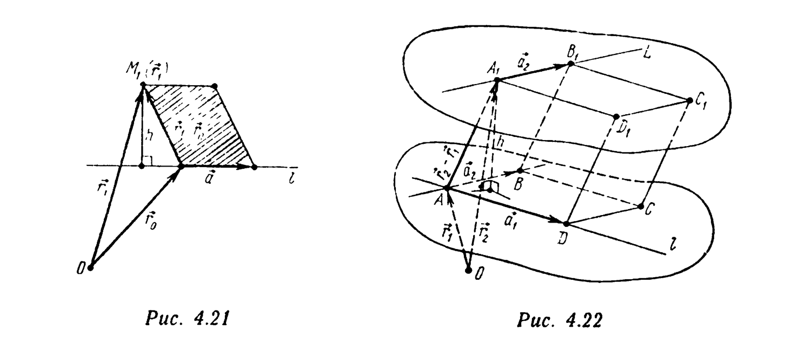

# Глава 4. Векторное и смешанное произведения

## § 5. Векторные задачи на прямую и плоскость

**Пример 1.** Напишите параметрическое векторное уравнение прямой $l$, заданной как линия пересечения двух непараллельных плоскостей $P_1: (\vec r,\vec N_1)=D_1$ и $P_2: (\vec r,\vec N_2)=D_2$.

△ **Первое решение.** Вектор $\vec r$ является тогда и только тогда радиусом-вектором точки прямой $l$, когда
$$(\vec r,\vec N_1)=D_1, \quad (\vec r,\vec N_2)=D_2, \quad \vec N_1(\vec r,\vec N_2)-\vec N_2(\vec r,\vec N_1) = D_2\vec N_1-D_1\vec N_2$$

(в этой системе уравнений третье уравнение есть очевидное следствие первых двух). Используя формулу двойного векторного произведения, перепишем это третье уравнение в виде
$$[\vec r,\vec a]=\vec M, \quad (4.34)$$

---
**стр. 220**

---

где $\vec a=[\vec N_1,\vec N_2]$, $\vec M=D_2\vec N_1-D_1\vec N_2$. Уравнение (4.34) является векторным уравнением некоторой прямой $l^*$ (см. пример 3 § 3 этой главы), полностью определяющим эту прямую. Уравнению (4.34) удовлетворяют все радиусы-векторы точек прямой $l$. Следовательно, $l\subset l^*$, т.е. $l=l^*$, а (4.34) — векторное уравнение $l$. Запишем это уравнение в соответствии с формулой (4.13) в параметрическом виде:
$$\vec r = \frac{[[\vec N_1,\vec N_2],D_2\vec N_1-D_1\vec N_2]}{|[\vec N_1,\vec N_2]|^2} + [\vec N_1,\vec N_2]t, \quad t\in R. \quad (4.35)$$

**Второе решение.** Прямая $l$, находясь в плоскостях $P_1$ и $P_2$, перпендикулярна как вектору $\vec N_1$, так и вектору $\vec N_2$. Следовательно (см. пример 9 § 3 этой главы), вектор $\vec a=[\vec N_1,\vec N_2]$ — направляющий вектор $l$. Вектор $\vec r_0$ (радиус-вектор начальной точки прямой $l$) найдем как радиус-вектор основания перпендикуляра, опущенного из полюса на прямую $l$, т.е. как решение системы уравнений $(\vec r_0,\vec N_1)=D_1$, $(\vec r_0,\vec N_2)=D_2$, $(\vec r_0,\vec a)=0$ ($\vec a=[\vec N_1,\vec N_2]$). Это система уравнений типа (4.28). По формуле (4.29), ее решение
$$\vec r_0 = \frac{D_1[\vec N_2,\vec a]+D_2[\vec a,\vec N_1]+0\cdot[\vec N_1,\vec N_2]}{(\vec N_1,\vec N_2,\vec a)} = \frac{[\vec a,D_2\vec N_1-D_1\vec N_2]}{(\vec a,[\vec N_1,\vec N_2])} = \frac{[[\vec N_1,\vec N_2],D_2\vec N_1-D_1\vec N_2]}{|[\vec N_1,\vec N_2]|^2}.$$

Параметрическое уравнение $l$: $\vec r=\vec r_0+\vec at$, $t\in R$ совпадает с (4.35). ▲

**Пример 2.** Напишите в параметрическом виде уравнения прямой $l$: $x+y-z+1=0$, $x+2y+z-4=0$.

△ В обозначениях предыдущего примера:
$$\vec N_1=(1;1;-1), \quad D_1=-1, \quad \vec N_2=(1;2;1),$$

---
**стр. 221**

---

$D_2=4$, $D_2\vec N_1-D_1\vec N_2=(5;6;-3)$, $\vec a=[\vec N_1,\vec N_2] = \begin{vmatrix} \vec i & \vec j & \vec k \\ 1 & 1 & -1 \\ 1 & 2 & 1 \end{vmatrix} = (3;-2;1)$, $\vec r_0 = \dfrac{1}{9+4+1}\begin{vmatrix} \vec i & \vec j & \vec k \\ 3 & -2 & 1 \\ 5 & 6 & -3 \end{vmatrix} = \dfrac1{14}(0;14;28)=(0;1;2).$

Следовательно, уравнения $l$ — это $x=0+3t$, $y=1-2t$, $z=2+t$ или $\dfrac x3=\dfrac{y-1}{-2}=\dfrac{z-2}{1}$. ▲

**Пример 3.** Найдите ортогональную проекцию $M_*(\vec r_*)$ точки $M_0(\vec r_0)$ на прямую $l$, являющуюся линией пересечения плоскостей $P_1: (\vec r,\vec N_1)=D_1$ и $P_2: (\vec r,\vec N_2)=D_2$.

△ Вектор $\vec a=[\vec N_1,\vec N_2]$ — направляющий вектор $l$. По условию, $M_*\in l$, $\overrightarrow{M_0M_*}\perp\vec a$ (т.е. $(\vec r_*-\vec r_0,\vec a)=0$), и мы приходим к следующей системе уравнений для определения радиуса-вектора $\vec r_*$ точки $M_*$:
$$(\vec r_*,\vec N_1)=D_1, \quad (\vec r_*,\vec N_2)=D_2, \quad (\vec r_*,\vec a)=D_3.$$

Здесь $\vec a=[\vec N_1,\vec N_2]$, $D_3=(\vec r_0,\vec a)=(\vec r_0,\vec N_1,\vec N_2)$. По формуле (4.29) находим
$$\vec r_* = \frac{D_1[\vec N_2,\vec a]+D_2[\vec a,\vec N_1]+D_3\vec a}{(\vec N_1,\vec N_2,\vec a)} = \frac{[[\vec N_1,\vec N_2],D_2\vec N_1-D_1\vec N_2]+(\vec r_0,\vec N_1,\vec N_2)[\vec N_1,\vec N_2]}{|[\vec N_1,\vec N_2]|^2}. \ ▲$$

**Пример 4 (пучок плоскостей, проходящих через заданную прямую).** Напишите уравнения всех плоскостей, проходящих через прямую $l$, которая является линией пересечения плоскостей: $P_1: (\vec r,\vec N_1)+D_1=0$ и $P_2: (\vec r,\vec N_2)+D_2=0$, $[\vec N_1,\vec N_2]\neq\vec0$.

□ Направляющий вектор $\vec a$ прямой $l$ равен $\vec a=[\vec N_1,\vec N_2]$. Пусть $P^*$ — произвольная плоскость, проходящая через прямую $l$. Тогда нормальный вектор $\vec N^*\neq\vec0$ этой плоско-

---
**стр. 222**

---

сти ортогонален вектору $\vec a=[\vec N_1,\vec N_2]$, т.е. параллелен плоскости, в которой векторы $\vec N_1$ и $\vec N_2$ образуют базис. Поэтому существуют (зависящие от $\vec N^*$, т.е. от плоскости $P^*$) такие числа $\alpha$ и $\beta$, что $\vec N^*=\alpha\vec N_1+\beta\vec N_2$, $\alpha^2+\beta^2>0$. Следовательно, уравнение $P^*$ — это $(\vec r,\alpha\vec N_1+\beta\vec N_2)=D^*$. Число $D^*$ также определяется плоскостью $P^*$: оно выражается через $\alpha$ и $\beta$. Чтобы найти связь между $D^*$, $\alpha$ и $\beta$, рассмотрим произвольную точку $M_0\in l$ с радиусом-вектором $\vec r_0$. Так как $M_0\in P_1$, то $(\vec r_0,\vec N_1)=-D_1$; так как $M_0\in P_2$, то $(\vec r_0,\vec N_2)=-D_2$. Наконец, $D^*=(\vec r_0,\alpha\vec N_1+\beta\vec N_2)=-\alpha D_1-\beta D_2$, поскольку $M_0\in P^*$. Таким образом, уравнение всякой плоскости $P^*$, содержащей $l$, имеет вид
$$(\vec r,\alpha\vec N_1+\beta\vec N_2) = -\alpha D_1-\beta D_2 \Leftrightarrow$$
$$\Leftrightarrow \alpha\{(\vec r,\vec N_1)+D_1\}+\beta\{(\vec r,\vec N_2)+D_2\}=0, \quad (4.36)$$

где $\alpha$ и $\beta$ — не равные нулю одновременно числа, определяемые плоскостью $P^*$. Обратно: если $\beta$ и $\alpha$ — произвольные числа, не равные нулю одновременно, то уравнение (4.36) является уравнением некоторой плоскости, причем плоскости, содержащей $l$ (если $\vec r_0$ — радиус-вектор произвольной точки $M_0\in l$, то $M_0\in P_1$: $(\vec r_0,\vec N_1)+D_1=0$, $M_0\in P_2$: $(\vec r_0,\vec N_2)+D_2=0$ и, следовательно, $\alpha\{(\vec r_0,\vec N_1)+D_1\}+\beta\{(\vec r_0,\vec N_2)+D_2\}=\alpha\cdot0+\beta\cdot0=0$, т.е. $M_0$ лежит в плоскости, заданной уравнением (4.36)).

Уравнение (4.36) называется *уравнением пучка плоскостей, проходящих через линию пересечения плоскостей* $P_1: (\vec r,\vec N_1)+D_1=0$ и $P_2: (\vec r,\vec N_2)+D_2=0$. Если уравнения $P_1$ и $P_2$ заданы в координатной форме
$$P_1: A_1x+B_1y+C_1z+D_1=0,$$
$$P_2: A_2x+B_2y+C_2z+D_2=0,$$

то, вводя векторы $\vec N_1=(A_1;B_1;C_1)$, $\vec N_2=(A_2;B_2;C_2)$, получаем $P_1: (\vec r,\vec N_1)+D_1=0$, $P_2: (\vec r,\vec N_2)+D_2=0$. Следовательно, уравнение пучка плоскостей, проходящих через прямую $l=P_1\cap P_2$, принимает вид [ср. с (4.36)]
$$\alpha(A_1x+B_1y+C_1z+D_1)+\beta(A_2x+B_2y+$$
$$+C_2z+D_2)=0, \quad \alpha^2+\beta^2>0. \ ■ \quad (4.37)$$

---
**стр. 223**

---

**Пример 5.** Через линию пересечения двух плоскостей $P_1: (\vec r,\vec N_1)=-D_1$ и $P_2: (\vec r,\vec N_2)=-D_2$ проведите плоскость перпендикулярную плоскости $P_3: (\vec r,\vec N_3)=D_3$, $(\vec N_1,\vec N_3)\neq0$.

△ По формуле (4.36) уравнение искомой плоскости имеет вид $\alpha\{(\vec r,\vec N_1)+D_1\}+\beta\{(\vec r,\vec N_2)+D_2\}=0$, или $(\vec r,\alpha\vec N_1+\beta\vec N_2)=-(\alpha D_1+\beta D_2)$. Нормальный вектор этой плоскости есть вектор $\vec N=\alpha\vec N_1+\beta\vec N_2$. По условию этот вектор ортогонален $\vec N_3$, т.е. $\alpha(\vec N_1,\vec N_3)+\beta(\vec N_2,\vec N_3)=0$. Так как $(\vec N_1,\vec N_3)\neq0$, то $\alpha=-\beta(\vec N_2,\vec N_3)/(\vec N_1,\vec N_3)$, $\beta\neq0$. Подставляя $\alpha$ и $\beta$ в (4.36) и сокращая на $\beta/(\vec N_1,\vec N_3)$, получаем
$$(\vec r,-\vec N_1(\vec N_3,\vec N_2)+\vec N_2(\vec N_3,\vec N_1)) = D_1(\vec N_2,\vec N_3)-$$
$$-D_2(\vec N_1,\vec N_3) \Leftrightarrow (\vec r,\vec N_3,[\vec N_1,\vec N_2]) = (D_2\vec N_1-D_1\vec N_2,\vec N_3). \ ▲$$

**Пример 6.** Составьте уравнение плоскости, проходящей через точку $M(-3;1;0)$ и линию пересечения плоскостей $P_1: x+2y-z+4=0$ и $P_2: 3x-y+2z-1=0$.

△ Уравнение искомой плоскости имеет вид [см. (4.37)]
$$P: \alpha(x+2y-z+4)+\beta(3x-y+2z-1)=0,$$
$$\alpha^2+\beta^2>0.$$

Связь между $\alpha$ и $\beta$ определяется из условия $M\in P$, т.е. $\alpha(-3+2\cdot1-0+4)+\beta(3\cdot(-3)-1+2\cdot0-1)=0$, или $3\alpha-11\beta=0$. После подстановки $\alpha=\dfrac{11}{3}\beta$ и сокращения на $\dfrac13\beta\neq0$ уравнение $P$ принимает вид $20x+19y-5z+41=0$. ▲

**Пример 7.** Составьте уравнение плоскости, параллельной прямой $L$: $\dfrac{x-2}{-1}=\dfrac{y+7}{3}=\dfrac{z}{-2}$ и проходящей через линию пересечения плоскостей $P_1: x-y+2=0$, $P_2: y+z-4=0$.

△ Уравнение искомой плоскости имеет вид
$$\alpha(x-y+2)+\beta(y+z-4)=0 \Leftrightarrow \alpha x+(\beta-\alpha)y+$$
$$+\beta z+(2\alpha-4\beta)=0.$$

---
**стр. 224**

---

Ее нормальный вектор $\vec N=(\alpha;\beta-\alpha;\beta)$ ортогонален направляющему вектору $\vec a=(-1;3;-2)$ прямой $L$: $\alpha\cdot(-1)+(\beta-\alpha)\cdot3+\beta\cdot(-2)=0$. Отсюда $\beta=4\alpha$, а уравнение искомой плоскости $x+3y+4z-14=0$. ▲

**Пример 8.** Напишите уравнение произвольной плоскости, проходящей через общую точку плоскостей $P_1: (\vec r,\vec N_1)=-D_1$, $P_2: (\vec r,\vec N_2)=-D_2$, $P_3: (\vec r,\vec N_3)=-D_3$, $(\vec N_1,\vec N_2,\vec N_3)\neq0$.

△ Пусть $\vec r_0$ — радиус-вектор общей точки $M_0$ плоскостей $P_1$, $P_2$, $P_3$. Тогда $(\vec r_0,\vec N_1)=-D_1$, $(\vec r_0,\vec N_2)=-D_2$, $(\vec r_0,\vec N_3)=-D_3$. Если $P^*$ — произвольная плоскость, то ее нормальный вектор $\vec N\neq\vec0$ раскладывается по некомпланарным векторам $\vec N_1$, $\vec N_2$, $\vec N_3$: $\vec N=\alpha\vec N_1+\beta\vec N_2+\gamma\vec N_3$ (числа $\alpha,\beta,\gamma$, $\alpha^2+\beta^2+\gamma^2>0$ определяются вектором $\vec N$, т.е. плоскостью $P^*$). Таким образом, уравнение $P^*$ — это $(\vec r,\alpha\vec N_1+\beta\vec N_2+\gamma\vec N_3)+D^*=0$. Точка $M_0$ принадлежит $P^*$ тогда и только тогда, когда $\vec r_0$ удовлетворяет уравнению $P^*$, т.е. когда $D^*=-(\vec r_0,\alpha\vec N_1+\beta\vec N_2+\gamma\vec N_3)=\alpha D_1+\beta D_2+\gamma D_3$. Таким образом, уравнение $P^*$
$$\alpha\{(\vec r,\vec N_1)+D_1\}+\beta\{(\vec r,\vec N_2)+D_2\}+$$
$$+\gamma\{(\vec r,\vec N_3)+D_3\}=0, \quad (4.38)$$

называемое *уравнением связки плоскостей, проходящих через общую точку плоскостей* $P_1$, $P_2$, $P_3$, описывает (при переменных $\alpha,\beta,\gamma$, $\alpha^2+\beta^2+\gamma^2>0$) множество всех плоскостей, проходящих через точку $M_0$. ▲

**Пример 9.** Напишите уравнение плоскости, проходящей через точку $M_1(\vec r_1)$ и прямую $l: [\vec r,\vec a]=\vec M$, $\vec a\neq\vec0$, $(\vec a,\vec M)=0$.

△ Запишем уравнение $l$ в параметрическом виде: $\vec r=\vec r_0+\vec at$, $t\in R$, $\vec r_0=\dfrac{[\vec a,\vec M]}{|\vec a|^2}$. Точка $M$ с радиусом-вектором $\vec r$ лежит в искомой плоскости $P$ тогда и только тогда, когда векторы $\vec r-\vec r_1$, $\vec r_0-\vec r_1$, $\vec a$ компланарны, т.е. $(\vec r-\vec r_1,\vec r_0-\vec r_1,\vec a)=0$. Замечая, что $[\vec r_0-\vec r_1,\vec a]=\vec M-[\vec r_1,\vec a]$,

---
**стр. 225**

---

получаем уравнение $P$: $(\vec r,\vec N)=D$, $\vec N=\vec M-[\vec r_1,\vec a]$, $D=(\vec r_1,\vec N)=(\vec r_1,\vec M)$. ▲

**Пример 10.** Напишите уравнение плоскости, проходящей через точку $M_0(\vec r_0)$ и линию пересечения плоскостей $P_1: (\vec r,\vec N_1)+D_1=0$ и $P_2: (\vec r,\vec N_2)+D_2=0$, $[\vec N_1,\vec N_2]\neq\vec0$, $M_0\notin P_1$.

△ Уравнение искомой плоскости $P$ [см. (4.36)] $\alpha\{(\vec r,\vec N_1)+D_1\}+\beta\{(\vec r,\vec N_2)+D_2\}=0$, $\alpha^2+\beta^2>0$. Числа $\alpha$ и $\beta$ удовлетворяют условию $\alpha\{(\vec r_0,\vec N_1)+D_1\}+\beta\{(\vec r_0,\vec N_2)+D_2\}=0$, $\{(\vec r_0,\vec N_1)+D_1\}\neq0$. Выражая отсюда $\alpha$ и подставляя в уравнение плоскости $P$, после сокращения на число
$$-\beta/\{(\vec r_0,\vec N_1)+D_1\}\neq0 \text{ получаем } \{(\vec r_0,\vec N_2)+D_2\}\times$$
$$\times\{(\vec r,\vec N_1)+D_1\}-\{(\vec r_0,\vec N_1)+D_1\}\{(\vec r,\vec N_2)+D_2\}=0. \ ▲$$

**Пример 11.** Даны прямая $l: [\vec r,\vec a]=\vec M$, $\vec a\neq\vec0$, $(\vec a,\vec M)=0$ и плоскость $P: (\vec r,\vec N)=D$, $\vec N\neq\vec0$. При каком условии: а) $l$ и $P$ имеют единственную общую точку; б) $l\cap P=\varnothing$; в) $l\subset P$?

△ а) Запишем уравнение $l$ в параметрическом виде: $\vec r=\vec r_0+\vec at$, $t\in R$, где $\vec r_0=[\vec a,\vec M]/|\vec a|^2$. Прямая $l$ и плоскость $P$ имеют единственную общую точку тогда и только тогда, когда уравнение
$$(\vec r_0+\vec at,\vec N)=D \Leftrightarrow t(\vec a,\vec N)=D-(\vec r_0,\vec N) \quad (4.39)$$

имеет единственное решение $t$. Это имеет место тогда и только тогда, когда $(\vec a,\vec N)\neq0$. В этом случае $t=\dfrac{D-(\vec r_0,\vec N)}{(\vec a,\vec N)}=\dfrac{Da^2-(\vec a,\vec M,\vec N)}{a^2(\vec a,\vec N)}$, а радиус-вектор $\vec r$ общей точки прямой $l$ и плоскости $P$ определяется формулой
$$\vec r = \vec r_0+\vec a\,\frac{D-(\vec r_0,\vec N)}{(\vec a,\vec N)} = \frac{D\vec a+\vec r_0(\vec N,\vec a)-\vec a(\vec N,\vec r_0)}{(\vec a,\vec N)} =$$
$$= \frac{D\vec a+[\vec N,[\vec r_0,\vec a]]}{(\vec a,\vec N)} = \frac{D\vec a+[\vec N,\vec M]}{(\vec a,\vec N)}. \quad (4.40)$$

---
**стр. 226**

---

б) Если $(\vec a,\vec N)=0$, $D\neq(\vec a,\vec M,\vec N)/|\vec a|^2$, то уравнение (4.39) имеет вид $t\cdot0=D-(\vec a,\vec M,\vec N)/|\vec a|^2$ и решений не имеет, т.е. $l$ и $P$ общих точек не имеют.

в) Если $(\vec a,\vec N)=0$, $D|\vec a|^2=(\vec a,\vec M,\vec N)$, то уравнение (4.39) принимает вид $t\cdot0=0$. Его решением является любое число $t$. Таким образом, любая точка прямой $l$ лежит и в плоскости $P$: $l\subset P$. ▲

**Пример 12.** Найдите ортогональную проекцию $M_*(\vec r_*)$ точки $M_1(\vec r_1)$ на прямую $l: [\vec r,\vec a]=\vec M$, $\vec a\neq\vec0$, $(\vec a,\vec M)=0$.

△ По условию, $M_*\in l$, т.е. $[\vec r_*,\vec a]=\vec M$, и $\overrightarrow{M_*M_1}\perp\vec a$, или $(\vec r_*,\vec a)=(\vec r_1,\vec a)$. Задача сведена, таким образом, к нахождению радиуса-вектора $\vec r_*$ общей точки прямой $l: [\vec r,\vec a]=\vec M$ и плоскости $P: (\vec r,\vec N)=D$, $\vec N=\vec a$, $D=(\vec r_1,\vec a)$. По формуле (4.40),
$$\vec r_* = \frac{(\vec r_1,\vec a)\vec a+[\vec a,\vec M]}{(\vec a,\vec a)}. \ ▲$$

**Пример 13.** Напишите уравнение прямой, проходящей через точку $M_1(\vec r_1)$ и пересекающей ортогонально прямую $l: (\vec r,\vec N_i)=D_i$, $i=1,2$, $[\vec N_1,\vec N_2]\neq\vec0$.

△ Пусть $M_0(\vec r_0)$ — основание перпендикуляра, опущенного из точки $M_1$ на прямую $l$. Тогда из условий $M_0\in l$ и $(M_1M_0)\perp l$, т.е. $(\vec r_0-\vec r_1,\vec a)=0$, где $\vec a=[\vec N_1,\vec N_2]$ — направляющий вектор $l$, имеем
$$(\vec r_0,\vec N_1)=D_1, \quad (\vec r_0,\vec N_2)=D_2, \quad (\vec r_0,\vec a)=D_3,$$
$$D_3=(\vec r_1,\vec N_1,\vec N_2).$$

Получена система уравнений типа (4.28). Ее решение [см. (4.29)]:
$$\vec r_0 = \frac{[[\vec N_1,\vec N_2],D_2\vec N_1-D_1\vec N_2]+(\vec r_1,\vec N_1,\vec N_2)[\vec N_1,\vec N_2]}{|[\vec N_1,\vec N_2]|^2}.$$

Уравнение перпендикуляра $\vec r=\vec r_1+(\vec r_0-\vec r_1)t$, $t\in R$. ▲

---
**стр. 227**

---

**Пример 14.** Составьте уравнение плоскости $P$, проходящей через точку $M_1(\vec r_1)$ и перпендикулярной линии $l$ пересечения плоскостей $P_1: (\vec r,\vec N_1)=D_1$ и $P_2: (\vec r,\vec N_2)=D_2$, $[\vec N_1,\vec N_2]\neq\vec0$.

△ Вектор $\vec a=[\vec N_1,\vec N_2]$, направляющий вектор прямой $l$, является нормальным вектором искомой плоскости, уравнение которой, следовательно, $(\vec r,\vec a)=D$. Число $D$ находится из условия $M_1\in P$: $(\vec r_1,\vec a)=D$. Окончательно уравнение $P$ — это $(\vec r-\vec r_1,\vec N_1,\vec N_2)=0$. ▲

**Пример 15.** Составьте уравнение прямой, лежащей в плоскости $P: (\vec r,\vec N)=D$, $\vec N\neq\vec0$ и пересекающей под прямым углом прямую $l: \vec r=\vec r_0+\vec at$, при условии, что $(\vec a,\vec N)\neq0$, $[\vec a,\vec N]\neq\vec0$.

△ Радиус-вектор $\vec r_*$ общей точки $M_*$ плоскости $P$ и прямой $l$ находится из соотношений $\vec r_*=\vec r_0+\vec at$, $(\vec r_0+\vec at,\vec N)=D$, т.е. $\vec r_*=\vec r_0+\vec a\dfrac{D-(\vec r_0,\vec N)}{(\vec a,\vec N)}$. Искомая прямая необходимо проходит через эту точку. Поскольку искомая прямая $L$ лежит в плоскости $P$, направляющий вектор $\vec b$ прямой $L$ ортогонален $\vec N$. По условию, также $\vec b\perp\vec a$. Следовательно, в качестве направляющего вектора прямой $L$ можно взять вектор $\vec b=[\vec a,\vec N]$. Таким образом, уравнение $L$ — это $\vec r=\left(\vec r_0+\dfrac{D-(\vec r_0,\vec N)}{(\vec a,\vec N)}\vec a\right)+[\vec a,\vec N]\tau$, $\tau\in R$. ▲

**Пример 16.** Через прямую $l: \vec r=\vec r_0+\vec at$ проведите плоскость, перпендикулярную плоскости $P: (\vec r,\vec N)=D$, $[\vec a,\vec N]\neq\vec0$.

△ Точка $M_0(\vec r_0)$ и один из направляющих векторов (вектор $\vec a$) искомой плоскости известны. В качестве второго направляющего вектора можно взять, например, $\vec N$, поскольку, по условию искомая плоскость, будучи перпендикулярна плоскости $P$, параллельна ее нормальному вектору $\vec N$. Векторы $\vec a$ и $\vec N$ не коллинеарны. Искомая плоскость

---
**стр. 228**

---

им параллельна. Поэтому в качестве нормального вектора искомой плоскости можно взять $\vec N^*=[\vec a,\vec N]$, а уравнение этой плоскости $(\vec r-\vec r_0,\vec a,\vec N)=0$. ▲

**Пример 17.** Найдите расстояние от точки $M_1(\vec r_1)$ до прямой $l: \vec r=\vec r_0+\vec at$.

△ Искомое расстояние $h$ — длина высоты параллелограмма, построенного на векторах $\vec r_1-\vec r_0$ и $\vec a$ (рис. 4.21). Следовательно,
$$h = \frac{|[\vec r_1-\vec r_0,\vec a]|}{|\vec a|}. \ ▲$$

**Пример 18.** Найдите расстояние между скрещивающимися прямыми $l: \vec r=\vec r_1+\vec a_1t$ и $L: \vec r=\vec r_2+\vec a_2\tau$.

△ Искомое расстояние $h$ — длина общего перпендикуляра к прямым $l$ и $L$, т.е. расстояние между параллельными плоскостями, одна из которых содержит $l$, а другая — $L$, т.е. длина высоты параллелепипеда $ABCDA_1B_1C_1D_1$ (рис. 4.22), построенного на векторах $\vec r_2-\vec r_1$, $\vec a_1$, $\vec a_2$, т.е. число
$$h = \frac{|(\vec r_2-\vec r_1,\vec a_1,\vec a_2)|}{|[\vec a_1,\vec a_2]|}. \ ▲$$
