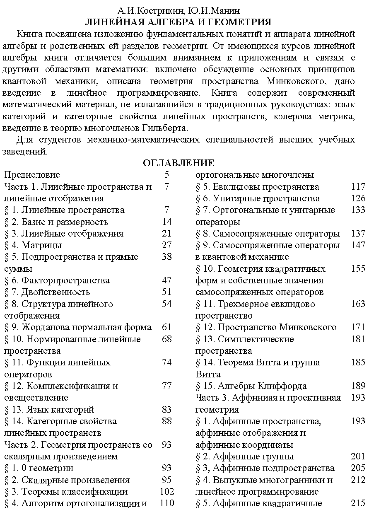

# ВСТУПИТЕЛЬНЫЕ МАТЕРИАЛЫ

## Вступительные материалы (обложка, оглавление, предметный указатель — подшит спереди)

---
**стр. -5**
---

А.И.Кострикин, Ю.И.Манин

ЛИНЕЙНАЯ АЛГЕБРА И ГЕОМЕТРИЯ

Книга посвящена изложению фундаментальных понятий и аппарата линейной алгебры и родственных ей разделов геометрии. От имеющихся курсов линейной алгебры книга отличается большим вниманием к приложениям и связям с другими областями математики: включено обсуждение основных принципов квантовой механики, описана геометрия пространства Минковского, дано введение в линейное программирование. Книга содержит современный математический материал, не излагавшийся в традиционных руководствах: язык категорий и категорные свойства линейных пространств, кэлерова метрика, введение в теорию многочленов Гильберта.

Для студентов механико-математических специальностей высших учебных заведений.

ОГЛАВЛЕНИЕ

Предисловие 5

Часть 1. Линейные пространства и линейные отображения 7

§ 1. Линейные пространства 7
§ 2. Базис и размерность 14
§ 3. Линейные отображения 21
§ 4. Матрицы 27
§ 5. Подпространства и прямые суммы 38
§ 6. Факторпространства 47
§ 7. Двойственность 51
§ 8. Структура линейного отображения 54
§ 9. Жорданова нормальная форма 61
§ 10. Нормированные линейные пространства 68
§ 11. Функции линейных операторов 74
§ 12. Комплексификация и овеществление 77
§ 13. Язык категорий 83
§ 14. Категорные свойства линейных пространств 88

Часть 2. Геометрия пространств со скалярным произведением 93

§ 1. О геометрии 93
§ 2. Скалярные произведения 95
§ 3. Теоремы классификации 102
§ 4. Алгоритм ортогонализации и ортогональные многочлены 110
§ 5. Евклидовы пространства 117
§ 6. Унитарные пространства 126
§ 7. Ортогональные и унитарные операторы 133
§ 8. Самосопряженные операторы 137
§ 9. Самосопряженные операторы в квантовой механике 147
§ 10. Геометрия квадратичных форм и собственные значения самосопряженных операторов 155
§ 11. Трехмерное евклидово пространство 163
§ 12. Пространство Минковского 171
§ 13. Симплектические пространства 181
§ 14. Теорема Витта и группа Витта 185
§ 15. Алгебры Клиффорда 189

Часть 3. Аффинная и проективная геометрия 193

§ 1. Аффинные пространства, аффинные отображения и аффинные координаты 193
§ 2. Аффинные группы 201
§ 3. Аффинные подпространства 205
§ 4. Выпуклые многогранники и линейное программирование 212
§ 5. Аффинные квадратичные

---
**стр. -4**
---

функции и квадрики 220
§ 6. Проективные пространства 220
§ 7. Проективная двойственность и проективные квадрики 226
§ 8. Проективные группы и проекции 230
§ 9. Конфигурации Дезарга и Паппа и классическая проективная геометрия 239
§ 10. Кэлерова метрика 243
§ 11. Алгебраические многообразия и многочлены Гильберта 245

Часть 4. Полилинейная алгебра 254

§ 1. Тензорное произведение линейных пространств 254
§ 2. Канонические изоморфизмы и линейные отображения тензорных произведений 259
§ 3. Тензорная алгебра линейного пространства 264
§ 4. Классические обозначения 266
§ 5. Симметричные тензоры 271
§ 6. Кососимметричные тензоры и внешняя алгебра линейного пространства 275
§ 7. Внешние формы 285
§ 8. Тензорные поля 287
§ 9. Тензорные произведения в квантовой механике 291

Предметный указатель 297

ПРЕДМЕТНЫЙ УКАЗАТЕЛЬ

Аксиома Дезарга 243
— Паппа 243
Аксиомы трехмерного проективного пространства 241
— проективной плоскости 242
Алгебра внешняя 192, 276, 277
— гомологическая 88
— Грассмана 192, 276
— Клиффорда 189
— Ли 34, 38
— — классическая 35
— — gl(n,K) 35
— — o(n,K) 35
— — sl(n,K) 35
— — su(n) 35
— — u(n) 35
— над полем ассоциативная 189
— симметрическая 273, 274
— тензорная 266
Алгоритм ортогонализации Грама — Шмидта 111
Альтернатива Фредгольма конечномерная 50
Альтернирование тензора 275
Амплитуда вероятности 131

---
**стр. -3**
---

Векторы одинаково временно ориентированные 176
— ортогональные 98
Величина случайная 126
— — нормированная 126
Величины случайные независимые 126
Вероятность 129
Вершина выпуклого множества 214
Вес билинейной формы 114
Возмущение 152
Вычитание внешнее 194
Гамильтониан 150
— невозмущенный 152
Геометрия ортогональная 98
— симплектическая 98
— эрмитова 98
Гиперплоскость 224
— касательная 228
— полярная 227
Гиперповерхность алгебраическая 246
Гомотетия 22
Грань верхняя 20
— выпуклого множества 213
Грассманиан 281
Группа аффинная 201
— Витта 189
— движений 202
— классическая 33
— линейная полная 24, 34
— — специальная 34
— Лоренца 135, 173, 178
— ортогональная 34
— — специальная 34
— проективная 231
— Пуанкаре 202
Группа симплектическая 183
— унитарная 34
— — специальная 34
Движение аффинного евклидова пространства 202
— — — — собственное 204
— непрерывное 44
Двойственность тензорных произведений 260
Действие 151
— симметрической группы на тензорах 260
— транзитивное 193
— эффективное 193
Дельта-функционал Дирака 13
Дельта-функция 9
Деформация 44
Диагональ главная 27
Диаграмма 84
— коммутативная 84
Дисперсия 149
Дифференциал отображения в точке 27
— функции 289
Дифференцирование кольца 288
Длина вектора 118, 129
— флага 18
Дополнение ортогональное 53, 102
— прямое 43
Зависимость линейная 16
Замыкание проективное 225
Значение собственное 56
— среднее 149
Идеал 247
— градуированный 247
— двусторонний 274
— конечно порожденный 248
— —, порожденный множеством 248
Излучение фотонов 152
Изометрия линейных пространств 99
Изоморфизм 23
— в категориях 83
— естественный 23
— канонический 24
— проективный 230
— функторный 87
Инвариант линейного оператора 33
Индекс оператора 50

---
**стр. -2**
---

Интервал времениподобный 172  
— пространственноподобный 172  
— светоподобный 172  
Карта аффинная 221  
Категория 83  
— абелевых групп 83  
— групп 83  
— дуальная 85  
— линейных пространств 83  
— множеств 83  
— функторов 87  
Квадрат коммутативный 84  
Квадрика аффинная 219  
— полярная 227  
Кватернионы 168  
Клетка жорданова 58  
— циклическая 67  
Ковариация 126  
Кольцо градуированное 247  
Комбинация линейная 8  
— — тензоров одинакового типа 268  
— точек барицентрическая 198  
Коммутатор 34  
— в К-алгебре Ли 38  
— групповой 37  
Комплекс 84  
— ацикличный 85  
— точный 85  
— — в члене 85  
Комплексификация линейного пространства 80  
— проективного пространства 229  
Композиция морфизмов 83  
— функторов 87  
Компонента градуированного пространства однородная 246  
— группы Лоренца 178  
— тензора 267  
Конец стрелки 83  
Конус асимптотических направлений 158  
— световой 173  
Конфигурации в аффинном пространстве аффинно конгруэнтные 208  
— — — — метрически конгруэнтные 208  
— проективно конгруэнтные 232  
Конфигурация 208  
— Дезарга 240  
— координатная 208  
— Паппа 240  
— проективная 232  
Кообраз 50  
Координата тензора 267  
Координаты аффинные 197  
— барицентрические 199  
— вектора 14  
— точки однородные 220  
Коразмерность подпространства 49  
Косокоммутативность 276  
Коэффициент корреляции 126  
— Фурье 115  
Коядро 50  
Критерий Сильвестра 113  
— цикличности пространства 67  
Круг 71  
Лемма о змее 91  
— Цорна 20  
Линия мировая инерциального наблюдателя 172  
Логарифм оператора 76  
Матрица 27, 267  
— антисимметричная 35  
— антиэрмитова 35  
— блочная 28  
— Грама 96  
— — положительно определенная 113  
— диагональная 27  
— Дирака 36  
— единичная 28  
— жорданова 58  
— квадратная 27  
— композиции линейных отображений 30

---
**стр. -1**
---

— контраградиентная 268  
— кососимметричная 35  
— косоэрмитова 35  
— линейного оператора 29  
— — отображения 29  
— ортогональная 34, 134, 135  
— Паули 36, 164  
— перехода 32  
— псевдоортогональная 135  
— псевдоунитарная 135  
— симметричная 35  
— скалярная 28  
— транспонированная 28  
— треугольная верхняя 27, 28  
— — нижняя 28  
— унитарная 34, 135  
— эрмитова 35  
— эрмитово антисимметричная 35  
— — симметричная 35  
— сопряженная 34  
Медиана системы точек 212  
Метод наименьших квадратов 121  
— Штрассена 37  
Метрика 69, 96  
— дискретная 69  
— естественная 69  
— кэлерова 244  
Многогранник 213  
Многообразие алгебраическое 246  
— Грассмана 281, 283  
Многочлен, аннулирующий оператор 59  
— Гильберта 252  
— Лежандра 116, 143  
— минимальный 60  
— однородный 245  
Многочлен тригонометрический 114  
— Фурье 114, 115, 143  
— характеристический 56  
— Чебышева 117, 145  
— Эрмита 117, 144  
Множество выпуклое 71  
— измеримое 122  
— линейно упорядоченное 19  
— частично упорядоченное 19  
Множитель Лоренца 176  
— фазовый 130  
Модуль 248  
— градуированный 248  
— конечно порожденный 249  
— нётеров 249  
Монотонность размерности 18  
Морфизм категории 83  
— нулевой 84  
— функторный 87  
Наблюдаемая 148  
— импульса 150  
— координаты 150  
— проекции спина 150, 167  
— энергии 150  
— — квантового осциллятора 150  
Направление 164  
Направления асимптотические 157  
Направленность времени 172  
Начало стрелки 93  
Независимость линейная 16  
Неравенство Коши — Буняковского— Шварца 118, 128  
— Минковского 74  
— треугольника 118, 129  
— — в обратную сторону 175  
Норма вектора 70  
— линейного оператора индуцированная 72, 146  
Оболочка аффинная 206  
— линейная 16  
— проективная 223  
Образ линейного отображения 26  
— обратный 86  
Образующие конуса 158  
— мультипликативные 189  
Объект категории 83  
— — инъективный 83  
— — проективный 83  
Объем n-мерный 122  
— — шарового кольца 125

---
**стр. 0**
---

Овеществление линейного пространства 77  
Ожидание математическое 126  
Окружность 71  
Оператор Гамильтона 150  
— диагонализируемый 56  
Оператор пограничный 92  
— линейный 21  
— неотрицательный 146  
— нильпотентный 61  
— нормальный 145  
— ортогональный 133  
— рождения частиц 294  
— самосопряженный 138, 139  
— симметричный 139  
— сопряженный 139  
— унитарный 133  
— уничтожения частиц 294  
— числа частиц 294  
— эрмитов 139  
Определитель линейного оператора 33  
Опускание индексов тензора 263, 270  
Ориентация пространства 46, 166  
— — Минковского 177  
Оси квадратичной формы главные 156  
Отклонение среднеквадратичное 149  
Отношение двойное 235  
— перспективное 237  
— порядка 19  
Отображение антиплинейное 82  
— аффинно линейное 195  
— аффинное 195  
— билинейное 51, 95  
— двойственное 52  
— двойственности 227  
— линейное 21  
— — нулевое 22  
— — ограниченное 72  
— — тождественное 22  
— полилинейное 95, 254  
— — универсальное 254  
— полулинейное 82  
— полуторалинейное 96  
— симметризации 271  
— сопряженное 52  
— Хопфа 222  
Отражение 136  
— времени 180  
— пространственное 180  
Пара базисов двойственная 52  
Параболоид гиперболический 157  
— эллиптический 156  
— — n-мерный 158  
Парадокс близнецов 176  
Параллелепипед со сторонами $\{l_1,\dots,l_n\}$ 123  
Пары наблюдаемых канонически сопряженные 149  
Пересечение подпространств трансверсальное 40  
Перестановка 269  
Перпендикуляр к двум подпространствам общий 210  
Печка 148  
План производства 212  
— —, оптимальный по прибыли 213  
Плоскость гиперболическая 185  
— проективная 220  
Поглощение фотонов 152  
Подгруппа операторов однопараметрическая 75  
— ортохронная 173
Подмногообразие линейное 47  
Подмножество выпуклое 71  
— ограниченное 70  
Подпространства аффинные параллельные 205, 206  
— ортогональные 98  
Подпространство аффинное 205  
— вещественное 230  
— градуированное 247  
— изотропное 102, 181

---
**стр. 1**
---

—, инвариантное относительно оператора 56  
— линейное 10  
— направляющее 205  
—, натянутое на векторы 16  
— невырожденное 102  
—, порожденное векторами 16  
— проективное 223  
— собственное 56  
— состояний квантовой системы 129  
Подсемейство максимальное 17  
Подъем индексов тензора 263, 270  
— поля скаляров 86, 258  
Покрытие проективного пространства аффинное 220  
Поле векторное 288  
— тензорное 289  
Положение общее подпространств 40  
— — точек 233  
— равновесия механической системы 159  
Полупространство 213  
Поляризация квадратичной формы 10  
Последовательность Коши 70  
— линейных пространств точная 54  
— сходящаяся 70  
— точная 85  
— фундаментальная 70  
Постоянная Планка 151  
Правила Фейнмана 131, 132  
Преобразование Кэли 146  
Приведение билинейной формы к каноническому виду 109  
— квадратичной формы к каноническому виду 110, 111, 114  
— матрицы к каноническому виду 108  
Принцип неопределенности Гейзенберга 149  
— Паули 293  
— проективной двойственности 226  
— суперпозиции 130, 292  

Проективизация 230  
Проектор 42  
— самосопряженный 141  
Проекция вектора ортогональная 119  
— из центра 236  
Произведение векторное 167  
— внутреннее 287  
— Кронекера 37  
— морфизмов 83  
— скалярное 96  
— — антисимметричное 98  
— — невырожденное 99  
— — симметричное 98  
— — симплектическое 98  
— — эрмитово 98  
— — — симметричное 98  
— тензорное 37  
— — линейных отображений 262  
— — пространств 255  
Производная по направлению 288  
Пространства изометричные 99  
— изоморфные 23  
Пространство анизотропное 185  
— аффинное 94, 193  
— — евклидово 202  
— банахово 70  
— бесконечномерное 14  
— векторное 7  
— вероятностное конечное 126  
— гильбертово 127  
— гиперболическое 185  
— главное однородное 194  
—, двойственное к данному 10, 51  
— евклидово 117  
— касательное 288  
— когомологий 91  
— комплексное сопряженное 81  
— конечномерное 14  
— координатное одномерное 8  
— — n-мерное 8  
— линейное 7  

---
**стр. 2**
---

— —, ассоциированное с аффинным пространством 193  
— — градуированное 246  
— — над телом 242  
— — нормированное 70  
— — — полное 70  
— метрическое 68, 69  
— — полное 70  
— Минковского 158, 171  
— нульмерное 8  
— ортогональное одномерное нулевое 101  
— — — отрицательное 101  
— — — положительное 101  
— проективное 94, 220  
— — двойственное 226  
— — координатное n-мерное 220  
— — трехмерное вещественное 170, 171  
Пространство рефлексивное 26  
— симплектическое 181  
— сопряженное 10  
— спиноров 163  
— унитарное 126  
— физическое инерциального наблюдателя 173  
— функций 8, 9  
— циклическое 67  
Прямая проективная 220  
Пфаффиан 184  
Разбиение проективного пространства клеточное 237  
Разложение оператора полярное 147  
— — спектральное 142  
Размерность алгебраического многообразия 253  
— линейного пространства 14  
— проективного пространства 220  
Ранг матрицы 37  
— семейства векторов 16  
— скалярного произведения 99  
— тензора 264, 294  
— — предельный 295  

Расположение подпространств взаимное 40  
Расстояние между множествами 119, 132  
— — точками 69  
— от точки до подпространства 209  
Расширение группы аффинное 202  
Ряд абсолютно сходящийся 70  
— Пуанкаре 251  
— теории возмущений 154  
— Фурье 116  
Свертка тензора 262, 269  
— — по -индексам 263  
— — полная 263  
Сдвиг 193  
Семейство векторов линейно зависимое 16  
— — — независимое 16  
Сигнатура квадратичной формы 110  
— пространства 104  
Символ Кронекера 9  
Симметризация тензора 271  
Симплекс замкнутый 201  
— — вырожденный 201  
— (n—1)-мерный стандартный 201  
Система аффинных координат 197  
— координат барицентрическая 199  
— — инерциальная 173  
— образующих идеала 248  
— — модуля однородная 249  
— уравнений нормальная 122  
След линейного оператора 33  
Сложение матриц 29  
Сопряжение 33  
— дифференциальных операторов формальное 143  
Состояние вакуумное 294  
— квантовой системы 130  
— — — базисное 131  
— — — возбужденное 152  
— — — вырожденное 152  
— — — основное 152  
— — — стационарное 151  

---
**стр. 3**
---

Спаривание пространств 51  
— — каноническое 51  
Спектр квантовой системы энергетический 151  
— оператора 58  
— — простой 58  
— самосопряженного оператора 161  
Спуск поля скаляров 78  
Среднее арифметическое 13  
— взвешенное 14  
— квадратичное взвешенное 114  
Статистика Бозе — Эйнштейна 293  
— Ферми 293  
Степень внешняя 287  
— вырождения 151  
— многообразия 253  
Столбец матрицы 27  
Стрелка 83  
Строка матрицы 27  
Структура комплексная 78  
— — каноническая 78  
— — сопряженная 81  
Сумма линейных отображений прямая 44  
— подпространств 38  
— — прямая 41  
— — — внешняя 43  
Суперпозиция 130  
Сфера 69  
Сходимость по норме 70  
Тело 242  
— кватернионов 168  
Температура 125  
Тензор 264, 268  
— антисимметричный 275  
— ковариантный 264  
— контравариантный 264  
— кососимметричный 275  
— Кронекера 268  
— метрический 267, 290  
— симметричный 271  
— смешанный 264  
— структурный 265, 268  

Теорема Витта 186  
— Гамильтона — Кэли 60  
— Дезарга 257  
— инерции 105  
— о продолжении базиса 17  
Теорема о продолжении отображений 88, 89  
— — точности функтора 89, 90  
— Паппа 241, 243  
— Фишера — Куранта 162  
— Шаля 204  
— Эйлера 137  
— Якоби 114  
Теория возмущений 152  
— Морса 160  
— относительности специальная 171  
Тип тензора 264  
Топология слабая 73  
Точка аффинного пространства 193  
— вещественная 230  
— внутренняя 213  
— критическая 160  
— невырожденная 160  
— проективного пространства 220  
— центральная 216  
Точность функтора тензорного умножения 264  
Тройка точная 85  
Углы Эйлера 170  
Угол между векторами 119, 129  
— — прямой и аффинным подпространством 212  
— — прямыми 212  
Умножение внешнее 275  
— матриц 30  
— на скаляр 22, 29  
— тензорное 265  
Уравнение Шрёдингера 151  
Уровень энергетический 151  
Условие Гильберта 13  
— Коши 13  
— линейное 10  
Факторпространство 48  

---
**стр. 4**
---

Фермион 293  
Фильтр 148  
Фильтрация возрастающая 18  
— убывающая 18  
Флаг пространства 18  
— — максимальный 18  
Форма 95, 245  
— билинейная 108  
— квадратичная 109  
— — положительно определенная 113  
— нормальная жорданова 59  
— объема 291  
— полилинейная 95  
Функтор 85  
— ковариантный 85  
— контравариантный 85  
—, представляющий объект категории 87  
— тензорного умножения 264  
Функционал линейный 10  
Функция аффинно линейная 195  
— квадратичная 215  
— линейная 10  
— полилинейная 95  
Характеристика эйлерова 91  
Центр 216  
Цепь 19  
Цилиндр параболический 157  
Часть анизотропная пространства 188  
— квадратичная квадратичной функции 215  
— линейная аффинного отображения 195  
— — квадратичной функции 215  
Число заполнения 293  
Шар замкнутый 69  
— открытый 69  
Шар n-мерный 124  
Эквивалентность норм 72  
Эксперимент Штерна — Герлаха 165  
Экспонента ограниченного оператора 75  

Элемент максимальный 20  
— наибольший 20  
— однородный 246  
Эллипсоид n-мерный 124  
Энергия 125  
Ядро линейного отображения 26  
— — — левое 102  
— — — правое 102  
— скалярного произведения 99  
Λ-модуль 248  
— градуированный 248  
p-вектор 279  
— разложимый 279  
p-форма внешняя 285, 291  
σ-процесс 239  
ψ-функция 130  
1-форма дифференциальная 289  

---
**стр. 5**
---

# ПРЕДИСЛОВИЕ

На все можно смотреть с разных точек зрения, предмет этой книги — не исключение. Для студента мехмата МГУ линейная алгебра — это то, что читают первокурсникам во втором семестре. Для профессионала-алгебраиста, воспитанного в духе Бурбаки, линейная алгебра — это теория алгебраических структур частного вида — линейных пространств и линейных отображений, или, в более новомодном стиле, теория линейных категорий.

С более широкой точки зрения, содержание линейной алгебры состоит в проработке математического языка для выражения одной из самых общих естественнонаучных идей — идеи линейности. Возможно, ее важнейшим специальным случаем является принцип линейности малых приращений: почти всякий естественный процесс почти всюду в малом линеен. Этот принцип лежит в основе всего математического анализа и его приложений. Векторная алгебра трехмерного физического пространства, исторически ставшая краеугольным камнем в здании линейной алгебры, восходит к тому же источнику: после Эйнштейна мы понимаем, что и физическое пространство приближенно линейно лишь в малой окрестности наблюдателя. К счастью, эта малая окрестность довольно велика.

Физика двадцатого века резко и неожиданно расширила сферу применения идеи линейности, добавив к принципу линейности малых приращений принцип суперпозиции векторов состояний. Грубо говоря, пространство состояний любой квантовой системы является линейным пространством над полем комплексных чисел. В результате почти все конструкции комплексной линейной алгебры превратились в аппарат, используемый для формулировки фундаментальных законов природы: от теории линейной двойственности, объясняющей квантовый принцип дополнительности Бора, до теории представлений групп, объясняющей таблицу Менделеева, «зоологию» элементарных частиц и даже структуру пространства-времени.

Выбор материала для этого курса определялся желанием авторов не только изложить основы аппарата, почти завершенного к началу этого века, но и дать представление о его приложениях, обычно относимых к другим дисциплинам. Традиции преподавания способствуют рассечению живого тела математики на изолированные органы, жизнеспособность которых приходится поддерживать искусственно. Особенно это относится к «критическим периодам» в истории нашей науки, которые характерны вниманием к логической стройности и детальной проработке оснований. Последние полвека были временем теоретико-множественной перестройки языка и фундаментальных понятий; единство математики стало рассматриваться преимущественно как единство ее логических принципов. Не отказываясь от замечательных достижений этого периода, мы хотели отразить в книге и намечающиеся тенденции к синтезу математики как орудия познания внешнего мира. (К сожалению, нам пришлось оставить в стороне теорию вычислительных аспектов линейной алгебры, выросшую в самостоятельную науку.)

По этим соображениям в предлагаемую книгу, как и во «Введение в алгебру» одного из авторов, включен не только материал для лекционного курса, но и разделы для домашнего чтения, которые могут быть использованы также на семинарских занятиях. Жесткого разделения здесь не может быть. Все же в соответствии со стандартной программой лекционный курс (один семестр, по две лекции в неделю) должен включать основной материал § 1—9 части 1; § 2—8

---
**стр. 6**
---

части 2; § 1, 3, 5, 6 части 3 и § 1, 3—6 части 4. При этом под «основным материалом» мы понимаем не столько доказательства трудных теорем (которых в линейной алгебре немного), сколько систему понятий, которыми следует овладеть. Поэтому многие теоремы из этих разделов могут быть рассказаны в более простом варианте или вовсе опущены; по недостатку времени такие сокращения неизбежны. Как избежать при этом превращения лекций в унылый список определений, составляет серьезную заботу преподавателя. Мы надеемся, что остальные разделы курса помогут ему в этом.

При переиздании внесены исправления опечаток и мелких стилистических погрешностей, сообщенных нам рядом читателей. В двух местах пришлось корректировать доказательства. Многочисленные ценные замечания были сделаны сотрудниками кафедры алгебры и теории чисел Ленинградского государственного университета. Конструктивная критика рецензентов, а также высококвалифицированная, тщательная работа редактора издания В. Л. Попова во многом способствовали улучшению качества книги. Мы выражаем им всем глубокую благодарность.

Все оставшиеся недочеты в книге авторы, разумеется, относят на свой счет.

## СПИСОК ДОПОЛНИТЕЛЬНОЙ ЛИТЕРАТУРЫ

1. Кострикин А. И. Введение в алгебру. — М.: Наука, 1977.
2. Ленг С. Алгебра. — М.: Мир, 1968.
3. Мальцев А. И. Основы линейной алгебры. — М.: Наука, 1975.
4. Гельфанд И. М. Лекции по линейной алгебре. — М.: Наука, 1966.
5. Халмош П. Р. Конечномерные векторные пространства. — М.: Физматгиз, 1963.
6. Артин Э. Геометрическая алгебра. — М.: Мир, 1970.
7. Глазман И. М., Любич Ю. И. Конечномерный линейный анализ. — М.: Наука, 1969.
8. Воеводин В. В. Вычислительные основы линейной алгебры. — М.: Наука, 1977.
