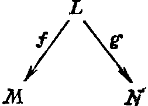
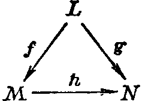
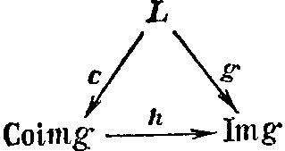

## 1.6. Факторпространства

---
**стр. 47**
---

«неинвариантные относительно зеркального отражения», был решен около двадцати лет назад положительно, ко всеобщему изумлению, экспериментом, установившим несохранение четности в слабых взаимодействиях.

## УПРАЖНЕНИЯ

1. Пусть $(L_1,L_2,L_3)$ — упорядоченная тройка плоскостей в $\mathscr{K}^3$, попарно различных. Доказать, что имеются два возможных типа взаимного расположения таких троек, характеризующихся тем, что $\dim L_1\cap L_2\cap L_3=0$ или $1$. Какой из этих типов следует считать общим?

2. Доказать, что тройки попарно разных прямых в $\mathscr{K}^3$ все одинаково расположены, а для четверок это уже неверно.

3. Пусть $L_1\subset L_2\subset\dots\subset L_n$ — флаг в конечномерном пространстве $L$, $m_i=\dim L_i$. Доказать, что если $L'_1\subset\dots\subset L'_n$ — другой флаг, $m'_i=\dim L'_i$, то автоморфизм $L$, переводящий первый флаг во второй, существует тогда и только тогда, когда $m_i=m'_i$ для любого $i$.

4. То же для прямых разложений.

5. Доказать утверждения пятого абзаца п. 6.

6. Пусть $p\colon L\to L$ — проектор. Доказать, что $L=\operatorname{Ker}p\oplus\operatorname{Im}p$. Вывести отсюда, что в подходящем базисе $L$ любой проектор $p$ представлен матрицей вида
$$\begin{pmatrix}E_r&0\\0&0\end{pmatrix},$$
где $r=\dim\operatorname{Im}p$.

7. Пусть $L$ — $n$-мерное пространство над конечным полем из $q$ элементов

а) Вычислить количество $k$-мерных подпространств в $L$, $1\le k\le n$.

б) Вычислить количество пар подпространств $L_1$, $L_2\subset L$ с данными размерностями $L_1$, $L_2$ и $L_1\cap L_2$. Убедиться, что при $q\to\infty$ доля этих пар, находящихся в общем положении, среди всех пар с данными $\dim L_1$, $\dim L_2$ стремится к $1$.

## § 6. Факторпространства

1. Пусть $L$ — линейное пространство, $M\subset L$ — его линейное подпространство, а $l\in L$ — вектор. Различные вопросы приводят к рассмотрению множеств вида
$$l+M=\{l+m\,|\,m\in M\},$$
«сдвигов» линейного пространства $M$ на вектор $l$. Вскоре мы убедимся, что такие сдвиги не обязаны быть линейными подпространствами в $L$; их называют *линейными подмногообразиями*. Начнем с доказательства следующей леммы.

2. **Лемма.** $l_1+M_1=l_2+M_2$ тогда и только тогда, когда $M_1=M_2=M$ и $l_1-l_2\in M$. Таким образом, всякое линейное подмногообразие однозначно определяет линейное подпространство $M$, сдвигом которого оно является. Вектор же сдвига определяется лишь с точностью до элемента из этого подпространства.

**Доказательство.** Прежде всего, пусть $l_1-l_2\in M$. Положим $l_1-l_2=m_0$. Имеем
$$l_1+M=\{l_1+m\,|\,m\in M\},\quad l_2+M=\{l_1+m-m_0\,|\,m\in M\}.$$

---
**стр. 48**
---

Но когда $m$ пробегает все векторы из $M$, $m-m_0$ тоже пробегает все векторы из $M$. Поэтому $l_1+M=l_2+M$.

Наоборот, пусть $l_1+M_1=l_2+M_2$. Положим $m_0=l_1-l_2$. Из определения ясно, что тогда $m_0+M_1=M_2$. Так как $0\in M_2$, мы должны иметь $m_0\in M_1$. Значит, $m_0+M_1=M_1$ по рассуждению в предыдущем абзаце, так что $M_1=M_2=M$. Это завершает доказательство.

3. **Определение.** *Факторпространством* $L/M$ линейного пространства $L$ по $M$ называется множество всех линейных подмногообразий в $L$, являющихся сдвигами подпространства $M$, со следующими операциями:

а) $(l_1+M)+(l_2+M)=(l_1+l_2)+M$,

б) $a(l_1+M)=al_1+M$ для любых $l_1$, $l_2\in L$, $a\in\mathscr{K}$.

Эти операции определены корректно и превращают $L/M$ в линейное пространство над полем $\mathscr{K}$.

4. **Проверка корректности определения.** Она состоит из следующих шагов:

а) *Если $l_1+M=l'_1+M$ и $l_2+M=l'_2+M$, то $l_1+l_2+M=l'_1+l'_2+M$.*

В самом деле, из леммы п. 2 следует, что $l_1-l'_1=m_1\in M$ и $l_2-l'_2=m_2\in M$. Поэтому снова по лемме п. 2
$$(l_1+l_2)+M=(l'_1+l'_2)+(m_1+m_2)+M=(l'_1+l'_2)+M,$$
ибо $m_1+m_2\in M$.

б) *Если $l_1+M=l'_1+M$, то $al_1+M=al'_1+M$.*

В самом деле, снова полагая $l_1-l'_1=m\in M$, имеем $al_1-al'_1=am\in M$, и применение леммы п. 2 дает требуемое.

Таким образом, сложение и умножение на скаляр действительно однозначно определены в $L/M$. Остается проверить аксиомы линейного пространства. Но они сразу же следуют из соответствующих формул в $L$. Например, одна из формул дистрибутивности проверяется так:
$$a[(l_1+M)+(l_2+M)]=a((l_1+l_2)+M)=a(l_1+l_2)+M=$$
$$=al_1+al_2+M=(al_1+M)+(al_2+M)=a(l_1+M)+a(l_2+M).$$
Здесь последовательно используются: определение сложения в $L/M$, определение умножения на скаляр в $L/M$, дистрибутивность в $L$ и снова определение сложения и умножения на скаляр в $L/M$.

5. **Замечания.** а) Из определения видно, что аддитивная группа $L/M$ совпадает с факторгруппой аддитивной группы $L$ по аддитивной группе $M$. В частности, подмногообразие $M\subset L$ является нулем в $L/M$.

б) Имеется каноническое отображение $f\colon L\to L/M$: $f(l)=l+M$. Оно сюръективно, а его слои — прообразы элементов — суть как раз подмногообразия, отвечающие этим элементам. Действительно, по лемме п. 2
$$f^{-1}(l_0+M)=\{l\in L\,|\,l+M=l_0+M\}=\{l\in L\,|\,l-l_0\in M\}=l_0+M.$$

---
**стр. 49**
---

Заметим, что в этой цепочке равенств $l_0 + M$ первый раз рассматривается как *элемент* множества $L/M$, а остальные — как *подмножества* в $L$.

Из п. 4 ясно, что $f$ — линейное отображение, а лемма п. 2 показывает, что $\operatorname{Ker} f = M$, ибо $l_0 + M = M$ тогда и только тогда, когда $l_0 \in M$.

**6. Следствие.** *Если $L$ конечномерно, то $\dim L/M = \dim L - \dim M$.*

*Доказательство.* Применить теорему п. 12, § 3 к построенному отображению $L \to L/M$.

Многие важные задачи в математике приводят к ситуации, когда пространства $M \subset L$ бесконечномерны, а факторпространство $L/M$ конечномерно. В этом случае пользоваться следствием п. 6 нельзя, и вычисление $\dim L/M$ обычно становится нетривиальной задачей. Число $\dim L/M$ вообще называется *коразмерностью* подпространства $M$ в $L$ и обозначается $\operatorname{codim} M$ или $\operatorname{codim}_L M$.

**7.** Поставим следующую задачу: даны два отображения $f: L \to M$ и $g: L \to N$; когда существует такое отображение $h: M \to N$, что $g = hf$? На языке диаграмм: когда можно вложить диаграмму

в коммутативный треугольник

(ср. § 13 о коммутативных диаграммах). Ответ для линейных отображений даётся следующим результатом.

**8. Предложение.** *Для существования $h$ необходимо и достаточно, чтобы $\operatorname{Ker} f \subset \operatorname{Ker} g$; если это условие выполнено и $\operatorname{Im} f = M$, то $h$ единственен.*

*Доказательство.* Если $h$ существует, из $g = hf$ следует, что $g(l) = hf(l) = 0$, коль скоро $f(l) = 0$. Поэтому $\operatorname{Ker} f \subset \operatorname{Ker} g$.

Наоборот, пусть $\operatorname{Ker} f \subset \operatorname{Ker} g$. Построим сначала $h$ на подпространстве $\operatorname{Im} f \subset M$. Единственная возможность состоит в том, чтобы положить $h(m) = g(l)$, если $m = f(l)$. Нужно проверить, что $h$ определено однозначно и линейно на $\operatorname{Im} f$. Первое следует из того, что если $m = f(l_1) = f(l_2)$, то $l_1 - l_2 \in \operatorname{Ker} f \subset \operatorname{Ker} g$, откуда $g(l_1) = g(l_2)$. Второе следует автоматически из линейности $f$ и $g$.

Теперь достаточно продолжить отображение $h$ с подпространства $\operatorname{Im} f \subset M$ на все пространство $M$, например, выбрав базис $\operatorname{Im} f$, дополнив его до базиса $M$ и положив $h$ равным нулю на дополняющих векторах,

---
**стр. 50**
---

**9.** Пусть $g: L \to M$ — линейное отображение. Мы уже определили ядро и образ $g$; дополним это определение, положив

кообраз $g$: $\operatorname{Coim} g = L/\operatorname{Ker} g$,

коядро $g$: $\operatorname{Coker} g = M/\operatorname{Im} g$.

Имеется цепочка линейных отображений, «разбирающая $g$ на части»,

$$\operatorname{Ker} g \xrightarrow{i} L \xrightarrow{c} \operatorname{Coim} g \xrightarrow{h} \operatorname{Im} g \xrightarrow{j} M \xrightarrow{f} \operatorname{Coker} g,$$

где все отображения, кроме $h$, — канонические вложения и факторизация, а $h$ — единственное отображение, делающее коммутативной диаграмму

Оно определено однозначно, потому что $\operatorname{Ker} c = \operatorname{Ker} g$, и является изоморфизмом, потому что обратное отображение тоже существует и определено однозначно.

Смысл объединения этих пространств в пары (с приставкой «ко» и без неё) объясняется в теории двойственности (см. следующий параграф и упражнение 1 к нему).

**10. Конечномерная альтернатива Фредгольма.** Пусть $g: L \to M$ — линейное отображение. Число

$$\operatorname{ind} g = \dim \operatorname{Coker} g - \dim \operatorname{Ker} g$$

называется *индексом* оператора $g$. Из предыдущего пункта следует, что *если $L$ и $M$ конечномерны, то индекс $g$ зависит только от $L$ и $M$:*

$$\operatorname{ind} g = (\dim M - \dim \operatorname{Im} g) - (\dim L - \dim \operatorname{Im} g) = \dim M - \dim L.$$

В частности, если $\dim M = \dim L$, например, если $g$ — линейный оператор на $L$, то $\operatorname{ind} g = 0$ для любого $g$. Отсюда вытекает так называемая альтернатива Фредгольма:

либо уравнение $g(x) = y$ разрешимо для всех $y$, и тогда уравнение $g(x) = 0$ имеет лишь нулевые решения;

либо это уравнение разрешимо не для всех $y$, и тогда однородное уравнение $g(x) = 0$ имеет ненулевые решения.

Точнее, *если $\operatorname{ind} g = 0$, то размерность пространства решений однородного уравнения равна коразмерности пространства правых частей, при которых разрешимо неоднородное уравнение.*
