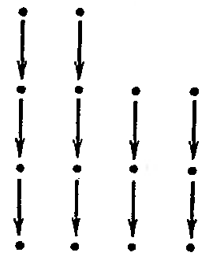

## 1.9. Жорданова нормальная форма

---
**стр. 61**
---

$k \geqslant r$. С другой стороны,

$$(J_r(\lambda) - \lambda E_r)^k = J_r(0)^k$$

при $0 \leqslant k \leqslant r - 1$, а поскольку минимальный многочлен — делитель характеристического, это доказывает, что они совпадают.

## УПРАЖНЕНИЯ

**1.** Пусть $f \colon L \to L$ — диагонализируемый оператор с простым спектром.

а) Доказать, что любой оператор $g \colon L \to L$ такой, что $gf = fg$, может быть представлен в виде многочлена от $f$.

б) Доказать, что размерность пространства таких операторов $g$ равна $\dim L$. Верны ли эти утверждения, если спектр оператора $f$ не прост?

**2.** Пусть $f, g \colon L \to L$ — линейные операторы в пространстве размерности $n$ над полем нулевой характеристики. Предположим, что $f^n = 0$, $\dim \operatorname{Ker} f = 1$, $gf - fg = f$. Доказать, что собственные значения $g$ имеют вид $a, a - 1, a - 2, \ldots, a - (n - 1)$ для некоторого $a \in \mathcal{K}$.

## § 9. Жорданова нормальная форма

Основная цель этого параграфа — доказательство следующей теоремы о существовании и единственности жордановой нормальной формы для матриц и линейных операторов.

**1. Теорема.** *Пусть $\mathcal{K}$ — алгебраически замкнутое поле, $L$ — конечномерное линейное пространство над $\mathcal{K}$, $f \colon L \to L$ — линейный оператор. Тогда:*

*а) Для оператора $f$ существует жорданов базис, т. е. его матрица $A$ в некотором базисе может быть приведена заменой базиса $X$ к жордановой форме: $X^{-1}AX = J$.*

*б) Матрица $J$ определена однозначно с точностью до перестановки входящих в нее жордановых клеток.*

**2.** Доказательство теоремы разбивается на ряд промежуточных шагов. Мы начнем с конструкции прямого разложения $L = \bigoplus_{i=1}^n L_i$, где $L_i$ — инвариантные подпространства для $f$, которые впоследствии будут отвечать *набору жордановых клеток для $f$ с одним и тем же числом $\lambda$ на диагонали*. Чтобы инвариантно охарактеризовать эти подпространства, вспомним, что $(J_r(\lambda) - \lambda E_r)^n = 0$. Оператор, некоторая степень которого равна нулю, принято называть *нильпотентным*. Итак, на подпространстве, отвечающем клетке $J_r(\lambda)$, оператор $f - \lambda$ нильпотентен; то же верно для его ограничения на сумму подпространств с фиксированным $\lambda$. Это мотивирует следующее определение.

**3. Определение.** *Вектор $l \in L$ называется корневым вектором оператора $f$, отвечающим $\lambda \in \mathcal{K}$, если существует такое $r$, что $(f - \lambda)^r l = 0$ (здесь $f - \lambda$ обозначает оператор $f - \lambda \operatorname{id}$).*

Очевидно, все собственные векторы корневые.

**4. Предложение.** *Обозначим через $L(\lambda)$ множество корневых векторов оператора $f$ в $L$, отвечающих $\lambda$. Тогда $L(\lambda)$ — линейное подпространство в $L$ и $L(\lambda) \neq \{0\}$ тогда и только тогда, когда $\lambda$ — собственное значение для $f$.*

---
**стр. 62**
---

*Доказательство.* Допустим, $(f - \lambda)^{r_1} l_1 = (f - \lambda)^{r_2} l_2 = 0$. Полагая $r = \max(r_1, r_2)$, находим $(f - \lambda)^r (l_1 + l_2) = 0$ и $(f - \lambda)^{r_1}(al_1) = 0$. Следовательно, $L(\lambda)$ является линейным подпространством.

Если $\lambda$ — собственное значение для $f$, то имеется собственный вектор, отвечающий $\lambda$, так что $L(\lambda) \neq \{0\}$. Наоборот, пусть $l \in L(\lambda)$, $l \neq 0$. Выберем *наименьшее* значение $r$, для которого $(f - \lambda)^r l = 0$. Очевидно, $r \geqslant 1$. Вектор $l' = (f - \lambda)^{r-1} l$ является собственным для $f$ с собственным значением $\lambda$: $l' \neq 0$ по выбору $r$ и $(f - \lambda)l' = 0$, откуда $f(l') = \lambda l'$.

**5. Предложение.** $L = \bigoplus L(\lambda_i)$, *где* $\lambda_i$ *пробегает все собственные значения оператора* $f$, *т. е. различные корни характеристического многочлена* $f$.

*Доказательство.* Пусть $P(t) = \prod_{i=1}^s (t - \lambda_i)^{r_i}$ — характеристический многочлен $f$, $\lambda_i \neq \lambda_j$ при $i \neq j$. Положим $F_i(t) = P(t)(t - \lambda_i)^{-r_i}$, $f_i = F_i(f)$, $L_i = \operatorname{Im} f_i$. Проверим следующую серию утверждений.

а) $(f - \lambda_i)^{r_i} L_i = \{0\}$, т. е. $L_i \subset L(\lambda_i)$. Действительно, $(f - \lambda_i)^{r_i} f_i = (f - \lambda_i)^{r_i} F_i(f) = P(f) = 0$ по теореме Гамильтона — Кэли.

б) $L = L_1 + \ldots + L_s$. Действительно, так как многочлены $F_i(t)$ в совокупности взаимно простые, существуют такие многочлены $X_i(t)$, что $\sum_{i=1}^s F_i(t) X_i(t) = 1$. Поэтому, подставляя вместо $t$ оператор $f$, имеем

$$\sum_{i=1}^s F_i(f) X_i(f) = \operatorname{id}.$$

Применяя это тождество к любому вектору $l \in L$, находим

$$l = \sum_{i=1}^s f_i(X_i(f)\,l) \in \sum_{i=1}^s L_i.$$

в) $L = L_1 \oplus \ldots \oplus L_s$. Действительно, выберем $1 \leqslant i \leqslant s$ и проверим, что $L_i \cap \bigl(\sum_{j \neq i} L_j\bigr) = \{0\}$. Пусть $l$ — вектор из этого пересечения. Тогда

$$(f - \lambda_i)^{r_i} l = 0, \quad \text{ибо } l \in L_i;$$
$$F_i(f) l = \prod_{j \neq i} (f - \lambda_j)^{r_j} l = 0, \quad \text{ибо } l \in \sum_{j \neq i} L_j.$$

Так как $(t - \lambda_i)^{r_i}$ и $F_i(t)$ — взаимно простые многочлены, существуют такие многочлены $X(t)$ и $Y(t)$, что $X(t)(t - \lambda_i)^{r_i} + Y(t) \times F_i(t) = 1$. Подставляя сюда $f$ вместо $t$ и применяя полученное операторное тождество к $l$, находим $X(f)(0) + Y(f)(0) = l = 0$.

г) $L_i = L(\lambda_i)$. В самом деле, мы уже проверили, что $L_i \subset L(\lambda_i)$. Для доказательства обратного включения выберем вектор $l \in$

---
**стр. 63**
---

$L(\lambda_i)$ и представим его в виде $l = l' + l''$, $l' \in L_i$, $l'' \in \bigoplus_{j \neq i} L_i$. <!-- вероятная опечатка оригинала: в сумме указан индекс $i$ вместо $j$, т.е. должно быть $\bigoplus_{j \neq i} L_j$ -->

Существует такое число $r'$, что $(f - \lambda_i)^{r'} l'' = 0$, поскольку $l'' = l - l' \in L(\lambda_i)$. Кроме того, $F_i(f) l'' = 0$. Написав тождество $X(t)(t - \lambda_i)^{r'} + Y(t) F_i(t) = 1$, подставив в него $f$ вместо $t$ и применив к $l''$, получим $l'' = 0$, так что $l = l' \in L_i$.

**6. Следствие.** *Если оператор $f$ имеет простой спектр, то он диагонализуем.*

*Доказательство.* В самом деле, число разных собственных значений $f$ тогда равно $n = \deg P(t) = \dim L$. Поэтому в разложении $L = \bigoplus_{i=1}^n L(\lambda_i)$ все пространства $L(\lambda_i)$ одномерны, а так как каждое из них содержит собственный вектор, в базисе из этих векторов матрица оператора $f$ становится диагональной.

Теперь мы *фиксируем* одно собственное значение $\lambda$ и докажем, что ограничение $f$ на $L(\lambda)$ обладает жордановым базисом, отвечающим этому $\lambda$. Чтобы не вводить новых обозначений, мы *будем до конца п. 7 считать, что $f$ имеет единственное собственное значение* $\lambda$ *и* $L = L(\lambda)$. Более того, мы можем считать даже, что $\lambda = 0$, потому что любой жорданов базис для оператора $f$ является одновременно жордановым базисом для оператора $f + \mu$, где $\mu$ — любая константа. Тогда оператор $f$ нильпотентен по теореме Гамильтона — Кэли: $P(t) = t^n$, $f^n = 0$, и мы докажем следующий факт:

**7. Предложение.** *Нильпотентный оператор $f$ на конечномерном пространстве $L$ имеет жорданов базис; матрица оператора $f$ в этом базисе является объединением клеток вида $J_r(0)$.*

*Доказательство.* Если у нас уже есть жорданов базис в пространстве $L$, удобно поставить ему в соответствие диаграмму $D$, подобную изображенной здесь.

В этой диаграмме точки изображают элементы базиса, а стрелки описывают действие $f$ (в общем случае действие $f - \lambda$). Элементы нижней строки оператор $f$ переводит в нуль, т. е. в ней стоят собственные векторы оператора $f$, входящие в базис. Каждый столбец, таким образом, изображает базис инвариантного подпространства, отвечающего одной жордановой клетке, размер которой равен высоте этого столбца (числу точек в нем): если

$$f(e_h) = e_{h-1}, \; f(e_{h-1}) = e_{h-2}, \; \ldots, \; f(e_1) = 0,$$

то

$$f(e_1, \ldots, e_h) = (e_1, \ldots, e_h) \begin{pmatrix} 0 & 1 & 0 & \ldots & 0 \\ 0 & 0 & 1 & \ldots & 0 \\ \cdot & \cdot & \cdot & \cdot & \cdot \\ 0 & 0 & 0 & \ldots & 0 \end{pmatrix}.$$

---
**стр. 64**
---

Наоборот, если мы найдем в $L$ базис, элементы которого $f$ переводит в другие его элементы или в нуль так, что элементы этого базиса вместе с действием $f$ можно изобразить подобной диаграммой, то он будет жордановым базисом для $L$.

Проведем доказательство существования индукцией по размерности $L$. Если $\dim L = 1$, то нильпотентный оператор $f$ является нулевым, и любой ненулевой вектор в $L$ образует его жорданов базис. Пусть теперь $\dim L = n > 1$, и пусть для размерностей, меньших $n$, существование жорданова базиса уже доказано. Обозначим через $L_0 \subset L$ подпространство собственных векторов для $f$, т. е. $\operatorname{Ker} f$. Так как $\dim L_0 > 0$, имеем $\dim L/L_0 < n$, а оператор $f \colon L \to L$ индуцирует оператор $\bar f \colon L/L_0 \to L/L_0$: $\bar f(l + L_0) = f(l) + L_0$. (Корректность определения оператора $\bar f$ и его линейность проверяются немедленно.)

По индуктивному предположению $\bar f$ имеет жорданов базис. Мы можем считать его непустым: иначе $L = L_0$, и любой базис $L_0$ будет жордановым для $\bar f$. Построим диаграмму $\bar D$ для элементов жорданова базиса оператора $\bar f$, в каждом ее столбце возьмем самый верхний вектор $\bar e_i$, $i = 1, \ldots, m$, и положим $\bar c_i = e_i + L_0$, $e_i \in L$. Теперь построим диаграмму $D$ из векторов пространства $L$ следующим образом. Для $i = 1, \ldots, m$ столбец с номером $i$ диаграммы $D$ будет состоять (сверху вниз) из векторов $e_i$, $f(e_i)$, $\ldots$, $f^{h_i-1}(e_i)$, $f^{h_i}(e_i)$, где $h_i$ — высота $i$-го столбца в диаграмме $\bar D$. Так как $\bar f^{h_i}(\bar e_i) = 0$, то $f^{h_i}(e_i) \in L_0$ и $f^{h_i+1}(e_i) = 0$. Выберем базис линейной оболочки векторов $f^{h_1}(e_1), \ldots, f^{h_m}(e_m)$ в $L_0$, дополним его до базиса $L_0$ и поставим дополняющие векторы в качестве дополнительных столбцов (высоты единица) в нижней строке диаграммы $D$; $f$ переводит их в нуль.

Таким образом, диаграмма $D$ из векторов пространства $L$ вместе с действием оператора $f$ на ее элементы имеет в точности такой вид, как требуется для жорданова базиса. Нужно только проверить, что элементы $D$ действительно образуют базис $L$.

Сначала покажем, что линейная оболочка векторов из $D$ равна $L$. Пусть $l \in L$, $\bar l = l + L_0$. По предположению $\bar l = \sum_{i=1}^m \sum_{j=0}^{h_i-1} a_{ij} \bar f^j(\bar e_i)$. Так как $L_0$ $f$-инвариантно, отсюда следует, что

$$l - \sum_{i=1}^m \sum_{j=0}^{h_i-1} \bar a_{ij} f^j(e_i) \in L_0.$$

Но все векторы $f^j(e_i)$, $j \leqslant h_i - 1$, лежат в строках диаграммы $D$, начиная со второй снизу, а подпространство $L_0$ порождено элемен-

---
**стр. 65**
---

тами первой строки $D$ по построению. Поэтому $l$ можно представить в виде линейной комбинации элементов $D$.

Остается проверить линейную независимость элементов $D$. Прежде всего, элементы нижней строки $D$ линейно независимы. Действительно, если некоторая их нетривиальная линейная комбинация равна нулю, то она должна иметь вид $\sum_{i=1}^m a_i f^{h_i}(e_i) = 0$, ибо остальные элементы нижней строки дополняют базис линейной оболочки $\{f^{h_1}(e_1), \ldots, f^{h_m}(e_m)\}$ до базиса $L_0$. Но все $h_i \geqslant 1$, поэтому

$$f\!\left(\sum_{i=1}^m a_i f^{h_i-1}(e_i)\right) = 0,$$

так что

$$\sum_{i=1}^m a_i f^{h_i-1}(e_i) \in L_0 \quad \text{и} \quad \sum_{i=1}^m a_i \bar f^{h_i-1}(\bar e_i) = 0.$$

Из последнего же соотношения следует, что все $a_i = 0$, потому что векторы $\bar f^{h_i-1}(\bar e_i)$ составляют нижнюю строку диаграммы $\bar D$ и являются частью базиса $L/L_0$.

Наконец, покажем, что если имеется любая нетривиальная линейная комбинация векторов $D$, равная нулю, то из нее можно получить нетривиальную линейную зависимость между векторами нижней строки $D$. В самом деле, отметим самую верхнюю строку $D$, в которой имеются ненулевые коэффициенты этой воображаемой линейной комбинации. Пусть номер этой строки (считая снизу) равен $h$. Применим к этой комбинации оператор $f^{h-1}$. Очевидно, ее часть, отвечающая $h$-й строке, перейдет в нетривиальную линейную комбинацию элементов нижней строки, а остальные слагаемые обратятся в нуль. Это завершает доказательство предложения.

Теперь нам осталось проверить часть теоремы из п. 1, относящуюся к единственности.

**8.** Пусть фиксирован произвольный жорданов базис оператора $f$. Любой диагональный элемент матрицы оператора $f$ в этом базисе, очевидно, является одним из собственных значений $\lambda$ этого оператора. Рассмотрим часть базиса, отвечающего всем блокам матрицы с этим значением $\lambda$, и обозначим через $L_\lambda$ его линейную оболочку. Поскольку $(J_r(\lambda) - \lambda)^r = 0$, имеем $L_\lambda \subset L(\lambda)$, где $L(\lambda)$ — корневое подпространство $L$. Кроме того, $L = \bigoplus L_{\lambda_i}$ по определению жорданова базиса и $L = \bigoplus L(\lambda_i)$ по предложению п. 5, где в обоих случаях $\lambda_i$ пробегает все собственные значения оператора $f$ по одному разу. Следовательно, $\dim L_{\lambda_i} = \dim L(\lambda_i)$ и $L_{\lambda_i} = L(\lambda_i)$. Значит, сумма размеров жордановых клеток, отвечающих каждому $\lambda_i$, не зависит от выбора жорданова базиса, и, более того, от выбора базиса не зависят линейные оболочки $L_{\lambda_i}$. Поэтому достаточно проверить теорему единственности для случая $L = L(\lambda)$ или даже для $L = L(0)$.

---
**стр. 66**
---

Построим диаграмму $D$, отвечающую данному жорданову базису $L = L(0)$. Размеры жордановых клеток — это высоты ее столбцов; если, как на чертеже, расположить столбцы в порядке убывания, то эти высоты однозначно определятся, если известны длины строк в диаграмме, начиная с нижней, в порядке убывания. Покажем, что длина нижней строки равна размерности $L_0 = \operatorname{Ker} f$. Действительно, возьмем любой собственный вектор $l$ для $f$ и представим его в виде линейной комбинации элементов $D$. В эту линейную комбинацию все векторы, находящиеся выше нижней строки, войдут с нулевыми коэффициентами. Действительно, если бы самые высокие векторы с ненулевыми коэффициентами лежали в строке с номером $h \geqslant 2$, то вектор $f^{h-1}(l) = 0$ был бы нетривиальной линейной комбинацией элементов нижней строки $D$ (ср. конец доказательства предложения п. 7), а это противоречит линейной независимости элементов $D$. Значит, нижняя строка $D$ образует базис $L_0$, так что ее длина равна $\dim L_0$, и потому эта длина одинакова для всех жордановых базисов. Точно так же длина второй строки не зависит от выбора базиса, так как она равна размерности $\operatorname{Ker} \bar f$ в $L/L_0$ в обозначениях предыдущего пункта. Это завершает доказательство единственности и теоремы п. 1.

**9. Замечания.** а) Пусть оператор $f$ представлен матрицей $A$ в некотором базисе, тогда задача приведения $A$ к жордановой форме может быть решена с помощью следующих действий.

Вычислить характеристический многочлен $A$ и его корни.

Вычислить размеры жордановых клеток, отвечающих корням $\lambda$. Для этого достаточно вычислить длины строк соответствующих диаграмм, т. е. $\dim \operatorname{Ker}(A - \lambda)$, $\dim \operatorname{Ker}(A - \lambda)^2 - \dim \operatorname{Ker}(A - \lambda)$, $\dim \operatorname{Ker}(A - \lambda)^3 - \dim \operatorname{Ker}(A - \lambda)^2$, $\ldots$

Построить жорданову форму $J$ матрицы $A$ и решить матричное уравнение $AX - XJ = 0$. Пространство решений этой линейной системы уравнений будет, вообще говоря, многомерно, и среди решений будут и вырожденные матрицы. Но по теореме существования обязательно есть невырожденные решения; можно взять любое из них.

б) Одно из важных приложений жордановой формы — вычисление функций от матриц (пока мы знакомы лишь с полиномиальными функциями). Пусть, скажем, нам нужно знать большую степень $A^N$ матрицы $A$. Так как степень жордановой матрицы вычислить легко (см. § 8, п. 13), экономный способ может состоять в использовании формулы $A^N = XJ^N X^{-1}$, где $A = XJX^{-1}$: дело в том, что матрица $X$ вычисляется раз навсегда и не зависит от $N$. Эту же формулу можно использовать для оценки роста элементов матрицы $A^N$.

в) В терминах жордановой формы легко вычислить минимальный многочлен матрицы $A$. В самом деле, ограничимся для простоты случаем поля нулевой характеристики. Тогда минимальный многочлен $J_r(\lambda)$ равен $(t - \lambda)^r$ (см. п. 13 § 8), минимальный многочлен блочной матрицы $(J_{r_i}(\lambda))$ равен $(t - \lambda)^{\max(r_i)}$, наконец, ми-

---
**стр. 67**
---

нимальный многочлен общей жордановой матрицы с диагональными элементами $\lambda_1$, $\ldots$, $\lambda_s$ ($\lambda_i \neq \lambda_j$ при $i \neq j$) равен $\prod_{j=1}^{s}(t-\lambda_j)^{r_j}$, где $r_j$ — наибольший размер жордановой клетки, отвечающей $\lambda_j$.

**10. Другие нормальные формы.** В этом пункте мы вкратце опишем другие нормальные формы матриц, пригодные, в частности, для алгебраически незамкнутых полей.

а) *Циклические пространства и циклические клетки.* Пространство $L$ называется *циклическим* относительно оператора $f$, если в $L$ существует такой вектор $l$, также называемый *циклическим*, что векторы $l$, $f(l)$, $\ldots$, $f^{n-1}(l)$ образуют базис $L$. Полагая $e_i = f^{n-i}(l)$, $i = 1$, $\ldots$, $n = \dim L$, имеем

$$f(e_1,\,\ldots,\,e_n) = (e_1,\,\ldots,\,e_n) \begin{pmatrix} a_{n-1} & 1 & 0 & \ldots & 0 \\ a_{n-2} & 0 & 1 & \ldots & 0 \\ \vdots & \vdots & \vdots & \ddots & \vdots \\ a_0 & 0 & 0 & \ldots & 0 \end{pmatrix},$$

где $a_i \in K$ однозначно определяются из соотношения $f^n(l) = \sum_{i=0}^{n-1} a_i f^i(l)$. Матрица оператора $f$ в таком базисе называется *циклической клеткой*. Наоборот, если матрица оператора $f$ в базисе $(e_1,\,\ldots,\,e_n)$ является циклической клеткой, то вектор $l = e_n$ цикличен, и $e_i = f^{n-i}(e_n)$ (индукция вниз по $i$).

Покажем, что вид циклической клетки, отвечающей $f$, не зависит от выбора исходного циклического вектора. Для этого проверим, что первый столбец клетки состоит из коэффициентов минимального многочлена оператора $f$: $M(t) = t^n - \sum_{i=0}^{n-1} a_i t^i$.

В самом деле, $M(f) = 0$, потому что $M(f)[f^i(l)] = f^i[M(f)\,l] = 0$, а векторы $f^i(l)$ порождают $L$. С другой стороны, если $N(t)$ — многочлен степени $< n$, то $N(f) \neq 0$, потому что иначе, применив оператор $N(f) = 0$ к циклическому вектору $l$, мы получим нетривиальное линейное соотношение между векторами базиса $l, f(l), \ldots, f^{n-1}(l)$.

б) *Критерий цикличности пространства.* Согласно предыдущим рассмотрениям, если пространство $L$ циклично относительно $f$, то его размерность $n$ равна степени минимального многочлена оператора $f$ и, стало быть, минимальный многочлен совпадает с характеристическим. Обратное тоже верно: если операторы $\mathrm{id}$, $f$, $\ldots$, $f^{n-1}$ линейно независимы, то существует такой вектор $l$, что векторы $l, f(l), \ldots, f^{n-1}(l)$ линейно независимы, так что $L$ циклично. Мы не будем доказывать это утверждение.

в) *Матрица любого оператора в подходящем базисе может быть приведена к прямой сумме циклических клеток.* Доказательство можно провести аналогично доказательству теоремы о жордановой форме. Вместо множителей $(t-\lambda_i)^{r_i}$ характеристического многочлена следует рассматривать множители $p_i(t)^{r_i}$, где $p_i(t)$ — неприводимые над полем $K$ делители характеристического много-
