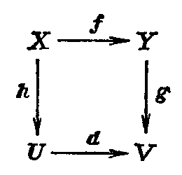
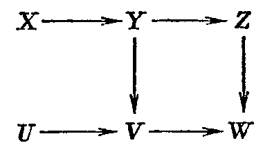
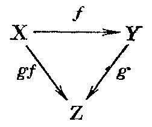
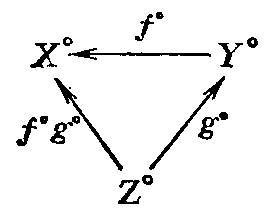
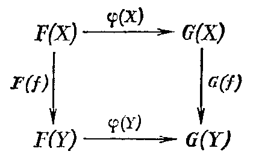
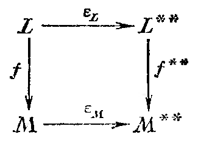

## 1.13. Язык категорий

---
**стр. 83**
---

## § 13. Язык категорий

**1. Определение категории.** Категория $\mathcal C$ состоит из следующих данных:

а) Класс (или множество) $\mathrm{Ob}\,\mathcal C$, элементы которого называются **объектами** категории.

б) Класс (или множество) $\mathrm{Mor}\,\mathcal C$, элементы которого называются **морфизмами** категории, или **стрелками**.

в) Для каждой упорядоченной пары объектов $X,Y\in\mathrm{Ob}\,\mathcal C$ задано множество $\mathrm{Hom}_{\mathcal C}(X,Y)\subset\mathrm{Mor}\,\mathcal C$, элементы которого называются **морфизмами из $X$ в $Y$** и обозначаются $X\to Y$ или $f\colon X\to Y$ или $X\xrightarrow{f}Y$.

г) Для каждой упорядоченной тройки объектов $X,Y,Z\in\mathrm{Ob}\,\mathcal C$ задано отображение

$$\mathrm{Hom}_{\mathcal C}(X,Y)\times\mathrm{Hom}_{\mathcal C}(Y,Z)\to\mathrm{Hom}_{\mathcal C}(X,Z),$$

сопоставляющее паре морфизмов $(f,g)$ морфизм $gf$, или $g\circ f$, называемый их **композицией**, или **произведением**.

Эти данные должны удовлетворять следующим условиям:

д) $\mathrm{Mor}\,\mathcal C$ есть несвязное объединение $\bigcup\mathrm{Hom}_{\mathcal C}(X,Y)$ по всем упорядоченным парам $X,Y\in\mathrm{Ob}\,\mathcal C$. Иными словами, для каждого морфизма $f$ однозначно определены объекты $X,Y$ такие, что $f\in\mathrm{Hom}\,\mathcal C\,(X,Y)$: *начало* $X$ и *конец* $Y$ стрелки $f$.

е) Композиция морфизмов ассоциативна.

ж) Для каждого объекта $X$ существует тождественный морфизм $\mathrm{id}_X\in\mathrm{Hom}_{\mathcal C}(X,X)$ такой, что $\mathrm{id}_X\circ f=f\circ\mathrm{id}_X=f$ всякий раз, когда эти композиции определены. Нетрудно видеть, что такой морфизм единствен: если $\mathrm{id}'_X$ — другой морфизм с тем же свойством, то $\mathrm{id}'_X=\mathrm{id}'_X\circ\mathrm{id}_X=\mathrm{id}_X$.

Морфизм $f\colon X\to Y$ называется **изоморфизмом**, если существует такой морфизм $g\colon Y\to X$, что $gf=\mathrm{id}_X$, $fg=\mathrm{id}_Y$.

**2. Примеры.** а) *Категория множеств* $\mathrm{Set}$. Ее объекты — множества, морфизмы — отображения множеств.

б) *Категория $\mathcal{L}in_{\mathcal K}$ линейных пространств над полем $\mathcal K$.* Ее объекты — линейные пространства, морфизмы — линейные отображения.

в) *Категория групп.*

г) *Категория абелевых групп.*

Различия между классом и множеством обсуждаются в аксиоматической теории множеств и связаны с необходимостью избежать знаменитого парадокса Рассела. Не всякое собирание объектов воедино образует множество, ибо понятие «множество всех множеств, не содержащих самих себя в качестве элемента», противоречиво. В аксиоматике Гёделя — Бернайса такие собрания множеств называются классами. Техника теорий категорий требует собираний объектов, лежащих в опасной близости к таким парадоксальным ситуациям. Мы, однако, будем пренебрегать этими тонкостями.

---
**стр. 84**
---

**3. Диаграммы.** Поскольку в аксиоматике категорий ничего не говорится о теоретико-множественной структуре объектов, мы не можем в общем случае работать с «элементами» этих объектов. Все основные общекатегорные конструкции и их приложения к конкретным категориям формулируются преимущественно в терминах морфизмов и их композиции. Удобный язык для таких формулировок — это язык диаграмм. Например, вместо того чтобы говорить, что у нас имеются четыре объекта $X$, $Y$, $U$, $V$, четыре морфизма $f\in\mathrm{Hom}_{\mathcal C}(X,Y)$, $g\in\mathrm{Hom}_{\mathcal C}(Y,V)$, $h\in\mathrm{Hom}_{\mathcal C}(X,U)$ и $d\in\mathrm{Hom}_{\mathcal C}(U,V)$, причем $gf=dh$, говорят, что задан **коммутативный квадрат**

«Коммутативность» здесь — это равенство $gf=dh$, которое означает, что «два пути вдоль стрелок» от $X$ к $V$ приводят к одному и тому же результату. Более общо, **диаграмма** — это ориентированный граф, вершины которого являются объектами $\mathcal C$, а ребра — морфизмами, например

Диаграмма называется **коммутативной**, если любые пути вдоль стрелок в ней с общим началом и концом отвечают одинаковым морфизмам.

В категории линейных пространств, а также в категории абелевых групп особенно важен класс диаграмм, называемых **комплексами**. *Комплекс* имеет вид последовательности объектов и стрелок

$$\ldots X\to Y\to U\to V\to\ldots,$$

конечной или бесконечной, которая удовлетворяет следующему условию: *композиция любых двух соседних стрелок является нулевым морфизмом.* Заметим, что понятие нулевого морфизма не является общекатегорным: оно специфично для линейных пространств и абелевых групп и для специального класса категорий — так называемых аддитивных категорий. Часто объекты, входящие в комплекс, и морфизмы нумеруются некоторым отрезком целых чисел:

$$\ldots\to X_{-1}\xrightarrow{f_{-1}}X_0\xrightarrow{f_0}X_1\xrightarrow{f_1}X_2\xrightarrow{f_2}\ldots$$

---
**стр. 85**
---

Такой комплекс линейных пространств (или абелевых групп) называется *точным в члене* $X_i$, если $\operatorname{Im} f_{i-1} = \operatorname{Ker} f_i$ (заметим, что в определении комплекса условие $f_i\circ f_{i-1}=0$ означает только, что $\operatorname{Im} f_{i-1}\subset\operatorname{Ker} f_i$). Комплекс, точный во всех членах, называется *точным*, или *ацикличным*, или *точной последовательностью*.

Вот три простейших примера:

а) Последовательность $0\to L\xrightarrow{i}M$ всегда является комплексом; она точна в члене $L$ тогда и только тогда, когда $\operatorname{Ker} i$ — образ нулевого пространства $0$. Иными словами, точность здесь означает, что $i$ — инъекция.

б) Последовательность $M\xrightarrow{j}N\to0$ всегда является комплексом; точность его в члене $N$ означает, что $\operatorname{Im} j=N$, т. е. что $j$ — сюръекция.

в) Комплекс $0\to L\xrightarrow{i}M\xrightarrow{j}N\to0$ точен, если $i$ — инъекция, $j$ — сюръекция и $\operatorname{Im} i=\operatorname{Ker} j$. Отождествив $L$ с образом $i$ — подпространством в $M$, мы можем поэтому отождествить $N$ с факторпространством $M/L$, так что такие *точные тройки* являются категорными представителями троек $(L\subset M,\,M/L)$.

4. **Естественные конструкции и функторы.** В математике весьма важны конструкции, которые можно применять к объектам некоторой категории так, что при этом снова получаются объекты категории (другой или той же самой). Если эти конструкции являются однозначными (не зависят от произвольных выборов) и универсально применимыми, то часто оказывается, что они переносятся и на морфизмы. Аксиоматизация ряда примеров привела к важному понятию функтора, впрочем, естественному и с чисто категорной точки зрения.

5. **Определение функтора.** Пусть $C$, $D$ — две категории. *Функтором* $F$ из категории $C$ в категорию $D$ называется задание двух отображений (обычно обозначаемых также $F$): $\operatorname{Ob}C\to\operatorname{Ob}D$, $\operatorname{Mor}C\to\operatorname{Mor}D$, которые удовлетворяют следующим условиям:

а) если $f\in\operatorname{Hom}_C(X,\,Y)$, то $F(f)\in\operatorname{Hom}_D(F(X),\,F(Y))$;

б) $F(gf)=F(g)F(f)$ всякий раз, когда композиция $gf$ определена, и $F(\operatorname{id}_X)=\operatorname{id}_{F(X)}$ для всех $X\in\operatorname{Ob}C$.

Функторы, которые мы определили, часто называют *ковариантными* функторами. Определяют также *контравариантные* функторы, «обращающие стрелки»: для них условия а) и б) заменяются условиями

а') если $f\in\operatorname{Hom}_C(X,\,Y)$, то $F(f)\in\operatorname{Hom}_D(F(Y),\,F(X))$;

б') $F(gf)=F(f)F(g)$ и $F(\operatorname{id}_X)=\operatorname{id}_{F(X)}$.

Можно избежать этого различения, если ввести конструкцию, ставящую в соответствие каждой категории $C$ *дуальную категорию* $C^\circ$ по правилу: $\operatorname{Ob}C=\operatorname{Ob}C^\circ$, $\operatorname{Mor}C=\operatorname{Mor}C^\circ$ и $\operatorname{Hom}_C(X,\,Y)=\operatorname{Hom}_{C^\circ}(Y,\,X)$, причем композиция $gf$ морфизмов в $C$ отвечает композиции $fg$ этих же морфизмов в $C^\circ$, взятых в обратном порядке. Удобно обозначать через $X^\circ$, $f^\circ$ объекты и морфизмы в $C^\circ$, отвечающие объектам и морфизмам $X$, $f$ в $C$. Тогда коммутативная

---
**стр. 86**
---

диаграмма в $C$

отвечает коммутативной диаграмме в $C^\circ$:

(Ковариантный) функтор $F\colon C\to D^\circ$ можно отождествить с контравариантным функтором $F\colon C\to D$ в смысле данного выше определения.

6. **Примеры.** а) Пусть $\mathcal{K}$ — поле, $\mathcal{L}in_{\mathcal{K}}$ — категория линейных пространств над $\mathcal{K}$, $\operatorname{Set}$ — категория множеств. В §1 мы объяснили, как любому множеству $S\in\operatorname{Ob}\operatorname{Set}$ поставить в соответствие линейное пространство $F(S)\in\operatorname{Ob}\mathcal{L}in_{\mathcal{K}}$ функций на $S$ со значениями в $\mathcal{K}$. Поскольку это естественная конструкция, следует ожидать, что она может быть продолжена до функтора. Так оно и есть. Функтор оказывается *контравариантным*: морфизму $f\colon S\to T$ он ставит в соответствие линейное отображение $F(f)\colon F(T)\to F(S)$, чаще обозначаемое $f^*$ и называемое *подъемом*, или *обратным образом*, на функциях:

$$f^*(\varphi)=\varphi\circ f,\quad\text{где}\quad f\colon S\to T,\quad \varphi\colon T\to\mathcal{K}.$$

Иными словами, $f^*(\varphi)$ — это функция на $S$, значения которой постоянны вдоль «слоев» $f^{-1}(t)$ отображения $f$ и равны $\varphi(t)$ на таком слое. Хорошее упражнение для читателя — проверить, что мы действительно построили функтор.

б) Отображение двойственности: $\mathcal{L}in_{\mathcal{K}}\to\mathcal{L}in_{\mathcal{K}}$, на объектах задаваемое формулой $L\mapsto L^*=\mathcal{L}(L,\,\mathcal{K})$, а на морфизмах — формулой $f\mapsto f^*$, является *контравариантным функтором* из категории $\mathcal{L}in_{\mathcal{K}}$ в себя. По существу, это доказано в §7.

в) Операции комплексификации и овеществления, изученные в §12, определяют функторы $\mathcal{L}in_{\mathbb{R}}\to\mathcal{L}in_{\mathbb{C}}$ и $\mathcal{L}in_{\mathbb{C}}\to\mathcal{L}in_{\mathbb{R}}$ соответственно. То же относится к более общим конструкциям подъема и спуска поля скаляров, кратко описанным в §12.

г) Для любой категории $C$ и любого объекта $X\in\operatorname{Ob}C$ определены два функтора из $C$ в категорию множеств: ковариантный $h_X\colon C\to\operatorname{Set}$ и контравариантный $h^X\colon C\to\operatorname{Set}^\circ$.

Вот их определения: $h_X(Y)=\operatorname{Hom}_C(X,\,Y)$, $h_Y(f\colon Y\to Z)$ есть отображение $h_X(Y)=\operatorname{Hom}_C(X,\,Y)\to h_X(Z)=\operatorname{Hom}_C(X,\,Z)$, которое ставит в соответствие морфизму $X\to Y$ его композицию с морфизмом $f\colon Y\to Z$. <!-- вероятная опечатка оригинала: скорее всего, должно быть $h_X(f)$, а не $h_Y(f)$ -->

---
**стр. 87**
---

Аналогично, $h^X(Y)=\operatorname{Hom}_C(Y,\,X)$ и $h^X(f\colon Y\to Z)$ есть отображение $h^X(Z)=\operatorname{Hom}_C(Z,\,X)\to h^X(Y)=\operatorname{Hom}_C(Y,\,X)$, которое ставит в соответствие морфизму $Z\to X$ его композицию с морфизмом $f\colon Y\to Z$.

Проверьте, что $h_X$ и $h^X$ действительно являются функторами. Их называют функторами, *представляющими* объект $X$ категории.

Заметим, что если $C=\mathcal{L}in_{\mathcal{K}}$, то $h^X$ и $h_X$ можно считать функторами со значениями также в $\mathcal{L}in_{\mathcal{K}}$, а не в $\operatorname{Set}$.

7. **Композиция функторов.** Если $C_1\xrightarrow{F}C_2\xrightarrow{G}C_3$ — три категории и два функтора между ними, то композиция $GF\colon C_1\to C_3$ определяется как теоретико-множественная композиция отображений на объектах и морфизмах. Тривиально проверяется, что она является функтором.

Можно ввести «категорию категорий», объектами которой являются категории, а морфизмами — функторы!

Более важной, однако, является следующая ступень этой высокой лестницы абстракций: *категория функторов*. Мы ограничимся объяснением, что такое морфизмы функторов.

8. **Естественные преобразования естественных конструкций, или функторные морфизмы.** Пусть $F$, $G\colon C\to D$ — два функтора с общим началом и концом. *Функторным морфизмом* $\varphi\colon F\to G$ называется класс морфизмов объектов $\varphi(X)\colon F(X)\to G(X)$ в категории $D$, по одному для каждого объекта $X$ категории $C$, обладающий тем свойством, что для каждого морфизма $f\colon X\to Y$ в категории $C$ квадрат

коммутативен. Функторный морфизм называется *изоморфизмом*, если все $\varphi(X)$ суть изоморфизмы.

9. **Пример.** Пусть $**\colon\mathcal{L}in_{\mathcal{K}}\to\mathcal{L}in_{\mathcal{K}}$ — функтор «двойного сопряжения»: $L\mapsto L^{**}$, $f\mapsto f^{**}$. В §7 мы построили для каждого линейного пространства $L$ каноническое линейное отображение $\varepsilon_L\colon L\mapsto L^{**}$. Оно определяет функторный морфизм $\varepsilon_M\colon\operatorname{Id}\to **$, где $\operatorname{Id}$ — тождественный функтор на $\mathcal{L}in_{\mathcal{K}}$, ставящий в соответствие каждому линейному пространству само это пространство и каждому линейному отображению — само это отображение. Действительно, согласно определению, мы должны проверить коммутативность всевозможных квадратов вида

Для конечномерных пространств $L$, $M$ это устанавливается с помощью утверждения д) теоремы п. 5 §7. Проверку в общем случае предоставляем читателю.
