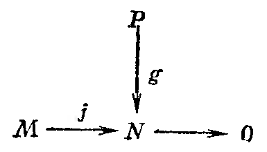
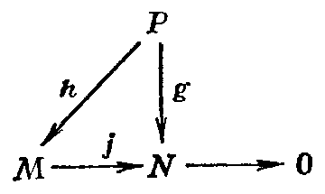
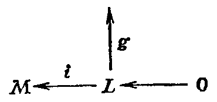
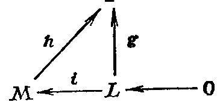
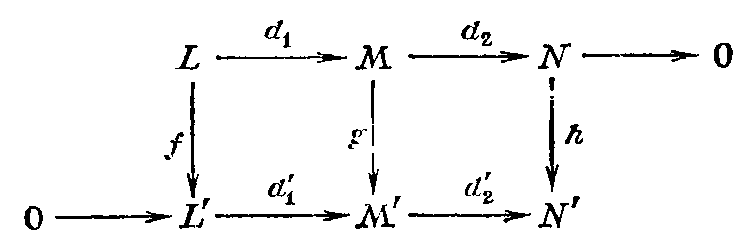
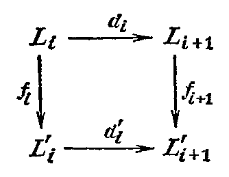

## 1.14. Категорные свойства линейных пространств

---
**стр. 88**
---

**УПРАЖНЕНИЯ**

1. Пусть $\operatorname{Set}_0$ — категория, объектами которой являются множества, а морфизмами — такие отображения множеств $f\colon S\to T$, что для любой точки $t\in T$ слой $f^{-1}(t)$ конечен. Показать, что следующие данные определяют *ковариантный* функтор $F_0\colon\operatorname{Set}_0\to\mathcal{L}in_{\mathcal{K}}$:

а) $F_0(S)=F(S)$: функции на $S$ со значениями в $\mathcal{K}$;

б) для любого морфизма $f\colon S\to T$ и функции $\varphi\colon S\to\mathcal{K}$ функция $F_0(f)(\varphi)=f_*(\varphi)\in F(T)$ определяется так:

$$f_*(\varphi)(t)=\sum_{s\in f^{-1}(t)}\varphi(s)$$

(«интегрирование по слоям»).

2. Доказать, что спуск поля скаляров с $K$ до $\mathcal{K}$ (см. §12) определяет функтор $\mathcal{L}in_{\mathcal{K}}\to\mathcal{L}in_{\mathcal{K}}$.

**§14. Категорные свойства линейных пространств**

1. В этом параграфе собраны некоторые утверждения о категории всех линейных пространств $\mathcal{L}in_{\mathcal{K}}$ или конечномерных линейных пространств $\mathcal{L}inf_{\mathcal{K}}$ над данным полем $\mathcal{K}$. По большей части они являются переформулировкой на категорном языке утверждений, которые мы уже доказали раньше. Их выбор обусловлен следующим своеобразным критерием: это как раз те свойства категории $\mathcal{L}in_{\mathcal{K}}$, которые *нарушаются* для таких наиболее близких категорий, как категория модулей над общими кольцами (например, над $\mathbb{Z}$, т. е. категория абелевых групп) или даже категория бесконечномерных топологических пространств. Детальное изучение этих нарушений для категории модулей составляет основной предмет *гомологической алгебры*, а в функциональном анализе часто приводит к поиску новых определений, которые позволяют восстановить «хорошие» свойства $\mathcal{L}inf_{\mathcal{K}}$ (таково понятие ядерных топологических пространств).

2. **Теорема о продолжении отображений.**

а) *Пусть $P$, $M$, $N$ — линейные пространства, $P$ конечномерно, $j\colon M\to N$ — сюръективное линейное отображение. Тогда любое линейное отображение $g\colon P\to N$ можно поднять до такого линейного отображения $h\colon P\to M$, что $g=jh$. Иными словами, диаграмму с точной строкой*

*можно вложить в коммутативную диаграмму*

---
**стр. 89**
---

б) *Пусть $P$, $L$, $M$ — линейные пространства, $M$ конечномерно, $i\colon L\to M$ — инъективное линейное отображение. Тогда любое линейное отображение $g\colon L\to P$ можно продолжить до линейного отображения $h\colon M\to P$ так, что $g=hi$. Иными словами, диаграмму с точной нижней строкой*

*можно вложить в коммутативную диаграмму*

**Доказательство.** а) Выберем базис $\{e_1,\dots,e_n\}$ в $P$, положим $e'_i=g(e_i)\in N$. В силу сюръективности $j$ существуют векторы $e''_i\in M$ такие, что $j(e''_i)=e'_i$, $i=1,\dots,n$. По предложению п. 3 §3, существует единственное линейное отображение $h\colon P\to M$ такое, что $h(e_i)=e''_i$, $i=1,\dots,n$. По конструкции $jh(e_i)=j(e''_i)=e'_i=g(e_i)$. Так как $\{e_i\}$ образуют базис $P$, имеем $jh=g$.

б) Выберем базис $\{e'_1,\dots,e'_m\}$ пространства $L$ и продолжим $e_k=i(e'_k)$, $1\le k\le m$, до базиса $\{e_1,\dots,e_m;\,e_{m+1},\dots,e_n\}$ пространства $M$. Положим $h(e_i)=g(e'_i)$ при $1\le i\le m$, $h(e_j)=0$ при $m+1\le j\le n$. Такое отображение существует по тому же предложению п. 3 §3. Можно также прямо применить предложение п. 6 §6. Теорема доказана.

В категории модулей объекты $P$, удовлетворяющие условию а) теоремы (при всех $M$, $N$). называются *проективными*, а объекты, удовлетворяющие условию б), — *инъективными*. <!-- вероятная опечатка оригинала: точка после $N$) и строчная «называются» --> Мы доказали, что в категории конечномерных линейных пространств все объекты проективны и инъективны.

3. **Теорема о точности функтора $\mathcal{L}$.** *Пусть $0\to L\xrightarrow{i}M\xrightarrow{j}N\to0$ — точная тройка конечномерных линейных пространств, $P$ — любое конечномерное пространство над тем же полем. Тогда $\mathcal{L}$ как функтор отдельно по первому и второму аргументу индуцирует точные тройки линейных пространств:*

а) $0\to\mathcal{L}(P,L)\xrightarrow{i_1}\mathcal{L}(P,M)\xrightarrow{j_1}\mathcal{L}(P,N)\to0$,

б) $0\leftarrow\mathcal{L}(L,P)\xleftarrow{i_2}\mathcal{L}(M,P)\xleftarrow{j_2}\mathcal{L}(N,P)\leftarrow0$.

---
**стр. 90**
---

**Доказательство.** а) Напомним (см. пример г) п. 6 §13), что $i_1$ ставит в соответствие морфизму $P\to L$ его композицию с $i\colon L\to M$, а $j_1$ ставит в соответствие морфизму $P\to M$ его композицию с $j\colon M\to N$. Отображение $i_1$ инъективно, потому что $i$ — инъекция, так что если композиция $P\to L\to M$ нулевая, то $P\to L$ — нулевой морфизм. Отображение $j_1$ сюръективно в силу утверждения а) теоремы п. 2: любой морфизм $g\colon P\to N$ можно поднять до морфизма $P\to M$, композиция которого с $j$ дает исходный морфизм. Композиция $j_1i_1$ нулевая: она переводит стрелку $P\to L$ в стрелку $P\to N$, которая является композицией $P\to L\xrightarrow{i}M\xrightarrow{j}N$, но $ji=0$.

Мы проверили, таким образом, что последовательность а) является комплексом, и остается установить ее точность в среднем члене, т. е. $\operatorname{Ker}j_1=\operatorname{Im}i_1$. Мы уже знаем, что $\operatorname{Ker}j_1\supset\operatorname{Im}i_1$. Для доказательства обратного включения заметим, что если стрелка $P\to M$ лежит в ядре $j_1$, то композиция этой стрелки с $j\colon M\to N$ равна нулю, а потому образ $P$ в $M$ лежит в ядре $j$. Но ядро $j$ совпадает с образом $i(L)\subset M$ в силу точности исходной тройки. Значит, $P$ отображается в подпространство $i(L)$, и потому стрелку $P\to M$ можно поднять до стрелки $P\to L$, композиция которой с $i$ даст исходную стрелку. Это и означает, что последняя лежит в образе $i_1$.

б) Здесь рассуждения совершенно аналогичны, или, точнее, двойственны. Отображение $i_2$ сюръективно в силу утверждения б) теоремы п. 2. Отображение $j_2$ инъективно, потому что если композиция $M\xrightarrow{j}N\to P$ равна нулю, то и стрелка $N\to P$ нулевая, так как $j$ сюръективно. Композиция $i_2j_2$ равна нулю, ибо композиция $L\to M\xrightarrow{j}N\to P$ нулевая для любой последней стрелки. Поэтому остается доказать, что $\operatorname{Ker}i_2\subset\operatorname{Im}j_2$ (обратное включение только что проверено). Но стрелка $M\xrightarrow{f}P$ лежит в ядре $i_2$, если композиция $L\xrightarrow{i}M\xrightarrow{f}P$ нулевая. Значит, $L=\operatorname{Ker}j$ лежит в ядре $f$. <!-- вероятная опечатка оригинала: $L=\operatorname{Ker}j$ строго говоря неверно, $\operatorname{Im}i=\operatorname{Ker}j$ --> Определим отображение $\bar{f}\colon N\to P$ формулой $\bar{f}(n)=f(j^{-1}(n))$, где $j^{-1}(n)\in M$ — любой прообраз $n$. От выбора этого прообраза ничего не зависит, ибо $\operatorname{Ker}j\subset\operatorname{Ker}f$. Легко проверить, что $\bar{f}$ линейно и что $j_2(\bar{f})=f$; в самом деле, $i_2(\bar{f})$ есть композиция $M\xrightarrow{j}N\xrightarrow{\bar{f}}P$, которая переводит $m\in M$ в $\bar{f}j(m)=f(j^{-1}(j(m)))=f(m)$. <!-- вероятная опечатка оригинала: скорее всего, должно быть $j_2(\bar{f})$, а не $i_2(\bar{f})$ --> Теорема доказана.

4. **Категорная характеризация размерности.** Пусть $G$ — некоторая абелева группа, записываемая аддитивно, $\chi\colon\operatorname{Ob}\,\mathcal{L}inf_{\mathcal{K}}\to G$ —

---
**стр. 91**
---

произвольная функция, определённая на конечномерных линейных пространствах и удовлетворяющая двум условиям:

а) если $L$ и $M$ изоморфны, то $\chi(L)=\chi(M)$;

б) для любой точной тройки пространств $0\to L\to M\to N\to 0$ имеем $\chi(M)=\chi(L)+\chi(N)$ (такие функции называются аддитивными).

Имеет место

**5. Теорема.** *Для любой аддитивной функции $\chi$ имеем*

$$\chi(L)=\dim_{\mathscr{K}} L\cdot\chi(\mathscr{K}^1),$$

*где $L$ — произвольное конечномерное пространство.*

Доказательство. Проведём индукцию по размерности $L$. Если $L$ одномерно, то $L$ изоморфно $\mathscr{K}^1$, так что $\chi(L)=\chi(\mathscr{K}^1)=\dim_{\mathscr{K}} L\cdot\chi(\mathscr{K}^1)$. Пусть теорема доказана для всех $L$ размерности $n$. Если размерность $L$ равна $n+1$, выберем одномерное подпространство $L_0\subset L$ и рассмотрим точную тройку

$$0\to L_0\stackrel{i}{\longrightarrow} L\stackrel{j}{\longrightarrow} L/L_0\to0,$$

где $i$ — вложение $L_0$, а $j(l)=l+L_0\in L/L_0$. В силу аддитивности $\chi$ и индуктивного предположения

$$\chi(L)=\chi(L_0)+\chi(L/L_0)=\chi(\mathscr{K}^1)+\dim_{\mathscr{K}}(L/L_0)\chi(\mathscr{K}^1)=$$
$$=\chi(\mathscr{K}^1)+n\chi(\mathscr{K}^1)=(n+1)\chi(\mathscr{K}^1)=\dim_{\mathscr{K}} L\cdot\chi(\mathscr{K}^1).$$

Теорема доказана.

Этот результат является самым началом большой алгебраической теории, которая сейчас активно развивается, — так называемой $K$-теории, лежащей на стыке топологии и алгебры.

УПРАЖНЕНИЯ

1. Пусть $K$: $0\stackrel{d_0}{\longrightarrow}L_1\stackrel{d_1}{\longrightarrow}L_2\stackrel{d_2}{\longrightarrow}\ldots\stackrel{d_{n-1}}{\longrightarrow}L_n\stackrel{d_n}{\longrightarrow}0$ — комплекс конечномерных линейных пространств. Факторпространство $H^i(K)=\operatorname{Ker}d_i/\operatorname{Im}d_{i-1}$ называется $i$-м пространством когомологий этого комплекса. Число $\chi(K)=\sum\limits_{i=1}^{n}(-1)^i\dim L_i$ называется эйлеровой характеристикой комплекса. Доказать, что

$$\chi(K)=\sum_{i=1}^{n}(-1)^i\dim H^i(K).$$

2. «Лемма о змее». Пусть дана коммутативная диаграмма линейных пространств

---
**стр. 92**
---

с точными строками. Показать, что существует точная последовательность пространств

$$\operatorname{Ker}f\to\operatorname{Ker}g\to\operatorname{Ker}h\stackrel{\delta}{\longrightarrow}\operatorname{Coker}f\to\operatorname{Coker}g\to\operatorname{Coker}h,$$

в которой все стрелки, кроме $\delta$, индуцированы $d_1$, $d_2$, $d_1'$, $d_2'$ соответственно, а связывающий гомоморфизм $\delta$ (называемый также кограничным оператором) определяется так: чтобы определить $\delta(n)$ для $n\in\operatorname{Ker}h$, следует найти $m\in M$ с $n=d_2(m)$, построить $g(m)\in M'$, найти $l'\in L'$ с $d_1'(l')=g(m)$ и положить $\delta(n)=l'+\operatorname{Im}f\in\operatorname{Coker}f$. В частности, следует проверить существование $\delta(n)$ и его независимость от произвола в промежуточных выборах.

3. Пусть $K$: $\ldots\to L_i\stackrel{d_i}{\longrightarrow}L_{i+1}\to\ldots$ и $K'$: $\ldots\to L_i'\stackrel{d_i'}{\longrightarrow}L_{i+1}'\to\ldots$ — два комплекса. Морфизмом $f$: $K\to K'$ называется такой набор линейных отображений $f_i$: $L_i\to L_i'$, что все квадраты

коммутативны. Показать, что комплексы и их морфизмы образуют категорию.

4. Показать, что отображение $K\to H^i(K)$ продолжается до функтора из категорий комплексов в категорию линейных пространств.

5. Пусть $0\to K\stackrel{f}{\longrightarrow}K'\stackrel{g}{\longrightarrow}K''\to0$ — точная тройка комплексов и их морфизмов. По определению, это означает, что для каждого $i$ тройки линейных пространств

$$0\to L_i\stackrel{f_i}{\longrightarrow}L_i'\stackrel{g_i}{\longrightarrow}L_i''\to0$$

точны. Пусть $H^i$ — соответствующие пространства когомологий. Пользуясь леммой о змее, построить последовательность пространств когомологий

$$\ldots\to H^i(K)\to H^i(K')\to H^i(K'')\stackrel{\delta}{\longrightarrow}H^{i+1}(K)\to\ldots$$

и показать, что она является точной.
