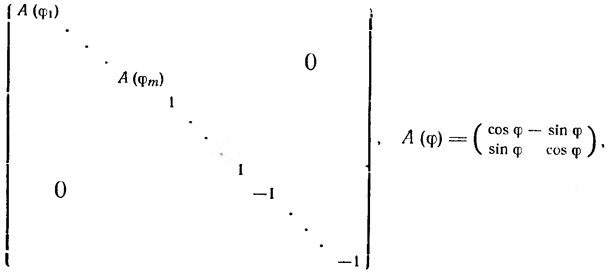

## 2.7. Ортогональные и унитарные операторы

---
**стр. 133**
---

**11. Приложение к пространствам функций.** Как в § 5 и 4, мы можем вывести неравенства для комплекснозначных функций:

$$
\left|\int_a^b f(x)\bar g(x)\,dx\right|^2 \le \int_a^b |f(x)|^2\,dx \int_a^b |g(x)|^2\,dx,
$$

$$
\left(\int_a^b |f(x)+g(x)|^2\,dx\right)^{1/2} \le \left(\int_a^b |f(x)|^2\,dx\right)^{1/2} + \left(\int_a^b |g(x)|^2\,dx\right)^{1/2}.
$$

а также для их коэффициентов Фурье. Рассматривая функции на отрезке $[0, 2\pi]$ и полагая

$$
a_n = \frac{1}{\sqrt{2\pi}} \int_0^{2\pi} f(x)\,e^{-inx}\,dx,
$$

получаем, что в пространстве со скалярным произведением $\int_0^{2\pi} f(x)\bar g(x)\,dx$ сумма

$$
f_N(x) = \frac{1}{\sqrt{2\pi}} \sum_{n=-N}^{N} a_n e^{inx}
$$

является ортогональной проекцией $f$ на пространство многочленов Фурье «степени $\le N$» и минимизирует среднеквадратичное отклонение $f$ от этого пространства. В частности,

$$
\sum_{n=-N}^{N} |a_n|^2 \le \int_0^{2\pi} |f(x)|^2\,dx,
$$

так что ряд $\sum_{n=-\infty}^{\infty} |a_n|^2$ сходится.

**§ 7. Ортогональные и унитарные операторы**

**1.** Пусть $L$ — линейное пространство со скалярным произведением $g$. Множество всех изометрий $f\colon L \to L$, т. е. обратимых линейных операторов с условием

$$
g\bigl(f(l_1),\,f(l_2)\bigr) = g(l_1,\,l_2)
$$

для всех $l_1,\,l_2 \in L$, очевидно, образует группу. Если $L$ — евклидово пространство, такие операторы называются *ортогональными*, а если $L$ унитарно, то *унитарными*. Симплектические изометрии будут рассмотрены позже.

**2. Предложение.** *Пусть $L$ — конечномерное линейное пространство с невырожденным скалярным произведением $(\ ,\ )$, симметричным или эрмитовым. Для того чтобы оператор $f\colon L \to L$ был*

---
**стр. 134**
---

изометрией, необходимо и достаточно, чтобы выполнялось любое из следующих условий:

а) $(f(l),\,f(l)) = (l,\,l)$ для всех $l \in L$ (здесь предполагается, что характеристика поля скаляров отлична от двух);

б) пусть $\{e_1,\,\dots,\,e_n\}$ — базис в $L$ с матрицей Грама $G$, $A$ — матрица оператора $f$ в этом базисе. Тогда

$$
A^t G A = G, \quad \text{или} \quad A^t G \bar A = G;
$$

в) $f$ переводит некоторый ортонормированный базис в ортонормированный базис;

г) если сигнатура скалярного произведения равна $(p,\,q)$, то матрица оператора $f$ в любом ортонормированном базисе $\{e_1,\,\dots,\,e_p,\,e_{p+1},\,\dots,\,e_{p+q}\}$ с $(e_i,\,e_i) = +1$ при $i \le p$ и $(e_i,\,e_i) = -1$ при $p+1 \le i \le p+q$ удовлетворяет условию

$$
A^t \begin{pmatrix} E_p & 0 \\ 0 & -E_q \end{pmatrix} A = \begin{pmatrix} E_p & 0 \\ 0 & -E_q \end{pmatrix}
$$

или

$$
A^t \begin{pmatrix} E_p & 0 \\ 0 & -E_q \end{pmatrix} \bar A = \begin{pmatrix} E_p & 0 \\ 0 & -E_q \end{pmatrix}
$$

в симметричном и эрмитовом случае соответственно.

**Доказательство.** а) В симметричном случае это утверждение следует из п. 9 § 3: если $f$ сохраняет квадратичную форму $(l,l) = q(l)$, то $f$ сохраняет и её поляризацию

$$
(l,\,m) = \frac{1}{2}\bigl[q(l+m) - q(l) - q(m)\bigr].
$$

В эрмитовом случае имеем аналогично

$$
\operatorname{Re}(l,\,m) = \frac{1}{2}\bigl[q(l+m) - q(l) - q(m)\bigr]
$$

и предложение п. 2 § 6 показывает, что $(l,m)$ однозначно восстанавливается по $\operatorname{Re}(l,m)$ по формуле

$$
(l,\,m) = \operatorname{Re}(l,\,m) - i\,\operatorname{Re}(il,\,m)
$$

и потому $f$ сохраняет $(l,m)$.

б) Если $f$ — изометрия, то матрицы Грама базисов $\{e_1,\,\dots,\,e_n\}$ и $\{f(e_1),\,\dots,\,f(e_n)\}$ совпадают. Но последняя матрица Грама равна $A^t G A$ в симметричном и $A^t G \bar A$ в эрмитовом случае. Наоборот, если $f$ переводит базис $\{e_1,\,\dots,\,e_n\}$ в $\{e'_1,\,\dots,\,e'_n\}$ и матрицы Грама базисов $\{e_i\}$ и $\{e'_i\}$ совпадают, то $f$ — изометрия в силу формул координатной записи скалярного произведения из п. 2 § 2.

в), г). Эти утверждения являются частными случаями предыдущих.

Из предложения п. 2 следует, что ортогональные (соответственно унитарные) операторы — это операторы, которые в одном (и потому в любом) ортонормированном базисе задаются ортого-

---
**стр. 135**
---

нальными (соответственно *унитарными*) матрицами, т. е. матрицами $U$, которые удовлетворяют соотношениям

$$
UU^t = E_n \quad \text{или} \quad U\bar U^t = E_n.
$$

Множества таких матриц размера $n \times n$ были введены впервые в § 4 ч. 1; они обозначались $\mathrm{O}(n)$ и $\mathrm{U}(n)$ соответственно. Аналогично, матрицы изометрий в ортонормированных базисах сигнатур $(p,\,q)$, удовлетворяющие условиям г) предложения 2, обозначаются $\mathrm{O}(p,q)$ и $\mathrm{U}(p,q)$; при $p,\,q \neq 0$ они называются иногда *псевдоортогональными* и *псевдоунитарными* соответственно. В этом параграфе мы будем заниматься только группами $\mathrm{O}(n)$ и $\mathrm{U}(n)$. Фундаментальная для физики *группа Лоренца* $\mathrm{O}(1,3)$ будет изучена в § 10.

**3. Группы $\mathrm{U}(1)$, $\mathrm{O}(1)$ и $\mathrm{O}(2)$.** Из определения немедленно следует, что

$$
\mathrm{U}(1) = \{\,a \in \mathbf{C} \mid |a| = 1\,\} = \{\,e^{i\varphi} \mid \varphi \in \mathbf{R}\,\},
$$

$$
\mathrm{O}(1) = \{\pm 1\} = \mathrm{U}(1) \cap \mathbf{R}.
$$

Далее, если $U \in \mathrm{O}(n)$, то $UU^t = E_n$, откуда $(\det U)^2 = 1$ и $\det U = \pm 1$. Если $U = \begin{pmatrix} a & b \\ c & d \end{pmatrix}$ — ортогональная матрица с определителем $-1$, то $\begin{pmatrix} a & b \\ -c & -d \end{pmatrix}$ — ортогональная матрица с определителем $1$, принадлежащая $\mathrm{SO}(2)$. Матрицы из $\mathrm{SO}(2)$ имеют вид

$$
\left\{\begin{pmatrix} a & b \\ c & d \end{pmatrix} \;\middle|\; ad - bc = a^2 + b^2 = c^2 + d^2 = 1,\; ac + bd = 0\right\}.
$$

Очевидно, любую такую матрицу можно представить в виде

$$
\begin{pmatrix} \cos\varphi & -\sin\varphi \\ \sin\varphi & \cos\varphi \end{pmatrix},\quad \varphi \in [0,\,2\pi),
$$

т. е. она задаёт евклидов поворот на угол $\varphi$. Отображение

$$
\mathrm{U}(1) \to \mathrm{SO}(2)\colon e^{i\varphi} \mapsto \begin{pmatrix} \cos\varphi & -\sin\varphi \\ \sin\varphi & \cos\varphi \end{pmatrix}
$$

является изоморфизмом. Его геометрический смысл объясняется следующим замечанием: овеществление одномерного унитарного пространства $(\mathbf{C}^1,\,|z|^2)$ есть двумерное евклидово пространство $(\mathbf{R}^2,\,x_1^2 + x_2^2)$, а овеществление унитарного преобразования $z \mapsto e^{i\varphi}z$ задаётся матрицей поворота на угол $\varphi$.

В § 9 мы построим значительно менее тривиальный эпиморфизм $\mathrm{SU}(2) \to \mathrm{SO}(3)$ с ядром $\{\pm 1\}$.

Повороты $\begin{pmatrix} \cos\varphi & -\sin\varphi \\ \sin\varphi & \cos\varphi \end{pmatrix}$ на угол $\varphi \neq 0,\,\pi$ не имеют собственных векторов в $\mathbf{R}^2$ и потому не диагонализируемы. Наоборот, все матрицы $U \in \mathrm{O}(2)$ с $\det U = -1$ диагонализируемы. Точнее говоря, характеристический многочлен матрицы

$$
\begin{pmatrix} \cos\varphi & -\sin\varphi \\ -\sin\varphi & -\cos\varphi \end{pmatrix}
$$

---
**стр. 136**
---

равен $t^2-1$ и имеет корни $\pm 1$. Легко проверить непосредственно, что соответствующие этим корням собственные подпространства ортогональны; ниже это будет доказано в гораздо большей общности. Поэтому любой оператор из $O(2)$ с $\det U = -1$ является *отражением* относительно некоторой прямой: он действует тождественно на этой прямой и меняет знак векторов, ортогональных к ней.

Пользуясь этой информацией, мы можем теперь установить структуру общих ортогональных и унитарных операторов.

**4. Теорема.** а) *Для того чтобы оператор $f$ в унитарном пространстве был унитарным, необходимо и достаточно, чтобы он диагонализировался в ортонормированном базисе и имел спектр, расположенный на единичной окружности в $\mathbb{C}$.*

б) *Для того чтобы оператор $f$ в евклидовом пространстве был ортогональным, необходимо и достаточно, чтобы его матрица в подходящем ортонормированном базисе имела вид*

*где на пустых местах стоят нули.*

в) *Собственные векторы ортогонального или унитарного оператора, отвечающие разным собственным значениям, ортогональны.*

**Доказательство.** а) Достаточность утверждения очевидна: если $U = \operatorname{diag}(\lambda_1, \ldots, \lambda_n)$, $|\lambda_i|^2 = 1$, то $U\bar{U}^t = E_n$, так что $U$ — матрица унитарного оператора. Наоборот, пусть $f$ — унитарный оператор, $\lambda$ — его собственное значение, $L_\lambda$ — соответствующее собственное подпространство. По предложению п. 2 § 3 имеем $L = L_\lambda \oplus L_\lambda^\perp$. Подпространство $L_\lambda$ одномерно, $f$-инвариантно, и ограничение $f$ на $L_\lambda$ является одномерным унитарным оператором, поэтому $\lambda \in U(1)$, т. е. $|\lambda|^2 = 1$. Если мы покажем, что подпространство $L_\lambda^\perp$ также $f$-инвариантно, то индукцией по $\dim L$ отсюда можно будет вывести, что $L$ разлагается в прямую сумму $f$-инвариантных попарно ортогональных одномерных подпро-
