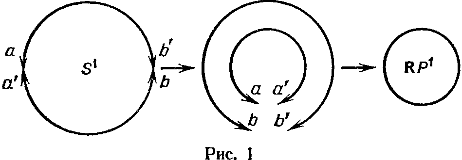
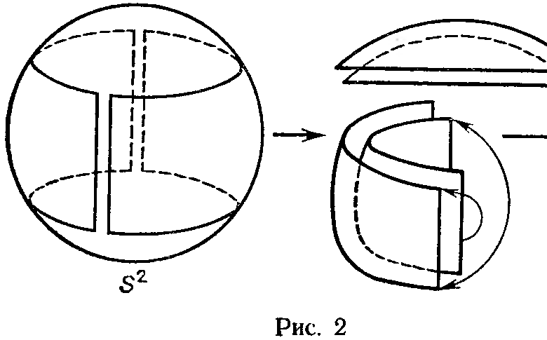
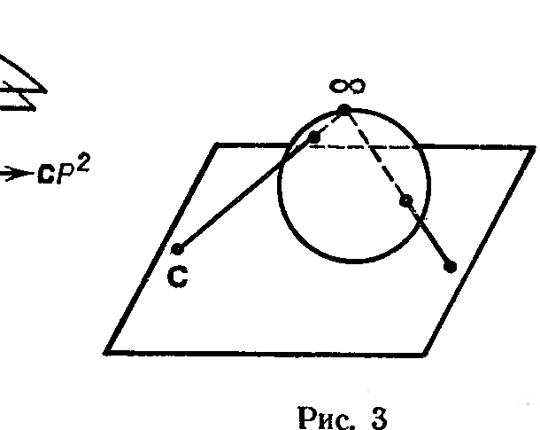

## 3.6. Проективные пространства

---
**стр. 220**
---

на открытом множестве, совпадают. Действительно, их разность обращается в нуль в окрестности начала координат и потому множество её корней не может быть собственным линейным подпространством. Это завершает доказательство.

## § 6. Проективные пространства

**1.** Аффинные пространства получаются из линейных «забвением начала координат». Проективные пространства можно строить из линейных по меньшей мере двумя способами.

a) Добавить к аффинному пространству «бесконечно удалённые точки».

б) Реализовать проективное пространство как множество прямых в линейном пространстве.

Мы выберем в качестве основного определения б): оно яснее показывает однородность проективного пространства.

**2. Определение.** *Пусть $L$ — линейное пространство над полем $\mathcal{K}$. Множество $P(L)$ прямых (т. е. одномерных линейных подпространств) в $L$ называется проективным пространством, ассоциированным с $L$, а сами прямые в $L$ называются точками $P(L)$.*

Число $\dim L - 1$ называется размерностью $P(L)$ и обозначается $\dim P(L)$. Одномерные и двумерные проективные пространства называются соответственно проективной прямой или проективной плоскостью. Проективное пространство размерности $n$ над полем $\mathcal{K}$ обозначается также $\mathcal{K}P^n$ или $P^n(\mathcal{K})$, или просто $P^n$. Смысл соглашения $\dim P(L) = \dim L - 1$ станет сейчас ясен.

**3. Однородные координаты.** Выберем базис $\{e_0, \ldots, e_n\}$ в пространстве $L$. Каждая точка $p \in P(L)$ однозначно определяется любым ненулевым вектором на соответствующей прямой в $L$. Координаты $x_0, \ldots, x_n$ этого вектора называются *однородными координатами* точки $p$. Они определены с точностью до умножения на ненулевой скаляр: точка $(\lambda x_0, \ldots, \lambda x_n)$ лежит на той же прямой $p$ и все точки прямой получаются таким образом. Поэтому вектор однородных координат точки $p$ по традиции обозначается $(x_0 : x_1 : \ldots : x_n)$.

Таким образом, *координатное $n$-мерное проективное пространство* $P(\mathcal{K}^{n+1})$ есть множество орбит мультипликативной группы $\mathcal{K}^* = \mathcal{K} \setminus \{0\}$, действующей на множестве ненулевых векторов $\mathcal{K}^{n+1} \setminus \{0\}$ по правилу $\lambda(x_0, \ldots, x_n) = (\lambda x_0, \ldots, \lambda x_n)$; $(x_0 : x_1 : \ldots : x_n)$ есть символ соответствующей орбиты.

Пользуясь однородными координатами, можно хорошо представить себе структуру $P^n$ как множества несколькими разными способами.

a) *Аффинное покрытие $P^n$.* Положим

$$U_i = \{(x_0 : \ldots : x_n) \mid x_i \neq 0\}, \qquad i = 0, \ldots, n.$$

Очевидно, $P^n = \bigcup\limits_{i=0}^{n} U_i$. В классе векторов проективных координат любой точки $p \in U_i$ имеется единственный вектор с $i$-й координа-

---
**стр. 221**
---

той, равной $1$: $(x_0 : \ldots : x_i : \ldots : x_n) = (x_0/x_i : \ldots : 1 : \ldots : x_n/x_i)$. Опуская эту единицу, получаем, что $U_i$ биективно множеству $\mathcal{K}^n$, которое мы можем интерпретировать как $n$-мерное линейное или аффинное координатное пространство. Заметим, однако, что пока у нас нет никаких оснований считать, что на $U_i$ имеется какая-то естественная не зависящая от выбора координат линейная или аффинная структура. Позже мы покажем, что инвариантно можно ввести на $U_i$ лишь целый класс аффинных структур, связанных, впрочем, каноническими изоморфизмами, так что геометрия аффинных конфигураций в любой из них будет одна и та же.

Назовём множество $U_i \cong \mathcal{K}^n$ *$i$-й аффинной картой* $P^n$ (в данной системе координат). Точки $(y_1^{(i)}, \ldots, y_n^{(i)}) \in U_i$ и $(y_1^{(j)}, \ldots, y_n^{(j)}) \in U_j$ при $i \neq j$ отвечают одной и той же точке $P^n$, лежащей на пересечении $U_i \cap U_j$, тогда и только тогда, когда, вставив $1$ на $i$-е место в векторе $(y_1^{(i)}, \ldots, y_n^{(i)})$ и на $j$-е место в $(y_1^{(j)}, \ldots, y_n^{(j)})$, мы получим пропорциональные векторы.

В частности, $P^1 = U_0 \cup U_1$, $U_0 \cong U_1 \cong \mathcal{K}$; точка $y \in U_0$ отвечает точке $1/y \in U_1$ при $y \neq 0$; точка $y = 0$ из $U_0$ не лежит в $U_1$, а точка $1/y = 0$ из $U_1$ не лежит в $U_0$. Естественно считать, что $P^1$ получается из $U_0 \cong \mathcal{K}$ добавлением одной точки с координатой $y = \infty$. Обобщая эту конструкцию, получаем

б) *Клеточное разбиение $P^n$.* Положим

$$V_i = \{(x_0 : \ldots : x_n) \mid x_j = 0 \text{ при } j < i,\; x_i \neq 0\}.$$

Очевидно, $V_0 = U_0$ и $P^n = \bigcup\limits_{i=0}^{n} V_i$, но на этот раз все $V_i$ попарно не пересекаются. В классе проективных координат любой точки $p \in V_i$ имеется единственный представитель с единицей на $i$-м месте; опуская эту единицу и предшествующие нули, мы получаем биекцию $V_i$ с $\mathcal{K}^{n-i}$. Окончательно

$$P^n \cong \mathcal{K}^n \cup \mathcal{K}^{n-1} \cup \mathcal{K}^{n-2} \cup \ldots \cup \mathcal{K}^0 \cong \mathcal{K}^n \cup P^{n-1}.$$

Иными словами, $P^n$ получается добавлением к $U_0 \cong \mathcal{K}^n$ бесконечно удалённого $(n-1)$-мерного проективного пространства, состоящего из точек $(0 : x_1 : \ldots : x_n)$; в свою очередь, оно получается из аффинного подпространства $V_1$ добавлением бесконечно удалённого (относительно $V_1$) проективного пространства $P^{n-2}$ и т. д.

в) *Проективные пространства и сферы.* В случае $\mathcal{K} = \mathbf{R}$ или $\mathbf{C}$ есть удобный способ нормировки однородных координат в $P^n$, не требующий выбора ненулевой координаты и деления на неё. Именно, любую точку $P^n$ можно представить координатами $(x_0 : \ldots : x_n)$ с условием $\sum\limits_{i=0}^{n} |x_i|^2 = 1$, т. е. точкой на $n$-мерной (при $\mathcal{K} = \mathbf{R}$) или $(2n+1)$-мерной (при $\mathcal{K} = \mathbf{C}$) евклидовой сфере. Степень оставшейся неоднозначности такова: точка $(\lambda x_0 : \ldots : \lambda x_n)$ по-прежнему лежит на единичной сфере тогда и только тогда, когда $|\lambda| = 1$, т. е. $\lambda = \pm 1$ при $\mathcal{K} = \mathbf{R}$, $\lambda = e^{i\varphi}$, $0 \leqslant \varphi < 2\pi$ при $\mathcal{K} = \mathbf{C}$.

---
**стр. 222**
---

Иными словами, $n$-мерное вещественное проективное пространство $\mathbf{R}P^n$ получается из $n$-мерной сферы $S^n$ отождествлением пар её диаметрально противоположных точек. В частности, $\mathbf{R}P^1$ устроена как окружность, а $\mathbf{R}P^2$ — как лист Мёбиуса, к которому по его границе приклеен круг (рис. 1, 2).

Сложнее «увидеть» $\mathbf{C}P^n$: в одну точку $\mathbf{C}P^n$ склеивается целый большой круг сферы $S^{2n+1}$, состоящий из точек $(x_0 e^{i\varphi}, \ldots, x_n e^{i\varphi})$ с переменным $\varphi$. Из описания $\mathbf{C}P^1$ в случае б) в качестве $\mathbf{C} \cup \{\infty\}$ ясно, что $\mathbf{C}P^1$ можно представлять себе как двумерную сферу Римана, в которой $\infty$ представлена северным полюсом, как при стереографической проекции (рис. 3).

Поэтому наше новое представление $\mathbf{C}P^1$ в виде факторпространства $S^3$ даёт замечательное отображение $S^3 \to S^2$, слои которого являются окружностями $S^1$. Оно называется *отображением Хопфа*.

В описании этого пункта мы совсем забыли о линейной структуре, исходной для $\mathbf{R}P^n$ и $\mathbf{C}P^n$, зато нам стали ясно видны топологические свойства этих пространств, в первую очередь их компактность. (Строго говоря, в определении $P^n$ никакая топология не фигурировала; удобнее всего вводить её именно с помощью отображений сфер, условившись, что открытые множества в $\mathbf{R}P^n$ и $\mathbf{C}P^n$ это те, прообразы которых в $S^n$ и $S^{2n+1}$ открыты.) Впредь мы не будем пользоваться топологией и вернёмся к изучению линейной геометрии проективных пространств. Не будет, однако, преувеличением сказать, что важность $\mathbf{R}P^n$ и $\mathbf{C}P^n$ в значительной мере объясняется тем, что это естественные компактификации $\mathbf{R}^n$ и $\mathbf{C}^n$, позволяющие распространить основные черты линейной структуры на бесконечность. Даже над абстрактным полем $\mathcal{K}$, не несущим никакой топологии, эта «компактность»
