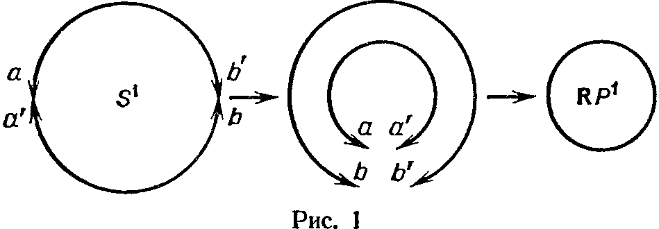
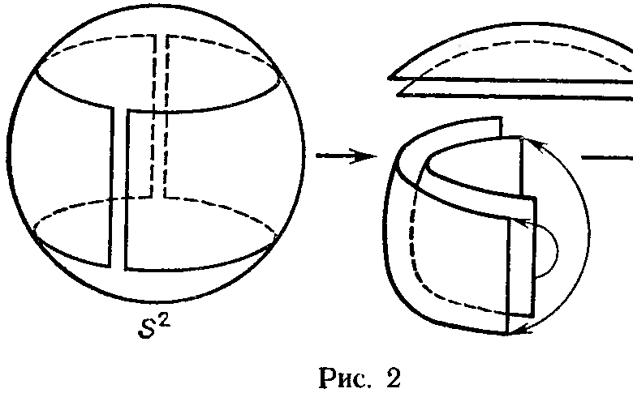
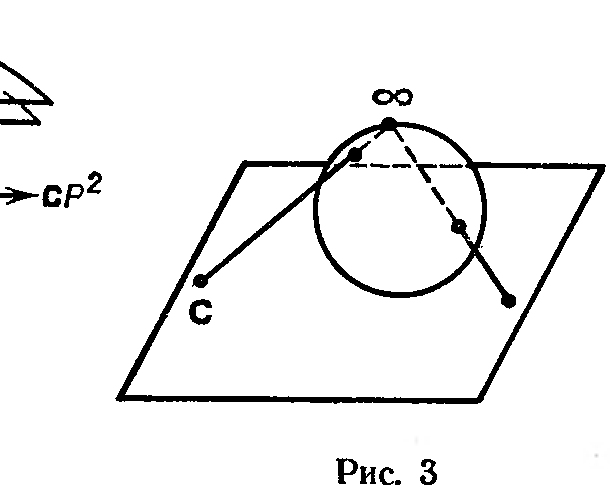

## 3.6. Проективные пространства

---
**стр. 220**
---

на открытом множестве, совпадают. Действительно, их разность обращается в нуль в окрестности начала координат и потому множество её корней не может быть собственным линейным подпространством. Это завершает доказательство.

## § 6. Проективные пространства

**1.** Аффинные пространства получаются из линейных «забвением начала координат». Проективные пространства можно строить из линейных по меньшей мере двумя способами.

a) Добавить к аффинному пространству «бесконечно удалённые точки».

б) Реализовать проективное пространство как множество прямых в линейном пространстве.

Мы выберем в качестве основного определения б): оно яснее показывает однородность проективного пространства.

**2. Определение.** *Пусть $L$ — линейное пространство над полем $\mathcal{K}$. Множество $P(L)$ прямых (т. е. одномерных линейных подпространств) в $L$ называется проективным пространством, ассоциированным с $L$, а сами прямые в $L$ называются точками $P(L)$.*

Число $\dim L - 1$ называется размерностью $P(L)$ и обозначается $\dim P(L)$. Одномерные и двумерные проективные пространства называются соответственно проективной прямой или проективной плоскостью. Проективное пространство размерности $n$ над полем $\mathcal{K}$ обозначается также $\mathcal{K}P^n$ или $P^n(\mathcal{K})$, или просто $P^n$. Смысл соглашения $\dim P(L) = \dim L - 1$ станет сейчас ясен.

**3. Однородные координаты.** Выберем базис $\{e_0, \ldots, e_n\}$ в пространстве $L$. Каждая точка $p \in P(L)$ однозначно определяется любым ненулевым вектором на соответствующей прямой в $L$. Координаты $x_0, \ldots, x_n$ этого вектора называются *однородными координатами* точки $p$. Они определены с точностью до умножения на ненулевой скаляр: точка $(\lambda x_0, \ldots, \lambda x_n)$ лежит на той же прямой $p$ и все точки прямой получаются таким образом. Поэтому вектор однородных координат точки $p$ по традиции обозначается $(x_0 : x_1 : \ldots : x_n)$.

Таким образом, *координатное $n$-мерное проективное пространство* $P(\mathcal{K}^{n+1})$ есть множество орбит мультипликативной группы $\mathcal{K}^* = \mathcal{K} \setminus \{0\}$, действующей на множестве ненулевых векторов $\mathcal{K}^{n+1} \setminus \{0\}$ по правилу $\lambda(x_0, \ldots, x_n) = (\lambda x_0, \ldots, \lambda x_n)$; $(x_0 : x_1 : \ldots : x_n)$ есть символ соответствующей орбиты.

Пользуясь однородными координатами, можно хорошо представить себе структуру $P^n$ как множества несколькими разными способами.

a) *Аффинное покрытие $P^n$.* Положим

$$U_i = \{(x_0 : \ldots : x_n) \mid x_i \neq 0\}, \qquad i = 0, \ldots, n.$$

Очевидно, $P^n = \bigcup\limits_{i=0}^{n} U_i$. В классе векторов проективных координат любой точки $p \in U_i$ имеется единственный вектор с $i$-й координа-

---
**стр. 221**
---

той, равной $1$: $(x_0 : \ldots : x_i : \ldots : x_n) = (x_0/x_i : \ldots : 1 : \ldots : x_n/x_i)$. Опуская эту единицу, получаем, что $U_i$ биективно множеству $\mathcal{K}^n$, которое мы можем интерпретировать как $n$-мерное линейное или аффинное координатное пространство. Заметим, однако, что пока у нас нет никаких оснований считать, что на $U_i$ имеется какая-то естественная не зависящая от выбора координат линейная или аффинная структура. Позже мы покажем, что инвариантно можно ввести на $U_i$ лишь целый класс аффинных структур, связанных, впрочем, каноническими изоморфизмами, так что геометрия аффинных конфигураций в любой из них будет одна и та же.

Назовём множество $U_i \cong \mathcal{K}^n$ *$i$-й аффинной картой* $P^n$ (в данной системе координат). Точки $(y_1^{(i)}, \ldots, y_n^{(i)}) \in U_i$ и $(y_1^{(j)}, \ldots, y_n^{(j)}) \in U_j$ при $i \neq j$ отвечают одной и той же точке $P^n$, лежащей на пересечении $U_i \cap U_j$, тогда и только тогда, когда, вставив $1$ на $i$-е место в векторе $(y_1^{(i)}, \ldots, y_n^{(i)})$ и на $j$-е место в $(y_1^{(j)}, \ldots, y_n^{(j)})$, мы получим пропорциональные векторы.

В частности, $P^1 = U_0 \cup U_1$, $U_0 \cong U_1 \cong \mathcal{K}$; точка $y \in U_0$ отвечает точке $1/y \in U_1$ при $y \neq 0$; точка $y = 0$ из $U_0$ не лежит в $U_1$, а точка $1/y = 0$ из $U_1$ не лежит в $U_0$. Естественно считать, что $P^1$ получается из $U_0 \cong \mathcal{K}$ добавлением одной точки с координатой $y = \infty$. Обобщая эту конструкцию, получаем

б) *Клеточное разбиение $P^n$.* Положим

$$V_i = \{(x_0 : \ldots : x_n) \mid x_j = 0 \text{ при } j < i,\; x_i \neq 0\}.$$

Очевидно, $V_0 = U_0$ и $P^n = \bigcup\limits_{i=0}^{n} V_i$, но на этот раз все $V_i$ попарно не пересекаются. В классе проективных координат любой точки $p \in V_i$ имеется единственный представитель с единицей на $i$-м месте; опуская эту единицу и предшествующие нули, мы получаем биекцию $V_i$ с $\mathcal{K}^{n-i}$. Окончательно

$$P^n \cong \mathcal{K}^n \cup \mathcal{K}^{n-1} \cup \mathcal{K}^{n-2} \cup \ldots \cup \mathcal{K}^0 \cong \mathcal{K}^n \cup P^{n-1}.$$

Иными словами, $P^n$ получается добавлением к $U_0 \cong \mathcal{K}^n$ бесконечно удалённого $(n-1)$-мерного проективного пространства, состоящего из точек $(0 : x_1 : \ldots : x_n)$; в свою очередь, оно получается из аффинного подпространства $V_1$ добавлением бесконечно удалённого (относительно $V_1$) проективного пространства $P^{n-2}$ и т. д.

в) *Проективные пространства и сферы.* В случае $\mathcal{K} = \mathbf{R}$ или $\mathbf{C}$ есть удобный способ нормировки однородных координат в $P^n$, не требующий выбора ненулевой координаты и деления на неё. Именно, любую точку $P^n$ можно представить координатами $(x_0 : \ldots : x_n)$ с условием $\sum\limits_{i=0}^{n} |x_i|^2 = 1$, т. е. точкой на $n$-мерной (при $\mathcal{K} = \mathbf{R}$) или $(2n+1)$-мерной (при $\mathcal{K} = \mathbf{C}$) евклидовой сфере. Степень оставшейся неоднозначности такова: точка $(\lambda x_0 : \ldots : \lambda x_n)$ по-прежнему лежит на единичной сфере тогда и только тогда, когда $|\lambda| = 1$, т. е. $\lambda = \pm 1$ при $\mathcal{K} = \mathbf{R}$, $\lambda = e^{i\varphi}$, $0 \leqslant \varphi < 2\pi$ при $\mathcal{K} = \mathbf{C}$.

---
**стр. 222**
---

Иными словами, $n$-мерное вещественное проективное пространство $\mathbf{R}P^n$ получается из $n$-мерной сферы $S^n$ отождествлением пар её диаметрально противоположных точек. В частности, $\mathbf{R}P^1$ устроена как окружность, а $\mathbf{R}P^2$ — как лист Мёбиуса, к которому по его границе приклеен круг (рис. 1, 2).

Сложнее «увидеть» $\mathbf{C}P^n$: в одну точку $\mathbf{C}P^n$ склеивается целый большой круг сферы $S^{2n+1}$, состоящий из точек $(x_0 e^{i\varphi}, \ldots, x_n e^{i\varphi})$ с переменным $\varphi$. Из описания $\mathbf{C}P^1$ в случае б) в качестве $\mathbf{C} \cup \{\infty\}$ ясно, что $\mathbf{C}P^1$ можно представлять себе как двумерную сферу Римана, в которой $\infty$ представлена северным полюсом, как при стереографической проекции (рис. 3).

Поэтому наше новое представление $\mathbf{C}P^1$ в виде факторпространства $S^3$ даёт замечательное отображение $S^3 \to S^2$, слои которого являются окружностями $S^1$. Оно называется *отображением Хопфа*.

В описании этого пункта мы совсем забыли о линейной структуре, исходной для $\mathbf{R}P^n$ и $\mathbf{C}P^n$, зато нам стали ясно видны топологические свойства этих пространств, в первую очередь их компактность. (Строго говоря, в определении $P^n$ никакая топология не фигурировала; удобнее всего вводить её именно с помощью отображений сфер, условившись, что открытые множества в $\mathbf{R}P^n$ и $\mathbf{C}P^n$ это те, прообразы которых в $S^n$ и $S^{2n+1}$ открыты.) Впредь мы не будем пользоваться топологией и вернёмся к изучению линейной геометрии проективных пространств. Не будет, однако, преувеличением сказать, что важность $\mathbf{R}P^n$ и $\mathbf{C}P^n$ в значительной мере объясняется тем, что это естественные компактификации $\mathbf{R}^n$ и $\mathbf{C}^n$, позволяющие распространить основные черты линейной структуры на бесконечность. Даже над абстрактным полем $\mathcal{K}$, не несущим никакой топологии, эта «компактность»

---
**стр. 223**
---

проективных пространств появляется в массе алгебраических вариантов. Типичный пример: на аффинной плоскости две разные прямые, вообще говоря, пересекаются в одной точке, но могут быть и параллельны. Это означает, что точка их пересечения «ушла в бесконечность», и при переходе в проективную плоскость она благополучно обнаруживается: любые две проективные прямые на плоскости пересекаются.

Вернемся теперь к систематическому изучению геометрии $P^n$.

**4. Проективные подпространства.** Пусть $M \subset L$ — любое линейное подпространство в $L$. Тогда $P(M) \subset P(L)$, ибо каждая прямая лежащая в $M$, является в то же время прямой, лежащей в $L$.

Множества вида $P(M)$ называются *проективными подпространствами в $P(L)$*. Очевидно, $P(M_1 \cap M_2) = P(M_1) \cap P(M_2)$, и то же верно для пересечения любого семейства. Следовательно, семейство проективных подпространств замкнуто относительно пересечений. Поэтому в множестве проективных подпространств $P(L)$, содержащих данное множество $S \subset P(L)$, имеется наименьшее — пересечение всех таких подпространств. Оно называется *проективной оболочкой* $S$, обозначается $\overline{S}$ и совпадает с $P(M)$, где $M$ — линейная оболочка всех прямых, отвечающих точкам $s \in S$, в $L$.

При переходе от пар $L \subset M$ к парам $P(L) \subset P(M)$ размерности уменьшаются на единицу, так что *коразмерность* $\dim L - \dim M$ *совпадает* с коразмерностью $\dim P(L) - \dim P(M)$. Далее, как мы уже отмечали, $P(M_1 \cap M_2) = P(M_1) \cap P(M_2)$, а $P(M_1 + M_2)$ совпадает с проективной оболочкой $P(M_1) \cup P(M_2)$.

Пользуясь этими замечаниями, мы можем написать проективный вариант теоремы п. 3 § 5 ч. 1. Заметим лишь, что в соответствии с определением в п. 2 размерность пустого проективного пространства следует считать равной $-1$: этот случай вполне реален, ибо непустые подпространства могут иметь пустое пересечение.

**5. Теорема.** *Пусть $P_1$, $P_2$ — два конечномерных проективных подпространства в проективном пространстве $P$. Тогда*

$$\dim P_1 \cap P_2 + \dim \overline{P_1 \cup P_2} = \dim P_1 + \dim P_2.$$

**6. Примеры.** а) $P_1$, $P_2$ — две разные точки. Тогда $\dim P_1 \cap P_2 = -1$, $\dim P_1 = \dim P_2 = 0$, откуда $\dim \overline{P_1 \cup P_2} = 1$, т. е. проективной оболочкой двух точек является прямая. Согласно определению проективной оболочки, она является единственной проективной прямой, проходящей через две точки.

б) Допустим, что $\dim P_1 + \dim P_2 \geqslant \dim P$. Тогда, поскольку $\dim \overline{P_1 \cup P_2} \leqslant \dim P$, имеем $\dim P_1 \cap P_2 \leqslant 0$. Иными словами, два проективных подпространства, сумма размерностей которых больше или равна размерности объемлющего пространства, имеют непустое пересечение. В частности, в проективной плоскости нет «параллельных» прямых: любые две прямые пересекаются либо в одной точке, либо в двух и тогда (в силу примера а)) совпадают. Аналогично, две проективных плоскости в трёхмерном проективном

---
**стр. 224**
---

пространстве обязательно пересекаются по прямой или совпадают. Проективная плоскость и прямая в трёхмерном пространстве пересекаются по точке или прямая лежит в плоскости.

в) Условие $P_1 \cap P_2 = \varnothing$ в случае $P_i = P(M_i)$ означает, что $M_1 \cap M_2 = \{0\}$, т. е. что сумма $M_1 + M_2$ прямая.

**7. Задание проективных подпространств уравнениями.** Линейная функция $f\colon L \to \mathcal{K}$ на линейном пространстве $L$ *не определяет* никакую функцию на $P(L)$ (кроме случая $f \equiv 0$), ибо всегда есть прямая в $L$, на которой эта функция непостоянна, и нет возможности фиксировать её значение в соответствующей точке $P(L)$. Но *уравнение* $f = 0$ определяет линейное подпространство в $L$ и потому проективное подпространство в $P(L)$. Если $L$ конечномерно, то любое подпространство в $L$ и потому любое подпространство в $P(L)$ можно задать системой уравнений

$$f_1 = \ldots = f_m = 0.$$

В однородных координатах $P^n$ этот эффект проявляется так: система линейных однородных уравнений

$$\sum_{j=0}^{n} a_{ij} x_j = 0, \qquad i = 1, \ldots, m,$$

задаёт проективное подпространство в $P^n$, состоящее из точек, однородные координаты которых $(x_0 : \ldots : x_n)$ удовлетворяют этой системе. Умножение всех координат на $\lambda$ не нарушает обращения в нуль левых частей.

**8. Аффинные подпространства и гиперплоскости.** Пусть $M \subset L$ — линейное подпространство коразмерности единица. Тогда $P(M) \subset P(L)$ имеет коразмерность единица, и мы будем называть такие подпространства *гиперплоскостями*.

Мы покажем сейчас, как ввести на дополнении $A_M$ к гиперплоскости $P(M)$ структуру аффинного пространства $(A_M, M, +)$. Выберем в $L$ линейное многообразие $M' = m' + M$, не проходящее через начало координат. Оно имеет естественную аффинную структуру: сдвиг на $m \in M$ в $M'$ индуцирован сдвигом на $m$ в $L$, т. е. состоит в прибавлении $m$.

С другой стороны, $A_M$ и $M'$ находятся в биективном соответствии: точка $A_M$ есть прямая, не лежащая в $M$, и она пересекается с $M'$ в единственной точке, которую и поставим в соответствие исходной точке $A_M$. Так получаются все точки по одному разу. С помощью этого биективного соответствия аффинную структуру на $M'$ можно перенести на $A_M$. Однако выбор $M'$ не однозначен, и это приводит к неоднозначности аффинной структуры $A_M$. Чтобы сравнить две такие структуры, покажем, что тождественное теоретико-множественное отображение $A_M$ в себя является аффинным изоморфизмом этих двух структур.

**9. Предложение.** *Пусть $(A_M, M, +')$ и $(A_M, M, +'')$ — две аффинные структуры на $A_M$, построенные с помощью описанной конструкции. Тогда тождественное отображение $A_M$ в себя явля-*

---
**стр. 225**
---

*ется аффинным изоморфизмом, линейная часть которого есть некоторая гомотетия $M$.*

Доказательство. Пусть две структуры отвечают подмногообразиям $m' + M$ и $m'' + M$. Классы $m' + M$ и $m'' + M$ в одномерном факторпространстве $L/M$ пропорциональны. Поэтому можно считать, что $m'' = am'$, $a \in \mathcal{K}$. Умножение на $a$ в $L$ переводит $m' + M$ в $m'' + M$ и индуцирует тождественное отображение $P(L)$ в себя и потому $A_M$ в себя. С другой стороны, сдвиг на вектор $m \in M$ в $m' + M$ при гомотетии переходит в сдвиг на вектор $am \in M$ в $m'' + M$. Это и доказывает требуемое.

**10. Следствие.** *Множество аффинных подпространств в $A_M$ с их отношениями инцидентности, а также множества аффинных отображений $A_M$ в другие аффинные пространства не зависят от произвола в выборе аффинной структуры $A_M$.*

Это оправдывает возможность рассматривать дополнение к любой гиперплоскости в проективном пространстве просто как аффинное пространство без дальнейших уточнений.

Посмотрим теперь, как выглядит проективное пространство $P(M)$ «с точки зрения» аффинного пространства $A_M$.

**11. Предложение.** *Точки $P(M)$ находятся в биективном соответствии с классами параллельных прямых в $A_M$. Иными словами, каждая точка $P(M)$ есть «направление ухода на бесконечность» в $A_M$.*

Доказательство. Отождествим $A_M$ с $m' + M$. Класс параллельных прямых в $m' + M$ определяется своей направляющей в $M$, т. е. точкой в $P(M)$, и это соответствие биективно.

**12.** На самом деле можно сказать больше: каждая прямая $l$ в $A_M$ однозначно определяет содержащую её прямую в $P(L)$ — а именно, её проективную оболочку $\bar{l}$. Проективная оболочка получается добавлением к $l$ единственной точки, которая как раз лежит в $P(M)$ и является «бесконечно удалённой точкой» этой прямой. Весь класс параллельных прямых в $A_M$ имеет общую бесконечно удалённую точку в $P(M)$. При отождествлении $A_M$ с $m' + M$ оболочка $\bar{l}$ отвечает всем прямым плоскости в $L$, проходящей через $l$ и направляющую $l$, а бесконечно удалённая точка $\bar{l}$ — это сама направляющая.

Более общо, пусть $A \subset A_M$ — любое аффинное подпространство. Тогда его проективная оболочка $\bar{A}$ в $P(L)$ обладает следующими свойствами:

а) $\bar{A} \setminus A \subset P(M)$: добавляются лишь точки на бесконечности.

б) $\dim A = \dim \bar{A}$.

в) $\bar{A} \setminus A$ есть проективное подпространство в $P(M)$ размерности $\dim A - 1$. (Поэтому $\bar{A}$ называют также проективным замыканием $A$.)

Отождествление $A_M$ с $m' + M$ сводит проверку этих свойств к прямому применению определений. Действительно, $\bar{A}$ состоит из прямых, лежащих в линейной оболочке $A \subset m' + M$. Эта линейная оболочка натянута на направляющую $L_0$ подпространства $A$ и любой вектор из $A$. Поэтому её размерность равна $\dim L_0 + 1 =$
