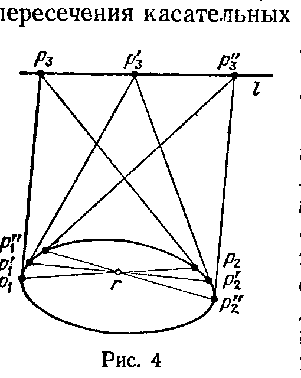

## 3.7. Проективная двойственность и проективные квадрики

---
**стр. 226**
---

= dim A + 1, значит, dim A = dim Ā. Все прямые в этой линейной оболочке пересекаются с m' + M, т. е. отвечают точкам A, за исключением прямых, лежащих в направляющей L₀. Последние лежат в P(M) и образуют проективное пространство размерности dim L₀ — 1 = dim A — 1.

§ 7. Проективная двойственность и проективные квадрики

1. Пусть L — линейное пространство над полем 𝒦, L* — двойственное к нему пространство линейных функционалов на L. Проективное пространство P(L*) называется двойственным к проективному пространству P(L).

Каждая точка P(L*) есть прямая {λf} в пространстве линейных функционалов на L. Гиперплоскость f = 0 в P(L) не зависит от выбора функционала f на этой прямой и однозначно определяет всю прямую. Поэтому можно сказать, что точками двойственного проективного пространства являются гиперплоскости исходного проективного пространства.

Если в L и L* выбраны двойственные базисы и соответствующие системы однородных координат в P(L) и P(L*), это соответствие приобретает простой вид: гиперплоскости с уравнением

$$\sum_{i=0}^{n} a_i x_i = 0$$

в P(L) отвечает точка с однородными координатами (a₀ : ... : aₙ) в P(L*). Канонический изоморфизм L → L** показывает симметрию отношения двойственности между двумя проективными пространствами. Более общо, переводя результаты § 7 ч. 1 на проективный язык, мы получим следующее соответствие двойственности между системами проективных подпространств в P(L) и P(L*) (мы считаем дальше, что L конечномерно).

а) Подпространству P(M) ⊂ P(L) отвечает двойственное к нему подпространство P(M⊥) ⊂ P(L*). При этом

$$\dim P(M) + \dim P(M^\perp) = \dim P(L) - 1.$$

б) Пересечению проективных подпространств отвечает проективная оболочка двойственных к ним, а проективной оболочке — пересечение. В частности, отношение инцидентности двух подпространств (т. е. включение одного в другое) переходит в отношение инцидентности.

Это позволяет сформулировать следующий принцип проективной двойственности, являющийся, собственно говоря, метаматематическим, поскольку он представляет собой утверждение о языке проективной геометрии.

2. Принцип проективной двойственности. Предположим, что мы доказали теорему о конфигурациях проективных подпространств в проективных пространствах, в формулировке которой фигурируют лишь свойства размерности, инцидентности, пересечения и взятия проективной оболочки. Тогда двойственное утверждение, в котором

---
**стр. 227**
---

все термины заменены на двойственные к ним по правилам предыдущего пункта, также является теоремой проективной геометрии.

Простой пример: к теореме «две разные плоскости в трёхмерном проективном пространстве пересекаются по одной прямой» двойственна теорема «через две разные точки в трёхмерном проективном пространстве проходит одна прямая». (В § 9 мы познакомимся с гораздо более содержательными теоремами о проективных конфигурациях.)

3. Проективная двойственность и квадрики. Если линейное пространство L снабжено изоморфизмом L → L*, то P(L*) можно отождествить с P(L), и отображение двойственности между проективными подпространствами P(L) и P(L*) превратится в отображение двойственности между подпространствами в P(L).

Задание изоморфизма L → L* равносильно заданию невырожденного скалярного произведения g: L × L → 𝒦. Рассмотрим подробнее геометрию проективной двойственности, отвечающую случаю, когда скалярное произведение g симметрично. Как обычно, будем считать, что характеристика поля 𝒦 отлична от двух. Тогда g однозначно восстанавливается по квадратичной форме q(l) = = g(l, l).

Уравнение q(l) = 0 определяет квадрику Q₀ в L. Её образ в P(L) мы также будем называть квадрикой, а в применении к теории двойственности — полярной квадрикой. Заметим, что Q₀ есть конус с центром в начале координат: если l ∈ Q₀, то вся прямая 𝒦l лежит в Q₀. Отождествляя P(L) с бесконечно удалёнными точками L, мы можем отождествить Q с базой конуса Q₀.

Согласно общей теории g и q определяют отображение двойственности множества проективных подпространств P(L) в себя; гиперплоскость в P(L), двойственная точке p ∈ P(L), называется полярной к p (относительно q или Q). Чтобы разобраться в геометрическом устройстве этого отображения, выведем сначала уравнение полярной гиперплоскости в однородных координатах. Мы можем работать сначала в L. Пусть уравнение Q₀ имеет вид

$$q(x_0, \ldots, x_n) = \sum_{i,j=0}^{n} a_{ij} x_i x_j = 0, \qquad a_{ij} = a_{ji}.$$

Точке (x₀⁰, ..., xₙ⁰) в L при изоморфизме L → L*, связанном с q, отвечает линейная функция

$$\sum_{i,j=0}^{n} a_{ij} x_i^0 x_j$$

от (x₀, ..., xₙ) ∈ L. Поэтому уравнение полярной гиперплоскости имеет вид

$$\sum_{i,j=0}^{n} a_{ij} x_i^0 x_j = 0.$$

В частности, если (x₀⁰ : ... : xₙ⁰) ∈ Q, то полярная гиперплоскость к данной точке содержит эту точку. Более того, в этом случае её

---
**стр. 228**
---

уравнение можно переписать в виде

$$\sum_{j=1}^{n} \frac{\partial q}{\partial x_j}(x_0^0, \ldots, x_n^0)(x_j - x_j^0) = \sum_{i,j=0}^{n} a_{ij} x_i^0 (x_j - x_j^0) = 0.$$

В элементарной аналитической геометрии (над **R**) такое уравнение определяет касательную гиперплоскость к Q₀ в её точке (x₀⁰, ..., xₙ⁰). Это мотивирует общее определение:

4. Определение. Касательной гиперплоскостью к невырожденной квадрике Q ⊂ P(L) в точке p ∈ Q называется гиперплоскость, полярная к p относительно квадратичной формы q, задающей Q.

Пользуясь общими свойствами проективной двойственности, мы можем теперь немедленно восстановить геометрически значительную часть отображения двойственности и получить серию красивых и неочевидных геометрических теорем, образцы которых мы приведём. Ниже Q — (невырожденная) квадрика в P² или P³.

а) Пусть Q ⊂ P², p₁, p₂ — две точки на квадрике, p₃ — точка пересечения касательных к Q в p₁ и p₂. Согласно общему принципу двойственности точка p₃ отвечает тогда прямой p₁p₂, проходящей через p₁ и p₂, т. е. проективной оболочке p₁ и p₂.

Заставим точку p₃ меняться вдоль прямой l; проведём из каждой точки прямой две касательные к Q и соединим пары точек касания. Тогда все получающиеся «хорды» Q пересекутся в одной точке r, которая отвечает l в силу двойственности. Ещё раз заметим, что для доказательства мы не нуждаемся ни в каких вычислениях: это следует просто из того, что по общему принципу двойственности проективная оболочка точек p₃, p₃', p₃'', ... полярна к пересечению двойственных к ним прямых, которые и суть соответствующие хорды.

Один момент, однако, заслуживает специального упоминания. Попарные пересечения касательных к точкам Q могут не заметать всю плоскость. Например для эллипса в **R**P², как на рис. 4 (у нас нарисован, конечно, лишь кусочек аффинной карты в **R**P²), мы получим лишь внешность эллипса. Как же узнать, какие прямые отвечают внутренним точкам эллипса? Рис. 4 подсказывает ответ: в силу симметрии двойственности следует провести через внутреннюю точку r пучок хорд к Q, затем построить точки пересечения касательных к Q в противоположных концах этих хорд; они и заметут двойственную к точке r прямую l.

Однако, таким образом, описание отображения двойственности становится неоднородным. У нас оказываются два рецепта для построения прямой l, полярной к точке r.

---
**стр. 229**
---

1) Если точка $r$ лежит вне эллипса $Q$ (или на нем), проведите две касательные из $r$ к $Q$ (или одну) и соедините точки касания прямой $l$ (или возьмите касательную $l$).

2) Если точка $r$ лежит внутри эллипса $Q$, проведите все прямые через $r$, постройте точки пересечения касательных к двум точкам пересечения прямых через $r$ с $Q$. Их геометрическое место и будет прямой, двойственной к $r$.

Оказывается, все дело в том, что основное поле $\mathbf{R}$ здесь не является алгебраически замкнутым. Если бы мы работали в $\mathbf{C}P^2$, сходились бы оба рецепта, и притом для всех точек $r \in \mathbf{C}P^2$. Вещественная прямая $l$, лежащая целиком вне вещественного эллипса $Q$, на самом деле все равно пересекается с ним, но в двух комплексно сопряженных точках, и две комплексно сопряженные касательные к $Q$ в этих точках пересекаются уже в вещественной точке $r$, лежащей внутри $Q$. Из вещественной точки $r$, лежащей внутри $Q$, все равно можно провести две комплексно сопряженные касательные к $Q$, через точки касания которых проходит вещественная прямая — это и есть $l$.

В этом смысле вещественная проективная геометрия $\mathbf{R}P^2$ является лишь кусочком геометрии $\mathbf{C}P^2$, и по-настоящему простая и симметричная теория двойственности имеет место в $\mathbf{C}P^2$, а $\mathbf{R}P^2$ отражает лишь ее вещественную часть.

Классическая проективная геометрия была в значительной мере посвящена выяснению деталей этого красивого мира конфигураций, состоящих из квадрик, хорд и касательных и «невидимых» комплексных точек касания и пересечения. На самом деле вся квадрика может не иметь вещественных точек, как например $x_0^2 + x_1^2 + x_2^2 = 0$. Тем не менее видимая часть двойственности разыгрывается на $\mathbf{R}P^2$.

б) Дадим еще одну иллюстрацию в трехмерном случае: рассмотрим проективную невырожденную квадрику $Q$ в трехмерном проективном пространстве и проведем из точки $r$ вне $Q$ касательные плоскости к $Q$. Тогда все точки касания лежат в одной плоскости, а именно в плоскости, двойственной к $r$. Причина снова та же: пересечению касательных плоскостей двойственна проективная оболочка точек касания, и если все касательные плоскости пересекаются в точности по $r$ (это нужно и можно доказать в случае, когда $Q$ имеет достаточно много точек), то эта проективная оболочка должна быть двумерна.

Комментарии по поводу комплексных точек касания и пересечения те же, что и в двумерном случае.

Строгое определение вместилища недостающих точек проективного пространства и квадрики в случае $\mathcal{K} = \mathbf{R}$ опирается на понятие комплексификации (см. § 12 ч. 1).

5. а) Комплексификацией проективного пространства $P(L)$ над $\mathbf{R}$ называется проективное пространство $P(L^C)$ над $\mathbf{C}$. Каноническое вложение $L \subset L^C$ позволяет сопоставить каждой $\mathbf{R}$-прямой в $L$ ее комплексификацию — $\mathbf{C}$-прямую в $L^C$, что определяет
