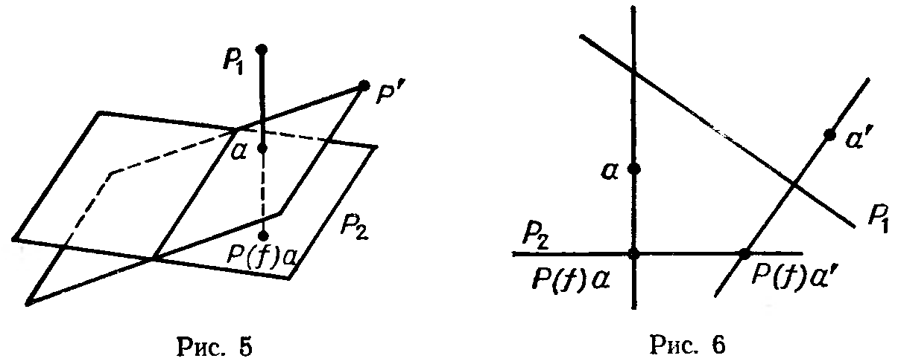
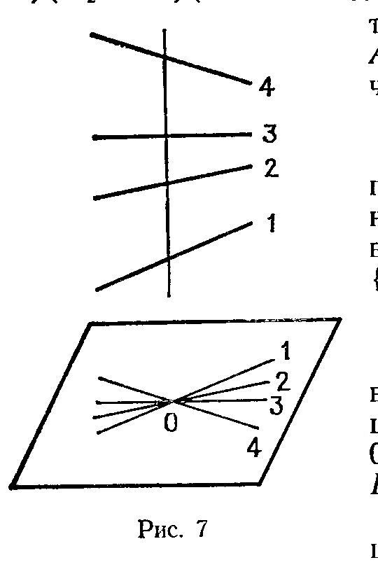

## 3.8. Проективные группы и проекции

---
**стр. 230**
---

вложение $P(L) \subset P(L^C)$. Точки $P(L^C)$ суть «комплексные точки» вещественного проективного пространства $P(L)$.

б) Изоморфизм $L \to L^*$, определяемый скалярным произведением $g$ на $L$, индуцирует комплексифицированный изоморфизм $L^C \to (L^C)^*$. Он определяется симметричным скалярным произведением $g^C$ на $L^C$, которое задает нам квадрику $Q^C$ и проективную двойственность в $P(L^C)$. На $L^C$ и $P(L^C)$ действует операция комплексного сопряжения, индуцированная антилинейным изоморфизмом $L^C \to \overline{L}^C$, тождественным на $L \subset L^C$. Точки $P(L)$ — это точки $P(L^C)$, инвариантные относительно комплексного сопряжения; они называются вещественными. Более общо, проективные подпространства в $P(L^C)$, переводящиеся в себя при комплексном сопряжении, находятся в биекции с проективными подпространствами в $P(L)$. Назовем такие подпространства вещественными. Тогда два отображения, устанавливающие взаимообратные биекции, можно описать так:

(вещественное проективное подпространство в $P(L^C)$) $\to$ (множество его вещественных точек в $P(L)$);

(проективное подпространство в $P(L)$) $\to$ (его комплексификация в $P(L^C)$).

в) Отображение двойственности в $P(L)$, определенное с помощью $g$, получается из отображения двойственности в $P(L^C)$, определенного с помощью $g^C$, посредством ограничения последнего на систему вещественных подпространств в $P(L^C)$, отождествленную с системой подпространств в $P(L)$, как в разделе б).

Проверки всех этих утверждений, если учесть результаты § 12 ч. 1, проводятся непосредственно, а в вещественной системе координат $L^C$, пришедшей из $L$, совсем тавтологичны. Единственная содержательная сторона ситуации, проиллюстрированная выше на примерах, состоит в возможности проявления вещественных точек на невидимых комплексных конфигурациях вроде лежащей внутри эллипса точки пересечения двух невещественных касательных к двум комплексно сопряженным точкам этого эллипса.

В случае основного поля $\mathcal{K}$, отличного от $\mathbf{R}$, нужно воспользоваться общим функтором расширения основного поля (например, до алгебраического замыкания $\overline{\mathcal{K}}$) вместо комплексификации. Ситуация, однако, несколько усложняется тем, что вместо одного отображения комплексного сопряжения придется привлекать всю группу Галуа для выделения объектов, определенных над исходным полем (вещественных в случае $\mathcal{K} = \mathbf{R}$).

## § 8. Проективные группы и проекции

1. Пусть $L$, $M$ — два линейных пространства, $f\colon L \to M$ — линейное отображение. Если $\operatorname{Ker} f = \{0\}$, то $f$ переводит любую прямую из $L$ в однозначно определенную прямую в $M$ и, значит, индуцирует отображение $P(f)\colon P(L) \to P(M)$, называемое проективизацией $f$. В частности, если $f$ — изоморфизм, $P(f)$ называется проективным

---
**стр. 231**
---

изоморфизмом. При $\operatorname{Ker} f \neq \{0\}$ положение дел сложнее: прямые, лежащие в $\operatorname{Ker} f$, т. е. составляющие проективное подпространство $P(\operatorname{Ker} f) \subset P(L)$, переходят в нуль, который не определяет никакой точки в $P(M)$. Поэтому проективизация $P(f)$ определена лишь на дополнении $U_f = P(L) \setminus P(\operatorname{Ker} f)$. Оба этих случая важны, но ведут в разных направлениях, и мы исследуем их отдельно. Наиболее существенные геометрические черты ситуации выявляются уже при $L = M$.

2. **Проективная группа.** Пусть $M = L$, $f$ пробегает группу линейных автоморфизмов пространства $L$. Следующие утверждения очевидны:

а) $P(\mathrm{id}_L) = \mathrm{id}_{P(L)}$;

б) $P(fg) = P(f)P(g)$.

В частности, все отображения $P(f)$ биективны и $P(f^{-1}) = P(f)^{-1}$. Поэтому $P(f)$ пробегает группу отображений $P(L)$ в себя, которая называется *проективной группой* пространства $P(L)$ и обозначается $\operatorname{PGL}(L)$, отображение $P\colon \operatorname{GL}(L) \to \operatorname{PGL}(L)$, $f \mapsto P(f)$ является сюръективным гомоморфизмом групп.

Каждое отображение $P(f)$ переводит проективные подпространства $P(L)$ в проективные подпространства, сохраняя размерность и все отношения инцидентности.

Вместо $\operatorname{PGL}(\mathcal{K}^{n+1})$ пишут $\operatorname{PGL}(n)$.

3. **Предложение.** *Ядро канонического отображения* $P\colon \operatorname{GL}(L) \to \operatorname{PGL}(L)$ *состоит в точности из гомотетий. Поэтому* $\operatorname{PGL}(L)$ *изоморфна факторгруппе* $\operatorname{GL}(L)/\mathcal{K}^*$, *где* $\mathcal{K}^* = \{a\,\mathrm{id}_L \mid a \in \mathcal{K} \setminus \{0\}\}$.

*Доказательство.* По определению $\operatorname{Ker} P = \{f \in \operatorname{GL}(L) \mid P(f) = \mathrm{id}_{P(L)}\}$. Любая гомотетия переводит каждую прямую из $L$ в себя, поэтому $\mathcal{K}^* \subset \operatorname{Ker} P$. Наоборот, всякий элемент $\operatorname{Ker} P$ переводит любую прямую в себя и потому диагонализируем в любом базисе $L$. Но тогда все его собственные значения должны совпадать. В самом деле, пусть $f(e_1) = \lambda_1 e_1$, $f(e_2) = \lambda_2 e_2$, где $e_1$, $e_2$ линейно независимы. Тогда из условия $f(e_1 + e_2) = \mu(e_1 + e_2) = \lambda_1 e_1 + \lambda_2 e_2$ следует, что $\lambda_1 = \mu = \lambda_2$. Значит, $f$ — гомотетия, что доказывает требуемое.

4. **Отображения $P(f)$ в координатах.** Если линейное отображение $f\colon L \to L$ в координатах задается матрицей $A$:

$$f(x_0, \ldots, x_n) = A \cdot [x_0, \ldots, x_n]$$

(произведение матрицы $A$ на столбец $[x_0, \ldots, x_n]$), то $P(f)$ в соответствующих однородных координатах задается той же матрицей $A$ или любой пропорциональной ей:

$$P(f)(x_0 : \ldots : x_n) = (\lambda A) \cdot [x_0, \ldots, x_n], \quad \lambda \in \mathcal{K}^*.$$

Если ограничиться рассмотрением точек с $x_0 \neq 0$, проективные координаты которых можно выбирать в виде $(1 : y_1 : \ldots : y_n)$, и так же записывать координаты образа точки, мы придем к дробно-

---
**стр. 232**
---

линейным формулам:

$$
P(f)(1 : y_1 : \ldots : y_n) = (1 : y'_1 : \ldots : y'_n) =
$$

$$
= \left(a_{00} + \sum_{i=1}^n a_{i0}y_i : a_{01} + \sum_{i=1}^n a_{i1}y_i : \ldots : a_{0n} + \sum_{i=1}^n a_{in}y_i\right) =
$$

$$
= \left(1 : \frac{a_{01} + \sum_{i=1}^n a_{i1}y_i}{a_{00} + \sum_{i=1}^n a_{i0}y_i} : \ldots : \frac{a_{0n} + \sum_{i=1}^n a_{in}y_i}{a_{00} + \sum_{i=1}^n a_{i0}y_i}\right).
$$

(Аналогичный вид, разумеется, имеет $P(f)$ на множестве точек, где $x_i \neq 0$, $i$ любое.) Эти выражения теряют смысл там, где знаменатель обращается в нуль, т. е. в тех точках дополнения к гиперплоскости $x_0 = 0$, которые $P(f)$ переводит в эту гиперплоскость. Если таких точек нет, то в терминах аффинных координат $(y_1, \ldots, y_n)$ на $P(L) \setminus \{x_0 = 0\}$ мы получаем аффинное отображение. Инвариантное объяснение этого даёт следующий результат.

**5. Предложение.** *Пусть $M \subset L$ — подпространство коразмерности единица, $P(M) \subset P(L)$ — соответствующая гиперплоскость, $A_M$ — дополнение к ней с аффинной структурой, описанной в § 6. Поставим в соответствие любому проективному автоморфизму $P(f): P(L) \to P(L)$ с условием $f(M) \subset M$ его ограничение на $A_M$. Получим изоморфизм подгруппы $\operatorname{PGL}(L)$, переводящей $P(M)$ в себя, с $\operatorname{Aff} A_M$. Линейная часть ограничения $P(f)$ на $A_M$ пропорциональна ограничению $f$ на $M$.*

*Доказательство.* Введём аффинную структуру на $A_M$, отождествив $A_M$ с линейным многообразием $m' + M \subset L$: каждой точке $A_M$ ставится в соответствие пересечение соответствующей прямой в $L$ с $m' + M$. Если $f(M) \subset M$, то в классе $f$ с одним и тем же $P(f)$ можно выбрать единственное отображение $f_0$, для которого $f_0(m' + M) = m' + M$. Ограничения всех таких отображений $f_0$ образуют группу аффинных преобразований $m' + M$, поскольку $m' + M$ есть аффинное подпространство в $L$ с его аффинной структурой, а $f_0: L \to L$ линейно и потому аффинно. Линейная часть такого $f_0$, очевидно, совпадает с ограничением $f_0$ на $M$. Для всякой линейной части можно найти соответствующее $f_0$, и при фиксированной линейной части можно найти $f_0$, переводящее любую точку $m' + M$ в любую другую: чтобы увидеть это, достаточно выбрать базис в $L$, состоящий из базиса в $M$ и вектора $m'$, после чего воспользоваться формулами п. 3. Наконец, если $f$ тождественно действует на $m' + M$ и $M$, то $P(f) = \operatorname{id}_{P(L)}$, ибо $f$ переводит каждую прямую в $L$ в себя. Это завершает доказательство.

**6. Действие проективной группы на проективных конфигурациях.** Назовём проективной конфигурацией конечную упорядоченную систему проективных подпространств в $P(L)$. Будем говорить, что две конфигурации проективно конгруэнтны тогда и только тогда, когда одну можно перевести в другую проективным преоб-

---
**стр. 233**
---

разованием $P(L)$ в себя. Очевидно, для этого необходимо и достаточно, чтобы соответствующие конфигурации линейных подпространств в $L$ были одинаково расположены в смысле § 5 ч. 1. Поэтому мы можем сразу же перевести доказанные там результаты на проективный язык и получить следующие факты.

а) Группа $\operatorname{PGL}(L)$ транзитивно действует на множестве проективных подпространств фиксированной размерности в $P(L)$, т. е. все такие подпространства конгруэнтны (см. п. 1 § 5 ч. 1).

б) Группа $\operatorname{PGL}(L)$ транзитивно действует на множестве упорядоченных пар проективных подпространств в $P(L)$ с фиксированными размерностями членов пары и их пересечений, т. е. все такие пары конгруэнтны (см. п. 5 § 5 ч. 1).

в) Группа $\operatorname{PGL}(L)$ транзитивно действует на множестве упорядоченных $n$-ок проективных подпространств $(P_1, \ldots, P_n)$ с фиксированными размерностями $\dim P_i$, которые обладают следующим свойством: для каждого $i$ подпространство $P_i$ не пересекается с проективной оболочкой $(P_1, \ldots, P_{i-1}, P_{i+1}, \ldots, P_n)$, т. е. наименьшим проективным подпространством, содержащим эту систему.

Действительно, пусть $P_i = P(L_i)$, $L_i \subset L$. Проективная оболочка $(P_1, \ldots, P_{i-1}, P_{i+1}, \ldots, P_n)$, как нетрудно убедиться, совпадает с $P(L_1 + \ldots + L_{i-1} + L_{i+1} + \ldots + L_n)$, а условие пустоты её пересечения с $P(L_i)$ означает, что $L_i \cap \sum_{j \neq i} L_j = \{0\}$. В силу условия а) теоремы п. 8 § 5 ч. 1 сумма $L_1 \oplus \ldots \oplus L_n$ прямая, и $\operatorname{GL}(L)$ транзитивно действует на таких $n$-ках подпространств (выбрать базис в $L$, дополняющий объединение базисов всех $L_i$, и воспользоваться тем, что $\operatorname{GL}(L)$ транзитивна на базисах $L$).

В качестве частного случая ($\dim P_i = 0$ для всех $i$) получаем следующий результат: все наборы $n$ точек в $P(L)$, обладающие тем свойством, что никакая точка не лежит в проективной оболочке остальных, проективно конгруэнтны.

г) Группа $\operatorname{PGL}(L)$ транзитивно действует на множестве проективных флагов $P_1 \subset P_2 \subset \ldots \subset P_n$ в $P(L)$ фиксированной длины $n$ с фиксированными размерностями $\dim P_i$.

Действительно, любой такой флаг является образом флага $L_1 \subset L_2 \subset \ldots$ в $L$; выберем базис в $L$, первые $\dim P_i + 1$ элементов которого порождают подпространство $L_i$ для каждого $i$, и снова воспользуемся транзитивностью действия $\operatorname{GL}(L)$ на базисах.

Кроме этих результатов, являющихся прямым следствием соответствующих теорем для линейных пространств, разберём один интересный новый случай, в котором впервые появляется нетривиальный инвариант относительно проективной конгруэнтности: классическое «двойное отношение четвёрки точек на проективной прямой». Большую часть рассуждений можно провести в случае произвольной размерности, и мы начнём с общего определения.

**7. Определение.** *Система точек $p_1, \ldots, p_N$ в $n$-мерном проективном пространстве $P$ находится в общем положении, если для всех $m \leqslant \min\{N, n+1\}$ и всех подмножеств $S \subset \{1, \ldots, N\}$ мощности*

---
**стр. 234**
---

$m$ проективная оболочка точек $\{p_i \mid i \in S\}$ имеет размерность $m - 1$.

Нас особенно будут интересовать случаи $N = n+1$, $n+2$, $n+3$.

а) *$n+1$ точек в общем положении.* Поскольку никакая точка системы не лежит в проективной оболочке остальных (иначе проективная оболочка всей системы имела бы размерность $n - 1$, а не $n$), такие конфигурации уже были рассмотрены в разделе в) п. 6; в частности, проективная группа на них транзитивна. Сейчас мы хотим обратить внимание на то, что проективное преобразование, переводящее одну систему $n+1$ точек в общем положении в другую, не определено однозначно.

Действительно, если $e_1, \ldots, e_{n+1}$ — ненулевые векторы, лежащие в $p_1, \ldots, p_{n+1}$ соответственно, то $\{e_1, \ldots, e_{n+1}\}$ есть базис $L$ (где $P = P(L)$) и группа проективных преобразований, оставляющих на месте все точки $p_i$, состоит в точности из преобразований вида $P(f)$, где $f$ диагональны в базисе $\{e_1, \ldots, e_{n+1}\}$. Эта оставшаяся степень свободы позволяет доказать транзитивность действия $\operatorname{PGL}(L)$ на системах $n+2$ точек в общем положении.

б) *$n+2$ точки в общем положении.* Если точки $\{p_1, \ldots, p_{n+2}\}$ находятся в общем положении, то точки $\{p_1, \ldots, p_{n+1}\}$ также находятся в общем положении. Как в предыдущем абзаце, выберем базис $\{e_1, \ldots, e_{n+1}\}$, $e_i \in p_i$. Он определяет систему однородных координат в $P$. Пусть $(x_1 : \ldots : x_{n+1})$ — координаты точки $p_{n+2}$ в этом базисе. Ни одна из координат $x_i$ не равна нулю, иначе вектор $(x_1, \ldots, x_{n+1})$ на прямой $p_{n+2}$ линейно выражался бы через векторы $e_j$, $1 \leqslant j \leqslant n+1$, $j \neq i$, откуда следует, что проективная оболочка $n+1$ точки $\{p_i \mid i \neq j\}$ имела бы размерность $n - 1$, а не $n$. Но преобразование $P(f)$ с $f = \operatorname{diag}(\lambda_1, \ldots, \lambda_{n+1})$ (в базисе $\{e_1, \ldots, e_{n+1}\}$) переводит $(x_1 : \ldots : x_{n+1})$ в точку $(\lambda_1 x_1 : \ldots : \lambda_{n+1} x_{n+1})$, а $p_1, \ldots, p_{n+1}$ оставляет на месте. Отсюда следует, что любую точку $(x_1 : \ldots : x_{n+1})$ (все $x_i \neq 0$) можно перевести в любую другую $(y_1 : \ldots : y_{n+1})$ (все $y_i \neq 0$) единственным проективным преобразованием, оставляющим $p_1, \ldots, p_n$ на месте.

Итак, мы установили, что все упорядоченные системы $n+2$ точек в общем положении в $P$, где $\dim P = n$, конгруэнтны и, более того, образуют главное однородное пространство над группой $\operatorname{PGL}(L)$.

Принимая «пассивную» точку зрения вместо «активной», мы можем сказать, что для любой упорядоченной системы точек $\{p_1, \ldots, p_{n+2}\}$ существует единственная система однородных координат в $P$, в которой координаты $p_1, \ldots, p_{n+2}$ имеют следующий вид:

$$
p_1 = (1 : 0 : \ldots : 0),\ p_2 = (0 : 1 : 0 : \ldots : 0),\ \ldots,\ p_{n+1} = (0 : \ldots : 0 : 1),
$$

$$
p_{n+2} = (1 : \ldots : 1).
$$

Можно назвать эту систему приспособленной к $\{p_1, \ldots, p_{n+2}\}$.

в) *$n+3$ точки в общем положении.* Такие конфигурации уже не все конгруэнтны: если $\{p_1, \ldots, p_{n+3}\}$ и $\{p'_1, \ldots, p'_{n+3}\}$ даны, мы

---
**стр. 235**
---

можем найти единственное проективное отображение, переводящее $p_i$ в $p'_i$ для всех $1 \le i \le n+2$, но $p_{n+3}$ попадает или не попадает в $p'_{n+3}$ в зависимости от ситуации.

Нетрудно описать проективные инварианты системы из $n+3$ точек. Выберем систему однородных координат в $P$, в которой первые $n+2$ точки имеют координаты, описанные в случае б). В ней точка $p_{n+3}$ имеет координаты $(x_1 : \dots : x_{n+1})$, определенные однозначно с точностью до пропорциональности. Любой проективный автоморфизм $P$, примененный одновременно к конфигурации $\{p_1, \dots, p_{n+3}\}$ и к приспособленной к ней системе координат, переведет эту конфигурацию в другую, а систему координат — в приспособленную систему координат новой конфигурации. Поэтому координаты $(x_1 : \dots : x_{n+1})$ последней точки останутся теми же самыми.

Все предыдущие рассуждения с очевидными видоизменениями переносятся также на случай, когда у нас имеются два $n$-мерных проективных пространства $P$ и $P'$, конфигурации $\{p_1, \dots, p_N\} \subset P$ и $\{p'_1, \dots, p'_N\} \subset P'$, и мы интересуемся проективными изоморфизмами $P \to P'$, переводящими первую конфигурацию во вторую. Резюмируем результаты обсуждения в следующей теореме:

**8. Теорема.** а) *Пусть $P$, $P'$ — $n$-мерные проективные пространства, $\{p_1, \dots, p_{n+2}\} \subset P$ и $\{p'_1, \dots, p'_{n+2}\} \subset P'$ — две системы точек в общем положении. Тогда существует единственный проективный изоморфизм $P \to P'$, переводящий первую конфигурацию во вторую.*

б) *Аналогичный результат верен для систем $n+3$ точек в общем положении тогда и только тогда, когда координаты $(n+3)$-й точки в системе, приспособленной к первым $n+2$ точкам, для обеих конфигураций совпадают (конечно, с точностью до скалярного множителя).*

**9. Двойное отношение.** Применим теорему п. 8 к случаю $n = 1$. Мы получим, прежде всего, что если на двух проективных прямых заданы упорядоченные тройки попарно разных точек (это и есть здесь условие общности положения), то существует единственный проективный изоморфизм прямых, переводящий одну тройку в другую.

Далее, пусть задана четверка попарно разных точек $\{p_1, p_2, p_3, p_4\} \subset P^1$ с координатами $(1:0)$, $(0:1)$, $(1:1)$ и $(x_1 : x_2)$ в приспособленной системе. Тогда $x_2 \ne 0$. Положим

$$[p_2, p_3, p_1, p_4] = x_1 x_2^{-1}.$$

Это число называется *двойным отношением* четверки точек $\{p_i\}$. Необычный порядок объясняется желанием сохранить согласованность с классическим определением: в аффинной карте, где $p_2 = \infty$, $p_3 = 0$, $p_1 = 1$, координаты точек в квадратных скобках располагаются так: $[0, 1, \infty, x]$, где $x$ и есть двойное отношение этой четверки.

Сам термин «двойное отношение» происходит из следующей явной формулы для вычисления инварианта $[x_1, x_2, x_3, x_4]$, где $x_i \in \mathcal{K}$

---
**стр. 236**
---

на сей раз понимаются как координаты точек $p_i$ в произвольной аффинной карте $P^1$. Согласно результатам п. 4 группа $PGL(1)$ в этой карте представлена дробно-линейными преобразованиями вида $x \mapsto \frac{ax+b}{cx+d}$, $ad - bc \ne 0$. Такое преобразование, переводящее $(x_1, x_2, x_3)$ в $(0, 1, \infty)$, имеет вид

$$x \mapsto \frac{x_1 - x}{x_3 - x} : \frac{x_1 - x_2}{x_3 - x_2}.$$

Подставляя сюда $x = x_4$, находим

$$[x_1, x_2, x_3, x_4] = \frac{x_1 - x_4}{x_3 - x_4} : \frac{x_1 - x_2}{x_3 - x_2}.$$

Еще одна классическая конструкция, связанная с утверждением а) теоремы п. 8 для $n = 1$, описывает представление симметрической группы $S_3$ дробно-линейными преобразованиями. Согласно этой теореме любая перестановка $\{p_1, p_2, p_3\} \mapsto \{p_{\sigma(1)}, p_{\sigma(2)}, p_{\sigma(3)}\}$ трех точек на проективной прямой индуцирована единственным проективным преобразованием этой прямой.

В аффинной карте, где $\{p_1, p_2, p_3\} = \{0, 1, \infty\}$, эти проективные преобразования представлены дробно-линейными преобразованиями

$$x \mapsto \left\{x, \frac{1}{x}, 1-x, \frac{1}{1-x}, \frac{x-1}{x}, \frac{x}{x-1}\right\}.$$

Перейдем теперь к изучению проекций.

**10.** Пусть линейное пространство $L$ представлено в виде прямой суммы двух своих подпространств размерности $\ge 1$: $L = L_1 \oplus L_2$. Положим $P = P(L)$, $P_i = P(L_i)$.

Как было показано в п. 1, линейная проекция $f: L \to L_2$, $f(l_1 + l_2) = l_2$, $l_i \in L_i$, индуцирует отображение

$$P(f): P \setminus P_1 \to P_2,$$

которое мы будем называть *проекцией из центра* $P_1$ *на* $P_2$. Чтобы описать всю ситуацию в чисто проективных терминах, заметим следующее.

а) $\dim P_1 + \dim P_2 = \dim P - 1$ и $P_1 \cap P_2 = \varnothing$. Наоборот, любая конфигурация $(P_1, P_2)$ с такими свойствами происходит из единственного прямого разложения $L = L_1 \oplus L_2$.

б) Если $a \in P_2$, то $P(f)a = a$; если $a \in P \setminus (P_1 \cup P_2)$, то $P(f)a$ определяется как точка пересечения с $P_2$ единственной проективной прямой в $P$, пересекающейся с $P_1$ и $P_2$ и проходящей через $a$.

Действительно, случай $a \in P_2$ очевиден. Если $a \notin P_1 \cup P_2$, то на языке пространства $L$ нужный нам результат формулируется так: через любую прямую $L_0 \subset L$, не лежащую в $L_1$ и $L_2$, проходит единственная плоскость, пересекающаяся с $L_1$ и $L_2$ по прямым, и ее пересечение с $L_2$ совпадает с ее проекцией на $L_2$. В самом деле, одна плоскость с этим свойством есть: она натянута на проекции $L_0$ на $L_1$ и $L_2$ соответственно. Существование двух таких плоскостей

---
**стр. 237**
---

влекло бы существование двух разных разложений ненулевого вектора $l_0 \in L_0$ в сумму двух векторов из $L_1$ и $L_2$ соответственно, что невозможно, ибо $L = L_1 \oplus L_2$.

Поскольку описанная проективная конструкция отображения $P \to P \setminus P_1$ поднимается до линейной, мы сразу же получаем, что для любого подпространства $P' \subset P \setminus P_1$ ограничение проекции $P' \to P_1$ является проективным отображением, т. е. имеет вид $P(g)$, где $g$ — некоторое линейное отображение соответствующих векторных пространств.

В важном частном случае, когда $P_1$ — точка, $P_2$ — гиперплоскость, отображение проекции из центра $P_1$ на $P_2$ переводит точку $a$ в ее образ на $P_2$, видимый наблюдателем из $P_1$. Поэтому отношение между некоторой фигурой и ее проекцией в таком случае называют еще перспективным. Интуитивно менее очевидна, например, проекция из прямой на прямую в $P^3$ (рис. 5, 6).

Важное свойство проекций, которое следует иметь в виду, состоит в следующем: если $P' \subset P \setminus P_1$, то *проекция из центра* $P_1$ *определяет проективный изоморфизм* $P'$ *и его образа в* $P_2$. Действительно, на языке линейных пространств это означает, что проекция $f: L_1 \oplus L_2 \to L_2$ индуцирует изоморфизм $M$ с $f(M)$, где $M \subset L$ — любое подпространство с $L_1 \cap M = \{0\}$. Это так, ибо $L_1 = \operatorname{Ker} f$.

**11. Поведение проекции вблизи центра.** Ограничимся дальше рассмотрением проекций из точки $p_1 = a \in P$ и попытаемся понять, что происходит с точками, находящимися вблизи центра. В случае $\mathcal{K} = \mathbb{R}$ и $\mathbb{C}$, когда действительно можно говорить о близости точек, картина такова: в точке $a$ нарушается непрерывность проекции, ибо точки $b$, как угодно близкие к $a$, но подходящие к $a$ «с разных сторон», проектируются в далеко отстоящие друг от друга точки $p_2$. Именно это свойство проекции лежит в основе ее приложений к разного типа вопросам о «разрешении особенностей». Если в $P$ лежит некая «фигура» (алгебраическое многообразие, векторное поле), имеющая вблизи точки $a$ необычное строение, то, проектируя ее из точки $a$, мы можем растянуть окрестность этой точки и увидеть, что в ней происходит, в увеличенном масштабе, причем коэффициент увеличения при приближении к $a$ безгранично растет.

---
**стр. 238**
---

---стр. 238---
---

Хотя эти приложения относятся к существенно нелинейным ситуациям (тривиализируясь в линейных моделях), стоит разобраться в структуре проекции вблизи ее центра несколько подробнее, насколько это можно сделать, оставаясь в рамках линейной геометрии.

**12.** Введем в $P(L)$ проективную систему координат, в которой центром проекции является точка $(0,\ldots,0,1)$, а $P_2 = P^{n-1}$ состоит из точек $(x_0:x_1:\ldots:x_{n-1}:0)$; чтобы добиться этого, следует выбрать в $L$ базис, являющийся объединением базисов в $L_1$ и $L_2$ (поскольку центр — точка, $\dim L_1 = 1$).

Нетрудно видеть, что тогда точка $(x_0:\ldots:x_n)$ проектируется в $(x_0:\ldots:x_{n-1}:0)$. Дополнение $A$ к $P_2$ снабжено аффинной системой координат

$$(y_0,\ldots,y_{n-1}) = (x_0/x_n,\ldots,x_{n-1}/x_n)$$

с началом $O$ в центре проекции. Рассмотрим прямое произведение $A\times P_2 = A\times P^{n-1}$ и в нем график $\Gamma_0$ отображения проекции, которое, напомним, определено только на $A\setminus\{0\}$. Этот график состоит из пар точек с координатами

$$((x_0/x_n,\ldots,x_{n-1}/x_n),\ (x_0:\ldots:x_{n-1})),$$

где не все $x_0,\ldots,x_{n-1}$ равны нулю одновременно. Увеличим график $\Gamma_0$, добавив к нему над точкой $O\in A$ множество $\{0\}\times P^{n-1}\subset A\times P^{n-1}$,

$$\Gamma = \Gamma_0\cup\{0\}\times P^{n-1},$$

в соответствии с геометрической интуицией, согласно которой при проекции из $O$ центр «переходит во все пространство $P^{n-1}$».

Множество $\Gamma$ обладает рядом хороших свойств.

а) $\Gamma$ состоит в точности из пар точек

$$((y_0,\ldots,y_{n-1}),\ (x_0:\ldots:x_{n-1})),$$

удовлетворяющих системе алгебраических уравнений

$$y_ix_j - y_jx_i = 0;\qquad i,\ j = 0,\ldots,n-1.$$

Действительно, эти уравнения означают, что все миноры матрицы $\begin{pmatrix} x_0 & \dots & x_{n-1} \\ y_0 & \dots & y_{n-1} \end{pmatrix}$ равны нулю, так что ее ранг равен единице (ибо первая строчка ненулевая) и, значит, вторая строка пропорциональна первой. Если коэффициент пропорциональности не равен нулю, мы получаем точку из $\Gamma_0$, а если равен, то из $\{0\}\times P^{n-1}$.

б) Отображение $\Gamma\to A$: $((y_0,\ldots,y_{n-1}),\ (x_0:\ldots:x_{n-1}))\to(y_0,\ldots,y_{n-1})$ является биекцией всюду, кроме слоя над точкой $\{0\}$.
