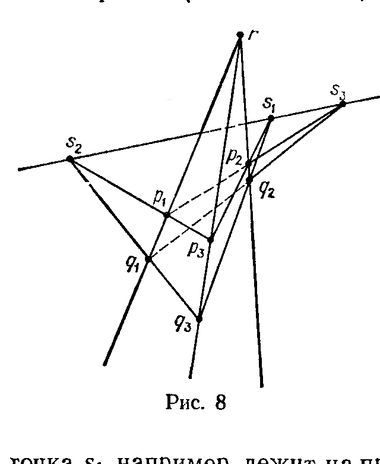
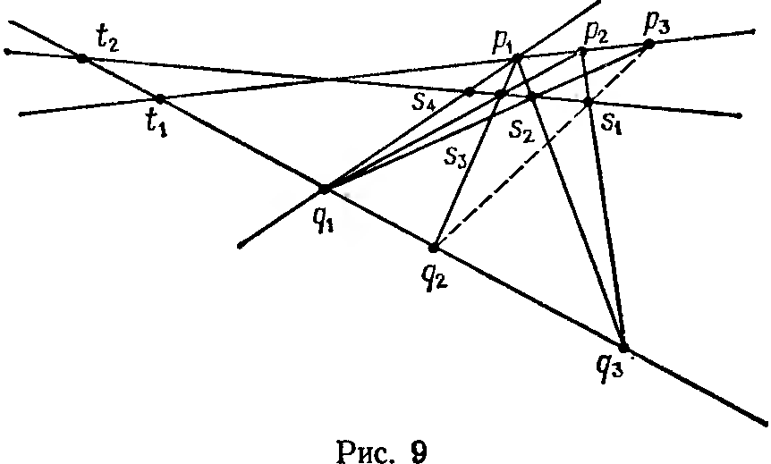

## 3.9. Конфигурации Дезарга и Паппа и классическая проективная геометрия

---
**стр. 239**
---

Иными словами, $\Gamma$ получается из $A$ «вклеиванием» целого проективного пространства $P^{n-1}$ вместо одной точки. Говорят, что $\Gamma$ получается из $A$ «раздуванием» (blowing up) точки, или $\sigma$-процессом с центром в точке $O$. Прообраз в $\Gamma$ каждой прямой в $A$, проходящей через точку $O$, пересекает вклеенное проективное пространство $P^{n-1}$ также по одной точке, но своей для каждой прямой. В случае $\mathcal{K}=\mathbb{R}$, $n=2$ можно представлять себе аффинную карту вклеенного проективного пространства $P_1$ как ось винта мясорубки $\Gamma$, делающего полоборота на протяжении своей бесконечной длины (рис. 7).

Реальное применение проекции к исследованию особенности в точке $O\in A$ связано с переносом интересующей нас фигуры с $A$ на $\Gamma$ и рассмотрению геометрии ее прообраза вблизи вклеенного пространства $P^{n-1}$. При этом, например, прообраз алгебраического многообразия будет алгебраичен благодаря тому, что $\Gamma$ задается алгебраическими уравнениями.

## § 9. Конфигурации Дезарга и Паппа и классическая проективная геометрия

**1.** Классическая синтетическая проективная геометрия была в значительной мере посвящена изучению семейства подпространств в проективном пространстве с отношением инцидентности; свойства этого отношения можно положить в основу аксиоматики и прийти затем к современному определению пространств $P(L)$ и поля скаляров $\mathcal{K}$ так, что $L$ и $\mathcal{K}$ появятся как производные структуры. В таком построении большую роль играют две конфигурации — Дезарга и Паппа. Мы введем и изучим их в рамках наших определений и затем вкратце опишем их роль в синтетической теории.

**2. Конфигурация Дезарга.** Пусть $S$ — семейство точек в проективном пространстве. Символом $\bar{S}$ мы будем обозначать его проективную оболочку. Рассмотрим в трехмерном проективном пространстве упорядоченную шестерку точек $(p_1,\ p_2,\ p_3;\ q_1,\ q_2,\ q_3)$. Предполагается, что точки попарно разные и что $\overline{p_1p_2p_3}$ и $\overline{q_1q_2q_3}$ суть плоскости. Далее, пусть прямые $\overline{p_1q_1}$, $\overline{p_2q_2}$ и $\overline{p_3q_3}$ пересекаются в одной точке $r$, отличной от $p_i$ и $q_j$. Иными словами, «треугольники» $\overline{p_1p_2p_3}$ и $\overline{q_1q_2q_3}$ «перспективны», и каждый из них есть проекция другого из центра $r$, если они лежат в разных плоскостях. Тогда для любой пары различных индексов $\{i,\ j\}\subset\{1,\ 2,\ 3\}$ прямые $\overline{p_ip_j}$ и $\overline{q_iq_j}$ не совпадают, иначе мы имели бы $p_i=q_i$, ибо $p_i$ и $q_i$ суть точки пересечения этих прямых с прямой $\overline{p_iq_i}$. Кроме того, прямые $\overline{p_ip_j}$ и $\overline{q_iq_j}$ лежат в общей плоскости $\overline{rp_ip_j}$. Поэтому они пересекаются в точке, которую мы обозначим $s_k$, где $\{i,\ j,\ k\}=\{1,\ 2,\ 3\}$: это точка пересечения продолжений пары соответствующих сторон треугольников $\overline{p_1p_2p_3}$ и $\overline{q_1q_2q_3}$.

Теорема Дезарга, которую мы докажем в следующем пункте, утверждает, что три точки $s_1,\ s_2,\ s_3$ лежат на одной прямой. Конфигурация, состоящая из десяти точек $p_i$, $q_j$, $s_k$, $r$ и десяти

---
**стр. 240**
---

соединяющих их прямых, показанных на рис. 8, называется *конфигурацией Дезарга*. Каждая ее прямая содержит ровно три ее точки, и через каждую ее точку проходят ровно три ее прямые. Читателю предлагается самостоятельно убедиться в том, что она по существу симметрична (в том смысле, что группа перестановок ее точек и прямых, сохраняющая отношения инцидентности, транзитивна как на точках, так и на прямых).

**3. Теорема Дезарга.** *В описанных выше условиях точки $s_1$, $s_2$, $s_3$ лежат на одной прямой.*

*Доказательство.* Мы разберем два случая в зависимости от того, совпадают плоскости $\overline{p_1p_2p_3}$ и $\overline{q_1q_2q_3}$ или нет.

а) $\overline{p_1p_2p_3}\neq\overline{q_1q_2q_3}$ («*пространственная теорема Дезарга*»). В этом случае плоскости $\overline{p_1p_2p_3}$ и $\overline{q_1q_2q_3}$ пересекаются по прямой, и нетрудно убедиться, что $s_1$, $s_2$, $s_3$ лежат на ней. Действительно, точка $s_1$, например, лежит на прямых $\overline{p_2p_3}$ и $\overline{q_2q_3}$, которые в свою очередь лежат в плоскостях $\overline{p_1p_2p_3}$ и $\overline{q_1q_2q_3}$ и, значит, в их пересечении.

б) $\overline{p_1p_2p_3}=\overline{q_1q_2q_3}$ («*плоская теорема Дезарга*»). В этом случае выберем в пространстве точку $r'$, не лежащую в плоскости $\overline{p_1p_2p_3}$, и соединим ее прямыми с точками $r$, $p_i$, $p_j$. В плоскости $\overline{r'p_1q_1}$ лежит прямая $\overline{p_1q_1}$ и, значит, точка $r$. Проведем в ней через $r$ прямую, не проходящую через точки $r'$ и $p_1$, и обозначим ее пересечения с прямыми $\overline{r'p_1}$, $\overline{r'q_1}$, через $p'_1$, $q'_1$ соответственно. Тройки $(p'_1,\ p_2,\ p_3)$ и $(q'_1,\ q_2,\ q_3)$ лежат уже в разных плоскостях — иначе содержащая их общая плоскость содержала бы прямые $\overline{p_2p_3}$ и $\overline{q_2q_3}$ и потому совпадала бы с $\overline{p_1p_2p_3}$, но это невозможно, ибо $p'_1$, $q'_1$ в этой начальной плоскости не лежат. Кроме того, прямые $\overline{p'_1q'_1}$, $\overline{p_2q_2}$ и $\overline{p_3q_3}$ проходят через точку $r$. В силу пространственной теоремы Дезарга точки $\overline{p'_1p_2}\cap\overline{q'_1q_2}$, $\overline{p'_1p_3}\cap\overline{q'_1q_3}$ и $\overline{p_2p_3}\cap\overline{q_2q_3}$ лежат на одной прямой. Но если спроектировать эти точки из $r'$ на плоскость $\overline{p_1p_2p_3}$, то получатся как раз $s_3$, $s_2$, $s_1$ соответственно, потому что $r'$ проектирует $(p'_1,\ p_2,\ p_3)$ в $(p_1,\ p_2,\ p_3)$ и $(q'_1,\ q_2,\ q_3)$ в $(q_1,\ q_2,\ q_3)$ и, значит, стороны каждого из этих треугольников в соответствующие стороны исходных треугольников.

Это завершает доказательство.

**4. Конфигурация Паппа.** Рассмотрим в проективной плоскости две разные прямые и две тройки лежащих на них попарно разных точек $p_1$, $p_2$, $p_3$ и $q_1$, $q_2$, $q_3$. Для любой пары различных индексов

---
**стр. 241**
---

$\{i,\,j\}\subset\{1,\,2,\,3\}$ построим точку $s_k=\overline{p_iq_j}\cap\overline{q_ip_j}$, где $\{i,\,j,\,k\}=\{1,\,2,\,3\}$.

**5. Теорема Паппа.** *Точки $s_1,\,s_2,\,s_3$ лежат на одной прямой.*

*Доказательство.* Проведём прямую через точки $s_3$, $s_2$ и обозначим через $s_4$ её пересечение с прямой $p_1q_1$. Наша цель состоит в доказательстве того, что $s_1$ лежит на ней.

Построим два проективных отображения $f_1,\,f_2\colon\overline{p_1p_2p_3}\to\overline{q_1q_2q_3}$.

Первое из них, $f_1$, будет композицией проекции $\overline{p_1p_2p_3}$ на $s_2s_3$ из точки $q_1$ с проекцией $s_3s_2$ на $\overline{q_1q_2q_3}$ из точки $p_1$. Очевидно, $f_1(p_i)=q_i$ для всех $i=1,\,2,\,3$, и, кроме того, $f_1(t_1)=t_2$, где $t_1=\overline{p_1p_2p_3}\cap\overline{q_1q_2q_3}$, $t_2=\overline{s_4s_3s_2}\cap\overline{q_1q_2q_3}$ (рис. 9).

Второе из них, $f_2$, будет композицией проекции $\overline{p_1p_2p_3}$ на $\overline{s_3s_2}$ из точки $q_2$ с проекцией $\overline{s_3s_2}$ на $\overline{q_1q_2q_3}$ из точки $p_2$. Эта композиция переводит $p_1$ в $q_1$, $p_2$ в $q_2$ и $t_1$ в $t_2$.

Поскольку $f_1$ и $f_2$ одинаково действуют на тройках точек $(t_1,\,p_1,\,p_2)$, они должны совпадать. В частности, $f_1(p_3)=f_2(p_3)$. Но $f_1(p_3)=q_3$. Значит, $f_2(p_3)=q_3$. Это утверждение геометрически означает следующее: если обозначить через $s_1'$ пересечение $\overline{q_2p_3}\cap\overline{s_3s_2}$, то прямая $\overline{p_2q_3}$ проходит через $s_1'$. Но тогда $s_1'=\overline{q_2p_3}\cap\overline{p_2q_3}=s_1$. Значит, $s_1$ лежит на $\overline{s_2s_3}$, что и требовалось доказать.

**6. Классические аксиомы трёхмерного проективного пространства и проективной плоскости.** Классическое трёхмерное проективное пространство определяется как множество, элементы которого называются точками, снабжённое двумя системами подмножеств, элементы которых называются соответственно прямыми и плоскостями. При этом должны выполняться следующие аксиомы.

**T₁.** Две разные точки принадлежат единственной прямой.

**T₂.** Три разные точки, не лежащие на одной прямой, принадлежат единственной плоскости.

**T₃.** Прямая и плоскость имеют общую точку.

**T₄.** Пересечение двух плоскостей содержит прямую.

**T₅.** Существуют четыре точки, не лежащие в одной плоскости и такие, что любые три из них не лежат на одной прямой.

**T₆.** Каждая прямая состоит не менее чем из трёх точек.

---
**стр. 242**
---

Классическая проективная плоскость определяется как множество, элементы которого называются точками, снабжённое системой подмножеств, элементы которой называются прямыми. При этом должны выполняться следующие аксиомы.

**П₁.** Две разные точки принадлежат единственной прямой.

**П₂.** Пересечение двух прямых непусто.

**П₃.** Существуют три точки, не лежащие на одной прямой.

**П₄.** Каждая прямая состоит не менее чем из трёх точек.

Множества $P(L)$, где $L$ — линейное пространство над полем $\mathcal{K}$ размерности 4 или 3, вместе с системами проективных плоскостей и прямых в них, как они были введены выше, удовлетворяют аксиомам $\mathrm{T}_1$—$\mathrm{T}_6$ и $\mathrm{П}_1$—$\mathrm{П}_4$ соответственно, что немедленно следует из стандартных свойств линейных пространств, доказанных в ч. 1. Однако не всякое классическое проективное пространство или плоскость изоморфно (в очевидном смысле слова) одному из наших пространств $P(L)$. Следующая фундаментальная конструкция даёт много новых примеров.

**7. Линейные и проективные пространства над телами.** *Телом* (или не обязательно коммутативным полем) называется ассоциативное кольцо $K$, множество ненулевых элементов которого образуют группу по умножению (не обязательно коммутативную). Все поля являются телами, но обратное неверно. Например, кольцо классических кватернионов является телом, но не полем.

Аддитивная группа $L$ вместе с бинарным законом умножения $K\times L\to L\colon\;(a,\,l)\mapsto al$ называется (левым) *линейным пространством над телом* $K$, если выполнены условия определения п. 2 § 1 ч. 1. Значительная часть теории линейных пространств над полями почти без изменений переносится на линейные пространства над телами. В частности, это относится к теории размерности и базиса и теории подпространств, включая теорему о размерности пересечения. Это позволяет построить по каждому телу $K$ и линейному пространству $L$ над ним проективное пространство $P(L)$, состоящее из прямых в $L$, и систему его проективных подпространств $P(M)$, где $M\subset L$ пробегает линейные подпространства разных размерностей. Когда $\dim_K L=4$ или 3, эти объекты удовлетворяют всем аксиомам $\mathrm{T}_1$—$\mathrm{T}_6$ и $\mathrm{П}_1$—$\mathrm{П}_4$ соответственно.

**8. Роль теоремы Дезарга.** Оказывается, однако, что существуют классические проективные плоскости, не изоморфные даже никакой плоскости вида $P(L)$, где $L$ — трёхмерное линейное пространство над каким-нибудь телом. Причина этого состоит в том, что в проективных плоскостях вида $P(L)$ теорема Дезарга по-прежнему верна, тогда как существуют недезарговы плоскости, где она не выполняется. Сформулируем без доказательства следующий результат:

**9. Теорема.** *Три свойства классической проективной плоскости равносильны:*

а) *В ней выполняется плоская теорема Дезарга.*

б) *Её можно вложить в классическое проективное пространство,*
