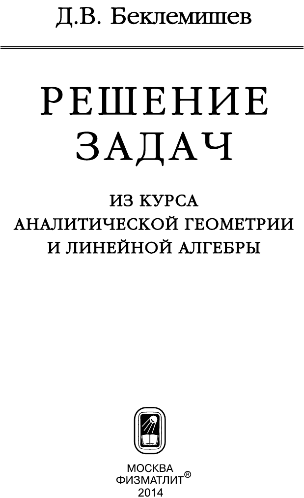

# ВСТУПИТЕЛЬНЫЕ МАТЕРИАЛЫ

## Вступительные материалы

---
**стр. 1**
---

Д.В. Беклемишев

**РЕШЕНИЕ**
**ЗАДАЧ**

**ИЗ КУРСА АНАЛИТИЧЕСКОЙ**
**ГЕОМЕТРИИ И ЛИНЕЙНОЙ**
**АЛГЕБРЫ**

МОСКВА
ФИЗМАТЛИТ®
2014

---
**стр. 2**
---

УДК 514
ББК 22.151
Б 42

Б е к л е м и ш е в Д. В. **Решение задач из курса аналитической геометрии и линейной алгебры.** — М.: ФИЗМАТЛИТ, 2014. — 192 с. — ISBN 978-5-9221-1480-6.

В пособии представлены решения задач из «Курса аналитической геометрии и линейной алгебры» Д.В. Беклемишева. Расположение задач соответствует главам и параграфам учебника, в решениях используются только сведения, изложенные в соответствующих разделах учебника.

Для студентов высших учебных заведений.

Учебное издание

*БЕКЛЕМИШЕВ Дмитрий Владимирович*

**РЕШЕНИЕ ЗАДАЧ**
**ИЗ КУРСА АНАЛИТИЧЕСКОЙ ГЕОМЕТРИИ И ЛИНЕЙНОЙ**
**АЛГЕБРЫ**

Редактор *Н.Б. Бартошевич-Жагель*
Оригинал-макет: *Д.В. Горбачев*
Оформление переплета: *Д.Б. Белуха*

Подписано в печать 14.10.2013. Формат $60\times90/16$. Бумага офсетная. Печать офсетная.
Усл. печ. л. 12. Уч.-изд. л. 13,2. Тираж 500 экз. Заказ №

Издательская фирма «Физико-математическая литература»
МАИК «Наука/Интерпериодика»
117997, Москва, ул. Профсоюзная, 90
E-mail: fizmat@maik.ru, fmlsale@maik.ru;
http://www.fml.ru

Отпечатано с электронных носителей
в ГУП Чувашской Республики «ИПК «Чувашия»,
Мининформполитики Чувашии,
428019 г. Чебоксары, пр-т И. Яковлева, 13

ISBN 978-5-9221-1480-6

ISBN 978-5-9221-1480-6

9 785922 114806

© ФИЗМАТЛИТ, 2014
© Д. В. Беклемишев, 2014

---
**стр. 3**
---

# ОГЛАВЛЕНИЕ

Предисловие 4
Глава I § 1 5
Глава I § 2 8
Глава I § 3 9
Глава I § 4 11
Глава I § 5 14
Глава II § 1 18
Глава II § 2 21
Глава II § 3 26
Глава III § 1 34
Глава III § 2 39
Глава III § 3 46
Глава III § 4 51
Глава IV § 1 57
Глава IV § 2 58
Глава IV § 3 65
Глава V § 1 72
Глава V § 2 75
Глава V § 3 80
Глава V § 4 85
Глава V § 5 90
Глава V § 6 91
Глава VI § 1 97
Глава VI § 2 101
Глава VI § 3 106
Глава VI § 4 111
Глава VI § 5 119
Глава VI § 6 121
Глава VI § 7 128
Глава VII § 1 135
Глава VII § 2 144
Глава VII § 3 161
Глава VII § 4 169
Глава VIII § 1 174
Глава VIII § 2 176
Глава IX § 1 182
Глава IX § 2 186
Глава IX § 3 187

---
**стр. 4**
---

# ПРЕДИСЛОВИЕ

В этом пособии представлены решения задач из моего учебника «Курс аналитической геометрии и линейной алгебры», а также немногих других задач, которые мне показались полезными. Эти задачи отмечены звездочками.

Расположение задач соответствует главам и параграфам учебника, и в решениях используются только те сведения, которые изложены в соответствующих разделах. Поэтому читатель в ряде случаев сможет заметить, что, используя более продвинутые методы, можно существенно улучшить решение.

Все необходимые факты используются в том виде, в котором они приведены в учебнике. Кроме того, выражение «как известно» или любое эквивалентное можно рассматривать как неявную ссылку на учебник. Ссылки на теоремы или формулы, которые отсылают к учебнику, начинаются с буквы «К».

Людмила Анатольевна Беклемишева и Тамара Харитоновна Яковлева прочитали рукопись. Я очень благодарен им за сделанные замечания.
