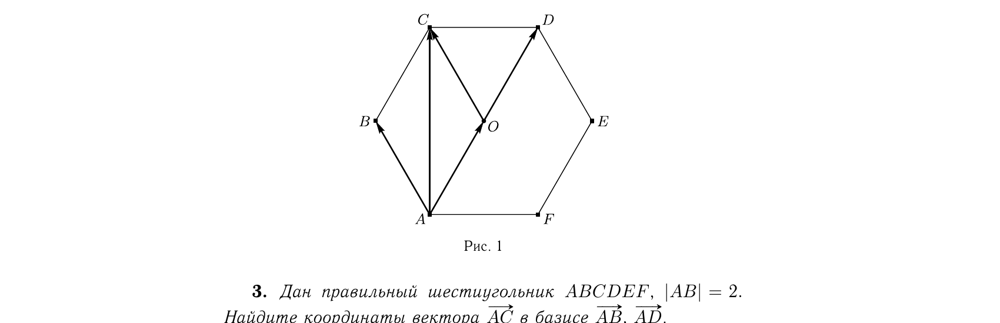

# Глава I

## § 1

---
**стр. 5**
---

Решения упражнений к [[../beklemishev/bekl_g01_s01_vektory|Беклемишев, §1. Векторы]] (упражнения 1–5, стр. 15–16 учебника).

**1.** *Укажите на плоскости три таких вектора, по которым любой вектор этой плоскости может быть разложен с положительными коэффициентами.*

Решение. Выберем векторы $\mathbf{a}$, $\mathbf{b}$ и $\mathbf{c}$ одинаковыми по длине и такими, чтобы каждый из них составлял с остальными углы, равные $2\pi/3$.

Нетрудно проверить, что $\mathbf{a}+\mathbf{b}+\mathbf{c}=\mathbf{0}$. Тогда, если $\mathbf{x}=\alpha\mathbf{a}+\beta\mathbf{b}+\gamma\mathbf{c}$ — какое-либо разложение вектора $\mathbf{x}$, то верно и равенство $\mathbf{x}=\alpha\mathbf{a}+\beta\mathbf{b}+\gamma\mathbf{c}+\lambda(\mathbf{a}+\mathbf{b}+\mathbf{c})$ при любом $\lambda$. Ясно, что при $\lambda > \max\{|\alpha|,|\beta|,|\gamma|\}$ коэффициенты последнего разложения будут положительными.

> [!note] Наше дополнение — почему это верно
> Прибавление $\lambda(\mathbf{a}+\mathbf{b}+\mathbf{c})$ — это прибавление нуля, значение $\mathbf{x}$ не меняется, но коэффициенты сдвигаются: $\mathbf{x} = (\alpha+\lambda)\mathbf{a} + (\beta+\lambda)\mathbf{b} + (\gamma+\lambda)\mathbf{c}$.
>
> Чтобы все три новых коэффициента стали положительными, нужно: $\lambda > -\alpha$, $\lambda > -\beta$, $\lambda > -\gamma$ одновременно, т. е. точное условие — $\lambda > \max(-\alpha,-\beta,-\gamma)$.
>
> В решении вместо этого написано $\lambda > \max(|\alpha|,|\beta|,|\gamma|)$ — с модулями. Это не то же самое число, а более грубая, но безопасная оценка сверху: для любого вещественного $t$ всегда $|t| \geqslant -t$ (при $t\geqslant0$ это $-t\leqslant0\leqslant t=|t|$; при $t<0$ — равенство $|t|=-t$). Значит $|\alpha|\geqslant-\alpha$, $|\beta|\geqslant-\beta$, $|\gamma|\geqslant-\gamma$, и поэтому $\max(|\alpha|,|\beta|,|\gamma|) \geqslant \max(-\alpha,-\beta,-\gamma)$. Взяв $\lambda$ больше первого (большего) числа, автоматически берём его больше и второго (меньшего или равного) — то есть больше каждого из $-\alpha,-\beta,-\gamma$ по отдельности, без разбора случаев по знакам.
>
> Итог: какие бы (в том числе отрицательные) коэффициенты ни дало исходное разложение, всегда найдётся $\lambda$ с запасом, которое одновременно продавит все три коэффициента в положительную область — поэтому такая тройка векторов годится для разложения любого вектора плоскости исключительно положительными коэффициентами.

Таким образом, каждый вектор (в том числе и нулевой) может быть разложен с положительными коэффициентами.

Здесь видно также и условие, при котором по какой-либо тройке векторов можно разложить любой вектор с положительными коэффициентами. Именно, необходимо и достаточно, чтобы она была линейно зависимой и коэффициенты нулевой линейной комбинации были положительными.

**2.** *Докажите, что точка $C$ лежит на отрезке $AB$ тогда и только тогда, когда существует число $\lambda \in [0,1]$, такое что для любой точки $O$ выполнено $\overrightarrow{OC} = \lambda\overrightarrow{OB}+(1-\lambda)\overrightarrow{OA}$. Если $\lambda$ дано, то в каком отношении точка $C$ делит отрезок?*

Решение. Точка $C$ лежит на отрезке $AB$ тогда и только тогда, когда $\overrightarrow{AC} = \lambda\overrightarrow{AB}$, где $\lambda \in [0,1]$. Выберем какую-нибудь точку $O$. Тогда $\overrightarrow{OC} = \overrightarrow{OA}+\lambda\overrightarrow{AB}$, а $\overrightarrow{AB} = \overrightarrow{OB}-\overrightarrow{OA}$. Поэтому $\overrightarrow{OC} = \overrightarrow{OA}+\lambda(\overrightarrow{OB}-\overrightarrow{OA})$. Это равносильно доказываемому равенству.

Ясно, что $\overrightarrow{CB} = (1-\lambda)\overrightarrow{AB}$. Значение $\lambda=1$ соответствует $C=B$. При $\lambda \neq 1$
$$\frac{|AC|}{|CB|} = \frac{\lambda|\overrightarrow{AB}|}{(1-\lambda)|\overrightarrow{AB}|} = \frac{\lambda}{1-\lambda}.$$

---
**стр. 6**

---

**3.** *Дан правильный шестиугольник $ABCDEF$, $|AB|=2$. Найдите координаты вектора $\overrightarrow{AC}$ в базисе $\overrightarrow{AB}, \overrightarrow{AD}$.*

Решение. Пусть точка $O$ — центр шестиугольника. Как видно из рис. 1, $\overrightarrow{AC} = \overrightarrow{AO}+\overrightarrow{OC} = \frac{1}{2}\overrightarrow{AD}+\overrightarrow{AB}$. Следовательно, искомые координаты $\left(1, \frac{1}{2}\right)$.

Обратим внимание на то, что результат не зависит от длины стороны шестиугольника. Координаты никогда не зависят от выбора единицы измерения длин.

**4.** *В некотором базисе на плоскости заданы координаты векторов $\mathbf{a}(1,2)$, $\mathbf{b}(2,3)$ и $\mathbf{c}(-1,1)$. Проверьте, что $\mathbf{a}$ и $\mathbf{b}$ линейно независимы. Найдите координаты $\mathbf{c}$ в базисе $\mathbf{a}, \mathbf{b}$.*

Решение. Рассмотрим линейную комбинацию векторов $\mathbf{a}$ и $\mathbf{b}$, равную нулевому вектору: $\alpha\mathbf{a}+\beta\mathbf{b}=\mathbf{0}$. Это векторное равенство равносильно двум равенствам, связывающим их координаты: $\alpha \cdot 1+\beta \cdot 2=0$ и $\alpha \cdot 2+\beta \cdot 3=0$. Умножим первое равенство на 2 и вычтем из второго. Так мы найдем, что $\beta=0$. Подставляя это в первое равенство, видим, что и $\alpha=0$. Таким образом, из обращения в нуль линейной комбинации следует, что ее коэффициенты равны нулю. Векторы линейно независимы.

Пусть $\mathbf{c}=x\mathbf{a}+y\mathbf{b}$. Это равенство равносильно системе линейных уравнений с неизвестными $x$ и $y$:
$$x+2y=-1,$$
$$2x+3y=1.$$

---
**стр. 7**

---

Подставим $x=-1-2y$ из первого уравнения во второе и найдем, что $y=-3$. Следовательно, решение системы $x=5$; $y=-3$, и $\mathbf{c}=5\mathbf{a}-3\mathbf{b}$.

**5.** *Даны три точки $A$, $B$ и $C$. Найдите такую точку $O$, что $\overrightarrow{OA}+\overrightarrow{OB}+\overrightarrow{OC}=\mathbf{0}$. Решив аналогичную задачу для четырех точек, докажите, что в треугольной пирамиде отрезки, соединяющие вершины с центрами тяжести противоположных граней, пересекаются в одной точке.*

Решение. Пусть такая точка $O$ существует. Тогда для произвольной точки $P$ выполнено равенство
$$\overrightarrow{PA}+\overrightarrow{PB}+\overrightarrow{PC} = 3\overrightarrow{PO}+\overrightarrow{OA}+\overrightarrow{OB}+\overrightarrow{OC} = 3\overrightarrow{PO}. \quad (1)$$

> [!note] Наше дополнение — откуда берётся равенство (1)
> Первое равенство — чистая алгебра, применение тождества $\overrightarrow{PO}+\overrightarrow{OX}=\overrightarrow{PX}$ (правило треугольника) отдельно к $X=A,B,C$ через общую точку $O$:
> $$\overrightarrow{PA} = \overrightarrow{PO}+\overrightarrow{OA}, \quad \overrightarrow{PB} = \overrightarrow{PO}+\overrightarrow{OB}, \quad \overrightarrow{PC} = \overrightarrow{PO}+\overrightarrow{OC}.$$
> Складывая эти три равенства почленно, получаем $\overrightarrow{PA}+\overrightarrow{PB}+\overrightarrow{PC} = 3\overrightarrow{PO}+(\overrightarrow{OA}+\overrightarrow{OB}+\overrightarrow{OC})$ — это верно для любой точки $P$, геометрия здесь ещё не используется.
>
> Второе равенство (переход к $3\overrightarrow{PO}$) уже использует условие задачи: точка $O$ по предположению выбрана так, что $\overrightarrow{OA}+\overrightarrow{OB}+\overrightarrow{OC}=\mathbf{0}$ (это и есть искомое свойство $O$, о котором говорится в первой фразе решения). Подставляя это, скобка обнуляется, и остаётся $\overrightarrow{PA}+\overrightarrow{PB}+\overrightarrow{PC} = 3\overrightarrow{PO}$.
>
> Далее в решении подставляется конкретное $P=A$, что и даёт формулу (2).

Положив $P=A$, мы получим
$$\overrightarrow{AO} = \frac{1}{3}(\overrightarrow{AB}+\overrightarrow{AC}), \quad (2)$$

откуда следует, что такой точкой $O$ может быть только точка пересечения медиан $\triangle ABC$.

> [!note] Наше дополнение — почему $O$ обязательно точка пересечения медиан
> Из формулы (2): $\overrightarrow{AO} = \frac{1}{3}(\overrightarrow{AB}+\overrightarrow{AC})$. Обозначим через $D$ середину стороны $BC$, тогда $\overrightarrow{AD} = \frac{1}{2}(\overrightarrow{AB}+\overrightarrow{AC})$. Обе формулы содержат одну и ту же сумму, поэтому $\overrightarrow{AO} = \frac{2}{3}\overrightarrow{AD}$.
>
> Это даёт сразу три вещи: (1) $\overrightarrow{AO}$ и $\overrightarrow{AD}$ коллинеарны — значит $O$ лежит на прямой $AD$, то есть на медиане из вершины $A$; (2) коэффициент $2/3 \in (0,1)$ — значит $O$ лежит между $A$ и $D$, внутри отрезка; (3) поскольку $\overrightarrow{OD} = \overrightarrow{AD}-\overrightarrow{AO} = \frac{1}{3}\overrightarrow{AD}$, отношение $AO:OD = 2:1$. Итог: $O$ делит медиану $AD$ в отношении $2:1$, считая от вершины $A$.
>
> Это показано только для одной медианы. Но условие $\overrightarrow{OA}+\overrightarrow{OB}+\overrightarrow{OC}=\mathbf{0}$ симметрично относительно $A$, $B$, $C$ — тот же вывод с $P=B$ (через $E$ — середину $AC$) даёт $\overrightarrow{BO} = \frac{2}{3}\overrightarrow{BE}$, а с $P=C$ (через $F$ — середину $AB$) даёт $\overrightarrow{CO} = \frac{2}{3}\overrightarrow{CF}$.
>
> Значит $O$ одновременно лежит на всех трёх медианах, деля каждую в отношении $2:1$ от вершины. По стандартному факту элементарной геометрии медианы треугольника пересекаются в одной точке — а значит такая $O$ может быть только этой точкой пересечения медиан.
>
> Альтернативная проверка через радиус-векторы: если $\mathbf a,\mathbf b,\mathbf c$ — радиус-векторы вершин, а $\mathbf o$ — искомой точки, то $\overrightarrow{OA}=\mathbf a-\mathbf o$ и аналогично для $B$, $C$; условие $\overrightarrow{OA}+\overrightarrow{OB}+\overrightarrow{OC}=\mathbf 0$ даёт $\mathbf o = \frac{1}{3}(\mathbf a+\mathbf b+\mathbf c)$ — стандартная формула центроида.

С другой стороны, если $O$ — центр тяжести $\triangle ABC$, то $\overrightarrow{OB}+\overrightarrow{OC}=2\overrightarrow{OD}$, где $D$ — середина стороны $BC$. Но и $\overrightarrow{AO}=2\overrightarrow{OD}$. Отсюда $\overrightarrow{OB}+\overrightarrow{OC}+\overrightarrow{OA}=\mathbf{0}$. Таким образом, точка $O$ пересечения медиан $\triangle ABC$ — единственная точка, удовлетворяющая условию задачи.

> [!note] Наше дополнение — разбор обратного доказательства
> Выше доказана необходимость: если такая $O$ существует, она обязана быть центром тяжести. Этот абзац доказывает достаточность: если $O$ — центр тяжести, то она удовлетворяет условию $\overrightarrow{OA}+\overrightarrow{OB}+\overrightarrow{OC}=\mathbf{0}$. Вместе это даёт единственность.
>
> **Откуда $\overrightarrow{OB}+\overrightarrow{OC}=2\overrightarrow{OD}$.** Это общий факт про середину отрезка, справедливый для любой точки $O$ (пока никак не связанной с центром тяжести) и $D$ — середины $BC$: $\overrightarrow{OD} = \overrightarrow{OB}+\overrightarrow{BD} = \overrightarrow{OB}+\frac{1}{2}\overrightarrow{BC} = \overrightarrow{OB}+\frac{1}{2}(\overrightarrow{OC}-\overrightarrow{OB}) = \frac{1}{2}(\overrightarrow{OB}+\overrightarrow{OC})$, откуда $\overrightarrow{OB}+\overrightarrow{OC}=2\overrightarrow{OD}$.
>
> **Откуда $\overrightarrow{AO}=2\overrightarrow{OD}$.** А вот это уже использует то, что $O$ — центр тяжести. Как показано в предыдущем примечании, $O$ делит медиану $AD$ в отношении $AO:OD=2:1$ считая от вершины $A$, причём $\overrightarrow{AO}$ и $\overrightarrow{OD}$ сонаправлены (лежат на одной медиане, по одну сторону движения от $A$ к $D$). Отсюда как векторное равенство $\overrightarrow{AO}=2\overrightarrow{OD}$.
>
> **Собираем.** Правые части обоих равенств совпадают ($2\overrightarrow{OD}$), значит совпадают и левые: $\overrightarrow{OB}+\overrightarrow{OC}=\overrightarrow{AO}$. Так как $\overrightarrow{AO}=-\overrightarrow{OA}$, получаем $\overrightarrow{OB}+\overrightarrow{OC}-\overrightarrow{OA}=\mathbf{0}$, то есть $\overrightarrow{OA}+\overrightarrow{OB}+\overrightarrow{OC}=\mathbf{0}$ — то самое исходное условие, но выведенное уже из предположения, что $O$ — центр тяжести.

Теперь пусть даны четыре точки $A$, $B$, $C$ и $D$. Если $Q$ — центр тяжести $\triangle ABC$, то, полагая в равенстве (1) $P=D$ (и $O=Q$), мы получим
$$\overrightarrow{DQ} = \frac{1}{3}(\overrightarrow{DA}+\overrightarrow{DB}+\overrightarrow{DC}).$$

Допустим, что существует точка $O$, для которой
$$\overrightarrow{OA}+\overrightarrow{OB}+\overrightarrow{OC}+\overrightarrow{OD}=\mathbf{0}. \quad (3)$$

Тогда аналогично формуле (2) находим, что
$$\overrightarrow{DO} = \frac{1}{4}(\overrightarrow{DA}+\overrightarrow{DB}+\overrightarrow{DC}). \quad (4)$$

> [!note] Наше дополнение — откуда берётся равенство (4)
> Напомним, как была получена формула (2). Там был общий факт (равенство (1)): для любой точки $P$ выполнено $\overrightarrow{PA}+\overrightarrow{PB}+\overrightarrow{PC} = 3\overrightarrow{PO}+(\overrightarrow{OA}+\overrightarrow{OB}+\overrightarrow{OC}) = 3\overrightarrow{PO}$ — правая часть упрощается до $3\overrightarrow{PO}$ именно потому, что по условию задачи $\overrightarrow{OA}+\overrightarrow{OB}+\overrightarrow{OC}=\mathbf{0}$. Далее в решение подставили $P=A$. Слева получилось $\overrightarrow{AA}+\overrightarrow{AB}+\overrightarrow{AC}$. Но $\overrightarrow{AA}$ — вектор из точки $A$ в саму себя, то есть нулевой вектор. Поэтому осталось $\overrightarrow{AB}+\overrightarrow{AC} = 3\overrightarrow{AO}$, откуда $\overrightarrow{AO} = \frac{1}{3}(\overrightarrow{AB}+\overrightarrow{AC})$ — это и есть формула (2).
>
> Здесь для четырёх точек повторяется тот же трюк. Условие (3) — это $\overrightarrow{OA}+\overrightarrow{OB}+\overrightarrow{OC}+\overrightarrow{OD}=\mathbf{0}$ (аналог прежнего условия, но для четырёх точек и точки $O$, которая уже не центроид треугольника, а «центроид» четырёх точек $A,B,C,D$). По той же схеме, что и для (1) (правило треугольника $\overrightarrow{PO}+\overrightarrow{OX}=\overrightarrow{PX}$ для каждой из четырёх точек $X=A,B,C,D$ через общую точку $O$, затем сложение этих четырёх равенств почленно), для любой точки $P$ получаем аналог равенства (1):
> $$\overrightarrow{PA}+\overrightarrow{PB}+\overrightarrow{PC}+\overrightarrow{PD} = 4\overrightarrow{PO} + (\overrightarrow{OA}+\overrightarrow{OB}+\overrightarrow{OC}+\overrightarrow{OD}) = 4\overrightarrow{PO}$$
> — снова правая скобка обнуляется, на этот раз по условию (3).
>
> Теперь, по аналогии с тем, как раньше подставляли $P=A$, здесь подставляем $P=D$. Слева: $\overrightarrow{DA}+\overrightarrow{DB}+\overrightarrow{DC}+\overrightarrow{DD}$. Но $\overrightarrow{DD}$ — вектор из $D$ в саму себя, то есть снова нулевой вектор. Значит $\overrightarrow{DA}+\overrightarrow{DB}+\overrightarrow{DC} = 4\overrightarrow{DO}$, откуда $\overrightarrow{DO} = \frac{1}{4}(\overrightarrow{DA}+\overrightarrow{DB}+\overrightarrow{DC})$ — это и есть формула (4).
>
> Сопоставление шагов: у трёх точек условие $\overrightarrow{OA}+\overrightarrow{OB}+\overrightarrow{OC}=\mathbf{0}$ даёт общую формулу $\overrightarrow{PA}+\overrightarrow{PB}+\overrightarrow{PC}=3\overrightarrow{PO}$, подстановка $P=A$ (одна из самих трёх точек) обнуляет слагаемое $\overrightarrow{AA}$ и даёт (2). У четырёх точек условие (3) даёт общую формулу $\overrightarrow{PA}+\overrightarrow{PB}+\overrightarrow{PC}+\overrightarrow{PD}=4\overrightarrow{PO}$, подстановка $P=D$ (одна из самих четырёх точек) обнуляет слагаемое $\overrightarrow{DD}$ и даёт (4). Меняются только число точек (3→4) и коэффициент ($1/3\to 1/4$), сама логика вывода — тождественна.

Поэтому $\overrightarrow{DO}=(3/4)\overrightarrow{DQ}$, и такой точкой $O$ может быть только точка на отрезке $DQ$, делящая его в отношении $3:1$.

> [!note] Наше дополнение — откуда $\overrightarrow{DO}=(3/4)\overrightarrow{DQ}$ и что это значит
> **Алгебра.** У нас уже есть два готовых выражения через одну и ту же сумму $\overrightarrow{DA}+\overrightarrow{DB}+\overrightarrow{DC}$: из первого шага (подстановка $P=D$, $O=Q$ в равенство (1)) — $\overrightarrow{DQ} = \frac{1}{3}(\overrightarrow{DA}+\overrightarrow{DB}+\overrightarrow{DC})$; из формулы (4) — $\overrightarrow{DO} = \frac{1}{4}(\overrightarrow{DA}+\overrightarrow{DB}+\overrightarrow{DC})$. Из первого выражаем сумму: $\overrightarrow{DA}+\overrightarrow{DB}+\overrightarrow{DC} = 3\overrightarrow{DQ}$. Подставляем во второе: $\overrightarrow{DO} = \frac{1}{4}\cdot 3\overrightarrow{DQ} = \frac{3}{4}\overrightarrow{DQ}$. Равенство получается прямой подстановкой, без новой геометрии — приём тот же, что уже использовался при выводе $\overrightarrow{AO}=\frac{2}{3}\overrightarrow{AD}$.
>
> **Геометрия.** $\overrightarrow{DO}$ — вектор из точки $D$ в точку $O$; $\overrightarrow{DQ}$ — вектор из той же точки $D$ в $Q$, центр тяжести грани $ABC$. Равенство $\overrightarrow{DO} = \frac{3}{4}\overrightarrow{DQ}$ говорит ровно то же самое, что раньше говорило $\overrightarrow{AO}=\frac{2}{3}\overrightarrow{AD}$, только с другим коэффициентом: (1) $\overrightarrow{DO}$ и $\overrightarrow{DQ}$ коллинеарны — значит $O$ лежит на прямой $DQ$, то есть на отрезке, соединяющем вершину $D$ тетраэдра с центром тяжести противоположной грани $ABC$; (2) коэффициент $3/4 \in (0,1)$ — значит $O$ лежит между $D$ и $Q$, внутри отрезка, а не на продолжении; (3) поскольку $\overrightarrow{OQ} = \overrightarrow{DQ}-\overrightarrow{DO} = \frac{1}{4}\overrightarrow{DQ}$, отношение $DO:OQ = 3:1$. Итог: $O$ делит отрезок $DQ$ в отношении $3:1$, считая от вершины $D$.
>
> **Почему «только».** Слово «только» здесь того же типа, что и в трёхточечном случае: формула (4) выведена из предположения, что искомая точка $O$ существует и удовлетворяет условию (3) — это необходимое условие. Если такая $O$ вообще есть, деться ей больше некуда: она обязана лежать именно на этом отрезке и делить его именно в этом отношении. (Достаточность — что взятая так точка $O$ действительно удовлетворяет (3) — доказывается в следующем абзаце решения, симметрично тому, как это было для трёх точек.)

С другой стороны, пусть $O$ — это точка на отрезке $DQ$, делящая его в отношении $3:1$, т. е. $\overrightarrow{DO}=(3/4)\overrightarrow{DQ}$. Тогда $O$

---
**стр. 8**

---

удовлетворяет равенству (4). Подставим в него $\overrightarrow{DA}=\overrightarrow{DO}+\overrightarrow{OA}$, $\overrightarrow{DB}=\overrightarrow{DO}+\overrightarrow{OB}$ и $\overrightarrow{DC}=\overrightarrow{DO}+\overrightarrow{OC}$. Мы получим
$$4\overrightarrow{DO} = 3\overrightarrow{DO}+\overrightarrow{OA}+\overrightarrow{OB}+\overrightarrow{OC}.$$

Это равносильно доказываемому равенству (3).

> [!note] Наше дополнение — разбор доказательства достаточности для четырёх точек
> Это симметричный аналог того, что уже разбиралось для треугольника (там: если $O$ — центр тяжести, то $\overrightarrow{OB}+\overrightarrow{OC}=2\overrightarrow{OD}$ и $\overrightarrow{AO}=2\overrightarrow{OD}$ вместе дают $\overrightarrow{OA}+\overrightarrow{OB}+\overrightarrow{OC}=\mathbf{0}$). Здесь та же роль, но для тетраэдра: если $O$ — точка на $DQ$, делящая его $3:1$, то $O$ действительно удовлетворяет условию (3).
>
> **Почему $O$ «удовлетворяет равенству (4)» — это не новое условие, а автоматическое следствие.** Равенство $\overrightarrow{DQ} = \frac{1}{3}(\overrightarrow{DA}+\overrightarrow{DB}+\overrightarrow{DC})$ выполняется безусловно, просто по определению $Q$ как центра тяжести $\triangle ABC$ (получено ещё до введения условия (3), из равенства (1) при $P=D$, $O=Q$). Значит, если $O$ задана как точка с $\overrightarrow{DO}=\frac{3}{4}\overrightarrow{DQ}$, можно сразу подставить: $\overrightarrow{DO} = \frac{3}{4}\cdot\frac{1}{3}(\overrightarrow{DA}+\overrightarrow{DB}+\overrightarrow{DC}) = \frac{1}{4}(\overrightarrow{DA}+\overrightarrow{DB}+\overrightarrow{DC})$ — а это в точности формула (4). То есть (4) выполняется для такой $O$ автоматически, просто из геометрического определения точки (3:1 на отрезке $DQ$); условие (3) для этого пока не требовалось.
>
> **Переписываем (4) без дробей.** Умножим (4) на 4: $4\overrightarrow{DO} = \overrightarrow{DA}+\overrightarrow{DB}+\overrightarrow{DC}$.
>
> **Раскладываем через общую точку $O$ (правило треугольника).** Это тот же приём, что и в самом начале решения: для любой точки $X$ верно $\overrightarrow{DX} = \overrightarrow{DO}+\overrightarrow{OX}$. Применяем к $A$, $B$, $C$: $\overrightarrow{DA}=\overrightarrow{DO}+\overrightarrow{OA}$, $\overrightarrow{DB}=\overrightarrow{DO}+\overrightarrow{OB}$, $\overrightarrow{DC}=\overrightarrow{DO}+\overrightarrow{OC}$.
>
> **Подставляем.** $\overrightarrow{DA}+\overrightarrow{DB}+\overrightarrow{DC} = 3\overrightarrow{DO}+(\overrightarrow{OA}+\overrightarrow{OB}+\overrightarrow{OC})$. Левая часть равна $4\overrightarrow{DO}$, поэтому получаем ровно то, что написано в решении: $4\overrightarrow{DO} = 3\overrightarrow{DO}+\overrightarrow{OA}+\overrightarrow{OB}+\overrightarrow{OC}$.
>
> **Заканчиваем.** Вычитаем $3\overrightarrow{DO}$ из обеих частей: $\overrightarrow{DO} = \overrightarrow{OA}+\overrightarrow{OB}+\overrightarrow{OC}$. Но $\overrightarrow{DO} = -\overrightarrow{OD}$, значит $-\overrightarrow{OD} = \overrightarrow{OA}+\overrightarrow{OB}+\overrightarrow{OC}$, откуда $\overrightarrow{OA}+\overrightarrow{OB}+\overrightarrow{OC}+\overrightarrow{OD}=\mathbf{0}$ — это и есть равенство (3).
>
> **Итог.** Вместе с ранее доказанной необходимостью (из (3) выводится, что $O$ обязана быть именно этой точкой на $DQ$) это даёт полную эквивалентность: точка $O$, для которой $\overrightarrow{OA}+\overrightarrow{OB}+\overrightarrow{OC}+\overrightarrow{OD}=\mathbf{0}$, существует, единственна и совпадает с точкой, делящей отрезок $DQ$ в отношении $3:1$ от вершины $D$.

В равенство (3), однозначно определяющее точку $O$, все четыре исходные точки входят симметрично. Это означает, что $O$ лежит на всех отрезках, соединяющих вершины тетраэдра с центрами тяжести противолежащих граней, и делит каждый из них в отношении $3:1$.

> [!note] Наше дополнение — почему помогает симметрия равенства (3)
> Равенство (3): $\overrightarrow{OA}+\overrightarrow{OB}+\overrightarrow{OC}+\overrightarrow{OD}=\mathbf{0}$ совершенно симметрично относительно перестановки букв $A$, $B$, $C$, $D$ — если поменять местами, скажем, $D$ и $A$, оно останется тем же самым равенством, просто с переставленными слагаемыми.
>
> Весь предыдущий вывод (формула (4), затем деление $3:1$ на отрезке $DQ$) был получен, взяв именно $D$ в роли «выделенной» вершины и $Q$ — центр тяжести оставшейся тройки $\{A,B,C\}$. Но поскольку (3) не отдаёт предпочтения именно $D$, точно такой же вывод можно повторить, взяв в роли выделенной вершины $A$ (с центром тяжести тройки $\{B,C,D\}$), или $B$ (с центром тяжести $\{A,C,D\}$), или $C$ (с центром тяжести $\{A,B,D\}$) — каждый раз та же логика рассуждений, только буквы переименованы.
>
> Значит $O$ одновременно лежит на всех четырёх таких отрезках — «вершина → центр тяжести противоположной грани» — и делит каждый из них в отношении $3:1$ от вершины. Это ровно то утверждение из условия задачи, которое требовалось доказать (отрезки пересекаются в одной точке). Тот же приём симметрии уже применялся в трёхточечном случае: из $\overrightarrow{OA}+\overrightarrow{OB}+\overrightarrow{OC}=\mathbf{0}$ повторяли вывод с $P=B$ и $P=C$, получая, что $O$ лежит сразу на всех трёх медианах.

> [!note] Наше дополнение — доказательство не использует трёхмерность
> Подробнее про формальное понятие ниже — см. [[../../affine_space|Аффинное пространство и аффинные комбинации точек]].
>
> Условие задачи говорит про треугольную пирамиду (тетраэдр) — объёмную, трёхмерную фигуру. Но если присмотреться ко всей второй части решения (условие (3), формулы (4), вывод отношения $3:1$, аргумент через симметрию), в ней ни разу не используется ничего специфически трёхмерное: ни скалярное произведение (углы, перпендикулярность), ни векторное произведение, ни понятие плоскости или полупространства, ни какая-либо стереометрическая теорема (о пересечении плоскостей, гранях и т. п.).
>
> **Почему так вышло.** Все операции в доказательстве — это операции линейного (точнее, аффинного) пространства над вещественными числами: $\overrightarrow{PA}+\overrightarrow{PB}+\dots$, $\lambda\overrightarrow{X}$, правило $\overrightarrow{PO}+\overrightarrow{OX}=\overrightarrow{PX}$. Эти операции определены одинаково в пространстве любой размерности — на прямой, на плоскости, в трёхмерном пространстве, да хоть в $\mathbb{R}^{100}$. Векторная алгебра «не видит» размерность объемлющего пространства — она видит только сами точки и связи между ними.
>
> **Значит ли это, что то же верно для 4 точек на плоскости?** Да, буквально то же самое, без единого изменения в цепочке рассуждений. Возьми любые 4 точки $A,B,C,D$ на плоскости — просто 4 произвольные точки. Тогда: существует единственная точка $O$ с $\overrightarrow{OA}+\overrightarrow{OB}+\overrightarrow{OC}+\overrightarrow{OD}=\mathbf{0}$ — это просто $O=\frac{1}{4}(A+B+C+D)$, центроид этих четырёх точек; и эта же $O$ лежит на каждом из четырёх отрезков «точка $\to$ центр тяжести трёх остальных точек» и делит каждый в отношении $3:1$ от исходной точки. Ничего не ломается — просто «тетраэдр» вырождается в плоскую (компланарную) четвёрку точек, объём такого «тетраэдра» равен нулю, но алгебраическое утверждение остаётся содержательным и верным.
>
> **Так где же тогда трёхмерность?** Она вообще нигде не нужна доказательству — она нужна только геометрической иллюстрации из условия задачи («треугольная пирамида» — просто красивый частный случай четырёх точек в общем положении в пространстве, не лежащих в одной плоскости). Именно из-за этой невырожденности конфигурация выглядит как объёмное тело — тетраэдр, а отрезки «вершина → центр тяжести противоположной грани» естественно называть медианами тетраэдра. Но сам факт их пересечения в одной точке (и отношение $3:1$) следует чисто из алгебры, а не из стереометрии — трёхмерность используется автором книги только для формулировки красивого геометрического следствия, не как инструмент доказательства.
>
> **Общая закономерность (заодно объясняет обе части задачи разом).** На самом деле обе части — это один и тот же факт с разным $n$: для $n$ точек $P_1,\dots,P_n$ (в пространстве любой размерности) центроид $O=\frac{1}{n}\sum P_i$ — единственная точка с $\sum\overrightarrow{OP_i}=\mathbf{0}$, и она делит каждый отрезок «$P_i \to$ центр тяжести остальных $n-1$ точек» в отношении $(n-1):1$ от $P_i$. При $n=3$ (плоскость, треугольник) это даёт отношение $2:1$ — медианы. При $n=4$ это даёт отношение $3:1$ — и совершенно неважно, лежат эти 4 точки в одной плоскости или нет.
