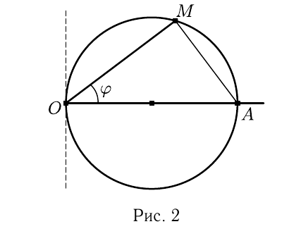

# Глава I

## § 2

Решения упражнений к [[../beklemishev/bekl_g01_s02_sistemy_koordinat|Беклемишев, §2. Системы координат]] (упражнения 1–4).

**1.** *Дан параллелограмм $OABC$. В нем $|\overrightarrow{OA}|=2$, $|\overrightarrow{OC}|=3$, угол $AOC$ равен $\pi/3$. Найдите координаты точки $B$ в системе координат $O$, $\overrightarrow{OC}$, $\overrightarrow{OA}$.*

Решение. $\overrightarrow{OB} = \overrightarrow{OC}+\overrightarrow{OA}$. Поэтому точка $B$ имеет координаты $(1,1)$ независимо от длин векторов и угла между ними.

**2.** *Даны три точки $A(x_1,y_1)$, $B(x_2,y_2)$, $C(x_3,y_3)$. Найдите координаты вершины $D$ параллелограмма $ABCD$.*

Решение. Для того чтобы из точки $A$ попасть в точку $D$, нужно от $A$ отложить вектор $\overrightarrow{BC}$. Координаты вектора равны разностям координат конца и начала вектора, а значит, $\overrightarrow{BC}$ имеет координаты $(x_3-x_2, y_3-y_2)$. Таким образом, координаты точки $D$ равны $x_1+x_3-x_2$ и $y_1+y_3-y_2$.

**3.** *Нарисуйте на плоскости множества точек, полярные координаты которых связаны соотношениями а) $r = 2/\cos\varphi$, б) $r = 2\cos\varphi$.*

Решение. а) Если $\cos\varphi \leqslant 0$, то радиус не определен и кривая не имеет точек при $\varphi \in [\pi/2, 3\pi/2]$. Согласно уравнению $r\cos\varphi = 2$ длина радиуса такова, что его проекция на полярную ось постоянна и равна $2$. Таким образом, множество точек — прямая линия, перпендикулярная полярной оси и пересекающая ее в точке $2$.

б) Если $\cos\varphi < 0$, то радиус не определен и кривая не имеет точек при $\varphi \in (\pi/2, 3\pi/2)$. При $\varphi$, равном $\pi/2$ или $3\pi/2$, кривая входит в полюс $O$. При $\varphi = 0$ точка кривой $A$ расположена на полярной оси на расстоянии $2$ от полюса (рис. 2). Величина

---
**стр. 9**

---

$r = 2\cos\varphi$ — длина катета прямоугольного треугольника с гипотенузой длины $2$ и углом $\varphi$. Поэтому в общем случае точка кривой $M$ — вершина прямого угла, составленного радиусом $OM$ и отрезком $AM$. Отсюда следует, что кривая — окружность с диаметром $OA$.

**4.** *Пусть $O$, $l$, $\mathbf{n}$ — сферическая система координат. Введем декартову прямоугольную систему координат $O$, $\mathbf{e}_1$, $\mathbf{e}_2$, $\mathbf{n}$, где $\mathbf{e}_1$ направлен вдоль $l$, а угол $\pi/2$ от $\mathbf{e}_1$ к $\mathbf{e}_2$ отсчитывается в сторону возрастания полярного угла. Напишите формулы, выражающие декартовы координаты через сферические.*

Решение. Пусть $M$ — точка со сферическими координатами $r$, $\varphi$ и $\theta$, а ее декартовы координаты $(x,y,z)$. Тогда проекция $M'$ точки $M$ на плоскость $O\mathbf{e}_1\mathbf{e}_2$ имеет сферические координаты $(r\cos\theta, \varphi, 0)$. Первые две из них — полярные координаты $M'$ в полярной системе координат $O$, $l$ в плоскости $O\mathbf{e}_1\mathbf{e}_2$. Следовательно, $x = (r\cos\theta)\cos\varphi$ и $y = (r\cos\theta)\sin\varphi$. Координата $z$ равна проекции $\overrightarrow{OM}$ на ось с направляющим вектором $\mathbf{n}$, т. е. $z = r\cos(\pi/2-\theta) = r\sin\theta$. Итак,
$$x = r\cos\theta\cos\varphi,$$
$$y = r\cos\theta\sin\varphi,$$
$$z = r\sin\theta.$$
