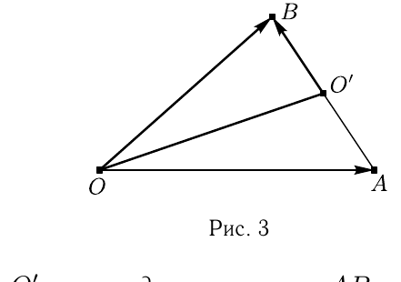
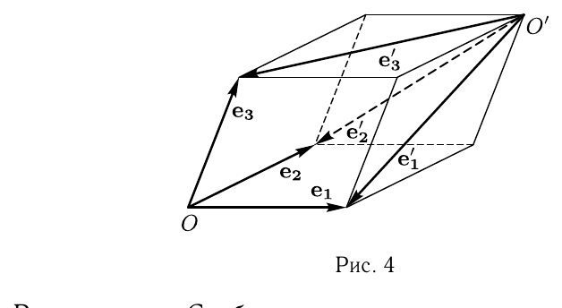

# Глава I

## § 3

Решения упражнений к [[../beklemishev/bekl_g01_s03_zamena_bazisa|Беклемишев, §3. Замена базиса и системы координат]] (упражнения 1–3).

**1.** *Выведите формулы замены базиса и замены системы координат на прямой линии. Как меняются координаты точек прямой, если при неизменном начале координат длина базисного вектора увеличивается вдвое?*

---
**стр. 10**

---

Решение. Пусть $O$, $\mathbf{e}$ и $O'$, $\mathbf{e}'$ — две системы координат на прямой линии и $\mathbf{e}' = \alpha\mathbf{e}$, а точка $O'$ имеет координату $\beta$ в системе координат $O$, $\mathbf{e}$. Последнее означает, что $\overrightarrow{OO'} = \beta\mathbf{e}$.

Произвольный вектор $\mathbf{a}$ на прямой раскладывается по базисам $\mathbf{e}$ и $\mathbf{e}'$ соответственно как $\mathbf{a} = a\mathbf{e}$ и $\mathbf{a} = a'\mathbf{e}'$. Значит, $a\mathbf{e} = a'\mathbf{e}' = a'\alpha\mathbf{e}$. Отсюда следует связь координат вектора в двух базисах: $a = \alpha a'$.

Рассмотрим произвольную точку $M$, имеющую координаты $x$ и $x'$ в этих системах координат. Мы имеем $\overrightarrow{OM} = x\mathbf{e}$, а с другой стороны
$$\overrightarrow{OM} = \overrightarrow{OO'}+\overrightarrow{O'M} = \beta\mathbf{e}+x'\mathbf{e}' = \beta\mathbf{e}+x'\alpha\mathbf{e}.$$

Отсюда получается ответ:
$$x = \alpha x'+\beta.$$

Если при неизменном начале координат длина базисного вектора увеличивается вдвое, то $\beta=0$, а $\alpha=2$ и, как мы видели, $x=2x'$. Это означает, что координаты всех точек уменьшились вдвое: $x'=(1/2)x$.

**2.** *Пусть $O'$ — середина стороны $AB$ треугольника $OAB$. Напишите формулы перехода от системы координат $O$, $\overrightarrow{OB}$, $\overrightarrow{OA}$ к системе координат $O'$, $\overrightarrow{O'O}$, $\overrightarrow{O'B}$.*

Решение. Координаты точки $O'$ в исходной системе координат — это компоненты $\overrightarrow{OO'}$ в базисе $\overrightarrow{OB}$, $\overrightarrow{OA}$. Они равны $(1/2, 1/2)$ (рис. 3). В соответствии с этим, координаты $\overrightarrow{O'O}$ равны $(-1/2,-1/2)$. Далее, $\overrightarrow{O'B} = \overrightarrow{O'O}+\overrightarrow{OB}$. Отсюда мы получаем $\overrightarrow{O'B}(1/2,-1/2)$.

---
**стр. 11**

---

Теперь можно выписать формулы перехода:
$$x = -\frac{1}{2}x'+\frac{1}{2}y'+\frac{1}{2},$$
$$y = -\frac{1}{2}x'-\frac{1}{2}y'+\frac{1}{2}.$$

**3.** *Дана декартова система координат $O$, $\mathbf{e}_1$, $\mathbf{e}_2$, $\mathbf{e}_3$. Как расположена относительно нее система координат $O'$, $\mathbf{e}_1'$, $\mathbf{e}_2'$, $\mathbf{e}_3'$, если формулы перехода имеют вид $x = 1-y'-z'$, $y = 1-x'-z'$, $z = 1-x'-y'$?*

Решение. Свободные члены в правых частях равенств $(1,1,1)$. Следовательно, начало новой системы координат — та вершина параллелепипеда, построенного на векторах $\mathbf{e}_1$, $\mathbf{e}_2$, $\mathbf{e}_3$, которая не лежит ни на одной координатной плоскости. Координаты новых базисных векторов: $\mathbf{e}_1'(0,-1,-1)$, $\mathbf{e}_2'(-1,0,-1)$ и $\mathbf{e}_3'(-1,-1,0)$. Это означает, что векторы $\mathbf{e}_1'$, $\mathbf{e}_2'$, $\mathbf{e}_3'$ направлены из $O'$ по диагоналям граней параллелепипеда, сходящимся в вершине $O'$ таким образом, что совпадают концы векторов $\mathbf{e}_1$ и $\mathbf{e}_1'$, $\mathbf{e}_2$ и $\mathbf{e}_2'$, а также $\mathbf{e}_3$ и $\mathbf{e}_3'$ (рис. 4).
