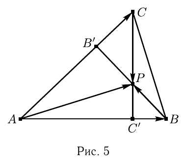
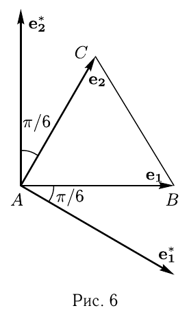

# Глава I

## § 4

Решения упражнений к [[../beklemishev/bekl_g01_s04_skalyarnoe_proizvedenie|Беклемишев, §4. Скалярное произведение]] (упражнения 1–4).

**1.** *Пусть в некотором базисе скалярное произведение вычисляется по формуле $(\mathbf{a}, \mathbf{b}) = \alpha_1\beta_1+\alpha_2\beta_2+\alpha_3\beta_3$. Докажите, что базис ортонормированный.*

Решение. Вычислим по этой формуле скалярный квадрат вектора $\mathbf{e}_1$. Его координаты $(1,0,0)$, и $|\mathbf{e}_1|^2=1$. Аналогично проверяется, что длины $\mathbf{e}_2$ и $\mathbf{e}_3$ равны $1$. Скалярное произведение векторов $\mathbf{e}_1$ и $\mathbf{e}_2$, вычисленное по той же формуле, равно $1\cdot0+0\cdot1+0\cdot0=0$. Эти векторы ортогональны. Точно также проверяется ортогональность остальных пар векторов.

---
**стр. 12**

---

**2.** *Используя свойства скалярного умножения, докажите, что высоты произвольного треугольника пересекаются в одной точке.*

Решение. Пусть $BB'$ и $CC'$ — высоты $\triangle ABC$, а $P$ — точка их пересечения (рис. 5). Вектор $\overrightarrow{AP}$ можно представить как $\overrightarrow{AP} = \overrightarrow{AB}+\overrightarrow{BP}$ и как $\overrightarrow{AP} = \overrightarrow{AC}+\overrightarrow{CP}$. Умножим скалярно первое из равенств на $\overrightarrow{AC}$, а второе на $\overrightarrow{AB}$. Так как $(\overrightarrow{BP}, \overrightarrow{AC})=0$ и $(\overrightarrow{CP}, \overrightarrow{AB})=0$, мы получим $(\overrightarrow{AP}, \overrightarrow{AC}) = (\overrightarrow{AB}, \overrightarrow{AC})$ и $(\overrightarrow{AP}, \overrightarrow{AB}) = (\overrightarrow{AB}, \overrightarrow{AC})$. Вычтем одно из этих равенств из другого:
$$(\overrightarrow{AP}, \overrightarrow{AC}-\overrightarrow{AB}) = 0.$$

Это означает, что $\overrightarrow{AP}$ перпендикулярен стороне $BC$, т. е. прямая, проходящая через вершину $A$ и точку пересечения высот $BB'$ и $CC'$, также является высотой. Это и требовалось доказать.

**3.** *Нарисуйте правильный треугольник $ABC$ и примите длину его стороны за $1$. Нарисуйте на том же чертеже базис, биортогональный базису $\overrightarrow{AB}, \overrightarrow{AC}$.*

Решение. Вектор $\mathbf{e}_1^*$ ортогонален вектору $\mathbf{e}_2$. Так как $(\mathbf{e}_1, \mathbf{e}_1^*)=1>0$, вектор $\mathbf{e}_1^*$ направлен так, что угол между $\mathbf{e}_1^*$ и $\mathbf{e}_1$ острый. Легко видеть, что этот угол равен $\pi/6$ (рис. 6). Итак, $|\mathbf{e}_1||\mathbf{e}_1^*|\cos(\pi/6)=1$. Поэтому $|\mathbf{e}_1^*|=2/\sqrt{3}$, примерно $1{,}15$. Аналогично строится и $\mathbf{e}_2^*$.

**4.** *Найдите сумму векторных проекций вектора $\mathbf{a}$ на стороны заданного правильного треугольника.*

Решение. Направим базисные векторы по двум сторонам треугольника: $\mathbf{e}_1=\overrightarrow{AB}$, $\mathbf{e}_2=\overrightarrow{AC}$, и пусть $\mathbf{a}=\alpha_1\mathbf{e}_1+\alpha_2\mathbf{e}_2$. Проекция суммы векторов равна сумме их

---
**стр. 13**

---

проекций, и проекция произведения вектора на число равна произведению проекции этого вектора на то же число. Поэтому мы можем написать
$$\textbf{Пр}_{\mathbf{e}_1}\mathbf{a} = \alpha_1\textbf{Пр}_{\mathbf{e}_1}\mathbf{e}_1+\alpha_2\textbf{Пр}_{\mathbf{e}_1}\mathbf{e}_2,$$
$$\textbf{Пр}_{\mathbf{e}_2}\mathbf{a} = \alpha_1\textbf{Пр}_{\mathbf{e}_2}\mathbf{e}_1+\alpha_2\textbf{Пр}_{\mathbf{e}_2}\mathbf{e}_2.$$

Вектор $\mathbf{e}=\mathbf{e}_2-\mathbf{e}_1$ направлен вдоль третьей стороны треугольника. Для него $\textbf{Пр}_{\mathbf{e}}\mathbf{a} = \alpha_1\textbf{Пр}_{\mathbf{e}}\mathbf{e}_1+\alpha_2\textbf{Пр}_{\mathbf{e}}\mathbf{e}_2$. Складывая все три равенства, мы увидим, что искомая сумма проекций $\vec{s}(\mathbf{a})$ равна
$$\vec{s}(\mathbf{a}) = \alpha_1\vec{s}(\mathbf{e}_1)+\alpha_2\vec{s}(\mathbf{e}_2), \quad (5)$$

и задача сводится к нахождению суммы проекций на все стороны треугольника для векторов $\mathbf{e}_1$ и $\mathbf{e}_2$.

Легко видеть, что $\textbf{Пр}_{\mathbf{e}_1}\mathbf{e}_1 = \mathbf{e}_1$. Векторные проекции на две параллельные прямые — равные векторы. Поэтому, сдвинув одну из сторон треугольника, мы можем считать, что длина стороны равна $1$. Тогда $\textbf{Пр}_{\mathbf{e}_2}\mathbf{e}_1 = (\mathbf{e}_2, \mathbf{e}_1)\mathbf{e}_2 = \frac{1}{2}\mathbf{e}_2$, и $\textbf{Пр}_{\mathbf{e}}\mathbf{e}_1 = (\mathbf{e}_1, \mathbf{e}_2-\mathbf{e}_1)\mathbf{e} = -\frac{1}{2}\mathbf{e} = \frac{1}{2}\mathbf{e}_1-\frac{1}{2}\mathbf{e}_2$. Складывая полученные проекции, мы видим, что $\vec{s}(\mathbf{e}_1) = \frac{3}{2}\mathbf{e}_1$. Аналогично, $\vec{s}(\mathbf{e}_2) = \frac{3}{2}\mathbf{e}_2$.

Подставляя этот результат в равенство (5), мы приходим к результату
$$\vec{s}(\mathbf{a}) = \frac{3}{2}\mathbf{a}.$$
