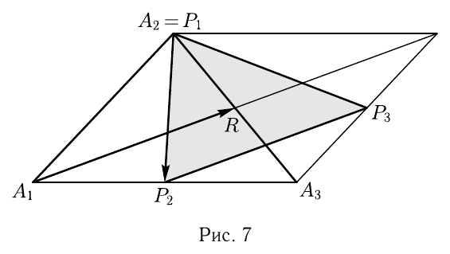

# Глава I

## § 5

Решения упражнений к [[../beklemishev/bekl_g01_s05_smeshannoe_i_vektornoe_proizvedeniya|Беклемишев, §5. Смешанное и векторное произведения]] (упражнения 1–6).

**1.** *Построены векторы, перпендикулярные граням произвольного тетраэдра, равные по длине площадям этих граней и направленные в сторону вершин, противоположных граням. Докажите, что сумма этих векторов равна $\mathbf{0}$.*

Решение. Примем за базисные векторы $\mathbf{a}$, $\mathbf{b}$ и $\mathbf{c}$, направленные по рёбрам тетраэдра, исходящим из одной вершины. Тогда три из интересующих нас векторов можно выразить следующим образом: $\mathbf{p} = \frac{1}{2}[\mathbf{b}, \mathbf{a}]$, $\mathbf{q} = \frac{1}{2}[\mathbf{c}, \mathbf{b}]$ и $\mathbf{r} = \frac{1}{2}[\mathbf{a}, \mathbf{c}]$. Четвертая грань построена на рёбрах $\mathbf{c}-\mathbf{a}$ и $\mathbf{b}-\mathbf{a}$, и соответствующий вектор равен
$$\mathbf{s} = \frac{1}{2}[\mathbf{b}-\mathbf{a}, \mathbf{c}-\mathbf{a}] = \frac{1}{2}\left([\mathbf{b}, \mathbf{c}]-[\mathbf{a}, \mathbf{c}]-[\mathbf{b}, \mathbf{a}]\right).$$

Складывая полученные векторы, мы приходим к требуемому результату.

**2.** *Дан трехгранный угол. Используя свойства векторного произведения, найдите выражение какого-либо из его двугранных углов через плоские углы.*

Решение. Обозначим через $\mathbf{a}$, $\mathbf{b}$ и $\mathbf{c}$ направляющие векторы ребер трехгранного угла. Длины этих векторов будем считать равными $1$. Через $\alpha$, $\beta$ и $\gamma$ обозначим плоские углы в гранях, противолежащих соответственно $\mathbf{a}$, $\mathbf{b}$ и $\mathbf{c}$. Найдем двугранный угол $\varphi$ с ребром $\mathbf{a}$. Он равен углу между нормалями к граням, причем если одна из нормалей направлена внутрь трехгранного угла, то вторая должна быть направлена во внешнюю область. Поэтому направляющими векторами нормалей будут $\mathbf{p} = [\mathbf{a}, \mathbf{b}]$ и $\mathbf{q} = [\mathbf{a}, \mathbf{c}]$. Очевидно, что $|\mathbf{p}| = \sin\gamma$, а $|\mathbf{q}| = \sin\beta$.

Найдем скалярное произведение $(\mathbf{p}, \mathbf{q})$. Речь идет о преобразовании скалярного произведения двух векторных произведений. Ввиду того что это преобразование полезно и в других задачах, выполним его для четырех произвольных векторов. Произведение $([\mathbf{a}, \mathbf{b}], [\mathbf{c}, \mathbf{d}])$ можно рассматривать как смешанное произведение $([\mathbf{a}, \mathbf{b}], \mathbf{c}, \mathbf{d}) = (\mathbf{c}, \mathbf{d}, [\mathbf{a}, \mathbf{b}])$ и потому как скалярное произведение $(\mathbf{c}, [\mathbf{d}, [\mathbf{a}, \mathbf{b}]])$. Здесь двойное векторное произведение можно преобразовать по соответствующей формуле
$$[\mathbf{d}, [\mathbf{a}, \mathbf{b}]] = \mathbf{a}(\mathbf{b}, \mathbf{d}) - \mathbf{b}(\mathbf{a}, \mathbf{d}).$$

---
**стр. 15**

---

После умножения на $\mathbf{c}$ мы получаем
$$([\mathbf{a}, \mathbf{b}], [\mathbf{c}, \mathbf{d}]) = (\mathbf{a}, \mathbf{c})(\mathbf{b}, \mathbf{d}) - (\mathbf{b}, \mathbf{c})(\mathbf{a}, \mathbf{d}) = \begin{vmatrix} (\mathbf{a}, \mathbf{c}) & (\mathbf{a}, \mathbf{d}) \\ (\mathbf{b}, \mathbf{c}) & (\mathbf{b}, \mathbf{d}) \end{vmatrix}.$$

Применяя полученный результат к нашей задаче, нужно положить во втором сомножителе $\mathbf{c}=\mathbf{a}$ и $\mathbf{d}=\mathbf{c}$. Мы получим
$$(\mathbf{p}, \mathbf{q}) = |\mathbf{a}|^2(\mathbf{b}, \mathbf{c}) - (\mathbf{a}, \mathbf{b})(\mathbf{a}, \mathbf{c}) = \cos\alpha - \cos\beta\cos\gamma,$$

и окончательный результат
$$\cos\varphi = \frac{\cos\alpha - \cos\beta\cos\gamma}{\sin\gamma\sin\beta}.$$

**3.** *Пусть на ориентированной плоскости дан положительный базис, такой что $|\mathbf{e}_1|=2$, $|\mathbf{e}_2|=3$ и $(\mathbf{e}_1, \mathbf{e}_2)=2$. Найдите площадь ориентированного параллелограмма, построенного на векторах $\mathbf{a}(1,2)$ и $\mathbf{b}(2,1)$.*

Решение. По формуле для площади ориентированного параллелограмма имеем
$$S_{\pm}(\mathbf{a}, \mathbf{b}) = \begin{vmatrix} 1 & 2 \\ 2 & 1 \end{vmatrix} S_{\pm}(\mathbf{e}_1, \mathbf{e}_2).$$

Так как базис положительный,
$$S_{\pm}(\mathbf{e}_1, \mathbf{e}_2) = \sqrt{|\mathbf{e}_1|^2|\mathbf{e}_2|^2-(\mathbf{e}_1, \mathbf{e}_2)^2} = \sqrt{36-4} = 4\sqrt{2}.$$

Таким образом, $S_{\pm}(\mathbf{a}, \mathbf{b}) = -12\sqrt{2}$.

**4.** *При каком условии на матрицу перехода от одного базиса к другому оба базиса ориентированы одинаково? Вопрос поставлен как для плоскости, так и для пространства.*

Решение. Матрица перехода — это матрица, столбцы которой состоят из координат новых базисных векторов в старом базисе. Пусть $\mathbf{e}_1' = \alpha_1\mathbf{e}_1+\beta_1\mathbf{e}_2$ и $\mathbf{e}_2' = \alpha_2\mathbf{e}_1+\beta_2\mathbf{e}_2$. Тогда матрицей перехода будет матрица
$$\begin{Vmatrix} \alpha_1 & \alpha_2 \\ \beta_1 & \beta_2 \end{Vmatrix}.$$

Напишем формулу для площади ориентированного параллелограмма, построенного на $\mathbf{e}_1'$ и $\mathbf{e}_2'$:
$$S_{\pm}(\mathbf{e}_1', \mathbf{e}_2') = \begin{vmatrix} \alpha_1 & \alpha_2 \\ \beta_1 & \beta_2 \end{vmatrix} S_{\pm}(\mathbf{e}_1, \mathbf{e}_2).$$

---
**стр. 16**

---

Из нее следует, что обе пары векторов ориентированы одинаково тогда и только тогда, когда детерминант матрицы перехода положителен.

Тот же результат мы получим и для пространства, если напишем выражение для смешанного произведения $(\mathbf{e}_1', \mathbf{e}_2', \mathbf{e}_3')$ по координатам этих векторов в базисе $(\mathbf{e}_1, \mathbf{e}_2, \mathbf{e}_3)$:
$$(\mathbf{e}_1', \mathbf{e}_2', \mathbf{e}_3') = \begin{vmatrix} \alpha_1 & \alpha_2 & \alpha_3 \\ \beta_1 & \beta_2 & \beta_3 \\ \gamma_1 & \gamma_2 & \gamma_3 \end{vmatrix} (\mathbf{e}_1, \mathbf{e}_2, \mathbf{e}_3).$$

**5.** *Какова размерность векторов взаимного базиса $\mathbf{e}_1^*, \mathbf{e}_2^*, \mathbf{e}_3^*$, если векторы базиса $\mathbf{e}_1, \mathbf{e}_2, \mathbf{e}_3$ измеряются в сантиметрах?*

Решение. При этом условии $(\mathbf{e}_1, \mathbf{e}_2, \mathbf{e}_3)$ измеряется в см$^3$, а векторные произведения $[\mathbf{e}_2, \mathbf{e}_3]$, $[\mathbf{e}_3, \mathbf{e}_1]$ и $[\mathbf{e}_1, \mathbf{e}_2]$ — в см$^2$. Поэтому ответ: см$^{-1}$.

**6.** *Пусть стороны треугольника $P_1P_2P_3$ равны медианам треугольника $A_1A_2A_3$. Нужно найти отношение площадей этих треугольников.*

Решение. Ответ $3/4$. Его можно непосредственно получить из рисунка, но нас сейчас интересует не ответ, а способы аналитического решения задачи. Пусть $R$ — основание медианы, исходящей из вершины $A_1$, а основание медианы, исходящей из $A_2=P_1$, есть $P_2$. Выберем в качестве базисных векторы $\mathbf{e}_1 = \overrightarrow{A_1A_2}$ и $\mathbf{e}_2 = \overrightarrow{A_1A_3}$.

Тогда векторы $\mathbf{p} = \overrightarrow{A_1R}$ и $\mathbf{q} = \overrightarrow{A_2P_2}$ имеют координаты соответственно
$$\left(\frac{1}{2}, \frac{1}{2}\right) \quad \text{и} \quad \left(-1, \frac{1}{2}\right).$$

---
**стр. 17**

---

Доказывалась формула для площади ориентированного параллелограмма на плоскости
$$S_{\pm}(\mathbf{p}, \mathbf{q}) = \begin{vmatrix} p_1 & p_2 \\ q_1 & q_2 \end{vmatrix} S_{\pm}(\mathbf{e}_1, \mathbf{e}_2),$$

в которой детерминант составлен из координат векторов $\mathbf{p}$ и $\mathbf{q}$ в базисе $\mathbf{e}_1, \mathbf{e}_2$. Согласно этой формуле, отношение площадей параллелограммов, а с ним и площадей данных треугольников, равно абсолютной величине детерминанта
$$\begin{vmatrix} 1/2 & 1/2 \\ -1 & 1/2 \end{vmatrix},$$

т. е. $3/4$.

Это решение не длиннее геометрического, так как для объяснения последнего тоже потребовалось бы несколько строчек. Однако аналитическое решение имеет то преимущество, что не требует воображения, необходимого для того, чтобы сделать подходящий рисунок.

Собственно, именно к этому стремился Декарт, создавая аналитический метод.
