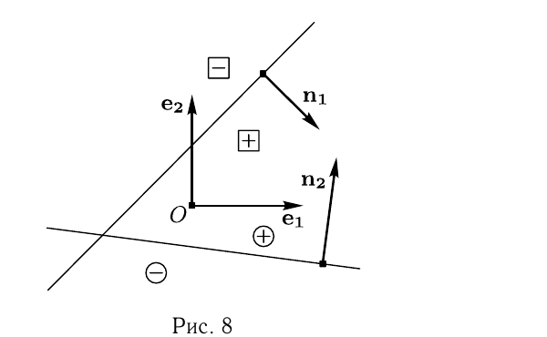
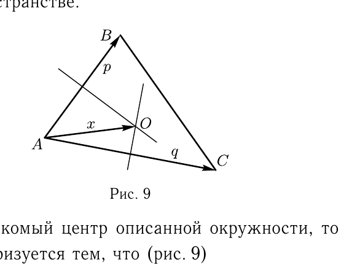

# Глава II

## § 3

Решения упражнений к [[../beklemishev/bekl_g02_s03_osnovnye_zadachi_o_pryamykh_i_ploskostyakh|Беклемишев, §3. Основные задачи о прямых и плоскостях]] (упражнения 1–7).

**1.** *В декартовой прямоугольной системе координат даны координаты вершин треугольника: $A(20,-15)$, $B(-16,0)$ и $C(-8,6)$. Найдите координаты центра и радиус окружности, вписанной в треугольник.*

Решение. Параллелограмм, построенный на двух равных по длине векторах, — ромб, и его диагональ — биссектриса угла. Значит, направляющим вектором биссектрисы угла $BAC$ будет $\mathbf{p}=\overrightarrow{AB}/|\overrightarrow{AB}|+\overrightarrow{AC}/|\overrightarrow{AC}|$.

$\overrightarrow{AB}(-36,15)$, и $|AB|=39$. Поэтому $\overrightarrow{AB}/|\overrightarrow{AB}|$ имеет координаты $(-12/13, 5/13)$.

$\overrightarrow{AC}(-28,21)$, и $|AC|=35$. Поэтому $\overrightarrow{AC}/|\overrightarrow{AC}|$ имеет координаты $(-4/5, 3/5)$.

Складывая, видим, что $\mathbf{p}$ коллинеарен вектору $\mathbf{p}'(-7,4)$. Таким образом, биссектриса угла $BAC$ имеет параметрические уравнения
$$x=20-7t; \quad y=-15+4t.$$

Аналогично для угла $ABC$.

$\overrightarrow{BC}(8,6)$, и $|BC|=10$. Поэтому $\overrightarrow{BC}/|\overrightarrow{BC}|$ имеет координаты $(4/5, 3/5)$.

Ясно, что $\overrightarrow{BA}/|\overrightarrow{BA}|$ имеет координаты $(12/13, -5/13)$.

---
**стр. 27**

---

Складывая, видим, что вектор $\mathbf{q}=\overrightarrow{BC}/|\overrightarrow{BC}|+\overrightarrow{BA}/|\overrightarrow{BA}|$ коллинеарен вектору $\mathbf{q}'(8,1)$. Таким образом, биссектриса угла $ABC$ имеет параметрические уравнения $x=-16+8t$; $y=t$, и, следовательно, линейное уравнение $x-8y+16=0$.

Центр вписанной окружности — точка пересечения биссектрис. Соответствующее ему значение параметра $t$ на первой из них должно удовлетворять равенству $(20-7t)-8(-15+4t)+16=0$ и потому равно $4$. Таким образом, центр вписанной окружности находится в точке
$$O(-8,1).$$

Радиус окружности равен расстоянию от ее центра до какой-либо стороны. Сторона $BC$ имеет уравнение $(x+16)/4=y/3$, или $3x-4y+48=0$. По формуле расстояния от точки до прямой радиус равен
$$r=\frac{|3(-8)-4+48|}{5}=4.$$

Для проверки можно найти расстояния от $O$ до остальных сторон.

**2.** *Начало координат лежит в одном из углов, образованных прямыми с уравнениями $A_1x+B_1y+C_1=0$ и $A_2x+B_2y+C_2=0$ в декартовой прямоугольной системе координат. При каком необходимом и достаточном условии на коэффициенты уравнений этот угол острый?*

Решение. Когда прямая задана линейным уравнением в декартовой системе координат, то плоскость разделяется на две полуплоскости, определяемые этим уравнением: положительную и отрицательную. Точка принадлежит положительной полуплоскости, если результат подстановки ее координат в уравнение положителен. Таким образом, если свободный член уравнения прямой положителен, то начало координат лежит в положительной полуплоскости, определяемой данным уравнением.

Знаки свободных членов $C_1$ и $C_2$ нам неизвестны, поэтому постараемся умножить оба уравнения на такие множители, чтобы свободные члены оказались положительными. Очевидно, что достаточно умножить каждое уравнение на его свободный член ($C_1$ и $C_2\neq0$, иначе начало координат лежало бы на одной из прямых). Уравнения принимают вид
$$A_1C_1x+B_1C_1y+C_1^2=0, \quad A_2C_2x+B_2C_2y+C_2^2=0.$$

---
**стр. 28**

---

Так как система координат декартова прямоугольная, векторы $\mathbf{n}_1(A_1C_1, B_1C_1)$ и $\mathbf{n}_2(A_2C_2, B_2C_2)$ — нормальные векторы прямых. Каждый из этих векторов направлен в соответствующую положительную полуплоскость (рис. 8). Действительно, если точка $(x_0,y_0)$ лежит на прямой с уравнением $ax+by+c=0$, то точка $(x_0+a, y_0+b)$ лежит в положительной полуплоскости: $a(x_0+a)+b(y_0+b)+c=a^2+b^2>0$.

В нашем случае угол, в котором лежит начало координат, — пересечение обеих положительных полуплоскостей. Для того чтобы угол, составленный двумя лучами, был острым, нужно, чтобы угол между перпендикулярными к ним векторами, направленными внутрь угла, был тупым, т. е. $(\mathbf{n}_1,\mathbf{n}_2)<0$. В координатах это условие запишется как
$$(A_1A_2+B_1B_2)C_1C_2<0.$$

Обратите внимание на то, что знак левой части неравенства не меняется при умножении какого-либо из уравнений прямых на постоянный множитель.

**3.** *Составьте уравнение прямой, проходящей через начало координат и пересекающей прямые с уравнениями $x=1+2t$, $y=2+3t$, $z=-t$ и $x=4t$, $y=5-5t$, $z=3+2t$.*

Решение. При решении подобных задач полезно предварительно представить себе, как бы вы построили прямую, если бы реально выполняли построение в пространстве. Вам нужно провести прямую $p$, пересекающую прямые $l$ и $m$. Через начало координат вы можете провести некоторую прямую, пересекающую $l$, а затем сдвигать ее до тех пор, пока она не пересечет $m$. При сдвиге ваша прямая движется по плоскости, проходящей через начало координат и прямую $l$, до тех пор пока не попадет в плоскость, проходящую через начало координат и $m$.

---
**стр. 29**

---

Понятно, что прямая $p$ — пересечение двух выше описанных плоскостей, а их уравнения написать несложно. Если $\mathbf{r}_1$ и $\mathbf{r}_2$ — радиус-векторы начальных точек прямых $l$ и $m$, а $\mathbf{a}_1$ и $\mathbf{a}_2$ — направляющие векторы этих прямых, то векторные уравнения плоскостей
$$(\mathbf{r},\mathbf{r}_1,\mathbf{a}_1)=0, \quad (\mathbf{r},\mathbf{r}_2,\mathbf{a}_2)=0.$$

Эта система уравнений определяет искомую прямую $p$. В координатной форме уравнения плоскостей таковы:
$$\begin{vmatrix} x & y & z \\ 1 & 2 & 0 \\ 2 & 3 & -1 \end{vmatrix} = -2x+y-z=0$$
и
$$\begin{vmatrix} x & y & z \\ 0 & 5 & 3 \\ 4 & -5 & 2 \end{vmatrix} = 25x+12y-20z=0.$$

Таким образом, ответ
$$\begin{cases} 2x-y+z=0, \\ 25x+12y-20z=0. \end{cases}$$

Если результат нужен в какой-либо другой форме, его можно преобразовать обычными приемами. Например, решим систему относительно $y$ и $z$:
$$y=\frac{65}{8}x; \quad z=\frac{49}{8}x.$$

Параметрические уравнения прямой могут быть написаны в виде
$$x=8t; \quad y=65t; \quad z=49t.$$

**4.** *Найти радиус и координаты центра сферы, проходящей через точку $A(0,1,0)$ и касающейся плоскостей с уравнениями*
$$x+y=0, \quad x-y=0, \quad x+y+4z=0.$$
*Система координат — декартова прямоугольная.*

Решение. Как принято при решении задач на построение при помощи циркуля и линейки, ослабим условие. Отбросим временно требование того, чтобы сфера проходила через точку $A$. Центры всех сфер, касающихся трех плоскостей, находятся на прямых, которые лежат на пересечении биссекторных плоскостей

---
**стр. 30**

---

двугранных углов, образуемых данными плоскостями. Нас, естественно, интересует та из этих прямых, которая проходит внутри того же трехгранного угла, в котором лежит точка $A$. Найдем ее уравнение.

Множество точек, равноудаленных от первых двух плоскостей, описывается уравнением
$$\frac{x+y}{\sqrt2}=\pm\frac{x-y}{\sqrt2}.$$

Для точки $A$ результат подстановки координат в первое уравнение положителен, а во второе — отрицателен. Следовательно, нужная нам биссекторная плоскость имеет уравнение $x+y=-(x-y)$, т. е. $x=0$.

Аналогично, для первой и третьей плоскостей находим
$$\frac{x+y}{\sqrt2}=\pm\frac{x+y+4z}{\sqrt{18}},$$
причем результат подстановки координат $A$ в обе части равенства положителен. Следовательно, вторая биссекторная плоскость имеет уравнение $3x+3y=x+y+4z$, или $x+y-2z=0$.

Таким образом, центр сферы лежит на прямой с уравнениями $x=0$, $x+y-2z=0$. Приняв $z$ за параметр, сразу получаем параметрические уравнения этой прямой:
$$x=0, \quad y=2t, \quad z=t.$$

Если центр искомой сферы находится в точке $O(t)$ с координатами $(0,2t,t)$, то квадрат радиуса сферы $|AO(t)|$ должен равняться квадрату расстояния до каждой из плоскостей, но достаточно потребовать этого равенства только для какой-нибудь одной плоскости, скажем $x+y=0$.

Итак, значение параметра $t$, соответствующее центру сферы, должно удовлетворять уравнению
$$(2t-1)^2+t^2=\frac{(2t)^2}{2}.$$

Упростим его. $4t^2-4t+1+t^2-2t^2=3t^2-4t+1=0$. Корни этого уравнения $t_1=1$ и $t_2=1/3$.

Задача имеет два решения — одна сфера вписана в трехгранный угол, проходит через $A$ и лежит дальше от вершины, чем $A$, а другая — ближе к вершине, чем $A$. Центры этих сфер в точках $O_1(0,2,1)$ и $O_2(0,2/3,1/3)$. Их радиусы соответственно $r_1=\sqrt2$ и $r_2=(\sqrt2)/3$.

---
**стр. 31**

---

Можно заметить, что радиус меньшей сферы втрое меньше радиуса бо́льшей, так же как и расстояние от вершины угла $(0,0,0)$ до центра сферы. Так и должно быть в силу подобия соответствующих треугольников.

**5.** *В декартовой прямоугольной системе координат даны координаты вершин треугольника $A(1,2,3)$, $B(1,5,-1)$ и $C(5,3,-5)$. Найдите координаты центра окружности, описанной около треугольника.*

Решение. Эта задача легко может быть сведена к аналогичной задаче на плоскости. Именно, точка $A$ и векторы $\mathbf{p}=\overrightarrow{AB}$ и $\mathbf{q}=\overrightarrow{AC}$ образуют внутреннюю систему координат на плоскости, содержащей треугольник. Видно, что $\mathbf{p}(0,3,-4)$, а $\mathbf{q}=(4,1,-8)$. Поэтому параметрические уравнения плоскости
$$x=1+4v; \quad y=2+3u+v; \quad z=3-4u-8v.$$

Эти уравнения можно рассматривать как формулы перехода от внутренней системы координат на плоскости к исходной системе координат в пространстве.

Если $O$ — искомый центр описанной окружности, то вектор $\mathbf{x}=\overrightarrow{AO}$ характеризуется тем, что (рис. 9)
$$\Pi\mathrm{p}_{\mathbf{p}}\mathbf{x}=\frac{(\mathbf{p},\mathbf{x})}{|\mathbf{p}|}=\frac{1}{2}|\mathbf{p}| \quad \text{и} \quad \Pi\mathrm{p}_{\mathbf{q}}\mathbf{x}=\frac{(\mathbf{q},\mathbf{x})}{|\mathbf{q}|}=\frac{1}{2}|\mathbf{q}|.$$

Если $\mathbf{x}=u\mathbf{p}+v\mathbf{q}$, то эти равенства перепишутся так:
$$u|\mathbf{p}|^2+v(\mathbf{p},\mathbf{q})=\frac{1}{2}|\mathbf{p}|^2, \quad u(\mathbf{p},\mathbf{q})+v|\mathbf{q}|^2=\frac{1}{2}|\mathbf{q}|^2.$$

Подставляя сюда $|\mathbf{p}|^2=25$, $(\mathbf{p},\mathbf{q})=35$, $|\mathbf{q}|^2=81$, получаем систему
$$50u+70v=25; \quad 70u+162v=81.$$

---
**стр. 32**

---

Решая эту систему, мы находим, что $u=-81/160$ и $v=23/32$. Это координаты центра $O$ во внутренней системе координат. Остается подставить их в параметрические уравнения плоскости, для того чтобы получить ее координаты в исходной системе координат:
$$x=1+4\cdot\frac{23}{32}=\frac{31}{8},$$
$$y=2-3\cdot\frac{81}{160}+\frac{23}{32}=\frac{6}{5},$$
$$z=3+4\cdot\frac{81}{160}-8\cdot\frac{23}{32}=-\frac{29}{40}.$$

**6.** *Напишите уравнения прямой, которая параллельна прямой $\mathbf{r}=\mathbf{r}_0+\mathbf{a}_0t$ и пересекает прямые $\mathbf{r}=\mathbf{r}_1+\mathbf{a}_1t$ и $\mathbf{r}=\mathbf{r}_2+\mathbf{a}_2t$. Дано, что векторы $\mathbf{a}_0$, $\mathbf{a}_1$ и $\mathbf{a}_2$ не компланарны.*

Решение. Задача похожа на задачу 3. Искомая прямая является пересечением двух плоскостей, каждая из которых проходит через одну из данных прямых и содержит вектор $\mathbf{a}_0$. Уравнения этих плоскостей следующие:
$$(\mathbf{r}-\mathbf{r}_1,\mathbf{a}_1,\mathbf{a}_0)=0; \quad (\mathbf{r}-\mathbf{r}_2,\mathbf{a}_2,\mathbf{a}_0)=0.$$

Это можно рассматривать как ответ, но попробуем получить параметрические уравнения. Поскольку направляющий вектор $\mathbf{a}_0$ нам известен, требуется только найти начальную точку.

Примем за начальную точку прямой точку пересечения искомой прямой с плоскостью, которая проходит через начало координат с направляющими векторами $\mathbf{a}_1$ и $\mathbf{a}_2$. Радиус-вектор этой точки имеет вид $\mathbf{v}_0=v_1\mathbf{a}_1+v_2\mathbf{a}_2$. Подстановка в уравнения плоскостей дает
$$(v_1\mathbf{a}_1+v_2\mathbf{a}_2-\mathbf{r}_1,\mathbf{a}_1,\mathbf{a}_0)=v_2(\mathbf{a}_2,\mathbf{a}_1,\mathbf{a}_0)-(\mathbf{r}_1,\mathbf{a}_1,\mathbf{a}_0)=0$$
и
$$(v_1\mathbf{a}_1+v_2\mathbf{a}_2-\mathbf{r}_2,\mathbf{a}_2,\mathbf{a}_0)=v_1(\mathbf{a}_1,\mathbf{a}_2,\mathbf{a}_0)-(\mathbf{r}_2,\mathbf{a}_2,\mathbf{a}_0)=0.$$

Отсюда находим $v_1$ и $v_2$ и векторное параметрическое уравнение прямой
$$\mathbf{r}=\frac{(\mathbf{r}_2,\mathbf{a}_2,\mathbf{a}_0)}{(\mathbf{a}_1,\mathbf{a}_2,\mathbf{a}_0)}\,\mathbf{a}_1+\frac{(\mathbf{r}_1,\mathbf{a}_1,\mathbf{a}_0)}{(\mathbf{a}_2,\mathbf{a}_1,\mathbf{a}_0)}\,\mathbf{a}_2+\mathbf{a}_0 t.$$

К другому по форме ответу мы придем, если примем за начальную точку точку пересечения прямой $\mathbf{r}=\mathbf{r}_1+\mathbf{a}_1t$ с плоскостью $(\mathbf{r}-\mathbf{r}_2,\mathbf{a}_2,\mathbf{a}_0)=0$. Значение параметра $t$ этой точки долж-

---
**стр. 33**

---

но удовлетворять уравнению $(\mathbf{r}_1-\mathbf{r}_2+\mathbf{a}_1t, \mathbf{a}_2, \mathbf{a}_0)=0$. Отсюда $t=(\mathbf{r}_2-\mathbf{r}_1,\mathbf{a}_2,\mathbf{a}_0)/(\mathbf{a}_0,\mathbf{a}_1,\mathbf{a}_2)$, и мы можем написать уравнение искомой прямой в виде
$$\mathbf{r}=\mathbf{r}_1+\mathbf{a}_1\,\frac{(\mathbf{r}_2-\mathbf{r}_1,\mathbf{a}_2,\mathbf{a}_0)}{(\mathbf{a}_0,\mathbf{a}_1,\mathbf{a}_2)}+\mathbf{a}_0 t.$$

**7\*.** *Напишите параметрические уравнения прямой, являющейся пересечением плоскостей с уравнениями $\mathbf{r}=\mathbf{r}_1+u\mathbf{a}+v\mathbf{b}$ и $(\mathbf{r}-\mathbf{r}_2,\mathbf{n})=0$.*

Решение. Нормальные векторы плоскостей нам известны. Это соответственно $[\mathbf{a},\mathbf{b}]$ и $\mathbf{n}$. Поэтому направляющий вектор прямой $\mathbf{p}=[\mathbf{n},[\mathbf{a},\mathbf{b}]]$.

Найдем начальную точку прямой. Точка первой плоскости со значениями параметров $u$ и $v$ лежит во второй плоскости тогда и только тогда, когда $(\mathbf{r}_1+u\mathbf{a}+v\mathbf{b}-\mathbf{r}_2,\mathbf{n})=0$, т. е.
$$(\mathbf{r}_1-\mathbf{r}_2,\mathbf{n})+(\mathbf{a},\mathbf{n})u+(\mathbf{b},\mathbf{n})v=0.$$

Это уравнение есть уравнение прямой во внутренней системе координат первой плоскости. Его можно использовать, чтобы обычным путем найти внутренние координаты начальной точки прямой:
$$u_0=\frac{(\mathbf{r}_2-\mathbf{r}_1,\mathbf{n})(\mathbf{a},\mathbf{n})}{(\mathbf{a},\mathbf{n})^2+(\mathbf{b},\mathbf{n})^2}, \quad v_0=\frac{(\mathbf{r}_2-\mathbf{r}_1,\mathbf{n})(\mathbf{b},\mathbf{n})}{(\mathbf{a},\mathbf{n})^2+(\mathbf{b},\mathbf{n})^2}.$$

Теперь, подставляя эти координаты в уравнение первой плоскости, получим радиус-вектор начальной точки:
$$\mathbf{r}_0=\mathbf{r}_1+\frac{(\mathbf{r}_2-\mathbf{r}_1,\mathbf{n})\{\mathbf{a}(\mathbf{a},\mathbf{n})+\mathbf{b}(\mathbf{b},\mathbf{n})\}}{(\mathbf{a},\mathbf{n})^2+(\mathbf{b},\mathbf{n})^2}.$$

Решение, конечно, упрощается при дополнительных предположениях. Например, если $(\mathbf{a},\mathbf{n})\neq0$, то можно положить $v_0=0$ и $u_0=(\mathbf{r}_2-\mathbf{r}_1)/(\mathbf{a},\mathbf{n})$.
