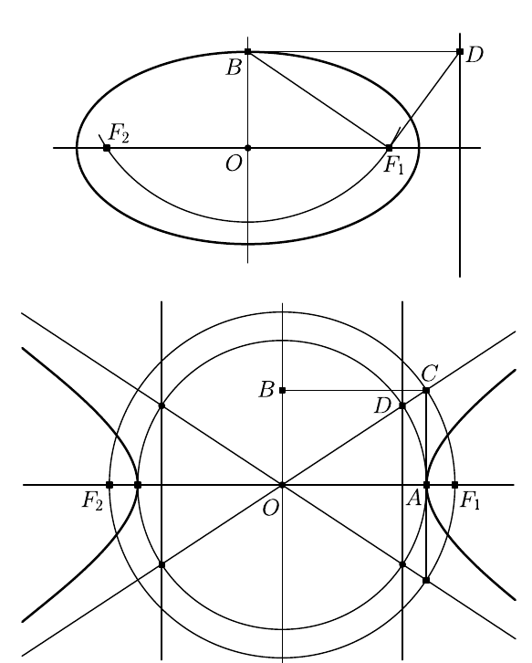
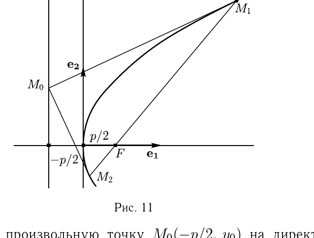

# Глава III

## § 2

Решения упражнений к [[../beklemishev/bekl_g03_s02_ellips_giperbola_i_parabola|Беклемишев, §2. Эллипс, гипербола и парабола]] (упражнения 1–9).

**1.** *Докажите, что вершины гиперболы и точки пересечения её асимптот с директрисами лежат на одной окружности.*

Решение. Одна из точек пересечения директрис с асимптотами в канонической системе координат имеет координаты $(a/\varepsilon, b/\varepsilon)$. (У остальных координаты отличаются знаками.) Найдём расстояние от этой точки до начала координат:
$$\rho^2=\frac{a^2}{\varepsilon^2}+\frac{b^2}{\varepsilon^2}=\frac{a^2+b^2}{\varepsilon^2}=\frac{c^2}{\varepsilon^2}.$$

Но $\varepsilon^2=c^2/a^2$. Таким образом, $\rho=a$, откуда прямо следует доказываемое.

**2.** *Фокус эллипса (гиперболы или параболы) делит проходящую через него хорду на отрезки длины $u$ и $v$. Докажите, что сумма $1/u+1/v$ постоянна.*

Решение. Хорда, проходящая через фокус, имеет уравнение $x=c+\alpha t$, $y=\beta t$. Будем считать, что $\alpha^2+\beta^2=1$, тогда длина отрезка от фокуса до точки со значением параметра $t$ будет равна $|t|$.

В случае эллипса значения параметра $t_1$ и $t_2$, соответствующие концам хорды, удовлетворяют уравнению $b^2(c+\alpha t)^2+a^2\beta^2t^2=a^2b^2$, или $-b^4+2b^2c\alpha t+(b^2\alpha^2+a^2\beta^2)t^2=0$, а обратные величины $z_1=t_1^{-1}$ и $z_2=t_2^{-1}$ — уравнению
$$b^4z^2-2b^2c\alpha z-(b^2\alpha^2+a^2\beta^2)=0.$$

Отсюда
$$z=\frac{1}{b^2}\left(\alpha c\pm a\sqrt{\alpha^2+\beta^2}\right).$$

Так как корни имеют разные знаки (фокус расположен между концами хорды), сумма модулей корней равна модулю их разности, т. е.
$$\frac1u+\frac1v=|z_1|+|z_2|=\frac{\alpha c+a}{b^2}-\frac{\alpha c-a}{b^2}=\frac{2a}{b^2}.$$

Это заканчивает доказательство в случае эллипса. Для гиперболы и параболы доказательства аналогичны.

---
**стр. 40**

---

**3.** *Выведите уравнения эллипса, гиперболы и параболы в полярной системе координат, приняв за полюс фокус, а за полярную ось — луч, лежащий на оси симметрии и не пересекающий директрису, соответствующую данному фокусу.*

Решение. 1) *Эллипс.* В канонической системе координат расстояние от левого фокуса до точки $M(x,y)$ эллипса, как мы знаем, равно $r=a+\varepsilon x$. Если полюс помещён в левый фокус и $\varphi$ — полярный угол, то $x=r\cos\varphi-c$, и мы имеем: $r(1-\varepsilon\cos\varphi)=a-\varepsilon c$. Величина $p=a-\varepsilon c$ равна $r(\pi/2)$ — расстоянию от левого фокуса до точки на эллипсе, имеющей абсциссу $-c$, т. е. точки $P(-c,p)$. Итак, уравнение эллипса в полярных координатах
$$r=\frac{p}{1-\varepsilon\cos\varphi}.$$

2) *Гипербола.* В канонической системе координат расстояние от правого фокуса до точки $M(x,y)$ на правой ветви гиперболы, как мы знаем, равно $r=\varepsilon x-a$. Если полюс помещён в правый фокус и $\varphi$ — полярный угол, то $x=r\cos\varphi+c$, и мы имеем: $r(1-\varepsilon\cos\varphi)=\varepsilon c-a$. Величина $p=\varepsilon c-a$ равна $r(\pi/2)$ — ординате точки $P(c,p)$, лежащей на гиперболе над правым фокусом. Итак, уравнение правой ветви гиперболы в полярных координатах
$$r=\frac{p}{1-\varepsilon\cos\varphi}.$$

Для точки $M(x,y)$ на левой ветви гиперболы расстояние до правого фокуса равно $r=a-\varepsilon x$, а $x=r\cos\varphi+c$, и мы имеем $r(1+\varepsilon\cos\varphi)=-\varepsilon c+a$. Итак, уравнение левой ветви гиперболы в полярных координатах
$$r=\frac{-p}{1+\varepsilon\cos\varphi}.$$

3) *Парабола.* Если парабола задана каноническим уравнением $y^2=2px$, то расстояние от точки $M(x,y)$ до фокуса равно $r=x+p/2$. Пусть полюс помещён в фокус параболы, а полярный угол отсчитывается от положительного направления оси $Ox$. Тогда $x=r\cos\varphi+p/2$. Поэтому $r=r\cos\varphi+p$, и уравнение параболы в полярных координатах
$$r=\frac{p}{1-\cos\varphi}.$$

Заметим, что и для параболы коэффициент $p$ — ордината точки $P(p/2,p)$, лежащей на параболе над фокусом.

---
**стр. 41**

---

**4.** *На плоскости нарисованы эллипс и парабола вместе с их осями симметрии. Как с помощью циркуля и линейки построить их фокусы и директрисы? Тот же вопрос относительно гиперболы, у которой нарисованы асимптоты. (Задача построения осей симметрии и асимптот решается на основании материала §3.)*

Решение. 1) *Эллипс.* Фокусы эллипса имеют координаты $(c,0)$ и $(-c,0)$, где $c^2=a^2-b^2$. Поэтому они — точки пересечения большой оси эллипса и окружности с центром в конце $B$ малой оси эллипса, имеющей радиус, равный большой полуоси $a$ (рис. 10).

Строим в фокусе $F_1$ перпендикуляр к отрезку $BF_1$ и его пересечение $D$ с прямой, проходящей через $B$ параллельно большой оси эллипса. Точка $D$ лежит на директрисе, так как из подобия треугольников $BF_1D$ и $BOF_1$ следует, что
$$\frac{|BF_1|}{|DB|}=\frac{|OF_1|}{|BF_1|}=\frac{c}{a}=\varepsilon.$$

---
**стр. 42**

---

2) *Гипербола.* Решение основывается на результате решения задачи 1. Окружность с центром в центре гиперболы и радиусом $|OA|=a$ пересекает асимптоты в точках, лежащих на директрисах.

Построим в вершине гиперболы перпендикуляр к её вещественной оси и точку $C$ его пересечения с асимптотой. Так как $|OC|^2=a^2+b^2$, достаточно отложить от $O$ на вещественной оси отрезки $OF_1$ и $OF_2$, равные $OC$. Полученные точки — фокусы гиперболы.

3) *Парабола.* Если парабола задана каноническим уравнением $y^2=2px$, то фокус имеет координаты $(p/2,0)$, а точка $P(p/2,p)$ лежит на параболе. Отсюда вытекает следующее построение: построим произвольный прямоугольник $OABC$ с отношением сторон $1:2$, стороны которого лежат на осях канонической системы координат. Его диагональ пересечёт параболу в точке $P$, и для построения фокуса остаётся опустить перпендикуляр $PF$.

Для нахождения точки $D$ на директрисе достаточно отложить $OD=OF$. Заметим, что $FPQD$ — квадрат.

**5.** *Пусть $u$ и $v$ — длины двух взаимно перпендикулярных радиусов эллипса. Найдите сумму $1/u^2+1/v^2$.*

Решение. Пусть $(\cos\varphi,\sin\varphi)$ — компоненты направляющего вектора одного из радиусов эллипса. Длина радиуса равна $u$, если точка с координатами $(u\cos\varphi, u\sin\varphi)$ лежит на эллипсе, т. е.
$$\frac{u^2\cos^2\varphi}{a^2}+\frac{u^2\sin^2\varphi}{b^2}=1.$$

Отсюда
$$\frac{1}{u^2}=\frac{b^2\cos^2\varphi+a^2\sin^2\varphi}{a^2b^2}.$$

Аналогичное вычисление для перпендикулярного радиуса с направляющим вектором $(-\sin\varphi,\cos\varphi)$ даст
$$\frac{1}{v^2}=\frac{b^2\sin^2\varphi+a^2\cos^2\varphi}{a^2b^2}.$$

Поэтому
$$\frac1{u^2}+\frac1{v^2}=\frac{a^2+b^2}{a^2b^2}=\frac1{a^2}+\frac1{b^2}.$$

Приведём ещё одно, не столь естественное, решение. Пусть указаны какие-то два взаимно перпендикулярных радиуса эллипса. Повернём каноническую систему координат эллипса так,

---
**стр. 43**

---

чтобы её оси были направлены по указанным радиусам. Так как в формулы замены координат при повороте системы не входят свободные члены, членов с первыми степенями в уравнении появиться не может. Таким образом, уравнение эллипса имеет вид $Ax^2+2Bxy+Cy^2+F=0$. Заметим, что $F\neq0$, так как эллипс не проходит через свой центр. Разделив на $-F$, мы приведём уравнение к виду $A'x^2+2B'xy+C'y^2=1$.

Пусть эллипс пересекает оси координат в точках $U(u,0)$ и $V(0,v)$. Тогда $A'u^2=1$ и $C'v^2=1$. В силу результата задачи 6 §1 сумма $A'+C'=1/u^2+1/v^2$ постоянна и не зависит от выбора системы координат (при условии, что уравнение не умножается на число). Для канонической системы координат $A+C=1/a^2+1/b^2$, и мы приходим к полученному выше результату.

**6.** *Найдите кратчайшее расстояние от параболы $y^2=12x$ до прямой $x-y+7=0$.*

Решение. Оно состоит в том, чтобы провести касательную к параболе, параллельную данной прямой, и найти расстояние от точки касания до прямой. Все остальные точки параболы будут дальше от прямой, так как парабола вся лежит по одну сторону от касательной.

Итак, будем искать уравнение касательной в виде $x-y+c=0$. С этой целью решим это уравнение совместно с уравнением параболы $y^2=12x$. Исключение переменной $x$ приводит к уравнению $y^2-12y+12c=0$. Найдём $c$ так, чтобы уравнение имело кратные корни. Для этого дискриминант $36-12c$ должен быть равен нулю, т. е. $c=3$. Следовательно, уравнение касательной $x-y+3=0$. Возьмём точку на касательной, например $A(0,3)$, и найдём расстояние от $A$ до прямой $x-y+7=0$. Оно совпадает с расстоянием от точки касания до прямой и равно
$$\frac{|-3+7|}{\sqrt2}=2\sqrt2.$$

Может возникнуть вопрос, не слишком ли мы полагаемся на наглядные представления, когда утверждаем, что парабола лежит по одну сторону от любой своей касательной. Проверим это утверждение аналитически. Уравнение касательной к параболе $yy_0-p(x+x_0)=0$, причём точка $(x_0,y_0)$ лежит на параболе: $x_0=y_0^2/2p$. Подставим в уравнение касательной координаты

---
**стр. 44**

---

$(y^2/2p, y)$ произвольной точки параболы. Мы получим
$$yy_0-p\left(\frac{y^2}{2p}+\frac{y_0^2}{2p}\right)=-\frac{1}{2}(y^2-2yy_0+y_0^2)\leqslant0.$$

Итак, результат подстановки отрицателен для всех $y\neq y_0$, что говорит о том, что парабола лежит по одну сторону от касательной.

Проверим, что прямая $x-y+7=0$, не пересекающая параболу, лежит по другую сторону от касательной, чем парабола. Для этого возьмём точку, скажем $N_1(1,8)$, на этой прямой и подставим её координаты в уравнение касательной $x-y+3=0$. Результат $1-8+3$ меньше нуля. Теперь возьмём точку $N_2(2,\sqrt{24})$ на параболе и подставим в уравнение касательной её координаты. Результат $2-\sqrt{24}+3$ больше нуля. Это решает вопрос.

**7.** *Докажите, что отрезок касательной, заключённый между асимптотами гиперболы, делится пополам точкой касания.*

Пусть к гиперболе, заданной каноническим уравнением, проведена касательная в точке $M_0(x_0,y_0)$. Решим её уравнение $b^2x_0x-a^2y_0y=a^2b^2$ совместно с уравнением асимптоты, которому удовлетворяют обе координаты. Если мы найдём $bx$ из первого уравнения и подставим во второе, после упрощения получим равенство $a^2(b^2+y_0y)^2-b^2x_0^2y^2=0$, которое сводится к $y^2-2y_0y-b^2=0$. Отсюда видно, что корни этого уравнения удовлетворяют условию
$$\frac{y_1+y_2}{2}=y_0.$$

Так как точки пересечения касательной с асимптотами $M_1$, $M_2$ и точка касания $M_0$ лежат на одной прямой, этого достаточно, чтобы заключить, что $M_0$ — середина отрезка $M_1M_2$.

**8.** *В уравнение касательной к эллипсу в канонической системе координат вместо координат точки касания $x_0$ и $y_0$ подставлены координаты точки, лежащей не на эллипсе, а вне эллипса. Как расположена получившаяся прямая?*

Решение. Поставим себе задачу провести через точку $M_0(x_0,y_0)$ касательную к эллипсу. Для этого будем искать такую точку $M(x,y)$ на эллипсе, касательная в которой проходит через $M_0$. Координаты искомой точки должны удовлетворять

---
**стр. 45**

---

системе уравнений
$$\frac{x^2}{a^2}+\frac{y^2}{b^2}=1, \qquad \frac{xx_0}{a^2}+\frac{yy_0}{b^2}=1.$$

Второе уравнение — как раз уравнение той прямой, которую нам нужно исследовать. Решения системы удовлетворяют этому уравнению. Поэтому прямая с таким уравнением проходит через точки касания касательных, проведённых к эллипсу из точки $M_0$.

**9.** *Из точки на директрисе проведены две касательные к параболе. Докажите, что они взаимно перпендикулярны и отрезок, соединяющий точки касания, проходит через фокус.*

Решение. Рассмотрим на параболе $y^2=2px$ две точки, $M_1(x_1,y_1)$ и $M_2(x_2,y_2)$. Касательные к параболе, проведённые в этих точках, $yy_1=p(x+x_1)$ и $yy_2=p(x+x_2)$, перпендикулярны тогда и только тогда, когда $y_1y_2+p^2=0$.

Выберем произвольную точку $M_0(-p/2,y_0)$ на директрисе. Если касательная к параболе в точке $M(X,Y)$ проходит через точку $M_0$, то $y_0Y=p(X-p/2)$. Учтём, что $Y^2=2pX$, и получим
$$\frac{Y^2}{2}-y_0Y-\frac{p^2}{2}=0.$$

Корни этого уравнения — ординаты точек касания касательных, проведённых из точки $M_0$, т. е. точек $M_1$ и $M_2$. По теореме Виета произведение корней равно $-p^2$, т. е. они удовлетворяют условию перпендикулярности $Y_1Y_2+p^2=0$.
