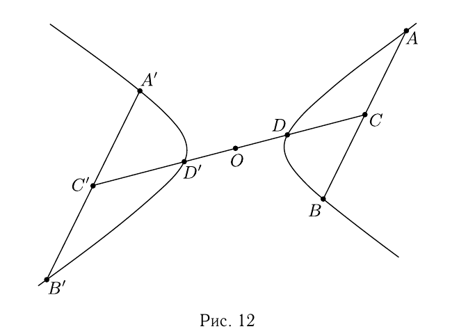
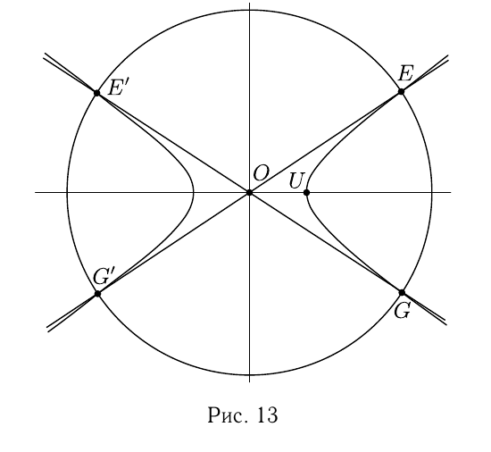
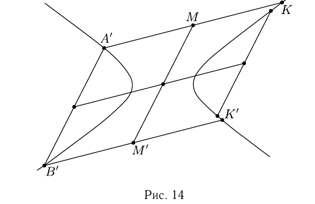
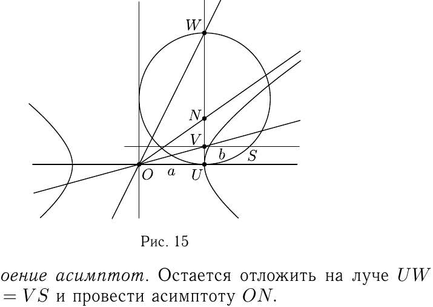

# Глава III

## § 3

Решения упражнений к [[../beklemishev/bekl_g03_s03_liniya_vtorogo_poryadka_zadannaya_obshchim_uravneniem|Беклемишев, §3. Линия второго порядка, заданная общим уравнением]] (упражнения 1–8).

**1.** *Линия описана около параллелограмма, если его вершины лежат на линии, а остальные точки на ней не лежат. Докажите, что такая линия второго порядка обязательно центральная, и центр её совпадает с центром параллелограмма.*

Решение. Две противоположные стороны параллелограмма — пара параллельных хорд, а прямая, соединяющая их середины, — сопряжённый им диаметр — проходит через центр параллелограмма. То же верно и относительно второй пары сторон, параллельных указанному диаметру.

**2.** *На плоскости нарисованы эллипс, гипербола и парабола. Как с помощью циркуля и линейки построить их оси симметрии и асимптоты гиперболы?*

Решение. 1. *Гипербола.*

**а.** Строим центр. Проводим две параллельные хорды, $AB$ и $A'B'$. Через их середины проходит диаметр $CC'$. Центр гиперболы $O$ — середина хорды $DD'$, лежащей на диаметре (рис. 12).

**б.** Строим оси симметрии. Точки $E$, $E'$, $G$, $G'$ — точки пересечения гиперболы с окружностью, центр которой в центре гиперболы $O$. Они симметричны относительно осей гиперболы, так как при симметрии относительно этих осей и окружность, и гипербола остаются на месте. Поэтому оси симметрии — биссектрисы углов между прямыми $EG'$ и $E'G$ (рис. 13).

**в.** Находим мнимую полуось $b$. Строим диаметр, сопряжённый уже построенному. Для этого проводим хорды $A'K$ и $B'K'$, параллельные уже построенному диаметру. Искомый диаметр соединяет их середины $M$ и $M'$ (рис. 14). Нам потребуется вершина гиперболы $U$.

---
**стр. 47**

---

---
**стр. 48**

---

Угловые коэффициенты двух сопряжённых диаметров гиперболы в канонической системе координат удовлетворяют условию
$$\frac{1}{a^2}-k_1k_2\frac{1}{b^2}=0,$$
или $(ak_1)(ak_2)=b^2$. Следовательно, отрезок длины $b$ может быть построен как среднее пропорциональное отрезков длин $ak_1$ и $ak_2$. Построение среднего пропорционального — хорошо известный приём. Проводим перпендикуляр к вещественной оси гиперболы в её вершине $U$ (рис. 15). Если $V$ и $W$ — точки его пересечения с сопряжёнными диаметрами, то отрезки $UV$ и $UW$ имеют длины $ak_1$ и $ak_2$. Строим окружность с диаметром $UW$ и её пересечение $S$ с перпендикуляром, проведённым в точке $V$ к этому диаметру. Длина отрезка $VS$ равна мнимой полуоси гиперболы $b$.

**г.** Построение асимптот. Остаётся отложить на луче $UW$ отрезок $UN=VS$ и провести асимптоту $ON$.

2. *Эллипс.* Построение центра и осей симметрии эллипса производится так же, как для гиперболы.

3. *Парабола.* У параболы необходимо построить только ось симметрии. Для этого проводим пару параллельных хорд и соединяем их середины. Полученная прямая имеет асимптотическое направление, т. е. параллельна оси параболы. Ось делит пополам перпендикулярные ей хорды и, значит, перпендикулярна тому направлению, которому сопряжена. Поэтому проводим пару хорд, перпендикулярных асимптотическому направлению. Прямая, соединяющая их середины, и есть ось параболы.

---
**стр. 49**

---

**3.** *Докажите, что сумма квадратов длин хорд, лежащих на сопряжённых диаметрах эллипса, постоянна.*

Решение. Зададим эллипс каноническим уравнением. Пусть $(x,y)$ — координаты точки $M$ пересечения прямой $y=kx$ с эллипсом. Тогда квадрат длины радиуса $OM$ равен
$$x^2+y^2=\frac{a^2b^2(1+k^2)}{b^2+a^2k^2}.$$

Угловые коэффициенты двух сопряжённых направлений связаны равенством $kk'=-b^2/a^2$. Поэтому квадрат длины радиуса $OM'$ сопряжённого направления равен
$$x'^2+y'^2=\frac{a^2b^2(1+b^4/(a^4k^2))}{b^2+b^4/(a^2k^2)}=\frac{a^4k^2+b^4}{a^2k^2+b^2}.$$

После упрощения сумма $x^2+y^2+x'^2+y'^2$ оказывается равной $a^2+b^2$. Поэтому сумма квадратов длин хорд равна $4(a^2+b^2)$.

**4.** *Не приводя уравнение к каноническому виду, найдите центр и асимптоты гиперболы*
$$3x^2+10xy+3y^2-2x+2y-9=0.$$

Решение. Координаты центра гиперболы находятся из системы уравнений
$$3x+5y-1=0,$$
$$5x+3y+1=0$$
и равны $(-1/2, 1/2)$. Асимптотические направления находятся из уравнения
$$3\alpha^2+10\alpha\beta+3\beta^2=0.$$

Их угловые коэффициенты равны $\beta_1/\alpha_1=-3$ и $\beta_2/\alpha_2=-1/3$. Поэтому уравнения асимптот
$$\left(y-\frac12\right)=-3\left(x+\frac12\right) \quad \text{и} \quad \left(y-\frac12\right)=-\frac13\left(x+\frac12\right),$$
или, после упрощений,
$$3x+y+1=0 \quad \text{и} \quad x+3y-1=0.$$

**5.** *Не приводя уравнение к каноническому виду, скажите, как называется линия с уравнением*
$$3x^2+10xy+3y^2-2x+2y-1=0.$$

---
**стр. 50**

---

Решение. Подсчитаем значения инвариантов:
$$\delta=\begin{vmatrix}3&5\\5&3\end{vmatrix}=-16<0$$
и
$$\Delta=\begin{vmatrix}3&5&-1\\5&3&1\\-1&1&-1\end{vmatrix}=0.$$

Таким образом, линия — пара пересекающихся прямых.

**6.** *Как разложить на множители левую часть уравнения из задачи 5?*

Решение. Прямые, составляющие пару пересекающихся прямых, — это прямые асимптотических направлений, проходящие через центр линии. В вычислениях координат центра и угловых коэффициентов асимптотических направлений свободный член уравнения линии не участвует. Поэтому эти величины такие же, как и для гиперболы в задаче 4. В результате прямые, на которые распадается линия из задачи 5, — это асимптоты гиперболы из задачи 4. Мы получаем следующее разложение на множители:
$$3x^2+10xy+3y^2-2x+2y-1=(3x+y+1)(x+3y-1).$$

**7.** *Напишите уравнение касательной к линии $x^2-2xy+3y^2=3$ в точке $M_0(0,1)$.*

Решение. В соответствии с общим уравнением касательной к линии второго порядка, касательная в точке с координатами $(x_0,y_0)$ имеет уравнение $xx_0-(xy_0+x_0y)+3yy_0=3$. Подставляя сюда данные нам координаты точки касания, получаем
$$-x+3y=3.$$

**8.** *Определите, к какому классу линий второго порядка относится линия с уравнением*
$$x^2+3xy+y^2+7x+8y=11$$
*в декартовой системе координат.*

Решение. Возникает желание начать с приведения уравнения к каноническому виду, без оснований допустив, что система координат прямоугольная. Между тем, именно общая декартова система координат в условии задачи служит косвенным указанием на то, что следует поискать другой путь.

---
**стр. 51**

---

Посмотрим на определитель
$$\delta=\begin{vmatrix}1&\tfrac32\\[2pt]\tfrac32&1\end{vmatrix}.$$

Он меньше нуля, и, следовательно, линия принадлежит гиперболическому типу. Гипербола или пара пересекающихся прямых? На этот вопрос можно ответить несколькими путями.

1) Можно заметить, что при $x=-y$ уравнение принимает вид: $-x^2-x-11=0$. Это означает, что исследуемая линия не пересекается с прямой $x+y=0$. Между тем, пара пересекающихся прямых пересекается с любой прямой. Следовательно, линия — гипербола.

2) Это отлично, но как быть, если такой прямой заметить не удалось? Более универсальный способ опирается на следующее: гипербола, в отличие от пары прямых, не содержит своего центра. Центр линии находится из простой системы линейных уравнений, которая в нашем случае после умножения уравнений на $2$ может быть записана так:
$$\begin{cases}2x+3y+7=0,\\3x+2y+8=0.\end{cases}$$

Её решение $x=-2$, $y=-1$ не удовлетворяет уравнению линии.

3) Можно вычислить определитель третьего порядка
$$\begin{vmatrix}1&3/2&7/2\\3/2&1&4\\7/2&4&-11\end{vmatrix},$$
обращение которого в нуль для центральной линии равносильно существованию особой точки (т. е. центра, принадлежащего линии). Его отличие от нуля говорит о том, что линия — гипербола.
