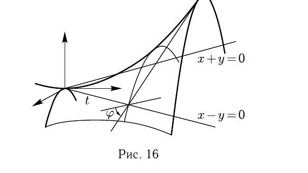

# Глава III

## § 4

Решения упражнений к [[../beklemishev/bekl_g03_s04_poverkhnosti_vtorogo_poryadka|Беклемишев, §4. Поверхности второго порядка]] (упражнения 1–6).

**1.** *Докажите, что линия пересечения поверхности второго порядка с плоскостью, которая целиком на ней не лежит, есть алгебраическая линия не выше второго порядка. Сколько общих точек могут иметь прямая и поверхность второго порядка?*

---
**стр. 52**

---

Решение. Пусть $\Phi(x,y,z)=0$ — уравнение поверхности в декартовой системе координат. Подставим в него выражения для координат точки, взятые из параметрических уравнений плоскости:
$$x=x_0+up_1+vq_1, \quad y=y_0+up_2+vq_2, \quad z=z_0+up_3+vq_3.$$

Мы получим уравнение $F(u,v)=0$ относительно параметров, левая часть которого будет многочленом степени не выше второй. Вспомним, что значения параметров, соответствующие какой-либо точке $M$ на плоскости, — это координаты $M$ во внутренней системе координат плоскости $M_0,\mathbf{p},\mathbf{q}$. Теперь утверждение становится очевидным.

Аналогично доказывается, что прямая линия может иметь одну или две общие точки с поверхностью или лежать на ней целиком. Может, конечно, и не иметь общих точек с ней.

**2.** *Найдите уравнение и определите вид поверхности, получаемой вращением вокруг оси аппликат прямой линии:*
*а)* $x=1+t$, $y=3+t$, $z=3+t$;
*б)* $x=1+t$, $y=1+t$, $z=3+t$.

Решение. а) Точка $M(x,y,z)$ принадлежит поверхности тогда и только тогда, когда она находится на таком же расстоянии от оси $Oz$, что и точка $M_1(x_1,y_1,z)$ на прямой, имеющая то же самое значение $z$. Это условие выражается равенством $|MN|=|M_1N|$, где $N(0,0,z)$ — основание перпендикуляра, опущенного из $M$ на $Oz$, т. е. равенством $x^2+y^2=x_1^2+y_1^2$. Выразим $x_1$ и $y_1$ через $z$ исходя из уравнения прямой: $x_1=z-2$, $y_1=z$. В результате уравнение поверхности можно записать так:
$$x^2+y^2=(z-2)^2+z^2.$$

Это уравнение можно преобразовать к виду $x^2+y^2-2z^2+4z=4$, или
$$x^2+y^2-2(z^2-2z+1)=2.$$

Переносом начала координат в точку с координатами $(0,0,1)$ уравнение преобразуется к виду
$$\frac{x^2}{2}+\frac{y^2}{2}-z'^2=1$$
— каноническому уравнению однополостного гиперболоида.

---
**стр. 53**

---

б) Повторяя те же рассуждения, получим $x_1=y_1=z-2$. При этом равенство $|MN|=|M_1N|$ запишется как
$$x^2+y^2-2(z-2)^2=0.$$

Это уравнение становится каноническим уравнением конуса, если перенести начало координат в точку $O'(0,0,2)$.

**3.** *Докажите, что прямолинейные образующие гиперболического параболоида, принадлежащие одному семейству, все параллельны некоторой плоскости.*

Решение. Пусть гиперболический параболоид задан каноническим уравнением $b^2x^2-a^2y^2=2a^2b^2z$. Выпишем систему уравнений, задающую произвольную прямолинейную образующую одного из семейств:
$$\begin{cases}\lambda(bx+ay)=2\mu ab,\\\mu(bx-ay)=\lambda abz.\end{cases}$$

Компоненты направляющего вектора этой прямой — детерминанты
$$\begin{vmatrix}\lambda a&0\\-\mu a&-\lambda ab\end{vmatrix}, \quad \begin{vmatrix}0&\lambda b\\-\lambda ab&\mu b\end{vmatrix}, \quad \begin{vmatrix}\lambda b&\lambda a\\\mu b&-\mu a\end{vmatrix},$$
т. е. $(-\lambda^2a^2b,\ \lambda^2ab^2,\ -2\lambda\mu ab)$.

При $\lambda=0$ все компоненты образующей равны нулю, но из первого уравнения образующей видно, что в этом случае и $\mu=0$, а оба параметра в нуль обращаться не должны. Таким образом, в качестве направляющего вектора прямолинейной образующей может быть выбран вектор с координатами $(-a,b,-2\mu/\lambda)$, $\lambda\mu\neq0$.

Теперь видно, что при любых ненулевых $\lambda$ и $\mu$ направляющий вектор образующей ортогонален вектору $\mathbf{n}(b,a,0)$ и потому параллелен плоскости с нормальным вектором $\mathbf{n}$.

Результат можно описать так. Плоскость $z=0$ пересекает поверхность по паре прямых $b^2x^2-a^2y^2=0$. Эти прямые, конечно, прямолинейные образующие. Плоскость, проходящая через одну из этих прямых и ось $Oz$, обладает тем свойством, что ей параллельны все прямолинейные образующие из того же семейства, что и образующая, через которую проведена плоскость.

Особенно нагляден результат в случае $a=b$, когда образующие в плоскости $z=0$ взаимно перпендикулярны. Рассмотрим две перпендикулярные прямые (рис. 16) и будем передвигать

---
**стр. 54**

---

одну из них вдоль другой, одновременно поворачивая на подходящий угол вокруг той же прямой. (При этом она будет оставаться перпендикулярной оси поворота.)

Как должны быть связаны сдвиг $t$ и угол поворота $\varphi$? Рассмотрим точку $M$ на образующей $x=y$; $z=0$, отстоящую на $t$ от начала координат. Её координаты $(l,l,0)$, где $l=t/\sqrt2$. Вторая образующая, проходящая через эту точку, принадлежит семейству $\lambda(x+y)=2\mu a$; $\mu(x-y)=\lambda az$. Подставляя координаты $M$, находим, что для этой образующей $\lambda/\mu=a/l$. Используя найденное выше выражение для компонент направляющего вектора образующей, получаем для данной образующей вектор, коллинеарный $(a^2,-a^2,2l)$. Тангенс угла $\varphi_t$ этого вектора с плоскостью $z=0$ равен $2l/(a^2\sqrt2)$, или
$$\operatorname{tg}\varphi_t=\frac{t}{a^2}.$$

Сдвигая образующую $x+y=z=0$ от начала координат на $t$, мы должны поворачивать её на $\operatorname{arctg}(t/a^2)$.

Поверхность, составленная из прямых линий, пересекающих фиксированную прямую (ось), называется *коноидом*. Гиперболический параболоид — один из коноидов. Каждая его образующая является осью: её пересекают все образующие того семейства, к которому она не принадлежит.

**4.** *На гиперболическом параболоиде с уравнением*
$$\frac{x^2}{a^2}-\frac{y^2}{b^2}=2z$$
*лежат параболы: $y=0$, $x^2=2a^2z$ и $x=0$, $y^2=-2b^2z$. Пусть точки $A_1$ и $B_1$ на первой параболе и точки $A_2$ и $B_2$ на второй все находятся на одинаковом расстоянии от плоскости $z=0$.*

---
**стр. 55**

---

*Докажите, что прямые $A_1B_2$, $A_1A_2$, $B_1A_2$ и $B_1B_2$ являются прямолинейными образующими.*

Решение. Пусть точки находятся на расстоянии $h^2$ от плоскости $z=0$. Тогда точка $A_1$ имеет координаты $(\sqrt2\,ah,0,h^2)$, а $B_2$ — координаты $(0,-\sqrt2\,bh,-h^2)$. Примем $A_1$ за начальную точку прямой, а вектор $\overrightarrow{A_1B_2}$ — за направляющий. Уравнения прямой $A_1B_2$ будут следующими:
$$x=\sqrt2\,ah(1-t); \quad y=-\sqrt2\,bht; \quad z=h^2(1-2t).$$

Подставим эти значения в уравнение гиперболического параболоида:
$$\frac{x^2}{a^2}-\frac{y^2}{b^2}=2h^2(1-t)^2-2h^2t^2=2h^2(1-2t)=2z.$$

Мы видим, что при любом $t$ координаты точки на прямой удовлетворяют уравнению поверхности, т. е. прямая целиком принадлежит поверхности.

Остальные прямые лежат на поверхности в силу её симметрии относительно плоскостей $x=0$ и $y=0$.

**5.** *Найдите проекцию линии пересечения двухполостного гиперболоида $-x^2+y^2-z^2=1$ и конуса $5x^2-3y^2+4z^2=0$ на плоскость $z=0$.*

Решение. Линия пересечения определяется системой
$$5x^2-3y^2+4z^2=0, \qquad -x^2+y^2-z^2=1.$$

Если мы исключим $z$, т. е. найдём его из второго уравнения и подставим в первое, то получим уравнение $x^2+y^2=4$. Это уравнение — следствие системы и потому определяет множество, содержащее линию пересечения. Так как в уравнение не входит $z$, это множество — цилиндр с образующими, параллельными вектору $\mathbf{e}_3$. Пересекая цилиндр плоскостью $z=0$, мы получим уравнение окружности $z=0$, $x^2+y^2=4$, на которой лежит проекция. Однако проекция не совпадает с окружностью. Исключая $z$, мы должны были запомнить условие $z^2=-x^2+y^2-1\geqslant0$. Итак, проекция — две дуги окружности $x^2+y^2=4$, $y^2-x^2\geqslant1$ на плоскости $z=0$.

**6.** *Докажите, что никакая плоскость не пересекает эллиптический параболоид по гиперболе.*

---
**стр. 56**

---

Решение. Эллиптический параболоид с уравнением
$$\frac{x^2}{a^2}+\frac{y^2}{b^2}=2z$$
лежит в полупространстве, уравнение которого в канонической системе координат $z\geqslant0$. Плоскости с уравнениями $z=c$ ($c>0$) пересекают параболоид по эллипсам. Плоскость $z=0$ — по паре мнимых пересекающихся прямых. Если же плоскость не параллельна плоскости $z=0$, то в полупространстве $z\geqslant0$ лежит только её полуплоскость. В этом случае линия пересечения эллиптического параболоида с плоскостью должна умещаться в полуплоскости. Гипербола, однако, в полуплоскость не помещается, так как любая прямая либо её пересекает, либо проходит между ветвями гиперболы.

Аналитическое доказательство можно получить так: запишем уравнение параболоида в виде $b^2x^2+a^2y^2=2a^2b^2z$ и подставим в это уравнение координаты точки произвольной плоскости, заданной параметрическим уравнением
$$x=x_0+up_1+vq_1; \quad y=y_0+up_2+vq_2; \quad z=z_0+up_3+vq_3.$$

Мы получим уравнение на параметры $u$ и $v$, которое определяет линию пересечения поверхности с плоскостью во внутренней системе координат плоскости:
$$b^2(x_0+up_1+vq_1)^2+a^2(y_0+up_2+vq_2)^2=2a^2b^2(z_0+up_3+vq_3).$$

В этом уравнении нам понадобятся только члены со вторыми степенями $u$ и $v$. Выпишем эти члены:
$$u^2(b^2p_1^2+a^2p_2^2)+2uv(b^2p_1q_1+a^2p_2q_2)+v^2(b^2q_1^2+a^2q_2^2).$$

Теперь можно составить детерминант $\delta$, определяющий тип линии:
$$\delta=\begin{vmatrix}b^2p_1^2+a^2p_2^2 & b^2p_1q_1+a^2p_2q_2\\b^2p_1q_1+a^2p_2q_2 & b^2q_1^2+a^2q_2^2\end{vmatrix}=a^2b^2(p_1q_2-p_2q_1)^2.$$

Детерминант неотрицателен, следовательно, линия пересечения не может быть линией гиперболического типа.
