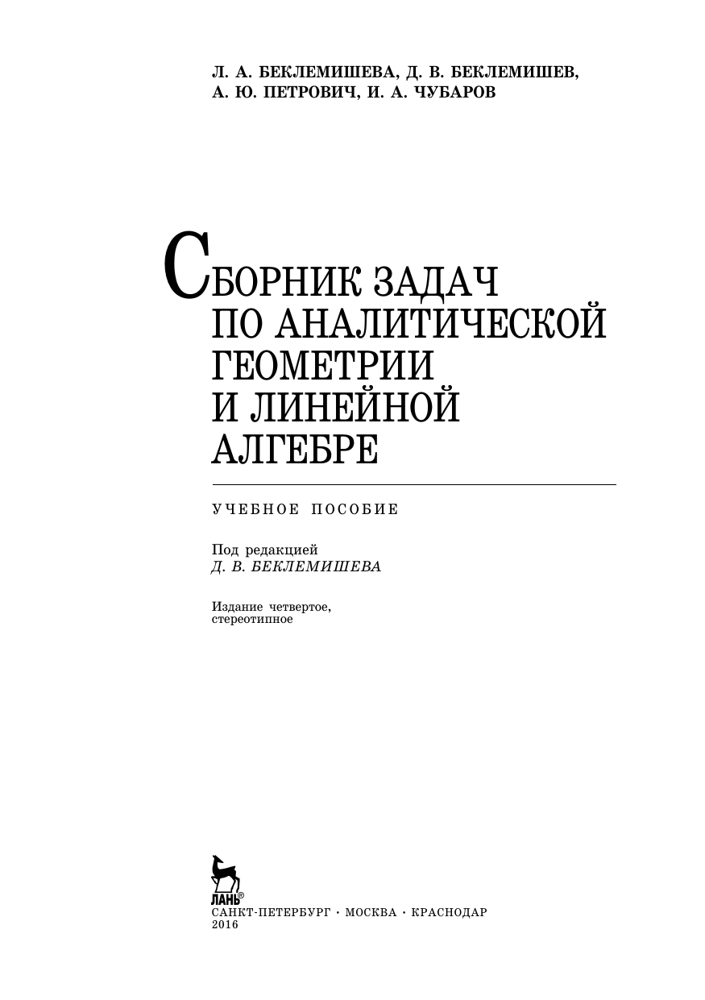

# ВСТУПИТЕЛЬНЫЕ МАТЕРИАЛЫ

## Вступительные материалы

---
**стр. 1**
---

Л. А. БЕКЛЕМИШЕВА, Д. В. БЕКЛЕМИШЕВ,
А. Ю. ПЕТРОВИЧ, И. А. ЧУБАРОВ

**СБОРНИК ЗАДАЧ**
**ПО АНАЛИТИЧЕСКОЙ**
**ГЕОМЕТРИИ**
**И ЛИНЕЙНОЙ**
**АЛГЕБРЕ**

УЧЕБНОЕ ПОСОБИЕ

Под редакцией
*Д. В. БЕКЛЕМИШЕВА*

Издание четвертое,
стереотипное

ЛАНЬ®

САНКТ-ПЕТЕРБУРГ • МОСКВА • КРАСНОДАР

2016

---
**стр. 2**
---

ББК 22.151, 22.143
Б 42

Беклемишева Л. А., Беклемишев Д. В.,
Петрович А. Ю., Чубаров И. А.

Б 42   Сборник задач по аналитической геометрии и линейной алгебре: Учебное пособие / Под ред. Д. В. Беклемишева. — 4-е изд., стер. — СПб.: Издательство «Лань», 2016. — 496 с.: ил. — (Учебники для вузов. Специальная литература).

ISBN 978-5-8114-0861-0

Сборник соответствует объединенному курсу аналитической геометрии и линейной алгебры. Приведено большое количество задач по следующим разделам: системы линейных уравнений, матрицы и определители, кривые и поверхности второго порядка, преобразования плоскости, линейные преобразования линейных, евклидовых и унитарных пространств, функции на линейном пространстве, аффинные и точечные евклидовы пространства, тензоры. Имеются теоретические введения ко всем разделам. Кроме задач, способствующих усвоению основных понятий, приведены серии типовых задач с ответами. Некоторые типовые и более сложные задачи снабжены полными решениями.

Все составители задачника имеют опыт преподавания математики в МФТИ, и этот опыт нашел отражение в содержании сборника.

Пособие предназначено для студентов физико-математических, инженерно-физических и инженерно-технических специальностей вузов.

ББК 22.151, 22.143

Обложка

*А. Ю. ЛАПШИН*

*Охраняется Законом РФ об авторском праве. Воспроизведение всей книги или любой ее части запрещается без письменного разрешения издателя. Любые попытки нарушения закона будут преследоваться в судебном порядке.*

© Издательство «Лань», 2016
© Коллектив авторов, 2016
© Издательство «Лань»,
художественное оформление, 2016

---
**стр. 3**
---

# СОДЕРЖАНИЕ

Предисловие 5

**Глава 1. Векторы и координаты** 7

    § 1. Линейные соотношения 9
    § 2. Скалярное произведение векторов 15
    § 3. Векторное и смешанное произведения векторов 20
    § 4. Замена базиса и системы координат 24

**Глава 2. Прямая и плоскость** 30

    § 5. Прямая на плоскости 30
    § 6. Плоскость и прямая в пространстве 38

**Глава 3. Кривые второго порядка** 56

    § 7. Геометрические свойства кривых второго порядка и их канонические уравнения 61
    § 8. Касательные к кривым второго порядка 71
    § 9. Общая теория кривых второго порядка 75

**Глава 4. Поверхности второго порядка** 81

    § 10. Уравнения множеств в пространстве и элементарная теория поверхностей второго порядка 81
    § 11. Общая теория поверхностей второго порядка 93

**Глава 5. Преобразования плоскости. Группы** 103

    § 12. Линейные и аффинные преобразования плоскости 103
    § 13. Понятие о группах 120

**Глава 6. Матрицы** 127

    § 14. Определители 127
    § 15. Операции с матрицами 134
    § 16. Ранг матрицы 150

**Глава 7. Системы линейных уравнений** 156

    § 17. Системы линейных уравнений с определителем, отличным от 0 162
    § 18. Системы линейных однородных уравнений 164
    § 19. Системы линейных уравнений общего вида 166

**Глава 8. Линейные пространства** 175

    § 20. Примеры пространств. Базис и размерность 180

---
**стр. 4**
---

§ 21. Сумма и пересечение подпространств 185

§ 22. Комплексные линейные пространства 188

**Глава 9. Линейные отображения и преобразования** 191

§ 23. Основные свойства линейных отображений и преобразований 191

§ 24. Инвариантные подпространства, собственные векторы и собственные значения линейных преобразований 213

**Глава 10. Евклидовы и унитарные пространства** 238

§ 25. Скалярное произведение. Матрица Грама 241

§ 26. Геометрия евклидова пространства 248

§ 27. Унитарные пространства 260

**Глава 11. Линейные преобразования евклидовых и унитарных пространств** 265

§ 28. Примеры линейных преобразований евклидова пространства. Сопряженное преобразование 266

§ 29. Самосопряженные и ортогональные преобразования 271

§ 30. Линейные преобразования унитарного пространства 279

**Глава 12. Функции на линейном пространстве** 285

§ 31. Линейные функции 285

§ 32. Билинейные и квадратичные функции 292

**Глава 13. Аффинные и точечные евклидовы пространства** 307

§ 33. Аффинные пространства 307

§ 34. Точечные евклидовы пространства 315

**Глава 14. Тензоры** 323

§ 35. Определение тензора. Тензорные обозначения, пространственные матрицы 328

§ 36. Алгебраические операции с тензорами 334

§ 37. Тензоры в евклидовом пространстве 341

§ 38. Поливекторы и внешние формы 343

**Решения** 348

**Ответы и указания** 373

**Банк столбцов и матриц** 465

**Список литературы** 495
