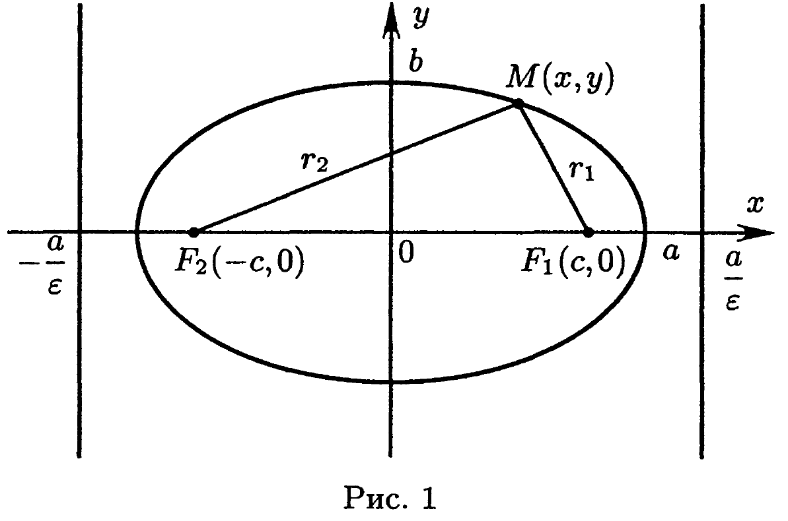
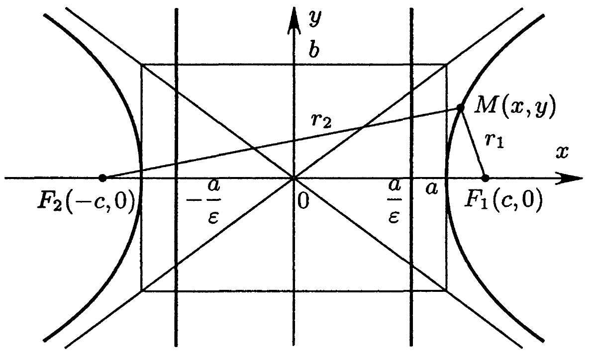
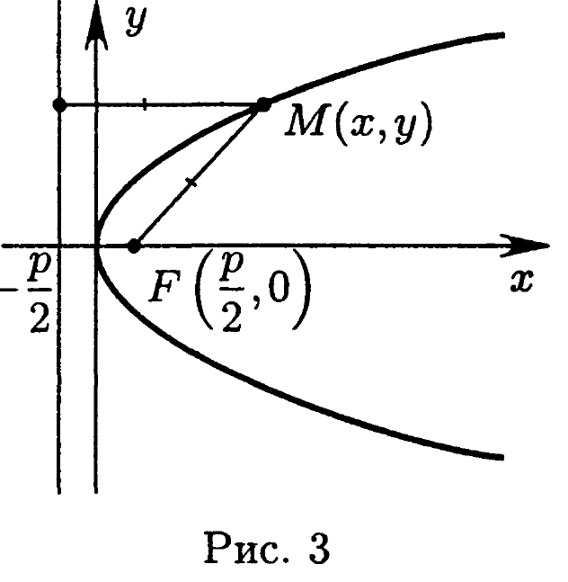

# Глава 3. Кривые второго порядка

## Введение

---
**стр. 56**
---

В этой главе используются следующие основные понятия: *алгебраическая кривая, кривая второго порядка, окружность, эллипс, гипербола, парабола, центр, вершина, ось, полуось, фокус, директриса, эксцентриситет, хорда, асимптота, касательная, нормаль, каноническое уравнение кривой второго порядка, центральная кривая*.

Система координат, если не оговорено противное, прямоугольная.

*Алгебраической кривой* на плоскости называется множество всех точек плоскости, координаты $(x,y)$ которых в некоторой декартовой системе координат удовлетворяют уравнению $\Phi(x,y)=0$, где $\Phi(x,y)$ — многочлен от переменных $x,y$ (максимальная степень $k+l$ одночленов $a_{kl}x^ky^l$, входящих в $\Phi(x,y)$, называется *порядком* кривой). Порядок кривой не изменяется при замене системы координат.

*Общее уравнение кривой второго порядка* имеет вид
$$Ax^2+2Bxy+Cy^2+2Dx+2Ey+F=0 \quad (A^2+B^2+C^2\neq0). \quad (1)$$
Выражение $Ax^2+2Bxy+Cy^2$ называется *квадратичной частью*, $2Dx+2Ey$ — *линейной частью*, $F$ — *свободным членом* уравнения (1).

Для всякой кривой второго порядка существует прямоугольная система координат, называемая *канонической*, в которой уравнение кривой имеет канонический вид (см. таблицу 1 на с.59).

Уравнение окружности радиуса $R$ с центром в точке $C(x_0,y_0)$ имеет вид
$$(x-x_0)^2+(y-y_0)^2=R^2. \quad (2)$$

Эллипс (рис. 1) имеет каноническое уравнение
$$\frac{x^2}{a^2}+\frac{y^2}{b^2}=1, \quad (3)$$
где $a\geqslant b>0$; большая полуось эллипса равна $a$, а малая равна $b$. Вершинами эллипса называются точки $(\pm a,0)$, $(0,\pm b)$. Фокусами эллипса называются точки $F_1(c,0)$ и $F_2(-c,0)$, где $c=\sqrt{a^2-b^2}$. При $a=b$ эллипс есть окружность. Площадь части плоскости, ограниченной эллипсом, равна $\pi ab$.

---
**стр. 57**

---

Гипербола (рис. 2) имеет каноническое уравнение
$$\frac{x^2}{a^2}-\frac{y^2}{b^2}=1, \quad (4)$$
где $a>0$, $b>0$; действительная полуось равна $a$, мнимая полуось равна $b$. Вершинами гиперболы называются точки $(\pm a,0)$. Фокусами

гиперболы называются точки $F_1(c,0)$ и $F_2(-c,0)$, где $c=\sqrt{a^2+b^2}$. Асимптотами гиперболы являются прямые $y=\pm\dfrac{b}{a}x$. Гипербола $\dfrac{x^2}{a^2}-\dfrac{y^2}{b^2}=-1$ называется *сопряженной* к гиперболе $\dfrac{x^2}{a^2}-\dfrac{y^2}{b^2}=1$, она имеет те же асимптоты, но ее ветви расположены в другой паре вертикальных углов между асимптотами.

Парабола (рис. 3) имеет каноническое уравнение
$$y^2=2px, \quad (5)$$
где $p>0$. Число $p$ называют *параметром параболы*. Вершиной параболы является начало координат, фокусом — точка $F(p/2,0)$.

Эксцентриситет эллипса или гиперболы равен $\varepsilon=c/a$; для эллипса $0\leqslant\varepsilon<1$, для гиперболы $\varepsilon>1$. Эксцентриситет параболы равен 1.

---
**стр. 58**

---

Расстояние от точки $M(x,y)$, принадлежащей кривой второго порядка, до фокуса кривой называется фокальным радиусом точки $M$. Для эллипса (3) и гиперболы (4)
$$|MF_1|=|a-\varepsilon x|, \quad |MF_2|=|a+\varepsilon x|.$$
Фокальный радиус точки $M(x,y)$, принадлежащей параболе (5), равен $x+p/2$.

Прямые $x=\pm a/\varepsilon$ называются директрисами эллипса (3) и гиперболы (4), (см. рис. 1 и 2). Директрисой параболы (5) называется прямая $x=-p/2$, (см. рис. 3).

Отношение расстояния от любой точки эллипса, гиперболы или параболы до фокуса к ее расстоянию до соответствующей директрисы равно $\varepsilon$. Хорды, проходящие через фокус кривой второго порядка, называются ее фокальными хордами.

Пусть точка $M(x_0,y_0)$ лежит на кривой второго порядка. Касательная к кривой в этой точке определяется уравнением
$$\frac{xx_0}{a^2}+\frac{yy_0}{b^2}=1 \quad \text{для эллипса} \quad \frac{x^2}{a^2}+\frac{y^2}{b^2}=1;$$
$$\frac{xx_0}{a^2}-\frac{yy_0}{b^2}=1 \quad \text{для гиперболы} \quad \frac{x^2}{a^2}-\frac{y^2}{b^2}=1;$$
$$yy_0=p(x+x_0) \quad \text{для параболы} \quad y^2=2px$$
и уравнением
$$Axx_0+B(xy_0+x_0y)+Cyy_0+D(x+x_0)+E(y+y_0)+F=0$$
для кривой, заданной общим уравнением (1).

Пусть кривая второго порядка задана уравнением $\Phi(x,y)=0$. Точка $O(x_0,y_0)$ называется ее *центром*, если $\Phi(x_0+\alpha,y_0+\beta)=\Phi(x_0-\alpha,y_0-\beta)$ для любых чисел $\alpha$ и $\beta$. Точка $O(x_0,y_0)$ — центр кривой тогда и только тогда, когда ее координаты удовлетворяют системе уравнений
$$Ax_0+By_0+D=0,$$
$$Bx_0+Cy_0+E=0. \quad (6)$$

Если линия второго порядка содержит хотя бы одну точку, то каждый ее центр — центр симметрии, и каждый центр симметрии есть центр; однако центр определен и для линий, являющихся пустым множеством.

Кривая называется центральной, если она имеет единственный центр. Центральными являются кривые первых пяти типов в табл. 1. Для них центр — начало канонической системы координат. Кривая является центральной в том и только том случае, когда
$$\delta=\begin{vmatrix}A & B\\ B & C\end{vmatrix}\neq0.$$

---
**стр. 59**

---

**Т а б л и ц а 1**

| Название | Каноническое уравнение |
|---|---|
| Эллипс | $\dfrac{x^2}{a^2}+\dfrac{y^2}{b^2}=1, \quad a\geqslant b>0$ |
| «Мнимый эллипс» (пустое множество) | $\dfrac{x^2}{a^2}+\dfrac{y^2}{b^2}=-1, \quad a\neq0,\ b\neq0$ |
| «Пара мнимых пересекающихся прямых» (точка) | $\dfrac{x^2}{a^2}+\dfrac{y^2}{b^2}=0$ |
| Гипербола | $\dfrac{x^2}{a^2}-\dfrac{y^2}{b^2}=1$ |
| Пара пересекающихся прямых | $\dfrac{x^2}{a^2}-\dfrac{y^2}{b^2}=0$ |
| Парабола | $y^2=2px, \quad p>0$ |
| Пара параллельных прямых | $y^2=a^2, \quad a\neq0$ |
| «Пара мнимых параллельных прямых» (пустое множество) | $y^2=-a^2, \quad a\neq0$ |
| Пара совпавших прямых | $y^2=0$ |

Всего имеется девять типов канонических уравнений кривых второго порядка. В таблице 1 перечислены эти уравнения вместе с названиями соответствующих типов кривых.

Решение задачи приведения уравнения кривой второго порядка к каноническому виду включает отыскание канонического уравнения кривой и канонической системы координат. Приведение к каноническому виду позволяет вычислить параметры кривой и определить ее расположение относительно исходной системы координат.

Приведение общего уравнения (1) кривой к каноническому виду осуществляется в несколько шагов. Опишем их.

1. Если исходная система координат не прямоугольная, перейдем к какой-нибудь прямоугольной системе координат. При этом общий вид уравнения (1) не изменится. Далее считаем систему координат прямоугольной.

2. Если в уравнении (1) коэффициент $B\neq0$, то следует перейти к такой системе координат, чтобы в преобразованном уравнении коэффициент при произведении $x'y'$ был равным нулю. Для этого систему координат надо повернуть вокруг начала координат на угол $\varphi$:
$$x=x'\cos\varphi-y'\sin\varphi, \quad y=x'\sin\varphi+y'\cos\varphi. \quad (7)$$
Значение $\varphi$ находится из уравнения
$$2B\cos2\varphi+(C-A)\sin2\varphi=0 \quad (8)$$

---
**стр. 60**

---

или, при $A\neq C$,
$$\operatorname{tg}2\varphi=\frac{2B}{A-C}. \quad (9)$$
Уравнение (8) можно свести к уравнению
$$\operatorname{tg}^2\varphi+\frac{A-C}{B}\operatorname{tg}\varphi-1=0. \quad (10)$$
Из нескольких возможных значений $\varphi$ можно брать любое. При $A=C$ можно положить $\varphi=\pi/4$. Затем следует вычислить $\sin\varphi,\cos\varphi$, подставить их в формулы (7) и выполнить в уравнении (1) замену координат.

3. Если в уравнении (1) уже нет члена с произведением переменных, следует, если возможно, добиться исчезновения линейных членов. Это достигается переносом начала координат. А именно: если в уравнении имеются квадрат какой-либо переменной и одноименный линейный член, то эта пара дополняется до полного квадрата и начало координат переносится вдоль оси координат так, чтобы в преобразованном уравнении линейного члена уже не было.

П р и м е р.
$$Ax^2+2Dx=A\left(x^2+\frac{2D}{A}x+\frac{D^2}{A^2}\right)-\frac{D^2}{A}=$$
$$=A\left(x+\frac{D}{A}\right)^2-\frac{D^2}{A}=Ax'^2-\frac{D^2}{A},$$
где $x'=x+D/A$.

4. Если уравнение (1) содержит лишь три члена: квадрат одной переменной, первую степень другой и свободный член, то с помощью переноса начала координат вдоль оси, соответствующей линейному члену, можно добиться исчезновения свободного члена.

П р и м е р.
$$Ax^2+2Ey+F=Ax^2+2E\left(y+\frac{F}{2E}\right)=0.$$
Замена $y+F/2E=y'$ дает $Ax^2+2Ey'=0$.

После выполнения указанных в пп. 1–4 действий мы придем к уравнению, которое отличается от канонического разве что числовым множителем, порядком координат, переносом членов из одной части уравнения в другую или знаком коэффициента при линейном члене. Такое уравнение удобно называть «почти каноническим». Для приведения уравнения к окончательной канонической форме следует выполнить необходимые преобразования уравнения и замены системы координат. При этом можно обойтись без смены ориентации исходной системы координат. Изменение порядка координат достигается дополнительным поворотом на 90°. Чтобы сменить знак коэффициента при линейном члене уравнения, можно дополнительно

---
**стр. 61**

---

повернуть систему координат на 180°. При этом почти каноническое уравнение $Ax^2+2Ey=0$ преобразуется $x^2=(-2E/A)y$, замена $x=-y'$, $y=x'$ приводит к $y'^2=(-2E/A)x'$. Если $E/A>0$, то требуется еще замена $x'=-x''$, $y'=-y''$, после чего получается каноническое уравнение параболы $y''^2=2px''$, где $p=E/A>0$.

Для отыскания канонической системы координат выписываем каждую из формул перехода, подставляя одну в другую и получаем окончательное выражение исходных координат через канонические
$$x=\alpha_1X+\alpha_2Y+\alpha_0, \quad y=\beta_1X+\beta_2Y+\beta_0.$$
Коэффициенты этих формул дают координаты начала канонической системы координат $O^*(\alpha_0,\beta_0)$ и ее базисных векторов $\mathbf{E}_1(\alpha_1,\beta_1)$, $\mathbf{E}_2(\alpha_2,\beta_2)$ относительно исходной системы координат.

Если система уравнений (6) совместна (в частности, если $\delta=AC-B^2\neq0$ — случай центральной кривой), то упрощение уравнения кривой удобно начинать с переноса начала координат в центр кривой: $x=x_0+x'$, $y=y_0+y'$. Тогда в преобразованном уравнении коэффициенты при $x'$ и $y'$ обращаются в нуль (см. задачи 9.18, 9.20). Затем следует выполнить шаг 2.

В первом приближении тип кривой второго порядка можно определить по упрощению ее уравнения по знаку $\delta$.

Кривая относится к эллиптическому типу (эллипс, мнимый эллипс, пара мнимых пересекающихся прямых) при $\delta>0$; к гиперболическому типу (гипербола, пара пересекающихся прямых) при $\delta<0$; к параболическому типу (остальные типы в табл. 1) при $\delta=0$.

Уравнение второго порядка (1) в подходящей декартовой системе координат приводится к одному из канонических уравнений:
1) $x^2+y^2=1$; 2) $x^2+y^2=-1$; 3) $x^2+y^2=0$; 4) $x^2-y^2=1$;
5) $x^2-y^2=0$; 6) $y^2=x$; 7) $y^2=1$; 8) $y^2=-1$; 9) $y^2=0$.

Таким образом, существуют 9 аффинных типов кривых второго порядка.
